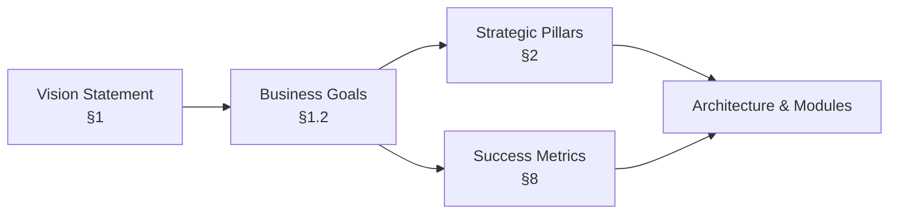
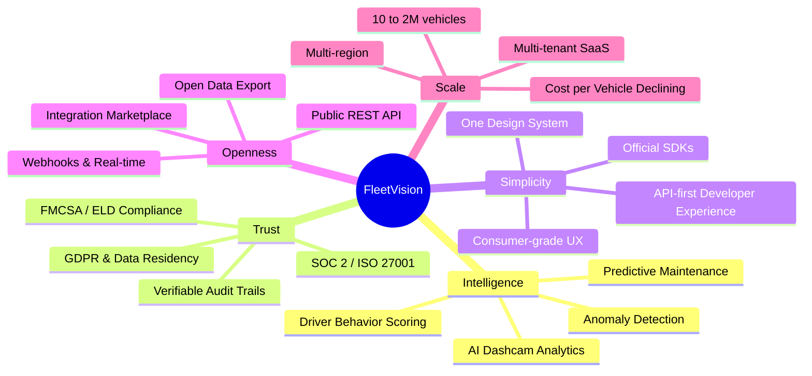
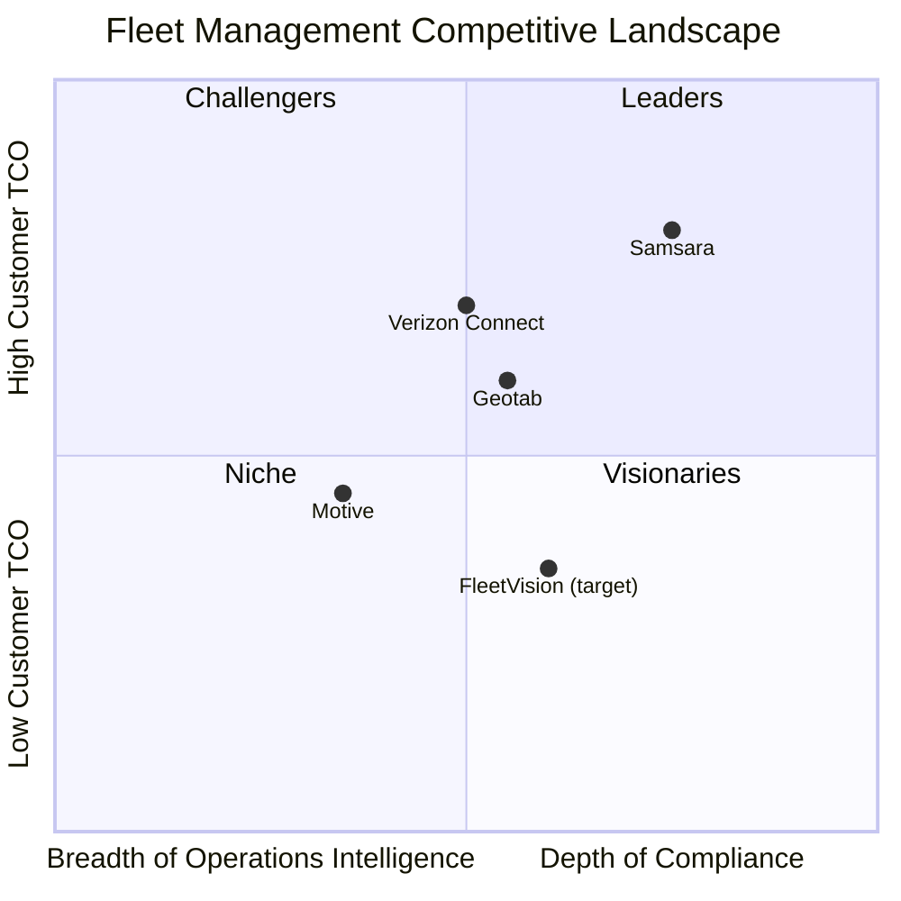
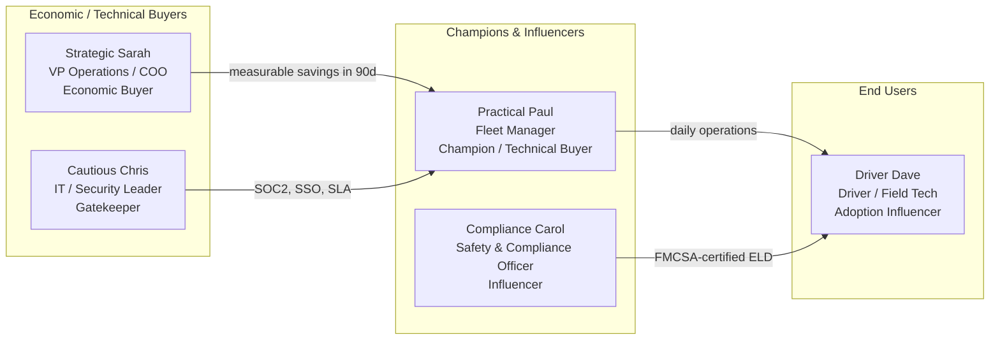
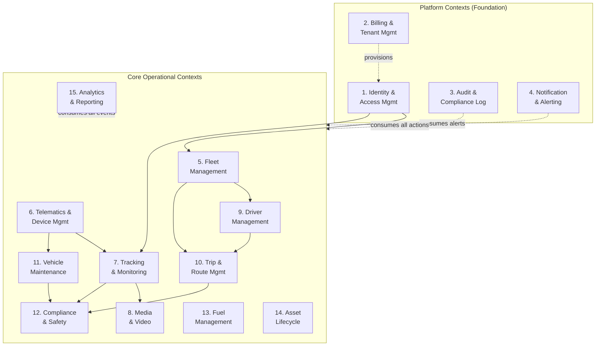
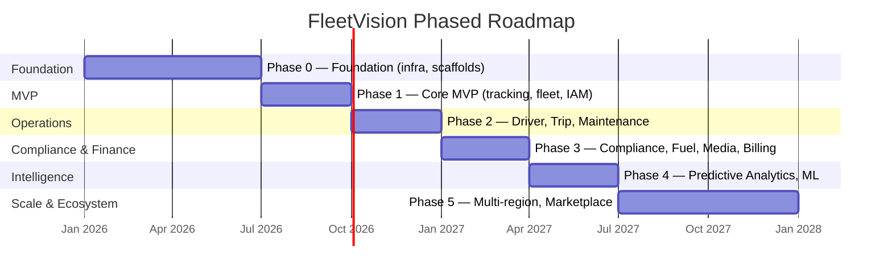
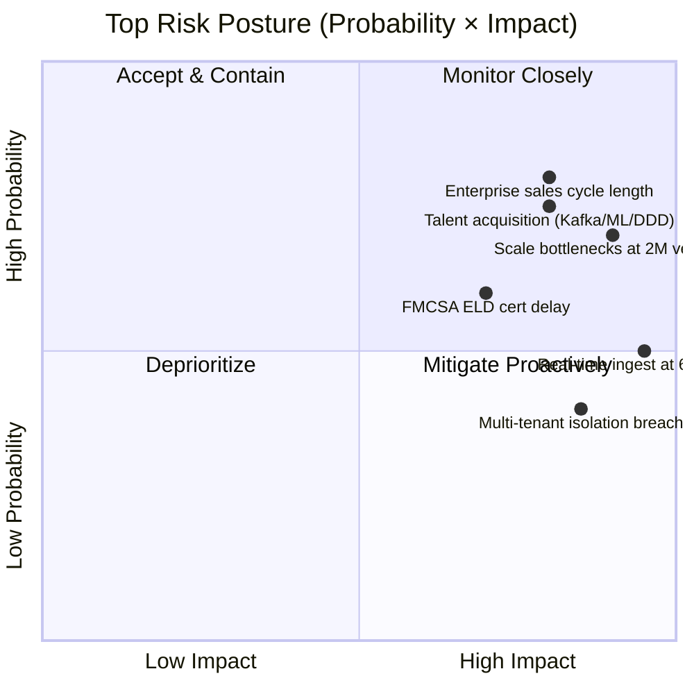
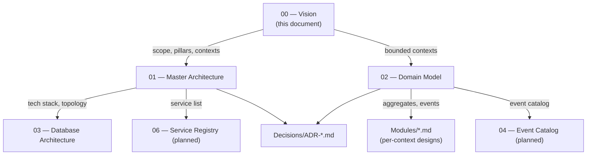

# FleetVision — Vision Document

**Version:** 2.1.0
**Status:** Approved — Foundation
**Date:** 2026-08-02
**Owner:** Chief Product Officer / Chief Software Architect
**Classification:** Confidential — Product Strategy

> **About this version.** This is the canonical foundation document. It supersedes all prior drafts of the project vision. It is the authoritative source for scope, personas, the module/context inventory, and success metrics. The companion documents — `01_Master_Architecture.md`, `02_Domain_Model.md`, `03_Database_Architecture.md` — implement this vision and must remain consistent with it. When the code and this document disagree, this document wins until the Architecture Review Board (ARB) approves a formal change.
>
> **What changed in 2.1.0.** Two additive, non-breaking sections requested for foundation completeness: **§1.2 Business Goals** (the committed business outcomes — distinct from the metrics in §8 that measure them) and **§5.2 Main Features Catalogue** (the feature-level scope, traced to bounded contexts and module designs). No existing section was renumbered; all externally referenced anchors (§2, §6/§6.1, §8/§8.3, §9) are preserved. The previous Out-of-Scope subsection moved from §5.2 to §5.3 to keep a logical In-Scope → Features → Out-of-Scope order.

---

## Table of Contents

1. [Vision Statement](#1-vision-statement)
   - 1.1 [North Star Metric](#11-north-star-metric)
   - 1.2 [Business Goals](#12-business-goals)
2. [Strategic Pillars](#2-strategic-pillars)
3. [Market & Competitive Landscape](#3-market--competitive-landscape)
4. [Target Customers & Personas](#4-target-customers--personas)
5. [Product Scope](#5-product-scope)
   - 5.1 [In Scope (Capability Areas)](#51-in-scope-ten-capability-areas)
   - 5.2 [Main Features Catalogue](#52-main-features-catalogue)
   - 5.3 [Out of Scope](#53-out-of-scope)
6. [Bounded Contexts (Module Inventory)](#6-bounded-contexts-module-inventory)
7. [Phased Roadmap](#7-phased-roadmap)
8. [Success Metrics](#8-success-metrics)
9. [Risks & Guardrails](#9-risks--guardrails)
10. [Non-Goals](#10-non-goals)
11. [Document Dependencies](#11-document-dependencies)

---

## 1. Vision Statement

> **FleetVision is the platform of record for commercial fleet intelligence — unifying real-time visibility, compliance, maintenance, and AI-driven safety into one trustworthy, open system that scales from ten trucks to two million vehicles.**

The fleet-management software market is fragmented across point tools (ELD-only, dashcam-only, maintenance-only) and incumbents that grew by acquisition rather than design. Operators stitch together 4–6 disjoint products and reconcile data by hand. FleetVision's bet is that a **greenfield, domain-driven, event-native platform** — built once, correctly, around the fleet domain — can deliver measurably superior operational outcomes (cost, safety, compliance, uptime) at a fraction of the integration pain.

### 1.1 North Star Metric

**Customer Fleet Value Delivered (CFVD)** — the aggregate annual savings, revenue protection, and operational improvement attributable to FleetVision, measured in dollars per vehicle per year.

| Horizon | CFVD Target | ROI vs Subscription |
|---|---|---|
| Year 1 | $800 / vehicle / yr | 3× |
| Year 3 | $1,800 / vehicle / yr | 5× |
| Year 5 | $3,200 / vehicle / yr | 7× |

Every architectural decision in the companion documents exists to move CFVD up and cost-per-vehicle down — the latter target being **< $1 / vehicle / month by Year 5**.

### 1.2 Business Goals

Business Goals state *what we are committing to achieve as a company*. They are deliberately separate from the Success Metrics in §8: goals are the commitments; metrics are how those commitments are measured. Every goal below is traceable upward to the Vision Statement (§1) and downward to a Strategic Pillar (§2) and one or more Success Metrics (§8). This traceability is mandatory — a goal that maps to no pillar and no metric is a goal we are not actually pursuing.

| # | Business Goal | Horizon | Primary Pillar (§2) | How it is Measured (§8) |
|---|---|---|---|---|
| **BG-1** | **Become the platform of record for commercial fleet intelligence** — the system fleets trust for their authoritative vehicle, driver, and operational state. | 5 yr | Openness, Trust | Enterprise tenants (Y5: 2,000); ARR (Y5: $250M); platform availability |
| **BG-2** | **Deliver measurable customer ROI ≥ 5× subscription cost by Year 3** via cost, safety, compliance, and uptime gains. | 1–3 yr | Intelligence, Simplicity | CFVD (Y3: $1,800/veh/yr); gross retention; NRR |
| **BG-3** | **Drive customer cost-per-vehicle to <$1/month by Year 5** through multi-tenant economics, not feature cuts. | 5 yr | Scale | Cost per vehicle / month (Y5: <$1); gross margin (Y5: 80%+) |
| **BG-4** | **Lead on AI-driven safety and predictive maintenance** — insights delivered inline in operator workflows, not in a side tab. | 2–4 yr | Intelligence | Phase 4 exit criteria; ML accuracy & predictive-maintenance value; AI dashcam adoption |
| **BG-5** | **Achieve enterprise procurement readiness** — security and compliance posture that removes friction from large deals. | 1–2 yr | Trust | FMCSA ELD self-certification (Phase 3); SOC 2 / ISO 27001; zero material security incidents |
| **BG-6** | **Build a defensible partner & integration ecosystem** that compounds faster than incumbents allow. | 3–5 yr | Openness | 100+ integration partners (Phase 5); marketplace; SDK adoption |
| **BG-7** | **Scale from 10 trucks to 2,000,000 vehicles on one architecture** with no re-platforming. | 5 yr | Scale | Vehicles (Y5: 2M); GPS events/sec (Y5: 600K peak); RPO/RTO |
| **BG-8** | **Operate as a high-throughput, high-reliability engineering org** that ships safely and often. | Continuous | Trust, Simplicity | Deployment frequency (20+/wk); change failure rate (<5%); coverage (>80%) |

**Goal-priority rule (tie-breaker).** When a single decision would advance one goal at the expense of another, the order of precedence is: **BG-5 (Trust/compliance) > BG-2 (Customer ROI) > BG-7 (Scale) > BG-1 (Platform of record) > BG-4 (Intelligence) > BG-6 (Ecosystem) > BG-3 (Cost efficiency) > BG-8 (Engineering velocity).** Trust is non-negotiable because a single material breach voids BG-1, BG-2, and BG-5 simultaneously; cost efficiency sits low only because it is pursued *as an enabler of the others*, never by cutting safety or correctness.

---

## 2. Strategic Pillars

Five pillars frame every product and architecture choice. They are the lens through which trade-offs are resolved.

| Pillar | Commitment | Architecture Enabler |
|---|---|---|
| **🔍 Intelligence** | Predictive maintenance, behavior scoring, AI dashcam anomaly detection — insights delivered inline, not in a separate "AI tab" | ML-native analytics context; event-driven feature pipeline; on-device + cloud inference |
| **🛡️ Trust** | Bank-grade security; FMCSA + GDPR compliance; transparent, verifiable audit trails | CQRS + event sourcing on audit-critical aggregates; hash-chained logs; zero-trust mesh |
| **✨ Simplicity** | Consumer-grade UX for operators, drivers, and developers | One design system; progressive disclosure; API-first with official SDKs |
| **🌐 Openness** | API-first; pre-built integrations; marketplace; open data export | Standards-based public API (REST + webhooks + real-time); published event catalog |
| **📈 Scale** | From 10 trucks to 2,000,000 vehicles; multi-tenant; global | Partition-first data design; polyglot persistence; horizontal autoscaling; multi-region |

---

## 3. Market & Competitive Landscape

### 3.1 Competitive Position

FleetVision targets the intersection of **deep compliance** (matching Motive's ELD strength) and **broad operational intelligence** (approaching Samsara's platform breadth) — at a structurally lower TCO enabled by multi-tenant economics and an event-native architecture.

### 3.2 Sustainable Advantages

| Advantage | Why it compounds |
|---|---|
| **Unified data model** | One domain model across all modules → no reconciliation tax; analytics quality improves with every event |
| **Event-native core** | Every state change is an event → replay, audit, and integration are free byproducts, not bolt-ons |
| **Open ecosystem** | Published event catalog + SDKs → partners build integrations faster than incumbents allow |
| **Multi-tenant economics** | Cost-per-vehicle declines with scale → pricing headroom as fleet sizes grow |
| **Compliance trust** | Hash-chained, audit-ready by construction → enterprise procurement accelerates |

---

## 4. Target Customers & Personas

### 4.1 Ideal Customer Profile

| Attribute | Criterion |
|---|---|
| Fleet size | 100 – 50,000+ vehicles |
| Industries | Trucking & freight, field services, utilities, construction, passenger transport, government, cold chain |
| Geography (Year 1) | United States, Canada |
| Trigger | Fleet operations > 15% of opex, OR significant compliance burden (FMCSA, tachograph) |
| Budget | $50K – $5M annual fleet-tech spend |

### 4.2 Buyer & User Personas

| Persona | Wins When |
|---|---|
| **Strategic Sarah** (VP Ops / COO) | Measurable cost / safety / uptime improvement within 90 days |
| **Practical Paul** (Fleet Manager) | Real-time visibility + less manual reconciliation |
| **Compliance Carol** (Safety Officer) | FMCSA-certified ELD + defensible audit trail |
| **Cautious Chris** (IT / Security) | SOC 2, SSO, MFA, contractual SLAs |
| **Driver Dave** (Driver) | Frictionless mobile app that respects their time and dignity |

### 4.3 Anti-Personas (Not Targeted)

Consumer / personal tracking; sub-50-vehicle micro-fleets; single-vehicle owner-operators; pure hardware resellers; industries with no fleet compliance burden.

---

## 5. Product Scope

### 5.1 In Scope (Ten Capability Areas)

1. Real-time fleet visibility & tracking
2. Driver management & behavior
3. Vehicle maintenance (preventive + corrective)
4. Compliance automation (ELD / HOS / DVIR)
5. Fuel management & fraud detection
6. Trip & route management
7. Asset lifecycle & TCO
8. Analytics, reporting & predictive intelligence
9. Multi-tenant administration
10. Integration platform (API, webhooks, marketplace)

### 5.2 Main Features Catalogue

§5.1 names the *capability areas*; this catalogue names the *features* customers buy and operators use. Each feature is the smallest unit of customer-visible value that can be demoed, priced, adopted, and de-scoped independently. The **Phase** column is the phase in which the feature first reaches GA; the **BC #** maps to the bounded context in §6 that owns it, and the **Module** column points to the per-context design in `Modules/*.md`. This is the authoritative feature list — if a feature is not here, it is not on the roadmap.

| Feature | Capability Area (§5.1) | BC # (§6) | Module | Phase |
|---|---|---|---|---|
| **Real-time vehicle map** (live position, status, trail, <10s freshness) | 1 | 7 | `Tracking-Monitoring.md`, `MapEngine.md` | P1 |
| **Live fleet dashboard & health** (online/offline, fault, idle counts) | 1 | 5, 7 | `Fleet-Management.md` | P1 |
| **Multi-vendor device onboarding** (auto-detect protocol, FOTA, provisioning) | 1, 9 | 6 | `Telemetry-Device-Management.md`, `DeviceGateway.md` | P1 |
| **Telemetry ingestion pipeline** (GPS/IO/CAN/J1708/ODB, decode → enrich → persist) | 1 | 6, 7 | `DeviceGateway.md`, `GPSEngine.md` | P1 |
| **Tenant, user & RBAC management** (multi-tenant isolation, SSO/MFA, roles) | 9 | 1, 2 | `Identity-Access-Management.md`, `Authentication.md`, `Tenant-Management.md` | P1 |
| **Geofences, POIs & zones** (create, alert on enter/exit/dwell) | 1 | 7 | `Tracking-Monitoring.md`, `MapEngine.md` | P1 |
| **Rule-based alerts & notifications** (speed, geofence, IO, schedule; multi-channel) | 1, 8 | 4, 7 | `Notification-Alerting.md`, `Alarm-Engine.md` | P1 |
| **Driver roster, assignment & Hours-of-Service** | 2, 4 | 9, 12 | `Driver-Management.md`, `Compliance-Safety.md` | P2 |
| **Driver behavior scoring** (harsh brake/accel/corner, speeding, coaching) | 2, 8 | 9, 15 | `Driver-Management.md`, `Analytics-Reporting.md` | P2 |
| **Trips, stops & route replay** (auto trip detection, historical replay) | 6 | 10 | `Trip-Route-Management.md` | P2 |
| **Preventive maintenance plans** (time/distance/condition-based triggers) | 3 | 11 | `Vehicle-Maintenance.md` | P2 |
| **Work orders & CMMS** (create, assign, complete; parts & labor; history) | 3 | 11 | `CMMS.md`, `Vehicle-Maintenance.md` | P2 |
| **DVIR (Driver Vehicle Inspection Reports)** | 3, 4 | 11, 12 | `Compliance-Safety.md`, `Vehicle-Maintenance.md` | P2 |
| **ELD / HOS compliance & certification** (FMCSA self-certified ELD) | 4 | 12 | `Compliance-Safety.md` | P3 |
| **Fuel management & fraud detection** (transactions, exceptions, siphon) | 5 | 13 | `Fuel-Management.md` | P3 |
| **Video surveillance & MDVR** (live view, playback, dual-cam, edge storage) | 1, 8 | 8 | `VideoPlatform.md` | P3 |
| **AI dashcam events** (FCW, LDW, PCW, distraction, smoking, phone) | 2, 8 | 8, 15 | `VideoPlatform.md`, `Analytics-Reporting.md` | P3 |
| **Billing, plans & quota** (usage metering, invoicing, overage) | 9 | 2 | `Billing-Tenant-Management.md` | P3 |
| **Asset lifecycle & TCO** (acquisition → assignment → disposal, depreciation) | 7 | 14 | `Asset-Lifecycle.md`, `Asset-Management.md` | P3 |
| **Audit & compliance log** (hash-chained, immutable, exportable audit trail) | 4, 9 | 3 | `Audit-Compliance-Log.md` | P3 |
| **Predictive maintenance** (failure probability, RUL, recommended actions) | 3, 8 | 11, 15 | `Vehicle-Maintenance.md`, `Analytics-Reporting.md` | P4 |
| **Operational & executive analytics** (dashboards, scheduled reports, exports) | 8 | 15 | `Reporting.md`, `Analytics-Reporting.md` | P4 |
| **Public API & webhooks** (REST, real-time events, signed webhooks) | 10 | 1, 4 | `API_Design.md`, `SDK.md` | P3→GA |
| **Integration marketplace & SDKs** (partner apps, official SDKs) | 10 | 1 | `SDK.md` | P5 |
| **Multi-region deployment & data residency** | 9 | 1, 2 | `Deployment.md`, `Security.md` | P5 |

> **Relationship to the bounded contexts (§6).** A feature may cross contexts — e.g., *AI dashcam events* spans the Media & Video context (clip capture) and the Analytics context (inference & scoring). Per the note in §6, a bounded context is an ownership and language boundary, not a deployable unit; feature delivery is therefore coordinated across the owning contexts rather than owned by a single service.

### 5.3 Out of Scope

Manufacturing hardware; insurance underwriting; freight brokerage; vehicle leasing/financing; general ERP/accounting; consumer ride-hailing; warehouse management; driver recruiting/HRIS.

---

## 6. Bounded Contexts (Module Inventory)

The platform is decomposed into **15 bounded contexts** using Domain-Driven Design. Each context is a team-ownership unit; a context may be realized by one or more microservices when runtime characteristics demand it (polyglot language, scaling boundary, or distinct lifecycle). This inventory is the authoritative source for the service registry in `01_Master_Architecture.md` and the aggregate/event catalogs in `02_Domain_Model.md`.

### 6.1 Context Catalogue

| # | Bounded Context | Classification | Phase | Primary Domain Expert |
|---|---|---|---|---|
| 1 | Identity & Access Management | Platform (shared kernel) | MVP | Security & IAM Lead |
| 2 | Billing & Tenant Management | Platform (revenue) | MVP | Finance / Product |
| 3 | Audit & Compliance Log | Platform (trust) | MVP | Security / Compliance |
| 4 | Notification & Alerting | Platform (engagement) | MVP | Platform Engineering |
| 5 | Fleet Management | Core | MVP | Fleet Operations Manager |
| 6 | Telematics & Device Management | Core | MVP | IoT / Telematics Engineer |
| 7 | Tracking & Monitoring | Core (highest throughput) | MVP | Tracking Engineer |
| 8 | Media & Video | Core (differentiator) | P3 | Computer Vision Lead |
| 9 | Driver Management | Core | P2 | Driver Management / HR |
| 10 | Trip & Route Management | Core | P2 | Dispatcher / Logistics Manager |
| 11 | Vehicle Maintenance | Core | P2 | Maintenance Manager |
| 12 | Compliance & Safety | Core (regulatory shield) | P3 | Compliance Officer |
| 13 | Fuel Management | Core | P3 | Fuel Program Manager |
| 14 | Asset Lifecycle | Supporting (financial) | P3 | Asset Manager / Finance |
| 15 | Analytics & Reporting | Generic + Core (ML) | P3 → P4 | Data / BI Lead |

> **Note on context → service mapping.** A bounded context is an ownership and language boundary, not necessarily a deployable unit. Telematics, Tracking, Analytics, and Media contexts each split into multiple services (ingestion vs. lifecycle; engine vs. reporting; streamer vs. metadata vs. AI) for runtime reasons. The authoritative service list lives in `01_Master_Architecture.md` Appendix A (Service Registry).

---

## 7. Phased Roadmap

The roadmap is outcome-driven; each phase has explicit exit criteria. Dates are planning anchors, not commitments.

| Phase | Exit Criteria |
|---|---|
| **Phase 0 — Foundation** | All contexts scaffolded on staging; auth + empty dashboard live; CI/CD, mesh, observability operational |
| **Phase 1 — Core MVP** | 100 vehicles live; first paying customer; design-partner NPS > 40 |
| **Phase 2 — Operations** | 10 design partners in production; 1,000+ vehicles |
| **Phase 3 — Compliance & Finance** | FMCSA ELD self-certification; GA launch; 50 paying customers; $8M ARR run rate |
| **Phase 4 — Intelligence** | ML models in production with measured accuracy; predictive maintenance delivering value |
| **Phase 5 — Scale & Ecosystem** | Multi-region live; 100+ integration partners; marketplace; Gartner MQ placement |

---

## 8. Success Metrics

### 8.1 Scale Targets (drive every NFR in companion documents)

| Metric | Year 1 | Year 3 | Year 5 |
|---|---|---|---|
| Vehicles | 50,000 | 500,000 | 2,000,000 |
| Enterprise tenants | 50 | 500 | 2,000 |
| GPS events / sec (peak) | 15,000 | 150,000 | 600,000 |
| API requests / sec | 5,000 | 50,000 | 200,000 |
| Platform availability | 99.95% | 99.95% | 99.99% |
| RPO / RTO | <1min / <15min | <1min / <10min | <30s / <5min |
| Cost per vehicle / month | < $3 | < $2 | < $1 |

### 8.2 Business Health

| Metric | Year 1 | Year 3 | Year 5 |
|---|---|---|---|
| ARR | $8M | $75M | $250M |
| Gross retention | 90% | 92% | 95% |
| Net revenue retention | 105% | 120% | 130% |
| Gross margin | 65% | 73% | 80%+ |

### 8.3 Product Quality

| Metric | Target |
|---|---|
| Real-time tracking freshness | 99.9% of vehicles with position < 10s old |
| API latency (read / write P99) | < 150ms / < 300ms |
| GPS ingestion latency (device → dashboard) | < 5s P99 |
| Deployment frequency | 20+ per week |
| Change failure rate | < 5% |
| Test coverage | > 80% |
| Security incidents (material) | 0 per year |

---

## 9. Risks & Guardrails

| Guardrail | Rule |
|---|---|
| **Capacity** | 2× headroom on every autoscaling target; load-test at **10× projected scale** before each milestone |
| **Customer concentration** | No single customer > 10% of revenue |
| **Runway** | Maintain ≥ 18 months of cash runway |
| **Tech debt** | 20% of engineering capacity reserved for debt reduction |
| **Reversibility** | Avoid one-way-door decisions; prefer reversible architecture choices |

---

## 10. Non-Goals

To preserve focus, the following are explicitly **not** goals of the platform:

- Building our own telematics hardware (we integrate multi-vendor hardware)
- Becoming an insurance underwriter or freight broker
- Replacing general-purpose ERP / accounting systems
- Consumer ride-hailing or personal vehicle tracking
- Driver recruiting / full HRIS replacement
- Warehouse management or freight forwarding

---

## 11. Document Dependencies

| Document | Relationship to Vision |
|---|---|
| `01_Master_Architecture.md` | Implements scope & pillars via technology choices, topology, and ADRs |
| `02_Domain_Model.md` | Details the 15 bounded contexts: aggregates, events, ubiquitous language, invariants |
| `03_Database_Architecture.md` | Realizes the persistence strategy implied by the domain model and scale targets |
| `Modules/*.md` | Per-context deep designs, consistent with the three foundation documents |
| `Decisions/ADR-*.md` | Records irreversible / significant decisions with rationale |

---

*This Vision is the foundation of all future modules. It is reviewed quarterly by the Architecture Review Board. Changes that alter scope, pillars, or the bounded-context inventory require ARB approval.*
