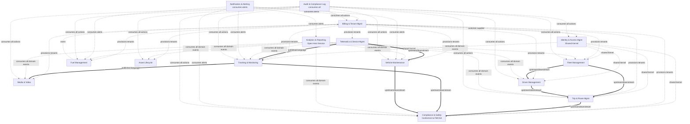
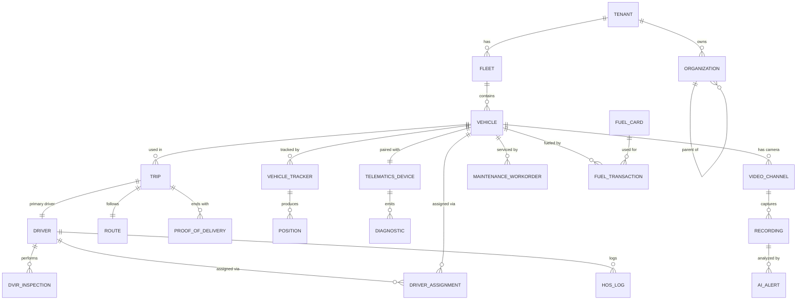
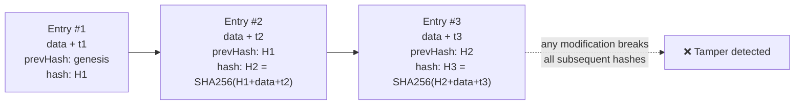

# FleetVision — Domain Model

**Version:** 2.0.0
**Status:** Approved — Foundation
**Date:** 2026-08-02
**Owner:** Chief Software Architect / Domain Experts
**Classification:** Confidential — Domain Reference

> **About this version.** This is the canonical Domain-Driven Design (DDD) reference. It supersedes all prior domain-model drafts. Every architectural decision in `01_Master_Architecture.md` and every persistence choice in `03_Database_Architecture.md` derives from the model defined here. If the code and this document disagree, **this document wins** until a formal change is approved by the Architecture Review Board (ARB).

---

## Table of Contents

1. [Bounded Contexts](#1-bounded-contexts)
2. [Context Map](#2-context-map)
3. [Aggregates](#3-aggregates)
4. [Entity Relationships](#4-entity-relationships)
5. [Domain Events](#5-domain-events)
6. [Permissions (Canonical Catalog)](#6-permissions-canonical-catalog)
7. [Ubiquitous Language](#7-ubiquitous-language)
8. [Domain Invariants](#8-domain-invariants)
9. [Business Rules (FMCSA)](#9-business-rules-fmcsa)

---

## 1. Bounded Contexts

A **Bounded Context** is an explicit boundary within which a particular domain model applies — its own ubiquitous language, aggregates, and rules. FleetVision decomposes the fleet domain into **15 bounded contexts**, each a team-ownership unit that maps to one or more microservices (see `01_Master_Architecture.md` §3 Service Registry).

| # | Context | Strategic Classification | Phase | Service(s) | Domain Expert |
|---|---|---|---|---|---|
| 1 | **Identity & Access Management** | Supporting (shared kernel) | MVP | `identity-service` | Security & IAM Lead |
| 2 | **Billing & Tenant Management** | Supporting (revenue) | MVP | `billing-service` | Finance / Product |
| 3 | **Audit & Compliance Log** | Supporting (trust) | MVP | `audit-log-service` | Security / Compliance |
| 4 | **Notification & Alerting** | Supporting (engagement) | MVP | `notification-service` | Platform Engineering |
| 5 | **Fleet Management** | Core | MVP | `fleet-management-service` | Fleet Operations Mgr |
| 6 | **Telematics & Device Management** | Core | MVP | `device-management-service` + `device-gateway-service` + `telemetry-ingestion-service` | IoT / Telematics Eng |
| 7 | **Tracking & Monitoring** | Core (highest throughput) | MVP | `tracking-service` | Tracking Engineer |
| 8 | **Media & Video** | Core (differentiator) | P3 | `media-service` + `media-streamer` + `video-ai-engine` | Computer Vision Lead |
| 9 | **Driver Management** | Core | P2 | `driver-management-service` | Driver Mgmt / HR |
| 10 | **Trip & Route Management** | Core | P2 | `trip-management-service` | Dispatcher |
| 11 | **Vehicle Maintenance** | Core | P2 | `vehicle-maintenance-service` | Maintenance Manager |
| 12 | **Compliance & Safety** | Core (regulatory) | P3 | `compliance-service` | Compliance Officer |
| 13 | **Fuel Management** | Core | P3 | `fuel-management-service` | Fuel Program Manager |
| 14 | **Asset Lifecycle** | Supporting (financial) | P3 | `asset-lifecycle-service` | Asset Manager / Finance |
| 15 | **Analytics & Reporting** | Generic + Core (ML) | P3→P4 | `analytics-engine` + `report-generation-service` | Data / BI Lead |

> **Context ≠ service.** A context is a language/ownership boundary. Several contexts split into multiple services for runtime reasons (polyglot language, scaling, lifecycle) — see the Service Registry. The "one context = one service" shorthand is incorrect.

---

## 2. Context Map

The Context Map shows how contexts relate — who is upstream (independent), who is downstream (dependent), and which DDD integration patterns connect them.



### 2.1 Integration Patterns

| From → To | Pattern | Meaning |
|---|---|---|
| Identity → All | **Shared Kernel** | `TenantId`, `UserId`, `OrgId` are shared primitives |
| Billing → All | **Customer-Supplier** | Billing publishes tenant/quota; all conform |
| External → Any | **Anti-Corruption Layer** | External data translated via adapters |
| Compliance → Regulations | **Conformist** | We follow FMCSA/DOT formats, not lead |
| Analytics → All | **Open Host Service** | Standardized KPIs available to all |
| All → All | **Published Language** | Kafka Avro event schemas (the Event Catalog, `04_Event_Catalog.md`) |
| Fleet → Tracking | **Upstream/Downstream** | Fleet publishes vehicle identity; Tracking consumes |

---

## 3. Aggregates

An **Aggregate** is a cluster of domain objects treated as a single consistency unit. Each has one **Aggregate Root** — the only entry point — which enforces **invariants** that must always hold within the boundary.

### 3.1 Aggregate Design Principles

| Principle | Rule |
|---|---|
| **Consistency boundary** | Invariants enforced within one transaction inside the aggregate; cross-aggregate consistency is eventual |
| **Reference by identity** | Aggregates reference others by ID only — never by direct object reference |
| **One transaction, one aggregate** | A transaction modifies exactly one aggregate; multi-aggregate coordination uses sagas/events |
| **Root is the gateway** | All modifications flow through the root's behaviors, never field setters |
| **Event-sourced when audit matters** | Audit-critical aggregates are event-sourced (state reconstructed from events) |

### 3.2 Aggregate Inventory (53 aggregates)

| # | Aggregate Root | Context | Event-Sourced? | Key Invariant |
|---|---|---|---|---|
| 1 | User | Identity | No | Email unique per tenant; one org per user |
| 2 | Role | Identity | No | Permissions ⊇ inherited roles |
| 3 | Organization | Identity | No | Hierarchy acyclic; depth ≤ 10 |
| 4 | APIKey | Identity | No | Scoped; expiry enforced |
| 5 | AuthSession | Identity | No | One active per login; tenant-bound |
| 6 | Credential | Identity | No | One password per user; Argon2id |
| 7 | ExternalIdentity | Identity | No | (issuer, subject) globally unique |
| 8 | Tenant | Billing | No | Tier determines features + quotas |
| 9 | Subscription | Billing | No | Active subscription required for access |
| 10 | **Invoice** | Billing | **Yes (ES)** | Immutable once generated |
| 11 | UsageMeter | Billing | No | Atomic increments; quota enforcement |
| 12 | AuditEntry | Audit | **Append-only** | Never modified or deleted; hash-chained |
| 13 | RetentionPolicy | Audit | No | Per-tenant + per-regulation |
| 14 | AlertRule | Notification | No | Tenant-scoped |
| 15 | **Notification** | Notification | **Yes (ES)** | At-least-once; idempotent processing |
| 16 | EscalationPolicy | Notification | No | Time-based chain |
| 17 | NotificationPreference | Notification | No | Per-user channels + quiet hours |
| 18 | Vehicle | Fleet | No | **VIN globally unique (ISO 3779)** |
| 19 | Fleet | Fleet | No | Unique name per org; capacity limits |
| 20 | VehicleGroup | Fleet | No | No circular memberships |
| 21 | FleetPolicy | Fleet | No | Internally consistent rules |
| 22 | TelematicsDevice | Telematics | No | Serial globally unique; one vehicle at a time |
| 23 | FirmwarePackage | Telematics | No | Signed + verified before install |
| 24 | **DeviceCommand** | Telematics | **Yes (ES)** | TTL enforced; expires if unacked |
| 25 | **VehicleTracker** | Tracking | **Yes (ES)** | Positions immutable once persisted |
| 26 | Geofence | Tracking | No | Boundary valid; minimum area |
| 27 | **TrackingSession** | Tracking | **Yes (ES)** | One active per vehicle |
| 28 | VideoChannel | Media | No | One source mode (RTSP xor JT1078 logical channel) |
| 29 | Recording | Media | No | Hash-chained for evidence integrity |
| 30 | StreamSession | Media | No | One source pull per live view |
| 31 | EventClip | Media | No | Linked to triggering domain event |
| 32 | AIAlert | Media | No | Severity-gated; contestable |
| 33 | DriverProfile | Driver | No | License valid for assignment |
| 34 | LicenseRecord | Driver | No | Expiry warnings at 30/14/7 days |
| 35 | Certification | Driver | No | Expiry > issue |
| 36 | DriverAssignment | Driver | No | One active per vehicle; one per driver |
| 37 | **Trip** | Trip | **Yes (ES)** | One vehicle + one primary driver; no overlap |
| 38 | Route | Trip | No | Waypoints form valid path |
| 39 | **Dispatch** | Trip | **Yes (ES)** | Requires HOS-eligible driver |
| 40 | **ProofOfDelivery** | Trip | **Yes (ES)** | Min: timestamp + geolocation |
| 41 | Load | Trip | No | HAZMAT classification if applicable |
| 42 | **MaintenanceWorkOrder** | Maintenance | **Yes (ES)** | Completed orders immutable |
| 43 | MaintenancePlan | Maintenance | No | Applicability validated |
| 44 | PartsInventory | Maintenance | No | Consumption ≤ stock; reorder triggers |
| 45 | Vendor | Maintenance | No | Rating from completed work |
| 46 | **HOSLog** | Compliance | **Yes (ES) + hash-chain** | Cryptographically tamper-proof |
| 47 | **DVIRInspection** | Compliance | **Yes (ES)** | Required pre/post-trip |
| 48 | **Incident** | Compliance | **Yes (ES)** | Reported within regulatory limits |
| 49 | ComplianceRecord | Compliance | No | Retained per regulatory minimum |
| 50 | SafetyScore | Compliance | No | Computed per FMCSA CSA |
| 51 | FuelCard | Fuel | No | One assignment (driver OR vehicle); limits |
| 52 | FuelTransaction | Fuel | No | Matched to vehicle proximity |
| 53 | FuelFraudAlert | Fuel | No | Raised when anomaly > threshold |

**Event-sourced aggregates (11):** VehicleTracker, Trip, Dispatch, ProofOfDelivery, MaintenanceWorkOrder, DeviceCommand, HOSLog, DVIRInspection, Incident, Invoice, Notification.

> **Two new contexts** (Media & Video, plus Auth sub-domain aggregates) are reflected here that were missing from prior drafts. Asset Lifecycle aggregates (VehicleAsset, DepreciationSchedule, DisposalRecord, ProcurementRecord) live in `Modules/Asset-Lifecycle.md`; Analytics aggregates (Dashboard, ReportDefinition, MLModel, KPIDefinition) live in `Modules/Analytics-Reporting.md`.

---

## 4. Entity Relationships

The high-value spine of the model. All cross-context references are **by identity (UUID)** — never via SQL foreign keys across service schemas, because services must not share a database boundary.



### 4.1 Cardinality Rules

| Relationship | Cardinality | Notes |
|---|---|---|
| Tenant → Organization | 1 → many | Root org per tenant |
| Organization → Sub-org | tree (max depth 10) | Recursive |
| Fleet → Vehicle | 1 → many | Vehicle in exactly one fleet |
| Vehicle ↔ TelematicsDevice | 1 → 1 | One active device per vehicle |
| Driver ↔ Vehicle (assignment) | many ↔ many (over time) | One active at a time |
| Vehicle → Trip | 1 → many | No overlapping active trips |
| Trip → Driver | 1 → 1 (primary) | Plus optional co-driver |
| Driver → HOSLog | 1 → many (per day) | One log per driver per day |
| Vehicle → Position | 1 → ∞ (time-series) | Millions over vehicle life |
| VideoChannel → Recording | 1 → many | Per-trigger clips |

---

## 5. Domain Events

A **Domain Event** is something that happened in the domain that domain experts care about. Events are **published** by aggregates on state change and **consumed** by other contexts for eventual consistency and side effects. The authoritative registry is `04_Event_Catalog.md`; the canonical naming convention and envelope live in `01_Master_Architecture.md` §6.

### 5.1 Event Design Principles

| Principle | Rule |
|---|---|
| **Named in past tense** | `VehicleRegistered`, not `RegisterVehicle` |
| **Immutable** | Once published, never changes; new version = new event type |
| **Self-describing** | Contains all data needed by consumers (no query-back) |
| **CloudEvents envelope** | All events wrapped in CloudEvents v1.0 + FleetVision extensions |
| **Versioned** | Breaking changes → new version (`.v2`) + upcaster |
| **Idempotent consumption** | Consumers deduplicate on `(aggregate_id, event_id)` |

### 5.2 Event Catalog (by Context — Top Events)

The full registry with producer/consumer/topic/schema is `04_Event_Catalog.md`. Representative events:

#### Fleet Management
| Event | Trigger |
|---|---|
| `fleet.vehicle.registered.v1` | New vehicle created |
| `fleet.vehicle.assigned.v1` | Vehicle assigned to fleet |
| `fleet.vehicle.decommissioned.v1` | Vehicle decommissioned |
| `fleet.vehicle.odometer.updated.v1` | Odometer reading changed |

#### Tracking & Monitoring
| Event | Trigger |
|---|---|
| `tracking.position.received.v1` | GPS position received (canonical position event) |
| `tracking.geofence.entered.v1` | Vehicle enters geofence |
| `tracking.geofence.exited.v1` | Vehicle exits geofence |
| `tracking.speed.exceeded.v1` | Speed threshold breach |
| `tracking.trip.started.v1` | Trip-detector opens a trip candidate |
| `tracking.trip.ended.v1` | Trip-detector closes a trip |
| `tracking.idle.started.v1` / `tracking.idle.ended.v1` | Idle state transition |
| `tracking.behavior.event.v1` | Harsh-event detected (canonical behavior event; sub-typed) |

#### Telematics & Device
| Event | Trigger |
|---|---|
| `telemetry.device.provisioned.v1` | Device registered |
| `telemetry.diagnostic.code.received.v1` | DTC received (canonical diagnostic event) |
| `telemetry.command.completed.v1` | Device command completed |

#### Media & Video
| Event | Trigger |
|---|---|
| `media.recording.completed.v1` | Clip finalized + uploaded |
| `media.ai.alert.v1` | Video AI detection (FCW, distraction, etc.) |

#### Driver Management
| Event | Trigger |
|---|---|
| `driver.profile.created.v1` | Driver onboarded |
| `driver.license.expiring.soon.v1` | License near expiry (note: dotted, not underscore) |
| `driver.behavior.score.changed.v1` | Score recomputed (canonical score-change event) |
| `driver.assignment.created.v1` / `started.v1` / `completed.v1` / `cancelled.v1` | Assignment lifecycle |

#### Trip & Route
| Event | Trigger |
|---|---|
| `trip.created.v1` / `dispatched.v1` / `started.v1` / `completed.v1` / `cancelled.v1` | Trip lifecycle |

#### Maintenance
| Event | Trigger |
|---|---|
| `maintenance.workorder.created.v1` / `completed.v1` / `cancelled.v1` | Work-order lifecycle |
| `maintenance.plan.triggered.v1` | Preventive plan threshold met |

#### Compliance & Safety
| Event | Trigger |
|---|---|
| `compliance.hos.violation.detected.v1` | HOS rule breach |
| `compliance.dvir.defect.recorded.v1` | DVIR defect identified |
| `compliance.incident.reported.v1` | Incident reported |

#### Fuel
| Event | Trigger |
|---|---|
| `fuel.transaction.completed.v1` | Transaction processed |
| `fuel.fraud.detected.v1` | Fraud pattern detected |

#### Billing
| Event | Trigger |
|---|---|
| `billing.tenant.provisioned.v1` | New tenant created |
| `billing.invoice.generated.v1` | Invoice issued |
| `billing.quota.exceeded.v1` | Quota breach |

> **Naming discipline (resolves ARR findings INT-1, INT-2, INT-3).** All events use dotted segments (no underscores), past-tense verbs, the `.v1` suffix, and a single topic-naming convention. The canonical position event is `tracking.position.received.v1` (not `.updated`); the canonical behavior event is `tracking.behavior.event.v1` (not `tracking.harsh_brake.v1`); the canonical score-change event is `driver.behavior.score.changed.v1` (not `.updated`).

---

## 6. Permissions (Canonical Catalog)

The **single source of truth** for authorization permissions (resolves ARR finding SEC-1). Format: `<domain>.<resource>[.sub-resource].<action>`. Wildcard `*` allowed sparingly. Ownership `own` = restricted to resources owned by the principal. OPA policies and OpenAPI endpoint annotations must match this catalog exactly — CI enforces drift breaks the build.

### 6.1 Catalog by Domain

| Domain | Permissions |
|---|---|
| **iam** | `iam.user.{read,create,update,manage}`, `iam.role.{read,create,update,delete,assign,revoke}`, `iam.org.{read,create,update,manage}`, `iam.apikey.{read,create,revoke}`, `iam.permission.read` |
| **billing** | `billing.tenant.{read,manage}`, `billing.subscription.{read,manage}`, `billing.invoice.{read,generate}`, `billing.usage.read` |
| **audit** | `audit.{read,export,retention.manage}` |
| **fleet** | `fleet.vehicle.{read,create,update,delete,manage,export}`, `fleet.fleet.{read,create,update,delete}`, `fleet.policy.{read,update}` |
| **tracking** | `tracking.position.{read,live}`, `tracking.history.read`, `tracking.session.read`, `tracking.geofence.{read,create,update,delete}`, `tracking.alert.read`, `tracking.replay.read` |
| **telemetry** | `telemetry.device.{read,create,update,manage,provision}`, `telemetry.command.{send,read}`, `telemetry.firmware.{read,create,update,manage}`, `telemetry.gateway.{read,manage}`, `telemetry.data.read` |
| **media** | `media.channel.{read,manage}`, `media.video.{read,live,export,manage}`, `media.policy.{read,manage}`, `media.ai.read`, `media.wall.{read,manage}` |
| **driver** | `driver.profile.{read,create,update,deactivate,manage}`, `driver.license.{read,manage}`, `driver.certification.{read,manage}`, `driver.behavior.read`, `driver.assignment.{read,create,revoke}` |
| **trip** | `trip.{read,create,update,dispatch,cancel,divert,export}`, `trip.own.{read,update}`, `trip.pod.{submit,read}`, `trip.route.{read,create,optimize}` |
| **maintenance** | `maintenance.workorder.{read,create,update,submit,approve,assign,execute,close,cancel}`, `maintenance.plan.{read,create,update}`, `maintenance.parts.{read,update}`, `maintenance.vendor.{read,create,update}` |
| **compliance** | `compliance.hos.{read,certify,manage}`, `compliance.dvir.{read,submit}`, `compliance.incident.{read,report,investigate,resolve}`, `compliance.report.{generate,export}` |
| **fuel** | `fuel.card.{read,issue,suspend,reactivate}`, `fuel.transaction.{read,export}` |
| **asset** | `asset.vehicle.{read,manage}`, `asset.depreciation.{read,manage}` |
| **analytics** | `analytics.dashboard.{read,manage}`, `analytics.report.{read,generate,schedule,export}` |
| **notification** | `notification.alert.{read,ack,manage}`, `notification.rule.{read,manage}` |

### 6.2 System Roles (Seeded per Tenant)

| Role | Key Permissions | MFA |
|---|---|---|
| `tenant-admin` | `*` (all) | Mandatory |
| `compliance-officer` | `compliance.*`, `tracking.*` | Mandatory |
| `fleet-admin` | `fleet.*`, `driver.*`, `trip.*`, `maintenance.*` | Optional |
| `dispatcher` | `trip.*`, `tracking.position.live`, `driver.read`, `vehicle.read` | Optional |
| `fleet-operator` | `vehicle.{read,update}`, `driver.read`, `trip.read` | Optional |
| `mechanic` | `maintenance.*`, `vehicle.read` | Optional |
| `finance` | `billing.*`, `asset.*` | Optional |
| `driver` | `trip.own.*`, `compliance.hos.own.*`, `compliance.dvir.own.*` | Optional |
| `viewer` | `*.read` (read-only) | Optional |

---

## 7. Ubiquitous Language

The shared vocabulary used by domain experts, developers, product managers, and stakeholders. The single most important DDD practice — when everyone uses the same word for the same thing, communication errors vanish.

### 7.1 Core Vocabulary (Selection — full glossary per context in `Modules/`)

| Term | Definition | Context(s) |
|---|---|---|
| **Tenant** | An independent organizational entity using the platform; isolated data, config, billing | Billing, All |
| **Organization** | A hierarchical structural unit within a tenant (division, department) | Identity |
| **Fleet** | A logical grouping of vehicles under single management | Fleet |
| **Vehicle** | A tracked mobile asset identified by a globally-unique VIN | Fleet, Tracking |
| **VIN** | Vehicle Identification Number; 17-char unique per ISO 3779 with checksum | Fleet |
| **Telematics Device** | Physical hardware on a vehicle: GPS, modem, OBD-II, sensors | Telematics |
| **Position** | A point-in-time geographic coordinate with heading, speed, accuracy, time | Tracking |
| **Geofence** | A virtual boundary (polygon/circle/corridor) triggering actions on enter/exit/dwell | Tracking |
| **Trip** | A discrete journey from departure to arrival | Trip |
| **Dispatch** | Assigning a trip to a driver and vehicle | Trip |
| **Proof of Delivery (POD)** | Digital delivery confirmation: timestamp, location, signature, photos | Trip |
| **Driver** | A person authorized to operate vehicles, holding a valid license | Driver |
| **Behavior Score** | 0–100 score from driving events (weighted: brake 25%, accel 20%, corner 20%, speed 25%, idle 10%) over a **30-day rolling window** | Driver, Analytics |
| **Harsh Braking** | Deceleration < −6.0 m/s² | Tracking, Driver |
| **HOS Log** | Tamper-proof record of a driver's duty-status changes through a day | Compliance |
| **Duty Status** | OFF_DUTY, SLEEPER_BERTH, DRIVING, ON_DUTY_NOT_DRIVING | Compliance |
| **DVIR** | Driver Vehicle Inspection Report (pre/post-trip) | Compliance |
| **DTC** | Diagnostic Trouble Code (OBD-II malfunction) | Telematics, Maintenance |
| **Work Order** | Formal request for vehicle service: tasks, parts, labor | Maintenance |
| **Fuel Card** | Payment instrument for authorized fuel purchases | Fuel |
| **Video Channel** | A camera stream source on a vehicle (forward, driver, rear) | Media |
| **Event Clip** | A short recording around a triggering event, hash-chained | Media |
| **AIAlert** | A video-AI detection (FCW, distraction, drowsiness, phone use) | Media |
| **Audit Entry** | An immutable, hash-chained record of a system action | Audit |
| **Quota** | Per-tenant resource limit (vehicles, API calls, storage) | Billing |

### 7.2 Language Governance

| Practice | Description |
|---|---|
| Glossary ownership | Each context team owns the terms in its context |
| Term conflicts | Disambiguate with context prefix: "Vehicle (Fleet)" vs "Vehicle (Asset)" |
| New terms | Proposed via PR to this document; reviewed by ARB |
| Code alignment | Identifiers MUST match ubiquitous language (`Vehicle`, not `Car`) |
| UI alignment | UI text MUST use ubiquitous language ("Dispatch Trip", not "Send Route") |
| Refactoring trigger | When a better term is adopted, code + docs refactor within one sprint |

### 7.3 Anti-Glossary (Terms to Avoid)

| Avoid | Use Instead |
|---|---|
| "Car" | **Vehicle** |
| "GPS dot" | **Position** / **Vehicle** (on map) |
| "User" (for driver) | **Driver** |
| "Send" (for dispatch) | **Dispatch** |
| "Log" (for HOS) | **HOS Log** / **Duty Status** |
| "Fix" (for maintenance) | **Work Order** / **Repair** |

---

## 8. Domain Invariants

Invariants are the rules that **must always hold** within an aggregate. They are enforced by the aggregate root and are the heart of the domain model's correctness.

| ID | Invariant | Context | Severity |
|---|---|---|---|
| INV-I01 | **Tenant data isolation enforced at all layers** | Identity / All | Critical (security) |
| INV-I02 | Tenant ID derived from JWT, never request body | Identity | Critical (security) |
| INV-F01 | **VIN globally unique (ISO 3779)** — cross-tenant | Fleet | Error |
| INV-F02 | Vehicle status follows strict state machine | Fleet | Error |
| INV-F03 | Vehicle cannot be deleted with active trips/open work orders | Fleet | Error |
| INV-T01 | GPS positions processed within 10 seconds | Tracking | SLA breach |
| INV-T02 | Geofence evaluation completes within 20ms | Tracking | SLA breach |
| INV-TEL01 | Device serial number globally unique | Telematics | Error |
| INV-TEL02 | Device assigned to only one vehicle at a time | Telematics | Error |
| INV-TEL03 | Firmware signed + verified before install | Telematics | Critical (security) |
| INV-M01 | Parts consumption ≤ available inventory | Maintenance | Error |
| INV-M02 | Completed work orders are immutable | Maintenance | Critical |
| INV-D01 | Inactive/expired license prevents driver assignment | Driver | Error |
| INV-TR01 | A vehicle cannot have overlapping active trips | Trip | Error |
| INV-TR02 | Trip dispatch requires HOS-eligible driver | Trip | Error |
| INV-TR03 | Trip completion requires all mandatory stops visited | Trip | Error |
| INV-C01 | **HOS logs are cryptographically tamper-proof (SHA-256 hash chain)** | Compliance | Critical (regulatory) |
| INV-C02 | DVIR must be completed before trip start | Compliance | Error |
| INV-C03 | HOS violations cannot be retroactively removed | Compliance | Critical |
| INV-FC01 | Fuel card limits enforced at authorization | Fuel | Error |
| INV-FC02 | Suspended fuel card blocks transactions | Fuel | Error |
| INV-B01 | Invoices are immutable once generated | Billing | Critical |
| INV-B02 | Usage meters increment atomically | Billing | Error |
| INV-A01 | Audit entries are append-only, never modified | Audit | Critical |
| INV-A02 | All cross-service operations produce audit entries | Audit | Critical |
| INV-MED01 | Recording clips are hash-chained (evidence integrity) | Media | Critical (evidentiary) |
| INV-MED02 | Driver-facing AI is safety-only (no face recognition) | Media | Critical (privacy) |
| INV-ASSET01 | Lifecycle state machine enforced | Asset | Error |
| INV-ANAL01 | Predictions carry model version + confidence | Analytics | Error |

> **Resolves ARR findings DDD-2 (VIN uniqueness — now globally unique) and DDD-7 (missing invariants for Asset/Analytics/Media — now added).**

---

## 9. Business Rules (FMCSA)

Federal Motor Carrier Safety Administration rules — non-negotiable, federally mandated. These drive the Compliance context's invariants and the HOSLog aggregate's hash chain.

### 9.1 Hours of Service Rules (US Property Carrier)

| Rule | Limit | Enforcement |
|---|---|---|
| **Driving limit** | 11 hours driving within a 14-hour window | Alert at 10h45m; violation at 11h |
| **Rest break** | 30-min break after 8 cumulative driving hours | Alert at 7h45m; violation if no break by 8h |
| **Cycle limit (60/7)** | 60 hours on-duty in 7 consecutive days | Running total; violation at 60h |
| **Cycle limit (70/8)** | 70 hours on-duty in 8 consecutive days | Running total; violation at 70h |
| **34-hour restart** | 34 consecutive hours off-duty resets cycle | Must include two periods 1am–5am |
| **Sleeper berth** | 8+ hours in sleeper (split 2+8 or 8+2 allowed) | |
| **Off-duty** | Driver must be relieved of all duty | Driver-certified |

### 9.2 HOS Log Hash Chain (Tamper Integrity)



Any modification to an entry breaks all subsequent hashes → tamper-evident. Retention: minimum 6 months (FMCSA) — FleetVision retains **7 years** (8 years for Audit/Compliance categories).

### 9.3 Driver Behavior Score (Canonical Formula — ADR-017)

Resolves ARR finding DDD-1 (two conflicting formulas). **Single owner: `analytics-engine`** (per ADR-006's ML-in-Python principle). `tracking-service` produces real-time behavior *event flags*; `analytics-engine` produces the canonical *score*.

```
score = 100
      − 0.25 · normalize(harshBrakingCount)
      − 0.20 · normalize(rapidAccelCount)
      − 0.20 · normalize(harshCorneringCount)
      − 0.25 · normalize(overspeedDuration)
      − 0.10 · normalize(excessIdleTime)
clamped to [0, 100]

Window: 30-day rolling
Normalization: per 1,000 km
```

---

## Appendix A: Aggregate Quick Reference

| Context | Aggregates | Event-Sourced |
|---|---|---|
| Identity | User, Role, Organization, APIKey, AuthSession, Credential, ExternalIdentity | — |
| Billing | Tenant, Subscription, Invoice, UsageMeter | Invoice |
| Audit | AuditEntry, RetentionPolicy | AuditEntry (append-only) |
| Notification | AlertRule, Notification, EscalationPolicy, NotificationPreference | Notification |
| Fleet | Vehicle, Fleet, VehicleGroup, FleetPolicy | — |
| Telematics | TelematicsDevice, FirmwarePackage, DeviceCommand | DeviceCommand |
| Tracking | VehicleTracker, Geofence, TrackingSession | VehicleTracker, TrackingSession |
| Media | VideoChannel, Recording, StreamSession, EventClip, AIAlert | — |
| Driver | DriverProfile, LicenseRecord, Certification, DriverAssignment | — |
| Trip | Trip, Route, Dispatch, ProofOfDelivery, Load | Trip, Dispatch, ProofOfDelivery |
| Maintenance | MaintenanceWorkOrder, MaintenancePlan, PartsInventory, Vendor | MaintenanceWorkOrder |
| Compliance | HOSLog, DVIRInspection, Incident, ComplianceRecord, SafetyScore | HOSLog, DVIRInspection, Incident |
| Fuel | FuelCard, FuelTransaction, FuelFraudAlert | — |
| Asset | VehicleAsset, DepreciationSchedule, DisposalRecord, ProcurementRecord | — |
| Analytics | Dashboard, ReportDefinition, MLModel, KPIDefinition | — |

## Appendix B: Document Dependencies

| Document | Relationship |
|---|---|
| `00_Project_Vision.md` | Defines the "what" and "why"; this document defines the domain "how" |
| `01_Master_Architecture.md` | Implements this model via services, events, and data stores |
| `03_Database_Architecture.md` | Persists this model's aggregates and events |
| `04_Event_Catalog.md` (planned) | The authoritative event/topic registry |
| `Modules/*.md` | Per-context detailed designs with code-level specifications |
| `Decisions/ADR-*.md` | ADR-001 (CQRS+ES), ADR-002 (Kafka), ADR-003 (multi-tenancy), ADR-016 (naming), ADR-017 (behavior score) directly implement this model |

---

*This Domain Model is a living document. It evolves as domain experts and engineers deepen their shared understanding. All changes are reviewed by the Architecture Review Board and propagated to code, modules, and architecture documents within one sprint.*
