# FleetVision — Database Architecture

**Version:** 3.0.0
**Status:** Approved — Foundation
**Date:** 2026-08-02
**Owner:** Database Architect / Chief Software Architect
**Classification:** Confidential — Architecture Reference

> **About this version.** This is the canonical persistence reference for FleetVision. It specifies *where* every category of data lives, *how* it is shaped, and *how* it scales, partitions, shards, and is recovered — all in service of the scale targets in `00_Project_Vision.md` §8 and the aggregate model in `02_Domain_Model.md` §3.
>
> **What changed in 3.0.0 — rebuilt on the lean-persistence foundation (ADR-022).** The prior v2.0.0 of this document was written for the 8-store polyglot of ADR-008 (PostgreSQL, TimescaleDB, MongoDB, Redis, Kafka, ClickHouse, Elasticsearch, S3). ADR-008 was **superseded by ADR-022**, which consolidates the footprint to **PostgreSQL 16 (+ TimescaleDB, PostGIS, JSONB, FTS) + Redis + S3**, with **Kafka** as event backbone and **RabbitMQ** for transient task queues. This v3.0.0 is a **full rebuild** on that lean foundation:
> - **MongoDB** workloads (device configs, driver profiles, DVIR detail, POD) → **PostgreSQL JSONB columns**, transactionally co-located with their aggregate.
> - **ClickHouse** OLAP workloads → **TimescaleDB continuous aggregates + PostgreSQL materialized views** (MVP–Phase-3 scale). ClickHouse is *deferred with a measurable re-introduction trigger* (ADR-022 §2.3).
> - **Elasticsearch** full-text search → **PostgreSQL `pg_trgm` + `tsvector`/`tsquery`** (GIN). Elasticsearch is *deferred with a trigger*; log aggregation already lives in Loki.
> - **Domain-driven content preserved.** The aggregate model in `02` is unchanged; only the *storage mapping* changes. This document is traced aggregate-by-aggregate to `02` §3 (Appendix B). No table is created without a domain justification.
>
> This rebuild closes follow-up **F-5** recorded in `01_Master_Architecture.md` Appendix B.

---

## Table of Contents

1. [Database Strategy](#1-database-strategy)
2. [Database Boundaries per Module (Bounded Context)](#2-database-boundaries-per-module-bounded-context)
3. [Schema Design](#3-schema-design)
4. [Entity Relationship Model](#4-entity-relationship-model)
5. [Core Aggregate Tables (DDL)](#5-core-aggregate-tables-ddl)
6. [Data Types, Primary Keys, Foreign Keys, Constraints](#6-data-types-primary-keys-foreign-keys-constraints)
7. [Index Strategy](#7-index-strategy)
8. [Partition Strategy](#8-partition-strategy)
9. [Sharding Strategy](#9-sharding-strategy)
10. [Time-Series Data Strategy](#10-time-series-data-strategy)
11. [GPS Position Storage Design](#11-gps-position-storage-design)
12. [Vehicle Tracking History](#12-vehicle-tracking-history)
13. [Video Metadata Storage](#13-video-metadata-storage)
14. [Media Storage Design](#14-media-storage-design)
15. [Audit Tables](#15-audit-tables)
16. [History / Event-Store Tables](#16-history--event-store-tables)
17. [GeoSpatial Data Model](#17-geospatial-data-model)
18. [Cache Strategy (Redis)](#18-cache-strategy-redis)
19. [Migration Strategy](#19-migration-strategy)
20. [Backup Strategy & Disaster Recovery](#20-backup-strategy--disaster-recovery)
21. [Database Deployment Architecture](#21-database-deployment-architecture)
22. [Data Flow Diagrams](#22-data-flow-diagrams)
23. [Capacity & Cost Model](#23-capacity--cost-model)
24. [Conformance, Traceability & Open Triggers](#24-conformance-traceability--open-triggers)

---

## 1. Database Strategy

### 1.1 Guiding Principles

| # | Principle | Rationale | Vision link |
|---|---|---|---|
| P1 | **Follow the domain model.** Every table traces to an aggregate in `02` §3. No table without a domain justification. | A database that drifts from the domain model is a defect factory. | Rule "Follow Domain Model" |
| P2 | **One writer per aggregate's event stream.** Storage mirrors the bounded-context ownership boundary. | Cross-context writes corrupt the model and create耦合. | `01` §3.2 invariant #2 |
| P3 | **Schema-per-service (logical), one engine (physical).** Each service owns its PostgreSQL schema; no cross-schema FKs. | Service autonomy; independent deploy/test; no shared-table coupling. | ADR-007; `01` §4.5 |
| P4 | **Tenant isolation at every layer.** RLS on PostgreSQL; namespacing on Redis; partition keys on Kafka; prefixes on S3; vhosts on RabbitMQ. | A tenant-isolation breach is SEV-1 (BG-5, INV-I01). | `01` §8; ADR-003 |
| P5 | **Compress aggressively, tier to object storage, expire per policy.** Storage is the dominant cost driver. | Cost-per-vehicle must decline to <$1/mo by Year 5 (BG-3). | Vision §8.1 |
| P6 | **Right store, right shape.** Relational for transactional; time-series hypertables for telemetry; object for bytes; cache for hot path; task queue for transient work. | One engine, four shapes — polyglot *within* PostgreSQL where possible (ADR-022). | ADR-022 |
| P7 | **Write amplification matters.** Event-sourced aggregates append; projections are fed by Kafka, not by synchronous re-writes. | Sustains 600K GPS ev/s without melting WAL. | Vision §8.1 |
| P8 | **Reversibility over premature specialization.** Specialty stores (ClickHouse, Elasticsearch) are deferred behind measurable triggers, not deleted. | Scale without re-platforming (BG-7). | ADR-022 §2.3 |

### 1.2 Storage Selection Matrix (lean — ADR-022)

| Data shape | Store | Mechanism | Example aggregates |
|---|---|---|---|
| Transactional (OLTP) | PostgreSQL 16 | Relational tables + RLS | `Vehicle`, `Fleet`, `Tenant`, `DriverProfile`, `MaintenanceWorkOrder` |
| Event-sourced state | PostgreSQL 16 | Append-only `*_events` tables (§16) | `VehicleTracker`, `TrackingSession`, `Trip`, `HOSLog`, `Invoice` (12 ES aggregates per ADR-019 R1) |
| Time-series | TimescaleDB (PG ext.) | Hypertables + continuous aggregates | GPS positions, telemetry, IO |
| Documents (flexible schema) | PostgreSQL 16 | **JSONB columns** with GIN index (replaces MongoDB) | Device configs, DVIR detail, POD payload, driver profile extras |
| Full-text search | PostgreSQL 16 | **`tsvector` + `pg_trgm` (GIN)** (replaces Elasticsearch at MVP–P3) | Vehicle/driver/device search |
| Hot path / latest state | Redis 7 | Cache + pub/sub | `vehicle:<id>:pos`, sessions, rate-limit counters |
| Large objects | S3 / MinIO | Object storage, lifecycle-tiered | Firmware, video segments, exports, backups |
| Events (cross-service) | Kafka (MSK) | Avro, partitioned, replayable | All domain events (event backbone, ADR-002) |
| Transient work items | RabbitMQ | Task queues (ack, retry, DLQ) | Report rendering, notification fan-out, batch jobs |

> **Deferred with triggers (§24.3).** ClickHouse (OLAP-at-scale) and Elasticsearch (FTS-at-scale) re-enter when their measurable triggers fire. MongoDB is permanently replaced by JSONB.

### 1.3 Why lean, not 8-store polyglot (rationale)

| Reason | Vision link |
|---|---|
| Each store carries its own backup, monitoring, patching, on-call, and failure mode — 4 stores + 2 brokers is materially cheaper to run than 8. | BG-3 |
| Aggregate-owned documents (device configs, DVIR) become transactional with their parent via JSONB — no cross-store saga for a single write. | BG-5 (Trust) |
| Postgres FTS + Timescale continuous aggregates cover MVP→Phase-3 analytics and search loads. | Vision §7 (phased roadmap) |
| Explicit re-introduction triggers protect the Year-5 scale path without premature complexity. | BG-7; Vision §9 (reversibility) |

---

## 2. Database Boundaries per Module (Bounded Context)

The database is decomposed exactly along the **15 bounded contexts** of `02` §1 / `00` §6. Each context owns one PostgreSQL schema; services within a context may share their schema but **never** reach into another context's schema. Cross-context references are by **identity (UUID)** only — no cross-schema foreign keys (mirror of `02` §4).

### 2.1 Schema ownership map

| # | Bounded Context | PostgreSQL Schema | Owning service(s) | Primary tables (representative) |
|---|---|---|---|---|
| 1 | Identity & Access Mgmt | `iam` | `identity-service` | `users`, `roles`, `organizations`, `api_keys`, `auth_sessions`, `credentials`, `external_identities` |
| 2 | Billing & Tenant Mgmt | `billing` | `billing-service` | `tenants`, `subscriptions`, `invoices`, `usage_meters`, `invoice_events` (ES) |
| 3 | Audit & Compliance Log | `audit` | `audit-log-service` | `audit_entries` (append-only, hash-chained) |
| 4 | Notification & Alerting | `notification` | `notification-service` | `alert_rules`, `notifications`, `notification_events` (ES), `escalation_policies` |
| 5 | Fleet Management | `fleet` | `fleet-management-service` | `vehicles`, `fleets`, `vehicle_groups`, `fleet_policies` |
| 6 | Telematics & Device Mgmt | `telemetry` | `device-management-service`, `device-gateway-service`, `telemetry-ingestion-service` | `telematics_devices`, `firmware_packages`, `device_commands`, `device_command_events` (ES), `device_configs` (JSONB) |
| 7 | Tracking & Monitoring | `tracking` | `tracking-service` | `vehicle_positions` (hypertable), `vehicle_trackers`, `tracking_sessions`, `geofences`, `vehicle_tracker_events` (ES) |
| 8 | Media & Video | `media` | `media-service`, `media-streamer`, `video-ai-engine` | `video_channels`, `recordings`, `stream_sessions`, `event_clips`, `ai_alerts` |
| 9 | Driver Management | `driver` | `driver-management-service` | `driver_profiles`, `license_records`, `certifications`, `driver_assignments` |
| 10 | Trip & Route Management | `trip` | `trip-management-service` | `trips`, `routes`, `dispatches`, `proofs_of_delivery`, `loads`, `trip_events` (ES) |
| 11 | Vehicle Maintenance | `maintenance` | `vehicle-maintenance-service` | `maintenance_work_orders`, `maintenance_plans`, `parts_inventory`, `vendors`, `workorder_events` (ES) |
| 12 | Compliance & Safety | `compliance` | `compliance-service` | `hos_logs`, `hos_log_events` (ES, hash-chain), `dvir_inspections`, `incidents`, `compliance_records`, `safety_scores` |
| 13 | Fuel Management | `fuel` | `fuel-management-service` | `fuel_cards`, `fuel_transactions`, `fuel_fraud_alerts` |
| 14 | Asset Lifecycle | `asset` | `asset-lifecycle-service` | `vehicle_assets`, `depreciation_schedules`, `disposal_records`, `procurement_records` |
| 15 | Analytics & Reporting | `analytics` | `analytics-engine`, `report-generation-service` | `kpi_definitions`, `ml_models`, `report_definitions`, `dashboards`; **read-mostly** — consumes projections |

### 2.2 Cross-context reference rules (enforced)

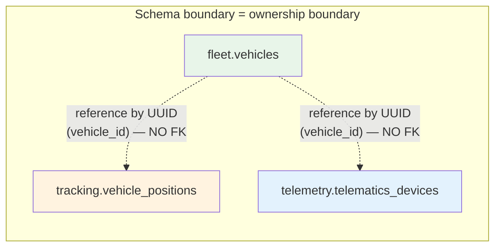

1. **No cross-schema `FOREIGN KEY` constraints.** A vehicle_id stored in `tracking` is a `UUID` column with an index, not an FK to `fleet.vehicles`. The relationship is validated by the domain event flow, not the DB.
2. **Read-model projections are event-fed.** When `tracking` needs vehicle metadata, it consumes `fleet.vehicle.registered.v1` and denormalizes into its own projection — it does **not** query `fleet.vehicles` at read time.
3. **One writer per aggregate.** Enforced by application layer + Kafka ACLs (which service may publish `fleet.vehicle.*` events).

---

## 3. Schema Design

### 3.1 PostgreSQL topology (one logical cluster, many schemas)

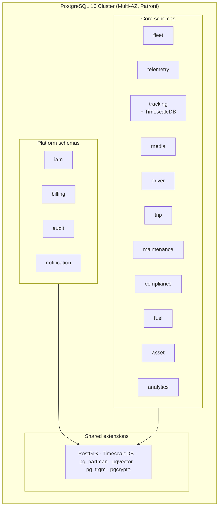

### 3.2 Multi-tenant isolation (ADR-003) — three tiers

| Tier | Profile | Isolation | PostgreSQL realization |
|---|---|---|---|
| **Enterprise** | 1,000+ vehicles; regulated | Dedicated instance | Separate RDS cluster per tenant; all schemas live there |
| **Professional** | 100–1,000 vehicles | Schema isolation | Shared cluster; **dedicated schema set** per tenant (`tenant_<id>.fleet.vehicles`, etc.) |
| **Standard** | <100 vehicles | Row-Level Security | Shared cluster + shared schemas; every table has `tenant_id`; **RLS policies** auto-filter |

### 3.3 RLS mechanics (Standard tier)

**Every** multi-tenant table carries `tenant_id UUID NOT NULL` and the policy below. `tenant_id` is **derived from the JWT, never the request body** (INV-I02).

```sql
-- Per-session tenant context (set by the service on each connection checkout)
SET LOCAL app.current_tenant_id = 'uuid';

-- Universal RLS policy template (applied to every multi-tenant table)
ALTER TABLE fleet.vehicles ENABLE ROW LEVEL SECURITY;
CREATE POLICY tenant_isolation ON fleet.vehicles
  USING (tenant_id = current_setting('app.current_tenant_id')::uuid);
```

### 3.4 Universal column conventions

| Column | Type | Purpose |
|---|---|---|
| `id` | `UUID` (UUIDv7 — time-ordered) | Primary key; sortable; index-friendly |
| `tenant_id` | `UUID NOT NULL` | Tenant owner; RLS partition |
| `created_at` | `TIMESTAMPTZ NOT NULL DEFAULT now()` | Insert time |
| `updated_at` | `TIMESTAMPTZ NOT NULL DEFAULT now()` | Last mutation; trigger-maintained |
| `created_by` / `updated_by` | `UUID` | Actor (user/service) |
| `version` | `INTEGER NOT NULL DEFAULT 1` | Optimistic concurrency (aggregate version) |
| `metadata` | `JSONB NOT NULL DEFAULT '{}'::jsonb` | Extension point (never a dumping ground for domain data) |

### 3.5 Extensions per instance

| Extension | Use |
|---|---|
| **PostGIS 3.4** | Geospatial: geofences, position geometry, spatial indexes |
| **TimescaleDB** | Hypertables for GPS/telemetry; continuous aggregates |
| **pg_partman** | Declarative partition maintenance (audit, ES tables) |
| **pgvector** | Embeddings for ML/AI features |
| **pg_trgm** | Trigram FTS / fuzzy search (Elasticsearch replacement, MVP–P3) |
| **pgcrypto** | Hashing, UUID generation, envelope encryption helpers |

---

## 4. Entity Relationship Model

The high-value spine, derived from `02` §4. Cross-context edges are **logical** (by identity) — there is no physical FK across schemas.

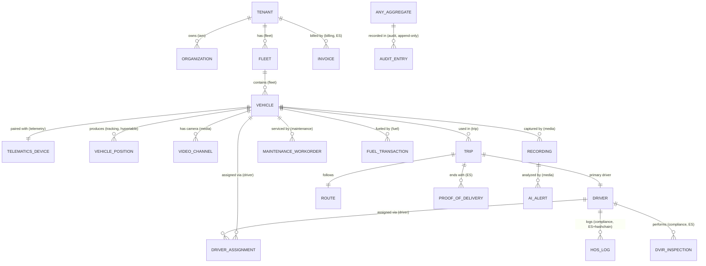

> **Reading this diagram.** A solid line ending in `||` or `o{` is a within-schema relationship (has a physical FK). A dotted relationship in the production schema set is *logical only* — UUID reference, validated by events. Context name in parentheses.

---

## 5. Core Aggregate Tables (DDL)

This section provides **column-level DDL for the core, highest-value aggregates** (per the chosen depth). The remaining 30+ aggregates are listed at table level in §5.9 and detailed in their `Modules/*.md`.

### 5.1 `fleet.vehicles` — `Vehicle` aggregate (INV-F01, INV-F02)

```sql
CREATE TABLE fleet.vehicles (
    id              UUID         PRIMARY KEY DEFAULT gen_random_uuid(),
    tenant_id       UUID         NOT NULL,
    vin             CHAR(17)     NOT NULL,
    license_plate   TEXT,
    make            TEXT         NOT NULL,
    model           TEXT         NOT NULL,
    model_year      SMALLINT     CHECK (model_year BETWEEN 1900 AND extract(year from now())::int + 1),
    fleet_id        UUID,                            -- logical ref to fleet.fleets (no FK)
    status          TEXT         NOT NULL DEFAULT 'ACTIVE',
    color           TEXT,
    vehicle_type    TEXT         NOT NULL,           -- TRUCK, TRAILER, VAN, CAR, ...
    fuel_type       TEXT,
    odometer_km     DOUBLE PRECISION NOT NULL DEFAULT 0,
    engine_hours    DOUBLE PRECISION DEFAULT 0,
    metadata        JSONB        NOT NULL DEFAULT '{}'::jsonb,
    version         INTEGER      NOT NULL DEFAULT 1,
    created_at      TIMESTAMPTZ  NOT NULL DEFAULT now(),
    updated_at      TIMESTAMPTZ  NOT NULL DEFAULT now(),
    created_by      UUID,
    updated_by      UUID,
    -- INV-F01: VIN globally unique (cross-tenant), ISO 3779 checksum enforced in app layer
    CONSTRAINT uq_vehicles_vin UNIQUE (vin),
    -- INV-F02: status follows strict state machine (enum + transition guard in app)
    CONSTRAINT ck_vehicles_status CHECK (status IN ('ACTIVE','IDLE','IN_TRIP','IN_SERVICE','DECOMMISSIONED'))
);
CREATE INDEX ix_vehicles_tenant_fleet ON fleet.vehicles (tenant_id, fleet_id);
CREATE INDEX ix_vehicles_plate        ON fleet.vehicles (license_plate) WHERE license_plate IS NOT NULL;
-- RLS enabled (§3.3)
```

### 5.2 `telemetry.telematics_devices` — `TelematicsDevice` (INV-TEL01, INV-TEL02)

```sql
CREATE TABLE telemetry.telematics_devices (
    id                UUID         PRIMARY KEY DEFAULT gen_random_uuid(),
    tenant_id         UUID         NOT NULL,
    serial_number     TEXT         NOT NULL,
    imei              TEXT         UNIQUE,
    model             TEXT         NOT NULL,
    vendor            TEXT         NOT NULL,           -- Meitrack, Teltonika, Concox, ...
    protocol          TEXT         NOT NULL,           -- GT06, JT808, MQTT, ...
    firmware_version  TEXT,
    paired_vehicle_id UUID,                            -- INV-TEL02: one vehicle at a time
    pairing_status    TEXT         NOT NULL DEFAULT 'UNPAIRED',
    provisioned_at    TIMESTAMPTZ  NOT NULL DEFAULT now(),
    last_seen_at      TIMESTAMPTZ,
    config            JSONB        NOT NULL DEFAULT '{}'::jsonb,   -- device-specific config (was MongoDB)
    metadata          JSONB        NOT NULL DEFAULT '{}'::jsonb,
    version           INTEGER      NOT NULL DEFAULT 1,
    created_at        TIMESTAMPTZ  NOT NULL DEFAULT now(),
    updated_at        TIMESTAMPTZ  NOT NULL DEFAULT now(),
    -- INV-TEL01: serial globally unique (cross-tenant)
    CONSTRAINT uq_devices_serial UNIQUE (serial_number),
    CONSTRAINT ck_devices_pairing CHECK (pairing_status IN ('UNPAIRED','PAIRED','SUSPENDED','DECOMMISSIONED'))
);
CREATE INDEX ix_devices_tenant_vehicle ON telemetry.telematics_devices (tenant_id, paired_vehicle_id);
CREATE INDEX ix_devices_last_seen      ON telemetry.telematics_devices (last_seen_at);
-- Partial unique index enforces INV-TEL02 at the DB level: only one PAIRED row per vehicle
CREATE UNIQUE INDEX uq_devices_one_paired_per_vehicle
    ON telemetry.telematics_devices (paired_vehicle_id)
    WHERE pairing_status = 'PAIRED';
```

### 5.3 `tracking.vehicle_positions` — `VehicleTracker` time-series (see §11 for full design)

> Deferred to §11 — this is the highest-volume table (hypertable, 600K ev/s) and warrants its own section.

### 5.4 `trip.trips` — `Trip` aggregate (INV-TR01, ES)

```sql
CREATE TABLE trip.trips (
    id                UUID         PRIMARY KEY DEFAULT gen_random_uuid(),
    tenant_id         UUID         NOT NULL,
    vehicle_id        UUID         NOT NULL,
    primary_driver_id UUID         NOT NULL,
    codriver_id       UUID,
    status            TEXT         NOT NULL DEFAULT 'PLANNED',
    started_at        TIMESTAMPTZ,
    ended_at          TIMESTAMPTZ,
    start_geopoint    geography(Point, 4326),
    end_geopoint      geography(Point, 4326),
    distance_km       DOUBLE PRECISION DEFAULT 0,
    route_id          UUID,                            -- logical ref to trip.routes
    load_id           UUID,                            -- logical ref to trip.loads
    metadata          JSONB        NOT NULL DEFAULT '{}'::jsonb,
    version           INTEGER      NOT NULL DEFAULT 1,
    created_at        TIMESTAMPTZ  NOT NULL DEFAULT now(),
    updated_at        TIMESTAMPTZ  NOT NULL DEFAULT now(),
    CONSTRAINT ck_trips_status CHECK (status IN ('PLANNED','DISPATCHED','ACTIVE','COMPLETED','CANCELLED'))
);
CREATE INDEX ix_trips_tenant_vehicle_time ON trip.trips (tenant_id, vehicle_id, started_at DESC);
CREATE INDEX ix_trips_tenant_driver_time  ON trip.trips (tenant_id, primary_driver_id, started_at DESC);
CREATE INDEX ix_trips_active              ON trip.trips (tenant_id, vehicle_id) WHERE status = 'ACTIVE';
-- INV-TR01 (no overlapping active trips per vehicle) enforced by app-level guard + the partial index above
```

### 5.5 `compliance.hos_logs` — `HOSLog` (INV-C01, ES + hash-chain)

```sql
CREATE TABLE compliance.hos_logs (
    id              UUID         PRIMARY KEY DEFAULT gen_random_uuid(),
    tenant_id       UUID         NOT NULL,
    driver_id       UUID         NOT NULL,
    duty_status     TEXT         NOT NULL,           -- OFF_DUTY, SLEEPER_BERTH, DRIVING, ON_DUTY_NOT_DRIVING
    location        geography(Point, 4326),
    odometer_km     DOUBLE PRECISION,
    engine_hours    DOUBLE PRECISION,
    shipping_docs   TEXT,
    remarks         TEXT,
    -- INV-C01: cryptographic hash chain (SHA-256)
    seq_no          BIGINT       NOT NULL,           -- monotonic per driver
    prev_hash       TEXT         NOT NULL,
    entry_hash      TEXT         NOT NULL,           -- SHA256(prev_hash || canonical(entry_data))
    certified       BOOLEAN      NOT NULL DEFAULT FALSE,
    certified_at    TIMESTAMPTZ,
    recorded_at     TIMESTAMPTZ  NOT NULL,           -- driver-reported event time
    created_at      TIMESTAMPTZ  NOT NULL DEFAULT now(),
    -- Append-only: no UPDATE path; RLS + REVOKE UPDATE from app role
    CONSTRAINT ck_hos_duty CHECK (duty_status IN ('OFF_DUTY','SLEEPER_BERTH','DRIVING','ON_DUTY_NOT_DRIVING'))
);
CREATE INDEX ix_hos_tenant_driver_seq ON compliance.hos_logs (tenant_id, driver_id, seq_no);
CREATE INDEX ix_hos_tenant_driver_time ON compliance.hos_logs (tenant_id, driver_id, recorded_at DESC);
-- Hash chain verification: periodic job recomputes SHA256 and alerts on mismatch (tamper detection)
```

### 5.6 `compliance.dvir_inspections` — `DVIRInspection` (INV-C02, ES)

```sql
CREATE TABLE compliance.dvir_inspections (
    id              UUID         PRIMARY KEY DEFAULT gen_random_uuid(),
    tenant_id       UUID         NOT NULL,
    vehicle_id      UUID         NOT NULL,
    driver_id       UUID         NOT NULL,
    trip_id         UUID,
    inspection_type TEXT         NOT NULL,            -- PRE_TRIP, POST_TRIP
    defect_found    BOOLEAN      NOT NULL DEFAULT FALSE,
    defects         JSONB        NOT NULL DEFAULT '[]'::jsonb,  -- array of {component, severity, note}
    safe_to_operate BOOLEAN      NOT NULL,
    signature_ref   TEXT,                              -- S3 object key for signature image
    location        geography(Point, 4326),
    inspected_at    TIMESTAMPTZ  NOT NULL,
    created_at      TIMESTAMPTZ  NOT NULL DEFAULT now(),
    version         INTEGER      NOT NULL DEFAULT 1,
    CONSTRAINT ck_dvir_type CHECK (inspection_type IN ('PRE_TRIP','POST_TRIP'))
);
CREATE INDEX ix_dvir_tenant_vehicle_time ON compliance.dvir_inspections (tenant_id, vehicle_id, inspected_at DESC);
```

### 5.7 `maintenance.maintenance_work_orders` — `MaintenanceWorkOrder` (INV-M02, ES)

```sql
CREATE TABLE maintenance.maintenance_work_orders (
    id              UUID         PRIMARY KEY DEFAULT gen_random_uuid(),
    tenant_id       UUID         NOT NULL,
    vehicle_id      UUID         NOT NULL,
    wo_number       TEXT         NOT NULL,
    status          TEXT         NOT NULL DEFAULT 'OPEN',
    priority        TEXT         NOT NULL DEFAULT 'NORMAL',
    odometer_km     DOUBLE PRECISION,
    labor_cost      NUMERIC(12,2) DEFAULT 0,
    parts_cost      NUMERIC(12,2) DEFAULT 0,
    total_cost      NUMERIC(12,2) GENERATED ALWAYS AS (labor_cost + parts_cost) STORED,
    assigned_tech   UUID,
    vendor_id       UUID,
    opened_at       TIMESTAMPTZ  NOT NULL DEFAULT now(),
    completed_at    TIMESTAMPTZ,
    tasks           JSONB        NOT NULL DEFAULT '[]'::jsonb,
    parts           JSONB        NOT NULL DEFAULT '[]'::jsonb,
    metadata        JSONB        NOT NULL DEFAULT '{}'::jsonb,
    version         INTEGER      NOT NULL DEFAULT 1,
    created_at      TIMESTAMPTZ  NOT NULL DEFAULT now(),
    updated_at      TIMESTAMPTZ  NOT NULL DEFAULT now(),
    CONSTRAINT uq_wo_number UNIQUE (tenant_id, wo_number),
    -- INV-M02: completed orders are immutable (trigger raises on UPDATE where status='COMPLETED')
    CONSTRAINT ck_wo_status CHECK (status IN ('OPEN','ASSIGNED','IN_PROGRESS','COMPLETED','CANCELLED'))
);
CREATE INDEX ix_wo_tenant_vehicle_status ON maintenance.maintenance_work_orders (tenant_id, vehicle_id, status);
CREATE INDEX ix_wo_tenant_status_open    ON maintenance.maintenance_work_orders (tenant_id) WHERE status IN ('OPEN','ASSIGNED','IN_PROGRESS');
```

### 5.8 `billing.invoices` — `Invoice` (INV-B01, ES)

```sql
CREATE TABLE billing.invoices (
    id              UUID         PRIMARY KEY DEFAULT gen_random_uuid(),
    tenant_id       UUID         NOT NULL,           -- the tenant being billed (the customer)
    customer_tenant_id UUID      NOT NULL,
    invoice_number  TEXT         NOT NULL,
    period_start    DATE         NOT NULL,
    period_end      DATE         NOT NULL,
    subtotal        NUMERIC(14,2) NOT NULL,
    tax             NUMERIC(14,2) NOT NULL DEFAULT 0,
    total           NUMERIC(14,2) NOT NULL,
    currency        CHAR(3)      NOT NULL DEFAULT 'USD',
    status          TEXT         NOT NULL DEFAULT 'DRAFT',
    issued_at       TIMESTAMPTZ  NOT NULL DEFAULT now(),
    due_at          DATE,
    paid_at         TIMESTAMPTZ,
    line_items      JSONB        NOT NULL DEFAULT '[]'::jsonb,
    pdf_ref         TEXT,                              -- S3 object key for rendered PDF
    version         INTEGER      NOT NULL DEFAULT 1,
    created_at      TIMESTAMPTZ  NOT NULL DEFAULT now(),
    updated_at      TIMESTAMPTZ  NOT NULL DEFAULT now(),
    CONSTRAINT uq_invoice_number UNIQUE (customer_tenant_id, invoice_number),
    -- INV-B01: immutable once generated (status transitions guarded by trigger)
    CONSTRAINT ck_invoice_status CHECK (status IN ('DRAFT','ISSUED','PAID','VOID','OVERDUE'))
);
CREATE INDEX ix_invoices_tenant_period ON billing.invoices (customer_tenant_id, period_start DESC);
```

### 5.9 Remaining aggregates — table-level summary

| Schema.Table | Aggregate | Notes |
|---|---|---|
| `iam.users`, `.roles`, `.organizations`, `.api_keys`, `.auth_sessions`, `.credentials`, `.external_identities` | User, Role, Organization, APIKey, AuthSession, Credential, ExternalIdentity | Standard OLTP; Argon2id password hash; `(issuer, subject)` unique on external_identities |
| `billing.tenants`, `.subscriptions`, `.usage_meters` | Tenant, Subscription, UsageMeter | UsageMeter uses Redis atomic counter (§18); persisted as periodic snapshot |
| `audit.audit_entries` | AuditEntry | Append-only, hash-chained (see §15) |
| `notification.alert_rules`, `.notifications`, `.escalation_policies`, `.notification_preferences` | AlertRule, Notification (ES), EscalationPolicy, NotificationPreference | `notification_events` is the ES table (§16) |
| `fleet.fleets`, `.vehicle_groups`, `.fleet_policies` | Fleet, VehicleGroup, FleetPolicy | VehicleGroup: adjacency-list with cycle guard |
| `telemetry.firmware_packages`, `.device_commands` | FirmwarePackage, DeviceCommand (ES) | Firmware: signature + verified bool (INV-TEL03) |
| `tracking.vehicle_trackers`, `.tracking_sessions`, `.geofences` | VehicleTracker (ES), TrackingSession (ES), Geofence | See §11, §12, §17 |
| `media.video_channels`, `.recordings`, `.stream_sessions`, `.event_clips`, `.ai_alerts` | VideoChannel, Recording, StreamSession, EventClip, AIAlert | See §13, §14 |
| `driver.driver_profiles`, `.license_records`, `.certifications`, `.driver_assignments` | DriverProfile, LicenseRecord, Certification, DriverAssignment | INV-D01: assignment blocked if license inactive/expired |
| `trip.routes`, `.dispatches`, `.proofs_of_delivery`, `.loads` | Route, Dispatch (ES), ProofOfDelivery (ES), Load | Dispatch: requires HOS-eligible driver (INV-TR02) |
| `maintenance.maintenance_plans`, `.parts_inventory`, `.vendors` | MaintenancePlan, PartsInventory, Vendor | PartsInventory: consumption ≤ stock (INV-M01) |
| `compliance.incidents`, `.compliance_records`, `.safety_scores` | Incident (ES), ComplianceRecord, SafetyScore | Incident: reported within regulatory limits |
| `fuel.fuel_cards`, `.fuel_transactions`, `.fuel_fraud_alerts` | FuelCard, FuelTransaction, FuelFraudAlert | INV-FC01/02: card limits + suspension enforced |
| `asset.vehicle_assets`, `.depreciation_schedules`, `.disposal_records`, `.procurement_records` | VehicleAsset, DepreciationSchedule, DisposalRecord, ProcurementRecord | (Detailed in `Modules/Asset-Lifecycle.md`) |
| `analytics.kpi_definitions`, `.ml_models`, `.report_definitions`, `.dashboards` | KPIDefinition, MLModel, ReportDefinition, Dashboard | Read-mostly; consumes projections |

---

## 6. Data Types, Primary Keys, Foreign Keys, Constraints

### 6.1 Type system (canonical)

| Domain concept | PostgreSQL type | Why |
|---|---|---|
| Aggregate/entity identity | `UUID` (UUIDv7) | Globally unique, time-ordered (B-tree friendly), no central issuer |
| Tenant identity | `UUID` | Uniform with entity IDs |
| Monetary | `NUMERIC(14,2)` | Exact decimal; never FLOAT for money |
| Distances | `DOUBLE PRECISION` (km) | Sufficient precision for telemetry |
| Time | `TIMESTAMPTZ` (UTC stored) | Absolute; never `TIMESTAMP` without TZ |
| Geospatial | `geography(Point,4326)`, `geography(Polygon,4326)` | PostGIS; lon/lat, metres for ST_Distance |
| Short enums | `TEXT` + `CHECK` | Readable in queries; avoids ENUM ALTER pain |
| Variable/flexible schema | `JSONB` | GIN-indexable; device configs, DVIR defects, line items |
| High-volume identity (positions) | `UUID` (UUIDv7, time-ordered) | Disambiguates same-timestamp events; time-ordered for B-tree friendliness at 52B rows/day (ADR-019 R7 — type is UUID, not BIGINT) |
| Embeddings (ML) | `vector` (pgvector) | Similarity search for AI features |

### 6.2 Primary keys

- **Default:** `UUID DEFAULT gen_random_uuid()` — time-ordered UUIDv7 where supported, else `pgcrypto.gen_random_uuid()`.
- **Exception — `tracking.vehicle_positions`:** `event_id UUID` (UUIDv7, time-ordered) — disambiguates two devices reporting the same vehicle at the same instant (resolves ARR DB-3). Type is `UUID` per ADR-019 R7 (the v2.0.0 `BIGINT` was a type error — UUIDv7 is 128-bit).
- **Exception — append-only sequences (`hos_logs.seq_no`):** monotonic per-driver BIGINT for hash-chain ordering.

### 6.3 Foreign keys (within schema only)

- FKs are **only within a schema** (same bounded context). E.g., `fleet.vehicles.fleet_id` may FK to `fleet.fleets.id`.
- **No cross-schema FKs.** Cross-context references are `UUID` columns + indexes, validated by events (§2.2).

### 6.4 Constraint patterns (domain invariants → DB)

| Invariant (`02` §8) | DB enforcement |
|---|---|
| INV-F01 (VIN globally unique) | `UNIQUE (vin)` — cross-tenant (no tenant_id in the constraint) |
| INV-TEL01 (device serial globally unique) | `UNIQUE (serial_number)` |
| INV-TEL02 (one vehicle per device) | Partial unique index `WHERE pairing_status='PAIRED'` |
| INV-TR01 (no overlapping active trips) | Partial index on `(vehicle_id) WHERE status='ACTIVE'` + app guard |
| INV-M02 (completed WOs immutable) | `BEFORE UPDATE` trigger raises if `OLD.status='COMPLETED'` |
| INV-B01 (invoices immutable once issued) | Trigger blocks UPDATE when `status IN ('ISSUED','PAID','VOID')` |
| INV-A01 (audit append-only) | `REVOKE UPDATE, DELETE` from app role; insert-only |
| INV-C01 (HOS hash chain) | `prev_hash`/`entry_hash` columns + periodic verification job |
| INV-MED01 (recording hash chain) | `entry_hash` + `prev_hash` on `media.recordings` |

---

## 7. Index Strategy

### 7.1 Indexing principles

1. **Index the access pattern, not the columns.** Every index cites the query it serves (documented in `COMMENT ON INDEX`).
2. **Prefer composite, tenant-leading.** Almost every query is `WHERE tenant_id = ? AND …` → composite indexes lead with `tenant_id`.
3. **Partial indexes for hot subsets.** "Active trips", "open work orders", "paired devices" → partial indexes keep them small.
4. **GIN for JSONB and FTS.** Device configs, DVIR defects, search tsvector.
5. **BRIN for append-only time-ordered.** Audit, event-store tables — BRIN is tiny and fast for ranges.
6. **GiST for geospatial.** Geofences, position geometry.

### 7.2 Index inventory (canonical patterns)

| Pattern | Example | Use |
|---|---|---|
| Tenant-leading composite | `(tenant_id, fleet_id)` | Multi-tenant list queries |
| Tenant + time DESC | `(tenant_id, vehicle_id, started_at DESC)` | Recent-first history |
| Partial — active subset | `(tenant_id, vehicle_id) WHERE status='ACTIVE'` | "live" queries |
| GIN — JSONB | `GIN (config jsonb_path_ops)` | Device config lookup |
| GIN — FTS | `GIN (search_vector)` | Vehicle/driver search |
| GiST — geospatial | `GiST (boundary)` | Geofence containment |
| BRIN — append-only | `BRIN (created_at)` | Audit/event-store range scans |
| Hash — exact match | `HASH (vin)` (optional) | Point VIN lookup |

### 7.3 Index discipline

- **No speculative indexes.** New index ⇒ recorded query + EXPLAIN evidence in the migration.
- **Hypothetical PG `hypopg`** used in CI to validate index benefit before deploy.
- **Unused-index report** weekly via `pg_stat_user_indexes`; dropped after 30 days at zero reads.

---

## 8. Partition Strategy

### 8.1 Strategy by table class

| Table class | Strategy | Key | Tool |
|---|---|---|---|
| **Time-series hypertables** (positions, telemetry) | TimescaleDB auto-chunking | `captured_at` + space `vehicle_id` | `create_hypertable` |
| **Audit / event-store (append-only)** | Native declarative `RANGE` on `created_at` (monthly) | `created_at` | `pg_partman` |
| **Large transactional** (invoices, fuel_transactions) | `LIST` on `tenant_id` (Enterprise) or non-partitioned (Standard) | `tenant_id` | native |
| **Small transactional** (vehicles, drivers, fleets) | Non-partitioned | — | — |

### 8.2 Partition maintenance (pg_partman)

```sql
-- Audit log: monthly partitions, 12 months ahead, 7-year retention (compliance)
SELECT partman.create_parent('audit.audit_entries', 'created_at', 'native', 'monthly');
UPDATE partman.part_config SET retention = '7 years', retention_keep_table = false
  WHERE parent_table = 'audit.audit_entries';
```

### 8.3 Sub-partitioning (Year-5 scale)

For the highest-volume event-store tables at Year-5 scale, sub-partition by `tenant_id` hash inside each time range — distributes write load across spindles. Activated only when a single partition exceeds 200 GB.

---

## 9. Sharding Strategy

### 9.1 Decision ladder

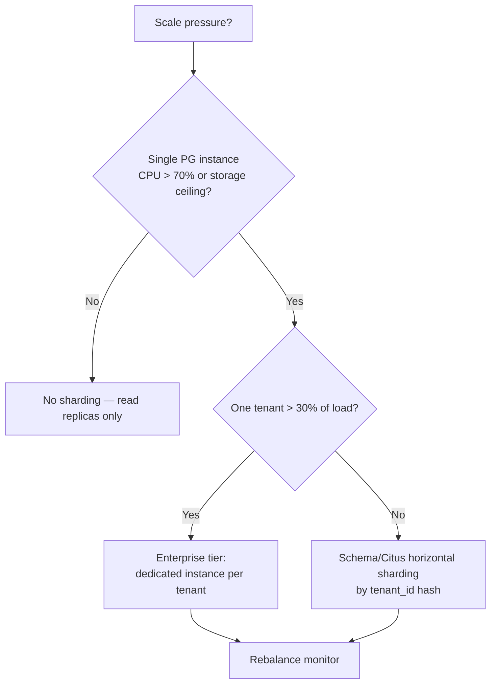

### 9.2 Sharding keys

- **Primary shard key: `tenant_id`.** All queries are tenant-scoped, so sharding by tenant preserves locality and isolation.
- **Secondary (time-series): `vehicle_id` hash** within TimescaleDB space partitions — distributes ingest across chunks.

### 9.3 Tenant-based sharding (Citus, if triggered)

If Standard-tier load exceeds a single instance, adopt **Citus** (PG extension) for the high-volume schemas (`tracking`, `telemetry`):

```sql
SELECT create_distributed_table('tracking.vehicle_positions', 'tenant_id');
SELECT create_distributed_table('telemetry.telematics_devices', 'tenant_id');
```

### 9.4 Redis sharding

Cluster mode with **hash slots**; key namespace includes tenant (`tenant:<id>:vehicle:<vid>:pos`) so a tenant's hot keys colocate.

### 9.5 Rebalancing

- Citus: `rebalance_table_shards` during low-traffic windows; throttled.
- Timescale: chunk re-distribution is automatic; chunk size tuned to ~25% of memory.
- Trigger to review: any shard > 70% capacity or > 2× median query latency.

---

## 10. Time-Series Data Strategy

### 10.1 Why TimescaleDB (a PG extension, not a separate store)

| Requirement | Capability |
|---|---|
| 600K inserts/sec (Year 5 peak) | Hypertables auto-partition into chunks; parallel inserts |
| ~52B events/day cost control | Native columnar compression (~90% reduction after 7d) |
| Fast range scans | Chunk exclusion — only relevant chunks scanned |
| Pre-aggregated rollups (replaces ClickHouse at this scale) | Continuous aggregates (materialized, auto-refreshed) |
| Retention without downtime | Native `drop_chunks` policy |
| One engine, one skill set | Same PG HA stack, same observability |

### 10.2 Continuous aggregates (replace ClickHouse rollups, MVP–P3)

Raw positions are **never scanned for analytics**. Continuous aggregates serve dashboards/reports:

| Continuous aggregate | Grain | Use |
|---|---|---|
| `vehicle_position_5min` | 5-min summary per vehicle | map playback, replay |
| `vehicle_distance_hourly` | hourly distance per vehicle | utilization, idle analysis |
| `vehicle_speed_profile_hourly` | hourly speed avg/p50/p95/max | speed analysis, behavior |
| `vehicle_idle_daily` | daily idle time | utilization reporting |

```sql
CREATE MATERIALIZED VIEW tracking.vehicle_distance_hourly
WITH (timescaledb.continuous) AS
  SELECT
    tenant_id, vehicle_id,
    time_bucket('1 hour', captured_at) AS bucket,
    max(odometer_km) - min(odometer_km) AS distance_km,
    count(*) AS position_count
  FROM tracking.vehicle_positions
  GROUP BY tenant_id, vehicle_id, bucket
  WITH NO DATA;
SELECT add_continuous_aggregate_policy('tracking.vehicle_distance_hourly',
  start_offset => INTERVAL '7 days', end_offset => INTERVAL '1 hour',
  schedule_interval => INTERVAL '1 hour');
```

> **ClickHouse re-introduction trigger (§24.3):** if any dashboarding query P99 exceeds **2s**, *or* continuous-aggregate storage exceeds **40% of cluster**, *or* the Year-5 scale band (≥1M vehicles) approaches, ClickHouse is re-introduced for the heaviest OLAP fact tables. Until then, Timescale aggregates suffice.

### 10.3 Lifecycle tiering (Hot → Warm → Cold)

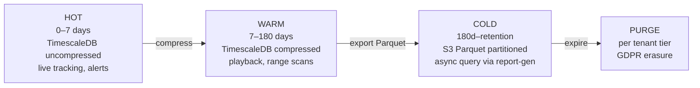

Cold tier: Parquet in S3 (`s3://fleetvision-gps/tenant=<id>/dt=<date>/`), partitioned by tenant + date. Operational services never touch cold data; `report-generation-service` owns the async cold-query path.

---

## 11. GPS Position Storage Design

### 11.1 The `tracking.vehicle_positions` hypertable

```sql
CREATE TABLE tracking.vehicle_positions (
    event_id      UUID         NOT NULL DEFAULT gen_random_uuid(),  -- UUIDv7 (PK; disambiguates same-timestamp) — ADR-019 R7
    vehicle_id    UUID        NOT NULL,
    tenant_id     UUID        NOT NULL,
    captured_at   TIMESTAMPTZ NOT NULL,            -- device time
    ingested_at   TIMESTAMPTZ NOT NULL DEFAULT now(),
    geom          geography(Point, 4326) NOT NULL,
    latitude      DOUBLE PRECISION NOT NULL,
    longitude     DOUBLE PRECISION NOT NULL,
    altitude_m    REAL,
    heading_deg   REAL,
    speed_kmh     REAL         NOT NULL DEFAULT 0,
    accuracy_m    REAL,
    odometer_km   DOUBLE PRECISION,
    ignition_on   BOOLEAN,
    source_device UUID,                             -- disambiguates multi-device vehicles
    quality       SMALLINT     NOT NULL DEFAULT 1,  -- 1=VALID ...
    session_id    UUID,
    metadata      JSONB        NOT NULL DEFAULT '{}'::jsonb
);

SELECT create_hypertable('tracking.vehicle_positions', 'captured_at',
  chunk_time_interval      => INTERVAL '1 day',
  partitioning_column      => 'vehicle_id',
  number_partitions        => 8);

ALTER TABLE tracking.vehicle_positions SET (
  timescaledb.compress,
  timescaledb.compress_segmentby = 'vehicle_id',
  timescaledb.compress_orderby   = 'captured_at DESC');
SELECT add_compression_policy('tracking.vehicle_positions', INTERVAL '7 days');
SELECT add_retention_policy('tracking.vehicle_positions', INTERVAL '180 days');
```

### 11.2 Design choices (rationale)

- **`event_id UUID` (UUIDv7) PK** — disambiguates two devices reporting the same vehicle at the same instant (resolves ARR DB-3); **type is `UUID`, not `BIGINT`** — UUIDv7 is 128-bit and cannot fit in BIGINT (corrects the v2.0.0 type error, ADR-019 R7). UUIDv7 is time-ordered, so B-tree insertion is append-like and index-friendly at 52B rows/day.
- **Time + space partitioning** (`vehicle_id` hash, 8 partitions) — distributes write load; preserves per-vehicle locality for replay.
- **Compress after 7 days**, segment-by `vehicle_id`, order-by `captured_at DESC` → ~90% storage reduction, fast per-vehicle range scans.
- **Retention: drop chunks > 180 days** (default hot/warm; tier-overridable per ADR-019 R11); cold tier → S3 Parquet (§10.3).
- **No `UPDATE`/`DELETE` path.** Positions are immutable once persisted (INV-T01). RLS + role grants enforce.

### 11.3 Indexes

```sql
CREATE INDEX ix_positions_tenant_vehicle_time
  ON tracking.vehicle_positions (tenant_id, vehicle_id, captured_at DESC);
-- Chunk exclusion + compress_segmentby cover the per-vehicle replay scan; no additional index for hot path
```

---

## 12. Vehicle Tracking History

### 12.1 Hot path (live tracking) — Redis

The **latest position per vehicle** lives in Redis; live-map dashboards never hit PostgreSQL for the current fix.

```
KEY:   tenant:<tid>:vehicle:<vid>:pos
VAL:   { lat, lng, heading, speed, ts, ... }   (JSON or Protobuf)
TTL:   2 × reporting interval (e.g., 60s if device reports every 30s)
```

### 12.2 Warm path (replay, range scans) — TimescaleDB compressed

Vehicle trail for a date range:

```sql
SELECT captured_at, latitude, longitude, heading_deg, speed_kmh
FROM tracking.vehicle_positions
WHERE tenant_id = $1 AND vehicle_id = $2
  AND captured_at BETWEEN $3 AND $4
ORDER BY captured_at;
-- Uses chunk exclusion + compressed per-vehicle segment; sub-second for typical ranges
```

### 12.3 Cold path (long history, audits) — S3 Parquet

Beyond warm retention, `report-generation-service` queries Parquet via async jobs (e.g., Trino/Presto or DuckDB over S3). Results materialized as reports; never joinable to operational tables.

### 12.4 Tracking sessions — `tracking.tracking_sessions` (ES)

A `TrackingSession` (ES) captures a vehicle's continuous tracking window (ignition-on → ignition-off). Event-sourced; current-state projection in `tracking_sessions` table. Used by Trip detection and behavior scoring.

---

## 13. Video Metadata Storage

### 13.1 Metadata in PostgreSQL, bytes in S3 (ADR-022)

The split is strict: **metadata is relational** (queryable, transactional, RLS-protected); **video bytes are objects** (lifecycle-tiered, SSE-KMS encrypted).

### 13.2 `media.video_channels` — `VideoChannel`

```sql
CREATE TABLE media.video_channels (
    id              UUID         PRIMARY KEY DEFAULT gen_random_uuid(),
    tenant_id       UUID         NOT NULL,
    vehicle_id      UUID         NOT NULL,
    channel_label   TEXT         NOT NULL,           -- FORWARD, DRIVER, REAR, SIDE
    source_mode     TEXT         NOT NULL,           -- RTSP or JT1078 (xor — INV via CHECK)
    logical_channel SMALLINT,                        -- JT1078 logical channel no.
    rtsp_url        TEXT,
    status          TEXT         NOT NULL DEFAULT 'OFFLINE',
    resolution      TEXT,
    metadata        JSONB        NOT NULL DEFAULT '{}'::jsonb,
    version         INTEGER      NOT NULL DEFAULT 1,
    created_at      TIMESTAMPTZ  NOT NULL DEFAULT now(),
    updated_at      TIMESTAMPTZ  NOT NULL DEFAULT now(),
    -- INV: one source mode (VideoChannel invariant, 02 §3.2 #28)
    CONSTRAINT ck_channel_source CHECK (source_mode IN ('RTSP','JT1078')),
    CONSTRAINT ck_channel_label CHECK (channel_label IN ('FORWARD','DRIVER','REAR','SIDE','CUSTOM'))
);
CREATE UNIQUE INDEX uq_channels_per_vehicle_label
  ON media.video_channels (tenant_id, vehicle_id, channel_label);
```

### 13.3 `media.recordings` — `Recording` (INV-MED01 hash chain)

```sql
CREATE TABLE media.recordings (
    id              UUID         PRIMARY KEY DEFAULT gen_random_uuid(),
    tenant_id       UUID         NOT NULL,
    vehicle_id      UUID         NOT NULL,
    channel_id      UUID         NOT NULL,
    trigger_type    TEXT         NOT NULL,           -- MANUAL, EVENT, SCHEDULED, AI
    trigger_event_id UUID,                           -- linked domain event (EventClip)
    started_at      TIMESTAMPTZ  NOT NULL,
    ended_at        TIMESTAMPTZ,
    duration_sec    INTEGER,
    s3_key          TEXT,                             -- primary segment object
    s3_key_thumbs   TEXT,                             -- thumbnail index object
    codec           TEXT,
    byte_size       BIGINT,
    -- INV-MED01: hash chain for evidence integrity
    entry_hash      TEXT,
    prev_hash       TEXT,
    status          TEXT         NOT NULL DEFAULT 'RECORDING',
    metadata        JSONB        NOT NULL DEFAULT '{}'::jsonb,
    version         INTEGER      NOT NULL DEFAULT 1,
    created_at      TIMESTAMPTZ  NOT NULL DEFAULT now(),
    updated_at      TIMESTAMPTZ  NOT NULL DEFAULT now(),
    CONSTRAINT ck_rec_status CHECK (status IN ('RECORDING','AVAILABLE','CORRUPT','EXPIRED','DELETED'))
);
CREATE INDEX ix_recordings_tenant_vehicle_time ON media.recordings (tenant_id, vehicle_id, started_at DESC);
CREATE INDEX ix_recordings_tenant_channel_time ON media.recordings (tenant_id, channel_id, started_at DESC);
```

### 13.4 `media.ai_alerts` — `AIAlert`

```sql
CREATE TABLE media.ai_alerts (
    id              UUID         PRIMARY KEY DEFAULT gen_random_uuid(),
    tenant_id       UUID         NOT NULL,
    vehicle_id      UUID         NOT NULL,
    recording_id    UUID,                            -- logical ref to media.recordings
    alert_type      TEXT         NOT NULL,           -- FCW, LDW, PCW, DISTRACTION, SMOKING, PHONE, DROWSINESS
    severity        TEXT         NOT NULL,           -- LOW, MEDIUM, HIGH, CRITICAL
    confidence      REAL         NOT NULL CHECK (confidence BETWEEN 0 AND 1),
    detected_at     TIMESTAMPTZ  NOT NULL,
    s3_key_clip     TEXT,                             -- event-clip object
    contestable     BOOLEAN      NOT NULL DEFAULT TRUE,
    contest_status  TEXT,                             -- NULL, CONTESTED, UPHELD, DISMISSED
    metadata        JSONB        NOT NULL DEFAULT '{}'::jsonb,
    created_at      TIMESTAMPTZ  NOT NULL DEFAULT now()
);
CREATE INDEX ix_aialerts_tenant_vehicle_time ON media.ai_alerts (tenant_id, vehicle_id, detected_at DESC);
CREATE INDEX ix_aialerts_tenant_type_time    ON media.ai_alerts (tenant_id, alert_type, detected_at DESC);
-- INV-MED02 (no face recognition) enforced in app: video-ai-engine policy + OPA
```

---

## 14. Media Storage Design

### 14.1 S3 bucket layout (object storage)

```
s3://fleetvision-media/
  ├── recordings/<tenant_id>/<vehicle_id>/<yyyy>/<mm>/<dd>/<recording_id>.mp4
  ├── clips/<tenant_id>/<vehicle_id>/<alert_id>.mp4
  ├── thumbnails/<tenant_id>/<recording_id>/<frame_idx>.jpg
  └── exports/<tenant_id>/<export_id>/
s3://fleetvision-firmware/<vendor>/<model>/<version>/<package>.bin   (signed)
s3://fleetvision-backups/...                                          (§20)
```

### 14.2 Lifecycle (cost tiering)

| Object class | Standard (days) | Infrequent Access | Glacier | Delete |
|---|---|---|---|---|
| Continuous recordings | 7 | 8–30 | — | 31 |
| Event clips (evidence) | 90 | 91–365 | 366–1095 (3y) | 1096 (unless legal hold) |
| AI alert clips | 30 | 31–180 | — | 181 |
| Firmware | — | — | — | never (versioned retention) |
| Backups | per backup policy (§20) | | | |

### 14.3 Evidence integrity (INV-MED01)

1. On recording finalize: compute `entry_hash = SHA256(prev_hash || canonical(metadata) || s3_object_sha256)`.
2. Store `entry_hash` + `prev_hash` in `media.recordings`.
3. S3 object locked with **Object Lock (Compliance mode)** for the evidence retention window → immutability at the object layer.
4. Periodic verification job recomputes the chain and alerts on tamper.

### 14.4 PII handling

Driver-facing video is **safety-only** (INV-MED02) — no face recognition, no biometric storage. Interior-channel footage is encrypted separately (column-level key for `s3_key` of DRIVER channels) and access-logged via `audit.audit_entries`.

---

## 15. Audit Tables

### 15.1 `audit.audit_entries` — append-only, hash-chained (INV-A01, INV-A02)

```sql
CREATE TABLE audit.audit_entries (
    id              UUID         NOT NULL DEFAULT gen_random_uuid(),
    tenant_id       UUID         NOT NULL,
    actor_id        UUID,                            -- user or service
    actor_type      TEXT         NOT NULL,           -- USER, SERVICE, SYSTEM
    action          TEXT         NOT NULL,           -- CREATE, UPDATE, DELETE, EXPORT, LOGIN, ...
    resource_type   TEXT         NOT NULL,           -- aggregate name
    resource_id     UUID,
    permission      TEXT,                            -- the OPA permission evaluated
    outcome         TEXT         NOT NULL,           -- SUCCESS, DENIED, ERROR
    request_id      UUID,                            -- correlates to trace_id
    ip_address      INET,
    user_agent      TEXT,
    before          JSONB,                            -- state prior (for UPDATE/DELETE)
    after           JSONB,                            -- state after
    -- Hash chain
    seq_no          BIGINT       NOT NULL,
    prev_hash       TEXT         NOT NULL,
    entry_hash      TEXT         NOT NULL,
    created_at      TIMESTAMPTZ  NOT NULL DEFAULT now(),
    PRIMARY KEY (id, created_at)                      -- enables native range partitioning on created_at
) PARTITION BY RANGE (created_at);

-- Append-only enforcement: REVOKE UPDATE, DELETE FROM app_role
-- RLS enabled; partitioned monthly by created_at (pg_partman, 7-year retention)
```

### 15.2 Audit capture (data flow)

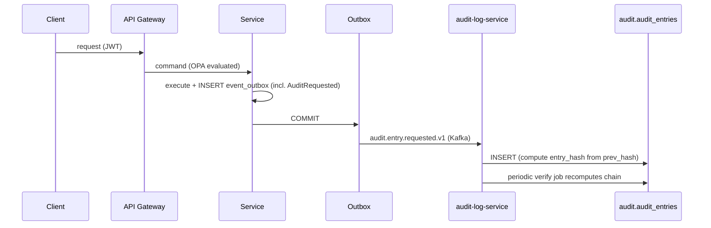

### 15.3 Retention

- Audit: **8 years** (SOC 2 / FMCSA combined ceiling for audit/compliance category).
- Retention per regulation table (§23.3); partitions dropped only after the regulation minimum elapses.

---

## 16. History / Event-Store Tables

### 16.1 Event Sourcing realization (ADR-001)

The **12 event-sourced aggregates** (`02` §3.2; count corrected by ADR-019 R1, which added `TrackingSession`) persist their event streams in append-only `*_events` tables inside their owning schema. Current-state projections are maintained by Kafka consumers.

| Event-sourced aggregate | Event table | Schema |
|---|---|---|
| VehicleTracker | `vehicle_tracker_events` | tracking |
| TrackingSession | `tracking_session_events` | tracking |
| Trip | `trip_events` | trip |
| Dispatch | `dispatch_events` | trip |
| ProofOfDelivery | `pod_events` | trip |
| MaintenanceWorkOrder | `workorder_events` | maintenance |
| DeviceCommand | `device_command_events` | telemetry |
| HOSLog | `hos_log_events` | compliance |
| DVIRInspection | `dvir_events` | compliance |
| Incident | `incident_events` | compliance |
| Invoice | `invoice_events` | billing |
| Notification | `notification_events` | notification |

### 16.2 Canonical event-store table shape

```sql
CREATE TABLE trip.trip_events (
    event_id        UUID         NOT NULL DEFAULT gen_random_uuid(),
    tenant_id       UUID         NOT NULL,
    aggregate_id    UUID         NOT NULL,           -- e.g., trip id
    aggregate_type  TEXT         NOT NULL,           -- 'Trip'
    event_type      TEXT         NOT NULL,           -- 'TripStarted', 'TripCompleted', ...
    event_version   SMALLINT     NOT NULL,           -- schema version of the event payload
    payload         JSONB        NOT NULL,            -- the event body (Avro-equivalent)
    metadata        JSONB        NOT NULL DEFAULT '{}'::jsonb,  -- correlation_id, causation_id, user_id
    aggregate_version INTEGER    NOT NULL,           -- position in the stream (optimistic concurrency)
    occurred_at     TIMESTAMPTZ  NOT NULL DEFAULT now(),
    PRIMARY KEY (aggregate_id, aggregate_version),
    UNIQUE (event_id)
) PARTITION BY RANGE (occurred_at);

CREATE INDEX ix_trip_events_type_time ON trip.trip_events (tenant_id, event_type, occurred_at DESC);

-- Stream consistency: aggregate_version is monotonic per aggregate
-- Replaying: SELECT payload FROM trip.trip_events
--            WHERE aggregate_id=$1 ORDER BY aggregate_version;
```

### 16.3 Snapshots (bound replay cost)

For long-lived streams (e.g., a `VehicleTracker` over years), snapshots are written every **100 events**:

```sql
CREATE TABLE trip.trip_snapshots (
    aggregate_id    UUID PRIMARY KEY,
    tenant_id       UUID         NOT NULL,
    aggregate_version INTEGER    NOT NULL,
    snapshot        JSONB        NOT NULL,            -- serialized aggregate state at version
    created_at      TIMESTAMPTZ  NOT NULL DEFAULT now()
);
```

Replay loads the snapshot, then replays events with `aggregate_version > snapshot.aggregate_version`.

---

## 17. GeoSpatial Data Model

### 17.1 Convention (PostGIS)

- **SRID 4326** (WGS84) for all stored geography; `geography(Point,4326)`, `geography(Polygon,4326)`.
- Distances in **metres** via `ST_Distance`, `ST_DWithin`; bounding-box pre-filter with `&&`.

### 17.2 Geofence storage — `tracking.geofences` — `Geofence`

```sql
CREATE TABLE tracking.geofences (
    id              UUID         PRIMARY KEY DEFAULT gen_random_uuid(),
    tenant_id       UUID         NOT NULL,
    name            TEXT         NOT NULL,
    geofence_type   TEXT         NOT NULL,           -- POLYGON, CIRCLE, CORRIDOR
    boundary        geography(Polygon, 4326) NOT NULL,
    center          geography(Point, 4326),          -- for CIRCLE
    radius_m        REAL,                             -- for CIRCLE
    schedule        JSONB,                            -- active hours, days
    alert_on        TEXT[]       NOT NULL DEFAULT '{ENTER,EXIT,DWELL}',
    dwell_sec       INTEGER,
    metadata        JSONB        NOT NULL DEFAULT '{}'::jsonb,
    version         INTEGER      NOT NULL DEFAULT 1,
    created_at      TIMESTAMPTZ  NOT NULL DEFAULT now(),
    updated_at      TIMESTAMPTZ  NOT NULL DEFAULT now()
);
CREATE INDEX ix_geofences_boundary ON tracking.geofences USING GIST (boundary);
CREATE INDEX ix_geofences_tenant   ON tracking.geofences (tenant_id);
```

### 17.3 Spatial query patterns

| Query | Pattern | Index |
|---|---|---|
| "Which geofences contain this position?" | `WHERE boundary && pos AND ST_Contains(boundary, pos)` | GiST on `boundary` |
| "Vehicles within X m of a point" | `WHERE ST_DWithin(geom, $pt, $m)` | GiST on positions.geom (compressed chunk-aware) |
| "Nearest vehicles to a depot" | `ORDER BY geom <-> $pt LIMIT k` | KNN GiST |

### 17.4 Geofence evaluation pipeline

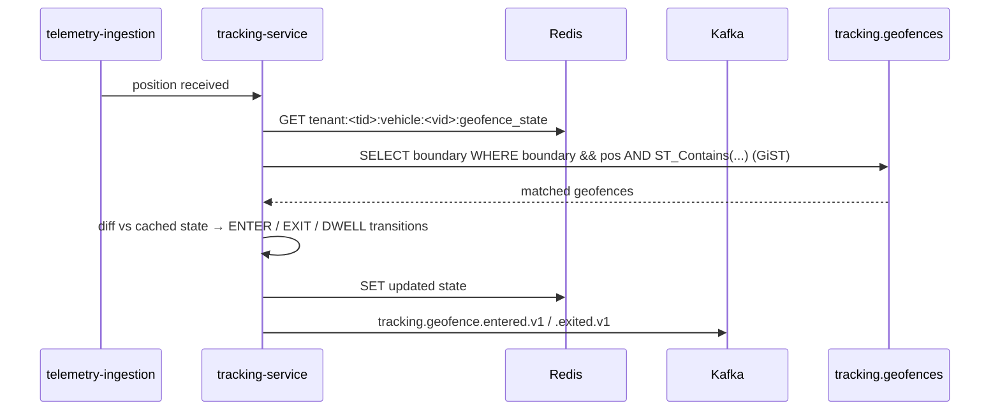

> **INV-T02 (geofence eval < 20ms)** — met by GiST index + Redis state cache + bounding-box pre-filter.

### 17.5 Routing

Turn-by-turn routing / ETA is **not** solved in-database; it delegates to a mapping provider (Mapbox/Google) per `01` §1. Computed routes persisted as simplified polylines (PostGIS `LineString`) for trip playback.

---

## 18. Cache Strategy (Redis)

### 18.1 What Redis holds (and why)

| Key pattern | Purpose | TTL | Eviction |
|---|---|---|---|
| `tenant:<tid>:vehicle:<vid>:pos` | Latest position (live map) | 2 × report interval | Expire |
| `tenant:<tid>:session:<sid>` | Auth session / token revocation flag | JWT TTL | Expire |
| `tenant:<tid>:ratelimit:<key>` | API rate-limit counter | 60s sliding | Expire |
| `tenant:<tid>:vehicle:<vid>:geofence_state` | Last geofence membership | 1h | Expire |
| `tenant:<tid>:quota:<resource>` | Usage meter (atomic INCR) | monthly bucket | Persist (snapshot to PG) |
| `tenant:<tid>:vehicle:<vid>:snapshot` | Aggregate snapshot (ES replay shortcut) | 1h | LRU |

### 18.2 Cache patterns

- **Cache-aside** for snapshots and lookups; **write-through** for latest-position (ingestion writes PG + Redis in the same pipeline).
- **Pub/sub** for real-time fan-out: `tracking-service` publishes position updates to `tenant:<tid>:channel:positions`; Socket.IO server subscribes and pushes to clients.
- **Redis Streams** as a fallback buffer for ingestion if Kafka is unavailable (short-window resilience).

### 18.3 Multi-tenant isolation

Cluster mode with **hash slots**; every key leads with `tenant:<tid>:` so a tenant's hot keys colocate on one shard (locality) and are trivially enumerable for per-tenant operations (flush, export).

### 18.4 Resilience

- AOF persistence (`appendfsync everysec`) → ≤1s RPO for cache rebuild.
- Cluster mode, 3 replicas, multi-AZ → `99.95%` SLA (§20).
- **Cache miss is never fatal.** Latest-position miss falls back to a Timescale `ORDER BY captured_at DESC LIMIT 1`; geofence-state miss recomputes from positions.

---

## 19. Migration Strategy

### 19.1 Tooling

- **Flyway** for SQL DDL migrations (versioned, repeatable).
- **Confluent Schema Registry** for Avro event-schema evolution (§22).
- **Expansion scripts** for data backfill (rare; coordinated with feature flags).

### 19.2 Zero-downtime: Expand–Contract

Every breaking schema change follows **expand → migrate → contract**:

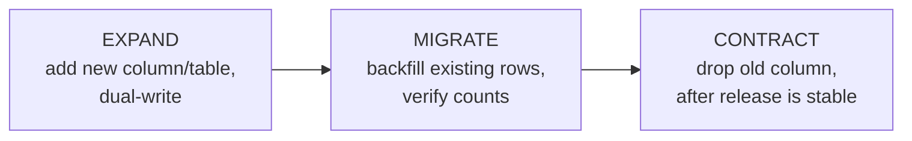

| Phase | Rule |
|---|---|
| Expand | Additive only (new column, new table, new index `CONCURRENTLY`). No DROP, no type-narrow. |
| Migrate | Backfill in batches (`UPDATE … WHERE id BETWEEN …`); throttle to <5% CPU. |
| Contract | Drop old after **two releases** in production with no reads. |

### 19.3 Constraints

- `CREATE INDEX CONCURRENTLY` (no `CREATE INDEX` in migrations for large tables).
- **No long-running `ALTER TABLE`** that rewrites tables in a single transaction — split into batches.
- Every migration reviewed by both the schema owner and DBA; large migrations dry-run on a snapshot.

### 19.4 Rollback

- Flyway supports `undo` only for the latest version; for irreversible changes, the rollback is a **forward migration** that restores prior shape (expand-contract again).
- Full DB PITR (§20) is the last-line rollback for catastrophic failures.

### 19.5 Environment promotion

`dev → staging → prod`. Every migration runs on a **production-snapshot** staging clone first; `pg_stat_statements` diff gates promotion.

---

## 20. Backup Strategy & Disaster Recovery

### 20.1 Backup strategy

| Component | Method | Frequency | Retention |
|---|---|---|---|
| PostgreSQL (all schemas) | **WAL-G** — WAL streaming + base backups to S3 | Continuous WAL; base backup every 6h | PITR 35 days; monthly archive 1 year |
| TimescaleDB | Included in PG backups (it's an extension) | (same) | (same) |
| Redis | AOF + RDB snapshots to S3 | Hourly RDB | 7 days |
| S3 (media, firmware) | **Versioning + cross-region replication (CRR)** | Continuous | Object-lock per class (§14.2) |
| Kafka | MSK broker snapshots + MirrorMaker to DR | Continuous | 7 days (tiered storage longer) |
| RabbitMQ | Quorum-queue replication across AZ; definitions export | Daily | 7 days |

### 20.2 DR targets (reproduces `01` §12.3)

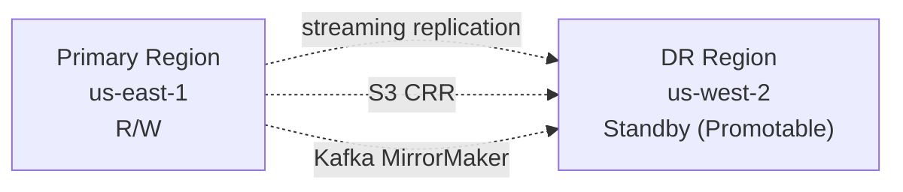

| Component | SLA | RPO | RTO | Strategy |
|---|---|---|---|---|
| Platform (overall) | 99.95% → 99.99% | < 1 min | < 15 min | Multi-AZ + DR region |
| PostgreSQL | 99.99% | < 1 min | < 5 min | Streaming replication + Patroni |
| Kafka | 99.99% | < 1 min | < 3 min | Multi-AZ RF=3, MirrorMaker to DR |
| RabbitMQ | 99.9% | n/a (transient) | < 5 min | Quorum queues multi-AZ |
| Redis | 99.95% | < 30 s | < 2 min | Cluster + AOF |
| TimescaleDB | 99.95% | < 1 min | < 5 min | Streams with PostgreSQL |
| S3 | 99.99% | < 15 min | < 5 min | Cross-region replication |

### 20.3 Restoration testing

- **Quarterly DR drill:** fail over to DR region, run smoke tests, fail back. Documented RTO/RPO measured.
- **Monthly restore test:** restore PG backup to an isolated cluster, validate row counts + sample aggregates.
- **Annual game-day:** simulated regional loss.

---

## 21. Database Deployment Architecture

### 21.1 Topology

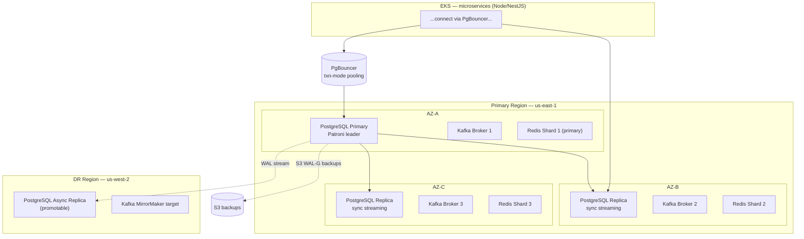

### 21.2 Connection management

- **PgBouncer** (transaction-mode) in front of every PG instance — caps connections, multiplexes.
- Services use a **read/write split**: writes → primary; reads → round-robin replicas (with caveats around replication lag — see §22).

### 21.3 Capacity (Year-1 baseline; scales horizontally)

| Component | Year-1 sizing |
|---|---|
| PostgreSQL primary | r6g.4xlarge (16 vCPU, 128 GB) + 2 replicas |
| TimescaleDB | Co-resident with PG (extension); dedicated node if Year-3 load demands |
| Redis | 3 shards × r6g.2xlarge, cluster mode, replicas |
| PgBouncer | 3 instances behind a NLB |

---

## 22. Data Flow Diagrams

### 22.1 CQRS write/read path

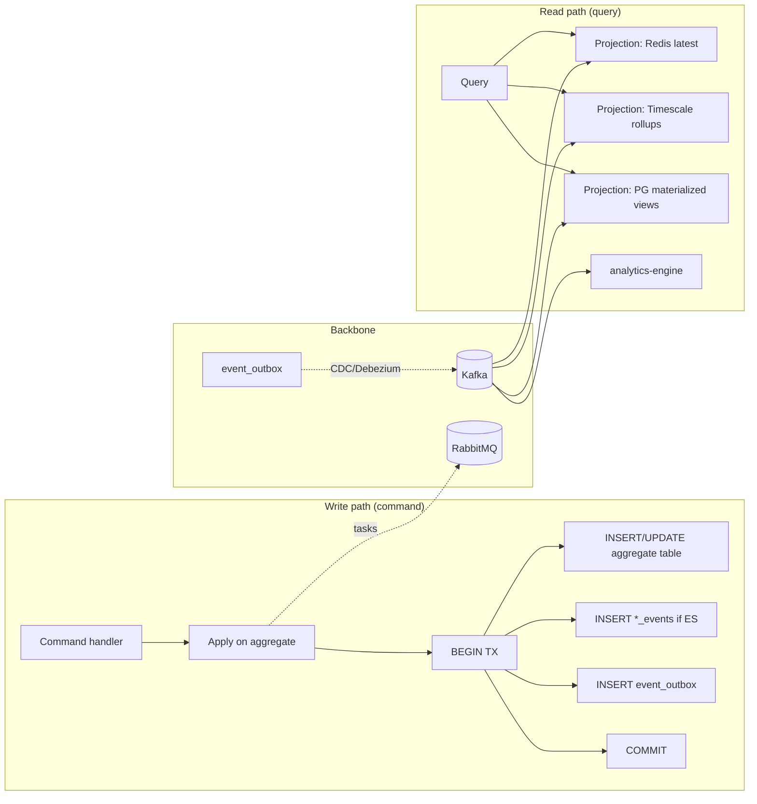

### 22.2 GPS ingest data flow (highest-volume path)

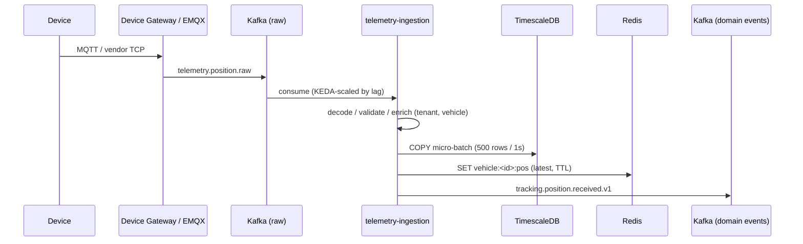

### 22.3 Event-sourcing replay flow (HOS audit example)

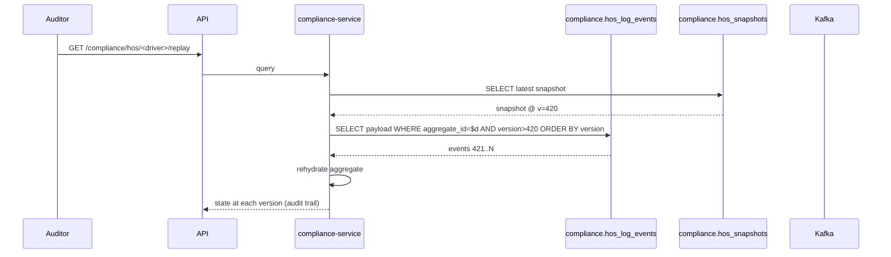

---

## 23. Capacity & Cost Model

### 23.1 Storage growth (Year 1 → Year 5) — lean footprint

| Store | Year 1 | Year 3 | Year 5 | Primary lever |
|---|---|---|---|---|
| TimescaleDB (GPS/telemetry + rollups) | ~3 TB | ~30 TB | ~120 TB | ~90% compression after 7d |
| PostgreSQL (OLTP + ES + JSONB + FTS) | ~250 GB | ~2.5 TB | ~10 TB | Partition + archive old events |
| S3 (media + firmware + backups) | ~10 TB | ~120 TB | ~600 TB | Lifecycle → IA → Glacier |
| Redis (hot cache) | ~50 GB | ~500 GB | ~2 TB | Eviction policies |
| ~~MongoDB~~ | — | — | — | Removed → JSONB (ADR-022) |
| ~~ClickHouse~~ | *(deferred)* | *(deferred)* | *(on trigger)* | Timescale continuous aggregates until trigger |
| ~~Elasticsearch~~ | *(deferred)* | *(deferred)* | *(on trigger)* | PG FTS until trigger |

### 23.2 GPS capacity math (Year 5 peak — preserves ARR DB figures)

| Metric | Value |
|---|---|
| Peak ingest | 600,000 events/sec |
| Peak daily volume | ~52 billion events |
| Avg row size (uncompressed) | ~120 bytes |
| Uncompressed / day | ~6.2 TB |
| After ~90% compression (warm) | ~0.6 TB/day |
| 90-day hot+warm retention | ~55 TB (compressed) |
| 24-month cold retention (S3 Parquet) | ~220 TB |

### 23.3 Retention (telemetry vs compliance — distinct)

| Data class | Retention | Driver |
|---|---|---|
| Telemetry (positions, sensor) | Tier-driven: 6 months (Standard) / 24 months (Professional) / custom (Enterprise) | Cost |
| Compliance / Audit (HOS, DVIR, audit entries) | Regulation-driven: 6 months – 8 years by category; **same for all tiers, non-negotiable** | FMCSA / SOC 2 |

### 23.4 Cost levers

| Lever | Savings |
|---|---|
| Reserved Instances (1-yr commits) | 30–40% |
| Spot Instances (ingestion / analytics) | 60–70% |
| Graviton (ARM) where compatible | 20% |
| TimescaleDB compression (after 7 days) | 70% on time-series |
| Kafka tiered storage (old segments → S3) | 40% on Kafka storage |
| S3 lifecycle (IA → Glacier) | up to 80% on object storage |
| Per-tenant attribution (Kubecost) | identify noisy tenants |

---

## 24. Conformance, Traceability & Open Triggers

### 24.1 ADR conformance

| ADR | Status | How this document conforms |
|---|---|---|
| ADR-001 (CQRS + ES) | Accepted | §16 event-store tables for 12 ES aggregates (count per ADR-019 R1); §22 CQRS flow |
| ADR-002 (Kafka backbone) | Accepted | §22 — Kafka carries all domain events; outbox pattern |
| ADR-003 (multi-tenant 3-tier) | Accepted | §3.2/§3.3 — dedicated instance / dedicated schema / RLS |
| ADR-007 (PostgreSQL primary) | Accepted + **expanded** | §3, §5 — PG now also carries documents (JSONB) and FTS |
| ADR-021 (Node runtime) | Accepted | Language-neutral at the data tier; no impact on this doc |
| **ADR-022 (lean persistence)** | **Accepted (supersedes ADR-008)** | §1.2 — PG + Timescale + Redis + S3 + Kafka + RabbitMQ; Mongo/CH/ES handled per §24.3 |
| ADR-016 (Kafka topic naming) | Accepted | Event topics follow `fleetvision.<domain>.<...>` |
| ADR-017 (behavior score) | Accepted | Score stored in `analytics` projections, computed by `analytics-engine` |

### 24.2 Aggregate-to-table traceability (rule: no table without domain justification)

Every table in §5 maps to an aggregate in `02` §3. The full map is reproduced in Appendix B. **No table in this document exists without an owning aggregate.** The 12 ES aggregates (per ADR-019 R1) carry both a current-state table (§5) and an event-store table (§16).

### 24.3 Deferred-store re-introduction triggers (ADR-022 §2.3)

| Store | Trigger | Threshold | Action |
|---|---|---|---|
| ClickHouse | Analytics query latency or rollup cost exceeds budget | Any dashboarding query P99 > **2s**, *or* continuous-aggregate storage > **40% of cluster**, *or* Year-5 scale band (≥1M vehicles) approaching | Author ADR; introduce ClickHouse for heaviest OLAP fact tables |
| Elasticsearch | FTS volume or relevance exceeds PG | Search QPS > **200 sustained**, *or* relevance/typo-tolerance needs unmet by `pg_trgm` | Author ADR; introduce Elasticsearch for search; logs stay in Loki |
| MongoDB | (none planned) | — | Permanently replaced by JSONB; a future ADR would be required |

### 24.4 Open items inherited from `01` Appendix B

| ID | Status | Note |
|---|---|---|
| F-5 (rebuild 03 for lean stack) | **Closed by this document (v3.0.0)** | The v2.0.0 MongoDB/ClickHouse/Elasticsearch store designs are fully superseded here. |
| F-3 (ADR-020 aggregate expansion) | Open | When `VehicleAsset → Asset` rename + Billing expansion are ratified, Appendix B updates one-for-one. No data-shape impact until then. |
| F-6 (02 service-language refs) | Open | Unrelated to data tier; tracked in `01` Appendix B. |

---

## Appendix A: Data Classification

| Class | Examples | At-Rest Encryption | Retention | Special Handling |
|---|---|---|---|---|
| **PII / Sensitive** | Driver SSN, license #, VIN, phone, email | AES-256 column-level (envelope) + tablespace | Per regulation (HOS 7y) | Masked in non-prod; GDPR-erasable |
| **Evidentiary** | HOS logs, DVIR, recordings, audit entries | AES-256 + Object Lock | 6mo–8y by category | Hash-chained; append-only |
| **Operational** | Vehicles, devices, trips, work orders | AES-256 (KMS) | Tier-driven | Standard |
| **Telemetry** | GPS positions, IO, diagnostics | AES-256 (KMS) | 6–24 months | Compressed + tiered |
| **Public/Config** | Firmware, geofence defs | SSE-KMS | Indefinite | Versioned |

## Appendix B: Aggregate → Table Traceability

Every table maps to an aggregate in `02` §3.2. (Selection; full table list in §2.1.)

| Aggregate (`02` §3) | Schema.Table | ES event table | Notes |
|---|---|---|---|
| Vehicle | fleet.vehicles | — | INV-F01 (VIN unique) |
| TelematicsDevice | telemetry.telematics_devices | — | INV-TEL01/02 |
| VehicleTracker | tracking.vehicle_positions (hypertable) + tracking.vehicle_trackers | tracking.vehicle_tracker_events | ES; positions immutable |
| TrackingSession | tracking.tracking_sessions | tracking.tracking_session_events | ES |
| Geofence | tracking.geofences | — | GiST boundary |
| Trip | trip.trips | trip.trip_events | ES; INV-TR01 |
| Dispatch | trip.dispatches | trip.dispatch_events | ES; INV-TR02 |
| ProofOfDelivery | trip.proofs_of_delivery | trip.pod_events | ES |
| MaintenanceWorkOrder | maintenance.maintenance_work_orders | maintenance.workorder_events | ES; INV-M02 |
| HOSLog | compliance.hos_logs | compliance.hos_log_events | ES + hash chain; INV-C01 |
| DVIRInspection | compliance.dvir_inspections | compliance.dvir_events | ES; INV-C02 |
| Incident | compliance.incidents | compliance.incident_events | ES |
| Invoice | billing.invoices | billing.invoice_events | ES; INV-B01 |
| Notification | notification.notifications | notification.notification_events | ES |
| AuditEntry | audit.audit_entries | — (append-only) | Hash-chained; INV-A01 |
| VideoChannel | media.video_channels | — | INV: one source mode |
| Recording | media.recordings | — | Hash-chained; INV-MED01 |
| AIAlert | media.ai_alerts | — | INV-MED02 (no face recognition) |
| DriverProfile | driver.driver_profiles | — | INV-D01 |
| DriverAssignment | driver.driver_assignments | — | One active per vehicle/driver |
| VehicleAsset | asset.vehicle_assets | — | (ADR-020 may rename) |

## Appendix C: Referenced ADRs

| ADR | Title | Effect on this document |
|---|---|---|
| ADR-001 | CQRS + Event Sourcing | §16 event-store tables; §22 CQRS flow |
| ADR-002 | Kafka as event backbone | §22 Kafka carries all domain events |
| ADR-003 | Hybrid multi-tenancy (3 tiers) | §3.2/§3.3 isolation realization |
| ADR-007 | PostgreSQL 16 as primary OLTP | §3, §5 — role expanded to JSONB + FTS |
| ADR-008 | Polyglot persistence | **Superseded by ADR-022**; removed from this doc |
| ADR-016 | Kafka topic naming | §22 event topic names |
| ADR-017 | Driver behavior score owner | §5.9 + analytics projections |
| ADR-021 | Node.js runtime (supersedes ADR-006) | No data-tier impact |
| ADR-022 | Lean persistence (supersedes ADR-008) | **Foundation of this v3.0.0 rebuild** |

---

*This Database Architecture is the canonical persistence reference for FleetVision. It is reviewed quarterly by the Architecture Review Board and updated through the ARB process. It is traced aggregate-by-aggregate to `02_Domain_Model.md` and conforms to the ADR set in `Decisions/`.*
