# FleetVision — Device Gateway Architecture

**Version:** 1.0.0
**Status:** Approved — Architecture Reference
**Date:** 2026-08-02
**Owner:** IoT Platform Architect / Chief Software Architect
**Classification:** Confidential — Architecture Reference

> **About this document.** This is the canonical architecture-tier specification for the FleetVision **Device Gateway** — the multi-protocol TCP/UDP ingestion front tier of the Telematics bounded context (`02_Domain_Model.md` §1, Context 6). It defines *how* vendor device protocols are terminated, authenticated, normalized, and forwarded into the event backbone on the **Node.js LTS + NestJS + TypeScript** runtime (ADR-021).
>
> **Relationship to prior work.** This document **supersedes** `Modules/DeviceGateway.md` v2.0.0, which was written for the retired Go runtime (ADR-006) and is now inconsistent with ADR-021 (Go retired; `device-gateway-service` is `Node / TS` per `01` §3 Service Registry #7). The v2.0.0 module's *domain, protocol, and scaling* content was sound and is carried forward here; only the *runtime and implementation* layer changes. `Modules/DeviceGateway.md` is marked superseded by a one-line pointer (no content deleted). This closes the DeviceGateway piece of follow-up **F-7** in `01` Appendix B.
>
> **Conforms to:** `00_Project_Vision.md` v2.1.0 (Scale pillar, BG-7), `01_Master_Architecture.md` v2.2.0 (§3 #7, §4.1, §6), `02_Domain_Model.md` v2.0.0 (Context 6, Telematics aggregates/events/permissions), `03_Database_Architecture.md` v3.0.0 (`telemetry` schema, Redis key conventions), ADR-002 (Kafka), ADR-014 (Device Gateway decision, runtime updated by ADR-021), ADR-016 (topic naming), ADR-021 (Node runtime).

---

## Table of Contents

1. [Gateway Architecture](#1-gateway-architecture)
2. [Supported Protocols & Capability Matrix](#2-supported-protocols--capability-matrix)
3. [TCP Server Design](#3-tcp-server-design)
4. [UDP Server Design](#4-udp-server-design)
5. [Connection Management](#5-connection-management)
6. [Device Session Management](#6-device-session-management)
7. [Authentication Handshake](#7-authentication-handshake)
8. [Packet Processing Pipeline](#8-packet-processing-pipeline)
9. [Protocol Adapter Pattern](#9-protocol-adapter-pattern)
10. [Parser Architecture & Message Normalization](#10-parser-architecture--message-normalization)
11. [Domain Model (DDD)](#11-domain-model-ddd)
12. [Device Online State, Heartbeat, Reconnect, Timeout](#12-device-online-state-heartbeat-reconnect-timeout)
13. [Packet Queue & Message Broker Integration](#13-packet-queue--message-broker-integration)
14. [Performance: Millions of Devices](#14-performance-millions-of-devices)
15. [Horizontal Scaling, Load Balancing, Fault Tolerance](#15-horizontal-scaling-load-balancing-fault-tolerance)
16. [Database: Device State, Sessions, Protocol Configuration](#16-database-device-state-sessions-protocol-configuration)
17. [Diagrams](#17-diagrams)
18. [Conformance, Traceability & Open Items](#18-conformance-traceability--open-items)

---

## 1. Gateway Architecture

### 1.1 Purpose

Most real-world telematics hardware does **not** speak MQTT. Commodity GPS trackers (GT06, Concox, Meitrack, Teltonika, Queclink) and Chinese-standard in-vehicle hardware (JT808, JT1078) speak **vendor-specific binary protocols over TCP**, with a minority using **UDP**. The Device Gateway terminates these protocols, decodes the binary frames, authenticates the device against the FleetVision registry, normalizes every payload to one canonical `DeviceMessage`, and forwards the result onto the Kafka event backbone for `telemetry-ingestion-service` to consume.

It is a **stateless-at-the-edge, stateful-per-connection** service: any gateway pod can serve any device, while per-connection (TCP) or per-source (UDP) state lives in process memory + Redis.

### 1.2 Goals & Non-Goals

| Goals | Non-Goals |
|---|---|
| Terminate N vendor protocols (TCP + UDP) on one service | Replace the MQTT path (EMQX) — gateway *bridges into* it |
| Add a new protocol via a single adapter module (no core changes) | Device lifecycle (provisioning, decommission) — `device-management-service` owns |
| Sustain ≥ 100K concurrent TCP connections per pod | Firmware OTA distribution — `device-management-service` owns |
| Normalize all payloads to one canonical `DeviceMessage` | Real-time WebSocket push to UI — `tracking-service` owns |
| Never drop data silently (back-pressure > loss) | Heavy business logic — push downstream to `telemetry-ingestion` |

### 1.3 Scale Targets (from `00` §8.1, `01` §12)

| Metric | Year 1 | Year 3 | Year 5 |
|---|---|---|---|
| Concurrent device connections | 50,000 | 500,000 | 2,000,000 |
| Messages/sec (platform peak) | 15,000 | 150,000 | 600,000 |
| Per-pod capacity (TCP) | 100,000 connections / 20,000 msg/s | — | — |
| Gateway pods (cluster) | 3 | 15 | 30–50 |
| End-to-end device→Kafka latency | < 500ms P99 | — | — |

### 1.4 Architecture Overview

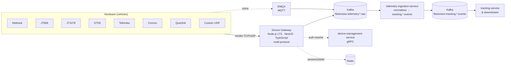

### 1.5 NestJS Module Structure (Clean Architecture)

The gateway is a NestJS application whose module boundaries mirror Clean Architecture layers. The protocol adapters are the only place that knows about vendor formats; everything inside the application core operates on the canonical `DeviceMessage`.

| NestJS Module | Layer | Responsibility |
|---|---|---|
| `TransportModule` (TCP/UDP) | Infrastructure | `net`/`dgram` servers; accept loops; socket I/O |
| `ProtocolAbstractionModule` | Interface | Protocol registry; adapter lifecycle; detection |
| `AdaptersModule` | Interface | One adapter per vendor (Meitrack, JT808, JT1078, GT06, Concox, Teltonika, Queclink, + plugin loaders) |
| `SessionModule` | Application | Session lifecycle, state machine, two-tier store |
| `PipelineModule` | Application | Decode → validate → auth → normalize → publish stages |
| `AuthModule` | Application | Device resolution; Redis cache + gRPC fallback |
| `KafkaProducerModule` | Infrastructure | Batched Avro producer (event backbone, ADR-002) |
| `AdminModule` | Interface | REST admin API + gRPC service-to-service |

---

## 2. Supported Protocols & Capability Matrix

### 2.1 Protocol Catalog

| Protocol | Vendor / Standard | Transport | Framing | Auth Strategy | Default Port |
|---|---|---|---|---|---|
| **Meitrack** | Meitrack (Taiwan) — MVT380, MT90, P99B | TCP (some UDP) | Mixed text/binary; `$$<len>...<crc>*` | IMEI in first packet | 5023 |
| **JT808** | Chinese national JT/T 808-2019 (commercial vehicle) | TCP (+ SSL) | Length-prefixed; byte-stuffed; `0x7e` delimited | 0x0100 register → auth key → 0x0102 | 7611 |
| **JT1078** | JT/T 1076/1078 (in-vehicle A/V companion to JT808) | RTP-over-TCP | RTP-like header `0x30 0x31...` | Inherits JT808 session | 1078 |
| **GT06** | Connox / widely cloned (GT06, GT06N, TR06) | TCP (+ UDP variants) | Start `0x78 0x78`, CRC-16, stop `0x0D 0x0A` | Login 0x01 → 8-byte IMEI (BCD) | 5016 |
| **Teltonika** | Teltonika (Lithuania) — FMC130, FMC640, FMB920 | TCP (+ TLS) | IMEI packet → AVL data; Codec8/8 Ext/16 | IMEI first; gateway acks 0x01 | 4820 |
| **Concox** | Concox family (CR/JT/X series, beyond GT06) | TCP (some UDP) | GT06-compatible; extra protocol nums | IMEI/serial login | 5017 |
| **Queclink** | Queclink (China) — GV300, GV500, GL300 | TCP (+ UDP keepalive) | Queclink binary; `+RESP:` text variants | IMEI/UID in first packet | 5408 |
| **Custom Plugin** | Customer-specific | TCP or UDP | Adapter-defined | Adapter-defined | configured |

### 2.2 Capability Matrix

| Capability | Meitrack | JT808 | JT1078 | GT06 | Teltonika | Concox | Queclink |
|---|---|---|---|---|---|---|---|
| GPS position | ✅ | ✅ | — | ✅ | ✅ | ✅ | ✅ |
| Ignition / IO | ✅ | ✅ | — | ✅ | ✅ | ✅ | ✅ |
| Alarms | ✅ | ✅ | — | ✅ | ✅ | ✅ | ✅ |
| Heartbeat | ✅ | ✅ | — | ✅ | ✅ | ✅ | ✅ |
| Downstream commands | ✅ | ✅ | ✅ | partial | ✅ | partial | ✅ |
| Diagnostics (DTC) | ✅ | ✅ | — | partial | ✅ | partial | ✅ |
| Photo / video | partial | ✅ | ✅ | — | ✅ | ✅ | partial |
| UDP transport | some | — | — | some | — | some | some |
| Checksum | CRC | byte-stuff + CS | RTP | CRC-16 | CRC-32 | CRC-16 | CRC-16 |

### 2.3 Protocol Detection

For **dedicated listeners** (one port per protocol), detection is by port. For **multiplexed listeners** (one port, many protocols — used in elastic deployments), adapters expose a `detect()` that peeks the first N bytes and returns a confidence score; the Protocol Abstraction Layer picks the highest-confidence adapter above a threshold.

| Peek signal | Detected |
|---|---|
| Starts with `$$` / `\x24\x24` | Meitrack |
| Starts with `0x78 0x78` / `0x79 0x79` | GT06 / Concox |
| First frame = 2-byte length + 15-byte ASCII IMEI | Teltonika |
| JT/T 808 message-id in header + BCD phone | JT808 |
| RTP-over-TCP (`$\x00\x00…`) following JT808 setup | JT1078 |
| `+RESP:` / `+ACK:` text prefix or Queclink binary header | Queclink |

---

## 3. TCP Server Design

The TCP server terminates vendor TCP protocols. Node's event-loop I/O model fits this workload (the hot path is I/O-bound framing + decode, not CPU), which is why ADR-021 collapsed the prior Go ingestion tier into the Node runtime.

### 3.1 Per-Protocol Listeners

The gateway opens one `net.Server` per enabled protocol; each listener runs an accept loop that spawns a **connection handler** per accepted socket. Connection handlers run as async iterators on top of Node streams — *not* one OS thread per connection (Node is single-threaded with a libuv worker pool for CPU-bound stages).

### 3.2 Connection Handler (async-iterator model)

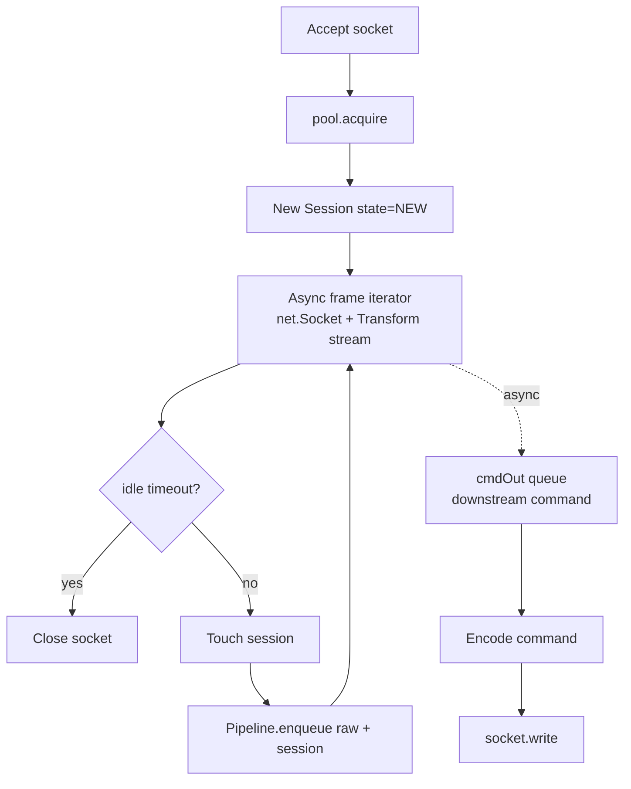

### 3.3 Buffering & Deadlines

| Setting | Value | Rationale |
|---|---|---|
| Read buffer (high-water mark) | 16–64 KB | Most frames < 512 B; AVL/media bursts larger |
| Idle timeout (`socket.setTimeout`) | reset on every framed read | drives idle timeout without a separate timer |
| TCP keepalive (OS) | off (app heartbeat) | consistent across platforms |
| `setNoDelay(true)` | on (Nagle off) | request/response protocols — latency > throughput |
| Max frame size | 64 KB per adapter | protects against malicious oversize |

### 3.4 Worker pool for CPU-bound decode

Binary decode (especially Codec8 Extended, byte-stuff reversal, CRC verification) is CPU-bound. To avoid blocking the event loop under load, the decode stage runs on the **libuv worker pool** via `worker_threads` for the heaviest decoders, while light decoders run inline. The pipeline stage boundary (§8) is where on-thread vs worker-thread is chosen per adapter.

### 3.5 TLS Termination

For protocols supporting TLS (Teltonika, JT808-SSL), the listener wraps `tls.Server` with certs from Vault (rotated by cert-manager). Legacy plaintext protocols sit behind a TLS-terminating sidecar only where regulation requires; otherwise mTLS at the device where supported.

---

## 4. UDP Server Design

UDP is a **first-class transport** in this gateway. Several supported protocols (some GT06 variants, Concox UDP, Queclink UDP keepalive, and certain custom trackers) are UDP-primary or UDP-fallback. UDP is connectionless, so the gateway maintains a **pseudo-session** keyed by `(device_id, src_ip:port)` once the device has authenticated.

### 4.1 UDP Listener

The gateway opens one `dgram.Socket` per enabled UDP protocol (per `bind()` port). A single socket serves many devices; inbound datagrams are demultiplexed by source endpoint.

### 4.2 Pseudo-Session Model

Because UDP has no connection event, the gateway synthesizes one:

| Concept | TCP | UDP |
|---|---|---|
| Session establishment | `connect` event | First datagram whose payload authenticates |
| Session key | socket + `DeviceID` | `(DeviceID, src_ip:port)` |
| Liveness | idle timeout on socket | **soft TTL** refreshed per datagram; expiry → stale |
| Command delivery | write to socket | send datagram to `src_ip:port` (best-effort) |
| Ordering | per-socket | per-source (best-effort; protocols tolerate reorder) |
| Reliability | TCP guarantees | **none** — protocol-level ack where required |

### 4.3 UDP Datagrams → Pipeline

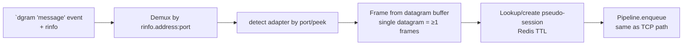

### 4.4 UDP-Specific Concerns

| Concern | Handling |
|---|---|
| No connection state | Pseudo-session in Redis with short TTL (default 2× expected report interval); refreshed on each datagram |
| Packet loss | Protocol-level ack where the vendor defines one (e.g., Queclink); otherwise best-effort. Positions are time-series — a lost fix is recovered by the next, never re-requested |
| Duplicate datagrams | Idempotency on `(device_id, message_id)`; consumers dedupe (same rule as TCP) |
| MTU / fragmentation | Datagrams > ~1400 B fragmented at IP; adapter validates reassembled length + CRC before accept |
| Source spoofing | Auth handshake binds `DeviceID` to `src_ip:port`; a spoofed source fails auth (unknown IMEI) or collides with an established pseudo-session (rejected as duplicate-source) |

### 4.5 Shared decode path

UDP and TCP feed the **same pipeline** from §8 onward. The transport-specific code ends at `Pipeline.enqueue`; decode/validate/auth/normalize/publish are transport-agnostic.

---

## 5. Connection Management

### 5.1 Connection Pool

Each pod maintains a bounded connection pool (default cap 100K TCP sockets). When full, the gateway stops accepting — the load balancer retries another pod or the device retries. This is **back-pressure, not silent drop** (vision guardrail: back-pressure > data loss).

### 5.2 Eviction Policy

When pressure demands eviction: NEW > 10s first; then no-data > 3× reporting interval; **never** authenticated-with-data sessions. Eviction emits a `connection.closed` admin event with reason.

### 5.3 Back-Pressure Chain

Bounded async queues between pipeline stages; when Kafka is slow, the chain fills backwards until the read loop blocks, the socket buffer fills, and the device backs off (most protocols are polling/ack-based). **No data is silently dropped.**

---

## 6. Device Session Management

A **session** is the live association between a resolved device identity and its transport endpoint (TCP socket or UDP pseudo-source). Sessions are the unit of command dispatch and liveness monitoring.

### 6.1 Session Lifecycle State Machine

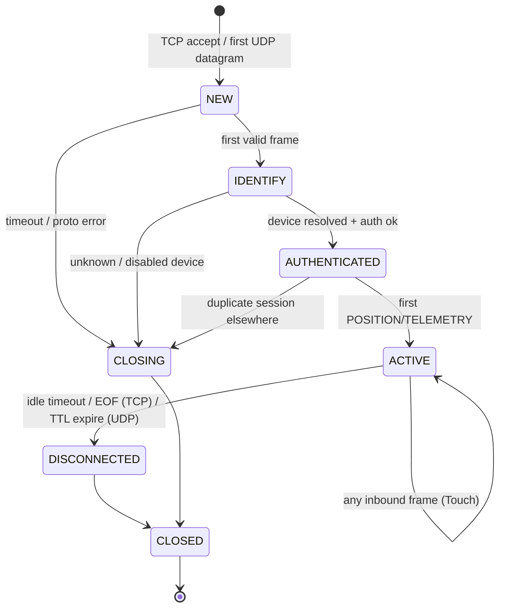

**Invariants:**
1. A `DeviceMessage` is **never** published before AUTHENTICATED (cannot tag valid `tenant_id` otherwise) — fail-closed.
2. A downstream command is **never** written to a socket in NEW/IDENTIFY/CLOSING.
3. `SessionID` is stable for the connection's life; reconnect yields a new `SessionID`.

### 6.2 Two-Tier Session Store

| Tier | Where | Purpose |
|---|---|---|
| **Local** (in-process) | `Map<DeviceID, Session>` sharded by DeviceID | O(1) command dispatch on the owning instance |
| **Global** (Redis) | `tenant:<tid>:device:<did>:session` → `{instanceID, sessionID, protocol, transport, since, lastSeen}` | Cross-instance lookup: "which pod holds this device?" |

> **Redis key convention.** Keys follow the `tenant:<tid>:` namespace mandated by `03` §18.3 (every Redis key leads with tenant for colocation and per-tenant operations). The prior v2.0.0 module used the unprefixed `session:device:<id>`; that is reconciled here to the canonical convention.

Downstream command flow: Kafka `fleetvision.telemetry.command.request` → gateway looks up `tenant:<tid>:device:<id>:session` in Redis → owning instance → enqueue on local `cmdOut` queue → encode → write to socket (TCP) or send datagram (UDP). No session → NACK `DEVICE_OFFLINE`.

### 6.3 Reconnection & Affinity

Devices roam between pods (LB round-robin). A new connection from a known `DeviceID` → replace session: prior instance detects EOF (TCP) or TTL expire (UDP) → DISCONNECTED → deletes local; new instance registers globally (last-write-wins on Redis with `EstablishedAt` comparison); the older connection is forcefully closed with `DUPLICATE_SESSION` where the protocol supports it.

---

## 7. Authentication Handshake

### 7.1 Stages

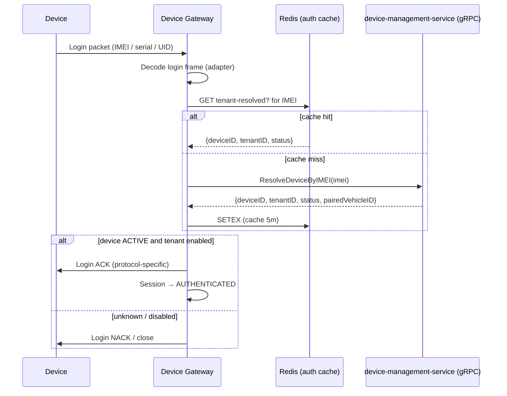

### 7.2 Resolution Levels (cache ladder)

1. **L1 — local LRU** (in-process, ~30s): hottest devices; sub-millisecond.
2. **L2 — Redis** (`tenant:<tid>:device:<did>:auth`, TTL 5m): cross-pod cache.
3. **L3 — `device-management-service` gRPC**: source of truth (`telemetry.telematics_devices`).

Cache miss at L3 means the device is unknown → reject and close. Cache entries are **invalidated on disable/decommission** via `telemetry.device.provisioned.v1` (and the disable counterpart) consumed from Kafka.

### 7.3 Auth failure handling

| Outcome | Action |
|---|---|
| Unknown IMEI | Send protocol NACK where supported; close; metric `auth.fail.unknown` |
| Disabled / decommissioned device | Close; metric `auth.fail.disabled` |
| Tenant suspended | Close; metric `auth.fail.tenant_suspended` |
| L3 unreachable (gRPC down) | Circuit breaker; serve from L1/L2; on miss → fail-safe close (do not accept untrusted) |

---

## 8. Packet Processing Pipeline

Once framing yields a `RawPacket`, it enters an **asynchronous, staged pipeline**. Decoupling decode/normalize/publish from the read loop keeps the hot path responsive — one slow Kafka produce must not stall reads.

### 8.1 Stages

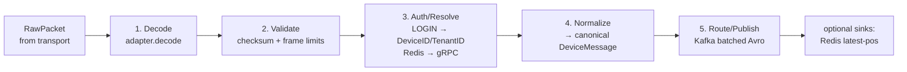

| Stage | Responsibility | Failure Handling |
|---|---|---|
| Decode | `adapter.decode(raw)` → vendor intermediate | Drop + `decode.error` metric |
| Validate | checksum/CRC; size limits | Drop + `validation.error` |
| Auth/Resolve | LOGIN: `serialOrIMEI` → `deviceID/tenantID` (L1→L2→L3) | Send auth-fail; close conn |
| Normalize | vendor intermediate → canonical `DeviceMessage` | Log + drop |
| Route/Publish | pick Kafka topic by `type`; batched Avro | back-pressure via bounded queue |

### 8.2 Back-Pressure

Bounded async queues between stages; when Kafka is slow:

```
transport → decodeQueue (cap 10K) → validate → publishQueue (cap 5K) → Kafka
                                            │ when full →
                                  blocks upstream → decodeQueue fills →
                                  transport read blocks (TCP back-pressure) / datagrams queue briefly (UDP)
```

### 8.3 Worker Model

| Stage | Concurrency model | Bound |
|---|---|---|
| Decode | libuv pool (`worker_threads` for heavy codecs) | CPU |
| Validate | inline on event loop | CPU (cheap) |
| Auth/Resolve | async I/O (Redis / gRPC) | Redis/PG I/O |
| Normalize | inline on event loop | CPU (cheap) |
| Publish | async Kafka producer (batched) | Kafka I/O |

### 8.4 Idempotency & Ordering

- **Ordering per device** preserved by Kafka key = `device_id` → single partition → per-device consumer order.
- **Idempotency** by `messageId` (UUIDv7); consumers dedupe on `(device_id, message_id)`.
- **Late/duplicate frames** detected via `(device_id, deviceTimestamp)` Redis cache (5-min window).

---

## 9. Protocol Adapter Pattern

The Protocol Abstraction Layer (PAL) is the contract between the transport machinery and vendor-specific decoders. Every adapter implements the same interfaces, so the TCP/UDP servers, session manager, and pipeline are fully protocol-agnostic.

### 9.1 Adapter Contract (TypeScript interface, illustrative — not implementation code)

```typescript
// Every protocol adapter implements this contract.
interface ProtocolAdapter {
  readonly id: string;                 // 'meitrack' | 'jt808' | 'gt06' | ...
  readonly meta: ProtocolMeta;
  detect(peek: Buffer): { confidence: number; consume: boolean };
  frame(reader: ByteReader): RawPacket | null;   // streaming frame parser
  decode(raw: RawPacket): DeviceMessage;          // vendor → canonical
  encode(cmd: DeviceCommand): Buffer;             // downstream command → wire bytes
}

interface ProtocolMeta {
  name: string; defaultPort: number; transport: 'tcp' | 'udp' | 'both';
  framingType: string; authStrategy: string; deviceModels: string[];
}

interface RawPacket {
  protocolId: string; payload: Buffer; receivedAt: Date; direction: 'INBOUND' | 'OUTBOUND';
}
```

### 9.2 Canonical `DeviceMessage` (the normalization target)

Every protocol's decoded payload normalizes to **one** canonical structure — downstream code never sees vendor formats. Aligned to the payload of `fleetvision.telemetry.position.raw.v1` (§13).

```typescript
interface DeviceMessage {
  messageId: string;          // UUIDv7 — idempotency key
  deviceId: string;           // resolved FleetVision device id (post-auth)
  serialOrImei: string;       // raw identifier from wire
  tenantId: string;           // resolved tenant
  protocolId: string;
  type: MessageType;          // LOGIN | POSITION | ALARM | HEARTBEAT | COMMAND_ACK | ...
  timestamp: Date;            // device-reported time (UTC)
  ingestedAt: Date;           // gateway receive time
  position?: Position;
  alarms?: Alarm[];
  telemetry?: Record<string, unknown>;   // rpm, fuel, temp, di/ai, ...
  io?: Record<string, unknown>;
  rawSize: number;
  checksum: string;           // SHA-256 of payload (forensics)
}
```

### 9.3 Plugin Discovery

| Mode | Mechanism | Use |
|---|---|---|
| **Built-in (compiled)** | Adapter Nest modules imported in `AppModule`; self-register via `onModuleInit()` | Default 7 protocols — fastest, type-safe |
| **Out-of-tree (dynamic)** | Adapter packages loaded at startup via Node `require()`/`import()` from a configured directory | Customer-specific / experimental protocols without recompile |

> Unlike the retired Go `plugin` model (Linux-only `.so`, matching-toolchain), Node dynamic `import()` is cross-platform and requires only a package boundary. This is a net simplification from the Go runtime — documented as a positive consequence of ADR-021.

### 9.4 Hot Reload

- **Admin API / SIGHUP**: enable/disable adapters without restart; new listeners opened, retired ones drained.
- **Plugin reload**: out-of-tree adapters swappable via admin API; existing connections finish on the old adapter, new connections use the new one.

---

## 10. Parser Architecture & Message Normalization

### 10.1 Streaming Frame Parsers

Each adapter implements `frame(reader)` as a **pull-based streaming parser** over a `ByteReader` (a small abstraction over `net.Socket`/`dgram` buffers). The parser consumes bytes, applies the protocol's framing rule (length-prefix, delimiter, byte-stuffing), verifies the checksum, and emits complete `RawPacket`s. Partial frames block until more bytes arrive — there is no buffering of incomplete packets at a higher layer.

### 10.2 Normalization Rules

| Vendor Concept | Canonical Field |
|---|---|
| IMEI / phone / serial / UID in login | `serialOrImei` → resolve → `deviceId` |
| GPS fix (lat/lng/speed/heading/time) | `position` |
| Digital/analog IO (Teltonika Codec8 DIO/AIO, GT06 IO, Queclink IO) | `telemetry` map |
| Alarm / SOS / geofence / power-cut | `alarms[]` with `source` = raw vendor code |
| Heartbeat / keepalive | `type=HEARTBEAT` (no `position`) |
| JT808 0x0200 location | `type=POSITION` + alarms from 0x02 bitfield |
| JT1078 0x9101/0x9102 video trigger | `type=PHOTO` → forwarded to `media-service` via Kafka |
| Teltonika ignition bit | `position.ignitionOn`, `telemetry` |
| Queclink `+RESP:GTFRI` | `type=POSITION`; `+RESP:GTALM` → `type=ALARM` |

### 10.3 Forensic Integrity

Every `DeviceMessage` carries `checksum` (SHA-256 of the raw payload). This is **not** the protocol CRC (which is for transport integrity) — it is an application-level fingerprint retained into Kafka + `03` audit projections for forensic replay and dispute resolution.

---

## 11. Domain Model (DDD)

The Device Gateway participates in the **Telematics bounded context** (`02` §1, Context 6). It owns no aggregates that require cross-service persistence of business state — it is an ingestion/translation service. Its DDD elements are scoped accordingly: it owns the **ingestion-tier** view of Telematics aggregates and produces events others consume.

### 11.1 Entities (within the gateway)

| Entity | Identity | Lifecycle | Notes |
|---|---|---|---|
| `DeviceSession` | `sessionId` (UUIDv7) | connection-bound | Aggregate root of the session sub-domain (transient) |
| `Connection` | `connectionId` | socket-bound | Wraps `net.Socket` / `dgram` source + rinfo |
| `RawPacket` | (value, no identity) | per-frame | Decoded frame pre-normalization |
| `DeviceMessage` | `messageId` (UUIDv7) | immutable | The normalized canonical event payload |

### 11.2 Aggregate

| Aggregate Root | Context role | Persisted? | Key Invariant |
|---|---|---|---|
| `DeviceSession` | Ingestion-tier session (transient) | Redis only (TTL) | A `DeviceMessage` is never published before the session is `AUTHENTICATED` |

The gateway references — but does **not** own — the durable Telematics aggregates defined in `02` §3.2: `TelematicsDevice`, `FirmwarePackage`, `DeviceCommand` (ES). These are owned by `device-management-service`; the gateway reads them via gRPC and emits events *about* them.

### 11.3 Commands (inbound to the gateway)

| Command | Source | Effect |
|---|---|---|
| `ResolveDevice` | auth stage | Resolve IMEI → `{deviceId, tenantId}` |
| `OpenSession` | transport accept | Create `DeviceSession` (NEW) |
| `AuthenticateSession` | auth stage | Transition session → AUTHENTICATED |
| `CloseSession` | timeout / error / admin | Transition → CLOSED; clean up |
| `SendDeviceCommand` | Kafka `command.request` | Encode + write to socket / send datagram |
| `ManageListener` | admin API | Enable/disable protocol listener |

### 11.4 Queries

| Query | Source | Result |
|---|---|---|
| `GetSession(deviceId)` | admin / gRPC | `SessionInfo` |
| `ListSessions(filter)` | admin | paginated sessions (tenant/protocol/device) |
| `GetListener(adapterId)` | admin | listener status |
| `GetStats()` | admin / metrics | per-protocol counts |

### 11.5 Events (produced / consumed)

**Produced** (to Kafka, ADR-016 `fleetvision.<domain>.<...>` convention):

| Event | Topic | Trigger |
|---|---|---|
| `telemetry.position.raw.v1` | `fleetvision.telemetry.position.raw` | POSITION message normalized |
| `telemetry.alarm.raw.v1` | `fleetvision.telemetry.alarm.raw` | ALARM message normalized |
| `telemetry.device.raw.v1` | `fleetvision.telemetry.device.raw` | LOGIN / HEARTBEAT / TELEMETRY |
| `telemetry.command.ack.v1` | `fleetvision.telemetry.command.ack` | Device acknowledges a downstream command |
| `telemetry.session.lifecycle.v1` | `fleetvision.telemetry.session.lifecycle` | Session state transitions (AUTHENTICATED/DISCONNECTED/STALE) — drives online-state projections |

**Consumed**:

| Event | Topic | Handler Action |
|---|---|---|
| `telemetry.command.request.v1` | `fleetvision.telemetry.command.request` | Route to owning instance → encode → write to socket |
| `telemetry.device.provisioned.v1` | `fleetvision.telemetry.device.events` | Refresh/invalidate L1/L2 auth cache |

> The gateway does **not** produce domain events like `telemetry.device.provisioned.v1` or `telemetry.command.completed.v1` — those are owned by `device-management-service` (`02` §5). The gateway produces **raw** ingestion events that `telemetry-ingestion-service` consumes and re-emits as canonical domain events. This separation preserves the single-writer-per-aggregate rule.

---

## 12. Device Online State, Heartbeat, Reconnect, Timeout

### 12.1 Online State (three concepts, deliberately distinct)

| Concept | Definition | Default | Source |
|---|---|---|---|
| **Connection liveness** | Is the socket/pseudo-session open? | per transport | gateway |
| **Data liveness** | Time since last *useful* payload (POSITION/TELEMETRY) | 3× reporting interval | gateway |
| **Device online (domain)** | Is the device considered online for UI/API? | derived from session + data liveness | `tracking-service` projection (consumes `telemetry.session.lifecycle.v1`) |

The gateway emits `telemetry.session.lifecycle.v1` on every state transition; the authoritative "online devices" projection lives downstream, not in the gateway.

### 12.2 Heartbeat (three concepts)

| Concept | Definition | Default |
|---|---|---|
| App heartbeat (protocol) | Device-emitted keepalive (Teltonika `0x00 0x00`, GT06 `0x8A`, JT808 `0x0002`, Queclink `+ACK:GT_HB`) | per protocol |
| Idle timeout | Max socket silence before close | TCP 180s; UDP = 2× report interval |
| Data liveness | Time since last useful payload — drives "stale device" | 3× reporting interval |

Idle timeout enforced via `socket.setTimeout()` (O(1) per connection, event-driven). For UDP, a periodic sweeper expires pseudo-sessions whose TTL has not been refreshed. A supervisor emits `DEVICE_DATA_STALE` into `fleetvision.telemetry.alarm.raw` for stale authenticated sessions.

### 12.3 Reconnect

Devices roam between pods. Reconnect handling:

1. New connection from a known `DeviceID` → new pod registers globally (last-write-wins on Redis with `EstablishedAt`).
2. Prior instance detects EOF (TCP) or its local session is superseded (Redis pub/sub notification) → DISCONNECTED.
3. Older connection forcefully closed with `DUPLICATE_SESSION` where the protocol supports it.
4. **Reconnect storms** (e.g., after a regional network blip): inter-pod reconnect jitter (randomized 1–5s backoff at the LB health-check level) + KEDA scale-up on connection-rate alert.

### 12.4 Timeout Detection

| Timeout | Detection mechanism | Action |
|---|---|---|
| Idle (TCP) | `socket.setTimeout` event | Close socket; `session.lifecycle` DISCONNECTED |
| Idle (UDP) | periodic sweeper over pseudo-session TTL | Expire; `session.lifecycle` DISCONNECTED |
| Auth grace | timer on NEW/IDENTIFY state (>10s) | Close unauthenticated |
| Command ack | per-command timeout (protocol-defined) | NACK to origin service |

---

## 13. Packet Queue & Message Broker Integration

### 13.1 Packet Queue (in-process)

Bounded async queues (see §8.2) between pipeline stages. Each queue has a configurable cap; on overflow, back-pressure propagates upstream. Queues are **per-pod**, in-memory — not durable. Durability is the responsibility of Kafka downstream + the device's own retry.

### 13.2 Kafka Integration (event backbone — ADR-002)

| Aspect | Choice | Rationale |
|---|---|---|
| Client | `kafkajs` (Avro via `@avro/types`) | ADR-021 Node runtime; matches `01` §4.1 |
| Producer | idempotent, batched (linger 20ms, batch 16KB) | Throughput + exactly-once-ish on retries |
| Partition key | `device_id` | Per-device ordering (ADR-001 ordering rule) |
| Schema | Avro, Confluent Schema Registry, `BACKWARD_TRANSITIVE` | ADR-018 contract testing |
| Compression | lz4 (producer) / zstd (long-term) | Network cost |
| acks | `all` (leader + ISR) | No acknowledged-loss |

### 13.3 RabbitMQ (task queue — ADR-022)

The gateway **does not** publish to RabbitMQ — RabbitMQ is for transient work tasks (report rendering, notification fan-out), not for state-change events. The gateway's only outbound path is Kafka. (Documented here only to prevent the mistake of using RabbitMQ for telemetry.)

### 13.4 Optional Sinks (best-effort, non-blocking)

- **Redis latest-position** (`tenant:<tid>:vehicle:<vid>:pos`) — written by the gateway for ultra-low-latency live map, per `03` §18.1. Failure here never blocks publish to Kafka.

---

## 14. Performance: Millions of Devices

### 14.1 Node.js I/O fit (why the Go tier was collapsible)

The gateway's hot path is **I/O-bound framing + decode**, not CPU. Node's event loop + libuv pool serves this efficiently; ADR-021 collapsed the prior Go ingestion tier into Node on this basis. CPU-heavy decoders offload to `worker_threads` (§3.4), keeping the event loop responsive.

### 14.2 Per-Pod Capacity

| Metric | Per pod | Lever |
|---|---|---|
| Concurrent TCP connections | 100,000 | bounded pool; `ulimit -n` tuned; ephemeral port range |
| Inbound msg/sec | 20,000 | event-loop + worker pool sizing |
| Device→Kafka P99 latency | < 500ms | batched producer; back-pressure tuned |
| Memory | 1 CPU/2 GB req, 4 CPU/6 GB lim | per-connection buffer budget |

### 14.3 Cluster Capacity

| Scenario | 10 pods | Year-5 (30–50 pods) |
|---|---|---|
| Concurrent connections | 1,000,000 | 2,000,000 |
| Inbound msgs/sec | 200,000 | 600,000 |
| Device→Kafka P99 | < 1s | < 500ms |

### 14.4 Performance Guardrails

- **2× headroom** on every autoscaling target (vision §9 guardrail).
- **10× load test** before each milestone.
- **Back-pressure over data loss** — never shed real-time telemetry.
- **No synchronous I/O on the event loop** — Redis/Kafka/gRPC are async; CPU decoders are `worker_threads`.

---

## 15. Horizontal Scaling, Load Balancing, Fault Tolerance

### 15.1 Stateless-at-the-Edge, Coordinated-by-Redis

Any pod serves any device — **no session affinity** at the load balancer. Plain TCP/UDP load balancing (AWS NLB / Kubernetes `Service`). On pod death: connections drop → devices reconnect (reconnect-tolerant by design); Redis session entries TTL-expire (60s) or are tombstoned by the new owner.

### 15.2 Kubernetes Topology

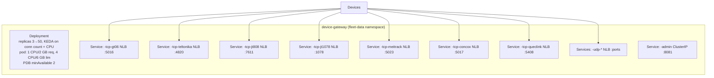

- **HPA/KEDA triggers:** `gw_connections_active > 70% per-pod cap`; CPU > 65%; publish lag > 5K.
- **Rolling updates** with `maxUnavailable: 0, maxSurge: 1`; each pod drains ~60s (stop accepting, finish in-flight, close with clean frames).
- **Surge capacity:** 2× headroom.
- **NetworkPolicy:** deny-all default; ingress only from device IP ranges (TCP/UDP) + platform namespace (admin).

### 15.3 Load Balancing

| Transport | LB | Strategy |
|---|---|---|
| TCP | AWS NLB (or equivalent L4) | round-robin; no session affinity (stateless edge) |
| UDP | AWS NLB UDP listener | round-robin; pseudo-session re-established on each pod swap |
| TLS | NLB → pod `tls.Server` | passthrough (SNI where needed) |

### 15.4 Fault Tolerance & Failure Modes

| Failure | Detection | Response |
|---|---|---|
| Pod crash | liveness probe | restart; devices reconnect across pods |
| Redis unreachable | circuit breaker | continue with local session cache (degraded: cross-instance dispatch paused); alert |
| Kafka slow/unreachable | publish-lag metric | back-pressure to devices; buffer to capacity; alert at 80% |
| `device-management-service` gRPC down | circuit breaker | serve from L1/L2 auth cache; on miss → fail-safe close; alert |
| Reconnect storm | conn-rate alert | interconnect jitter + scale up |
| Event-loop blocking | `clinic.js`/perf hook detector | alert; offending adapter offloaded to worker pool |

---

## 16. Database: Device State, Sessions, Protocol Configuration

The gateway's data footprint is **small and hot** — Redis for live state, PostgreSQL only for protocol configuration and audit. This aligns with `03` §1.2 (Redis = hot path; PostgreSQL = system of record) and ADR-022 (no MongoDB — device configs are JSONB).

### 16.1 Device State (Redis) — live

| Key (per `03` §18.3 `tenant:` namespace) | Value | TTL |
|---|---|---|
| `tenant:<tid>:device:<did>:session` | `{instanceID, sessionID, protocol, transport, since, lastSeen}` | 60s (TCP) / 2× interval (UDP) |
| `tenant:<tid>:device:<did>:auth` | `{deviceID, tenantID, status, pairedVehicleID}` | 5 min |
| `tenant:<tid>:device:<did>:dedup` | last `(messageId, deviceTimestamp)` | 5 min |
| `tenant:<tid>:vehicle:<vid>:pos` | latest position (optional best-effort sink) | 2× report interval |

### 16.2 Sessions (Redis, ephemeral) + Audit (PostgreSQL)

Sessions are **Redis-only, ephemeral** — they are not persisted to PostgreSQL (a session is a transient connection artifact, not domain state). Session lifecycle transitions that require an audit trail (admin force-disconnect, auth failures of note) are written to `audit.audit_entries` per `03` §15 (INV-A01, append-only).

### 16.3 Protocol Configuration (PostgreSQL, `telemetry` schema)

Protocol/listener configuration lives in PostgreSQL as JSONB per ADR-022 (replaces the prior MongoDB design). The table is owned by the Telematics context (`03` §2.1).

```sql
-- telemetry.gateway_listeners — adapter/listener configuration (JSONB, per ADR-022)
CREATE TABLE telemetry.gateway_listeners (
    id              UUID         PRIMARY KEY DEFAULT gen_random_uuid(),
    tenant_id       UUID         NOT NULL,
    adapter_id      TEXT         NOT NULL,           -- 'gt06', 'teltonika', 'jt808', ...
    enabled         BOOLEAN      NOT NULL DEFAULT TRUE,
    transport       TEXT         NOT NULL,           -- 'tcp' | 'udp' | 'both'
    port            INTEGER      NOT NULL,
    options         JSONB        NOT NULL DEFAULT '{}'::jsonb,  -- idle-timeout, keepalive, codec flags, ...
    created_at      TIMESTAMPTZ  NOT NULL DEFAULT now(),
    updated_at      TIMESTAMPTZ  NOT NULL DEFAULT now(),
    CONSTRAINT ck_listener_transport CHECK (transport IN ('tcp','udp','both')),
    UNIQUE (tenant_id, adapter_id, transport)
);
CREATE INDEX ix_listeners_tenant_enabled ON telemetry.gateway_listeners (tenant_id) WHERE enabled;
```

> This table is **new** to this document. It should be added to `03` §2.1's Telematics row and §5.9 in the next `03` revision (tracked as G-1 in §18).

Device registry — `telemetry.telematics_devices` — is owned by `device-management-service` (`03` §5.2); the gateway reads it via gRPC, never writes it.

### 16.4 Data Flow (gateway → stores)

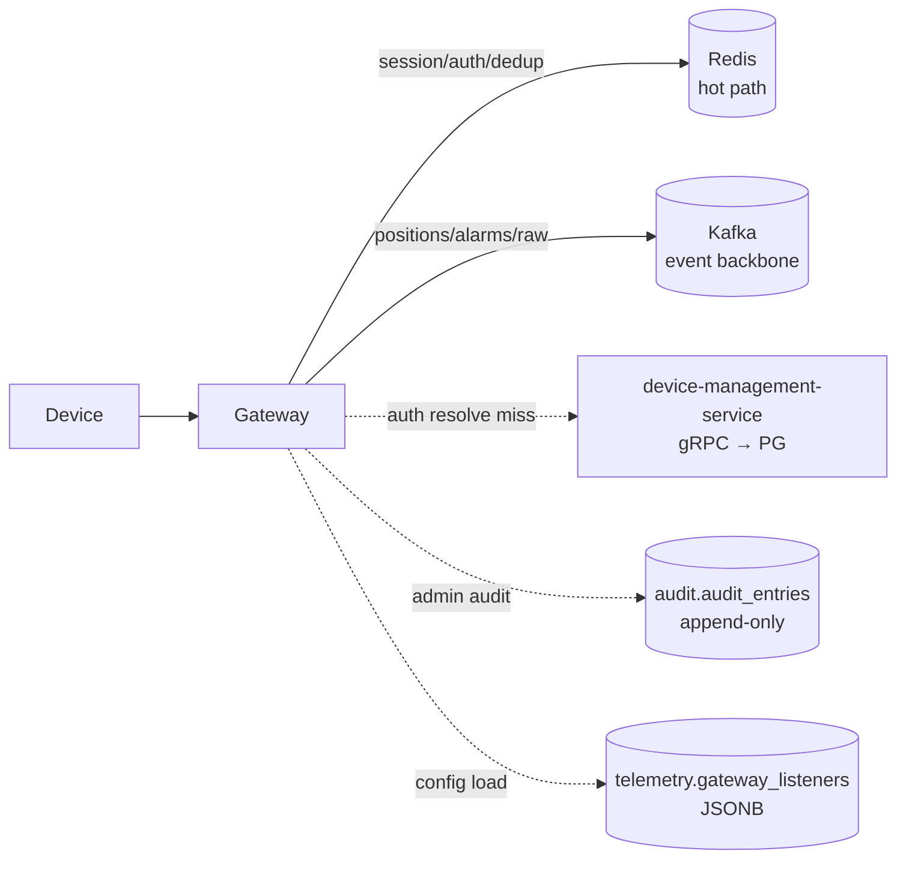

---

## 17. Diagrams

### 17.1 Architecture Diagram (consolidated)

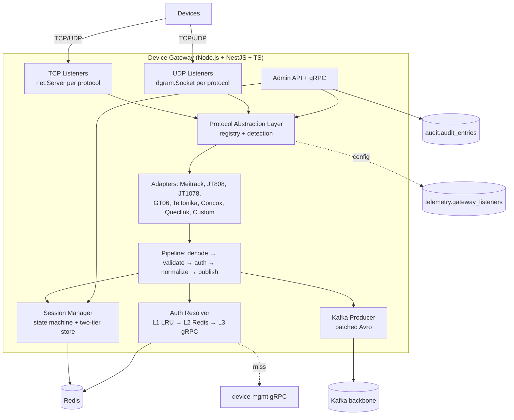

### 17.2 Sequence Diagram — TCP login + position

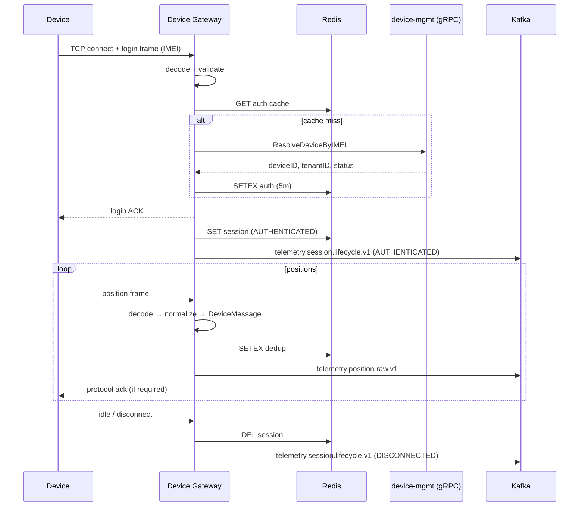

### 17.3 State Machine Diagram — session lifecycle

(See §6.1 — the canonical state machine is reproduced there: `NEW → IDENTIFY → AUTHENTICATED → ACTIVE → DISCONNECTED → CLOSED`, with `CLOSING` reachable from NEW/IDENTIFY/AUTHENTICATED.)

### 17.4 Data Flow Diagram — UDP + TCP → Kafka

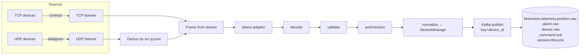

---

## 18. Conformance, Traceability & Open Items

### 18.1 ADR Conformance

| ADR | Status | How this document conforms |
|---|---|---|
| ADR-002 (Kafka backbone) | Accepted | §13.2 — Kafka is the sole event backbone; idempotent batched Avro producer |
| ADR-014 (Device Gateway) | Accepted (runtime updated by ADR-021) | §1 — multi-protocol TCP/UDP ingestion; runtime is Node per ADR-021 |
| ADR-016 (Kafka topic naming) | Accepted | §11.5, §13 — all topics follow `fleetvision.<domain>.<...>` |
| ADR-021 (Node runtime, supersedes ADR-006) | Accepted | §1, §3, §9 — Node LTS + NestJS + TS; Go retired; dynamic `import()` replaces Go `plugin` |
| ADR-022 (lean persistence) | Accepted | §16 — Redis for live state; PostgreSQL JSONB for protocol config; no MongoDB |

### 18.2 Foundation Traceability

| Foundation Element | This Document |
|---|---|
| `00` Scale pillar (2M devices); BG-7 | §1.3, §14, §15 |
| `01` §3 Service Registry #7 (`device-gateway-service`, Node/TS) | §1 header, §1.4 |
| `01` §4.1 Runtime (Node/NestJS/TS) | §1.5, §3 |
| `01` §6 Event-driven (two brokers, two jobs) | §13.3 — gateway uses Kafka only |
| `02` §1 Context 6 (Telematics) | §11 (DDD) |
| `02` §3.2 Telematics aggregates (TelematicsDevice, FirmwarePackage, DeviceCommand ES) | §11.2 (referenced, not owned) |
| `02` §5 Telematics events (provisioned, diagnostic, command.completed) | §11.5 — gateway produces raw events, not domain events |
| `02` §6 Permission catalog (`telemetry.gateway.{read,manage}`) | §16 admin API |
| `03` §2.1 telemetry schema; §5.2 `telematics_devices`; §18 Redis `tenant:` keys | §16 |

### 18.3 Open Items Raised by This Document

| ID | Item | Affected doc | Action |
|---|---|---|---|
| **G-1** | New `telemetry.gateway_listeners` table introduced in §16.3 | `03_Database_Architecture.md` §2.1, §5.9 | Add the table to `03`'s Telematics inventory in the next revision. |
| **G-2** | New event `telemetry.session.lifecycle.v1` introduced in §11.5 | `02_Domain_Model.md` §5 Telematics events | Add to `02`'s event catalog (ingestion-tier event; producer = gateway). |
| **G-3** | Queclink added as a 7th first-class protocol | `Modules/DeviceGateway.md` (superseded) | No action in the superseded doc; Queclink is canonical here. |
| **G-4** | Redis key namespace reconciliation (`session:device:<id>` → `tenant:<tid>:device:<id>:session`) | none (the v2.0.0 module is superseded) | Closed by supersession; documented in §6.2 for traceability. |

### 18.4 Relationship to the v2.0.0 Module

`Modules/DeviceGateway.md` v2.0.0 is **superseded by this document**. Its domain, protocol catalog, and scaling content were sound and are carried forward; only the runtime (Go → Node), the UDP treatment (added as first-class), the Queclink protocol (added), the explicit DDD framing (added), and the Redis key namespace (reconciled to `03`) change. The superseded module receives a one-line pointer at its head (no content deleted — preserves git history and the audit trail of the Go decision per ADR-019 precedent).

---

*This Device Gateway Architecture is the canonical ingestion-front-tier reference. It is reviewed by the Architecture Review Board alongside the Telematics bounded-context design. Adapter implementations live under `device-gateway-service/src/adapters/<vendor>/`; protocol framing/decode is the only place vendor formats appear.*
