# FleetVision — Video Playback System Architecture

**Version:** 1.0.0
**Status:** Approved — Architecture Reference
**Date:** 2026-08-02
**Owner:** Real-Time Data Architect / Chief Software Architect
**Classification:** Confidential — Architecture Reference

> **About this document.** This is the canonical architecture-tier specification for the FleetVision **Video Playback System** — the on-demand review subsystem of the Media & Video bounded context (`02_Domain_Model.md` §1, Context 8). It defines *how* recorded video is stored, indexed, searched, replayed, and exported: the playback pipeline, the Timeline Engine as a query/composition service, time/event/alarm-based search, the recording lifecycle, and the storage + metadata + indexing model that makes terabytes of recorded video queryable in under a second.
>
> **Relationship to prior work.** Three companion documents surround this one; it complements, never duplicates:
> - **`Modules/VideoPlatform.md`** §6–§9 owns the *policy*: recording modes (continuous/event/on-demand/snapshot), the HLS packaging recipe, the hash-chain evidence rule (INV-MED01), and the **Timeline API shape** (the JSON `tracks` contract). **This document owns the engine that fulfills that contract** — the playback pipeline, the Timeline query/composition service, the indexing strategy, the recording state machine, and the search/export flows.
> - **`03_Database_Architecture.md`** §13/§14 owns the *physical schema* (`media.recordings`, `media.ai_alerts`, `media.video_channels`) and the S3 bucket layout + lifecycle. **This document references, never re-declares.**
> - **`10_Live_Video.md`** owns the *live* consumption plane; this document owns the *recorded* consumption plane. They share the `VideoTile`/player component but diverge on transport (live = WebRTC, playback = HLS).
>
> This document is the same depth/format as `06`–`10`. It is built on the lean foundation: playback orchestration runs in `media-service` (**Node.js LTS + NestJS + TypeScript**, ADR-021); the HLS muxer / transcode-for-export runs in the media-router (infrastructure-class, ADR-021 §5); storage is PostgreSQL 16 + TimescaleDB + Redis + S3 (ADR-022). **ClickHouse is deferred** behind the analytics trigger (ADR-022 §2.3) — the Timeline Engine uses Timescale continuous aggregates for motion/activity rollups at MVP–Phase-3 scale (resolves PB-2).
>
> **Conforms to:** `00_Project_Vision.md` v2.1.0 (Intelligence pillar — AI dashcam evidence, BG-4; Trust pillar — evidentiary integrity, BG-5; Scale pillar — PB-scale storage, BG-7; cost-per-vehicle, BG-3), `01_Master_Architecture.md` v2.2.0 (§3 #10/#11/#12/#20; §4.1 runtime; §4.5 storage; §6 events; §7 CQRS+ES), `02_Domain_Model.md` v2.0.0 (Context 8; Recording/EventClip/StreamSession aggregates; INV-MED01/MED02; permission catalog §6), `03_Database_Architecture.md` v3.0.0 (§13 media schema, §14 S3 media, §10 Timescale, §18 Redis), `10_Live_Video.md` (player, authz), ADR-001 (CQRS+ES), ADR-002 (Kafka), ADR-021 (Node runtime), ADR-022 (lean persistence).

---

## Table of Contents

1. [Playback Architecture](#1-playback-architecture)
2. [Video Recording (lifecycle & ingest into the playback system)](#2-video-recording-lifecycle--ingest-into-the-playback-system)
3. [Recording Lifecycle](#3-recording-lifecycle)
4. [Storage, Metadata & Indexing](#4-storage-metadata--indexing)
5. [Timeline Engine](#5-timeline-engine)
6. [Search — Time, Event, Alarm-Based Playback](#6-search--time-event-alarm-based-playback)
7. [Replay](#7-replay)
8. [Download & Export](#8-download--export)
9. [Sequence Diagrams](#9-sequence-diagrams)
10. [Storage Model](#10-storage-model)
11. [Scaling & Failure Modes](#11-scaling--failure-modes)
12. [Conformance, Traceability & Open Items](#12-conformance-traceability--open-items)

---

## 1. Playback Architecture

### 1.1 Purpose

A recording is inert until an operator can **find the right second, play it frame-accurately, understand its context, and export it as evidence.** The Video Playback System is the collection of components that turn PB-scale stored video into a sub-second, timeline-driven review experience — the entry point for incident reconstruction, driver coaching, dispute resolution, and compliance audit.

It turns this — `1080p H.265 segments in S3 for truck-42 14:00–22:00 + 3 harsh-brake events + 1 FCW + a 2-min signal gap at 16:30` — into this:

> Scrub the 8-hour timeline → click the 14:31 FCW marker → player jumps to that frame ±30s context · all 4 cameras synchronized · 4× fast-review the approach · AI bounding boxes overlaid · select 14:30:50–14:31:40 → export watermarked MP4 with hash-chain certificate to the safety officer in 90s.

### 1.2 Goals & Non-Goals

| Goals | Non-Goals |
|---|---|
| Find any recorded second across PB of video in < 500ms P99 | Record the video — Video Gateway + recording policy own (`09`, `Modules/VideoPlatform.md` §6) |
| Frame-accurate HLS playback (byte-accurate seek) | Live streaming — `10_Live_Video.md` owns (WebRTC) |
| Unified Timeline merging video + events + AI + motion | Run CV inference — `video-ai-engine` owns (it *feeds* the timeline) |
| Export watermarked MP4 with evidentiary hash-chain | Replace evidence/chain-of-custody legal process — the system *supports* it |
| Multi-camera synchronized playback | Public video sharing / social distribution |
| Search by time, event, alarm, location, AI type | Long-term deep archive (cold tier owned by S3 lifecycle) |

### 1.3 Playback Topology

```mermaid
flowchart TB
    subgraph Client["Client Tier"]
        WEB[Web Dashboard<br/>Player + Timeline UI]
        MOB[Mobile App]
    end
    subgraph Edge["Edge"]
        CDN[CDN + WAF]
        KONG[Kong API Gateway<br/>JWT + OPA]
    end
    subgraph PB["Playback System (media-service — Node/NestJS/TS)"]
        TL[Timeline Engine<br/>compose multi-track]
        SRCH[Search Service<br/>time / event / alarm]
        PB orchestrator[Playback Orchestrator<br/>resolve → manifest]
        EXP[Export Service<br/>async render + watermark + chain]
        RES[Resolution Service<br/>clipId → S3 keys + segments]
    end
    subgraph Media["Media Plane (infra-class)"]
        HLS[HLS Muxer<br/>fMP4 manifest + byte-range]
        XCODE[Transcode-for-Export<br/>NVENC / ffmpeg]
    end
    subgraph Idx["Index (read models)"]
        PG[(PostgreSQL<br/>media.recordings · ai_alerts)]
        TS[(TimescaleDB<br/>motion/activity rollups)]
        R[(Redis<br/>timeline cache · manifest cache)]
    end
    subgraph Store["Object Storage"]
        S3[(S3 / MinIO<br/>recordings · clips · thumbs · exports)]
    end
    subgraph Src["Event sources (producers)"]
        K[(Kafka<br/>media.recording.* · media.ai.alert.v1<br/>tracking.* · compliance.*)]
    end

    WEB & MOB --> CDN --> KONG --> PB
    KONG --> SRCH & TL
    TL --> RES
    SRCH --> PG & TS
    TL --> PG & TS & R
    RES --> PG & S3
    RES --> HLS
    HLS --> CDN --> WEB & MOB
    EXP --> XCODE --> S3
    EXP --> PG
    K -.index feed.-> PG & TS
```

### 1.4 The Three Playback Paths

| Path | Source | Speed | Transport |
|---|---|---|---|
| **Continuous recording** | S3 (cloud fMP4 segments) | instant | HLS |
| **Event clip** | S3 (cloud, short MP4) | instant | HLS / direct MP4 |
| **Device-local (SD)** | on the device | slower (upload) | JT808 `0x9102` → S3 → HLS |

The first two are the dominant paths. Device-local is a fallback for when cloud recording was not active (vehicle offline) but the DVR retained the segment on its SD card — pulled on demand, transcoded to fMP4, then played back via the same HLS path.

### 1.5 Why HLS for Playback (not WebRTC)

Live view needs sub-second latency → WebRTC (`10`). Playback is **on-demand**; its latency budget is *start* time (< 2s), not glass-to-glass. HLS wins for VOD because:

| Concern | HLS | WebRTC |
|---|---|---|
| Browser compatibility | native Safari + hls.js everywhere | uneven (esp. H.265) |
| CDN-friendliness | ✅ byte-range cacheable | ❌ per-flow SFU |
| Seek accuracy | byte-accurate via fMP4 `EXTINF` | poor (live-oriented) |
| Multi-rate (0.5×–8×) | ✅ native | ❌ |
| Cost at fan-out | cheap (CDN) | expensive (SFU per viewer) |

> **Transport selection is deliberate.** A recording played back over WebRTC would be wasteful and seek-poor; a live view over HLS would be too latent. The two systems share the player UI but diverge on transport — this is why Playback (`11`) and Live (`10`) are separate architecture documents.

### 1.6 Latency & Performance Budgets

| Path | Budget | Mechanism |
|---|---|---|
| Timeline query (24h, multi-track) | < 500ms P99 | metadata-only (PG + Timescale); never touches video |
| Playback start (first frame) | < 2s P95 | HLS manifest + first segment |
| Seek (within a recording) | < 500ms | byte-range fMP4 |
| Multi-camera sync drift | < 40ms | NTP-aligned PTS + master-clock seek |
| Export (30s clip, 1080p) | < 90s P95 | async NVENC render |
| Export (1h range, 1080p) | < 5min P95 | async; non-blocking |

### 1.7 Design Principles

1. **Metadata queries never touch video.** The Timeline Engine and Search read only PostgreSQL/Timescale metadata — S3 video is resolved *after* the user picks a moment (`Modules/VideoPlatform.md` §9.5).
2. **Index at write time, not read time.** Recordings, AI alerts, and motion/activity rollups are indexed as they land (Kafka → projections); reads are pure lookups.
3. **Byte-accurate seek via fMP4.** Segments are 2s fragmented MP4; the manifest's `EXTINF` enables precise scrubbing without re-muxing.
4. **Evidence integrity by construction.** Every export carries the source hash-chain certificate (INV-MED01) + watermark — export is a forensic artifact, not a copy.
5. **Asynchronous export.** Exports never block the player; they render in the background and notify on completion.
6. **Tier-aware retrieval.** Hot (Standard) playback is instant; Warm (IA) adds a restore step; Cold (Glacier) is async-restore + queued — the orchestrator hides this behind a single API.

---

## 2. Video Recording (lifecycle & ingest into the playback system)

The Playback System does not record — it **consumes what the recording pipeline produces**. This section defines the recording shapes the system must index and serve, and how they arrive.

### 2.1 Recording Shapes (from `Modules/VideoPlatform.md` §6.1)

| Shape | Trigger | Duration | Storage Class | Playback use |
|---|---|---|---|---|
| **Continuous** | schedule (24/7 or business hours) | full window | Standard → IA → Glacier | timeline scrub |
| **Event clip** | behavior/alarm/AI event | 8–30s (pre+post) | Standard | event-jump playback |
| **On-demand** | user "record now" | until stopped | Standard | ad-hoc review |
| **Snapshot** | user/schedule JPEG | instant | Standard | thumbnail only |

### 2.2 Segment Model (the indexable unit)

Continuous recordings are not one giant file — they are **60s fMP4 segments** written by the recorder (`09` §7.2). Each segment is independently addressable and independently retrievable, which is what makes byte-accurate seek and tier-aware retrieval possible.

```
Recording (clipId, channel-42, 14:00–15:00)
 ├── segment 0   14:00:00–14:01:00   s3://.../seg-0000.mp4   (Standard)
 ├── segment 1   14:01:00–14:02:00   s3://.../seg-0001.mp4   (Standard)
 ├── ...
 ├── segment 45  14:45:00–14:46:00   s3://.../seg-0045.mp4   (Standard-IA)
 └── segment 59  14:59:00–15:00:00   s3://.../seg-0059.mp4   (Standard)
```

- **Continuous** → many 60s segments under one `clipId` (recording window).
- **Event clip** → typically one short MP4 (the 30s pre+post), one segment.
- The segment is the **unit of retrieval, tier transition, and manifest referencing**.

### 2.3 Ingest into the Playback Index (event-fed projection)

The Playback index is a **CQRS read model** (ADR-001) fed by Kafka events from the recording pipeline — it never writes recordings itself:

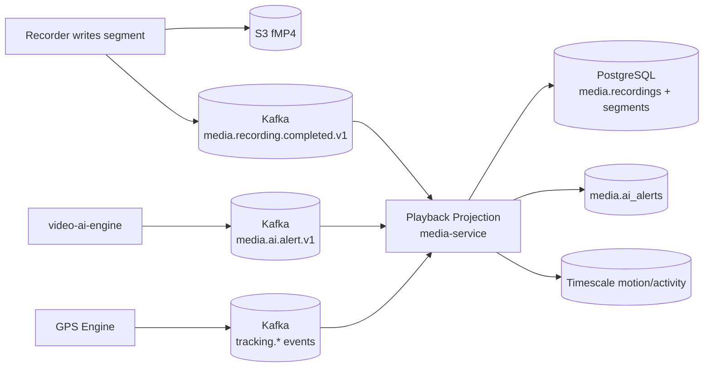

| Event | Index action |
|---|---|
| `media.recording.completed.v1` | INSERT `media.recordings` + `media.video_segments` (S3 keys, hash) |
| `media.recording.failed.v1` | mark `CORRUPT` (no playback; flagged in timeline gap) |
| `media.ai.alert.v1` | INSERT `media.ai_alerts` (timeline AI track) |
| `media.snapshot.taken.v1` | INSERT snapshot row (thumbnail source) |
| `tracking.behavior.event.v1` etc. | append to event-track rollup (Timescale) |
| `media.recording.expired.v1` | mark `EXPIRED` (S3 lifecycle deleted the bytes; timeline shows gap) |

---

## 3. Recording Lifecycle

A recording moves through a defined state machine from the moment the recorder opens to the moment the bytes are expired (or placed on legal hold forever). The Playback System must serve a recording correctly at every state — including gracefully handling `CORRUPT` and `EXPIRED`.

### 3.1 Recording State Machine

```mermaid
stateDiagram-v2
    [*] --> RECORDING: recorder opens (gRPC RecordChannel)
    RECORDING --> AVAILABLE: final segment + hash-chain complete
    RECORDING --> CORRUPT: upload/transcode failed ≥ retries
    AVAILABLE --> TIERED_IA: S3 lifecycle (7d continuous / 30d clip)
    TIERED_IA --> TIERED_GLACIER: S3 lifecycle (180d / 90d)
    TIERED_GLACIER --> EXPIRED: retention reached
    AVAILABLE --> LEGAL_HOLD: compliance / incident
    TIERED_IA --> LEGAL_HOLD
    TIERED_GLACIER --> LEGAL_HOLD
    LEGAL_HOLD --> LEGAL_HOLD: never expires (FMCSA evidence)
    AVAILABLE --> DELETED: admin delete
    EXPIRED --> [*]: bytes gone; metadata retained for audit
    CORRUPT --> [*]
```

### 3.2 State Semantics (playback view)

| State | Bytes present? | Playback | Timeline shows |
|---|---|---|---|
| `RECORDING` | partial (live segments) | ⚠️ partial (segments so far) | "recording in progress" |
| `AVAILABLE` | ✅ Standard | ✅ instant | recorded block |
| `TIERED_IA` | ✅ Standard-IA | ✅ < 2s (small restore) | recorded block |
| `TIERED_GLACIER` | ✅ Glacier | ⏳ async restore (min–hrs) | "archived — restore to play" |
| `CORRUPT` | ❌ / partial | ❌ | flagged gap |
| `EXPIRED` | ❌ | ❌ | gap (metadata retained for audit) |
| `LEGAL_HOLD` | ✅ (pinned) | ✅ | recorded block + 🔒 badge |
| `DELETED` | ❌ | ❌ | gap |

> **Tier-aware retrieval is hidden.** The Playback Orchestrator inspects `status` + storage class and either serves immediately (Standard/IA) or initiates a Glacier restore + queues the playback request (the user sees "restoring from archive, ~N min"). This is the single biggest UX lever for cost-controlled long-retention storage.

### 3.3 Hash-Chain (INV-MED01) Across the Lifecycle

The hash-chain is computed at `AVAILABLE` transition and is **immutable thereafter** — tier transitions and Glacier restores move bytes but never recompute the hash (`09` §7.4):

```
segment.sha256  = SHA256(segment.bytes)
recording.entry_hash = SHA256(prev_hash || canonical(recording_meta))
recording.prev_hash  = previousRecordingForChannel.entry_hash
```

Any post-hoc modification (even a byte) breaks the chain → tamper-evident. Export packages the chain certificate so the recipient can verify integrity independently.

### 3.4 Retention & Legal Hold

Retention is tier-driven and per-regulation (`Modules/VideoPlatform.md` §7.3, `03` §14.2):

| Class | Standard | IA | Glacier | Expire |
|---|---|---|---|---|
| Continuous | 7d | 8–30d | — | 31d |
| Event clip (evidence) | 90d | 91–365d | 366–1095d (3y) | 1096d |
| AI alert clip | 30d | 31–180d | — | 181d |
| **Legal hold** | pinned | pinned | pinned | **never** |

FMCSA-required evidence gets a `legal_hold` flag → skips expiration (admin action, audit-logged). The Playback System treats `LEGAL_HOLD` recordings as permanently `AVAILABLE`-class for retrieval.

---

## 4. Storage, Metadata & Indexing

Storage design is owned by `03_Database_Architecture.md` §13/§14; this section is the Playback System's *view* of those tiers — what it reads, what it indexes, and how.

### 4.1 Storage Tiering (the Playback view)

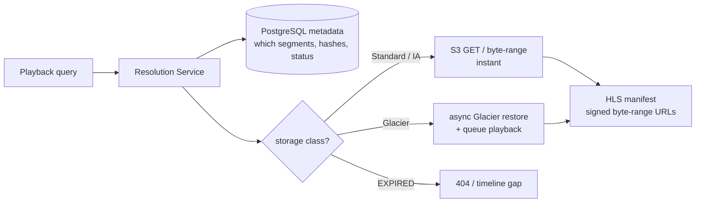

| Tier | Store | Playback latency | When |
|---|---|---|---|
| Hot | S3 Standard | instant | recent recordings (7–30d) |
| Warm | S3 Standard-IA | < 2s | older active retention |
| Cold | S3 Glacier | async (min–hrs) | archive (90d–3y evidence) |
| Metadata | PostgreSQL | < 500ms | always (timeline, search) |
| Rollups | TimescaleDB | < 500ms | motion/activity tracks |
| Cache | Redis | < 5ms | hot timeline + manifest cache |

### 4.2 Metadata Model (PostgreSQL — `media` schema, owned by `03` §13)

The Playback System reads these tables (it does not own their DDL):

| Table | Role in playback | Key columns |
|---|---|---|
| `media.video_channels` | resolve channel → vehicle/site, label, codec | `id, tenant_id, vehicle_id, channel_label` |
| `media.recordings` | the recording index (the timeline's video track) | `id, tenant_id, channel_id, trigger_type, started_at, ended_at, s3_key, status, entry_hash, prev_hash` |
| `media.video_segments` | sub-segments for seek/streaming | `segment_id, recording_id, sequence, start_offset, duration, s3_key` |
| `media.ai_alerts` | the AI track | `id, recording_id, alert_type, severity, detected_at, s3_key_clip` |
| `media.stream_sessions` | playback session audit (mode=PLAYBACK) | `session_id, channel_id, mode, started_at, ended_at` |

> **Schema naming reconciliation (PB-1).** `Modules/VideoPlatform.md` §7.4 names the recordings table `media.video_clips`; `03_Database_Architecture.md` §13.3 names it `media.recordings`. The canonical name is **`media.recordings`** (`03` is the single source of truth for DDL per ADR-019); the module's `video_clips` is a synonym. Open item PB-1 reconciles the module.

### 4.3 Indexing Strategy

The index is built so the dominant playback queries — *timeline range*, *event lookup*, *segment resolution* — are pure index lookups, never scans.

| Query pattern | Index | Source |
|---|---|---|
| Timeline for channel + range | `(tenant_id, channel_id, started_at DESC)` | `03` §13.3 |
| Timeline for vehicle + range | `(tenant_id, vehicle_id, started_at DESC)` | `03` §13.3 |
| Event/alarm lookup by type + range | `(tenant_id, alert_type, detected_at DESC)` on `ai_alerts` | `03` §13.4 |
| Segment resolution for a recording | `(recording_id, sequence)` PK on `video_segments` | `03` §13 |
| Spatial search ("clips near point") | GiST on recording `location` (if materialized) | `03` §17 patterns |
| Tenant isolation | RLS (every query auto-scoped) | `03` §1.1 P4 |

**Timescale continuous aggregates** (replace deferred ClickHouse — ADR-022, PB-2):

| Rollup | Grain | Source | Use |
|---|---|---|---|
| `media_motion_hourly` | hourly motion/activity score per channel | recorder motion detection | timeline activity track |
| `media_event_track_hourly` | hourly event counts per channel | `tracking.*` events | timeline event density |

These rollups mean a 24h timeline query reads **hours, not seconds** — tens of rows, not millions of events.

### 4.4 Redis Cache Topology

| Key | TTL | Purpose |
|---|---|---|
| `media:timeline:<tenant>:<channel>:<from>:<to>:<hash>` | 10 min | composed timeline JSON |
| `media:manifest:<recordingId>` | 15 min | HLS manifest (signed URLs) |
| `media:segments:<recordingId>` | 1h | segment S3-key list |
| `media:export:<exportId>` | 24h | export status + progress |
| `media:restore:<recordingId>` | until restored | Glacier restore in-progress flag |

Hot timelines (a clip reviewed repeatedly during an incident investigation) hit cache 99%+; the first miss rebuilds from PG + Timescale in < 500ms.

### 4.5 Indexing at Write Time (projection rules)

| Incoming event | Index update | Latency target |
|---|---|---|
| `media.recording.completed.v1` | INSERT recording + segments | < 1s |
| `media.ai.alert.v1` | INSERT ai_alert | < 1s |
| `tracking.behavior.event.v1` (trigger) | link to nearest recording (event clip) | < 1s |
| recorder motion scores | upsert into `media_motion_hourly` | batch (60s) |
| `media.recording.expired.v1` | UPDATE status=`EXPIRED` | < 1s |

The index is **eventually consistent** with the recording pipeline (< 1s lag); the player never reads a recording that has no index row because the manifest endpoint resolves from the index, not from S3 LIST.

---

## 5. Timeline Engine

The Timeline Engine is the **query and composition service** that produces the unified, multi-track timeline the player UI scrubs. It is the heart of the playback experience — every search and replay path funnels through it. The Timeline API *shape* (the JSON `tracks` contract) is owned by `Modules/VideoPlatform.md` §9.2; **this engine implements it**.

### 5.1 Timeline Layers

```
   Video availability  ████████████░░░░░░██████████████████░░░░░░██████
                        (recorded)  (gap)         (recorded)    (gap)
   Event clips            ▲          ▲    ▲                      ▲
                         brake    FCW  geofence                manual
   AI alerts              ●●      ●              ●●●●
                       intrusion            loitering burst
   Motion/activity     ▮▮▮▮▮▮▮▮▮▮▮▮▮▮▮▮▮▮▮▯▯▯▯▮▮▮▮▮▮▮▮▮▮▮▮▮▮▮▮▮▮▮
   Site schedule      [──open──][closed][────open────────][closed]
   Map position       ▣━━━━━━━━━━━━━━━━━━━━━━━━━━━━━━━━━━━━━━━━━━━━▣ (vehicle)

   ◄─────────────── scrubber (drag to seek playback) ───────────────►
```

### 5.2 The Composition Pipeline

The engine does not store a timeline — it **composes** one on demand from multiple read models, merges by timestamp, and caches the result.

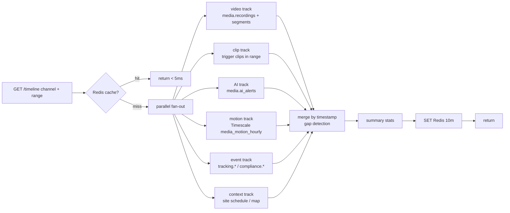

### 5.3 The `tracks` Contract (owned by `Modules/VideoPlatform.md` §9.2)

```json
{
  "channelId": "...", "from": "...", "to": "...",
  "tracks": [
    { "kind": "video",       "segments": [{ "start","end","clipId","thumbS3","status" }] },
    { "kind": "clips",       "events":   [{ "at","clipId","trigger","linkedEventId" }] },
    { "kind": "ai",          "events":   [{ "at","type","severity","confidence","clipId" }] },
    { "kind": "motion",      "segments": [{ "start","end","score" }] },
    { "kind": "siteSchedule","segments": [{ "start","end","state" }] }
  ],
  "summary": { "recordedMin": 1420, "gapMin": 20, "aiAlerts": 7, "clips": 3 }
}
```

The engine adds a `status` field to video segments (`AVAILABLE` / `TIERED_GLACIER` / `EXPIRED`) so the UI can render archived gaps and offer restore.

### 5.4 Track Sources

| Track | Source | Grain |
|---|---|---|
| Video availability | `media.recordings` + `video_segments` | per-segment |
| Event clips | `media.recordings` (trigger_type) | per-clip |
| AI alerts | `media.ai_alerts` | per-alert |
| Motion/activity | Timescale `media_motion_hourly` | hourly (zoom to per-segment on drill) |
| Site schedule | site admin schedule | per-window |
| Map / trip | GPS Engine (`07`) — vehicle only | continuous |
| Geofence / speed | GPS Engine | per-event |

### 5.5 Gap Detection

The engine computes **gaps** — ranges with no recording (camera offline, recorder failed, signal loss). A gap is rendered distinctly from recorded blocks so an operator instantly sees "there should be video here but there isn't" — critical for incident integrity. Gaps classified by cause where known:

| Gap cause | Source | UI |
|---|---|---|
| Camera offline | channel status history | "camera offline" |
| Recorder failure | `media.recording.failed.v1` | "recording failure" |
| Signal loss (vehicle) | GPS Engine stale | "signal loss" |
| Scheduled off-hours | site schedule | "off-schedule" (not a defect) |
| Expired | `status=EXPIRED` | "retention expired" |

### 5.6 Interaction (player ↔ timeline)

- **Scrub** → seek the player to that timestamp (resolves clip + byte-offset).
- **Click event marker** → jump to that clip ± pre-buffer.
- **Range-select** → export that range.
- **Zoom** → day → hour → minute (re-queries at finer grain; motion track switches hourly → per-segment).

### 5.7 Multi-Camera Timeline (sync playback)

For a vehicle/site with N cameras, the engine returns **one timeline per channel sharing a common time axis**. Scrubbing moves all cameras together (master-clock seek) — essential for incident reconstruction where the forward + driver + rear views must align.

| Aspect | Implementation |
|---|---|
| Sync target | NTP-aligned PTS across cameras (drift < 40ms) |
| Master clock | the scrubber position; each player seeks to its own PTS nearest that clock |
| Gap per camera | independent (forward may record while driver-cam privacy-paused) |
| Event link | an AI alert links to the specific channel that raised it; other cameras contextualize |

---

## 6. Search — Time, Event, Alarm-Based Playback

Three search modalities, all funneling through the Timeline Engine into the player.

### 6.1 Time Search

The simplest and most common: *show me channel X from 14:00 to 15:00 yesterday.*

| Input | API |
|---|---|
| channel (or vehicle/site) + time range | `GET /timeline?channel=&from=&to=` |
| Output | timeline (video availability + context) → user picks a moment → playback |

Time search is the entry point for **continuous** recording review — scrub the timeline to the moment of interest.

### 6.2 Event Search

Search by *what happened* rather than *when*: *show me all harsh-brake events for truck-42 this week.*

| Input | API |
|---|---|
| entity + event type + range | `GET /recordings?trigger=&vehicle=&from=&to=` |
| Output | ranked list of event clips (newest first) → click → player jumps to clip ± pre-buffer |

Event types (the `trigger_type` filter):

| Source | Triggers |
|---|---|
| GPS Engine | harsh-brake, harsh-accel, harsh-corner, overspeed, geofence-enter |
| Compliance | incident-reported, HOS violation |
| AI engine | FCW, LDW, distraction, smoking, phone, drowsiness, no-seatbelt |
| Manual | driver-press, user-record |

Event search is the **Event Review** workflow (`UI_UX_Design.md` §3.6) — the flagship safety flow that turns a stream of events into coaching actions.

### 6.3 Alarm-Based Playback

The most targeted: an **alarm** (AI alert, behavior event, geofence breach, panic) routes the operator directly to the relevant video, auto-cued.

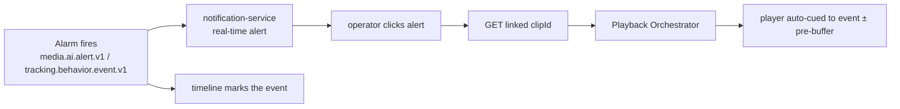

| Alarm source | Auto-cue | Linked artifact |
|---|---|---|
| `media.ai.alert.v1` (FCW, distraction…) | event time ± 10s pre-buffer | event clip + AI metadata |
| `tracking.behavior.event.v1` (harsh brake) | event time ± 15s | 30s event clip |
| `tracking.geofence.entered.v1` (high-value POI) | entry time | per-policy clip |
| `compliance.incident.reported.v1` | incident time | extended clip + linkage |
| Manual / panic | button-press time | 60s clip |

Alarm-based playback is what makes the system **active** rather than passive — an alarm doesn't just notify; it drops the operator at the exact frame they need to review.

### 6.4 Unified Search API

All three modalities converge on one query surface:

```
GET /api/v1/media/recordings?vehicle=&channel=&trigger=&alertType=&from=&to=&near=&limit=
GET /api/v1/media/channels/{id}/timeline?from=&to=
GET /api/v1/media/vehicles/{id}/timeline?from=&to=     (multi-camera)
GET /api/v1/media/ai-alerts?type=&severity=&from=&to=
```

Filters compose: *vehicle=Truck-42, trigger=FCW, from=7d ago* → the event list; selecting one → playback. `near=lat,lng&radius=` adds a spatial filter (clips recorded near a location — uses GiST, `03` §17 patterns).

### 6.5 Search Performance

| Query | Target | Mechanism |
|---|---|---|
| Time range (single channel, 24h) | < 500ms P99 | PG index + Timescale rollup |
| Event search (type, 7d) | < 500ms P99 | `(tenant, type, time)` index |
| Spatial ("near point") | < 1s P99 | GiST KNN |
| Timeline compose (multi-track) | < 500ms P99 | parallel fan-out + Redis cache |

---

## 7. Replay

**Replay** is the act of playing back a recorded range. It is the convergence of search + timeline + player. The distinguishing concerns are seek accuracy, multi-rate review, and multi-camera sync.

### 7.1 Replay Flow

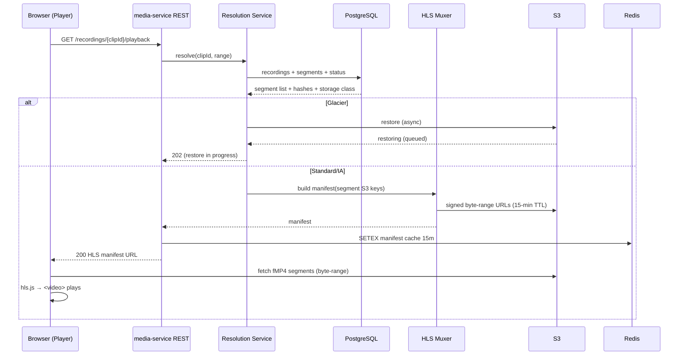

### 7.2 Byte-Accurate Seek

Segments are 2s fMP4 fragments. The manifest's `EXTINF` (segment duration) + the segment's `tfdt` (fragment decode time) enable **byte-accurate seek** — the player jumps to the exact frame, not the nearest keyframe-boundary second. This matters for evidence: "the moment of impact" is a specific frame, not "about 14:31."

| Seek granularity | Mechanism |
|---|---|
| Coarse (segment) | manifest `EXT-X-BYTERANGE` |
| Fine (frame) | fMP4 `tfdt` + intra-frame index |
| Result | < 500ms seek within a recording |

### 7.3 Multi-Rate Review

HLS supports **0.5×, 1×, 2×, 4×, 8×** playback — a dispatcher triages an 8-hour shift in minutes. The player maps rate to segment-fetch pacing; `8×` fetches 8 segments for every 1s of wall time.

| Rate | Use |
|---|---|
| 0.5× | frame-by-frame incident analysis |
| 1× | normal review |
| 2×–4× | routine triage |
| 8× | shift-level fast-forward to an event |

### 7.4 Multi-Camera Synchronized Replay

For a vehicle/site with N cameras, replay opens N synchronized HLS sessions bound to a **master clock** (the timeline scrubber). Each camera seeks to its own PTS nearest the master clock; drift is bounded by NTP-aligned capture (< 40ms).

| Concern | Implementation |
|---|---|
| Master clock | timeline scrubber position |
| Per-camera seek | each player seeks its PTS nearest master |
| Sync indicator | UI shows sync drift (green < 40ms, amber < 200ms, red > 200ms) |
| Independent gaps | forward may record while driver-cam privacy-paused — gaps render per-camera |
| Bandwidth | N × bitrate; cellular caps to fewer cameras or lower quality |

### 7.5 Timeline-Linked Replay

The player is **bound to the Timeline** (§5): scrubbing the timeline seeks the player; clicking an event marker (harsh-brake, FCW) jumps the player to that clip with ±30s context. This tight coupling is what makes incident review fast — the operator thinks in events, not timestamps.

---

## 8. Download & Export

**Download** and **Export** are distinct: download fetches an existing MP4 (a clip already in S3); export **renders a new MP4** for an arbitrary time range (possibly spanning multiple segments / cameras), watermarked and hash-certified.

### 8.1 Download (existing artifact)

| Input | API | Output |
|---|---|---|
| clipId (event clip / snapshot) | `GET /recordings/{clipId}/download` | signed S3 URL (short TTL) |

Download is fast (the MP4 already exists) and returns a presigned URL; the bytes stream directly from S3, not through media-service.

### 8.2 Export (render a new artifact)

Export is **asynchronous** — it never blocks the player. The Export Service instructs the media-router to render the range to a new MP4, watermarks it, packages the hash-chain certificate, and notifies on completion.

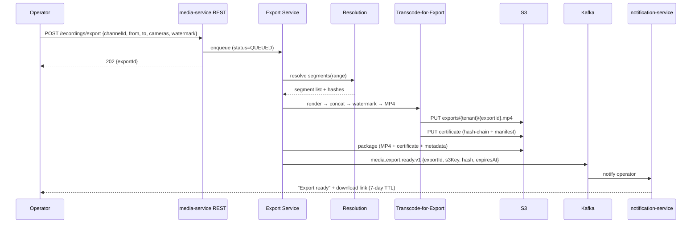

### 8.3 Export Properties

| Property | Value |
|---|---|
| Watermark | tenant + user + timestamp + exportId (burned in) |
| Hash certificate | source hash-chain + export SHA-256, Vault-signed |
| Format | MP4 (H.264 — max compatibility; re-encoded if source H.265) |
| Multi-camera | optional: picture-in-picture or tiled composite |
| TTL | 7 days (then S3 lifecycle expires the export) |
| Permission | `media.video.export` (`02` §6) |
| Audit | export recorded in `media.stream_sessions` + `audit.audit_entries` |

### 8.4 Export Modes

| Mode | Output | Use |
|---|---|---|
| **Time range** | MP4 of `[from, to]` for one channel | "give me 14:30–14:35 forward cam" |
| **Event-cued** | MP4 around a linked event (± pre-buffer) | "export this FCW clip" |
| **Multi-camera composite** | tiled PiP MP4 | "forward + driver side-by-side" |
| **Clip bundle** | ZIP of N event clips | "all harsh-brakes this week for coaching" |

### 8.5 Evidence Package

An export is a **forensic artifact**, not a copy. The package includes:

```
exports/{tenant}/{exportId}/
  ├── video.mp4                 (watermarked)
  ├── certificate.json          (source hash-chain + export SHA-256 + Vault signature)
  ├── manifest.json             (source recordings, segments, time range, cameras)
  └── metadata.json             (tenant, user, exportedAt, reason, linkedEventId)
```

A recipient (legal, insurance, regulator) can independently verify: re-hash the MP4, compare to `certificate.json`, walk the source chain. Any tampering breaks the chain (INV-MED01).

### 8.6 Export Authorization & Quotas

| Concern | Rule |
|---|---|
| Permission | `media.video.export` (separate from `media.video.read`) |
| ABAC | OPA: user must have access to the channel/vehicle/site |
| Legal-hold | exports of legal-hold recordings are audit-logged and never modify the source |
| Quota | per-tenant exports/day (cost control — transcode is expensive) |
| Privacy | driver-facing exports honor consent + jurisdiction; redaction opt-in (faces blurred) |

---

## 9. Sequence Diagrams

### 9.1 Timeline → Playback (the canonical flow)

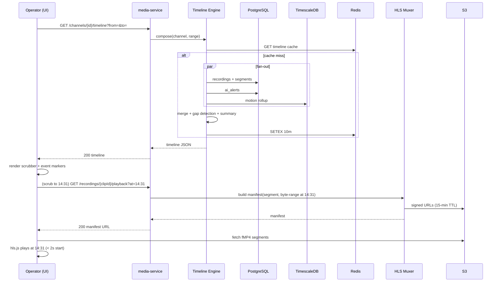

### 9.2 Alarm-Based Playback (auto-cue from alert)

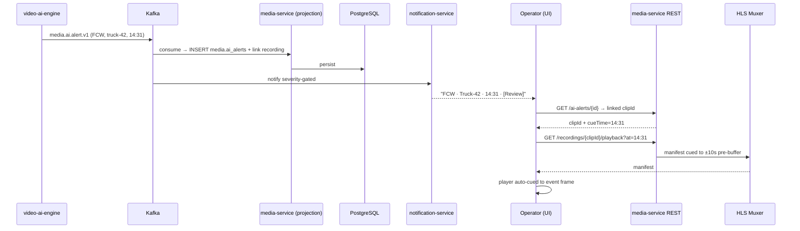

### 9.3 Multi-Camera Sync Replay

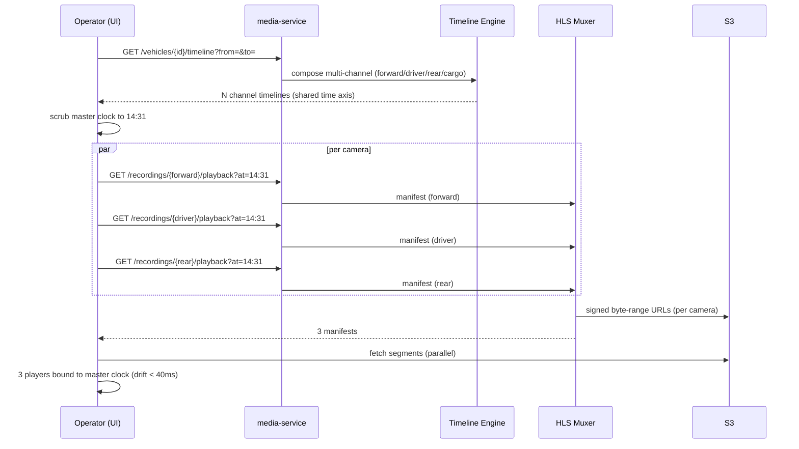

### 9.4 Export (async render + notify)

See §8.2 — the full export render → watermark → hash-certificate → notify flow.

### 9.5 Glacier Restore (cold playback)

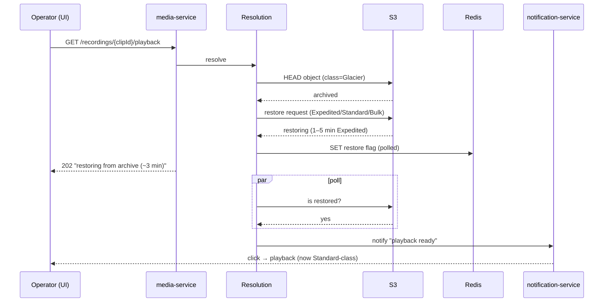

---

## 10. Storage Model

The physical schema is owned by `03_Database_Architecture.md` §13/§14. This section is the Playback System's *logical* storage model — the entity shapes it reads/writes — cross-referenced to the canonical physical tables.

### 10.1 Logical Entity Model

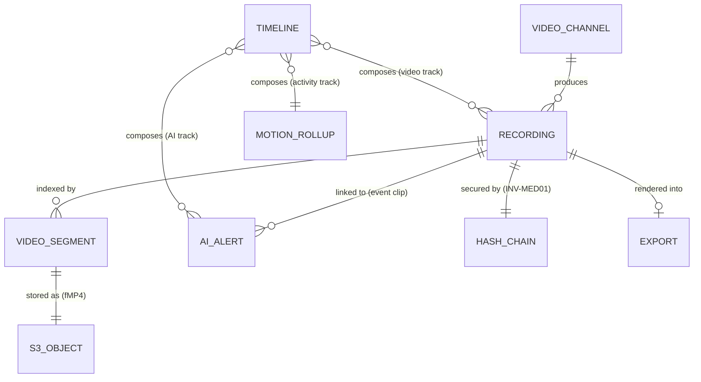

### 10.2 `Recording` (physical: `media.recordings` — `03` §13.3)

| Field | Type | Playback role |
|---|---|---|
| `id` | UUID PK | clipId |
| `tenant_id`, `vehicle_id`, `channel_id` | UUID | scope / RLS / timeline query |
| `trigger_type` | TEXT | event search filter (MANUAL/EVENT/SCHEDULED/AI) |
| `trigger_event_id` | UUID | link to originating domain event |
| `started_at`, `ended_at` | timestamptz | timeline range / seek |
| `s3_key` | TEXT | primary segment object |
| `s3_key_thumbs` | TEXT | thumbnail index |
| `codec` | TEXT | H.264/H.265 (export re-encode decision) |
| `byte_size` | BIGINT | quota / stats |
| `entry_hash`, `prev_hash` | TEXT | **INV-MED01 hash-chain** |
| `status` | TEXT | lifecycle state (§3.1) |
| `metadata` | JSONB | location, gps, ai-context |

### 10.3 `VideoSegment` (physical: `media.video_segments` — `03` §13)

| Field | Type | Role |
|---|---|---|
| `segment_id` | UUID PK | unit of retrieval |
| `recording_id` | UUID FK | parent recording |
| `sequence` | INT | order within recording |
| `start_offset_ms`, `duration_ms` | int | seek math |
| `s3_key` | TEXT | fMP4 object |
| `byte_size` | BIGINT | byte-range math |

### 10.4 `AIAlert` (physical: `media.ai_alerts` — `03` §13.4)

| Field | Type | Role |
|---|---|---|
| `id` | UUID PK | alertId |
| `recording_id` | UUID | linked event clip |
| `alert_type` | TEXT | FCW/LDW/DISTRACTION/SMOKING/PHONE/DROWSINESS/... |
| `severity` | TEXT | LOW/MEDIUM/HIGH/CRITICAL |
| `confidence` | REAL | model confidence |
| `detected_at` | timestamptz | timeline AI track |
| `s3_key_clip` | TEXT | event clip object |
| `contest_status` | TEXT | NULL/CONTESTED/UPHELD/DISMISSED (model feedback) |

### 10.5 S3 Object Layout (physical: `03` §14.1)

```
s3://fleetvision-media/
  ├── recordings/{tenant}/{vehicle}/{yyyy}/{mm}/{dd}/{recordingId}.mp4
  ├── clips/{tenant}/{vehicle}/{alertId}.mp4
  ├── thumbnails/{tenant}/{recordingId}/{frameIdx}.jpg
  └── exports/{tenant}/{exportId}/{video.mp4, certificate.json, manifest.json}
```

Lifecycle tiering per `03` §14.2 (continuous 7d→IA→31d expire; event clips 90d→IA→3y Glacier→expire unless legal hold).

### 10.6 Redis Keys (cache)

| Key | TTL | Purpose |
|---|---|---|
| `media:timeline:<tenant>:<channel>:<range>:<hash>` | 10m | composed timeline |
| `media:manifest:<recordingId>` | 15m | HLS manifest |
| `media:segments:<recordingId>` | 1h | segment list |
| `media:export:<exportId>` | 24h | export status |
| `media:restore:<recordingId>` | until restored | Glacier restore flag |

### 10.7 Timescale Continuous Aggregates (rollups — PB-2)

```sql
-- media_motion_hourly (illustrative; canonical DDL owned by 03 §10)
CREATE MATERIALIZED VIEW media.media_motion_hourly
WITH (timescaledb.continuous) AS
SELECT
    tenant_id, channel_id,
    time_bucket('1 hour', detected_at) AS hour,
    AVG(activity_score) AS avg_activity,
    COUNT(*) FILTER (WHERE activity_score > 0.3) AS motion_minutes
FROM media.recording_motion          -- per-segment score from recorder
GROUP BY tenant_id, channel_id, hour
WITH NO DATA;
```

> **ClickHouse deferral (PB-2).** `Modules/VideoPlatform.md` §9.5 references "ClickHouse" for timeline events/motion. Under ADR-022, ClickHouse is **deferred** behind the analytics trigger; the Playback System uses **TimescaleDB continuous aggregates** at MVP–Phase-3 scale. If the trigger fires (`03` §24.3 — query P99 > 2s or Year-5 band), the rollup shape migrates to ClickHouse unchanged.

---

## 11. Scaling & Failure Modes

### 11.1 Scaling Dimensions

| Dimension | Mechanism | Trigger |
|---|---|---|
| Playback concurrency | CDN-fronted HLS (no SFU per viewer) | viewer count |
| Timeline queries | Redis cache + Timescale rollups | cache hit ≥ 90% |
| Export throughput | RabbitMQ task queue + NVENC pool | queue depth |
| Metadata reads | PG read replicas | QPS |
| Storage growth | S3 elastic + tiered lifecycle | volume |

### 11.2 Capacity (Year-5 — `Modules/VideoPlatform.md` §7.6)

| Class | Per-camera/day | Hot volume |
|---|---|---|
| Event clips (5/day, 30s, 1080p H.265) | ~15 MB | ≤ 3 GB/cam (90d) |
| Continuous CCTV (24h, 720p H.265) | ~6 GB | ~180 GB/cam (30d) |
| Continuous dashcam (8h/day) | ~8 GB | ~240 GB/cam (30d) |
| Snapshots | ~1 MB | ~30 MB/cam |

Total hot storage is multi-PB at Year-5 mix — only achievable with H.265 + event-default + aggressive tiering.

### 11.3 Failure Modes

| Failure | Detection | Response |
|---|---|---|
| S3 Standard GET slow | retry + circuit breaker | buffer; degrade to lower quality; alert |
| S3 Glacier restore slow | restore-time alert | notify user of revised ETA; offer Expedited |
| Recording `CORRUPT` | hash verify / upload fail | timeline shows flagged gap; no playback; alert |
| Recording `EXPIRED` | lifecycle event | timeline gap; metadata retained for audit |
| PostgreSQL slow | replica lag alert | timeline queries failover to read replica |
| Redis cache down | circuit breaker | fall through to PG + Timescale (slower; < 2s) |
| HLS muxer pod crash | liveness | restart; manifest regenerated; player re-fetches |
| Export transcode failure | retry (RabbitMQ DLQ) | `media.export.failed.v1`; user notified; re-queue |
| Kafka lag (index) | lag metric | playback of just-recorded video delayed < 5s; alert if growing |

### 11.4 Performance Budgets (recap)

| Path | Budget |
|---|---|
| Timeline (24h multi-track) | < 500ms P99 |
| Playback start | < 2s P95 |
| Seek within recording | < 500ms |
| Export 30s clip | < 90s P95 |
| Glacier Expedited restore | 1–5 min |
| 2× headroom | always (vision guardrail) |

---

## 12. Conformance, Traceability & Open Items

### 12.1 ADR Conformance

| ADR | Status | How this document conforms |
|---|---|---|
| ADR-001 (CQRS + Event Sourcing) | Accepted | §2.3, §4.5 — playback index is an event-fed read model (projections) |
| ADR-002 (Kafka backbone) | Accepted | §2.3 — `media.recording.*`, `media.ai.alert.v1`, `tracking.*` feed the index |
| ADR-021 (Node runtime) | Accepted | §1.3 — Timeline/Search/Export orchestrators are Node/NestJS/TS; HLS muxer + transcode are infra-class |
| ADR-022 (lean persistence) | Accepted | §4, §10 — PostgreSQL + Timescale + Redis + S3; **ClickHouse deferred** (PB-2) |

### 12.2 Foundation Traceability

| Foundation Element | This Document |
|---|---|
| `00` Intelligence pillar (AI evidence, BG-4) | §6.2, §6.3 (event/alarm search), §9.2 |
| `00` Trust pillar (evidence integrity, BG-5) | §3.3 (hash-chain), §8.5 (evidence package) |
| `00` Scale pillar (PB storage, BG-7); cost BG-3 | §4.1 (tiering), §11.2 (capacity) |
| `01` §3 Service Registry #10/#11/#12/#20 | §1.3 |
| `01` §4.1 Runtime (Node/NestJS/TS) | §1.3 |
| `01` §4.5 Storage (PG, Timescale, Redis, S3) | §4, §10 |
| `01` §7 CQRS + Event Sourcing | §2.3, §4.5 |
| `02` §1 Context 8 (Media & Video) | §1 |
| `02` §3.2 Recording / EventClip / StreamSession aggregates | §2, §3 |
| `02` §6 Permission catalog (`media.video.read` / `.export`) | §8.6 |
| `02` §8 INV-MED01 (hash-chain), INV-MED02 (privacy) | §3.3, §8.5/§8.6 |
| `03` §13 media schema; §14 S3 media; §10 Timescale; §18 Redis | §4, §10 |
| `10_Live_Video.md` (player, authz) | §1.5 (shared player, divergent transport) |
| `Modules/VideoPlatform.md` (policy: modes, HLS recipe, Timeline API) | §5.3, §6, §7 (implements) |
| `09_Video_Gateway.md` (recording pipeline — producer) | §2 (consumer of its events) |

### 12.3 Open Items Raised by This Document

| ID | Item | Affected doc | Action |
|---|---|---|---|
| **PB-1** | Recordings table naming: `media.video_clips` (module) vs **`media.recordings`** (DB doc, canonical) | `Modules/VideoPlatform.md` §7.4 | Reconcile to `media.recordings` in the next module revision; `03` §13.3 is the DDL source of truth (ADR-019). |
| **PB-2** | Timeline events/motion source: `ClickHouse` (module) vs **Timescale continuous aggregates** (ADR-022 lean) | `Modules/VideoPlatform.md` §9.5 | Update module to Timescale aggregates; ClickHouse re-enters only on the `03` §24.3 trigger. |
| **PB-3** | `media.video_segments` + `media.recording_motion` + `media_motion_hourly` rollup introduced | `03_Database_Architecture.md` §13/§10 | Add segment table + motion rollup to the media schema inventory. |
| **PB-4** | Export package contract (video.mp4 + certificate.json + manifest.json + metadata.json) formalized | `Modules/VideoPlatform.md` §8.5 | Reference the evidence-package layout from the module's export section. |
| **PB-5** | Glacier tier-aware retrieval + async restore flow formalized | `Modules/VideoPlatform.md` §8 | Add the tier-aware playback + restore UX to the module. |

### 12.4 Relationship to Companion Documents

- **`Modules/VideoPlatform.md`** — owns the **bounded-context policy**: recording modes, HLS recipe, hash-chain rule, the Timeline API *shape*, the REST/gRPC catalog. This document is the *engine* that fulfills that policy.
- **`03_Database_Architecture.md`** — owns the **physical schema** (`media.recordings`, `media.ai_alerts`, S3 lifecycle). This document references, never re-declares.
- **`10_Live_Video.md`** — owns the **live** consumption plane; this document owns the **recorded** consumption plane. Shared: `VideoTile`/player, authz model, OPA permissions.
- **`09_Video_Gateway.md`** — owns the **recording pipeline** (producer); this document consumes its `media.recording.*` events to build the playback index.

---

*This Video Playback System Architecture is the canonical on-demand-review reference for the Media & Video context. It is reviewed by the Architecture Review Board alongside `Modules/VideoPlatform.md` (policy), `09_Video_Gateway.md` (recording producer), `10_Live_Video.md` (live plane), and `03_Database_Architecture.md` (`media` schema). Engine implementation lives under `media-service/src/modules/playback/` (`TimelineEngine`, `SearchService`, `PlaybackOrchestrator`, `ExportService`); the recording modes, hash-chain rule, and Timeline API contract are governed by `Modules/VideoPlatform.md`.*
