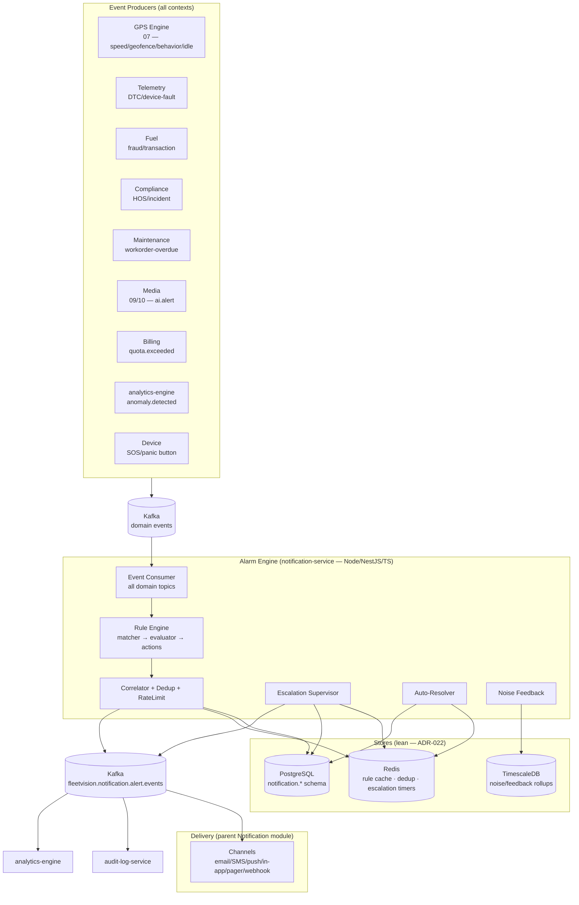
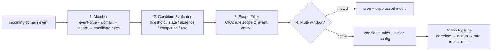
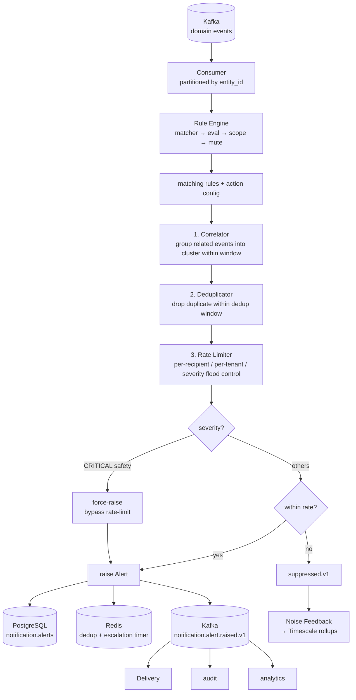
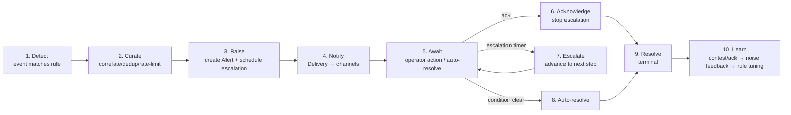
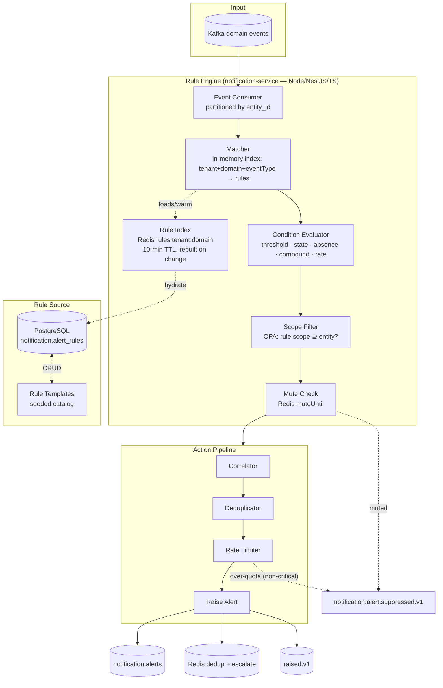
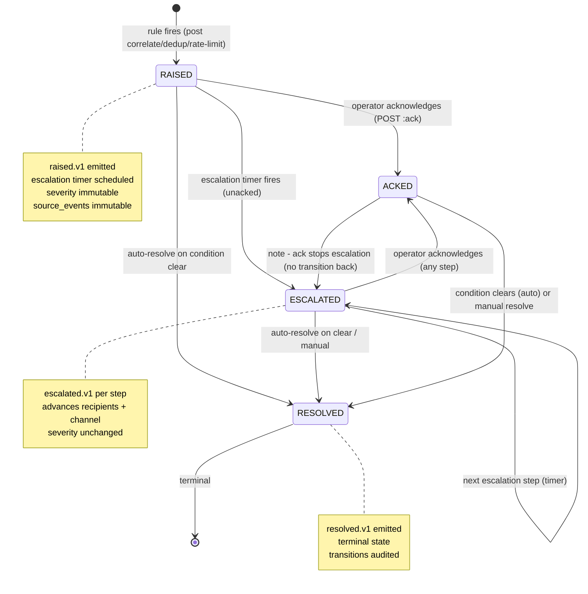
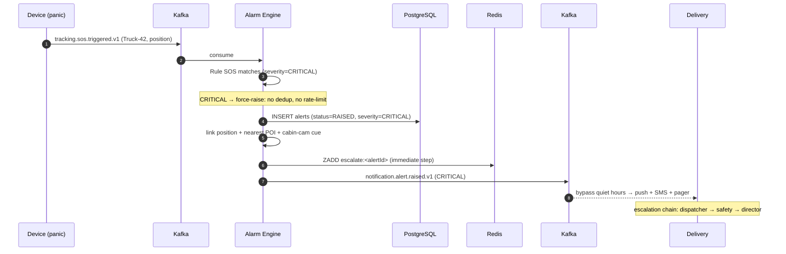

# FleetVision — Alarm Engine Architecture

**Version:** 1.0.0
**Status:** Approved — Architecture Reference
**Date:** 2026-08-02
**Owner:** Real-Time Data Architect / Chief Software Architect
**Classification:** Confidential — Architecture Reference

> **About this document.** This is the canonical architecture-tier specification for the FleetVision **Alarm Engine** — the real-time event-to-alert computation tier of the Notification & Alerting bounded context (`02_Domain_Model.md` §1, Context 4). It defines *how* a stream of domain events (SOS, overspeed, geofence, offline, fuel theft, temperature, collision, camera/AI events, and dozens more) is evaluated against tenant rules, correlated, de-duplicated, escalated, and turned into a curated stream of actionable alerts that the delivery tier turns into notifications.
>
> **Relationship to prior work.** `Modules/Alarm-Engine.md` v2.0.0 owns the **bounded-context domain model**: the `AlertRule` / `Alert` / `EscalationPolicy` aggregates, the rule-type taxonomy, the dedup/correlation/rate-limit algorithms, the REST/gRPC API, the noise-suppression feedback loop, and the DDL. This document owns the **architecture** around them: the system topology, the rule-engine internals (matcher → condition evaluator → actions), the event-processing pipeline, the alarm workflow, the alarm-type catalog (sources → conditions → severities → routing), and the Rule Engine + State diagrams — at the same depth and format as `06`–`11`. The module gives the domain model; this document gives the engine architecture, the alarm-type catalog, and the diagrams.
>
> **Runtime & persistence note (resolves ALM-1).** `Modules/Alarm-Engine.md` v2.0.0 was written for the retired Kotlin/Spring runtime (ADR-006) and the superseded 8-store polyglot (ClickHouse — ADR-008). This architecture is built on the **lean foundation**: the alarm-engine sub-component runs inside `notification-service`, which is **Node.js LTS + NestJS + TypeScript** (Service Registry #4, ADR-021). Storage is **PostgreSQL 16 + Redis** (ADR-022); the noise-suppression feedback rollups use **TimescaleDB continuous aggregates** (ClickHouse is deferred behind the analytics trigger, ADR-022 §2.3). The module's *domain and algorithm* content is sound and carried forward; only the *runtime layer* changes.
>
> **Conforms to:** `00_Project_Vision.md` v2.1.0 (Trust pillar — actionable alerts, no fatigue, BG-5; Scale pillar — 50K events/sec, BG-7; Intelligence pillar — AI/consumer of `media.ai.alert`, BG-4), `01_Master_Architecture.md` v2.2.0 (§3 #4 `notification-service` Node/TS; §4.1 runtime; §4.5 storage; §6 events), `02_Domain_Model.md` v2.0.0 (Context 4; AlertRule/Notification/EscalationPolicy aggregates; permission catalog §6; INV-I01), `03_Database_Architecture.md` v3.0.0 (`notification` schema, Redis §18, Timescale §10), `07_GPS_Engine.md` / `09_Video_Gateway.md` (event producers), ADR-002 (Kafka), ADR-009 (OPA), ADR-016 (single topic), ADR-021 (Node runtime), ADR-022 (lean persistence).

---

## Table of Contents

1. [Alarm Engine Architecture](#1-alarm-engine-architecture)
2. [Alarm Types Catalog](#2-alarm-types-catalog)
3. [Rule Engine](#3-rule-engine)
4. [Event Processing Pipeline](#4-event-processing-pipeline)
5. [Alarm Workflow](#5-alarm-workflow)
6. [Alarm Entity, State Machine, Escalation, Notification Trigger](#6-alarm-entity-state-machine-escalation-notification-trigger)
7. [Rule Engine Diagram](#7-rule-engine-diagram)
8. [State Diagram](#8-state-diagram)
9. [Sequence Diagrams](#9-sequence-diagrams)
10. [Scaling & Failure Modes](#10-scaling--failure-modes)
11. [Conformance, Traceability & Open Items](#11-conformance-traceability--open-items)

---

## 1. Alarm Engine Architecture

### 1.1 Purpose

Every context in FleetVision emits domain events — overspeed, geofence breach, harsh-brake, DTC, HOS violation, fuel fraud, idle-excess, AI intrusion, SOS panic, collision, temperature excursion. Without an Alarm Engine, each consumer decides "is this worth alerting on?" ad hoc, producing **alert storms** (one harsh-brake triggers 4 redundant notifications), **alert fatigue** (operators mute everything), and **missed critical events** (the real incident buried in noise).

The Alarm Engine is the **single, authoritative event-to-alert processor**. It evaluates every domain event against tenant-defined rules, applies **correlation, deduplication, noise suppression, and severity escalation**, and emits a curated stream of actionable `Alert` instances that the delivery tier (`Modules/Notification-Alerting.md`) turns into notifications. Its job is to make sure that **when an operator's phone buzzes at 3 AM, it matters.**

It turns this — `overspeed @128km/h · harsh-brake −6.2m/s² · DTC P0420 · geofence-exit · idle 22min` (five events for one vehicle in 90 seconds) — into this:

> 1 curated CRITICAL alert — *"Truck-42 incident cluster @14:31: 128km/h overspeed + harsh-brake + off-route, linked clip + timeline"* — escalated dispatcher → fleet-manager → director on the escalation chain, auto-resolved when the driver stops and the condition clears.

### 1.2 Goals & Non-Goals

| Goals | Non-Goals |
|---|---|
| Evaluate every domain event against rules in < 100ms P99 | Deliver notifications (parent Notification module owns channels) |
| Eliminate alert storms via correlation + dedup + rate-limit | Store user channel preferences / quiet hours (parent owns) |
| Escalate unacknowledged critical alerts on a time chain | Render the alerts bell UI (frontend owns) |
| Enable per-tenant rule customization with templates | ML-based anomaly detection (`analytics-engine` owns; engine consumes its outputs) |
| Distinguish actionable alerts from logged events | Audit logging (`audit-log-service` owns; engine emits transitions) |
| Fail safe — never silently drop a safety event | Replace OPA authorization (engine uses OPA) |

### 1.3 Position in the Platform



> **Engine computes; parent delivers.** This split mirrors the GPSEngine↔Tracking and Playback↔VideoPlatform patterns. The Alarm Engine raises `notification.alert.*` events; the parent Notification module owns *how* those reach a human (channels, preferences, quiet hours, user routing). Crossing the two would either lose the curation (parent doing rule eval ad hoc) or pollute the engine with delivery concerns.

### 1.4 Service Classification

The Alarm Engine is a **sub-component of `notification-service`** (Service Registry #4, `01` §3) — **Node.js LTS + NestJS + TypeScript** (ADR-021). It is *not* a separately deployed service: it is a stream-processing module inside `notification-service`, scaled as part of that service's HPA. It is owned by the Platform Engineering team (Real-Time Data sub-team).

### 1.5 Latency & Throughput Budgets (`Modules/Alarm-Engine.md` §1.5)

| Path | Budget | Mechanism |
|---|---|---|
| Event → alert decision | < 100ms P99 | in-memory rule eval (Redis-cached rule index) |
| Evaluation throughput | 50,000 events/sec | per-entity partitioning + parallel eval |
| Alerts raised/sec (post-suppression) | ~5,000 at Year 5 | after dedup/correlation/rate-limit |
| Escalation timer accuracy | ± 5s | Redis sorted-set scan, partitioned by tenant |
| Availability | 99.9% (Tier 1) | degrades gracefully (fail-safe on safety) |
| Rule cache hit rate | ≥ 99% | Redis `rules:<tenant>:<domain>` |

### 1.6 Design Principles

1. **Single authoritative evaluator.** One place decides "is this an alert?" — eliminates ad-hoc per-consumer decisions and alert storms.
2. **Curate, don't relay.** The engine's value is *what it suppresses* (dedup, correlation, rate-limit), not what it passes through. Noise ratio ≤ 20% is the KPI.
3. **Fail safe.** On degradation, raw CRITICAL events still flow to delivery as best-effort alerts — never silently drop a safety event (`Modules/Alarm-Engine.md` §6.4).
4. **Per-entity ordering, cross-entity parallelism.** Events partitioned by `entity_id` so dedup/correlation state is consistent per entity; throughput comes from cross-entity parallelism (§10.3).
5. **CRITICAL rules are protected.** Cannot be muted beyond 24h without dual-control — prevents a rogue admin from silencing safety alerts (§6.2 of module).
6. **Tamper-evident.** Alerts are append-mostly; transitions audited; source events immutable — defensible evidence for incident liability.

---

## 2. Alarm Types Catalog

The platform's alarm surface spans every bounded context. The eight requested alarm types are the highest-value subset; each maps to one or more source events, a default rule condition, a severity, and a routing policy. The rule engine is generic — these are seeded templates (`Modules/Alarm-Engine.md` §5.1), tenant-customizable.

### 2.1 The Eight Alarm Types

| # | Alarm | Source event(s) | Default condition | Severity | Routing |
|---|---|---|---|---|---|
| 1 | **SOS / Panic** | device panic button, `tracking.sos.triggered.v1` | any SOS event | **CRITICAL** | bypass quiet hours; pager; geofence-link |
| 2 | **Overspeed** | `tracking.speed.exceeded.v1` | speed > limit (posted / fleet / geofence) sustained ≥ 10s | MAJOR | dispatcher |
| 3 | **Geofence** | `tracking.geofence.entered/exited/dwell.v1` | breach of a WATCHED/CURFEW/EXCLUSION fence | MAJOR / CRITICAL | dispatcher + site |
| 4 | **Offline** | absence — no position within `offline-after-min` | no event from vehicle/device for N min | MAJOR | dispatcher |
| 5 | **Fuel Theft** | `fuel.fraud.detected.v1`, `fuel.transaction.flagged.v1`, sudden-level-drop | level drop without transaction; or flagged txn | **CRITICAL** | fleet-manager + security |
| 6 | **Temperature** | `telemetry.temp.excursion.v1` (reefer / cold-chain) | temp outside [min,max] band sustained ≥ T | MAJOR / CRITICAL | ops + compliance (cold-chain) |
| 7 | **Collision** | `tracking.collision.detected.v1`, accelerometer crash, `compliance.incident.reported.v1` | crash signature / manual incident | **CRITICAL** | safety officer + director |
| 8 | **Camera Event** | `media.ai.alert.v1` (FCW, intrusion, distraction…), `tracking.behavior.event.v1` | AI alert ≥ severity threshold | MAJOR / CRITICAL | safety officer |

### 2.2 SOS / Panic

The highest-priority alarm. A driver presses a hardware panic button (or in-app SOS), or a JT808 `0x0200` alarm flag with the SOS bit is set. The engine raises a CRITICAL alert immediately — no dedup, no rate-limit, bypasses quiet hours — and links the vehicle's current position + nearest POI so the responder knows where to send help.

| Aspect | Value |
|---|---|
| Source | `tracking.sos.triggered.v1` (from device-gateway panic / in-app) |
| Condition | any SOS event (no threshold) |
| Severity | CRITICAL (cannot be muted — §6.2) |
| Dedup | none (every SOS is real until proven otherwise) |
| Escalation | immediate → dispatcher → safety officer → director (pager) |
| Linked artifacts | live position, nearest POI/geofence, driver detail, cabin-cam cue |

### 2.3 Overspeed

Speed above the **effective limit** (minimum of posted road limit, geofence override, fleet policy, vehicle-type limit — `07_GPS_Engine.md` §7.4). Debounced violation window (≥ 10s sustained or ≥ 250m) before the GPS Engine even emits `tracking.speed.exceeded.v1`, so the alarm engine receives pre-validated violations.

| Aspect | Value |
|---|---|
| Source | `tracking.speed.exceeded.v1` |
| Condition | `speed > threshold` (tenant-configurable; default fleet limit 120) |
| Severity | MAJOR (CRITICAL if > 1.5× limit, e.g., school-zone) |
| Dedup | `(rule, vehicleId)` 5 min |
| Auto-resolve | yes (speed drops below limit) |

### 2.4 Geofence

Not every geofence transition is an alarm — a depot entry is routine. The engine alarms on **watched fences**: CURFEW (vehicle in a zone during forbidden hours), EXCLUSION (vehicle enters a forbidden zone), DWELL (vehicle dwells too long), or ARRIVAL/DEPARTURE at a high-value POI.

| Aspect | Value |
|---|---|
| Source | `tracking.geofence.entered/exited/dwell.v1` |
| Condition | fence type ∈ {CURFEW, EXCLUSION, DWELL} OR fence marked watched | 
| Severity | MAJOR (CRITICAL for EXCLUSION in secure sites) |
| Dedup | `(rule, vehicleId, geofenceId)` 15 min |
| Linked | geofence detail, POI, dwell duration |

### 2.5 Offline

An **absence alarm** — the engine notices that a vehicle/device has stopped reporting. Implemented as a scheduled check (not an incoming event): the engine tracks last-seen timestamps (from `tracking.position.received.v1`) and raises an alarm when `now - lastSeen > offline-after-min`. Distinct from a confirmed device-fault (which is a DTC alarm).

| Aspect | Value |
|---|---|
| Source | absence — no position within window |
| Condition | `now - lastPosition > offline-after-min` (default 15 min moving / 60 min parked) |
| Severity | MAJOR (CRITICAL for high-value / hazmat assets) |
| Rule type | `absence` (`Modules/Alarm-Engine.md` §1.4 ALM-FR-02) |
| Auto-resolve | yes (position received again → `tracking.position.received.v1`) |
| Suppression | maintenance windows, scheduled off-hours |

### 2.6 Fuel Theft

Detected by either (a) a sudden fuel-level drop without a corresponding transaction (`fuel.fraud.detected.v1` from `fuel-management-service`), or (b) a flagged transaction (geographic mismatch, volume anomaly). Often the strongest fraud signal in the platform.

| Aspect | Value |
|---|---|
| Source | `fuel.fraud.detected.v1`, `fuel.transaction.flagged.v1` |
| Condition | level drop > threshold without txn; OR txn anomaly score > threshold |
| Severity | CRITICAL (asset loss) |
| Dedup | `(rule, vehicleId)` 1h |
| Linked | fuel transaction, location, level chart |
| Escalation | fleet-manager → security → director |

### 2.7 Temperature (Cold-Chain)

Refrigerated / cold-chain cargo must stay within a temperature band. A reefer telemetry excursion outside the band for a sustained period raises an alarm — critical for pharmaceuticals, food, and compliance (FDA FSMA, HACCP).

| Aspect | Value |
|---|---|
| Source | `telemetry.temp.excursion.v1` (reefer unit telemetry) |
| Condition | `temp < min OR temp > max` sustained ≥ excursion-window |
| Severity | MAJOR (CRITICAL if cargo is hazmat/pharma) |
| Dedup | `(rule, vehicleId, sensorId)` for excursion duration |
| Auto-resolve | yes (temp returns within band) |
| Linked | sensor id, cargo manifest, duration |

### 2.8 Collision

The most severe safety alarm. Detected via accelerometer crash signature (`tracking.collision.detected.v1` from the GPS Engine / device), JT808 crash alarm flag, or manual driver/incident report. Always CRITICAL; always triggers an event-clip capture (`09`/`11`).

| Aspect | Value |
|---|---|
| Source | `tracking.collision.detected.v1`, `compliance.incident.reported.v1` |
| Condition | crash signature / manual incident |
| Severity | CRITICAL (cannot be muted) |
| Dedup | `(rule, vehicleId)` 30 min (one incident, not many) |
| Linked | event clip (auto-captured), timeline, position, driver |
| Escalation | safety officer → director → (regulatory if FMCSR 390.15) |

### 2.9 Camera Event (AI / Behavior)

An AI detection (FCW, distraction, intrusion, no-seatbelt — `media.ai.alert.v1` from `video-ai-engine`/`09`) or a derived behavior event (harsh-brake, harsh-corner — `tracking.behavior.event.v1` from `07`). The engine filters by severity threshold and correlates multiple events into a coaching cluster.

| Aspect | Value |
|---|---|
| Source | `media.ai.alert.v1`, `tracking.behavior.event.v1` |
| Condition | severity ≥ threshold (tenant-configurable) |
| Severity | MAJOR (CRITICAL for FCW/intrusion) |
| Dedup | `(rule, vehicleId, type)` 5 min |
| Correlation | cluster N behavior events in 10 min → one "driving-quality" alert |
| Linked | event clip, AI bounding boxes, driver coaching link |

### 2.10 Extended Catalog (representative — full list in `04_Event_Catalog.md`)

Beyond the eight, the engine evaluates: **idle-excess** (`tracking.idle.alert.v1`), **DTC / vehicle fault** (`telemetry.diagnostic.code.received.v1`), **HOS violation** (`compliance.hos.violation.detected.v1`), **off-route** (`tracking.route.deviation.v1`), **odometer drift** (`tracking.odometer.drift.v1`), **power-cut / tamper** (`tracking.power.cut.v1`, `tracking.parking.tamper.v1`), **maintenance overdue** (`maintenance.workorder.overdue.v1`), **quota breach** (`billing.quota.exceeded.v1`), **ML anomaly / predicted failure** (`analytics.anomaly.detected.v1`, `analytics.prediction.maintenance.v1`).

### 2.11 Severity Matrix (`Modules/Alarm-Engine.md` §1.6)

| Severity | Definition | Routing | Example |
|---|---|---|---|
| **CRITICAL** | Safety / regulatory / asset-loss; immediate action | bypasses quiet hours; pager | SOS, crash, fuel theft, intrusion, HOS violation |
| **MAJOR** | Operational impact; action within hours | notification queue | overspeed, harsh-brake, DTC, offline, off-route |
| **MINOR** | Minor note; next-shift review | digest / in-app | idle 15m, geofence enter, temperature brief blip |
| **INFO** | Logged for context; no alert | audit / analytics only | odometer update, session start |

---

## 3. Rule Engine

The Rule Engine is the heart of the system: it matches an incoming event against the active rule set, evaluates the condition, and emits the matching rules with their action configuration. Algorithm detail (the matcher index, the condition expression evaluator) is owned by `Modules/Alarm-Engine.md` §2.6 (`RuleEvaluator`); this section defines the **engine architecture** — the stages, the rule model, and the rule types.

### 3.1 Rule Engine Stages



| Stage | Responsibility | Latency |
|---|---|---|
| 1. **Matcher** | narrow event → candidate rules (in-memory index by `(tenant, domain, eventType)`) | < 1ms |
| 2. **Condition Evaluator** | evaluate the rule's expression against the event payload | < 5ms |
| 3. **Scope Filter** | OPA: does the rule's scope (tenant/fleet/vehicle/driver) cover this entity? | < 5ms (cached) |
| 4. **Mute Window** | is the rule temporarily muted (maintenance)? | < 1ms (Redis) |
| → Action Pipeline | correlation → dedup → rate-limit → raise (§4, §5) | < 50ms |

### 3.2 The `AlertRule` Model

Owned by `Modules/Alarm-Engine.md` §4.1. The rule is the unit of configuration; one rule = one alarm type for one scope.

| Field | Type | Role |
|---|---|---|
| `ruleId` | UUID | identity |
| `tenantId` | UUID | RLS / scope |
| `domain` | TEXT | which event domain (tracking, telemetry, fuel, ...) |
| `condition` | RuleCondition | `{type, eventType, expression, windowSeconds}` |
| `severity` | Severity | INFO/MINOR/MAJOR/CRITICAL |
| `scope` | Scope | `{fleetId?, vehicleId?, driverId?}` hierarchical |
| `dedup` | DedupWindow | `{key, durationSeconds}` |
| `rateLimit` | RateLimit | per-recipient / per-tenant flood control |
| `escalationPolicyId` | UUID | link to EscalationPolicy |
| `autoResolve` | boolean | condition clear → auto-resolve |
| `muteUntil` | timestamptz | maintenance window |
| `templateId` | UUID | seeded template this customizes |
| `enabled` | boolean | master switch |

### 3.3 Rule Condition Types (`Modules/Alarm-Engine.md` §1.4 ALM-FR-02)

| Type | Meaning | Example alarm |
|---|---|---|
| **threshold** | numeric payload field crosses a value | overspeed (speed > 120), temp excursion |
| **state-change** | a discrete event occurs | geofence entered, ignition off, SOS |
| **absence** | no event within a window | offline (no position for 15 min) |
| **compound** | A AND B within a window | overspeed + harsh-brake within 60s → incident cluster |
| **rate** | N events of type in T | 5 harsh-brakes in 10 min → driving-quality alert |

### 3.4 Rule Indexing (in-memory)

Rules are loaded into an in-memory index keyed by `(tenantId, domain, eventType)` so the matcher narrows from "all rules" to "candidate rules for this event" in O(1). The index is Redis-backed (`rules:<tenant>:<domain>`, 10-min TTL) and rebuilt on rule change (consumed via `notification.rule.changed.v1`). Per-pod copies stay warm; a rule edit propagates within seconds.

### 3.5 Rule Templates & Customization

Tenants customize from **seeded templates** (the eight alarm types + extended catalog) rather than authoring rules from scratch: pick template → adjust threshold/scope/dedup/escalation → dry-run against last 24h to preview noise → enable. The template library is the platform's curated best-practice baseline; tenant rules inherit and override.

### 3.6 Dry-Run / Preview

`POST /alarms/rules/preview` evaluates a candidate rule against the last 24h of events and returns the count + sample of what it *would have* raised — letting admins tune noise **before** enabling. This is the single most important tool for keeping the noise ratio KPI (≤ 20%) healthy.

---

## 4. Event Processing Pipeline

The pipeline is the contract between the Rule Engine (which rules match) and the Alert aggregate (the raised instance). Each stage curates the stream — its value is *what it suppresses*, not what it passes.

### 4.1 Pipeline Stages



### 4.2 Stage Contract

| Stage | Input | Output | Mechanism | Failure |
|---|---|---|---|---|
| 1. **Correlator** | matching events | event cluster (optional) | group by `(rule, entity)` within correlation window (Redis `cluster:<rule>:<entity>`) | best-effort (skip correlation on Redis miss) |
| 2. **Deduplicator** | cluster | first-occurrence only | Redis `dedup:<rule>:<entity>` TTL = dedup window | drop duplicate (suppressed metric) |
| 3. **Rate Limiter** | candidate alert | within-quota? | Redis counter `ratelimit:alert:<recipient>:<severity>` | suppress if over (except CRITICAL safety) |
| 4. **Raise** | approved alert | `Alert` aggregate + events | INSERT PG + Redis escalation timer + Kafka produce | fail-safe (CRITICAL bypasses) |

### 4.3 Noise Suppression (the KPI)

The engine's quality metric is **noise ratio = suppressed / raised**, target ≤ 20%. Suppression happens at three stages:

| Suppression | When | Redis key |
|---|---|---|
| Dedup | same `(rule, entity)` within window | `dedup:<rule>:<entity>` |
| Rate-limit | recipient/severity over quota | `ratelimit:alert:<recipient>:<severity>` |
| Correlation | event joins an existing cluster | `cluster:<rule>:<entity>` |
| Mute | rule in maintenance window | `muteUntil` on rule |

Every suppression emits `notification.alert.suppressed.v1` (for analytics, not delivery) so the noise dashboard can show *what would have fired* and tune rules. Ack/contest feedback from operators feeds back into rule tuning (`Modules/Alarm-Engine.md` §1.4 ALM-FR-12).

### 4.4 Concurrency Model (`Modules/Alarm-Engine.md` §10.3)

Events partitioned by `entity_id` (vehicle/driver/device) → **per-entity ordering preserved** → no two pods evaluate the same entity's events concurrently → dedup/correlation state is consistent per entity. Cross-entity parallelism gives the throughput (50K ev/s). Bounded in-flight buffer provides back-pressure to Kafka.

---

## 5. Alarm Workflow

The end-to-end life of an alarm — from event arrival to a resolved, audited, learned-from instance. This workflow is the union of the Rule Engine (§3), the Event Processing Pipeline (§4), and the Alert state machine (§6).

### 5.1 Workflow Phases



### 5.2 Phase Detail

| Phase | Actor | Action | Output |
|---|---|---|---|
| 1. Detect | Rule Engine | match event → rule | candidate rule |
| 2. Curate | Pipeline | correlate/dedup/rate-limit | approved or suppressed |
| 3. Raise | Engine | INSERT Alert (RAISED) + schedule escalation | `notification.alert.raised.v1` |
| 4. Notify | Delivery (parent) | route to channels per preferences | email/SMS/push/pager |
| 5. Await | — | wait for ack / clear / escalation timer | — |
| 6. Acknowledge | Operator | `POST /alerts/{id}:ack` | `notification.alert.acknowledged.v1` → stops escalation |
| 7. Escalate | EscalationSupervisor | timer fires → next step/recipients | `notification.alert.escalated.v1` |
| 8. Auto-resolve | AutoResolver | condition clears (e.g., speed drops, position returns) | `notification.alert.resolved.v1` |
| 9. Resolve | Operator / auto | terminal state | — |
| 10. Learn | Noise Feedback | ack/contest → rule-tuning signals | Timescale rollups → noise dashboard |

### 5.3 Operator Actions

| Action | Endpoint | Effect |
|---|---|---|
| **Acknowledge** | `POST /alerts/{id}:ack` | stop escalation; alert stays active until resolved |
| **Resolve** | `POST /alerts/{id}:resolve` | terminal; close the alert |
| **Contest** | `POST /alerts/{id}:contest` | mark false-positive → feeds rule tuning (noise feedback) |

### 5.4 Linked Artifacts (context for the operator)

Every raised alert carries links so the operator can act without context-switching:

| Artifact | Source | Use |
|---|---|---|
| Source event(s) | `source_events` JSONB | what triggered it |
| Live position | GPS Engine (`07`) | where is it now |
| Event clip | `09`/`11` (auto-captured on collision/AI) | see what happened |
| Timeline segment | `11` Playback | scrub around the event |
| Geofence / POI | `08` Map Engine | spatial context |
| Driver / vehicle detail | driver/fleet mgmt | who/what |
| Incident link | compliance (if raised) | regulatory chain |

---

## 6. Alarm Entity, State Machine, Escalation, Notification Trigger

### 6.1 Alarm Entity (the `Alert` aggregate)

Owned by `Modules/Alarm-Engine.md` §4.2. The `Alert` is the raised instance — one per (rule, entity, dedup-window). It is *not* event-sourced (high volume; transitions append to `alert_acknowledgements` for audit instead).

| Field | Type | Role |
|---|---|---|
| `alertId` | UUID | identity |
| `tenantId`, `ruleId` | UUID | scope + origin |
| `severity` | Severity | immutable after raise (escalation changes step, not severity) |
| `entityType`, `entityId` | TEXT, UUID | vehicle/driver/device/site |
| `status` | TEXT | RAISED / ACKED / ESCALATED / RESOLVED |
| `raisedAt`, `ackedAt`, `resolvedAt` | timestamptz | lifecycle timestamps |
| `sourceEvents` | JSONB | immutable triggering event(s) |
| `correlationCluster` | UUID | groups correlated alerts |
| `escalationStep`, `nextEscalationAt` | INT, timestamptz | escalation state |
| `recipients` | JSONB | resolved recipient set |
| `metadata` | JSONB | links (clip, timeline, geofence) |

**Invariants:** (i) escalation only advances while unacked; (ii) RESOLVED is terminal; (iii) source events immutable after raise; (iv) severity immutable.

### 6.2 Alarm State Machine

Owned by `Modules/Alarm-Engine.md` §4.2. Reproduced and extended here as the canonical state diagram (§8).

| Transition | Trigger | Effect |
|---|---|---|
| → RAISED | rule fires (post-curation) | alert created; escalation timer scheduled; `raised.v1` |
| RAISED → ACKED | operator ack | stop escalation; `acknowledged.v1` |
| RAISED → ESCALATED | escalation timer (unacked) | advance step/recipients; `escalated.v1` |
| ESCALATED → ESCALATED | next step timer | further advance |
| ESCALATED → ACKED | operator ack (any step) | stop |
| ACKED → RESOLVED | condition clears / manual | terminal; `resolved.v1` |
| RAISED → RESOLVED | auto-resolve on clear | terminal |

### 6.3 Escalation

An **EscalationPolicy** is a time-based chain: if a CRITICAL (or tenant-configured) alert is not acknowledged within `step.delaySeconds`, it advances to the next step — broader recipients, louder channels. Owned by `Modules/Alarm-Engine.md` §4.3.

| Step (example) | Delay | Recipients | Channel |
|---|---|---|---|
| 0 (raise) | T0 | dispatcher | push + in-app |
| 1 | +15 min | + fleet-manager | + SMS |
| 2 | +30 min | + director | + pager |
| 3 | +60 min | + security / 24×7 NOC | + phone call |

The **EscalationSupervisor** is a background loop that scans a Redis sorted set (`escalate:<alertId>` scored by `nextEscalationAt`) partitioned by tenant, fires due steps, advances `escalationStep`, and emits `notification.alert.escalated.v1`. Ack at any step removes the alert from the sorted set → no further escalation.

### 6.4 Notification Trigger

The trigger that causes a notification is the `notification.alert.*` event itself — the engine raises, the parent delivers. The trigger rules:

| Event | Triggers delivery? | Routing |
|---|---|---|
| `notification.alert.raised.v1` | ✅ | per severity matrix (CRITICAL bypasses quiet hours) |
| `notification.alert.escalated.v1` | ✅ | the step's recipients + channels |
| `notification.alert.acknowledged.v1` | ❌ (to delivery) | stops further escalation; analytics only |
| `notification.alert.resolved.v1` | optional (close receipt) | per preference |
| `notification.alert.suppressed.v1` | ❌ | analytics only (noise metrics) |

> **CRITICAL bypasses quiet hours.** A 3 AM SOS must wake someone; a 3 AM MINOR idle note must not. The severity matrix + escalation policy encode this; the delivery tier honors it (`Modules/Notification-Alerting.md`).

---

## 7. Rule Engine Diagram

The internal architecture of the Rule Engine — the matcher → evaluator → scope → mute pipeline, the in-memory rule index, and the action pipeline that follows.



### 7.1 Component Responsibilities

| Component | Layer | Owns |
|---|---|---|
| Event Consumer | Infrastructure | Kafka consumption, per-entity partitioning, back-pressure |
| Matcher | Domain | narrow event → candidate rules (O(1) index lookup) |
| Condition Evaluator | Domain | evaluate rule expression against payload |
| Scope Filter | Application | OPA ABAC — rule scope covers entity? |
| Mute Check | Application | maintenance window |
| Rule Index | Infrastructure | in-memory + Redis rule cache, change propagation |
| Correlator / Dedup / Rate | Domain | noise suppression (the engine's value) |
| Raise | Application | create Alert + schedule escalation + emit |

### 7.2 Rule Evaluation Flow (per event)

1. Consumer reads event; partition key = `entity_id` (per-entity order).
2. Matcher: `idx[tenant][domain][eventType]` → candidate rules (usually 0–3).
3. For each candidate: Condition Evaluator runs the expression (threshold/state/absence/compound/rate).
4. Scope Filter: OPA — does rule.scope cover the event's entity? (cached decision).
5. Mute: is `muteUntil` in the future? → drop + suppressed.
6. Surviving rules → Action Pipeline (correlate → dedup → rate-limit → raise).

---

## 8. State Diagram

The canonical `Alert` state machine — owned by `Modules/Alarm-Engine.md` §4.2, extended here with the trigger annotations and the terminal/escalation semantics.



### 8.1 State Semantics

| State | Meaning | Escalation? | Delivery? |
|---|---|---|---|
| `RAISED` | newly created, awaiting action | timer running | raised.v1 sent |
| `ACKED` | operator has acknowledged | **stopped** | no new alerts (awaiting resolve) |
| `ESCALATED` | unacked, advanced to broader recipients | timer running (next step) | escalated.v1 per step |
| `RESOLVED` | closed (auto or manual) | none (removed from scheduler) | optional close receipt |

### 8.2 State Invariants (`Modules/Alarm-Engine.md` §4.2)

1. Escalation advances **only while unacked** (RAISED or ESCALATED).
2. `RESOLVED` is terminal — no transitions out.
3. `source_events` immutable after raise (tamper-evidence).
4. `severity` immutable (escalation changes step/recipients/channel, not severity).
5. Every transition appends to `alert_acknowledgements` + emits to audit-log.

---

## 9. Sequence Diagrams

### 9.1 Event → Alert (happy path with curation)

```mermaid
sequenceDiagram
    autonumber
    participant K as Kafka (domain events)
    participant AE as Alarm Engine
    participant R as Redis
    participant PG as PostgreSQL
    participant K2 as Kafka (alert events)
    participant DEL as Delivery (parent)

    K->>AE: tracking.speed.exceeded.v1 (Truck-42, 128km/h)
    AE->>R: GET rules:<tenant>:tracking
    AE->>AE: Rule R1 matches (speed>120, scope=fleet)
    AE->>R: GET dedup:R1:Truck-42
    alt dedup key exists (within 5min window)
        AE->>K2: notification.alert.suppressed.v1 (dedup)
        Note over AE: dropped — no alert raised
    else no dedup
        AE->>R: GET cluster:R1:Truck-42 (correlation)
        AE->>R: GET ratelimit:alert:<recipient>:MAJOR
        alt rate limit exceeded (non-critical)
            AE->>K2: notification.alert.suppressed.v1 (rate)
        else within rate
            AE->>PG: INSERT alerts (status=RAISED)
            AE->>R: SET dedup:R1:Truck-42 (TTL 300); ZADD escalate:<alertId>
            AE->>K2: notification.alert.raised.v1
            K2-->>DEL: deliver (per preferences)
            K2-->>AUD: audit-log
        end
    end
```

### 9.2 SOS — CRITICAL force-raise (no dedup, bypasses quiet hours)



### 9.3 Escalation chain (unacked CRITICAL)

```mermaid
sequenceDiagram
    autonumber
    participant SUP as EscalationSupervisor
    participant PG as PostgreSQL
    participant R as Redis
    participant K as Kafka
    participant DEL as Delivery
    Note over SUP: CRITICAL raised at T0 → dispatcher (push)
    SUP->>R: ZRANGEBYSCORE escalate: (now-1, now]
    alt step 1 due (T0+15min, unacked)
        SUP->>PG: alerts.escalation_step=1; next=T0+30min
        SUP->>K: notification.alert.escalated.v1 (step=1, +fleet-manager, +SMS)
        K-->>DEL: deliver
    end
    alt step 2 due (T0+30min, still unacked)
        SUP->>PG: alerts.escalation_step=2
        SUP->>K: notification.alert.escalated.v1 (step=2, +director, +pager)
        K-->>DEL: deliver (pager)
    end
    Note over SUP: Ack at any step → remove from sorted set → stop
```

### 9.4 Auto-resolve (condition clears)

```mermaid
sequenceDiagram
    autonumber
    participant K as Kafka
    participant AE as Alarm Engine
    participant PG as PostgreSQL
    participant K2 as Kafka
    Note over AE: Open MAJOR: Truck-42 offline 16min (rule: offline>15min)
    K->>AE: tracking.position.received.v1 (Truck-42)
    AE->>AE: rule.autoResolve=true; clear condition met (position received)
    AE->>PG: alerts.status=RESOLVED; resolved_at=now
    AE->>K2: notification.alert.resolved.v1
    K2-->>DEL: optional close receipt
```

### 9.5 Acknowledge (operator stops escalation)

```mermaid
sequenceDiagram
    autonumber
    participant OPS as Operator (UI)
    participant API as notification-service REST
    participant OPA as OPA
    participant PG as PostgreSQL
    participant R as Redis
    participant K as Kafka
    OPS->>API: POST /alerts/{id}:ack
    API->>OPA: notification.alert.ack?
    OPA-->>API: allow
    API->>PG: alerts.status=ACKED; acked_at=now
    API->>PG: INSERT alert_acknowledgements (action=ACK, user, note)
    API->>R: ZREM escalate:<alertId>
    API->>K: notification.alert.acknowledged.v1
    K-->>SUP: EscalationSupervisor stops (removed from scheduler)
```

---

## 10. Scaling & Failure Modes

### 10.1 Load Profile (`Modules/Alarm-Engine.md` §10.1)

| Path | Year 1 | Year 5 |
|---|---|---|
| Events evaluated/sec | ~5,000 | ~50,000 |
| Active rules per tenant | ~50 | ~500 |
| Alerts raised/sec (post-suppression) | ~500 | ~5,000 |

### 10.2 Scaling Mechanisms

| Component | Mechanism | Trigger |
|---|---|---|
| `notification-service` (alarm sub-component) | HPA on Kafka lag + CPU | lag > 10K |
| Rule eval | in-memory index per (tenant, domain), Redis-cached | — |
| Dedup / rate-limit | Redis atomic ops (cluster mode) | — |
| Escalation scheduler | partitioned by tenant; sorted-set scan | — |

### 10.3 Per-Entity Ordering (the consistency trick)

Events partitioned by `entity_id` → per-entity ordering preserved → no two pods evaluate the same entity's events concurrently → dedup/correlation state is consistent per entity. Cross-entity parallelism gives the throughput. This is the same pattern the GPS Engine uses for per-vehicle FSMs (`07` §3.6).

### 10.4 Failure Modes (`Modules/Alarm-Engine.md` §10.4)

| Failure | Response |
|---|---|
| Pod crash | K8s reschedule; rule cache rebuilds from Redis/PG |
| Redis down | circuit breaker; **fail-safe**: CRITICAL events → delivery best-effort; non-critical pauses; alert loudly |
| Kafka lag | back-pressure; shed INFO/MINOR evaluation; **never CRITICAL** |
| Delivery (parent) slow | alerts queue in Kafka (7-day retention); no loss |
| OPA unavailable | decision cache; fail-closed on rule CRUD, fail-open (force-raise) on CRITICAL safety eval |

### 10.5 Capacity Headroom & KPI

2× headroom (vision guardrail); evaluation path load-tested at 10× projected; chaos tests (Redis kill) quarterly. **Noise ratio KPI target: ≤ 20%** (suppressed/raised) — a healthy alarm system, not a noisy one. The noise dashboard (`Modules/Alarm-Engine.md` §9.4) drives continuous tuning.

---

## 11. Conformance, Traceability & Open Items

### 11.1 ADR Conformance

| ADR | Status | How this document conforms |
|---|---|---|
| ADR-002 (Kafka backbone) | Accepted | §1.3 — consumes all domain topics; emits `fleetvision.notification.alert.events` |
| ADR-009 (Keycloak + OPA) | Accepted | §3.1, §9.5 — OPA for rule scope + ack authorization |
| ADR-016 (single topic convention) | Accepted | §1.3 — all alert events on one topic |
| ADR-021 (Node runtime) | Accepted | §1.4 — `notification-service` is Node/NestJS/TS; alarm-engine is a sub-component — ALM-1 |
| ADR-022 (lean persistence) | Accepted | §1.3 — PostgreSQL + Redis; noise rollups in Timescale; **no ClickHouse** in MVP–P3 (ALM-2) |

### 11.2 Foundation Traceability

| Foundation Element | This Document |
|---|---|
| `00` Trust pillar (actionable alerts, no fatigue, BG-5) | §1.1, §4.3 (noise KPI), §6.4 (CRITICAL bypass) |
| `00` Scale pillar (50K ev/s, BG-7) | §1.5, §10 |
| `00` Intelligence pillar (consumer of `media.ai.alert`, BG-4) | §2.9 (camera event) |
| `01` §3 Service Registry #4 (`notification-service`, Node/TS) | §1.4 |
| `01` §4.1 Runtime (Node/NestJS/TS) | §1.4 |
| `01` §4.5 Storage (PostgreSQL, Redis, Timescale) | §1.3 |
| `01` §6 Event-driven (single topic) | §1.3 |
| `02` §1 Context 4 (Notification & Alerting) | §1 |
| `02` §3.2 AlertRule / Notification / EscalationPolicy aggregates | §3.2, §6.1 |
| `02` §5 Event catalog (canonical names) | §2 (sources) |
| `02` §6 Permission catalog (`notification.*`) | §3.1 (scope filter) |
| `02` §8 INV-I01 (tenant isolation) | §1.6 |
| `03` §2.1 `notification` schema; §18 Redis keys | §1.3, §4.3 |
| `07_GPS_Engine.md` (speed/geofence/behavior/collision producers) | §2.2–§2.9 |
| `09_Video_Gateway.md` / `10_Live_Video.md` (`media.ai.alert` producer) | §2.9 |
| `Modules/Alarm-Engine.md` (domain model, aggregates, API, DDL) | §3, §6 (referenced, not duplicated) |
| `Modules/Notification-Alerting.md` (parent — delivery) | §1.3, §6.4 |

### 11.3 Open Items Raised by This Document

| ID | Item | Affected doc | Action |
|---|---|---|---|
| **ALM-1** | `notification-service` runtime is **Node/NestJS/TS** (ADR-021), not Kotlin/Spring (ADR-006) | `Modules/Alarm-Engine.md` v2.0.0 header + §10 | Update module header to Node/TS in next revision; domain/algorithm content unchanged. |
| **ALM-2** | Noise-suppression feedback source is **Timescale continuous aggregates** (ADR-022), not ClickHouse | `Modules/Alarm-Engine.md` §1 header, §9.4 | Update module to Timescale; ClickHouse re-enters only on the `03` §24.3 trigger. |
| **ALM-3** | Alarm-type catalog (SOS/overspeed/geofence/offline/fuel-theft/temperature/collision/camera) formalized as seeded templates (§2) | `Modules/Alarm-Engine.md` §3.5, §5.1 | Add the eight-type template catalog to the module's rule-template library. |
| **ALM-4** | `tracking.sos.triggered.v1` + `tracking.collision.detected.v1` + `telemetry.temp.excursion.v1` event names referenced (§2) | `02_Domain_Model.md` §5 Tracking/Telemetry events | Confirm/add these canonical event names to the domain event catalog. |
| **ALM-5** | CRITICAL force-raise semantics (bypass dedup/rate-limit for safety) formalized (§4.1, §9.2) | `Modules/Alarm-Engine.md` §6.4 | Document the force-raise path explicitly in the module's fail-safe section. |

### 11.4 Relationship to Companion Documents

- **`Modules/Alarm-Engine.md`** — owns the **domain model**: `AlertRule` / `Alert` / `EscalationPolicy` aggregates, rule types, dedup/correlation algorithms, REST/gRPC API, DDL. This document is the *engine architecture* layer above it.
- **`Modules/Notification-Alerting.md`** — owns **delivery**: channels (email/SMS/push/in-app/pager/webhook), user preferences, quiet hours. This engine raises; the parent delivers.
- **`07_GPS_Engine.md`** / **`09_Video_Gateway.md`** — primary event producers (speed/geofence/behavior/collision/AI).
- **`03_Database_Architecture.md`** — owns the `notification` schema + Redis key inventory referenced throughout.

---

*This Alarm Engine Architecture is the canonical event-to-alert computation reference for the Notification & Alerting context. It is reviewed by the Architecture Review Board alongside `Modules/Alarm-Engine.md` (domain model), `Modules/Notification-Alerting.md` (delivery), and `03_Database_Architecture.md` (`notification` schema). Engine implementation lives under `notification-service/src/modules/alarm-engine/` (`RuleEngine`, `EventProcessor`, `EscalationSupervisor`, `AutoResolver`); the aggregates, rule types, and API are governed by `Modules/Alarm-Engine.md`.*
