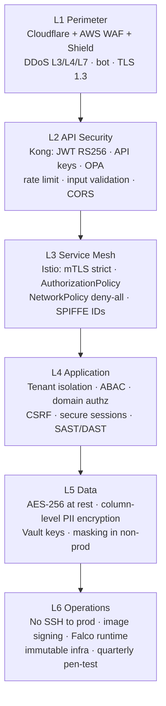
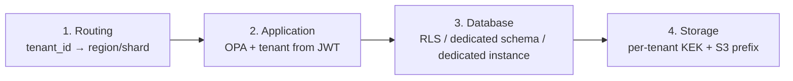
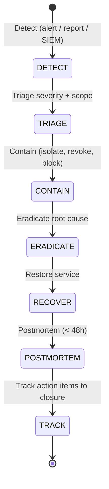

# FleetVision — Security Architecture

**Version:** 2.0.0
**Status:** Approved — Foundation-Aligned
**Date:** 2026-08-02
**Owner:** Chief Information Security Officer / Security Lead
**Classification:** Confidential — Security Reference

> **About this document.** This is the canonical **security architecture and controls reference** for FleetVision. It consolidates the security-relevant decisions scattered across `01_Master_Architecture.md` §8–§9 and the auth/data modules into one authoritative source, and elaborates them into a defense-in-depth, zero-trust posture. It implements the *Trust* pillar of `00_Project_Vision.md` and conforms to ADR-005 (Istio mTLS), ADR-007 (PostgreSQL RLS), ADR-009 (Keycloak + OPA). v2.0.0 resolves ARR SEC-1 (single permission catalog), SEC-2 (tenant_id derivation contract), SEC-3 (unified token validation), SEC-4 (webhook rotation), SEC-5 (video PII technical control), SEC-6 (Redis revocation fail-mode), SEC-7 (API key TTL).

---

## Table of Contents

1. [Security Philosophy](#1-security-philosophy)
2. [Zero-Trust Defense-in-Depth](#2-zero-trust-defense-in-depth)
3. [Identity & Authentication](#3-identity--authentication)
4. [Authorization (RBAC + ABAC + OPA)](#4-authorization-rbac--abac--opa)
5. [Tenant Isolation](#5-tenant-isolation)
6. [Encryption](#6-encryption)
7. [Secrets & Key Management](#7-secrets--key-management)
8. [Device & IoT Security](#8-device--iot-security)
9. [Application Security](#9-application-security)
10. [Compliance & Privacy](#10-compliance--privacy)
11. [Threat Modeling (STRIDE)](#11-threat-modeling-stride)
12. [Security Operations (SecOps)](#12-security-operations-secops)
13. [Incident Response](#13-incident-response)

---

## 1. Security Philosophy

| Principle | Practice |
|---|---|
| **Zero Trust** | Never trust, always verify — at every layer, every request. No implicit trust based on network location. |
| **Defense in Depth** | Multiple independent controls; no single point of failure compromises the platform. |
| **Least Privilege** | Every identity (user, service, device) gets the minimum permissions needed — and no more. |
| **Fail Closed** | Auth/authz ambiguity → deny. Quota ambiguity → deny. Revocation check failure → deny (high-risk) or fail-open-with-degradation (low-risk), explicitly documented. |
| **Secure by Construction** | Tenant isolation, audit trails, and tamper-evidence are architectural, not bolt-on. |
| **Assume Breach** | Design as if the perimeter is already compromised; limit blast radius. |
| **Privacy by Design** | PII minimized, encrypted, retained only as long as needed; GDPR/SOC2 by construction. |

---

## 2. Zero-Trust Defense-in-Depth

Six independent layers; an attacker must defeat all to reach protected data.



| Layer | Controls | Failure Mode If Breached |
|---|---|---|
| L1 Perimeter | WAF, DDoS, TLS 1.3, geo-IP, bot mgmt | Attackers reach edge |
| L2 API | JWT validation, OPA, rate limit, input validation | Attackers reach services (still auth'd) |
| L3 Mesh | mTLS, AuthorizationPolicy, NetworkPolicy | Lateral movement contained |
| L4 App | Tenant isolation, domain authz, secure coding | Cross-tenant / vertical privilege blocked |
| L5 Data | AES-256, PII column encryption, RLS | Data at rest protected |
| L6 Ops | No SSH, signed images, runtime detection, pen-test | Operational access contained |

---

## 3. Identity & Authentication

Authoritative module: `Modules/Authentication.md`. Summary of what every service/operator must know.

### 3.1 Identity Types

| Identity | Auth Method | TTL |
|---|---|---|
| **End user** (web/mobile) | OAuth2 Authorization Code + PKCE → JWT (RS256) | access 15m; refresh 7d (rotated) |
| **Partner / machine** | OAuth2 Client Credentials → JWT, OR API Key | access 15m; key 90d default / 365d max |
| **Internal service** | mTLS (SPIFFE) + propagated user JWT | mesh cert 90d |
| **IoT device** | X.509 mTLS (per-device cert) | device cert per PKI |

### 3.2 JWT (RS256)

| Property | Value |
|---|---|
| Algorithm | RS256 (asymmetric: sign private, verify public) |
| Key size | 3072-bit RSA |
| Rotation | 90 days, 7-day overlap (`kid` distinguishes) |
| Storage | Vault Transit (keys never leave; signing by reference) |
| Distribution | JWKS endpoint; cached 15 min |

**Access-token claims:** `iss, sub, aud, exp, nbf, iat, jti, tenant_id, tenant_tier, scope, roles, aal, session_id, auth_time, amr`. PII omitted (JWT is encoded, not encrypted).

### 3.3 Token Validation (Resource Server — Fail Closed)

A token is accepted **only if all** pass:

1. Parseable 3-part JWT; `alg` = RS256 (reject `none`, HS256).
2. `kid` resolves to a trusted JWKS key (our issuer only).
3. **Signature** verifies.
4. `exp` future (±60s skew); `nbf ≤ now`; `iat ≤ now`.
5. `iss` = expected FleetVision issuer; `aud` includes this resource server.
6. Redis: `revocation:<jti>` absent AND `revocation:user:<sub>` absent.
7. Tenant active (cached; suspended → deny).

Any failure → `401 Unauthorized` generic (never disclose which check failed → no oracle).

### 3.4 Multi-Factor Authentication (NIST AAL2)

Mandatory for: `tenant-admin`, `compliance-officer`, `billing` roles, and any step-up action. Factors: TOTP (RFC 6238), WebAuthn/FIDO2 (phishing-resistant, preferred), backup codes. SMS/email OTP are backup-only (weaker).

### 3.5 Federation (Enterprise SSO)

Keycloak 24 brokers OIDC/SAML 2.0 to customer IdPs (Okta, Azure AD, Google). JIT provisioning on first SSO. IdP token validated (signature, nonce, state); strict `iss` allowlist per tenant.

### 3.6 Token Revocation (< 60s global — ARR SEC-6)

```mermaid
flowchart LR
    EV[Revocation event<br/>logout/admin/compromise] --> RD[Redis: SET revocation:jti<br/>SET revocation:user]
    RD --> PG[(PostgreSQL durable:<br/>refresh_tokens.revoked<br/>auth_sessions.status)]
    Note over RD: Access tokens live 15 min<br/>worst-case natural expiry
    Note over RD: logout-all sets revocation:user<br/>→ < 60s global (every request checks)
```

**Redis revocation fail-mode (resolves ARR SEC-6):** Redis unreachable → **fail-closed** for high-risk roles (admin/compliance/billing); **fail-open with 5-min degradation + alert** for low-risk operators. Documented in `Authentication.md` §10.4; never silent.

---

## 4. Authorization (RBAC + ABAC + OPA)

### 4.1 RBAC Model

```
User ──assigned──► Role ──grants──► Permission (resource.action)
                                      │
                                      ▼
                          evaluated by OPA at request time
                          with contextual attributes (ABAC)
```

- A **User** is assigned one or more **Roles** (optionally scoped to fleet/org).
- A **Role** is a named bundle of **Permissions**.
- A **Permission** is a fine-grained `<domain>.<resource>.<action>` (e.g., `fleet.vehicle.create`).
- **Effective permissions** = union across the user's active roles (after scope resolution).
- Contextual checks (resource ownership, time, tier, AAL) are ABAC attributes fed to OPA.

### 4.2 Canonical Permission Catalog (Single Source of Truth — ARR SEC-1)

The catalog lives in **`02_Domain_Model.md` §6** — it is the single source of truth. Module endpoint tables reference it; CI enforces drift (OpenAPI annotations ↔ catalog) breaks the build. Permissions follow `<domain>.<resource>[.sub].<action>`; wildcard `*` sparingly; `own` for principal-owned resources.

### 4.3 System Roles (Seeded)

| Role | Permissions | MFA |
|---|---|---|
| `tenant-admin` | `*` (all) | Mandatory |
| `compliance-officer` | `compliance.*`, `tracking.*` | Mandatory |
| `fleet-admin` | `fleet.*`, `driver.*`, `trip.*`, `maintenance.*` | Optional |
| `dispatcher` | `trip.*`, `tracking.position.live`, `driver.read`, `vehicle.read` | Optional |
| `fleet-operator` | `vehicle.{read,update}`, `driver.read`, `trip.read` | Optional |
| `mechanic` | `maintenance.*`, `vehicle.read` | Optional |
| `finance` | `billing.*`, `asset.*` | Optional |
| `driver` | `trip.own.*`, `compliance.hos.own.*`, `compliance.dvir.own.*` | Optional |
| `viewer` | `*.read` | Optional |

### 4.4 OPA Evaluation Pipeline

```mermaid
flowchart LR
    REQ[Request + Bearer JWT] --> V[1. Validate JWT signature + claims]
    V --> R[2. Resolve required permission from route + method]
    R --> I[3. Build OPA input:<br/>{subject, action, resource, context}]
    I --> OPA[4. OPA evaluates Rego policy]
    OPA -->|allow| OK[5. proceed; RLS enforces tenant in DB]
    OPA -->|deny| D[5. 403 Forbidden generic; logged for audit]
```

- **Policy bundles** versioned in Git, deployed via OPA bundle service; CI lints Rego + runs policy unit tests.
- **Decision logging:** every OPA decision logged (allow/deny + input hash) → ClickHouse for audit.
- **Default-deny:** missing/errored OPA response → **deny** (fail-closed).
- **Performance:** < 5ms P99; cached for hot `(subject, action, resource)` keys (5s TTL).

### 4.5 Defense-in-Depth Authorization

A successful request must pass **four layers**:

| Layer | Check |
|---|---|
| API Gateway | JWT validity, rate limit, coarse route authorization |
| Service (OPA) | Fine-grained RBAC + ABAC permission decision |
| Database (RLS) | Tenant isolation (last line of defense) |
| Resource-owner check | Domain-level (e.g., "is this trip mine?") |

---

## 5. Tenant Isolation

Tenant isolation is the platform's highest-impact trust requirement (INV-I01). It is enforced at **four independent layers** so that no single bug crosses the boundary:



| Layer | Mechanism |
|---|---|
| Routing | API Gateway resolves `tenant_id → region` (EU never leaves eu-west-1) |
| Application | Tenant from JWT (INV-I02); OPA denies cross-tenant; services reject gRPC `tenant_id ≠ JWT tenant_id` |
| Database | RLS (Standard) / dedicated schema (Professional) / dedicated instance (Enterprise) |
| Storage | Per-tenant KEK (Vault); S3 prefix `tenant=<id>/`; crypto-shredding on erasure |

### 5.1 Tenant ID Derivation (INV-I02 — ARR SEC-2)

**Tenant ID always derived from the authenticated principal (JWT), never from request body.**

- The `X-Tenant-Id` header is **set by the gateway from JWT**; clients MUST NOT set it (anti-forgery).
- Internal gRPC may pass `tenant_id` in metadata (mesh-trusted), but **services must reject requests where gRPC `tenant_id ≠ JWT tenant_id`**.
- `tenant_id` is forbidden in client-facing request schemas (OpenAPI/proto lint rule).
- An ArchUnit-style test guards the rule.

### 5.2 Three-Tier Isolation Model (ADR-003)

| Tier | Profile | Strategy |
|---|---|---|
| **Enterprise** | 1,000+ vehicles; regulated | Dedicated PostgreSQL + TimescaleDB + Redis per tenant |
| **Professional** | 100–1,000 vehicles | Shared PG instance; dedicated schema per tenant |
| **Standard** | < 100 vehicles | Shared DB + schema; `tenant_id` column + RLS policies |

### 5.3 Noisy-Neighbor Prevention

Per-tenant quotas (vehicles, GPS/s, API/min, storage) enforced real-time by `billing-service` via Redis atomic counters (`Modules/Tenant-Management.md`). Breaches → API Gateway rate-limits that tenant.

---

## 6. Encryption

### 6.1 At Rest

| Data | Encryption |
|---|---|
| All databases | AES-256 (KMS/Vault-managed keys) |
| PII (SSN, license #, VIN, phone, email) | **Column-level AES-256 envelope** (data-encryption-key wrapped by Vault KEK) |
| Kafka topics | AES-256 |
| S3 objects | SSE-KMS |
| Backups | AES-256 |

### 6.2 In Transit

| Path | Encryption |
|---|---|
| All external | TLS 1.3 (HSTS; no plain HTTP) |
| Service-to-service | mTLS (Istio) |
| Kafka | TLS 1.3 + mTLS |
| DB connections | TLS 1.3 |
| WebRTC media | DTLS-SRTP |
| Device ↔ gateway | TLS 1.3 / mTLS (X.509) |

### 6.3 Key Rotation

| Key | Cadence | Mechanism |
|---|---|---|
| TLS certs | 90 days | cert-manager |
| JWT signing | 90 days (7-day overlap) | Keycloak + `kid` |
| DB encryption | 180 days | Vault |
| API keys | 90 days default / 365 max (ARR SEC-7) | manual + overlap |
| Per-tenant KEK | on erasure (crypto-shredding) | Vault |
| Webhook HMAC secrets | on demand (dual-secret overlap, ARR SEC-4) | Admin API |

---

## 7. Secrets & Key Management

### 7.1 HashiCorp Vault

Self-hosted Vault on EKS (cross-cloud portability). System of record for:
- DB credentials (**dynamic**, 24h TTL, auto-rotated)
- API keys / partner credentials
- JWT signing keys (Transit — keys never leave)
- Per-tenant KEKs (envelope encryption; destroy for erasure)
- Webhook HMAC secrets

### 7.2 External Secrets Operator

Syncs Vault → Kubernetes Secrets; never committed to Git. Services auth to Vault via Kubernetes service-account JWT (OIDC auth).

### 7.3 Envelope Encryption (PII)

```
DEK (per row) encrypts PII value
KEK (per tenant, in Vault) wraps DEK
→ stored: ciphertext + wrapped DEK
→ to read: unwrap DEK with KEK, decrypt
```

Destroying the tenant KEK → all tenant PII unreadable instantly (crypto-shredding erasure).

---

## 8. Device & IoT Security

Authoritative: `Modules/DeviceGateway.md`, `Modules/Telemetry-Device-Management.md`.

| Concern | Control |
|---|---|
| Device identity | X.509 certificate per device (unique CN = device id) |
| Device auth | mTLS to EMQX / Device Gateway; cert验证 |
| Revocation | CRL / OCSP; device cert revocation → connection refused |
| Provisioning | Device credentials issued at provisioning; rotated per policy |
| Firmware | Signed firmware (INV-TEL03); verified before install |
| Commands | Authenticated; idempotent; TTL-enforced |

---

## 9. Application Security

### 9.1 Secure Development Lifecycle (SSDLC)

| Stage | Control |
|---|---|
| Design | Threat model (STRIDE) for new features; ARB review for security-relevant changes |
| Code | SAST (Semgrep); secret scanning (gitleaks); code review (security-focused for auth/tenant code) |
| Dependencies | Dependabot/Snyk; CVE threshold blocks merge |
| Build | Signed images (Sigstore); SBOM generated |
| Test | DAST (ZAP) in CI; security integration tests (authz matrix) |
| Deploy | Admission control (signed images only); OPA Gatekeeper policies |
| Runtime | Falco (runtime behavioral); image immutability; no SSH to prod |

### 9.2 Input Validation & Output Encoding

- All inputs validated (schema + semantic) at the gateway/service boundary.
- Output encoded contextually (HTML, URL, JS) — defense against XSS.
- Parameterized queries only (no string-concat SQL); ORM/Spring Data JDBC.
- No `eval` / no native deserialization of untrusted input.

### 9.3 Session & Cookie Security

- Refresh tokens in **HttpOnly + Secure + SameSite=Lax** cookies (web); secure storage (mobile).
- Access tokens in memory (web JS); never localStorage.
- CSRF: SameSite + `state` (OAuth) + double-submit for state-changing POSTs.
- Session fixation: new session id on every privilege change.

### 9.4 Mass-Assignment Protection

DTOs explicitly map fields; `roles`, `tenant_id`, `status` never auto-bound.

---

## 10. Compliance & Privacy

### 10.1 Compliance Posture

| Standard | Year | Vision Link |
|---|---|---|
| SOC 2 Type II | Year 1 | Enterprise sales enabler |
| ISO 27001 | Year 2 | International credibility |
| GDPR | Year 1 (EU launch) | Right to erasure, data residency |
| CCPA | Year 1 | California customer |
| FMCSA ELD | Year 1 (P3) | Compliance module certification |
| PCI DSS | Year 1 (scoped) | Fuel card payment data |

### 10.2 Data Classification

| Class | Examples | Handling |
|---|---|---|
| **PII / Sensitive** | SSN, license #, VIN, phone, email | Column-level encryption; masked in non-prod; GDPR-erasable |
| **Telemetry** | GPS, sensors, diagnostics | Table encryption; tier-driven retention |
| **Compliance / Immutable** | HOS, DVIR, audit | Append-only + hash-chain; regulation retention |
| **Financial** | Invoices, fuel, TCO | Column-level PII; 7y retention (tax) |
| **Media** | Dashcam, CCTV | SSE-KMS; tier retention; hash-chained evidence |
| **Operational** | Configs, policies, geofences | Table encryption; tenant-owned |

### 10.3 GDPR / Data Subject Rights

- **Right to Erasure:** crypto-shredding (destroy tenant KEK) + 90-day buffer + audit preserved anonymized (`Modules/Tenant-Management.md` §6.3).
- **Data residency:** EU tenant data never leaves `eu-west-1` (region pin).
- **Right to Access / Portability:** data export via Reporting module (`analytics.report.export`).
- **Privacy by design:** driver-facing video AI safety-only (INV-MED02); no face recognition.

### 10.4 PII Redaction in Logs

Enforced at the Fluentd pipeline: SSN, license numbers, emails, phone numbers, VINs masked before persistence. Structured logging standard (`01_Master_Architecture.md` §14.5).

---

## 11. Threat Modeling (STRIDE)

### 11.1 Platform-Level STRIDE

| Threat (STRIDE) | Highest-Risk Target | Primary Mitigation |
|---|---|---|
| **S — Spoofing** | IoT devices | X.509 mTLS + device attestation |
| **S — Spoofing** | Phishing of login | WebAuthn/passkey (phishing-resistant); FIDO2 aaguid allowlist |
| **S — Spoofing** | Forged JWT | RS256 + strict alg allowlist + JWKS pinning |
| **T — Tampering** | HOS logs / evidence clips | Event sourcing + SHA-256 hash chain (append-only) |
| **R — Repudiation** | All user actions | Immutable audit log (append-only ClickHouse); signed |
| **I — Info Disclosure** | Tenant data | 4-layer isolation (§5); RLS; OPA tenant check |
| **I — Info Disclosure** | Error oracle | Generic login errors; uniform timing; 404 not 403 for hidden |
| **D — DoS** | GPS pipeline / login | KEDA autoscaling + per-tenant rate limits + WAF |
| **E — EoP** | Admin self-escalation | OPA denies `iam.role.assign` unless already admin; dual-control |
| **E — EoP** | Refresh-token theft | Rotation + reuse detection → family revocation |

### 11.2 Per-Context STRIDE

Each module's Security section carries a context-specific STRIDE table (e.g., `Modules/Authentication.md` §6.8, `Modules/VideoPlatform.md` §12). This document owns the platform-level view; modules own the detailed per-context threats.

---

## 12. Security Operations (SecOps)

### 12.1 Security Monitoring

| Signal | Source | Action |
|---|---|---|
| Auth failures spike | `iam.auth.login.failed.v1` | Auto-lock; alert; SIEM |
| Refresh-token reuse | `iam.auth.token.revoked.v1` | Family revoke; SEV-2 if admin |
| Impossible travel | Risk evaluation | Force step-up MFA; revoke on fail |
| Tenant isolation anomaly | OPA deny spike | Alert; investigate cross-tenant attempt |
| Anomalous admin action | Audit log pattern | Dual-control gate; alert |
| Runtime syscall anomaly | Falco | Pod isolate; alert |
| Vulnerability disclosure | CVE feed | Triage; patch SLA by severity |
| Secret leak | gitleaks / Git scan | Revoke + rotate; alert |

### 12.2 SIEM Integration

All security-relevant events (auth, authz denials, audit, Falco, WAF) streamed to a SIEM (Splunk / Elastic Security / Datadog) via Kafka → S3Sink + direct ship. Correlation rules detect attack patterns.

### 12.3 Vulnerability Management

| Severity | SLA to remediate |
|---|---|
| Critical (CVSS 9–10) | 7 days (or compensate + document) |
| High (7–8.9) | 30 days |
| Medium (4–6.9) | 90 days |
| Low (< 4) | next release |

### 12.4 Access Review

Quarterly access review: tenant admins re-attest role assignments; unattested assignments auto-revoked. Service accounts reviewed monthly.

### 12.5 Penetration Testing

- **External pen-test:** quarterly (vision OKR-3.1).
- **Internal red-team:** semi-annually.
- **Bug bounty:** Year 2+ (HackerOne).
- Findings tracked to closure; re-test required.

---

## 13. Incident Response

### 13.1 Severity Classification

| Severity | Definition | Response | Examples |
|---|---|---|---|
| **SEV-S1** (Security) | Confirmed breach / data exfiltration / isolation failure | Immediate; IR team + execs; 24×7 | Cross-tenant access, PII leak |
| **SEV-1** | Platform-wide outage / critical-safety feature down | 15 min PagerDuty | Auth down, DB primary down |
| **SEV-2** | Major degradation | 30 min | 5xx > 5%, consumer lag > 100K |
| **SEV-3** | Minor degradation | 4h Slack | Slow queries, disk > 80% |

### 13.2 Incident Lifecycle



### 13.3 Containment Playbook (Selected)

| Incident | Containment |
|---|---|
| Compromised user | `logout-all` (revocation:user) < 60s; reset credentials; audit |
| Compromised API key | Revoke key; alert partner; rotate |
| Compromised device cert | Revoke cert (CRL); block at gateway |
| Cross-tenant access bug | Emergency deploy (hotfix canary); OPA policy push; audit-forensics |
| Key compromise (JWT signing) | Emergency key rotation via Vault; revoke all tokens globally |
| Ransomware / runtime | Isolate pod/node; Falco evidence; rebuild from immutable image |

### 13.4 Communication

- **Internal:** Slack `#incidents` (SEV-1/2); PagerDuty (SEV-1); exec bridge for SEV-S1.
- **External (customers):** status page update within 30 min (SEV-1); direct notification for tenants affected by isolation incidents.
- **Regulatory:** GDPR 72-hour breach notification where applicable; FMCSA/DOT per regulation.
- **Postmortem:** blameless; published internally within 48h; action items tracked in JIRA with owners + due dates.

### 13.5 Tabletop Exercises

- Quarterly tabletop on a breach scenario (isolation failure, ransomware, insider).
- Annual full-scale IR drill (purple-team).

---

## Appendix A: Security Controls Catalog (Selected)

| Control | Implementation | Standard |
|---|---|---|
| MFA enforced (admins) | TOTP/WebAuthn; AAL2 | SOC2 CC6.1 |
| Encrypted at rest | AES-256; PII column-level | SOC2 CC6.7 |
| Encrypted in transit | TLS 1.3 + mTLS | SOC2 CC6.7 |
| Least privilege | OPA RBAC; dynamic DB creds | SOC2 CC6.3 |
| Audit logging | Immutable, hash-chained, append-only | SOC2 CC7.2 |
| Vulnerability scanning | Snyk/Trivy; pen-test quarterly | SOC2 CC7.1 |
| Incident response | Runbook + 24×7 + postmortem | SOC2 CC7.4 |
| Change management | GitOps + 2-approval + canary | SOC2 CC8.1 |
| Data residency | Region pin (EU) | GDPR Art. 44 |
| Right to erasure | Crypto-shredding + 90d buffer | GDPR Art. 17 |
| Backup + DR | WAL-G PITR + DR region | SOC2 CC9.1 |

## Appendix B: ARR Findings Resolved in v2.0.0

| Finding | Resolution |
|---|---|
| SEC-1 (permission catalog drift) | Single canonical catalog (`02_Domain_Model.md` §6); CI gate |
| SEC-2 (tenant_id derivation unenforced) | INV-I02 contract; proto lint; service-side mismatch rejection |
| SEC-3 (SignalR token validation) | ADR-015 — SignalR dropped; Socket.IO canonical; unified validator |
| SEC-4 (webhook rotation gap) | Dual-secret overlap (§6.3, `API_Design.md` §7.5) |
| SEC-5 (video PII not technical) | INV-MED02; frames blurred-at-edge before persistence unless legal hold |
| SEC-6 (Redis revocation fail-mode) | Fail-closed high-risk / fail-open-degrade low-risk, documented |
| SEC-7 (API key TTL conflict) | 90d default / 365d max with waiver + alert |

## Appendix C: Traceability

| Foundation Element | This Document |
|---|---|
| `00` Trust pillar | throughout |
| `00` §8 Quality (0 material incidents; 99.95% availability) | §12, §13 |
| `01` §8 Security architecture | §2, §3, §6 |
| `01` §9 Multi-tenancy | §5 |
| `02` §6 Permission catalog (canonical) | §4.2 |
| `02` §8 INV-I01, INV-I02 | §5 |
| `Modules/Authentication.md` | §3 |
| `Modules/Tenant-Management.md` (isolation, erasure) | §5, §10.3 |
| ADR-003 (3-tier tenancy), ADR-005 (Istio mTLS), ADR-007 (PG RLS), ADR-009 (Keycloak+OPA) | throughout |

---

*This Security Architecture document is the canonical security reference. It is reviewed quarterly by the ARB and CISO, and after any SEV-S1 incident. Detailed runbooks, pentest reports, and audit evidence live in the Security wiki; this document owns the architecture.*
