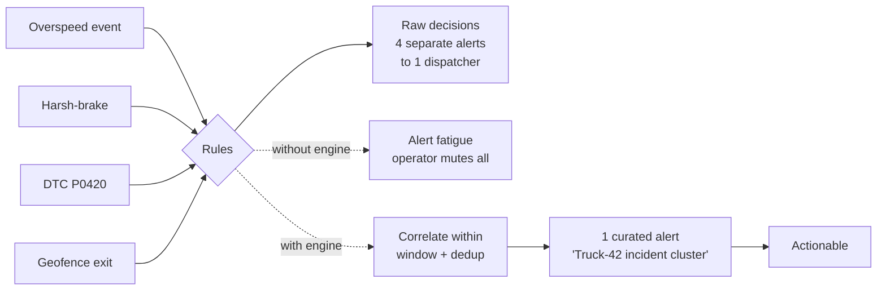
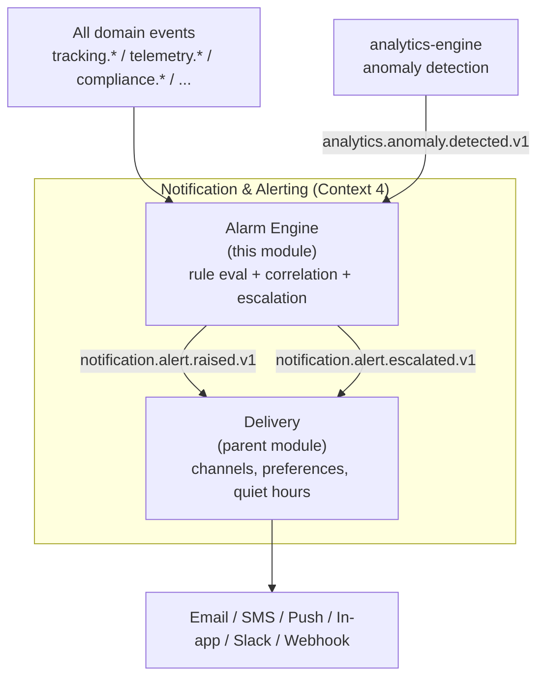
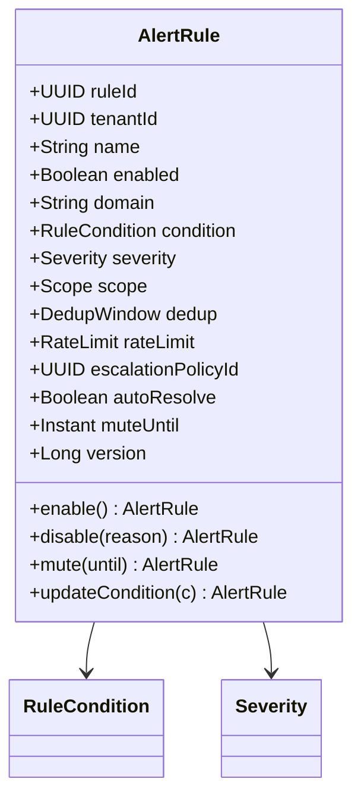
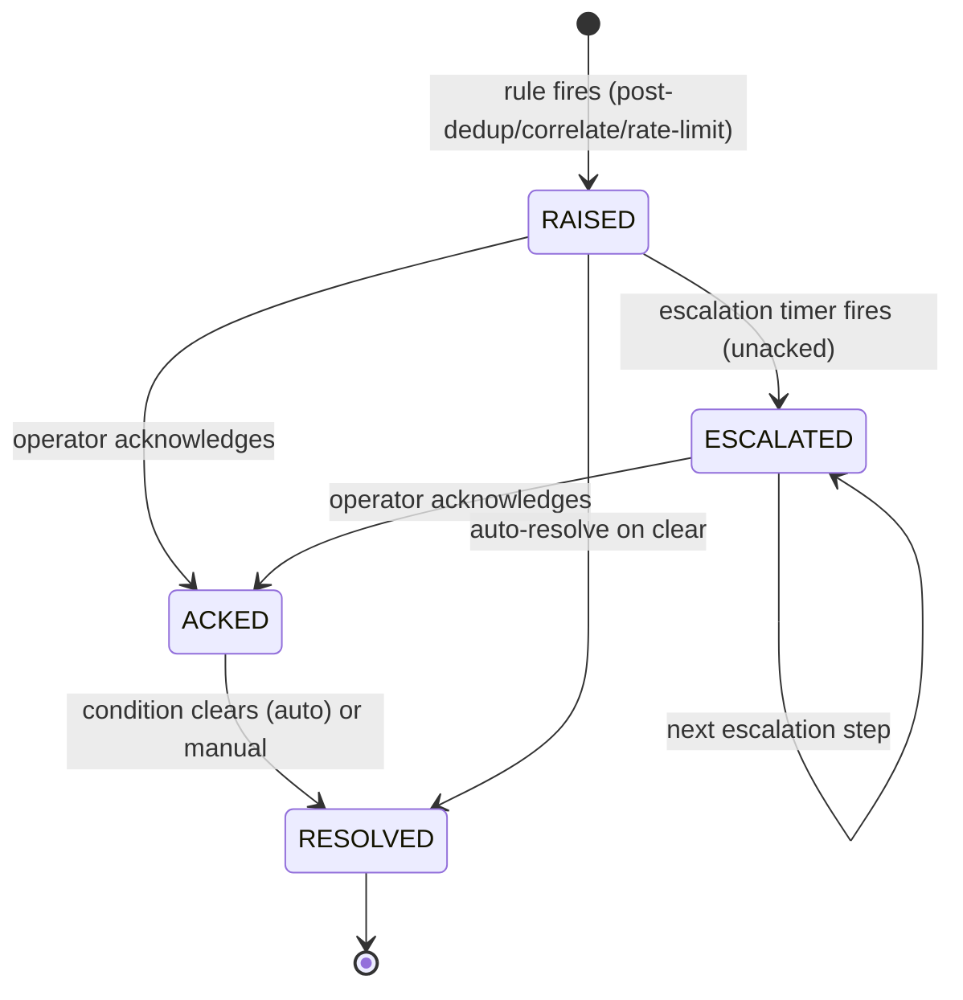
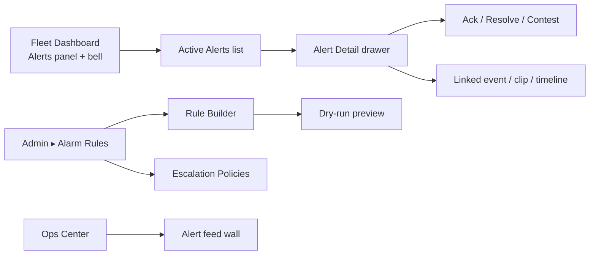

# Alarm Engine Module
## Module-Level Design Document

**Version:** 2.0.0
**Status:** Approved — Foundation-Aligned
**Date:** 2026-08-02
**Bounded Context:** Notification & Alerting (Alarm Computation Sub-Domain)
**Service:** `notification-service` (Spring Boot 3.3 + Kotlin 2.0, JVM 21) — alarm-engine sub-component (real-time stream processor)
**Data Store:** PostgreSQL 16 (`notification` schema — rule definitions, raised alerts) · Redis 7 (rule cache, dedup windows, escalation timers) · ClickHouse (alert analytics, noise-suppression feedback)
**Messaging:** Kafka (consumes **all** domain events; emits `fleetvision.notification.alert.events`)
**Authorization:** Open Policy Agent (OPA)

> **Relationship to foundation.** This module is the deep-dive on **alarm computation** within the Notification & Alerting context (`02_Domain_Model.md` §1, Context 4). It owns the `AlertRule`, `Alert` (raised instance), and `EscalationPolicy` aggregates and is the authoritative emitter of `notification.alert.raised.v1` / `.escalated.v1` / `.resolved.v1` / `.suppressed.v1` on `fleetvision.notification.alert.events`. The parent `Modules/Notification-Alerting.md` owns **delivery** (email/SMS/push/in-app channels, user preferences, quiet hours) and consumes the alerts this engine raises. Conforms to ADR-002 (Kafka), ADR-006 (Kotlin), ADR-009 (OPA), ADR-016 (single topic convention). This split mirrors the GPSEngine↔Tracking and Reporting↔Analytics-Engine patterns: **engine computes; parent delivers.**

---

## Table of Contents

1. [Business Analysis](#1-business-analysis)
2. [Domain Model](#2-domain-model)
3. [Database](#3-database)
4. [Entities](#4-entities)
5. [APIs](#5-apis)
6. [Security](#6-security)
7. [Permissions](#7-permissions)
8. [Sequence Diagrams](#8-sequence-diagrams)
9. [UI Flow](#9-ui-flow)
10. [Scalability](#10-scalability)

---

## 1. Business Analysis

### 1.1 Purpose

Every context in FleetVision emits domain events — overspeed, geofence, harsh-brake, DTC, HOS violation, fuel fraud, idle-excess, AI intrusion, quota breach. Without an Alarm Engine, each consumer decides "is this worth alerting on?" ad hoc, producing **alert storms** (one harsh-brake triggers 4 redundant notifications), **alert fatigue** (operators mute everything), and **missed critical events** (the real incident is buried in noise).

The Alarm Engine is the **single, authoritative event-to-alert processor**. It evaluates every domain event against tenant-defined rules, applies **correlation, deduplication, noise suppression, and severity escalation**, and emits a curated stream of actionable `Alert` instances that the delivery side (parent module) turns into notifications. Its job is to make sure that **when an operator's phone buzzes at 3 AM, it matters.**

### 1.2 Goals & Non-Goals

| Goals | Non-Goals |
|---|---|
| Evaluate every domain event against rules in real time | Deliver notifications (parent Notification module owns channels) |
| Eliminate alert storms via correlation + dedup | Store user channel preferences (parent owns) |
| Escalate unacknowledged critical alerts on a time chain | Render the alerts bell UI (frontend owns) |
| Suppress noise via rate-limiting per recipient/severity | Replace OPA authorization (uses OPA) |
| Enable per-tenant rule customization | ML-based anomaly detection (analytics-engine owns; this consumes its outputs) |
| Distinguish actionable alerts from logged events | Audit logging (audit-log-service owns) |

### 1.3 The Alert Problem (Why a Dedicated Engine)



### 1.4 Functional Requirements

| ID | Requirement | Priority |
|---|---|---|
| ALM-FR-01 | Evaluate every domain event against active rules in real time | Must |
| ALM-FR-02 | Rule types: threshold, state-change, absence (no-event), compound (A AND B within window), rate (N events in T) | Must |
| ALM-FR-03 | Per-rule severity (INFO / MINOR / MAJOR / CRITICAL) | Must |
| ALM-FR-04 | Deduplication within configurable window per (rule, entity, recipient) | Must |
| ALM-FR-05 | Correlation: group related events into one alert cluster | Must |
| ALM-FR-06 | Rate-limiting per recipient / severity / tenant (anti-flood) | Must |
| ALM-FR-07 | Escalation: unacked CRITICAL advances through a time-based chain | Must |
| ALM-FR-08 | Auto-resolve: condition clears → alert auto-resolves | Must |
| ALM-FR-09 | Tenant-admin rule CRUD with templates | Must |
| ALM-FR-10 | Mute / suppress rules (maintenance windows) | Must |
| ALM-FR-11 | Alert lifecycle tracking (RAISED → ACK → RESOLVED) | Must |
| ALM-FR-12 | Noise-suppression feedback loop (ack/contest feeds rule tuning) | Should |

### 1.5 Non-Functional Requirements

| Attribute | Target |
|---|---|
| Event → alert decision latency | < 100ms P99 (in-memory rule eval) |
| Throughput | 50,000 events/sec evaluation rate |
| Availability | 99.9% (Tier 1 — degrades gracefully; missed alerts not catastrophic) |
| Fail-mode | Fail-safe: on engine degradation, raw events still reach delivery as best-effort alerts |
| Rule cache hit rate | ≥ 99% (Redis) |

### 1.6 Severity Matrix

| Severity | Definition | Routing | Example |
|---|---|---|---|
| **CRITICAL** | Safety/regulatory/asset-loss risk; needs immediate action | Bypasses quiet hours; PagerDuty-style | HOS violation, crash, intrusion, fuel theft |
| **MAJOR** | Operational impact; action within hours | Notification queue | Overspeed, harsh-brake, DTC, off-route |
| **MINOR** | Minor operational note; next-shift review | Digest / in-app | Idle 15m, geofence enter |
| **INFO** | Logged for context; no alert | Audit/analytics only | Odometer update, session start |

---

## 2. Domain Model

### 2.1 Sub-Domain Position



### 2.2 Aggregates Owned

| Aggregate | ES? | Consistency Boundary |
|---|---|---|
| **AlertRule** | No | One rule definition (condition, severity, scope, dedup, escalation) |
| **Alert** | No | One raised alert instance (lifecycle, recipients, escalation state) |
| **EscalationPolicy** | No | A time-based escalation chain for a rule |

### 2.3 Value Objects

| Value Object | Fields | Validation |
|---|---|---|
| `RuleCondition` | type, expression, window | threshold / state / absence / compound / rate |
| `Severity` | enum INFO/MINOR/MAJOR/CRITICAL | — |
| `Scope` | tenantId, fleetId?, vehicleId?, driverId? | hierarchical |
| `DedupWindow` | key, duration | e.g., `(rule,vehicleId)` for 5 min |
| `EscalationStep` | delay, recipients, channel | time-based chain node |
| `AlertSource` | domain, eventType, eventId, payload | the triggering event(s) |

### 2.4 Domain Events

All CloudEvents-wrapped, Avro, on **`fleetvision.notification.alert.events`** (ADR-016), partitioned by `tenant_id` then `entityId`.

| Event | Trigger | Consumers |
|---|---|---|
| `notification.alert.raised.v1` | Rule fires → new Alert created | Delivery (parent), audit, analytics |
| `notification.alert.escalated.v1` | Unacked alert advances an escalation step | Delivery |
| `notification.alert.acknowledged.v1` | Operator acks | Delivery (stop further escalation), analytics |
| `notification.alert.resolved.v1` | Condition clears or manual resolve | Delivery, analytics |
| `notification.alert.suppressed.v1` | Rule muted / dedup dropped | Analytics (noise metrics) |

### 2.5 Consumed Events (Inputs)

The engine subscribes to a **broad set** of domain topics. Representative (full list in `04_Event_Catalog.md`):

| Source domain | Example events |
|---|---|
| Tracking | `tracking.speed.exceeded.v1`, `tracking.geofence.entered/exited.v1`, `tracking.behavior.event.v1`, `tracking.idle.alert.v1` |
| Telemetry | `telemetry.diagnostic.code.received.v1`, `telemetry.device.faulted.v1` |
| Compliance | `compliance.hos.violation.detected.v1`, `compliance.incident.reported.v1` |
| Fuel | `fuel.fraud.detected.v1`, `fuel.transaction.flagged.v1` |
| Maintenance | `maintenance.workorder.overdue.v1` (derived) |
| Media | `media.ai.alert.v1` |
| Billing | `billing.quota.exceeded.v1` |
| Analytics | `analytics.anomaly.detected.v1`, `analytics.prediction.maintenance.v1` |

> **Note:** the engine consumes the *canonical* event names per `02_Domain_Model.md` §5 and ADR-016 — no drift.

### 2.6 Domain Services

| Service | Responsibility |
|---|---|
| `RuleEvaluator` | Match event → rules (in-memory indexed rule set) |
| `Correlator` | Group related events into clusters within a window |
| `Deduplicator` | Drop duplicates per dedup key + window |
| `RateLimiter` | Per-recipient/severity/tenant flood control |
| `EscalationSupervisor` | Time-based escalation advancement |
| `AutoResolver` | Detect condition clear → resolve open alerts |
| `NoiseFeedbackProcessor` | ack/contest → rule tuning signals |

### 2.7 Ubiquitous Language

| Term | Definition |
|---|---|
| Alert | A curated, actionable instance raised when a rule fires |
| AlertRule | A condition + scope + severity + actions definition |
| Severity | CRITICAL/MAJOR/MINOR/INFO — drives routing |
| Correlation | Grouping related events into one alert cluster |
| Dedup window | Period during which identical alerts are suppressed |
| Escalation | Time-based advancement of an unacked alert to more recipients |
| Auto-resolve | Alert closes when its condition clears |
| Mute / suppression | Temporarily disable a rule (maintenance window) |
| Alert storm | Many redundant alerts from one incident — what the engine prevents |
| Noise ratio | Suppressed / raised — key quality KPI |

---

## 3. Database

Schema `notification` in PostgreSQL (rule definitions, raised alerts — durable system of record); Redis for hot rule cache, dedup windows, escalation timers, rate-limit counters.

### 3.1 PostgreSQL Tables

```sql
notification.alert_rules (
  rule_id UUID PK, tenant_id UUID, name TEXT, enabled BOOLEAN,
  domain TEXT,                         -- tracking / telemetry / compliance / ...
  condition JSONB NOT NULL,            -- {type, expression, window}
  severity TEXT NOT NULL,              -- INFO/MINOR/MAJOR/CRITICAL
  scope JSONB NOT NULL,                -- {fleetId?, vehicleId?, driverId?}
  dedup JSONB,                         -- {key, durationSeconds}
  rate_limit JSONB,                    -- {perRecipient, perTenant}
  escalation_policy_id UUID,
  auto_resolve BOOLEAN,
  mute_until TIMESTAMPTZ,
  template_id UUID,                    -- seeded template this customizes
  version BIGINT, created_at, updated_at
)

notification.alerts (
  alert_id UUID PK, tenant_id UUID,
  rule_id UUID, severity TEXT,
  entity_type TEXT, entity_id UUID,    -- vehicle / driver / device / site
  status TEXT NOT NULL,                -- RAISED / ACKED / RESOLVED / ESCALATED
  raised_at TIMESTAMPTZ, acked_at TIMESTAMPTZ, resolved_at TIMESTAMPTZ,
  source_events JSONB,                 -- {eventId, eventType, payload}[]
  correlation_cluster UUID,            -- groups correlated alerts
  escalation_step INT, next_escalation_at TIMESTAMPTZ,
  recipients JSONB, metadata JSONB,
  version BIGINT
) PARTITION BY RANGE (raised_at)

notification.escalation_policies (
  policy_id UUID PK, tenant_id UUID, name TEXT,
  steps JSONB NOT NULL,                -- [{delaySeconds, recipients, channels}]
  version BIGINT
)

notification.alert_acknowledgements (
  ack_id UUID PK, alert_id UUID, user_id UUID,
  action TEXT,                         -- ACK / CONTEST / RESOLVE
  note TEXT, at TIMESTAMPTZ
) PARTITION BY RANGE (at)
```

**Partitioning** (`03_Database_Architecture.md` §8): `alerts` and `alert_acknowledgements` monthly range-partitioned for retention purge. **Indexes:** `(tenant_id, enabled, domain)` on rules (eval lookup); `(rule_id, entity_id, status)` on alerts; partial `(tenant_id, status) WHERE status IN ('RAISED','ESCALATED')` for the active-alert dashboard.

### 3.2 Redis Keyspace

| Key | Type | TTL | Purpose |
|---|---|---|---|
| `rules:<tenant>:<domain>` | Set/Hash | 10 min | Active rules for a tenant+domain (eval cache) |
| `dedup:<ruleId>:<entityId>` | String | dedup window | Dedup guard |
| `ratelimit:alert:<recipient>:<severity>` | Counter | 60s/3600s | Per-recipient flood control |
| `ratelimit:tenant:<tenantId>:<severity>` | Counter | 60s | Per-tenant flood control |
| `escalate:<alertId>` | Sorted Set (by time) | escalation max | Escalation scheduler |
| `cluster:<ruleId>:<entityId>` | String | correlation window | Correlation grouping |
| `autoresolve:<ruleId>:<entityId>` | String | clear-window | Auto-resolve guard |

---

## 4. Entities

### 4.1 AlertRule Aggregate



**Invariants:** (i) condition internally consistent (valid expression for type); (ii) CRITICAL rules cannot be muted beyond 24h without dual-control; (iii) scope ⊆ tenant; (iv) auto-resolve requires a clear condition.

### 4.2 Alert Aggregate



**Invariants:** (i) escalation only advances while unacked; (ii) RESOLVED is terminal; (iii) source events immutable after raise; (iv) severity immutable (escalation changes step/recipients, not severity).

### 4.3 EscalationPolicy Aggregate

```kotlin
data class EscalationPolicy(
    val policyId: UUID, val tenantId: UUID, val name: String,
    val steps: List<EscalationStep>,   // ordered by delay
    val version: Long
)
data class EscalationStep(
    val delaySeconds: Long,            // from raise (or prior step)
    val recipients: Set<UUID>,         // user/role targets
    val channels: Set<Channel>         // EMAIL, SMS, PUSH, PAGER...
)
// INV: steps ordered by ascending delay; at least one step
```

---

## 5. APIs

Endpoints under `/api/v1/alarms` (admin/rule management) and `/api/v1/alerts` (active alerts). REST contracts follow `API_Design.md`.

### 5.1 REST Endpoints

| Method | Endpoint | Description | Permission |
|---|---|---|---|
| `GET` | `/alarms/rules` | List rules (filter: domain, severity, enabled) | `notification.rule.read` |
| `POST` | `/alarms/rules` | Create rule | `notification.rule.manage` |
| `PUT` | `/alarms/rules/{id}` | Update rule | `notification.rule.manage` |
| `DELETE` | `/alarms/rules/{id}` | Delete rule | `notification.rule.manage` |
| `POST` | `/alarms/rules/{id}:mute` | Mute (maintenance window) | `notification.rule.manage` |
| `DELETE` | `/alarms/rules/{id}:mute` | Unmute | `notification.rule.manage` |
| `GET` | `/alarms/rules/templates` | Seeded rule templates | `notification.rule.read` |
| `POST` | `/alarms/rules/preview` | Dry-run a rule against recent events | `notification.rule.read` |
| `GET` | `/alerts` | List alerts (filter: severity, status, entity, range) | `notification.alert.read` |
| `GET` | `/alerts/{id}` | Alert detail + source events | `notification.alert.read` |
| `POST` | `/alerts/{id}:ack` | Acknowledge | `notification.alert.ack` |
| `POST` | `/alerts/{id}:resolve` | Manual resolve | `notification.alert.ack` |
| `POST` | `/alerts/{id}:contest` | Mark false-positive (noise feedback) | `notification.alert.ack` |
| `GET` | `/alerts/stats` | Noise ratio, top-firing rules, severity mix | `notification.alert.read` |
| `GET` | `/escalation-policies` | List policies | `notification.rule.read` |
| `POST` | `/escalation-policies` | Create policy | `notification.rule.manage` |

### 5.2 Sample — Create Rule

```http
POST /api/v1/alarms/rules
Authorization: Bearer <jwt>
Idempotency-Key: 9b3f…
Content-Type: application/json

{
  "data": {
    "type": "alertRule",
    "attributes": {
      "name": "Truck overspeed > 120km/h for 10s",
      "domain": "tracking",
      "severity": "MAJOR",
      "condition": {
        "type": "threshold",
        "eventType": "tracking.speed.exceeded.v1",
        "expression": "speed > 120",
        "windowSeconds": 10
      },
      "scope": { "fleetId": "660e…" },
      "dedup": { "key": "ruleId,vehicleId", "durationSeconds": 300 },
      "rateLimit": { "perRecipient": { "MAJOR": 10, "windowSeconds": 3600 } },
      "escalationPolicyId": "...",
      "autoResolve": true
    }
  }
}

201 Created
Location: /api/v1/alarms/rules/{ruleId}
```

### 5.3 gRPC (Internal — consumed by delivery + dashboards)

```protobuf
service AlarmService {
  rpc EvaluateEvent   (EvaluateEventRequest)  returns (EvalResult);     // rare sync; mostly Kafka-driven
  rpc GetActiveAlerts (ActiveAlertsRequest)   returns (AlertsPage);
  rpc AckAlert        (AckRequest)            returns (AckResponse);
  rpc GetAlertStats   (StatsRequest)          returns (AlertStats);
}
```

---

## 6. Security

### 6.1 Tenant Isolation

Every rule and alert carries `tenant_id`; rules scoped within tenant (INV-I01). Rule eval in-memory shards by tenant. OPA enforces rule CRUD scope (fleet admins manage their fleet's rules only).

### 6.2 CRITICAL Rule Protection

CRITICAL-severity rules (safety/regulatory) cannot be disabled/muted beyond 24h without **dual control** (two admin acks) — prevents a rogue/disgruntled admin from silencing safety alerts. Mute events audited.

### 6.3 Alert Tamper-Evidence

Raised alerts are **append-mostly** — status transitions append rows to `alert_acknowledgements`; the alert's `source_events` are immutable after raise. Audit-log-service receives all alert transitions. This gives defensible evidence that a critical alert was raised and (not) acknowledged — relevant for incident liability.

### 6.4 Fail-Safe Degradation

If the alarm-engine degrades (pod crash, Redis down), the system **fails safe**: raw CRITICAL events still flow to delivery as best-effort alerts (better noisy than silent on safety). Non-critical evaluation pauses. Alerted loudly; never silently drops safety events.

---

## 7. Permissions

Canonical permissions from `02_Domain_Model.md` §6 — this module does not redefine them.

| Permission | Used For |
|---|---|
| `notification.rule.read` | List/view rules, templates, dry-run |
| `notification.rule.manage` | CRUD rules, mute, escalation policies |
| `notification.alert.read` | List/view alerts, stats |
| `notification.alert.ack` | Acknowledge / resolve / contest alerts |

Role mapping (canonical roles from `02_Domain_Model.md` §6.2): `tenant-admin` and `fleet-admin` get `.rule.manage`; `dispatcher`, `compliance-officer`, `fleet-operator` get `.alert.read` + `.alert.ack`.

---

## 8. Sequence Diagrams

### 8.1 Event → Alert (Happy Path with Dedup + Correlation)

```mermaid
sequenceDiagram
    autonumber
    participant K as Kafka (domain events)
    participant AE as alarm-engine
    participant R as Redis
    participant DB as PostgreSQL
    participant K2 as Kafka (alert events)
    participant DEL as Delivery (parent)

    K->>AE: tracking.speed.exceeded.v1 (Truck-42, 128km/h)
    AE->>R: GET rules:<tenant>:tracking
    AE->>AE: Rule R1 matches (speed>120, scope=fleet)
    AE->>R: GET dedup:R1:Truck-42
    alt dedup key exists (within 5min window)
        AE->>K2: notification.alert.suppressed.v1
        Note over AE: dropped — no alert raised
    else no dedup
        AE->>R: GET cluster:R1:Truck-42 (correlation)
        AE->>R: GET ratelimit:alert:<recipient>:MAJOR
        alt rate limit exceeded
            AE->>K2: notification.alert.suppressed.v1 (rate)
        else within rate
            AE->>DB: INSERT alerts (status=RAISED)
            AE->>R: SET dedup:R1:Truck-42 (TTL 300); schedule escalate:<alertId>
            AE->>K2: notification.alert.raised.v1
            K2-->>DEL: deliver (per preferences)
        end
    end
```

### 8.2 Escalation Chain (Unacked CRITICAL)

```mermaid
sequenceDiagram
    autonumber
    participant SUP as EscalationSupervisor
    participant DB as PostgreSQL
    participant R as Redis
    participant K as Kafka
    participant DEL as Delivery

    Note over SUP: CRITICAL raised at T0, recipients: dispatcher
    SUP->>R: ZRANGEBYSCORE escalate: (now-1, now]
    alt step 1 due (T0+15min, unacked)
        SUP->>DB: alerts.escalation_step=1; next=T0+30min
        SUP->>K: notification.alert.escalated.v1 (step=1, recipients: +fleet-manager)
        K-->>DEL: deliver
    end
    alt step 2 due (T0+30min, still unacked)
        SUP->>DB: alerts.escalation_step=2
        SUP->>K: notification.alert.escalated.v1 (step=2, recipients: +director, channel=PAGER)
        K-->>DEL: deliver (pager)
    end
    Note over SUP: Ack at any step → stop escalation
```

### 8.3 Auto-Resolve on Condition Clear

```mermaid
sequenceDiagram
    autonumber
    participant K as Kafka
    participant AE as alarm-engine
    participant DB as PostgreSQL
    participant K2 as Kafka

    Note over AE: Open MAJOR alert: Truck-42 idle 20min (rule: idle>15min)
    K->>AE: tracking.idle.ended.v1 (Truck-42)
    AE->>AE: rule has autoResolve=true; clear condition met
    AE->>DB: alerts.status=RESOLVED; resolved_at=now
    AE->>K2: notification.alert.resolved.v1
```

---

## 9. UI Flow

Aligned with `Modules/UI_UX_Design.md` (one design system).

### 9.1 Surface Map



### 9.2 Alerts Panel (Fleet Dashboard)

Live (WebSocket) severity-sorted list. Click → drawer with source events, linked video clip (if any), linked timeline segment, and actions (Ack / Resolve / Contest). "Active vs resolved" toggle; severity filter.

### 9.3 Rule Builder (Admin)

Visual condition builder: pick domain + event type → expression editor (speed > 120, dwell > 30min, DTC code matches...) → severity → scope picker (tenant/fleet/vehicle) → dedup window → rate limit → escalation policy. **Dry-run** button shows what the rule *would have* raised in the last 24h (count + sample) — lets admins tune noise before enabling. Template library seeds common rules.

### 9.4 Noise Dashboard

Tenant-admin view: noise ratio (suppressed/raised) trend, top-firing rules, top-noisy vehicles, severity mix. Drives tuning: a rule firing 500×/day with 95% contest rate is mis-tuned.

---

## 10. Scalability

### 10.1 Load Profile

| Path | Year 1 | Year 5 |
|---|---|---|
| Events evaluated/sec | ~5,000 | ~50,000 (every domain event) |
| Active rules per tenant | ~50 | ~500 |
| Alerts raised/sec | ~500 | ~5,000 (after suppression) |

### 10.2 Scaling Mechanisms

| Component | Mechanism | Trigger |
|---|---|---|
| `notification-service` (alarm-engine sub-component) | HPA on Kafka lag + CPU | lag > 10K |
| Rule eval | In-memory rule index per (tenant, domain), Redis-cached | — |
| Dedup/rate-limit | Redis atomic ops (cluster) | — |
| Escalation scheduler | Partitioned by tenant; sorted-set scan | — |

### 10.3 Bounded Parallelism

Events partitioned by `entity_id` (vehicle/driver/device) → per-entity ordering preserved → no two pods evaluate the same entity's events concurrently → dedup/correlation state is consistent per entity. Cross-entity parallelism gives the throughput.

### 10.4 Failure Modes

| Failure | Response |
|---|---|
| Pod crash | K8s reschedule; rule cache rebuilds from Redis/PG |
| Redis down | circuit breaker; fail-safe: CRITICAL events → delivery best-effort; non-critical pauses; alert loudly |
| Kafka lag | back-pressure; shed INFO/MINOR evaluation; never CRITICAL |
| Delivery (parent) slow | alerts queue in Kafka (7-day retention); no loss |

### 10.5 Capacity Headroom

2× headroom (vision guardrail); evaluation path load-tested at 10× projected; chaos tests (Redis kill) quarterly. **Noise ratio KPI target: ≤ 20%** (suppressed/raised) — a healthy alarm system, not a noisy one.

---

## Appendix A: Event Catalog

| Event | Topic | Key |
|---|---|---|
| `notification.alert.raised.v1` | `fleetvision.notification.alert.events` | `tenant_id` |
| `notification.alert.escalated.v1` | `fleetvision.notification.alert.events` | `tenant_id` |
| `notification.alert.acknowledged.v1` | `fleetvision.notification.alert.events` | `tenant_id` |
| `notification.alert.resolved.v1` | `fleetvision.notification.alert.events` | `tenant_id` |
| `notification.alert.suppressed.v1` | `fleetvision.notification.alert.events` | `tenant_id` |

## Appendix B: Traceability

| Foundation Element | This Module |
|---|---|
| `00` Trust pillar (actionable alerts, no fatigue) | §1.1, §9.4 |
| `00` Scale pillar (50K ev/s) | §1.5, §10 |
| `01` §6 Single topic convention (ADR-016) | Appendix A |
| `02` §1 Context 4 (Notification & Alerting) | §2.1 |
| `02` §3.2 AlertRule, Notification, EscalationPolicy | §2.2, §4 |
| `02` §6 Permission catalog | §7 |
| `02` §8 INV-I01 (tenant isolation) | §6.1 |
| ADR-002, ADR-006, ADR-009, ADR-016 | Throughout |

---

*This Alarm Engine module is the alarm computation sub-domain. Maintained alongside `Modules/Notification-Alerting.md` (parent — delivery) and consistent with the v2.0.0 foundation.*
