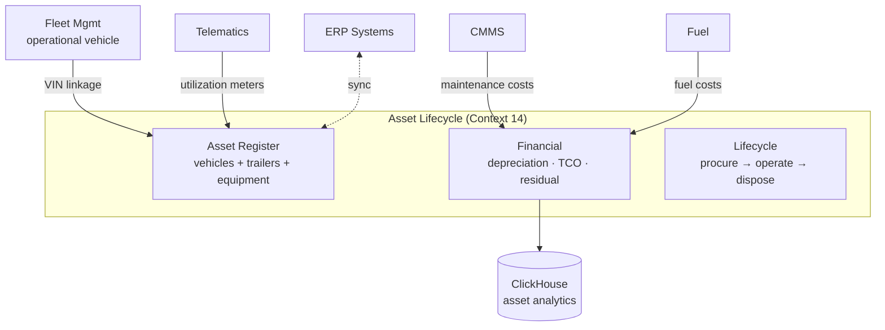
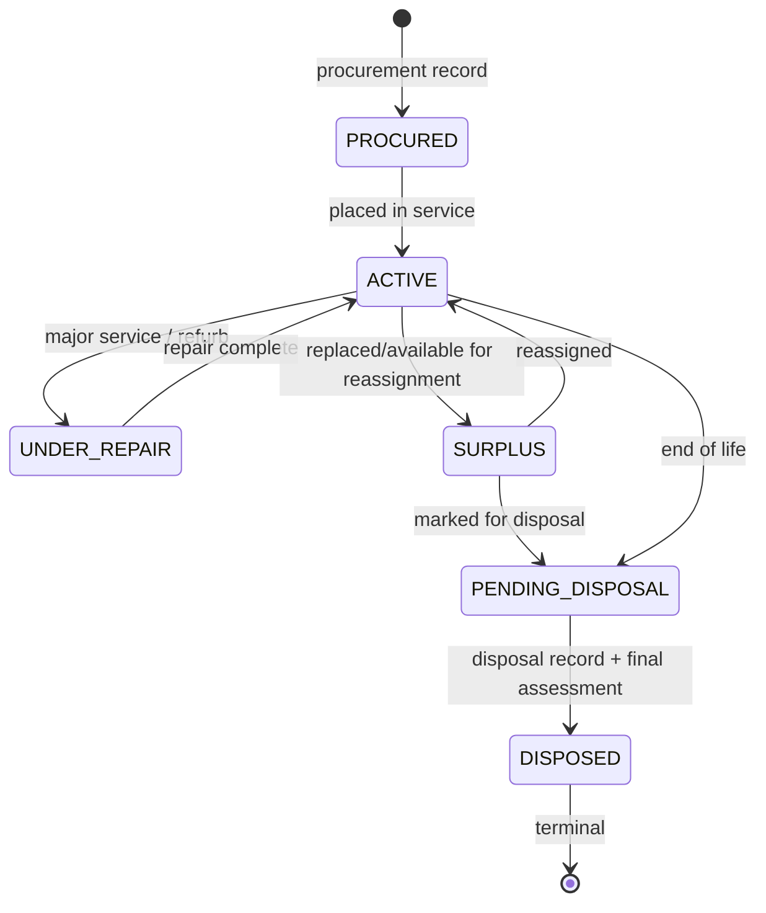
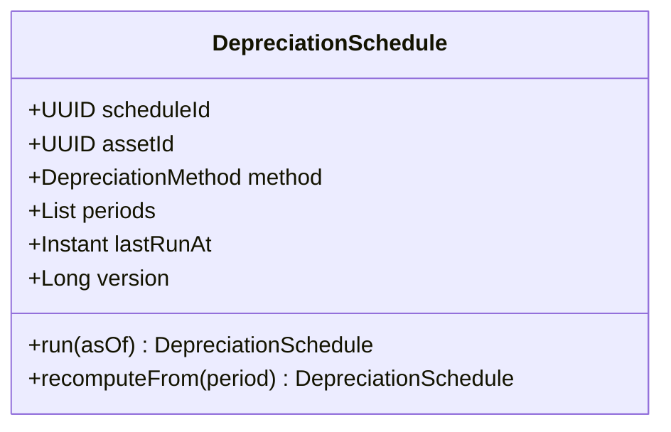
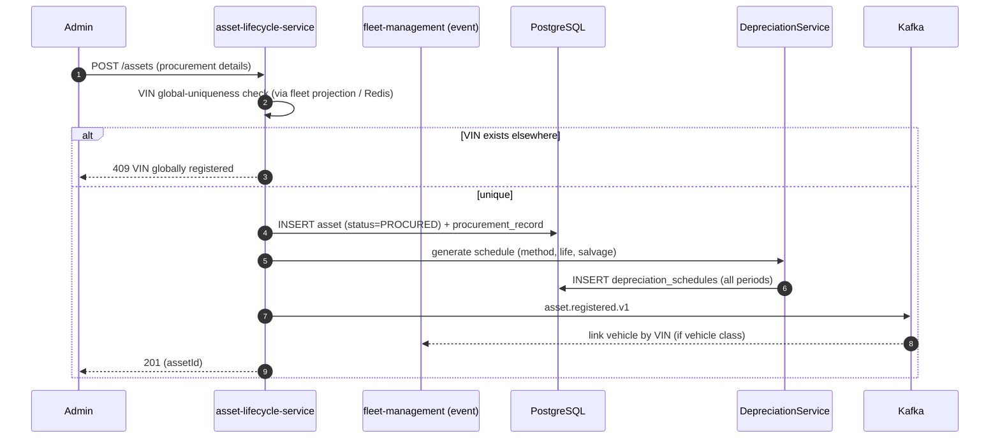
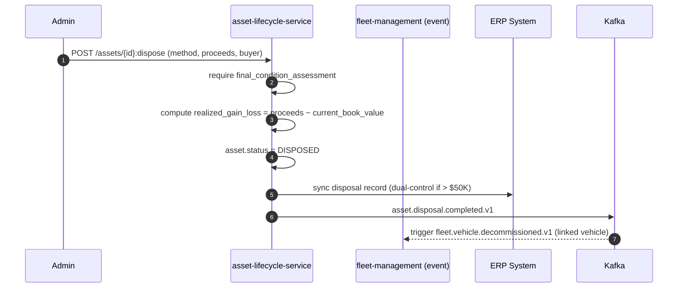
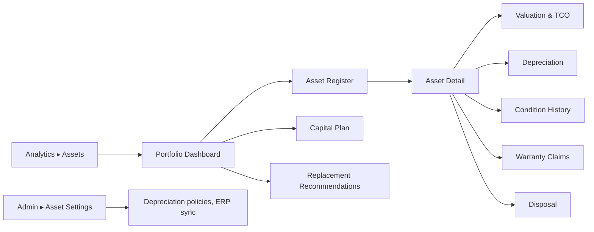

# Asset Management Module
## Module-Level Design Document

**Version:** 2.0.0
**Status:** Approved — Foundation-Aligned
**Date:** 2026-08-02
**Bounded Context:** Asset Lifecycle (Context 14 — `02_Domain_Model.md` §1)
**Service:** `asset-lifecycle-service` (Spring Boot 3.3 + Kotlin 2.0, JVM 21)
**Data Store:** PostgreSQL 16 (`asset` schema) · MongoDB (asset documents: titles, photos, manuals) · Redis (asset-resolution cache) · ClickHouse (TCO analytics)
** Messaging:** Kafka (`fleetvision.asset.*.events`)
**External:** ERP Systems (SAP S/4HANA, Oracle) · Valuation guides (Kelley Blue Book, Ritchie Bros) · Auction platforms · Insurance platforms
**Authorization:** Open Policy Agent (OPA)

> **Relationship to foundation.** This module owns the **Asset Lifecycle bounded context** (`02_Domain_Model.md` §1 Context 14; aggregates `VehicleAsset`, `DepreciationSchedule`, `DisposalRecord`, `ProcurementRecord`). It **supersedes** the v1.0.0 `Modules/Asset-Lifecycle.md` (which was vehicle-depreciation-only). v2.0.0 broadens scope to a full **Asset Management** platform: an enterprise asset register spanning vehicles, trailers, equipment, and infrastructure — with procurement, depreciation, condition tracking, warranty, and disposal. It is the financial/asset counterpart to the operational Fleet Management context (Context 5). Conforms to ADR-002 (Kafka), ADR-006 (Kotlin), ADR-008 (polyglot), ADR-016 (single topic convention). Resolves ARR DDD-2: **VIN globally unique** (cross-tenant) — enforced via the fleet.vehicle.registered event projection.

---

## Table of Contents

1. [Business Analysis](#1-business-analysis)
2. [Domain Model](#2-domain-model)
3. [Database](#3-database)
4. [Entities](#4-entities)
5. [APIs](#5-apis)
6. [Security](#6-security)
7. [Permissions](#7-permissions)
8. [Sequence Diagrams](#8-sequence-diagrams)
9. [UI Flow](#9-ui-flow)
10. [Scalability](#10-scalability)

---

## 1. Business Analysis

### 1.1 Purpose

Fleet operations are, fundamentally, the management of expensive depreciating assets. A 500-vehicle fleet represents **$25M–$75M of capital** tied up in trucks, trailers, and equipment. The Asset Management module is the platform's **financial nervous system for those assets**: it tracks what you own, what it's worth, what it costs to run (TCO), when to replace it, and how to dispose of it — across the full lifecycle from procurement to retirement.

It is the *Intelligence* pillar's financial lens (predictive replacement, TCO optimization) and a *Trust* pillar enabler (defensible book values for audit/finance). Where Fleet Management (Context 5) tracks a vehicle as an **operational unit** (status, assignment, odometer), Asset Management tracks it as a **financial instrument** (book value, depreciation, TCO, residual).

### 1.2 Scope: Asset Classes

The v1.0.0 module was vehicle-only. v2.0.0 supports a **multi-class asset register**:

| Asset Class | Examples | Tracked As |
|---|---|---|
| **Vehicles** | trucks, vans, cars | VehicleAsset (linked to Fleet Vehicle by VIN) |
| **Trailers** | dry vans, reefers, flatbeds | Asset (trailer ID, no power unit) |
| **Equipment** | forklifts, generators, compressors | Asset (with utilization meter) |
| **Infrastructure** | fuel islands, charging stations, yard gates | Asset (fixed location) |
| **Telematics devices** | trackers, dashcams (for capital-asset treatment) | Asset (optional; often expensed) |

### 1.3 Goals & Non-Goals

| Goals | Non-Goals |
|---|---|
| Authoritative asset register across classes | General-purpose fixed-asset accounting (ERP owns) |
| TCO per asset (acquisition + operating + maintenance − residual) | Real-time stock ticker for asset values |
| Depreciation schedules (straight-line, declining, units-of-production) | Vehicle leasing/financing (out of scope per vision) |
| Procurement & disposal workflows | Insurance underwriting (out of scope) |
| Predictive replacement recommendations | Becoming an ERP/accounting system |
| Warranty claim tracking | Driver/asset assignment (Fleet Management owns) |
| Capital plan / budget views | Maintenance execution (CMMS owns) |

### 1.4 Functional Requirements

| ID | Requirement | Priority |
|---|---|---|
| AST-FR-01 | Asset register CRUD across classes | Must |
| AST-FR-02 | Procurement record (acquisition cost, date, vendor, method) | Must |
| AST-FR-03 | Depreciation schedule generation (multiple methods) | Must |
| AST-FR-04 | Book value at any date (mark-to-book) | Must |
| AST-FR-05 | TCO computation (all cost dimensions) | Must |
| AST-FR-06 | Residual / fair-market value integration (KBB, auctions) | Must |
| AST-FR-07 | Replacement recommendation (predictive) | Should |
| AST-FR-08 | Disposal workflow (sale, trade, scrap) with proceeds | Must |
| AST-FR-09 | Warranty claim tracking | Must |
| AST-FR-10 | Asset condition assessment (inspection-driven) | Should |
| AST-FR-11 | Capital plan / budget projections | Should |
| AST-FR-12 | Asset utilization (miles/hours/utilization %) | Must |
| AST-FR-13 | ERP sync (SAP/Oracle) bidirectional | Should |

### 1.5 Non-Functional Requirements

| Attribute | Target |
|---|---|
| Asset portfolio query (10K assets) | < 500ms P99 |
| TCO recompute (1K vehicles) | < 30s |
| Availability | 99.9% (Tier 1 — financial; degraded = stale values, not outage) |
| Depreciation accuracy | Reconciles with ERP to the dollar |

### 1.6 Business Rules

| ID | Rule |
|---|---|
| AST-BR-01 | VIN globally unique (ISO 3779) — cross-tenant (INV-F01 via fleet projection) |
| AST-BR-02 | Lifecycle state machine enforced |
| AST-BR-03 | Depreciation method-specific computation validated |
| AST-BR-04 | Disposal requires final condition assessment |
| AST-BR-05 | Book value = acquisition − accumulated depreciation − impairment |
| AST-BR-06 | TCO = acquisition + operating + maintenance − residual |
| AST-BR-07 | Replacement recommended at 80% of useful life OR when annual cost > new-vehicle lease equiv |
| AST-BR-08 | Warranty claims track to resolution (paid/denied/expired) |

---

## 2. Domain Model

### 2.1 Sub-Domain Position



### 2.2 Aggregates Owned

| Aggregate | ES? | Consistency Boundary |
|---|---|---|
| **Asset** (was VehicleAsset; now multi-class) | No | One asset's identity, class, lifecycle, valuation |
| **DepreciationSchedule** | No | Depreciation computation per asset |
| **ProcurementRecord** | No | Acquisition details |
| **DisposalRecord** | No | Disposal details + proceeds |
| **WarrantyClaim** | No | Warranty lifecycle |

### 2.3 Value Objects

| Value Object | Fields |
|---|---|
| `AssetClass` | enum VEHICLE/TRAILER/EQUIPMENT/INFRASTRUCTURE/DEVICE |
| `LifecycleStage` | enum PROCURED → ACTIVE → UNDER_REPAIR → SURPLUS → PENDING_DISPOSAL → DISPOSED |
| `Acquisition` | method (PURCHASE/LEASE/RENTAL), cost, date, vendor, poNumber |
| `AssetValuation` | bookValue, fairMarketValue, residualValue, asOfDate |
| `DepreciationMethod` | enum STRAIGHT_LINE/DECLINING_BALANCE/UNITS_OF_PRODUCTION/SUM_OF_YEARS |
| `TCO` | acquisition + operating + maintenance − residual, asOfDate |
| `ConditionAssessment` | grade (A–F), inspectedAt, inspector, notes, photos |
| `Utilization` | periodUtilizationPct, milesOrHours, idlePct |

### 2.4 Domain Events

All CloudEvents, Avro, on **`fleetvision.asset.*.events`** (ADR-016), partitioned by `tenant_id` then `assetId`.

| Event | Trigger | Consumers |
|---|---|---|
| `asset.registered.v1` | New asset procured/registered | Fleet Mgmt (link), Audit, Analytics |
| `asset.activated.v1` | Goes into service | Notification (capital plan), Audit |
| `asset.valuation.updated.v1` | Depreciation run / FMV refresh | Analytics, Reporting |
| `asset.mileage.updated.v1` | Utilization meter tick | Maintenance (PM triggers), Analytics |
| `asset.condition.assessed.v1` | Inspection | Maintenance, Analytics |
| `asset.warranty.claim.filed.v1` / `.paid.v1` / `.denied.v1` | Warranty lifecycle | Notification, Finance |
| `asset.replacement.recommended.v1` | Predictive model flags | Notification, Capital plan |
| `asset.surplus.flagged.v1` | Marked for disposal consideration | Capital plan |
| `asset.disposal.initiated.v1` / `.completed.v1` | Disposal workflow | Finance, Audit, Fleet Mgmt (decommission) |
| `asset.retired.v1` | Lifecycle terminal | Audit, Analytics |

> **Note (resolves ARR DDD-2):** the asset registry derives VIN uniqueness from the `fleet.vehicle.registered.v1` projection (Fleet Mgmt sees all tenants' VINs); Asset enforces global VIN uniqueness cross-tenant via this linkage, no contradiction.

### 2.5 Domain Services

| Service | Responsibility |
|---|---|
| `DepreciationService` | Method-specific computation; scheduled runs |
| `TCOCalculator` | Aggregate cost dimensions; recompute on cost event |
| `ValuationService` | FMV refresh from external guides (KBB, auctions) |
| `LifecycleService` | State machine transitions |
| `ReplacementAdvisor` | Predictive replacement (consumes analytics-engine outputs) |
| `ERPSyncService` | Bidirectional sync with SAP/Oracle |

### 2.6 Ubiquitous Language

| Term | Definition |
|---|---|
| Asset | A capital item owned/leased by the tenant (vehicle/trailer/equipment/infra) |
| Asset Class | Category (VEHICLE/TRAILER/EQUIPMENT/INFRASTRUCTURE/DEVICE) |
| Book Value | Acquisition cost − accumulated depreciation − impairment |
| Fair Market Value (FMV) | Current market value (from KBB, auctions) |
| Residual Value | Estimated value at end of useful life |
| Depreciation | Decrease in value over time, per accounting method |
| TCO | Total Cost of Ownership: acquisition + operating + maintenance − residual |
| Useful Life | Expected service period (years or miles) |
| Procurement | Acquiring an asset (purchase/lease/rental) |
| Disposal | Retiring an asset (sale/trade/scrap) |
| Condition Grade | A–F assessment from inspection |
| Capital Plan | Forward budget for replacements/acquisitions |

---

## 3. Database

Schema `asset` in PostgreSQL (registry, schedules, records — system of record); MongoDB (documents); Redis (cache); ClickHouse (TCO analytics).

### 3.1 PostgreSQL Tables

```sql
asset.assets (
  asset_id UUID PK, tenant_id UUID,
  asset_class TEXT NOT NULL,             -- VEHICLE/TRAILER/EQUIPMENT/INFRASTRUCTURE/DEVICE
  vin TEXT,                               -- vehicles only; globally unique (INV-F01 via projection)
  asset_tag TEXT,                         -- internal tag/QR code
  make, model, year TEXT,
  serial_number TEXT,
  description TEXT,
  acquisition JSONB NOT NULL,             -- {method, cost, date, vendor, poNumber}
  status TEXT NOT NULL,                   -- PROCURED/ACTIVE/UNDER_REPAIR/SURPLUS/PENDING_DISPOSAL/DISPOSED
  depreciation_method TEXT,
  useful_life_years INT, useful_life_miles BIGINT,
  salvage_value NUMERIC(19,4),
  current_book_value NUMERIC(19,4),
  current_fmv NUMERIC(19,4),
  linked_vehicle_id UUID,                 -- → fleet.vehicles (if vehicle)
  linked_device_id UUID,                  -- → device (if tracked)
  site_id UUID,                           -- location (non-vehicle)
  condition_grade TEXT,                   -- A–F
  metadata JSONB,
  version BIGINT, created_at, updated_at
)

asset.depreciation_schedules (
  schedule_id UUID PK, tenant_id UUID, asset_id UUID,
  method TEXT NOT NULL,
  periods JSONB NOT NULL,                 -- [{period, depreciation, accumulated, bookValue, asOf}]
  last_run_at TIMESTAMPTZ,
  version BIGINT
)

asset.procurement_records (
  record_id UUID PK, tenant_id UUID, asset_id UUID,
  method TEXT, cost NUMERIC(19,4), acquisition_date DATE,
  vendor TEXT, po_number TEXT, financing JSONB,
  documents JSONB,                        -- title, contract refs (MongoDB ids)
  version BIGINT
)

asset.disposal_records (
  record_id UUID PK, tenant_id UUID, asset_id UUID,
  method TEXT,                            -- SALE/TRADE_IN/SCRAP/DONATION
  disposal_date DATE, proceeds NUMERIC(19,4),
  buyer TEXT, final_condition_assessment JSONB,
  realized_gain_loss NUMERIC(19,4),
  version BIGINT
)

asset.warranty_claims (
  claim_id UUID PK, tenant_id UUID, asset_id UUID,
  warranty_id UUID, filed_at DATE, failure_date DATE,
  description TEXT, cost NUMERIC(19,4),
  status TEXT,                            -- FILED/APPROVED/PAID/DENIED/EXPIRED
  resolution_notes TEXT, version BIGINT
)

asset.condition_assessments (
  assessment_id UUID PK, tenant_id UUID, asset_id UUID,
  grade TEXT, inspected_at TIMESTAMPTZ, inspector UUID,
  notes TEXT, photos JSONB                -- MongoDB refs
) PARTITION BY RANGE (inspected_at)
```

**Indexes:** UNIQUE `(vin)` WHERE vin IS NOT NULL (global, cross-tenant — INV-F01); `(tenant_id, asset_class, status)`; `(linked_vehicle_id)`; `(tenant_id, status) WHERE status IN ('ACTIVE','SURPLUS')`.

### 3.2 ClickHouse (TCO Analytics)

| Table | Grain | Use |
|---|---|---|
| `fact_asset_tco_monthly` | asset × month | TCO trend, cost-per-vehicle |
| `fact_depreciation_monthly` | asset × month | book value over time |
| `fact_disposals` | disposal | realized gain/loss analytics |
| `dim_asset` | asset | registry dimension (slowly-changing) |

### 3.3 Redis Keyspace

| Key | TTL | Purpose |
|---|---|---|
| `asset:<assetId>` | 10 min | Asset-resolution cache |
| `asset:vin:<vin>` | 10 min | VIN → asset lookup (cross-tenant check) |
| `asset:tco:<assetId>` | 1h | TCO cache |

---

## 4. Entities

### 4.1 Asset Aggregate + Lifecycle



**Invariants:** (i) VIN globally unique where present; (ii) state machine transitions enforced; (iii) DISPOSED requires disposal_record + condition assessment; (iv) `current_book_value` reconciles with depreciation schedule.

### 4.2 DepreciationSchedule



### 4.3 TCO Composition

```
TCO(asset, asOf) =
    acquisition.cost
  + Σ(operating costs: fuel, tolls, insurance over [acquisition, asOf])
  + Σ(maintenance costs: labor + parts + vendor over [acquisition, asOf])
  − residualValue(asOf)
  − disposal.proceeds (if disposed)
```

TCO recomputed on each cost event (fuel, maintenance) — incrementally; full recompute nightly into ClickHouse.

---

## 5. APIs

Endpoints under `/api/v1/assets`. REST contracts follow `API_Design.md`.

### 5.1 REST Endpoints

| Method | Endpoint | Description | Permission |
|---|---|---|---|
| `GET` | `/assets` | List assets (filter: class, status, fleet, search) | `asset.vehicle.read` |
| `GET` | `/assets/{id}` | Asset detail + valuation + TCO | `asset.vehicle.read` |
| `POST` | `/assets` | Register new asset (procurement) | `asset.vehicle.manage` |
| `PUT` | `/assets/{id}` | Update asset metadata | `asset.vehicle.manage` |
| `PATCH` | `/assets/{id}/status` | Lifecycle transition | `asset.vehicle.manage` |
| `GET` | `/assets/{id}/depreciation` | Depreciation schedule + periods | `asset.vehicle.read` |
| `POST` | `/assets/{id}/depreciation:run` | Trigger depreciation run | `asset.depreciation.manage` |
| `GET` | `/assets/{id}/tco` | TCO breakdown | `asset.vehicle.read` |
| `GET` | `/assets/{id}/valuation` | Current valuation (book + FMV + residual) | `asset.vehicle.read` |
| `POST` | `/assets/{id}/condition` | Add condition assessment | `asset.vehicle.manage` |
| `GET` | `/assets/{id}/warranties` | List warranty claims | `asset.vehicle.read` |
| `POST` | `/assets/{id}/warranties` | File warranty claim | `asset.vehicle.manage` |
| `PATCH` | `/warranties/{claimId}` | Update claim status | `asset.vehicle.manage` |
| `POST` | `/assets/{id}:dispose` | Initiate disposal | `asset.vehicle.manage` |
| `GET` | `/assets/{id}/disposal` | Disposal record | `asset.vehicle.read` |
| `GET` | `/assets/replacement/recommendations` | Predictive replacement list | `asset.vehicle.read` |
| `GET` | `/assets/capital-plan` | Capital plan / budget projection | `asset.vehicle.read` |
| `GET` | `/assets/portfolio` | Portfolio summary (by class, status) | `asset.vehicle.read` |
| `POST` | `/assets/erp/sync` | Trigger ERP sync | `asset.vehicle.manage` |

### 5.2 Sample — Register Asset

```http
POST /api/v1/assets
Authorization: Bearer <jwt>
Idempotency-Key: 7f2c…

{
  "data": {
    "type": "asset",
    "attributes": {
      "assetClass": "VEHICLE",
      "vin": "1HGCM82633A123456",
      "make": "Freightliner", "model": "Cascadia", "year": 2024,
      "acquisition": { "method": "PURCHASE", "cost": "145000.00", "date": "2026-07-15", "vendor": "Freightliner Dealer" },
      "depreciationMethod": "STRAIGHT_LINE",
      "usefulLifeYears": 7, "salvageValue": "14500.00"
    }
  }
}

201 Created
Location: /api/v1/assets/{assetId}
```

### 5.3 gRPC (Internal)

```protobuf
service AssetService {
  rpc GetAsset        (GetAssetRequest)     returns (AssetInfo);
  rpc ResolveByVin    (VinRequest)          returns (AssetInfo);   // global uniqueness check
  rpc GetTCO          (TcoRequest)          returns (TcoBreakdown);
  rpc GetValuation    (ValuationRequest)    returns (Valuation);
  rpc RecordCost      (CostEvent)           returns (Ack);         // from fuel/maintenance
  rpc CheckReplacement(ReplacementRequest)  returns (Recommendation);
}
```

---

## 6. Security

### 6.1 Tenant Isolation

All assets `tenant_id`-scoped (INV-I01). VIN uniqueness is **cross-tenant by design** (ISO 3779 mandates global uniqueness) — `ResolveByVin` returns global-existence info but asset detail is tenant-scoped; cross-tenant VIN collision is logged + blocked (resolves ARR DDD-2).

### 6.2 Financial Integrity

Book values, depreciation, TCO are **finance-grade**: every recomputation is idempotent, versioned, audit-logged. Disposals compute realized gain/loss and are immutable once recorded. Reconciliation with ERP is a periodic batch job; mismatches alert finance.

### 6.3 ERP Sync Security

ERP integration (SAP/Oracle) uses mutual TLS + signed payloads; credentials in Vault. Sync is bidirectional but write-back to ERP requires dual-control for high-value disposals (> $50K).

### 6.4 Valuation Source Integrity

External valuation feeds (KBB, Ritchie Bros auctions) verified against expected ranges; outlier FMV drops flagged for review before application.

---

## 7. Permissions

Canonical from `02_Domain_Model.md` §6 — not redefined.

| Permission | Used For |
|---|---|
| `asset.vehicle.read` | List/view assets, valuations, TCO, portfolio |
| `asset.vehicle.manage` | CRUD assets, lifecycle, warranty, disposal, ERP sync |
| `asset.depreciation.manage` | Depreciation runs, method changes |

Role mapping: `finance` role gets full access; `tenant-admin`/`fleet-admin` get `.read` + `.manage` (not depreciation method changes); `executive` gets `.read` on portfolio/capital-plan.

---

## 8. Sequence Diagrams

### 8.1 Procurement → Registration → Depreciation



### 8.2 TCO Recompute on Maintenance Cost Event

```mermaid
sequenceDiagram
    autonumber
    participant MAINT as CMMS
    participant K as Kafka
    participant AS as asset-lifecycle-service
    participant CH as ClickHouse
    participant DB as PostgreSQL

    MAINT->>K: maintenance.workorder.completed.v1 (parts+labor cost)
    K-->>AS: consume
    AS->>CH: append fact_asset_tco_monthly (maintenance cost)
    AS->>AS: incremental TCO recompute
    AS->>DB: asset.current_book_value (no change); TCO cache invalidate
```

### 8.3 Disposal Workflow



### 8.4 Predictive Replacement

```mermaid
sequenceDiagram
    autonumber
    participant AE as analytics-engine
    participant AS as asset-lifecycle-service
    participant K as Kafka
    participant NT as notification

    AE->>AE: model evaluates (age, mileage, TCO trend, maintenance cost rate)
    alt replacement warranted (e.g., annual cost > threshold)
        AE->>K: analytics.prediction.replacement.v1 (or internal)
        K-->>AS: consume
        AS->>AS: validate; enrich with FMV + estimated replacement cost
        AS->>K: asset.replacement.recommended.v1
        K-->>NT: notify capital plan reviewers
    end
```

---

## 9. UI Flow

### 9.1 Surface Map



### 9.2 Portfolio Dashboard

Executive/finance view: asset count by class, total book value, TCO trend, age distribution, replacement forecast (next 12 months capital need). Drives capital planning conversations.

### 9.3 Asset Register

Filterable table (class, status, fleet, age, book value, TCO). Click → drawer with full lifecycle: procurement details, depreciation schedule (chart: book value over time), TCO breakdown (cost dimensions), condition history, warranty claims, linked vehicle/device.

### 9.4 Capital Plan

Forward view: assets projected for replacement by month/quarter, estimated replacement cost, budget impact. "What-if" scenarios (extend life 1 year → $X saved).

### 9.5 Disposal Workflow

Guided: select asset → method (sale/trade/scrap) → final condition assessment → buyer + proceeds → realized gain/loss preview → confirm (dual-control if high-value) → ERP sync.

---

## 10. Scalability

### 10.1 Load Profile

| Path | Year 1 | Year 5 |
|---|---|---|
| Assets per tenant | ~1,000 | ~50,000 |
| Asset register query | < 500ms / 10K | < 500ms / 50K |
| TCO recompute batch (nightly) | minutes | ~30 min / 1M assets |
| ERP sync (batch) | hourly | hourly |

### 10.2 Scaling Mechanisms

| Component | Mechanism | Trigger |
|---|---|---|
| `asset-lifecycle-service` | HPA on RPS + CPU | CPU > 70% |
| Depreciation runs | Batch (nightly); partitioned by tenant | scheduled |
| TCO recompute | Incremental (on event) + nightly full (ClickHouse) | — |
| PostgreSQL | Read replicas + PgBouncer | read QPS |

### 10.3 Batch vs Real-Time

- **Real-time:** asset CRUD, valuation queries, condition assessment, disposal init.
- **Batch:** depreciation runs (nightly per tenant), full TCO recompute (nightly into ClickHouse), ERP sync (hourly), FMV refresh from external guides (weekly).

### 10.4 Failure Modes

| Failure | Response |
|---|---|
| Pod crash | K8s reschedule; depreciation/TCO batches checkpointed |
| ERP sync fail | Retry queue; mismatches alert finance; never silent |
| KBB/auction feed down | Use last-known-good FMV; flag stale; alert |
| ClickHouse slow | TCO queries degrade to PostgreSQL snapshot; alert |

### 10.5 Capacity Headroom

2× headroom (vision guardrail); portfolio queries load-tested at 10× projected; depreciation batch tested at 1M assets.

---

## Appendix A: Event Catalog

| Event | Topic |
|---|---|
| `asset.registered.v1` / `.activated.v1` | `fleetvision.asset.events` |
| `asset.valuation.updated.v1` | `fleetvision.asset.events` |
| `asset.mileage.updated.v1` | `fleetvision.asset.events` |
| `asset.condition.assessed.v1` | `fleetvision.asset.events` |
| `asset.warranty.claim.filed/paid/denied.v1` | `fleetvision.asset.events` |
| `asset.replacement.recommended.v1` | `fleetvision.asset.events` |
| `asset.surplus.flagged.v1` | `fleetvision.asset.events` |
| `asset.disposal.initiated.v1` / `.completed.v1` | `fleetvision.asset.events` |
| `asset.retired.v1` | `fleetvision.asset.events` |

## Appendix B: Traceability

| Foundation Element | This Module |
|---|---|
| `00` Intelligence pillar (TCO, predictive replacement) | §1.1 |
| `00` Trust pillar (defensible book values, ERP reconciliation) | §6.2 |
| `01` §3 Service Registry #18 (asset-lifecycle-service) | §1 header |
| `01` §6 Single topic convention (ADR-016) | Appendix A |
| `02` §1 Context 14 (Asset Lifecycle) | §2.1 |
| `02` §3.2 VehicleAsset, DepreciationSchedule, DisposalRecord, ProcurementRecord | §2.2, §4 |
| `02` §6 Permission catalog (`asset.*`) | §7 |
| `02` §8 INV-F01 (VIN global uniqueness), INV-ASSET01 | §3.1, §6.1 |
| ARR DDD-2 (VIN uniqueness contradiction) | Resolved (§3.1, §6.1) |
| ADR-002, ADR-006, ADR-008, ADR-016 | Throughout |

---

*This Asset Management module supersedes `Modules/Asset-Lifecycle.md` (v1.0.0, vehicle-depreciation-only) and owns the Asset Lifecycle bounded context. Consistent with the v2.0.0 foundation.*
