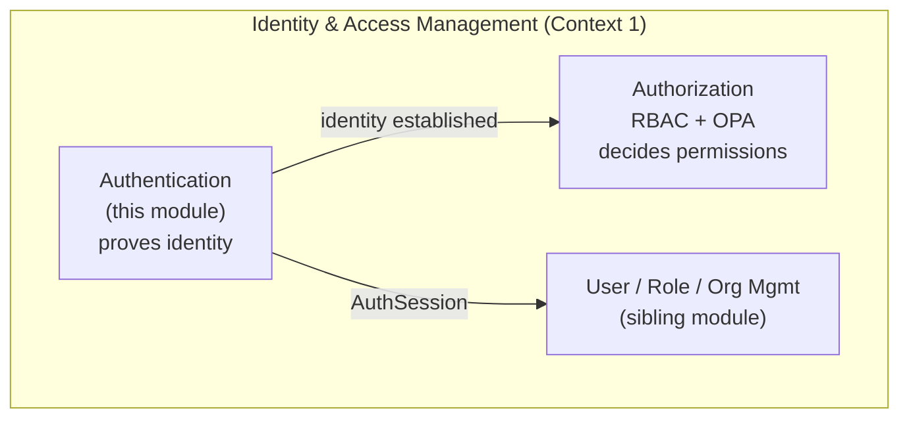
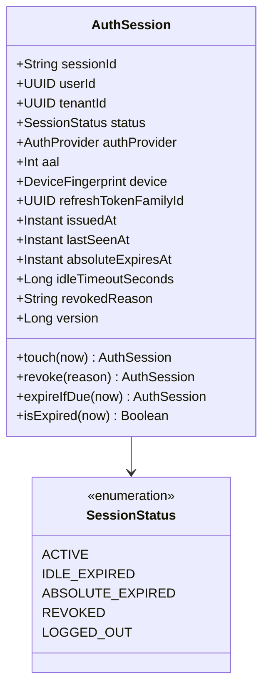
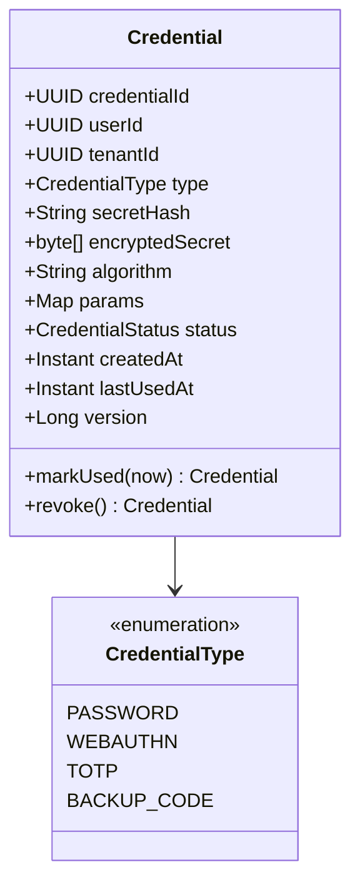
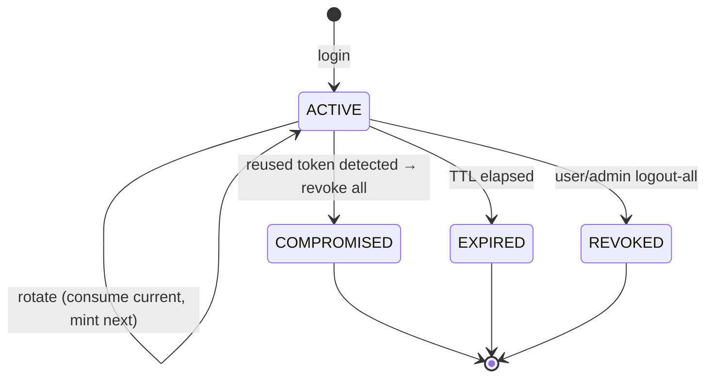
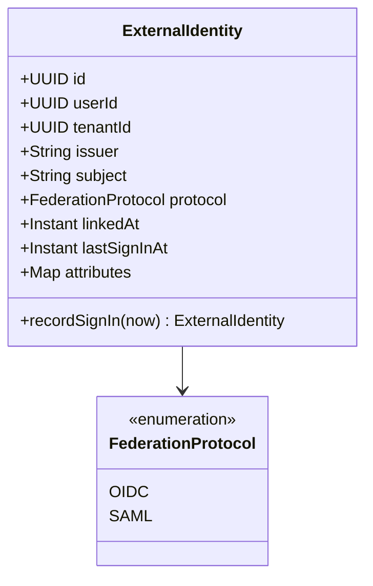
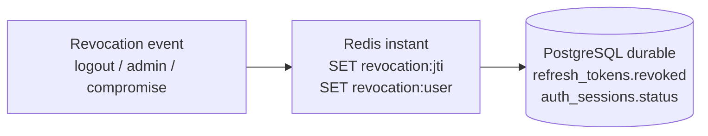
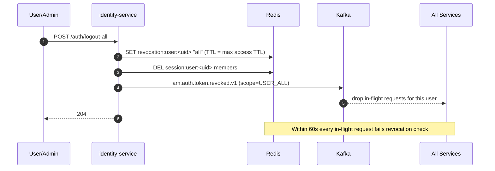
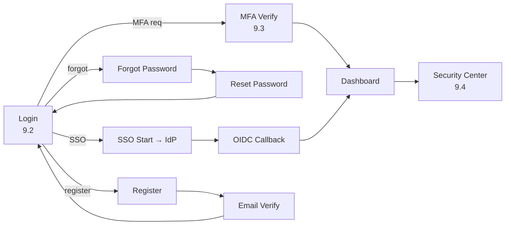

# Authentication Module
## Module-Level Design Document

**Version:** 2.0.0
**Status:** Approved — Foundation-Aligned
**Date:** 2026-08-02
**Bounded Context:** Identity & Access Management (Authentication Sub-Domain)
**Service:** `identity-service` (Spring Boot 3.3 + Kotlin 2.0, JVM 21)
**Data Store:** PostgreSQL 16 (`identity` schema) · Redis 7 (sessions, revocation, rate limits)
**Identity Provider:** Keycloak 24 (OIDC + SAML 2.0)
**Authorization:** Open Policy Agent (OPA)
**Messaging:** Kafka (`fleetvision.iam.auth.events`)

> **Relationship to foundation.** This module is the deep-dive on **authentication** within the Identity & Access Management context (`02_Domain_Model.md` §1, Context 1). It owns the aggregates `AuthSession`, `Credential`, and `ExternalIdentity` (canonical per `02_Domain_Model.md` §3.2), and is the authoritative emitter of the `iam.auth.*` event family on topic `fleetvision.iam.auth.events`. It conforms to ADR-001 (CQRS+ES for `AuthSession` snapshots), ADR-002 (Kafka), ADR-006 (Kotlin/Spring), ADR-009 (Keycloak+OPA), ADR-015 (Socket.IO canonical real-time transport). The sibling `Modules/Identity-Access-Management.md` owns users, roles, organizations, API keys; this module owns **how a principal proves who they are**. Where they overlap, this document is authoritative for auth mechanics.

---

## Table of Contents

1. [Business Analysis](#1-business-analysis)
2. [Domain Model](#2-domain-model)
3. [Database](#3-database)
4. [Entities](#4-entities)
5. [APIs](#5-apis)
6. [Security](#6-security)
7. [Permissions](#7-permissions)
8. [Sequence Diagrams](#8-sequence-diagrams)
9. [UI Flow](#9-ui-flow)
10. [Scalability](#10-scalalability)

---

## 1. Business Analysis

### 1.1 Purpose

Authentication is the **trust gate** of FleetVision — it establishes *who* a caller is before any business operation is permitted. Every non-public API request, every WebSocket connection, every device telemetry publish, and every service-to-service call passes through an authentication decision. Authentication is the foundation of the *Trust* pillar (`00_Project_Vision.md` §2) and a hard prerequisite for the multi-tenant isolation guarantee (`01_Master_Architecture.md` §8 — INV-I01, INV-I02).

### 1.2 Business Goals & Success Criteria

| Goal | Success Criterion | Vision Link |
|---|---|---|
| Only legitimate users access fleet data | < 0.001% unauthorized access attempts succeed (pen-test verified) | Trust |
| Login is fast and frictionless | Login P99 < 800ms (local), < 1500ms (SSO); token validation P99 < 30ms | Simplicity |
| Enterprise SSO works for every customer | 100% of Enterprise tenants onboarded via SSO within 1 week | Trust, Scale |
| Compromised credentials are contained | Mean time to revoke a session globally < 60s | Trust |
| Drivers adopt the mobile app | < 5% login-related support tickets; biometric quick-login | Simplicity |
| Compliance auditors satisfied | SOC 2 / ISO 27001 / FMCSA controls evidenced end-to-end | Trust |

### 1.3 Stakeholders & Personas

| Persona | Surface | Authentication Need |
|---|---|---|
| Dispatcher / Fleet Manager (Web) | Web Dashboard | Daily password or SSO; remembers device; MFA optional |
| Fleet / Tenant Admin (Admin Portal) | Admin Portal | Mandatory MFA; manages users' access |
| Driver (Mobile) | Driver App | Frictionless: PIN/biometric after initial login; offline-tolerant HOS |
| Executive (Web) | Web Dashboard | SSO via corporate IdP; high-security posture |
| Tenant Admin (Admin Portal) | Admin Portal | Configures SSO, MFA policy, password policy |
| 3rd-Party Developer (API) | REST API | API key + OAuth2 client-credentials; rate-limited |
| Platform Service (internal) | gRPC mesh | mTLS + SPIFFE identity; no human credentials |
| Auditor | Audit Log | Read-only access to auth logs; evidence of MFA, session lifecycles |
| Telematics Device | MQTT/TCP | X.509 mTLS (owned by DeviceGateway; not this module) |

### 1.4 Authenticator Factors (NIST 800-63B)

FleetVision targets **AAL2** (two-factor) for admin roles and **AAL1** (single factor + risk signals) for low-privilege operators, with upgrade paths.

| Factor | Type | Used By |
|---|---|---|
| Password (memorized secret, Argon2id) | Something you know | All human users (local auth) |
| TOTP (RFC 6238, Google/Microsoft Authenticator) | Something you have | MFA — admins; optional for operators |
| WebAuthn / FIDO2 security key / passkey | Something you have | Enterprise admins (phishing-resistant) |
| Biometric (local device unlock) | Something you are | Driver mobile app (unlocks stored token) |
| SMS / Email OTP | Something you have | Backup factor only (weaker — discouraged) |
| Backup codes | Something you have | Recovery when primary MFA lost |
| X.509 certificate | Something you have | Devices + service-to-service |
| Bearer token (JWT, RS256) | Possession proof | Post-authentication API access (short-lived) |

### 1.5 Functional Requirements

| ID | Requirement | Priority |
|---|---|---|
| AUTH-FR-01 | Register / login with email + password | Must |
| AUTH-FR-02 | Enable / disable TOTP MFA | Must |
| AUTH-FR-03 | Register WebAuthn / passkey | Should |
| AUTH-FR-04 | Admin can enforce MFA policy per tenant/role | Must |
| AUTH-FR-05 | Enterprise tenant federates via SAML 2.0 / OIDC | Must (Enterprise tier) |
| AUTH-FR-06 | Self-service password reset via email | Must |
| AUTH-FR-07 | Self-service account unlock | Should |
| AUTH-FR-08 | View / revoke active sessions | Must |
| AUTH-FR-09 | Admin can forcibly revoke any user session | Must |
| AUTH-FR-10 | Mobile app supports biometric quick-login | Should |
| AUTH-FR-11 | "Remember this device" (trusted device) | Should |
| AUTH-FR-12 | API clients authenticate via OAuth2 client-credentials or API keys | Must |
| AUTH-FR-13 | All authentication events audited and immutable | Must |
| AUTH-FR-14 | Automatic token refresh (sliding session) | Must |
| AUTH-FR-15 | Idle timeout requires re-authentication | Must |
| AUTH-FR-16 | Login screen i18n + WCAG 2.1 AA | Must |

### 1.6 Non-Functional Requirements

| Attribute | Target |
|---|---|
| Login latency (P99) | < 800ms (local), < 1500ms (SSO round-trip) |
| Token validation (P99) | < 30ms (local signature + Redis revocation check) |
| Availability | 99.99% (Tier-0 — auth outage = total outage) |
| Throughput | 10,000 token validations/sec (gRPC); 500 logins/sec |
| Fail-open behavior | **Never** — auth fails closed (deny by default) |
| Auditability | 100% of auth events logged, retained per regulation |
| Compliance | SOC 2, ISO 27001, GDPR, FMCSA ELD, PCI DSS (scoped) |

### 1.7 Business Rules

| ID | Rule | Enforcement |
|---|---|---|
| AUTH-BR-01 | Password ≥ 12 chars, mixed case, digit, symbol; not in breach corpus | Validated on set/reset |
| AUTH-BR-02 | Password history of 5; cannot reuse | `password_history` |
| AUTH-BR-03 | Max 5 failed attempts → 15-min lockout; progressive backoff | `AuthSession` / User behavior |
| AUTH-BR-04 | Access token TTL 15 min; refresh TTL 7 days (sliding, rotated) | JWT config + refresh rotation |
| AUTH-BR-05 | Idle timeout 30 min (web) / 8 h (mobile trusted device) | Session TTL + sliding window |
| AUTH-BR-06 | MFA mandatory for `tenant-admin`, `compliance-officer`, `billing` | Role-policy enforced at login |
| AUTH-BR-07 | SSO users cannot set/reset a local password | Auth-provider invariant |
| AUTH-BR-08 | Refresh token rotated on every use; old token revoked | Refresh rotation |
| AUTH-BR-09 | Password reset token expires in 30 minutes; one-time use | `password_reset_tokens` TTL |
| AUTH-BR-10 | Suspended/deactivated tenant → all sessions revoked, logins blocked | `billing.tenant.suspended.v1` consumer |
| AUTH-BR-11 | A revoked/compromised token unusable within 60s globally | Redis revocation list + short access TTL |
| AUTH-BR-12 | Cross-tenant login impossible (tenant derived from IdP realm/JWT, never user input) | INV-I02 enforcement |

---

## 2. Domain Model

### 2.1 Sub-Domain Position

Authentication is a **Supporting Sub-Domain** within the Identity & Access Management context — Core-Domain-adjacent. Customers don't buy fleet software *because* of auth, but its failure is existential; it is therefore implemented with Core-Domain rigor and tested exhaustively.



> **Boundary clarification.** Authorization (RBAC, permissions, OPA policy evaluation) is the *sibling* of authentication within IAM. Permissions are catalogued once, canonically, in `02_Domain_Model.md` §6; this module references them (§7) but does not redefine them.

### 2.2 Aggregates Owned

Per `02_Domain_Model.md` §3.2, this module owns three aggregates. The `User` aggregate (sibling module) holds auth-relevant state (`passwordHash`, `mfaEnabled`, `status`, `failedLoginAttempts`, `lockoutUntil`, `lastLoginAt`) modified via Authentication use cases.

| Aggregate | ES? | Consistency Boundary |
|---|---|---|
| **AuthSession** | Snapshot projection | One login session: tokens, device, lifetime |
| **Credential** | No | A user's verifiable secret (password hash, WebAuthn public key) |
| **ExternalIdentity** | No | Linkage between a FleetVision user and an external IdP subject |

### 2.3 Value Objects

| Value Object | Fields | Validation |
|---|---|---|
| `Email` | `value: String` | RFC 5322; lowercased |
| `PasswordHash` | `hash`, `algorithm`, `params` | Argon2id only |
| `JWT` | `raw`, `header`, `claims` | Signature verified before construction |
| `RefreshToken` | `value: String` (≥256-bit entropy) | Cryptographically random; hashed at rest |
| `TOTPSecret` | `value` (Base32, 160-bit) | Encrypted at rest (envelope) |
| `WebAuthnCredential` | `credentialId`, `publicKey`, `signCount`, `aaguid` | COSE key |
| `MfaCode` | `value` | 6 digits, TOTP window ±1 |
| `DeviceFingerprint` | `userAgent`, `ipHash`, `platform`, `trusted` | Risk signal |
| `Scope` | `value` | Dot-notation, hierarchical |

### 2.4 Domain Events

All events follow the CloudEvents envelope (`01_Master_Architecture.md` §6.2), Avro-encoded, on **`fleetvision.iam.auth.events`** (ADR-016 naming), partitioned by `userId`.

| Event | Trigger | Key Consumers |
|---|---|---|
| `iam.auth.login.succeeded.v1` | Valid login, tokens issued | Audit, Analytics, Notification (new-device) |
| `iam.auth.login.failed.v1` | Failed login attempt | Audit, Notification, SIEM |
| `iam.auth.logout.v1` | User-initiated logout | Audit, Session cleanup |
| `iam.auth.token.refreshed.v1` | Refresh token exchanged | Audit |
| `iam.auth.token.revoked.v1` | Token/session revoked | All services (drop in-flight), Audit |
| `iam.auth.mfa.enrolled.v1` / `.removed.v1` | MFA factor changed | Audit, Notification |
| `iam.auth.password.changed.v1` | Password reset/changed | Audit, Notification, session-revoke-others |
| `iam.auth.session.suspicious.v1` | Impossible-travel / new-device risk | Notification, Audit, step-up |
| `iam.auth.account.locked.v1` / `.unlocked.v1` | Brute-force lockout cycle | Audit, Notification |

### 2.5 Domain Services

| Service | Responsibility |
|---|---|
| `AuthenticationService` | Orchestrates login: verify credential → check MFA → issue tokens → start session |
| `TokenService` | Mints, signs, validates, revokes JWTs; manages refresh families |
| `FederationService` | Handles OIDC/SAML flows, IdP discovery, account linking |
| `MfaService` | TOTP/WebAuthn enrollment, challenge, verification; backup codes |
| `PasswordService` | Hash/verify (Argon2id), policy validation, breach check, reset tokens |
| `SessionService` | Create/get/revoke sessions; idle/absolute timeout; revocation list |
| `RiskEvaluationService` | Score login context (IP reputation, impossible travel, new device) → step-up |

### 2.6 Ubiquitous Language (Auth-Specific)

| Term | Definition |
|---|---|
| Authentication (AuthN) | Establishing a principal's identity |
| Authorization (AuthZ) | Deciding what an authenticated principal may do |
| Principal | The entity being authenticated (user, service, device) |
| Credential | A secret or proof used to authenticate |
| AuthSession | The period during which a principal's authentication is valid |
| Access Token | Short-lived JWT representing an authenticated session |
| Refresh Token | Longer-lived opaque token to obtain new access tokens |
| IdP | External Identity Provider (Keycloak, Okta, Azure AD) |
| Relying Party (RP) | FleetVision, relying on an IdP's assertion |
| Federation | Trust delegation to an external IdP |
| SSO | Single Sign-On — one login across applications |
| AAL | Authenticator Assurance Level (NIST 800-63B tier 1/2/3) |
| Step-Up | Re-challenging for a stronger factor before a sensitive action |
| Claim | Identity info asserted in a token (`email`, `roles`) |
| JWKS | JSON Web Key Set — public keys for signature verification |

---

## 3. Database

The auth hot path is **Redis-first** (sessions, revocation, rate limits); PostgreSQL is the durable system of record for credentials, sessions (forensics), and audit. Schema `identity`; RLS on tenant-owned tables (Standard tier).

### 3.1 Store Usage

| Store | Role |
|---|---|
| **PostgreSQL** (`identity`) | Credentials, MFA enrollments, password history, refresh families, sessions (forensic mirror), auth events (audit) |
| **Redis** | Active session data (hot path), revocation list, rate-limit counters, JWKS cache, lockout state |
| **Vault** | Argon2id password hashing (Transit), token-signing RSA private keys (never leave) |
| **Keycloak** | Federation IdP; federated user store for Enterprise SSO |

### 3.2 PostgreSQL Tables

```sql
-- Verifiable secrets (one password + N WebAuthn/TOTP factors per user)
identity.credentials (
  credential_id UUID PK, tenant_id UUID, user_id UUID,
  type TEXT CHECK in (PASSWORD, WEBAUTHN, TOTP, BACKUP_CODE),
  secret_hash TEXT,                       -- Argon2id (password) / SHA-256 (backup)
  encrypted_secret BYTEA,                 -- envelope (TOTP secret, WebAuthn COSE key)
  algorithm TEXT, params JSONB,
  status TEXT, created_at, last_used_at, version BIGINT
)

-- MFA factor inventory per user
identity.mfa_enrollments (
  enrollment_id UUID PK, tenant_id UUID, user_id UUID,
  method TEXT, secret_encrypted BYTEA, backup_codes_hash JSONB,
  name TEXT, status TEXT, enrolled_at, last_used_at, version BIGINT
)

identity.password_history (user_id, tenant_id, password_hash, changed_at)

identity.password_reset_tokens (
  token_hash TEXT PK, tenant_id, user_id, expires_at, consumed_at  -- 30-min TTL
) PARTITION BY RANGE (expires_at)

-- Refresh-token rotation chain (reuse detection unit)
identity.refresh_token_families (
  family_id UUID PK, tenant_id, user_id, session_id, status, created_at
)
identity.refresh_tokens (
  jti TEXT PK, family_id UUID FK, token_hash TEXT UNIQUE,
  issued_at, expires_at, consumed_at, revoked_at, revoked_reason
) PARTITION BY RANGE (expires_at)

-- Forensic mirror of Redis sessions (live reads are Redis; this is the audit record)
identity.auth_sessions (
  session_id TEXT PK, tenant_id, user_id, status, auth_provider, aal SMALLINT,
  device_fingerprint JSONB, ip_address INET, refresh_token_family_id UUID,
  issued_at, last_seen_at, absolute_expires_at, idle_timeout_seconds BIGINT,
  revoked_reason TEXT, version BIGINT
) PARTITION BY RANGE (issued_at)

-- Append-only auth audit (CDC-mirrored to ClickHouse)
identity.auth_events (
  event_id UUID PK, tenant_id, user_id, event_type, outcome,
  auth_provider, ip_address INET, user_agent TEXT, risk_score REAL,
  metadata JSONB, occurred_at TIMESTAMPTZ DEFAULT now()
) PARTITION BY RANGE (occurred_at)
```

**Partitioning** (per `03_Database_Architecture.md` §8): `password_reset_tokens`, `refresh_tokens`, `auth_sessions`, `auth_events` are monthly range-partitioned for fast retention purge. **Indexes:** `(user_id)` on credentials; partial unique `(user_id) WHERE type='PASSWORD' AND status='ACTIVE'`; `(user_id, occurred_at DESC)` and BRIN on `occurred_at` for auth_events; UNIQUE `(issuer, subject)` on external identities.

### 3.3 Redis Keyspace

| Key | Type | TTL | Purpose |
|---|---|---|---|
| `session:<id>` | Hash | idle timeout | Active session (fast read every request) |
| `session:user:<uid>` | Set | absolute expiry | User's session index (logout-everywhere) |
| `revocation:<jti>` | String | remaining access TTL | Token-level revocation |
| `revocation:user:<uid>` | String "all" | short | User-wide revocation |
| `refresh:<hash>` | String | refresh TTL | Mirrors PG family state (fast reuse check) |
| `ratelimit:login:ip:<ip>` | Counter | 60s | Per-IP login throttle |
| `ratelimit:login:user:<uid>` | Counter | 60s | Per-user throttle |
| `jwks:<issuer>` | String (JSON) | 15 min | Cached IdP / own JWKS |
| `lockout:<uid>` | String | lockout TTL | Fast lockout check |
| `failedlogin:<uid>` | Counter | 15 min | Failed-attempt counter |

---

## 4. Entities

Aggregate designs (Kotlin-shaped, illustrative — not implementation). The `User` aggregate (sibling module) holds auth state; auth behaviors are invoked on it.

### 4.1 AuthSession Aggregate



**Invariants:** (i) `id` opaque, ≥256-bit entropy; (ii) `idleTimeoutSeconds ≤ absoluteExpiresAt − issuedAt`; (iii) status transitions `ACTIVE → {IDLE_EXPIRED | ABSOLUTE_EXPIRED | REVOKED | LOGGED_OUT}` (terminal); (iv) `aal ≥ 1`; `aal = 2` requires recorded MFA verification.

### 4.2 Credential Aggregate



**Invariants:** (i) at most one `PASSWORD` credential per user; (ii) `secretHash` non-empty for PASSWORD/BACKUP_CODE; (iii) `encryptedSecret` envelope-encrypted (Vault KEK) for TOTP/WebAuthn.

### 4.3 RefreshTokenFamily Aggregate

A **family** is the chain of refresh tokens from one login. Reuse of an already-rotated token within a family is the canonical theft signal → family-wide revocation.



**Invariants:** (i) at most one unconsumed token in an `ACTIVE` family; (ii) reuse of any consumed token → status `COMPROMISED` → revoke all in family; (iii) family dies with its session.

### 4.4 ExternalIdentity Aggregate



**Invariants:** (i) `(issuer, subject)` globally unique — one FleetVision user per external identity; (ii) `issuer` must be a tenant-approved IdP.

### 4.5 Relationship to the User Aggregate

Authentication use cases load `User` + its `Credential`s + active `AuthSession`s within one transactional boundary to enforce invariants atomically. Relevant User behaviors:

| Behavior | Effect |
|---|---|
| `recordFailedLogin(maxAttempts, lockoutDuration)` | Increments; may set LOCKED |
| `recordSuccessfulLogin()` | Resets counters; sets `lastLoginAt` |
| `lockoutIfExpired(now)` | Auto-unlock after expiry |

---

## 5. APIs

All auth endpoints under **`/api/v1/auth`** (resolves ARR API-1: clean separation from `/api/v1/iam` user-management). Public endpoints (login, register, forgot-password) are not behind a bearer token. REST contracts follow `API_Design.md` (JSON:API envelope, cursor pagination, idempotency).

### 5.1 REST Endpoints

| Method | Endpoint | Description | Auth | Rate Limit |
|---|---|---|---|---|
| `POST` | `/auth/login` | Local login (email + password + optional MFA) | Public | 10/min per IP, 5/min per user |
| `POST` | `/auth/login/mfa` | Complete login after MFA challenge | Temp MFA token | 5/min |
| `POST` | `/auth/refresh` | Exchange refresh token for new access token | Refresh token | 30/min per user |
| `POST` | `/auth/logout` | Revoke current session + refresh family | Bearer JWT | — |
| `POST` | `/auth/logout-all` | Revoke all sessions for the user | Bearer JWT | — |
| `POST` | `/auth/register` | Self-service registration (if tenant allows) | Public | 5/min per IP |
| `POST` | `/auth/forgot-password` | Send password reset email | Public | 3/hour per email |
| `POST` | `/auth/reset-password` | Reset password with token | Reset token | 5/hour |
| `POST` | `/auth/change-password` | Change password when authenticated | Bearer JWT | 5/min |
| `GET` | `/auth/sessions` | List current user's active sessions | Bearer JWT | — |
| `DELETE` | `/auth/sessions/{id}` | Revoke a specific session | Bearer JWT | — |
| `GET` | `/auth/me` | Current principal profile + claims | Bearer JWT | — |
| `POST` | `/auth/verify-token` | Introspect a token (resource servers) | mTLS (service) | — |
| `GET` | `/auth/.well-known/jwks.json` | Public signing keys (JWKS) | Public | — |
| `GET` | `/auth/.well-known/openid-configuration` | OIDC discovery | Public | — |
| `POST` | `/auth/mfa/enroll/totp` | Start TOTP enrollment | Bearer JWT | — |
| `POST` | `/auth/mfa/confirm/totp` | Verify code, activate TOTP | Bearer JWT | 5/min |
| `POST` | `/auth/mfa/enroll/webauthn` | Start WebAuthn registration | Bearer JWT | — |
| `POST` | `/auth/mfa/confirm/webauthn` | Verify attestation, activate | Bearer JWT | — |
| `GET` | `/auth/mfa` | List enrolled MFA factors | Bearer JWT | — |
| `DELETE` | `/auth/mfa/{id}` | Remove MFA factor | Bearer JWT | — |
| `GET` | `/auth/mfa/backup-codes` | Generate/view backup codes (one-time display) | Bearer JWT + step-up | — |
| `POST` | `/auth/sso/oidc/{tenant}/start` | Begin OIDC login (redirect to IdP) | Public | — |
| `GET` | `/auth/sso/oidc/callback` | OIDC authorization-code callback | Public (state + PKCE) | — |
| `POST` | `/auth/sso/saml/{tenant}` | SAML ACS endpoint | Public (signed assertion) | — |
| `POST` | `/auth/oauth/token` | OAuth2 token endpoint (RFC 6749) | client auth | — |
| `POST` | `/auth/oauth/revoke` | Revoke OAuth2 token (RFC 7009) | client auth | — |
| `POST` | `/auth/oauth/introspect` | Token introspection (RFC 7662) | client auth | — |
| `POST` | `/auth/step-up` | Trigger step-up for sensitive action | Bearer JWT | — |
| `GET` | `/auth/admin/users/{id}/sessions` | List a user's sessions (admin) | Bearer + `iam.user.manage` | — |
| `DELETE` | `/auth/admin/users/{id}/sessions` | Revoke all sessions for a user (admin) | Bearer + `iam.user.manage` | — |

### 5.2 Sample — Login

```http
POST /api/v1/auth/login
Content-Type: application/json

{
  "email": "jdoe@acme.com",
  "password": "********",
  "device": { "userAgent": "Mozilla/5.0...", "platform": "web" }
}

200 OK (no MFA required):
{
  "data": {
    "access_token": "eyJhbGciOiJSUzI1NiIs...",
    "refresh_token": "v1.MRHk...8sQ",
    "token_type": "Bearer",
    "expires_in": 900,
    "user": { "id":"…", "email":"jdoe@acme.com", "tenant_id":"…", "roles":["fleet-operator"] }
  }
}

202 Accepted (MFA required):
{
  "data": {
    "mfa_required": true,
    "available_methods": ["totp","webauthn"],
    "mfa_token": "eyJ...temp-mfa-token...",
    "expires_in": 300
  }
}
```

### 5.3 gRPC Service (Internal)

```protobuf
service AuthService {
  rpc ValidateAccessToken (ValidateTokenRequest) returns (ValidateTokenResponse);
  rpc ResolvePrincipal    (ResolvePrincipalRequest) returns (PrincipalInfo);
  rpc RevokePrincipal     (RevokePrincipalRequest) returns (RevokeResponse);
}
message ValidateTokenResponse {
  bool valid = 1;
  string user_id = 2;
  string tenant_id = 3;
  int32  aal = 4;
  repeated string roles = 5;
  repeated string scopes = 6;
  int64 expires_at = 7;
  string session_id = 8;
}
```

`ValidateAccessToken` performs (1) signature verification (cached JWKS), (2) `exp`/`nbf`/`iat` checks, (3) `iss`/`aud` checks, (4) Redis revocation lookup. It does **not** hit the database on the hot path.

---

## 6. Security

### 6.1 JWT — RS256

| Property | Value | Rationale |
|---|---|---|
| Algorithm | **RS256** | Asymmetric: sign with private key, verify with public |
| Key size | 3072-bit RSA | ≥128-bit security strength |
| Rotation | 90 days, 7-day overlap (`kid` distinguishes) | Two keys valid during overlap |
| Storage | Vault Transit (keys never leave) | HSM-backed; signing by reference |
| Distribution | JWKS endpoint `/auth/.well-known/jwks.json` | RFC 7517; cached 15 min |

**Rejected:** `HS256` (symmetric — every verifier needs the secret), `none` (never).

**Access-token claims:** `iss`, `sub`, `aud`, `exp`, `nbf`, `iat`, `jti`, `tenant_id`, `tenant_tier`, `scope`, `roles`, `aal`, `session_id`, `auth_time`, `amr`. PII is omitted from the JWT (it is encoded, not encrypted).

### 6.2 Token Lifecycle

| Token | TTL | Sliding? |
|---|---|---|
| Access token | 15 minutes | No |
| Temp MFA token | 5 minutes | No |
| Password reset token | 30 minutes | No |
| OAuth2 authorization code | 10 minutes | No |
| Refresh token | 7 days | Yes (rotated on use) |
| Session (absolute cap) | 8h web / 30d mobile trusted | No |

### 6.3 Validation Rules (Resource Server)

A token is accepted **only if all** pass (fail-closed):

1. Parseable 3-part JWT; `alg` is RS256 (reject `none`, HS256).
2. `kid` resolves to a trusted JWKS key (our issuer only).
3. **Signature** verifies.
4. `exp` in future (clock skew ±60s); `nbf` ≤ now; `iat` ≤ now.
5. `iss` = expected FleetVision issuer; `aud` includes this resource server.
6. Redis: `revocation:<jti>` absent AND `revocation:user:<sub>` absent.
7. Tenant active (cached tenant-status; suspended → deny).

Any failure → `401 Unauthorized` with a generic error (never disclose which check failed → no oracle).

### 6.4 Revocation (< 60s global — AUTH-BR-11)



Access tokens live 15 min → worst-case natural expiry; for sensitive events, *logout-all* sets `revocation:user:<uid>` → **< 60s** globally since every request checks the user-level flag.

### 6.5 OAuth2

FleetVision is both an **OAuth2 Authorization Server** and an **OAuth2 Client**. Conformance: RFC 6749 + RFC 9700 (Security BCP).

| Grant | Use |
|---|---|
| `authorization_code` + **PKCE** (S256) | SPA, mobile, marketplace (default; PKCE mandatory for public clients) |
| `client_credentials` | Machine-to-machine partners |
| `refresh_token` | Obtain new access token (rotated, reuse-detected) |
| `password` / `implicit` | **Disabled** (Security BCP) |

PKCE mandatory; `state` required (CSRF); strict redirect-URI allowlist (exact match); tokens never in URLs.

### 6.6 OpenID Connect (Federation)

FleetVision is an OIDC **Relying Party** (federating to Okta/Azure AD/Google for enterprise SSO) and an **OP** (exposing its own OIDC endpoints for partners). Keycloak 24 is the OIDC engine; this service wraps it with tenant mapping + event publication. ID tokens always RS256-signed, optionally JWE-encrypted; `nonce` bound to the authorize request.

### 6.7 Refresh Token — Opaque, Rotating, Reuse-Detected

Opaque (not JWT) → every refresh is a server-side lookup enabling rotation enforcement, reuse detection, instant revocation. On reuse of a consumed token: family → `COMPROMISED`, revoke all, notify user (`iam.auth.token.revoked.v1`).

### 6.8 STRIDE (Auth-Specific)

| Threat | Mitigation |
|---|---|
| Spoofing (password theft) | Argon2id, breach-corpus check, rate limit, lockout, MFA |
| Spoofing (phishing) | WebAuthn/passkey (phishing-resistant), FIDO2 aaguid allowlist |
| Spoofing (forged JWT) | RS256 + strict alg allowlist + JWKS pinning |
| Spoofing (replay) | Short access TTL, `jti` revocation, `nonce`, TLS 1.3 |
| Tampering (token claims) | Signature covers header+payload |
| Repudiation | Immutable `auth_events` audit (append-only, CDC to ClickHouse) |
| Info disclosure (oracle) | Generic login errors; uniform timing; uniform response shape |
| Info disclosure (tenant bleed) | Tenant from JWT (INV-I02); OPA tenant check; RLS |
| DoS (brute force) | Per-IP + per-user rate limits, lockout, CAPTCHA on repeats, WAF |
| EoP (refresh theft) | Rotation + reuse detection → family revocation |
| EoP (self-assign admin) | OPA denies `iam.role.assign` unless already admin; dual-control |

### 6.9 Operational Controls

Password storage: Argon2id (m=64MiB, t=3, p=1); breach-corpus check via k-anonymity (HIBP); session-fixation mitigation (new session id on privilege change); CSRF (SameSite=Lax + `state`); clickjacking (`X-Frame-Options: DENY`); constant-time comparisons; mass-assignment protection (DTOs; never bind `roles`/`tenant_id`/`status`).

---

## 7. Permissions

This module does **not** redefine the permission catalog — `02_Domain_Model.md` §6 is canonical. Auth-specific permissions used by this module's endpoints (all must exist in the catalog; CI enforces drift):

| Permission | Used For |
|---|---|
| `iam.user.manage` | Admin endpoints (`/auth/admin/users/{id}/sessions`) |
| `iam.apikey.create` / `.revoke` | API-key lifecycle (sibling module, shared service) |
| `iam.org.manage` | Step-up-gated org-affecting actions |

**Authorization pipeline** (per `01_Master_Architecture.md` §9.2): every request is authenticated (this module) → then authorized via OPA. OPA input: `{ subject, action, resource, context }`; default-deny; decision cached 5s. Role-change effect ≤ 60s (via `revocation:user:<uid>` flag).

### 7.1 Scope vs Permission

OAuth2 **scopes** are coarse client-facing grants consented at authorize-time; RBAC **permissions** are fine-grained user-facing grants evaluated at request time. A request must satisfy **both**: scope limits the surface, RBAC limits the action.

---

## 8. Sequence Diagrams

### 8.1 Local Login (with optional MFA)

```mermaid
sequenceDiagram
    autonumber
    participant U as Browser
    participant GW as API Gateway
    participant ID as identity-service
    participant DB as PostgreSQL
    participant R as Redis
    participant K as Kafka

    U->>GW: POST /auth/login {email, password, device}
    GW->>ID: route (rate-limit check)
    ID->>DB: find User by (email, tenantFromJWT? no→lookup)
    ID->>ID: verify password (Argon2id via Vault)
    alt credentials invalid
        ID->>DB: User.recordFailedLogin()
        ID->>K: iam.auth.login.failed.v1
        ID-->>U: 401 (generic)
    else valid, MFA required
        ID->>R: SET mfa:<tempToken> = {userId, aal=1}
        ID-->>U: 202 {mfa_required, mfa_token}
        U->>GW: POST /auth/login/mfa {mfa_token, code}
        GW->>ID: verify MFA (TOTP/WebAuthn)
    end
    ID->>ID: AuthSession created (aal=2); RefreshTokenFamily opened
    ID->>DB: persist session + refresh family
    ID->>R: SET session:<id>; SET position? no—SET revocation:clear
    ID->>K: iam.auth.login.succeeded.v1
    ID-->>U: 200 {access_token, refresh_token, expires_in, user}
```

### 8.2 Token Validation (per API request)

```mermaid
sequenceDiagram
    autonumber
    participant Client
    participant GW as API Gateway
    participant ID as identity-service
    participant R as Redis

    Client->>GW: request + Bearer JWT
    GW->>ID: ValidateAccessToken (gRPC, cached JWKS)
    ID->>ID: signature + exp/nbf/iat + iss/aud
    ID->>R: GET revocation:<jti>; GET revocation:user:<sub>
    alt any revocation present
        ID-->>GW: valid=false
        GW-->>Client: 401
    else clean
        ID-->>GW: valid=true {user_id, tenant_id, roles, aal}
        GW->>GW: OPA authorize (permission for route)
        alt denied
            GW-->>Client: 403
        else allowed
            GW-->>Client: 2xx (downstream call)
        end
    end
```

### 8.3 Refresh with Reuse Detection

```mermaid
sequenceDiagram
    autonumber
    participant C as Client
    participant ID as identity-service
    participant DB as PostgreSQL
    participant R as Redis
    participant K as Kafka

    C->>ID: POST /auth/refresh {refresh_token}
    ID->>DB: lookup refresh_tokens by hash
    alt token consumed_at != null (REUSE)
        ID->>DB: family → COMPROMISED; revoke ALL in family
        ID->>R: SET revocation:user:<uid>
        ID->>K: iam.auth.token.revoked.v1 (reason=REFRESH_REUSE)
        ID-->>C: 401 REFRESH_TOKEN_REUSED
    else valid & active
        ID->>DB: mark current consumed; mint next (same family)
        ID->>ID: mint new access token (15m)
        ID->>R: touch session (sliding)
        ID-->>C: 200 {access_token, refresh_token (new)}
    end
```

### 8.4 Enterprise SSO (OIDC Federation)

```mermaid
sequenceDiagram
    autonumber
    participant U as User
    participant ID as identity-service
    participant IdP as Corporate IdP (Okta)
    participant DB as PostgreSQL

    U->>ID: GET /auth/sso/oidc/{tenant}/start
    ID->>DB: load tenant sso_config (issuer, client_id)
    ID-->>U: 302 redirect to IdP /authorize (state, PKCE, nonce)
    U->>IdP: authenticate
    IdP-->>U: 302 redirect /auth/sso/oidc/callback?code=…&state=…
    U->>ID: GET /callback?code=…&state=…
    ID->>IdP: POST /token (code, code_verifier)
    IdP-->>ID: id_token, access_token
    ID->>ID: verify IdP id_token sig (IdP JWKS); check nonce/state
    ID->>DB: lookup ExternalIdentity by (issuer, sub)
    alt exists
        ID->>ID: resolve FleetVision user
    else JIT provisioning enabled
        ID->>DB: create user + ExternalIdentity (attribute mapping)
    end
    ID->>ID: issue FleetVision tokens; start session
    ID-->>U: redirect to app with tokens (cookie)
```

### 8.5 Logout-Everywhere (admin or self)



---

## 9. UI Flow

Authentication UI surfaces, aligned with `Modules/UI_UX_Design.md` (one design system, WCAG 2.1 AA). All screens support i18n.

### 9.1 Screen Map



### 9.2 Login Screen (`/login`)

```
┌─────────────────────────────────────────────────┐
│                  FleetVision                     │
│  ┌────────────────────────────────────────────┐  │
│  │  Sign in                                    │  │
│  │  Email   [ jdoe@acme.com               ]   │  │
│  │  Password [ ••••••••••••          ] 👁  ✔   │  │
│  │  [           Sign in           ] (primary)  │  │
│  │  ── or ──                                   │  │
│  │  [ 🔑  Sign in with SSO      ] (secondary)  │  │
│  │  ☑ Remember this device     Need help?      │  │
│  └────────────────────────────────────────────┘  │
│   🔒 TLS · Protected by FleetVision Security     │
└─────────────────────────────────────────────────┘
```

**Behavior:** On `202 MFA required` → route to MFA Verify with `mfa_token`. Repeated failures → inline error + progressive CAPTCHA; lockout message after threshold. Email-domain auto-detect: if domain matches a tenant's SSO config, suggest SSO. Accessibility: `autocomplete="email"`/`current-password`, ARIA live regions for errors.

### 9.3 MFA Verify (`/mfa/verify`)

OTP auto-advance inputs; method switcher (TOTP / WebAuthn / backup code); rate-limited; on success exchanges `mfa_token` for access + refresh.

### 9.4 Security Center (`/account/security`)

The heart of user-facing auth UX. Sections: Password (change, last changed, policy met), MFA (factors table, add/remove), Active Sessions (device/location/IP/last-active/current, revoke row or "Sign out everywhere"), Connected Accounts (SSO link/unlink), Trusted Devices, Login Activity.

**Token handling (web):** access token in memory (JS); refresh token in HttpOnly + Secure + SameSite=Lax cookie (not JS-readable → mitigates XSS theft). Silent refresh via web-worker before expiry; on 401 (reuse-revoked) → redirect to login.

---

## 10. Scalability

### 10.1 Load Profile

| Path | Year-1 | Year-5 |
|---|---|---|
| Logins/sec | ~50 | ~500 |
| Token validations/sec (gRPC) | ~5,000 | ~200,000 |
| Active sessions (concurrent) | ~10K | ~500K |

### 10.2 Scaling Mechanisms

| Layer | Mechanism | Trigger |
|---|---|---|
| `identity-service` pods | HPA (CPU + RPS) | CPU > 70% |
| Token validation | Stateless signature check + Redis (no DB on hot path) | — |
| Redis | Cluster mode + sharding | Memory > 80% |
| PostgreSQL | Read replicas + PgBouncer | Read QPS |
| JWKS | Cached 15 min locally + in Redis | — |
| OPA decisions | Cached 5s per (subject, action, resource) | — |

### 10.3 Multi-Region

Auth is **region-local** (no cross-region login calls): each region has its own `identity-service` + Redis + PostgreSQL primary. JWT signing keys are **global** (same JWKS) so a token issued in `us-east-1` validates in `eu-west-1`. Revocation lists (`revocation:user:<uid>`) replicate cross-region via Redis CRDB / global replication → **< 60s global revocation** holds across regions.

### 10.4 Failure Modes

| Failure | Detection | Response |
|---|---|---|
| Pod crash | Liveness probe | Restart (stateless) |
| Redis unreachable | circuit breaker | **Fail-closed** for high-risk roles (admin/compliance); fail-open with 5-min degradation + alert for operators |
| Vault unreachable | circuit breaker | Deny sensitive operations (signing, password hash) |
| Keycloak (SSO) unreachable | circuit breaker | Local auth continues; SSO degrades; queued sync |
| PostgreSQL primary loss | Patroni | Automatic leader election (< 30s) |

### 10.5 Capacity Headroom

2× headroom on auth-service pods (vision guardrail); token-validation path load-tested at 10× projected scale; chaos tests (Redis kill, Vault kill) monthly.

---

*This Authentication Module is maintained alongside `Modules/Identity-Access-Management.md` (parent IAM) and is consistent with the v2.0.0 foundation (`00–03`). It is reviewed by the Architecture Review Board. Auth-specific code lives in `identity-service` under the auth sub-packages.*
