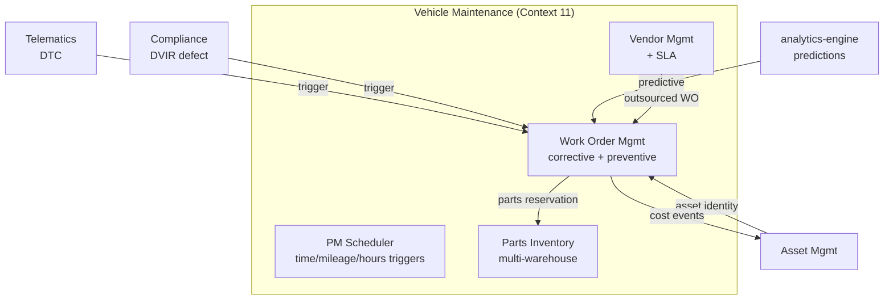
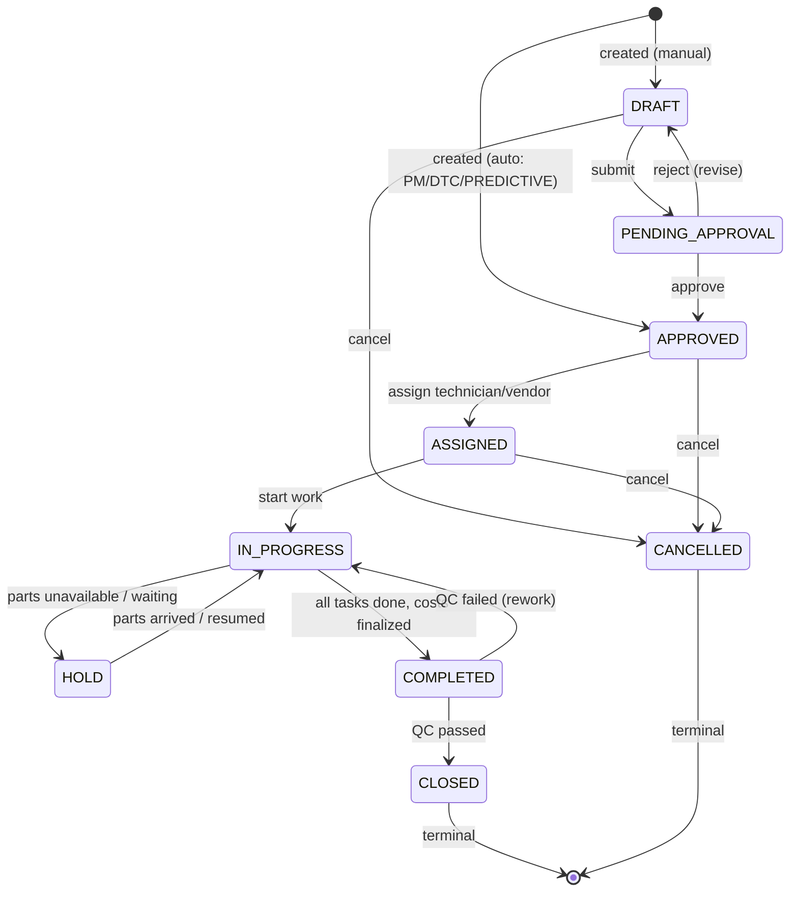
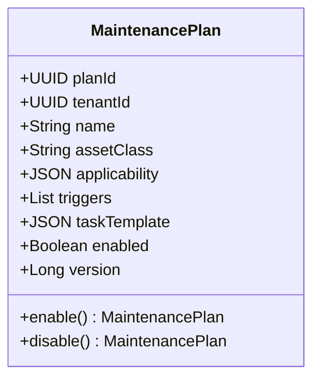
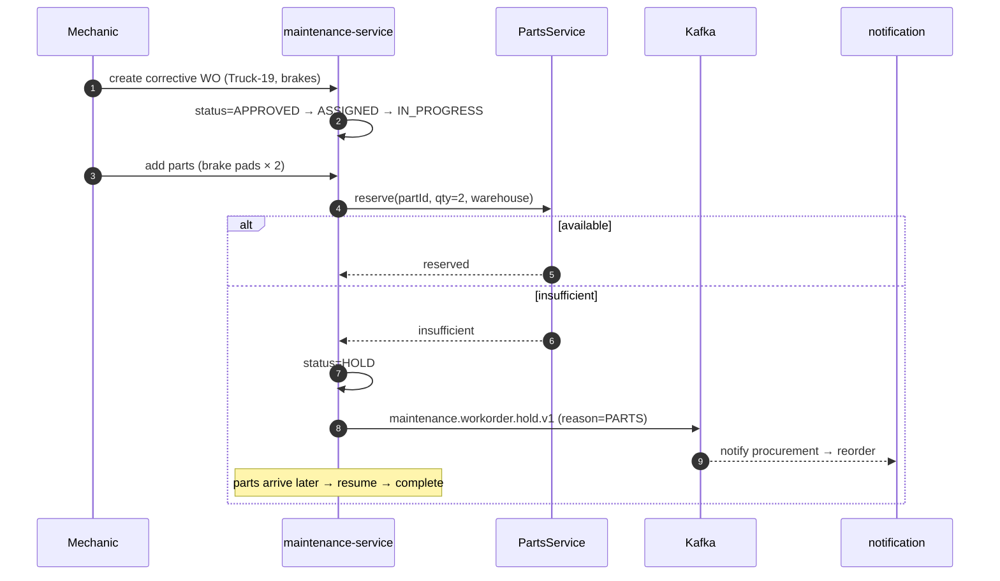
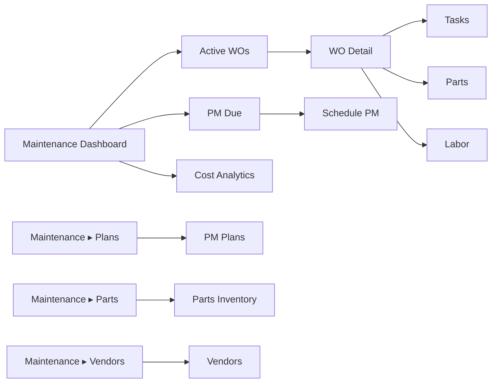

# CMMS Module
## Module-Level Design Document

**Version:** 2.0.0
**Status:** Approved — Foundation-Aligned
**Date:** 2026-08-02
**Bounded Context:** Vehicle Maintenance (Context 11 — `02_Domain_Model.md` §1) — broadened to Computerized Maintenance Management
**Service:** `vehicle-maintenance-service` (Spring Boot 3.3 + Kotlin 2.0, JVM 21)
**Data Store:** PostgreSQL 16 (`maintenance` schema) · Redis (PM triggers, parts alerts) · Elasticsearch (work-order search) · ClickHouse (maintenance cost analytics)
** Messaging:** Kafka (`fleetvision.maintenance.*.events`)
**External:** Parts suppliers (REST/EDI) · Vendor portals (REST) · ERP (SAP/Oracle for parts receiving) · Telematics (DTC ingest) · Asset Management (costs)
**Authorization:** Open Policy Agent (OPA)

> **Relationship to foundation.** This module owns the **Vehicle Maintenance bounded context** (`02_Domain_Model.md` §1 Context 11; aggregates `MaintenanceWorkOrder` (ES), `MaintenancePlan`, `PartsInventory`, `Vendor`). It **supersedes** the v1.0.0 `Modules/Vehicle-Maintenance.md`, re-framed as a full **CMMS (Computerized Maintenance Management System)** — the industry-standard term for this capability. v2.0.0 broadens to asset-class-agnostic work orders (any registered Asset, not just vehicles), a richer PM scheduler, parts inventory with multi-warehouse + reorder, vendor SLA tracking, and labor/time-tracking. Conforms to ADR-001 (CQRS+ES — `MaintenanceWorkOrder` event-sourced), ADR-002 (Kafka), ADR-006 (Kotlin), ADR-008 (polyglot), ADR-016 (single topic convention). Resolves ARR INT-1 broken contracts (consumes canonical `telemetry.diagnostic.code.received.v1`, `tracking.position.received.v1`, etc.), DDD-8 (state-machine vs enum vs invariant reconciliation).

---

## Table of Contents

1. [Business Analysis](#1-business-analysis)
2. [Domain Model](#2-domain-model)
3. [Database](#3-database)
4. [Entities](#4-entities)
5. [APIs](#5-apis)
6. [Security](#6-security)
7. [Permissions](#7-permissions)
8. [Sequence Diagrams](#8-sequence-diagrams)
9. [UI Flow](#9-ui-flow)
10. [Scalability](#10-scalability)

---

## 1. Business Analysis

### 1.1 Purpose

A fleet that isn't maintained is a fleet that breaks down — and breakdowns cost 3–5× more than preventive maintenance, plus they take a vehicle out of revenue service unexpectedly. The CMMS is the platform's **maintenance operations backbone**: it plans preventive maintenance (PM), manages corrective work orders (WO), tracks parts inventory and vendor performance, captures labor, and feeds real cost data back to Asset Management's TCO.

It is the *Intelligence* pillar's reliability engine (predictive maintenance, PM compliance) and an *Openness* pillar integration point (parts suppliers, vendor portals). Where Asset Management (Context 14) tracks the vehicle as a financial instrument, CMMS tracks its **operational health**.

### 1.2 Scope: Asset-Class-Agnostic (v2.0.0 broadening)

The v1.0.0 module was vehicle-only. v2.0.0 work orders can target **any registered Asset** (Context 14) — vehicles, trailers, equipment, infrastructure:

| Asset class | Maintenance example |
|---|---|
| Vehicle | oil change, brake job, DPF clean |
| Trailer | reefer unit service, door repair, tire |
| Equipment | forklift hydraulic, generator service |
| Infrastructure | gate motor, fuel pump, charger |

### 1.3 Goals & Non-Goals

| Goals | Non-Goals |
|---|---|
| Plan + schedule preventive maintenance | Executing repairs (technicians do, in-shop) |
| Manage corrective work orders end-to-end | Parts manufacturing |
| Multi-warehouse parts inventory + reorder | Procurement invoicing (ERP owns) |
| Vendor management + SLA tracking | Becoming a full ERP |
| Labor/time tracking per WO | Payroll (HR system owns) |
| Predictive maintenance (consume analytics-engine outputs) | Designing PM plans (OEM provides; we manage) |
| Real cost rollup → Asset TCO | Vehicle assignment (Fleet Management owns) |

### 1.4 Functional Requirements

| ID | Requirement | Priority |
|---|---|---|
| CMMS-FR-01 | Work order CRUD (corrective + preventive) on any asset | Must |
| CMMS-FR-02 | WO lifecycle: request → approve → assign → in-progress → hold → QC → complete → close | Must |
| CMMS-FR-03 | Maintenance plan (PM schedule) by time/mileage/engine-hours | Must |
| CMMS-FR-04 | Auto-generate WOs from PM triggers + DTCs + DVIR defects | Must |
| CMMS-FR-05 | Parts inventory (multi-warehouse, reorder points, reservations) | Must |
| CMMS-FR-06 | Labor time-tracking per WO/task | Must |
| CMMS-FR-07 | Vendor management + SLA/performance tracking | Must |
| CMMS-FR-08 | Predictive maintenance (consume analytics-engine predictions) | Should |
| CMMS-FR-09 | DTC → WO auto-creation | Must |
| CMMS-FR-10 | DVIR defect → WO auto-creation | Must |
| CMMS-FR-11 | Cost rollup (labor + parts + vendor) per WO → Asset TCO | Must |
| CMMS-FR-12 | Maintenance calendar / load balancing | Should |

### 1.5 Non-Functional Requirements

| Attribute | Target |
|---|---|
| WO creation | 100 TPS |
| WO read | < 50ms P99 |
| Active WO dashboard (10K) | < 2s P99 |
| Availability | 99.9% (Tier 1 — degrades to manual; not catastrophic) |
| PM compliance reporting | nightly batch |

### 1.6 Business Rules

| ID | Rule |
|---|---|
| CMMS-BR-01 | Parts consumption ≤ available inventory (INV-M01) |
| CMMS-BR-02 | Completed work orders immutable (INV-M02) |
| CMMS-BR-03 | WO state machine enforced (no skips) |
| CMMS-BR-04 | PM triggers (time/mileage/engine-hours) generate WOs automatically |
| CMMS-BR-05 | Critical DTCs auto-create WO + alert |
| CMMS-BR-06 | Vendor SLA breach (ETA exceeded) → escalation |
| CMMS-BR-07 | All completed WO costs flow to Asset TCO via event |

---

## 2. Domain Model

### 2.1 Sub-Domain Position



### 2.2 Aggregates Owned

| Aggregate | ES? | Consistency Boundary |
|---|---|---|
| **MaintenanceWorkOrder** | **Yes (ES)** | One WO's full lifecycle, tasks, parts, labor, costs |
| **MaintenancePlan** | No | PM schedule template (triggers, applicability) |
| **PartsInventory** | No | Parts stock per warehouse, reservations, reorder |
| **Vendor** | No | Vendor profile + performance/SLA |

### 2.3 Value Objects

| Value Object | Fields |
|---|---|
| `WOType` | enum CORRECTIVE/PREVENTIVE/PREDICTIVE/INSPECTION/WARRANTY |
| `WOPriority` | enum LOW/MEDIUM/HIGH/CRITICAL/EMERGENCY |
| `WOSource` | enum MANUAL/PM_TRIGGER/DTC/DVIR/PREDICTIVE |
| `Task` | description, skillRequired, estHours, actualHours, status |
| `PartsLineItem` | partId, quantity, unitCost, reservedFromWarehouse |
| `LaborLineItem` | technicianId, role, hours, rate, cost |
| `PMTrigger` | type (TIME/MILEAGE/ENGINE_HOURS), interval, lastTriggered |
| `SLA` | responseTimeHrs, resolutionTimeHrs, penalties |

### 2.4 Domain Events

All CloudEvents, Avro, on **`fleetvision.maintenance.*.events`** (ADR-016), partitioned by `tenant_id` then `workOrderId`.

| Event | Trigger | Consumers |
|---|---|---|
| `maintenance.workorder.created.v1` | WO created (manual/auto) | Notification, Analytics, Audit |
| `maintenance.workorder.approved.v1` / `.assigned.v1` / `.started.v1` | Lifecycle | Notification |
| `maintenance.workorder.hold.v1` / `.resumed.v1` | Hold (parts wait) | Notification |
| `maintenance.workorder.completed.v1` | Work done, costs finalized | Asset Mgmt (TCO), Fleet, Notification, Analytics |
| `maintenance.workorder.closed.v1` | Final close (after QC) | Audit, Analytics |
| `maintenance.workorder.cancelled.v1` | Cancelled | Notification, Audit |
| `maintenance.plan.triggered.v1` | PM plan fires → WO created | (internal) |
| `maintenance.parts.lowstock.v1` | Stock < reorder point | Notification, Procurement |

> **Consumes canonical events (resolves ARR INT-1):** `telemetry.diagnostic.code.received.v1` (DTC → WO), `compliance.dvir.defect.recorded.v1` (defect → WO), `analytics.prediction.maintenance.v1` (predictive → WO), `tracking.position.received.v1` (mileage for PM triggers), `fleet.vehicle.decommissioned.v1`.

### 2.5 Domain Services

| Service | Responsibility |
|---|---|
| `WorkOrderService` | WO CRUD + lifecycle enforcement |
| `PMSchedulerService` | Evaluate plans against asset meters; generate WOs |
| `PartsService` | Inventory, reservation, reorder |
| `VendorService` | Vendor profile + SLA tracking |
| `CostRollupService` | Compute WO cost → emit to Asset Mgmt |
| `DTCProcessor` | DTC event → auto-WO (critical path) |

### 2.6 Ubiquitous Language

| Term | Definition |
|---|---|
| Work Order (WO) | Formal request for maintenance: tasks, parts, labor, priority |
| PM (Preventive Maintenance) | Scheduled maintenance to prevent failures |
| Corrective | Unscheduled maintenance to repair a failure/defect |
| Predictive | Maintenance predicted by ML (condition-based) |
| MaintenancePlan | PM template: triggers + applicability + task list |
| Trigger | Condition that fires a PM (time/mileage/engine-hours) |
| DTC | Diagnostic Trouble Code (OBD-II malfunction) |
| PartsInventory | Stock per warehouse, reorder points |
| Vendor | External service provider; rated on completed work |
| SLA | Vendor service-level agreement (response/resolution time) |
| Labor Line Item | Technician hours × rate per WO |
| PM Compliance | % of PM completed on-time vs scheduled |

---

## 3. Database

Schema `maintenance` in PostgreSQL (system of record, event store); Redis (PM triggers, parts alerts); Elasticsearch (WO search); ClickHouse (cost analytics).

### 3.1 PostgreSQL Tables

```sql
maintenance.work_orders (
  work_order_id UUID PK, tenant_id UUID,
  asset_id UUID NOT NULL,                 -- any asset (vehicle/trailer/equipment)
  type TEXT NOT NULL,                     -- CORRECTIVE/PREVENTIVE/PREDICTIVE/INSPECTION/WARRANTY
  priority TEXT NOT NULL,
  source TEXT NOT NULL,                   -- MANUAL/PM_TRIGGER/DTC/DVIR/PREDICTIVE
  source_ref UUID,                        -- plan_id / dtc event / dvir defect / prediction id
  title TEXT, description TEXT,
  status TEXT NOT NULL,                   -- DRAFT/PENDING_APPROVAL/APPROVED/ASSIGNED/IN_PROGRESS/HOLD/COMPLETED/CLOSED/CANCELLED
  assigned_technician UUID, vendor_id UUID,
  scheduled_at TIMESTAMPTZ, started_at, completed_at, closed_at TIMESTAMPTZ,
  diagnosis TEXT, resolution TEXT,
  labor_cost NUMERIC(19,4), parts_cost NUMERIC(19,4), vendor_cost NUMERIC(19,4), total_cost NUMERIC(19,4),
  metadata JSONB,
  version BIGINT, created_at, updated_at
) PARTITION BY LIST (tenant_id)

maintenance.work_order_events (          -- event store for ES aggregate
  event_id UUID PK, work_order_id UUID, tenant_id UUID,
  event_type TEXT, event_data JSONB, aggregate_version BIGINT,
  occurred_at TIMESTAMPTZ
) PARTITION BY RANGE (occurred_at)

maintenance.tasks (
  task_id UUID PK, work_order_id UUID, tenant_id UUID,
  sequence INT, description TEXT, skill_required TEXT,
  est_hours NUMERIC(6,2), actual_hours NUMERIC(6,2),
  status TEXT, completed_at, technician_id UUID
)

maintenance.parts_line_items (
  line_item_id UUID PK, work_order_id UUID, tenant_id UUID,
  part_id UUID, quantity INT, unit_cost NUMERIC(19,4),
  warehouse_id UUID, reserved BOOLEAN
)

maintenance.labor_line_items (
  line_item_id UUID PK, work_order_id UUID, tenant_id UUID,
  technician_id UUID, role TEXT, hours NUMERIC(6,2), rate NUMERIC(19,4), cost NUMERIC(19,4)
)

maintenance.maintenance_plans (
  plan_id UUID PK, tenant_id UUID, name TEXT,
  asset_class TEXT, applicability JSONB,  -- make/model/year filters
  triggers JSONB NOT NULL,                -- [{type, interval}]
  task_template JSONB,                    -- default task list
  enabled BOOLEAN, last_triggered_per_asset JSONB,
  version BIGINT
)

maintenance.parts (
  part_id UUID PK, tenant_id UUID, sku TEXT, name TEXT, description TEXT,
  unit_of_measure TEXT, category TEXT, manufacturer TEXT,
  reorder_point INT, reorder_qty INT, metadata JSONB, version BIGINT
)

maintenance.parts_inventory (
  inventory_id UUID PK, tenant_id UUID, part_id UUID, warehouse_id UUID,
  quantity_on_hand INT, quantity_reserved INT, quantity_available INT,
  unit_cost NUMERIC(19,4), last_received_at, version BIGINT
)

maintenance.vendors (
  vendor_id UUID PK, tenant_id UUID, name TEXT, contact JSONB,
  capabilities TEXT[], sla JSONB, rating NUMERIC(3,2),
  completed_wos INT, version BIGINT
)
```

**Partitioning** (`03_Database_Architecture.md` §8): `work_orders` list-partitioned by `tenant_id` (Professional/Enterprise); `work_order_events` monthly range. **Indexes:** `(tenant_id, status, scheduled_at)` on WO; `(asset_id, status)`; `(tenant_id, sku)` on parts.

### 3.2 Redis Keyspace

| Key | TTL | Purpose |
|---|---|---|
| `pm:due:<planId>:<assetId>` | — | PM trigger state (mileage/hours counter) |
| `pm:check` | — | Sorted set of due PMs (by time) |
| `parts:low:<tenantId>` | — | Low-stock alert set |
| `wo:queue:<tenantId>` | — | Active WO cache |

### 3.3 ClickHouse (Cost Analytics)

| Table | Grain | Use |
|---|---|---|
| `fact_maintenance_costs` | WO × cost line | cost analytics, cost-per-vehicle |
| `fact_pm_compliance` | asset × plan × month | PM compliance % |

---

## 4. Entities

### 4.1 MaintenanceWorkOrder Aggregate (Event-Sourced) + Lifecycle



**Invariants (resolves ARR DDD-8):** (i) state machine enforced — no skip transitions; (ii) COMPLETED immutable (INV-M02) — tasks/parts/labor locked, only QC rework reopens; (iii) parts consumption ≤ available (INV-M01); (iv) CLOSED requires QC pass; (v) CANCELLED/CLOSED terminal.

### 4.2 MaintenancePlan Aggregate



**Invariants:** (i) ≥1 trigger; (ii) applicability validated against asset registry; (iii) task template internally consistent.

### 4.3 PartsInventory Aggregate

```kotlin
data class PartsInventory(
    val inventoryId: UUID, val tenantId: UUID, val partId: UUID, val warehouseId: UUID,
    val quantityOnHand: Int, val quantityReserved: Int,
    val reorderPoint: Int, val reorderQty: Int, val unitCost: BigDecimal, val version: Long
) {
    val quantityAvailable get() = quantityOnHand - quantityReserved
    fun reserve(qty: Int): PartsInventory    // INV-M01: qty ≤ quantityAvailable
    fun consume(qty: Int): PartsInventory
    fun receive(qty: Int): PartsInventory
}
// INV: quantityAvailable ≥ 0; consume ≤ reserved
```

### 4.4 Vendor Aggregate

```kotlin
data class Vendor(
    val vendorId: UUID, val tenantId: UUID, val name: String, val contact: Contact,
    val capabilities: Set<String>, val sla: SLA?, val rating: BigDecimal,
    val completedWos: Int, val version: Long
)
// rating recomputed from completed WOs (on-time %, quality)
```

---

## 5. APIs

Endpoints under `/api/v1/maintenance`. REST contracts follow `API_Design.md`.

### 5.1 REST Endpoints

| Method | Endpoint | Description | Permission |
|---|---|---|---|
| `GET` | `/work-orders` | List WOs (filter: status, asset, priority, type, range) | `maintenance.wo.read` |
| `GET` | `/work-orders/{id}` | WO detail (tasks, parts, labor, costs) | `maintenance.wo.read` |
| `POST` | `/work-orders` | Create WO (manual) | `maintenance.wo.create` |
| `PATCH` | `/work-orders/{id}` | Update WO | `maintenance.wo.update` |
| `POST` | `/work-orders/{id}:submit` | DRAFT → PENDING_APPROVAL | `maintenance.wo.submit` |
| `POST` | `/work-orders/{id}:approve` | Approve | `maintenance.wo.approve` |
| `POST` | `/work-orders/{id}:assign` | Assign tech/vendor | `maintenance.wo.assign` |
| `POST` | `/work-orders/{id}:start` | Start work | `maintenance.wo.execute` |
| `POST` | `/work-orders/{id}:hold` | Hold (parts wait) | `maintenance.wo.execute` |
| `POST` | `/work-orders/{id}:resume` | Resume | `maintenance.wo.execute` |
| `POST` | `/work-orders/{id}:complete` | Complete (tasks done) | `maintenance.wo.execute` |
| `POST` | `/work-orders/{id}:close` | Close (QC) | `maintenance.wo.close` |
| `POST` | `/work-orders/{id}:cancel` | Cancel | `maintenance.wo.cancel` |
| `POST` | `/work-orders/{id}/tasks` | Add task | `maintenance.wo.update` |
| `POST` | `/work-orders/{id}/parts` | Add parts line | `maintenance.wo.update` |
| `POST` | `/work-orders/{id}/labor` | Add labor line | `maintenance.wo.update` |
| `GET` | `/plans` | List PM plans | `maintenance.plan.read` |
| `POST` | `/plans` | Create PM plan | `maintenance.plan.create` |
| `PUT` | `/plans/{id}` | Update plan | `maintenance.plan.update` |
| `GET` | `/parts` | List parts | `maintenance.parts.read` |
| `GET` | `/parts/inventory` | Inventory per warehouse | `maintenance.parts.read` |
| `POST` | `/parts/receive` | Receive stock | `maintenance.parts.update` |
| `POST` | `/parts/reorder` | Trigger reorder | `maintenance.parts.update` |
| `GET` | `/vendors` | List vendors | `maintenance.vendor.read` |
| `POST` | `/vendors` | Create vendor | `maintenance.vendor.create` |
| `GET` | `/dashboard` | Maintenance dashboard (active WOs, PM due, costs) | `maintenance.wo.read` |
| `GET` | `/pm-compliance` | PM compliance report | `maintenance.wo.read` |

### 5.2 Sample — Create WO from DTC (Auto)

```http
POST /api/v1/maintenance/work-orders
Authorization: Bearer <service JWT>  (auto-created by DTC processor)
Idempotency-Key: <dtc-event-id>

{
  "data": {
    "type": "workOrder",
    "attributes": {
      "assetId": "550e…",
      "type": "CORRECTIVE",
      "priority": "HIGH",
      "source": "DTC",
      "sourceRef": "<dtc-event-id>",
      "title": "DTC P0420 — Catalytic system efficiency below threshold",
      "description": "Auto-created from telemetry diagnostic. Vehicle: Truck-19."
    }
  }
}

201 Created
Location: /api/v1/maintenance/work-orders/{woId}
```

### 5.3 gRPC (Internal)

```protobuf
service MaintenanceService {
  rpc GetWorkOrder     (GetWoRequest)     returns (WorkOrder);
  rpc CreateFromDtc    (DtcEvent)         returns (WorkOrder);     // auto-WO
  rpc CreateFromDvir   (DvirDefect)       returns (WorkOrder);
  rpc CheckPmDue       (PmCheckRequest)   returns (PmDueList);
  rpc ReserveParts     (PartsReserve)     returns (ReserveResult);
  rpc GetUpcomingPm    (UpcomingRequest)  returns (UpcomingPm);
}
```

---

## 6. Security

### 6.1 Tenant Isolation

All WOs/plans/parts/vendors `tenant_id`-scoped (INV-I01). A vendor in tenant A cannot be assigned in tenant B.

### 6.2 WO Integrity (INV-M02)

Completed WOs are **immutable** — enforced at the event-store layer (event-sourced aggregate): no UPDATE/DELETE on completed WO events; only QC-fail rework (a new event) reopens. Cost data locked once COMPLETED. This makes maintenance records defensible for warranty disputes and audit.

### 6.3 Parts Safety (INV-M01)

Parts reservation decrements `quantity_available`; consumption decrements `quantity_on_hand`. Enforced atomically in the aggregate + DB constraint (`quantity_available ≥ 0`). No over-consumption possible.

### 6.4 Vendor Data

Vendor contact/financial details access-controlled (`maintenance.vendor.read`); payment terms in Vault.

---

## 7. Permissions

Canonical from `02_Domain_Model.md` §6 — not redefined.

| Permission | Used For |
|---|---|
| `maintenance.wo.read` | List/view WOs, dashboard, PM compliance |
| `maintenance.wo.create` / `.update` | Create / update WOs |
| `maintenance.wo.submit` / `.approve` | Submit / approve |
| `maintenance.wo.assign` / `.execute` | Assign / start/hold/resume/complete |
| `maintenance.wo.close` / `.cancel` | Close (QC) / cancel |
| `maintenance.plan.read` / `.create` / `.update` | PM plans |
| `maintenance.parts.read` / `.update` | Parts inventory |
| `maintenance.vendor.read` / `.create` / `.update` | Vendors |

Role mapping: `mechanic` gets `.wo.execute` + `.parts.read`; `fleet-admin`/`tenant-admin` get full; `maintenance-manager` (custom) gets `.wo.approve` + `.plan.*`.

---

## 8. Sequence Diagrams

### 8.1 PM Auto-Generation (Mileage Trigger)

```mermaid
sequenceDiagram
    autonumber
    participant TELE as Telematics
    participant K as Kafka
    participant PM as PMSchedulerService
    participant WO as WorkOrderService
    participant DB as PostgreSQL
    participant NT as notification

    TELE->>K: tracking.position.received.v1 (odometer tick)
    K-->>PM: consume
    PM->>DB: load active plans for asset + last_triggered mileage
    PM->>PM: evaluate triggers (e.g., 25000km interval; current 25100km)
    alt trigger met
        PM->>WO: createWorkOrder(asset, type=PREVENTIVE, source=PM_TRIGGER, sourceRef=planId, tasks=template)
        WO->>DB: INSERT work_orders (status=APPROVED) + event store
        WO->>K: maintenance.workorder.created.v1
        K-->>NT: notify fleet manager + shop
        PM->>DB: update last_triggered_per_asset
    end
```

### 8.2 Corrective WO with Parts Hold



### 8.3 Complete → Cost Rollup → Asset TCO

```mermaid
sequenceDiagram
    autonumber
    participant MECH as Mechanic
    participant API as maintenance-service
    participant DB as PostgreSQL
    participant K as Kafka
    participant ASSET as Asset Mgmt

    MECH->>API: complete WO (tasks done)
    API->>API: finalize costs (labor + parts + vendor)
    API->>DB: WO status=COMPLETED (immutable); write event store
    API->>K: maintenance.workorder.completed.v1 (total_cost, asset_id)
    K-->>ASSET: consume → recompute TCO
    Note over ASSET: fact_asset_tco_monthly updated; book value unaffected
```

---

## 9. UI Flow

### 9.1 Surface Map



### 9.2 Maintenance Dashboard

(Mirrors `Modules/UI_UX_Design.md` §4.) Stat cards: PM due ≤7d, overdue (red), open WOs, in-shop, MTD cost. PM Due list (ranked, overdue first) with "Schedule" → WO create pre-filled. Active WOs with live status. Vehicle Health (DTCs). Cost chart (90d by category).

### 9.3 WO Detail Drawer

Header (WO #, asset, status, priority). Tasks checklist (with est/actual hours). Parts line items (with warehouse/reserved). Labor line items. Cost rollup (labor + parts + vendor = total). Actions (Complete / Pause / Add note). Full event history (event-sourced replay).

### 9.4 PM Plan Builder

Define applicability (asset class + make/model filters) → triggers (time/mileage/engine-hours, possibly multiple) → task template → enable. Preview shows which assets match + next-due estimate.

### 9.5 Parts Inventory

Multi-warehouse stock view with reorder alerts (red < reorder point). Receive stock; trigger reorder; view reservation-by-WO.

---

## 10. Scalability

### 10.1 Load Profile

| Path | Year 1 | Year 5 |
|---|---|---|
| Active WOs per tenant | ~100 | ~5,000 |
| PM plans per tenant | ~20 | ~500 |
| WO creation rate | ~10/day | ~500/day |
| Parts SKUs per tenant | ~1,000 | ~50,000 |

### 10.2 Scaling Mechanisms

| Component | Mechanism | Trigger |
|---|---|---|
| `vehicle-maintenance-service` | HPA on RPS + CPU | CPU > 70% |
| PM scheduler | Partitioned by tenant; sorted-set scan | — |
| Event store | Monthly partitioning | — |
| Elasticsearch | WO search index | query latency |

### 10.3 Event-Sourced WO at Scale

`MaintenanceWorkOrder` is event-sourced (ADR-001) — append-only `work_order_events`. Snapshots every 100 events bound replay cost. Read models (WO detail, dashboards) are CQRS projections from the event stream, kept in PostgreSQL + Elasticsearch for fast query. Event sourcing gives full audit trail of every WO change — defensible for warranty/liability.

### 10.4 Failure Modes

| Failure | Response |
|---|---|
| Pod crash | K8s reschedule; WO state from event store + snapshot |
| Elasticsearch down | WO search degrades to PostgreSQL; alert |
| Parts supplier API down | Reorder queued; alert procurement; no WO block |
| DTC storm (many vehicles) | DTC processor scales (KEDA on Kafka lag); critical DTCs prioritized |

### 10.5 Capacity Headroom

2× headroom (vision guardrail); WO creation load-tested at 10× projected; PM scheduler tested at 1M assets × 10 plans each.

---

## Appendix A: Event Catalog

| Event | Topic |
|---|---|
| `maintenance.workorder.created/approved/assigned/started/hold/resumed/completed/closed/cancelled.v1` | `fleetvision.maintenance.workorder.events` |
| `maintenance.plan.triggered.v1` | `fleetvision.maintenance.plan.events` |
| `maintenance.parts.lowstock.v1` | `fleetvision.maintenance.parts.events` |
| `maintenance.vendor.rating.updated.v1` | `fleetvision.maintenance.vendor.events` |

## Appendix B: Traceability

| Foundation Element | This Module |
|---|---|
| `00` Intelligence pillar (predictive maintenance, PM compliance) | §1.1 |
| `00` Trust pillar (defensible WO records) | §6.2 |
| `01` §3 Service Registry #15 (vehicle-maintenance-service) | §1 header |
| `01` §6 Single topic convention (ADR-016) | Appendix A |
| `02` §1 Context 11 (Vehicle Maintenance) | §2.1 |
| `02` §3.2 MaintenanceWorkOrder (ES), MaintenancePlan, PartsInventory, Vendor | §2.2, §4 |
| `02` §6 Permission catalog (`maintenance.*`) | §7 |
| `02` §8 INV-M01, INV-M02 | §4.1, §6 |
| ARR INT-1 (broken DTC/DVIR event contracts) | Resolved (§2.4) |
| ARR DDD-8 (WO state machine vs enum vs invariant) | Resolved (§4.1) |
| ADR-001, ADR-002, ADR-006, ADR-008, ADR-016 | Throughout |

---

*This CMMS module supersedes `Modules/Vehicle-Maintenance.md` (v1.0.0, vehicle-only) and owns the Vehicle Maintenance bounded context, broadened to a full Computerized Maintenance Management System. Consistent with the v2.0.0 foundation.*
