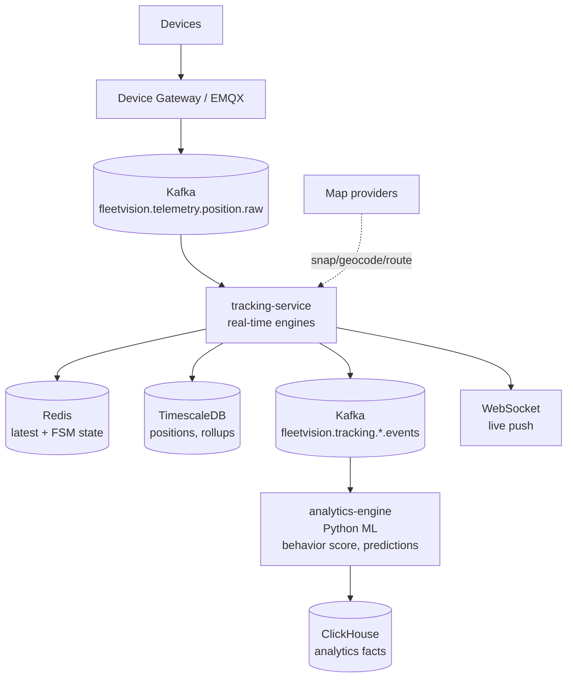
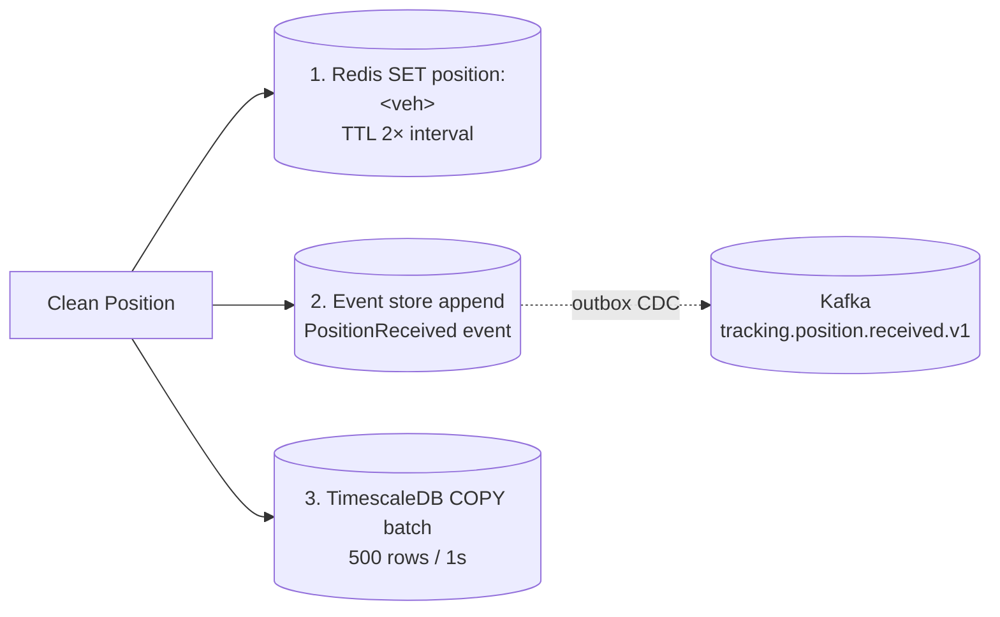
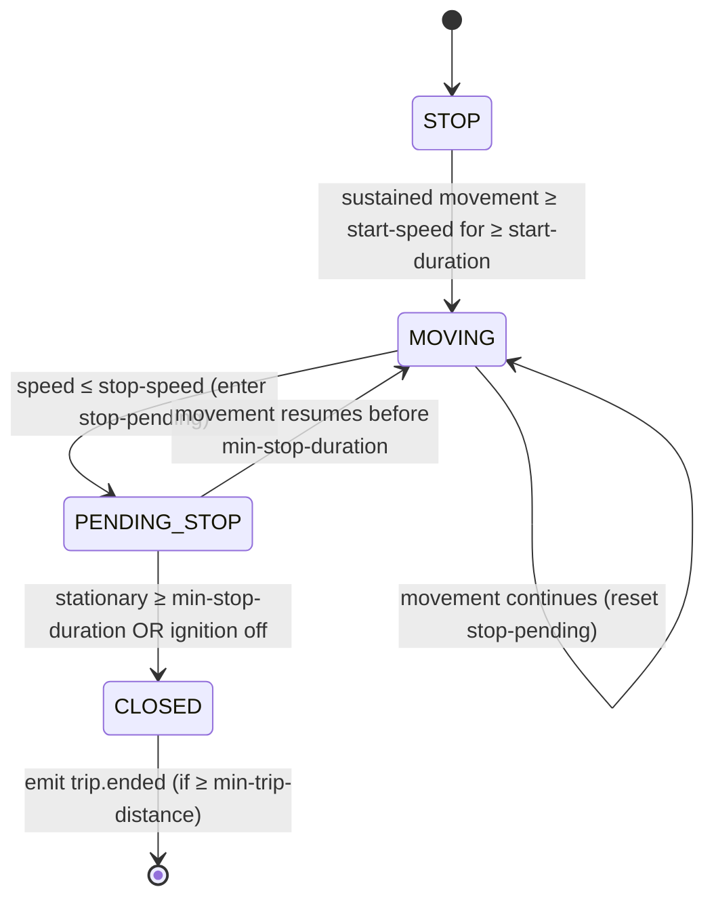
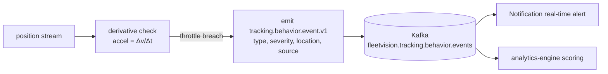

# GPS Engine Module
## Module-Level Design Document

**Version:** 2.0.0
**Status:** Approved — Foundation-Aligned
**Date:** 2026-08-02
**Bounded Context:** Tracking & Monitoring (GPS Computation Sub-Domain)
**Services:** `tracking-service` (Kotlin — real-time engines) · `analytics-engine` (Python 3.12 — offline scoring)
**Data Store:** TimescaleDB (positions, derived metrics) · PostgreSQL 16 + PostGIS (geofences, routes) · Redis (FSM state, latest) · ClickHouse (aggregates) · S3 (trip polylines)
**Messaging:** Kafka (consumes `fleetvision.telemetry.position.raw`; emits `fleetvision.tracking.*.events`)
**Pattern:** CQRS projection + stream processing over the event-sourced `VehicleTracker` aggregate

> **Relationship to foundation.** This module is the deep-dive on the **computation engines** that turn raw positions into operational intelligence (trip/stop/idle/mileage/route/replay/geofence/behavior/speed), within the Tracking & Monitoring context (`02_Domain_Model.md` §1, Context 7). The parent `Modules/Tracking-Monitoring.md` owns the `VehicleTracker` aggregate, live WebSocket push, and geofence CRUD; **this module owns the algorithms, FSMs, and derived-data pipelines**. It conforms to ADR-001 (CQRS+ES), ADR-002 (Kafka), ADR-006 (Kotlin + Python for ML), ADR-016 (single topic convention), ADR-017 (single behavior-score owner). v2.0.0 resolves ARR ARCH-4 (split `tracking.*` ownership — parent now owns the catalog), ARCH-6/7 (throughput/latency numbers reconciled), DDD-1 (single behavior formula), GPSEngine-topic drift.

---

## Table of Contents

1. [Engine Overview](#1-engine-overview)
2. [Real-Time Processing](#2-real-time-processing)
3. [Position Storage](#3-position-storage)
4. [Trip Calculation](#4-trip-calculation)
5. [Stop & Idle Detection](#5-stop--idle-detection)
6. [Mileage Calculation](#6-mileage-calculation)
7. [Route Engine](#7-route-engine)
8. [Replay Engine](#8-replay-engine)
9. [Geofence Engine](#9-geofence-engine)
10. [Driver Behavior & Speed Analysis](#10-driver-behavior--speed-analysis)
11. [Scaling](#11-scaling)

---

## 1. Engine Overview

### 1.1 Purpose

Raw GPS positions are noise. A coordinate stream becomes operational intelligence only after it is **filtered, contextualized, and segmented** into trips, stops, idle periods, mileage, route adherence, geofence events, speed profiles, and driver-behavior signals. The GPS Engine is the collection of stream-processing components inside `tracking-service` (real-time) and `analytics-engine` (offline) that performs this transformation at platform scale (**600K positions/sec at Year 5**).

The engine turns this — `(lat,lng,0km/h,ign=on,t=14:00) (lat,lng,0km/h,ign=on,t=14:01) (lat,lng,30km/h,ign=on,t=14:05) ...` — into this:

> TRIP #4421 started 14:00 @ Warehouse → 4 stops → arrived 16:42 @ Depot · 87.3 km · 2h41m active · 18m idle · avg 47km/h · 1 overspeed @14:31 · 3 harsh-brake events · geofence ENTER @14:05 (Customer A) · on-route (Route-77) 96% adherence.

### 1.2 Sub-Components

| # | Engine | Lives In | Trigger | Output |
|---|---|---|---|---|
| 1 | **Packet Processor** | tracking-service | every raw position | validated, deduped `Position` |
| 2 | **Position Storage** | tracking-service | every valid position | TimescaleDB + Redis + event store |
| 3 | **Trip Detector** | tracking-service | ignition/movement state | trip start/end boundaries |
| 4 | **Stop / Idle Detector** | tracking-service | dwell / engine-on stationary | stop & idle events |
| 5 | **Mileage Calculator** | tracking-service | consecutive positions | distance, derived odometer |
| 6 | **Route Engine** | tracking-service | positions + assigned Route | adherence, off-route, ETA |
| 7 | **Replay Engine** | tracking-service (on-demand) | query | polyline, time-slider playback |
| 8 | **Geofence Engine** | tracking-service | positions | enter/exit/dwell events |
| 9 | **Driver Behavior** | analytics-engine (offline) + tracking (real-time flags) | behavior events | score (single owner), events |
| 10 | **Speed Analysis** | tracking-service | positions | speed profile, violations |

### 1.3 Where Each Engine Runs



Real-time engines are **per-position** and latency-budget-bound; behavior and aggregate models are **windowed/batched** in `analytics-engine`. This split keeps the hot path cheap and lets heavy scoring use Python's ML ecosystem (ADR-006).

### 1.4 Latency & Throughput Budgets

| Path | Budget | Mechanism |
|---|---|---|
| Position ingest → Redis latest | < 50ms P99 | direct write on ingest |
| Position ingest → WebSocket push | < 200ms P99 | Kafka → consumer → broadcaster |
| Geofence evaluation per position | < 20ms P99 (INV-T02) | in-memory R-tree + PostGIS fallback |
| Trip/stop/idle FSM transition | < 5ms P99 | in-memory FSM keyed by vehicle |
| Replay query (1 day, ~8K pts) | < 500ms P99 | continuous aggregate + simplification |
| Behavior score recompute (daily) | minutes | nightly ClickHouse batch |

### 1.5 Design Principles

1. **Stateless computation, stateful per-vehicle FSM.** Engines keep per-vehicle state in memory + Redis — no global mutable state.
2. **Idempotent.** Every derived event carries `(vehicle_id, source_message_id)`; downstream dedupes.
3. **Deterministic replay.** Same raw positions + same config → same derived events.
4. **Configurable per tenant/fleet.** Thresholds are fleet-policy-driven.
5. **Never block the hot path.** Expensive work offloaded to background / analytics-engine.

---

## 2. Real-Time Processing

The Packet Processor is the first stage: it consumes raw positions from Kafka, validates/filters them, and emits clean `Position` values downstream.

### 2.1 Input

`fleetvision.telemetry.position.raw` (partitioned by `device_id`/`vehicle_id` → per-vehicle order preserved). Each record is CloudEvents-wrapped, produced by `device-gateway-service` / `telemetry-ingestion-service`.

### 2.2 Validation Pipeline

```mermaid
flowchart TD
    R[raw Position from Kafka] --> S1{1. Schema check}
    S1 -->|fail| DLQ[DLQ]
    S1 -->|ok| S2{2. Sanity range<br/>|lat|≤90, |lng|≤180, speed∈[0,400]}
    S2 -->|fail| DLQ
    S2 -->|ok| S3{3. Timestamp<br/>future-dated? stale >5m?}
    S3 -->|stale| TAG[Tag STALE]
    S3 -->|future| DLQ
    S3 -->|ok| S4{4. Accuracy filter}
    S4 -->|poor| DROP[Drop]
    S4 -->|ok| S5{5. Jump/teleport<br/>implied speed > max plausible}
    S5 -->|suspect| HOLD[Hold for re-eval]
    S5 -->|ok| S6{6. Dedupe<br/>same veh/ts/lat/lng in 5s}
    S6 -->|dup| DROP
    S6 -->|ok| S7{7. Out-of-order}
    S7 -->|reorder| BUF[Buffer+reorder ≤2s]
    S7 -->|ok| OUT[clean Position downstream]
    TAG --> OUT
    BUF --> OUT
```

### 2.3 Quality Codes

| Code | Persisted? | Pushed live? |
|---|---|---|
| `VALID` | ✅ | ✅ |
| `STALE` (>max-age) | ✅ (flagged) | ❌ (misleads live map) |
| `LOW_ACCURACY` (accepted) | ✅ (flagged) | ✅ (with accuracy halo) |
| `SUSPECT_JUMP` (held) | ❌ | ❌ |
| `REJECTED` | ❌ (→ DLQ + metric) | ❌ |

### 2.4 Kalman Filter (Optional, Per-Vehicle)

For noisy devices (urban canyons, high HDOP), a lightweight Kalman filter smooths the stream per vehicle (opt-in per device-profile). State in Redis `kf:<vehicle_id>`. Output replaces raw lat/lng for engines, but **raw** is retained in storage for forensics.

### 2.5 Concurrency Model

One consumer per Kafka partition; per-vehicle state guarded by striped locks (vehicle-hash → lock) to allow parallel processing within a partition while preserving per-vehicle order. Bounded in-flight buffer for back-pressure.

---

## 3. Position Storage

Clean positions are written to **three** stores as the CQRS projection of the `VehicleTracker` event stream.

### 3.1 Storage Targets

| Store | Role | When | TTL / Retention |
|---|---|---|---|
| **PostgreSQL event store** | Source of truth (event-sourced aggregate) | every valid position | partitioned monthly; 24mo |
| **TimescaleDB hypertable** | Range-query read model | every valid position (batched COPY) | compressed after 7d; tiered to S3 |
| **Redis** | Latest position (live map) | every valid position | TTL = 2× reporting interval |
| **S3** | Simplified per-trip polyline | on trip end | lifecycle → Glacier |

### 3.2 Hypertable — `tracking.vehicle_positions`

Inherited verbatim from `03_Database_Architecture.md` §5.2 — `event_id BIGINT` PK (UUIDv7) for dedup, time + space partitioning (`vehicle_id` hash, 8 partitions), compress after 7d segment-by `vehicle_id` order-by `captured_at DESC`, retention 180d hot/warm → cold S3 Parquet.

### 3.3 Write Path



### 3.4 Continuous Aggregates

Raw positions are never scanned for analytics — pre-materialized rollups:

| Aggregate | Grain | Use |
|---|---|---|
| `vehicle_position_5min` | 5-min summary per vehicle | map playback, replay |
| `vehicle_distance_hourly` | hourly distance per vehicle | utilization, idle |
| `vehicle_speed_profile_hourly` | hourly speed avg/p50/p95/max | speed analysis |

---

## 4. Trip Calculation

A **Trip** is a continuous period of vehicle movement bookended by significant stops. The Trip Detector is a **per-vehicle finite-state machine** consuming the position stream. Boundaries produced here feed `trip-management-service` (the Trip aggregate owner), which enriches with driver/route/load. The detector owns **motion-based segmentation**; trip-mgmt owns operational semantics.

### 4.1 State Machine



### 4.2 Segmentation Rules (Configurable per Fleet)

| Parameter | Default | Meaning |
|---|---|---|
| `start-speed-kmh` | 10 | Speed above which movement is "real" (filters GPS creep) |
| `start-duration-s` | 30 | Sustained movement to open a trip candidate |
| `min-trip-distance-m` | 250 | Discard micro-trips below this |
| `stop-speed-kmh` | 3 | Speed at/below which "stationary" |
| `min-stop-duration-s` | 300 | Stationary duration that closes a trip |
| `max-gap-in-trip-s` | 600 | GPS gap above this breaks a trip |
| `ignition-binds` | true | Ignition-OFF force-closes |

### 4.3 Streaming Algorithm

State persisted to Redis (`tripfsm:<vehicle_id>`) → pod restart resumes mid-trip without spurious boundaries.

```
on each clean position p:
  moving = p.speed >= startSpeedKmh
  if state == STOP:
     if moving for >= startDurationS: state = MOVING; tripStart = p.ts; open candidate
  elif state == MOVING:
     if not moving: lastMovingAt = p.ts (PENDING_STOP)
     else:          lastMovingAt = p.ts
     if (now - lastMovingAt) >= minStopDuration OR ignitionOff:
        if tripDistance >= minTripDistance: emit trip.ended
        else: discard candidate (micro-trip)
        state = STOP
```

### 4.4 Output Events

| Event | When |
|---|---|
| `tracking.trip.started.v1` | Trip candidate opens (movement confirmed) |
| `tracking.trip.ended.v1` | Trip closes (stop confirmed / ignition-off) |

Payload: `startPosition`, `endPosition`, `distanceKm`, `durationSec`, `maxSpeed`, `stopCount`.

### 4.5 Edge Cases

Traffic-light stops (≤ min-stop-duration) don't break a trip. Ferry/train (low-accuracy + movement-without-ignition) suppressed. GPS gap < max-gap-in-trip → trip continues; gap interpolated in mileage (§6.4). Multi-stop trips: stops < min-stop-duration are in-trip pauses (visible on replay); only ≥ threshold closes.

---

## 5. Stop & Idle Detection

| Concept | Movement | Ignition | Duration | At POI? |
|---|---|---|---|---|
| **Trip-internal pause** | stationary | on/off | < min-stop-duration | n/a |
| **Idle** | stationary | **ON** | ≥ idle-threshold | n/a |
| **Stop** | stationary | on/off | ≥ stop-threshold | yes (resolved) |

When the Trip FSM enters `PENDING_STOP` (stationary ≥ min-stop-duration), the Stop Engine resolves the location (reverse-geocode → match known POI/geofence) and classifies: at POI → STOP (purpose = CUSTOMER/DEPOT/FUEL/YARD); not POI → STOP (UNSCHEDULED) or Idle (if engine still running).

Dwell at a geofence with DWELL trigger links to the Geofence Engine's `tracking.geofence.dwell.v1` to avoid double-alerting.

**Idle engine** opens an idle window when `ignitionOn AND speed ≤ idleSpeedKmh` for ≥ `idle-threshold-s` (default 180s); alert at `idle-alert-threshold-s` (900s). PTO engaged suppresses (legitimate equipment use). Outputs: `tracking.idle.started.v1`, `tracking.idle.ended.v1`, `tracking.idle.alert.v1`. State in Redis `idlefsm:<vehicle_id>`.

---

## 6. Mileage Calculation

Mileage is the most operationally/financially important derived metric — it drives maintenance schedules, fuel efficiency, billing, depreciation. Must be **accurate, monotonic, reconcilable**.

### 6.1 Methods

| Method | When |
|---|---|
| **Haversine** (consecutive) | Default — every pair of clean positions |
| **Vincenty** | High-accuracy short ranges (rare) |
| **Map-matched** (snapped) | When route adherence matters |
| **Odometer-reported** | Device provides `odometer_km`; prefer when monotonic & plausible |

### 6.2 Haversine

```
a = sin²(Δφ/2) + cos(φ1)·cos(φ2)·sin²(Δλ/2)
c = 2·atan2(√a, √(1−a))
d = R·c    (R = 6,371,000 m)
```

### 6.3 Filters

| Filter | Rule |
|---|---|
| Dedupe-distance | ignore < `dedup-distance-m` (default 1m) |
| Max-step | ignore implying > max-plausible-speed |
| Stop-zeroing | while STOP/IDLE, contribution = 0 |
| Reverse-hop | ignore A→B→A jitter |

### 6.4 Gap Interpolation

Gap < `max-gap-in-trip` → distance estimated from route (if assigned) or average speed 60s before/after (capped at limit). Gap ≥ threshold breaks the trip (no interpolation).

### 6.5 Monotonic Derived Odometer

`odometerKm_n = odometerKm_{n-1} + max(0, filteredDistanceStep_n)` — stored in Redis (`odo:<vehicle_id>`), snapshotted hourly + on trip-end. Device-reported odometer divergence > 5% → `tracking.odometer.drift.v1` alert.

---

## 7. Route Engine

Compares **actual path** vs **assigned Route** (from `trip-management-service` via `trip.route.assigned.v1`). Produces adherence, off-route detentions, ETA.

### 7.1 Inputs

Assigned `Route` (ordered waypoints + planned polyline + planned times) · live positions · road graph (Map Engine).

### 7.2 Route Model

A Route = ordered **waypoints** connected by a planned **polyline** (snapped to roads). For adherence, rendered as a **corridor**: polyline buffered by `corridor-width-m` (default 100m) — a long thin geofence.

### 7.3 Adherence Tracking

```
on each position p (while trip has route):
  1. snap p to planned polyline (nearest-point + perpendicular distance)
  2. if perp distance > corridor-width → OFF_ROUTE → emit tracking.route.deviation.v1
  3. if OFF_ROUTE and snapped back ≥ rejoin-time → emit tracking.route.rejoined.v1
  4. advance progress (nearest waypoint seq + % polyline traversed)
  5. recompute ETA from remaining distance + historical/real-time traffic
```

> **Note (resolves ARR INT-5):** the canonical route-deviation event is `tracking.route.deviation.v1` (single event, sub-typed) — owned by this engine. No more three competing identities.

### 7.4 Map Matching (Snap-to-Road)

For accurate mileage and adherence on dense networks, positions are **map-matched** to the road graph via HMM (states = road segments; observations = positions; Viterbi decode). Implemented by the **Map Engine** (`Modules/MapEngine.md`); the Route Engine calls it for batched trip segments, falling back to a local lightweight HMM when latency budget is tight.

### 7.5 ETA

`ETA = now + Σ(remaining_segment_distance / effective_speed)` where `effective_speed = min(speedLimit × driverFactor, realTimeTrafficSpeed)`. `driverFactor` learned per driver (analytics-engine). Published as `tracking.route.eta.updated.v1` on shifts > 5 min.

### 7.6 Adherence Score

Per-trip/fleet: `plannedDistance / actualDistance` (clamped 0–1) + detour-time penalty. Stored in ClickHouse.

---

## 8. Replay Engine

Reconstructs a vehicle's historical path for forensic/dispute review. **On-demand** (query-driven), not per-position.

### 8.1 Query

`GET /api/v1/tracking/vehicles/{vehicleId}/replay?from=…&to=…&resolution=…`

| Param | Values |
|---|---|
| `from`/`to` | ISO8601 (max 7 days) |
| `resolution` | `raw` / `1min` / `5min` / `auto` |
| `include` | `events,geofences,speed,behavior` |

### 8.2 Resolution Selection

| Range | Default | Source |
|---|---|---|
| ≤ 1h | `raw` | hypertable (recent uncompressed) |
| 1h–1d | `1min` | hypertable |
| 1d–7d | `5min` | continuous aggregate `vehicle_position_5min` |
| > 7d | `5min` | S3 Parquet via ClickHouse (cold) |

`auto` returns ≤ ~2,000 points.

### 8.3 Construction

Query → ordered points → **Douglas-Peucker** simplify (ε=5m at 1min) → optional map-match → layer events (stops, idle, geofence, overspeed, behavior). Output GeoJSON `FeatureCollection` (LineString path + Point features per event) + `timing` array (time→vertex index for playback slider).

### 8.4 Caching

Heavy replays cached in Redis (10-min TTL) keyed `(vehicle_id, from, to, resolution, include)`. On trip-end a pre-computed simplified polyline → S3 so the common "show me this trip" is O(1).

### 8.5 Performance

| Query | Target |
|---|---|
| 1h raw | < 200ms P99 |
| 1d downsampled | < 500ms P99 |
| 7d aggregated | < 1s P99 (cache hit) / < 3s (cold) |

---

## 9. Geofence Engine

Evaluates every position against active geofences and emits enter/exit/dwell. Must do this within **20ms per position (INV-T02)**. Parent module owns Geofence CRUD and the Geofence aggregate; this engine owns **evaluation**.

### 9.1 Two-Tier Evaluation

```mermaid
flowchart LR
    P[position] --> T1[Tier 1: in-memory R-tree<br/>O(log N) candidate retrieval]
    T1 --> CAND[candidates ~0-3]
    CAND --> T2[Tier 2: precise PostGIS<br/>ST_Covers / ST_DWithin]
    T2 --> DEC{inside?}
    DEC -->|enter| EE[emit tracking.geofence.entered.v1]
    DEC -->|exit| EX[emit tracking.geofence.exited.v1]
    DEC -->|dwell ≥ threshold| DW[emit tracking.geofence.dwell.v1]
```

For tenants > 10K geofences, additionally bucketed by **H3 cell** (resolution 6); only geofences in the position's cell + neighbors evaluated.

### 9.2 State Tracking

Per vehicle, the engine tracks the set of geofences currently inside (the `currentGeofences` field on `VehicleTracker`). Dwell evaluated by a timer per (vehicle, geofence).

### 9.3 Output Events

`tracking.geofence.entered.v1` / `.exited.v1` / `.dwell.v1` (canonical names from parent Tracking module's catalog).

### 9.4 Linked Behavior

Geofence metadata drives downstream actions: linked POI → Stop Detection resolves the stop; alert recipients → Notification; speed-limit override → Speed Analysis (yard = 10km/h); compliance rule → customer-site check-in/out for HOS.

### 9.5 Cache Invalidation

On geofence change (consumed via `tracking.geofence.changed.v1`), every pod: updates local R-tree; re-evaluates currently-inside vehicles against the new geometry.

---

## 10. Driver Behavior & Speed Analysis

### 10.1 Behavior Event Sources

| Event | Source | Trigger |
|---|---|---|
| Harsh braking | accelerometer OR derived | decel < −6.0 m/s² |
| Rapid acceleration | accelerometer OR derived | accel > +4.0 m/s² |
| Harsh cornering | accelerometer OR derived | lateral g > threshold |
| Overspeed | Speed Analysis (§10.4) | speed > threshold |
| Idle (excess) | Idle Detection (§5) | idle > alert-threshold |

**Derived fallback** (devices without accelerometer): compute acceleration between consecutive positions; tag `source=derived`.

### 10.2 Real-Time Flag Pipeline (tracking-service)



### 10.3 Scoring (analytics-engine — Single Owner per ADR-017)

Resolves ARR DDD-1: **one formula, one owner**. `tracking-service` produces real-time behavior *event flags*; `analytics-engine` produces the canonical *score*.

Per `02_Domain_Model.md` §9.3, **30-day rolling window**, normalized per 1,000 km:

```
score = 100
      − 0.25 · normalize(harshBrakingCount)
      − 0.20 · normalize(rapidAccelCount)
      − 0.20 · normalize(harshCorneringCount)
      − 0.25 · normalize(overspeedDuration)
      − 0.10 · normalize(excessIdleTime)
clamped [0,100]
```

Recomputed nightly (ClickHouse) + on-event (incremental). Published as `driver.behavior.score.changed.v1` (canonical — resolves the `.changed` vs `.updated` drift).

### 10.4 Speed Analysis

Effective speed limit = **minimum** of: posted road limit (Map Engine at snapped segment) · geofence override · fleet policy absolute (120km/h default) · vehicle-type limit. Debounced violation window (≥10s sustained or ≥250m) before emitting `tracking.speed.exceeded.v1`. ClickHouse stores hourly speed profile (avg/p50/p95/max + speed-band seconds + overspeed metrics).

---

## 11. Scaling

### 11.1 Load Profile

| Path | Year 1 | Year 5 |
|---|---|---|
| Positions/sec ingest | 15,000 | 600,000 |
| Active FSMs (vehicles) | 50,000 | 2,000,000 |
| Geofence evaluations/sec | 15,000 | 600,000 |

### 11.2 Scaling Mechanisms

| Component | Mechanism | Trigger |
|---|---|---|
| `tracking-service` pods | HPA on Kafka lag + CPU | lag > 10K |
| Per-vehicle FSMs | In-memory + Redis (durable) | — |
| Geofence R-tree | Per-pod in-memory, rebuilt on change | geofence change |
| TimescaleDB | Hypertable chunking + compression | storage growth |
| ClickHouse | Sharded + replicated | query latency |

### 11.3 Throughput Reconciliation (resolves ARR ARCH-6)

All modules now quote the **single platform number**: **600K positions/sec at Year-5 peak**. Per-service budgets derived and documented; the `tracking-service` hot path (decode→Redis→event store→Timescale COPY→Kafka) is sized to handle ~30K positions/sec/pod → ~20 pods at Year 5.

### 11.4 Failure Modes

| Failure | Response |
|---|---|
| Pod crash | K8s reschedule; FSM state from Redis |
| Redis unreachable | circuit breaker; degrade to PG for FSM; alert |
| Kafka slow | back-pressure via bounded channels; buffer to cap; alert at 80% |
| Postgres/Event store down | buffer events in Redis; replay on recovery |
| TimescaleDB slow | batch buffer holds; compress/retention jobs throttle |

---

## Appendix A: Event Catalog (Module — all on `fleetvision.tracking.*.events`)

> **Note (resolves ARR ARCH-4):** the **parent `Tracking-Monitoring.md` owns the canonical `tracking.*` event catalog**. This module emits events into that catalog; it does not redeclare ownership. Events listed here are the engine-emitted subset.

| Event | Engine |
|---|---|
| `tracking.trip.started.v1` / `.ended.v1` | Trip |
| `tracking.stop.detected.v1` | Stop |
| `tracking.idle.started.v1` / `.ended.v1` / `.alert.v1` | Idle |
| `tracking.route.deviation.v1` / `.rejoined.v1` / `.eta.updated.v1` | Route |
| `tracking.behavior.event.v1` | Behavior (flag) |
| `tracking.odometer.drift.v1` | Mileage |
| `tracking.speed.exceeded.v1` | Speed |

(Geofence `entered/exited/dwell` and position `received` are owned by the parent Tracking module.)

## Appendix B: Configuration Reference

```yaml
fleetvision:
  gps-engine:
    packet:
      max-age-seconds: 300
      max-plausible-speed-kmh: 300
      max-accuracy-meters: 50
      dedupe-window-seconds: 5
    trip:
      start-speed-kmh: 10
      start-duration-s: 30
      min-trip-distance-m: 250
      stop-speed-kmh: 3
      min-stop-duration-s: 300
      max-gap-in-trip-s: 600
    idle:
      idle-speed-kmh: 1
      idle-threshold-s: 180
      alert-threshold-s: 900
    mileage:
      method: haversine
      dedupe-distance-m: 1.0
      odometer-reconcile-threshold-pct: 5
    route:
      corridor-width-m: 100
      rejoin-time-s: 60
      eta-shift-min: 5
    replay:
      max-range-days: 7
      auto-resolution-points: 2000
    geofence:
      index: rtree
      h3-resolution: 6
    behavior:
      harsh-brake-threshold-mps2: -6.0
      rapid-accel-threshold-mps2: 4.0
      derive-from-positions: true
    speed:
      min-violation-duration-s: 10
      min-violation-distance-m: 250
      fleet-default-limit-kmh: 120
```

## Appendix C: Traceability

| Foundation Element | This Module |
|---|---|
| `00` Scale pillar (600K ev/s) | §1.4, §11 |
| `01` §3 Service Registry #9 (tracking), #19 (analytics) | §1.2 |
| `01` §6 Single topic convention (ADR-016) | Appendix A |
| `02` §1 Context 7 (Tracking) | §1 |
| `02` §3.2 VehicleTracker (ES) | §3.1 |
| `02` §8 INV-T01, INV-T02 | §1.4, §9 |
| `02` §9.3 Behavior score (single formula) | §10.3 |
| `03` §5 Time-series / GPS storage | §3 |
| `03` §10 PostGIS | §9 |
| ADR-001 (CQRS+ES), ADR-002 (Kafka), ADR-006, ADR-016, ADR-017 | Throughout |
| ARR ARCH-4, ARCH-6, ARCH-7, DDD-1, GPSEngine drift | Resolved in v2.0.0 |

---

*This GPS Engine module defines the real-time and offline computation engines. Maintained alongside `Modules/Tracking-Monitoring.md` (parent — aggregate + live push + canonical `tracking.*` catalog) and `Modules/MapEngine.md` (snap/route/geocode). Consistent with v2.0.0 foundation.*
