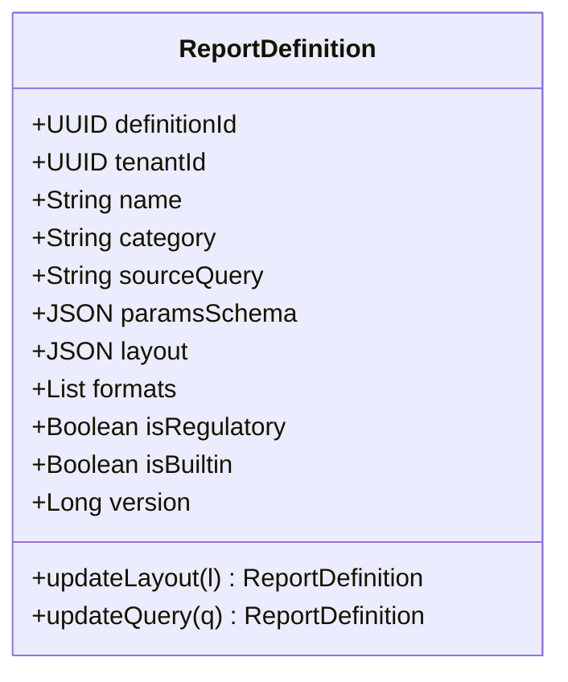
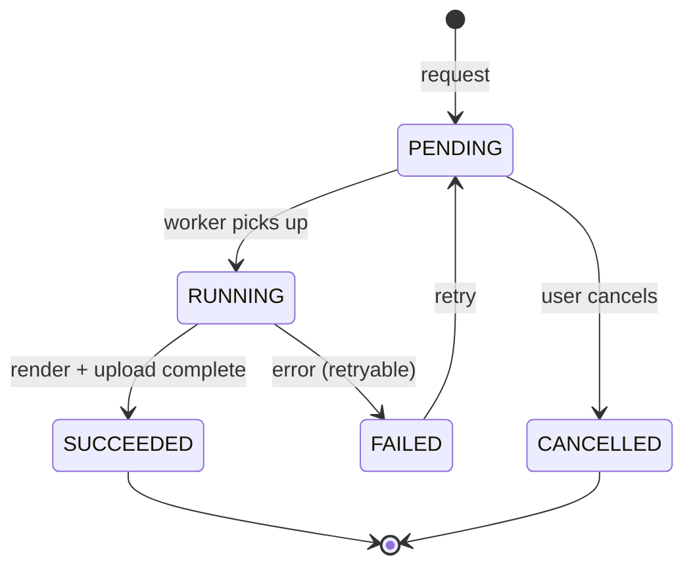
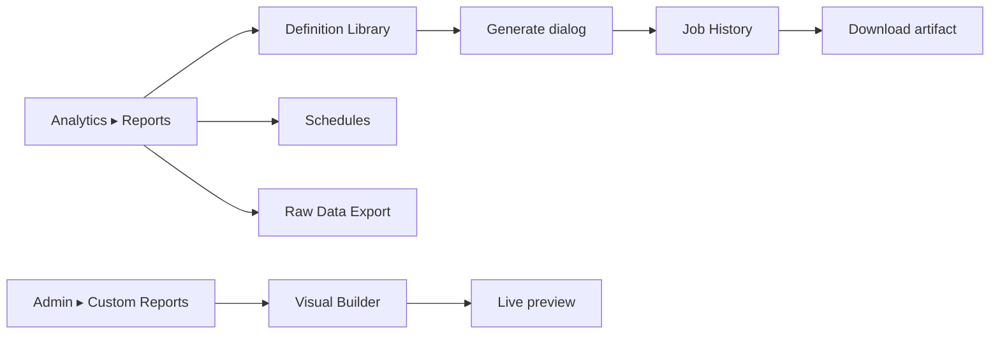

# Reporting Module
## Module-Level Design Document

**Version:** 2.0.0
**Status:** Approved — Foundation-Aligned
**Date:** 2026-08-02
**Bounded Context:** Analytics & Reporting (Report Generation Sub-Domain)
**Service:** `report-generation-service` (Spring Boot 3.3 + Kotlin 2.0, JVM 21)
**Data Store:** PostgreSQL 16 (`analytics` schema — report jobs, definitions, schedules) · ClickHouse (primary source — facts, rollups) · S3 / MinIO (rendered artifacts: PDF/XLSX/CSV) · Redis (job queue, render cache)
**Rendering:** Headless Chromium (PDF/HTML) · Apache POI (XLSX) · CSV writer · Plotly/visx charts server-side
**Messaging:** Kafka (`fleetvision.analytics.report.events`)
**Authorization:** Open Policy Agent (OPA)

> **Relationship to foundation.** This module is the deep-dive on **report generation** within the Analytics & Reporting context (`02_Domain_Model.md` §1, Context 15). It owns the `ReportDefinition`, `ReportJob`, and `ReportSchedule` aggregates and is the authoritative emitter of `analytics.report.*` events on `fleetvision.analytics.report.events`. The sibling `analytics-engine` (Python) owns **ML models and predictions**; this module (Kotlin) owns **deterministic report assembly and rendering**. Conforms to ADR-002 (Kafka), ADR-006 (Kotlin — explicitly not Python; this is an orchestration/rendering service, not ML), ADR-008 (polyglot — ClickHouse primary source), ADR-016 (single topic convention). The split resolves the prior ambiguity where `analytics-engine` and `report-generation-service` language overlapped (ARR ARCH-10): **Kotlin here, Python in analytics-engine.**

---

## Table of Contents

1. [Business Analysis](#1-business-analysis)
2. [Domain Model](#2-domain-model)
3. [Database](#3-database)
4. [Entities](#4-entities)
5. [APIs](#5-apis)
6. [Security](#6-security)
7. [Permissions](#7-permissions)
8. [Sequence Diagrams](#8-sequence-diagrams)
9. [UI Flow](#9-ui-flow)
10. [Scalability](#10-scalability)

---

## 1. Business Analysis

### 1.1 Purpose

Fleet operators run on reports — the daily utilization report, the weekly safety scorecard, the monthly fuel-efficiency comparison, the FMCSA-mandated HOS compliance report, the quarterly TCO breakdown. The Reporting module is the platform's **deterministic data-product factory**: it turns the rich event store (ClickHouse facts) into scheduled and on-demand **documents** (PDF, XLSX, CSV) and **embedded dashboards**, delivered to operators, executives, auditors, and regulators.

Where `analytics-engine` answers "what will happen?" (predictions), Reporting answers **"what happened, exactly, and here it is as a document."** It is the *Openness* pillar's data-export backbone and the *Trust* pillar's compliance-report enabler.

### 1.2 Goals & Non-Goals

| Goals | Non-Goals |
|---|---|
| Generate any report from any ClickHouse fact set | ML predictions (analytics-engine owns) |
| Schedule recurring reports (daily/weekly/monthly) | Real-time dashboards (analytics-engine + frontend) |
| Deliver via email, in-app, S3, webhook | Ad-hoc OLAP exploration (a BI tool's job) |
| FMCSA/DOT regulatory report formats | Replacing the customer's ERP/accounting |
| Multi-format render (PDF/XLSX/CSV/HTML) | Building a charting library (use existing) |
| Per-tenant custom report builder | Storing raw events (ClickHouse owns) |

### 1.3 Report Types

| Category | Examples | Trigger |
|---|---|---|
| **Operational** | Daily utilization, idle summary, trip log, driver behavior | Scheduled / on-demand |
| **Safety** | Safety scorecard, HOS compliance, incident register, DVIR log | Scheduled / regulatory |
| **Compliance** | FMCSA HOS report (RDS), DVIR retention, ELD malfunction, IFTA quarterly | Regulatory schedule |
| **Maintenance** | PM compliance, work-order history, DTC summary, cost analysis | Scheduled / on-demand |
| **Fuel** | Fuel efficiency, transaction log, fraud review | Scheduled / on-demand |
| **Financial** | TCO breakdown, depreciation schedule, cost-per-vehicle | Monthly / quarterly |
| **Asset** | Asset register, lifecycle status, disposal log | On-demand |
| **Executive** | KPI scorecard, fleet comparison, trend analysis | Monthly / quarterly |

### 1.4 Functional Requirements

| ID | Requirement | Priority |
|---|---|---|
| REP-FR-01 | On-demand report generation (user picks template + params + range) | Must |
| REP-FR-02 | Scheduled recurring reports (cron) with delivery | Must |
| REP-FR-03 | Multi-format output: PDF, XLSX, CSV, HTML | Must |
| REP-FR-04 | Parameterized templates (date range, fleet, vehicle group, driver) | Must |
| REP-FR-05 | Delivery: email, in-app notification, S3, webhook | Must |
| REP-FR-06 | FMCSA regulatory report formats (HOS, DVIR, IFTA) | Must (P3) |
| REP-FR-07 | Per-tenant custom report builder (visual) | Should |
| REP-FR-08 | Embedded dashboards (live, vs static reports) | Should |
| REP-FR-09 | Report versioning + history | Must |
| REP-FR-10 | Large-report async (job pattern, > 10s render) | Must |
| REP-FR-11 | Export raw data (CSV/Parquet) for any fact set | Must |
| REP-FR-12 | Multi-tenant + multi-region (data-residency-aware) | Must |

### 1.5 Non-Functional Requirements

| Attribute | Target |
|---|---|
| On-demand render (small, < 1K rows) | < 30s P99 |
| Scheduled large report (10K vehicles, monthly) | < 5 min |
| Regulatory report (FMCSA monthly) | < 10 min |
| Availability | 99.9% (Tier 1; degradation = delayed reports, not outage) |
| Concurrency | 100 concurrent render jobs per region |
| Artifact durability | 11-nines (S3) |

### 1.6 Business Rules

| ID | Rule |
|---|---|
| REP-BR-01 | Reports source from ClickHouse (aggregated facts), never from hot OLTP |
| REP-BR-02 | Regulatory reports (FMCSA) are immutable + hash-signed once generated |
| REP-BR-03 | Scheduled reports respect timezone of the tenant's locale |
| REP-BR-04 | Large reports (> 10K rows or > 10s render) run async via the job pattern |
| REP-BR-05 | Report artifacts retained per tier; regulatory reports retained per regulation |
| REP-BR-06 | Data-residency: EU tenant reports rendered from EU ClickHouse replica only |

---

## 2. Domain Model

### 2.1 Sub-Domain Position

```mermaid
graph TB
    subgraph AN["Analytics & Reporting (Context 15)"]
        REP["Reporting<br/>(this module)<br/>assemble + render + deliver"]
        ML["analytics-engine<br/>(sibling)<br/>ML models + predictions]
    end
    CH[(ClickHouse<br/>facts + rollups)] --> REP
    ML --> CH
    REP --> S3[(S3 artifacts)]
    REP --> DEL[email / in-app / webhook]
    SCHED[Scheduler] --> REP
    USER[User / API] --> REP
```

### 2.2 Aggregates Owned

| Aggregate | ES? | Consistency Boundary |
|---|---|---|
| **ReportDefinition** | No | One template/definition (source query, params, layout, format) |
| **ReportJob** | No | One generation attempt (lifecycle, params, artifact) |
| **ReportSchedule** | No | A recurring schedule (cron, definition, recipients, delivery) |

### 2.3 Value Objects

| Value Object | Fields |
|---|---|
| `ReportFormat` | enum PDF / XLSX / CSV / HTML / PARQUET |
| `ReportParams` | dateRange, fleetId?, vehicleIds?, driverIds?, groupBy?, filters |
| `ReportLayout` | sections, charts, tables, header, footer, branding |
| `ReportSource` | clickhouseQuery, parameters, expectedSchema |
| `DeliverySpec` | channels (email/in-app/s3/webhook), recipients, format |

### 2.4 Domain Events

All CloudEvents, Avro, on **`fleetvision.analytics.report.events`** (ADR-016), partitioned by `tenant_id`.

| Event | Trigger | Consumers |
|---|---|---|
| `analytics.report.requested.v1` | User/scheduler requests | Job processor |
| `analytics.report.generation.started.v1` | Job picked up, data queried | Audit |
| `analytics.report.generated.v1` | Render complete, artifact in S3 | Notification (delivery), audit |
| `analytics.report.failed.v1` | Generation failed | Notification, audit |
| `analytics.report.delivered.v1` | Sent to recipient channel | Audit |
| `analytics.report.schedule.created.v1` / `.updated.v1` / `.deleted.v1` | Schedule lifecycle | Scheduler, audit |

### 2.5 Domain Services

| Service | Responsibility |
|---|---|
| `ReportDefinitionService` | Template CRUD; built-in + custom |
| `ReportAssemblyService` | Query ClickHouse → dataset → apply layout → render |
| `RenderEngine` | Format-specific renderers (PDF via Chromium, XLSX via POI, CSV, HTML) |
| `SchedulerService` | Cron-driven schedule execution; timezone-aware |
| `DeliveryService` | Hand-off to notification-service (email/in-app) + S3 + webhook |

### 2.6 Ubiquitous Language

| Term | Definition |
|---|---|
| ReportDefinition | A reusable template: source query, params, layout, format |
| ReportJob | One generation attempt (on-demand or schedule-fired) |
| ReportSchedule | A recurring cron-attached request |
| Artifact | The rendered file (PDF/XLSX/CSV) in S3 |
| Fact | A row in ClickHouse (e.g., `fact_gps_daily`) |
| Rollup | A pre-aggregated ClickHouse materialized view |
| Regulatory report | A compliance-mandated report (FMCSA HOS, IFTA) — immutable + signed |

---

## 3. Database

Schema `analytics` in PostgreSQL (definitions, jobs, schedules — control plane); ClickHouse (data source); S3 (artifacts); Redis (job queue).

### 3.1 PostgreSQL Tables

```sql
analytics.report_definitions (
  definition_id UUID PK, tenant_id UUID, name TEXT, category TEXT,
  source_query TEXT NOT NULL,            -- parameterized ClickHouse SQL
  params_schema JSONB NOT NULL,          -- expected parameters + types
  layout JSONB NOT NULL,                 -- sections, charts, tables
  formats TEXT[] NOT NULL,               -- PDF, XLSX, CSV, ...
  is_regulatory BOOLEAN DEFAULT false,
  is_builtin BOOLEAN DEFAULT false,      -- seeded template
  version BIGINT, created_at, updated_at
)

analytics.report_jobs (
  job_id UUID PK, tenant_id UUID,
  definition_id UUID, params JSONB, formats TEXT[],
  status TEXT NOT NULL,                  -- PENDING / RUNNING / SUCCEEDED / FAILED / CANCELLED
  requested_by UUID,                     -- user or 'SCHEDULER'
  started_at, completed_at TIMESTAMPTZ,
  artifact_s3_key TEXT, artifact_format TEXT, artifact_bytes BIGINT,
  artifact_hash TEXT,                    -- integrity (esp. regulatory)
  row_count INT, duration_ms INT,
  error TEXT, retry_count INT,
  created_at
) PARTITION BY RANGE (created_at)

analytics.report_schedules (
  schedule_id UUID PK, tenant_id UUID,
  definition_id UUID, params JSONB, cron TEXT NOT NULL,
  timezone TEXT NOT NULL,                -- tenant locale
  delivery JSONB NOT NULL,               -- channels + recipients
  enabled BOOLEAN, next_run_at TIMESTAMPTZ,
  last_run_at, last_job_id UUID,
  version BIGINT
)

analytics.report_artifacts (
  artifact_id UUID PK, tenant_id UUID, job_id UUID,
  s3_key TEXT, format TEXT, bytes_size BIGINT, hash TEXT,
  created_at, expires_at                 -- retention per tier
) PARTITION BY RANGE (created_at)
```

**Partitioning** (`03_Database_Architecture.md` §8): `report_jobs` + `report_artifacts` monthly range-partitioned (high churn). **Indexes:** `(tenant_id, category)` on definitions; `(tenant_id, status, created_at)` on jobs; `(tenant_id, next_run_at) WHERE enabled` on schedules.

### 3.2 ClickHouse Sources (Fact Tables)

Reports read from ClickHouse fact tables populated by `analytics-engine` projections (all on the canonical event stream):

| Fact table | Grain | Use |
|---|---|---|
| `fact_gps_daily` | vehicle × day | utilization, distance, idle |
| `fact_fuel_monthly` | vehicle × month | fuel efficiency, cost |
| `fact_maintenance_costs` | vehicle × workorder | maintenance cost |
| `fact_speed_hourly` | vehicle × hour | speed profile, overspeed |
| `fact_behavior_daily` | driver × day | behavior score |
| `fact_hos_daily` | driver × day | HOS compliance, violations |
| `fact_incidents` | incident | safety |
| `fact_geofence_events` | vehicle × geofence × event | site analytics |
| `fact_video_ai` | camera × alert | AI analytics |

### 3.3 Redis Keyspace

| Key | Type | TTL | Purpose |
|---|---|---|---|
| `report:queue` | Sorted Set (by priority/time) | — | Async render job queue |
| `report:sched:<scheduleId>` | Hash | next run | Schedule state cache |
| `report:render:cache:<hash>` | String (artifact ref) | 1h | Identical-request render cache |

---

## 4. Entities

### 4.1 ReportDefinition Aggregate



**Invariants:** (i) `sourceQuery` parameterized + validated against params schema; (ii) regulatory definitions immutable post-publish; (iii) builtin definitions tenant-agnostic (system seed).

### 4.2 ReportJob Aggregate (Lifecycle)



**Invariants:** (i) SUCCEEDED requires `artifact_s3_key` + `hash`; (ii) regulatory jobs' artifacts immutable + hash-signed once SUCCEEDED; (iii) retry_count ≤ maxRetries (3).

### 4.3 ReportSchedule Aggregate

```kotlin
data class ReportSchedule(
    val scheduleId: UUID, val tenantId: UUID,
    val definitionId: UUID, val params: ReportParams,
    val cron: String, val timezone: String,
    val delivery: DeliverySpec,
    val enabled: Boolean,
    val nextRunAt: Instant?, val lastRunAt: Instant?, val lastJobId: UUID?,
    val version: Long
)
// INV: cron valid; timezone matches tenant locale; delivery has ≥1 channel
```

---

## 5. APIs

Endpoints under `/api/v1/reports`. REST contracts follow `API_Design.md` (async job pattern for large renders).

### 5.1 REST Endpoints

| Method | Endpoint | Description | Permission |
|---|---|---|---|
| `GET` | `/reports/definitions` | List definitions (filter: category, builtin) | `analytics.report.read` |
| `GET` | `/reports/definitions/{id}` | Definition detail (params schema) | `analytics.report.read` |
| `POST` | `/reports/definitions` | Create custom definition | `analytics.report.manage` |
| `PUT` | `/reports/definitions/{id}` | Update custom | `analytics.report.manage` |
| `DELETE` | `/reports/definitions/{id}` | Delete custom (builtin: deny) | `analytics.report.manage` |
| `POST` | `/reports/generate` | Generate on-demand → async job | `analytics.report.generate` |
| `GET` | `/reports/jobs` | List jobs (filter: status, range) | `analytics.report.read` |
| `GET` | `/reports/jobs/{id}` | Job status + artifact URL (when SUCCEEDED) | `analytics.report.read` |
| `DELETE` | `/reports/jobs/{id}` | Cancel pending job | `analytics.report.generate` |
| `GET` | `/reports/jobs/{id}/artifact` | Download artifact (signed URL) | `analytics.report.read` |
| `GET` | `/reports/schedules` | List schedules | `analytics.report.read` |
| `POST` | `/reports/schedules` | Create schedule | `analytics.report.schedule` |
| `PUT` / `DELETE` | `/reports/schedules/{id}` | Update / delete | `analytics.report.schedule` |
| `POST` | `/reports/schedules/{id}:run` | Trigger schedule now | `analytics.report.schedule` |
| `GET` | `/reports/artifacts` | List retained artifacts | `analytics.report.read` |
| `POST` | `/reports/export` | Raw data export (CSV/Parquet) | `analytics.report.export` |

### 5.2 Sample — Generate (Async)

```http
POST /api/v1/reports/generate
Authorization: Bearer <jwt>
Idempotency-Key: 7f2c…
Content-Type: application/json

{
  "data": {
    "type": "reportJob",
    "attributes": {
      "definitionId": "550e…",
      "params": { "dateFrom": "2026-07-01", "dateTo": "2026-07-31", "fleetId": "660e…" },
      "formats": ["PDF", "XLSX"]
    }
  }
}

202 Accepted
Location: /api/v1/reports/jobs/{jobId}

{
  "data": {
    "id":"…", "type":"reportJob",
    "attributes": { "status":"PENDING", "requestedBy":"…" },
    "links": { "self": "/reports/jobs/{jobId}" }
  }
}

# Poll or receive webhook → 200 with artifact_s3_key when SUCCEEDED
```

### 5.3 gRPC (Internal)

```protobuf
service ReportingService {
  rpc GenerateReport  (GenerateRequest)   returns (JobAck);
  rpc GetJobStatus    (JobStatusRequest)  returns (JobStatus);
  rpc GetArtifactUrl  (ArtifactRequest)   returns (SignedUrl);
  rpc ListSchedules   (SchedulesRequest)  returns (SchedulesPage);
}
```

---

## 6. Security

### 6.1 Tenant Isolation

Every definition/job/schedule is `tenant_id`-scoped (INV-I01); queries are parameterized with `tenant_id` injected from JWT (never user-supplied). ClickHouse queries execute as a tenant-scoped role.

### 6.2 Data Residency (EU)

EU tenant reports render from **EU ClickHouse replica only** — the job is routed to the EU region's report-generation-service; cross-region ClickHouse queries forbidden. Artifacts land in EU S3.

### 6.3 Regulatory Report Integrity

FMCSA/regulatory artifacts are **immutable + hash-signed** once generated (similar to evidence clips & HOSLog): `artifact_hash = SHA256(bytes)` + signed by report-generation-service key (Vault). Stored indefinitely per regulation; tamper-evident.

### 6.4 Artifact Access

Artifact downloads via **short-lived signed S3 URLs** (15-min TTL), gated by the requesting user's authorization (must have `analytics.report.read` on the tenant). Revoked users lose access immediately (URL expires).

### 6.5 Query Safety

User-defined custom-report source queries are **sandboxed**: read-only ClickHouse role, query timeout (60s), row-limit cap (1M), tenant-predicate enforced at the connection level. No DDL, no cross-tenant.

---

## 7. Permissions

Canonical from `02_Domain_Model.md` §6 — not redefined.

| Permission | Used For |
|---|---|
| `analytics.report.read` | List/view definitions, jobs, schedules, artifacts |
| `analytics.report.generate` | Trigger on-demand generation |
| `analytics.report.schedule` | CRUD schedules |
| `analytics.report.manage` | CRUD custom definitions |
| `analytics.report.export` | Raw data export |

Role mapping: most operational roles get `.read` + `.generate`; `tenant-admin`/`fleet-admin` get `.schedule` + `.manage`; auditors get `.read` + `.export` on compliance reports.

---

## 8. Sequence Diagrams

### 8.1 On-Demand Report (Async)

```mermaid
sequenceDiagram
    autonumber
    participant U as User
    participant API as report-generation-service
    participant Q as Redis queue
    participant CH as ClickHouse
    participant R as RenderEngine
    participant S3
    participant K as Kafka
    participant NT as notification-service

    U->>API: POST /reports/generate (definition, params, formats)
    API->>API: validate; inject tenant_id into params
    API->>API: create ReportJob (PENDING)
    API->>Q: ZADD report:queue
    API-->>U: 202 (job URL)
    Q-->>API: worker picks up job
    API->>API: job → RUNNING
    API->>CH: execute sourceQuery (tenant-scoped role)
    CH-->>API: dataset
    API->>R: render(dataset, layout, format)
    R-->>API: PDF + XLSX bytes
    API->>S3: PUT artifacts (hash on upload)
    API->>API: job → SUCCEEDED (artifact_s3_key, hash)
    API->>K: analytics.report.generated.v1
    K-->>NT: deliver in-app + email
    U->>API: GET /reports/jobs/{id} → artifact URL
```

### 8.2 Scheduled Report

```mermaid
sequenceDiagram
    autonumber
    participant SCHED as Scheduler
    participant API as report-generation-service
    participant DB as PostgreSQL
    participant Q as Redis queue

    loop every minute
        SCHED->>DB: SELECT schedules WHERE next_run_at <= now AND enabled
        loop each due schedule
            SCHED->>API: enqueue job (definition, params, delivery)
            API->>Q: ZADD report:queue (priority=scheduled)
            API->>DB: schedule.last_run_at = now; next_run_at = cron.next
        end
    end
    Note over API,Q: Worker processes same as on-demand (8.1)
    Note over API: On SUCCEEDED, delivery per schedule.delivery spec
```

### 8.3 Regulatory Report (FMCSA HOS Monthly)

```mermaid
sequenceDiagram
    autonumber
    participant TRIG as Schedule (FMCSA monthly)
    participant API as report-generation-service
    participant CH as ClickHouse
    participant S3
    participant VAULT as Vault
    participant K as Kafka

    TRIG->>API: regulatory job (definition=fmcsa_hos_monthly)
    API->>CH: query fact_hos_daily (tenant, month)
    CH-->>API: HOS records
    API->>API: render FMCSA-canonical PDF (fixed format)
    API->>S3: PUT artifact
    API->>API: hash = SHA256(bytes)
    API->>VAULT: sign hash (report key)
    API->>API: artifact.signed = true; immutable
    API->>K: analytics.report.generated.v1 (regulatory=true)
    Note over API,S3: Retained per regulation (≥ 6 months FMCSA; we keep 7y)
```

---

## 9. UI Flow

### 9.1 Surface Map



### 9.2 Report Library

Categorized list (Operational / Safety / Compliance / Maintenance / Fuel / Financial / Asset / Executive) with builtin templates + tenant custom. Click → **Generate dialog**: pick params (date range, fleet, vehicle group, driver), format (PDF/XLSX/CSV), then "Generate" → async job with progress; ready → download or email-link.

### 9.3 Schedule Manager

List of recurring schedules with next-run, last-run status, recipients, edit/pause/delete. "Run now" button for immediate trigger.

### 9.4 Visual Report Builder (Custom)

Drag-drop builder: pick a fact table → columns → filters → group-by → chart type → layout → save as custom definition. Live preview against a sampled dataset. Tenant admins save/share definitions.

### 9.5 Embedded Dashboards (vs Reports)

For live (non-document) needs, the Analytics module exposes **dashboards** (widgets streaming from ClickHouse via WebSocket). Reports are point-in-time documents; dashboards are live — both surfaced under Analytics.

---

## 10. Scalability

### 10.1 Load Profile

| Path | Year 1 | Year 5 |
|---|---|---|
| On-demand renders/day | ~500 | ~10,000 |
| Scheduled renders/day | ~200 | ~5,000 |
| Concurrent render jobs | ~10 | ~100 |
| Largest report (rows) | ~10K | ~1M (fleet-wide annual) |

### 10.2 Scaling Mechanisms

| Component | Mechanism | Trigger |
|---|---|---|
| `report-generation-service` | HPA on queue depth + CPU | queue > 20 jobs |
| Render workers | Pool sizing per format (PDF/Chromium CPU-bound) | CPU > 70% |
| ClickHouse | Sharded + replicated (existing) | query latency |
| Artifact storage | S3 elastic + lifecycle | — |
| Scheduler | Partitioned by tenant | — |

### 10.3 Async Job Pattern (Critical)

All renders run **async** via Redis queue (per `API_Design.md` §2.9). On-demand returns `202 + job URL`; client polls or receives webhook. Prevents HTTP timeout on large regulatory reports; allows retry on transient ClickHouse/Chromium failures.

### 10.4 Failure Modes

| Failure | Response |
|---|---|
| Pod crash | K8s reschedule; in-flight jobs retried from queue |
| ClickHouse slow/unavailable | job FAILED; retry (≤3); alert; scheduled reports deferred |
| Chromium crash (PDF render) | fallback renderer or format; retry |
| S3 write fail | retry; never mark SUCCEEDED without artifact |
| Scheduler miss | reconciliation loop detects overdue `next_run_at`; catch-up |

### 10.5 Capacity Headroom

2× headroom (vision guardrail); render pipeline load-tested at 10× projected; quarterly chaos (Chromium pool drain, ClickHouse replica loss). Regulatory reports prioritized in the queue (higher priority score).

---

## Appendix A: Event Catalog

| Event | Topic |
|---|---|
| `analytics.report.requested.v1` | `fleetvision.analytics.report.events` |
| `analytics.report.generation.started.v1` | `fleetvision.analytics.report.events` |
| `analytics.report.generated.v1` | `fleetvision.analytics.report.events` |
| `analytics.report.failed.v1` | `fleetvision.analytics.report.events` |
| `analytics.report.delivered.v1` | `fleetvision.analytics.report.events` |
| `analytics.report.schedule.created/updated/deleted.v1` | `fleetvision.analytics.report.events` |

## Appendix B: Traceability

| Foundation Element | This Module |
|---|---|
| `00` Openness pillar (data export) | §1.1 |
| `00` Trust pillar (FMCSA compliance reports) | §1.3, §6.3 |
| `01` §3 Service Registry #20 (report-generation-service) | §1 header |
| `01` §6 Single topic convention (ADR-016) | Appendix A |
| `02` §1 Context 15 (Analytics & Reporting) | §2.1 |
| `02` §6 Permission catalog (`analytics.report.*`) | §7 |
| `03` §2 ClickHouse as OLAP source | §3.2 |
| ARR ARCH-10 (report-gen language: Kotlin, not Python) | §1 header |
| ADR-002, ADR-006, ADR-008, ADR-016 | Throughout |

---

*This Reporting module is the report-generation sub-domain. Maintained alongside `Modules/Analytics-Reporting.md` (parent — analytics-engine + dashboards) and consistent with the v2.0.0 foundation.*
