# Tenant Management Module
## Module-Level Design Document

**Version:** 2.0.0
**Status:** Approved — Foundation-Aligned
**Date:** 2026-08-02
**Bounded Context:** Billing & Tenant Management (Tenant Sub-Domain)
**Service:** `billing-service` (Spring Boot 3.3 + Kotlin 2.0, JVM 21)
**Data Store:** PostgreSQL 16 (`billing` schema) · Redis 7 (quota counters, provisioning state)
**Messaging:** Kafka (`fleetvision.billing.tenant.events`)
**Payments:** Stripe / Adyen · **Tax:** Avalara
**Authorization:** Open Policy Agent (OPA)

> **Relationship to foundation.** This module is the deep-dive on **tenant lifecycle, isolation provisioning, and quota enforcement** within the Billing & Tenant Management context (`02_Domain_Model.md` §1, Context 2). It owns the `Tenant` and `UsageMeter` aggregates (canonical per `02_Domain_Model.md` §3.2) and is the authoritative emitter of the `billing.tenant.*` and `billing.quota.*` event families on `fleetvision.billing.tenant.events`. It conforms to ADR-002 (Kafka), ADR-003 (3-tier multi-tenancy), ADR-006 (Kotlin/Spring), ADR-009 (OPA), ADR-016 (single topic-naming convention). The sibling `Modules/Billing-Tenant-Management.md` owns invoicing, subscriptions, payments; this module owns **tenant identity, lifecycle, and resource governance**. It supersedes the tenant-management portions of any prior billing doc.

---

## Table of Contents

1. [Business Analysis](#1-business-analysis)
2. [Domain Model](#2-domain-model)
3. [Database](#3-database)
4. [Entities](#4-entities)
5. [APIs](#5-apis)
6. [Security](#6-security)
7. [Permissions](#7-permissions)
8. [Sequence Diagrams](#8-sequence-diagrams)
9. [UI Flow](#9-ui-flow)
10. [Scalability](#10-scalability)

---

## 1. Business Analysis

### 1.1 Purpose

Tenant Management is the **governance spine** of FleetVision's multi-tenant SaaS. It defines *who the customer is as an isolated unit*, *what resources they may consume*, *how their data is isolated*, and *how their lifecycle (onboard → active → suspended → deprovision) propagates across all 20 services*. Every other context depends on Tenant for isolation boundaries (INV-I01) and quota decisions. Tenant is upstream of every operational context (Customer-Supplier pattern, `02_Domain_Model.md` §2).

This module is the foundation of the *Scale* pillar (multi-tenant economics, cost-per-vehicle declining) and the *Trust* pillar (isolation by construction, GDPR erasure).

### 1.2 Business Goals & Success Criteria

| Goal | Success Criterion | Vision Link |
|---|---|---|
| Isolation guaranteed by construction | 0 cross-tenant data leaks; pen-test verified | Trust |
| Onboarding is fast | Provisioning < 5 min (contract → first login) | Simplicity |
| Quota abuse contained | No tenant can degrade another (noisy-neighbor prevention) | Scale |
| Suspension is surgical | Suspended tenant's data preserved; reactivation < 1 min | Trust |
| Erasure is verifiable | GDPR DSAR fulfilled within 30 days; cryptographically provable | Trust |
| Cost attribution accurate | Per-tenant cost attribution via Kubecost; 100% tenants tagged | Scale |

### 1.3 Stakeholders & Personas

| Persona | Tenant-Management Need |
|---|---|
| **Tenant Admin** | Manage own tenant config, users, retention, branding |
| **FleetVision SaaS Ops** | Provision/suspend/deprovision tenants; incident response |
| **Cautious Chris** (customer IT/Security) | Evidence of isolation, data residency, erasure |
| **Finance** | Tier, quota, overages, billing boundaries |
| **Compliance Officer** | Retention policy per regulation; legal hold |
| **Architect / ARB** | Isolation model authoritative source |

### 1.4 Tiers (per `01_Master_Architecture.md` §8.1)

| Tier | Profile | Isolation | DB Strategy | Quota Vehicle |
|---|---|---|---|---|
| **Enterprise** | 1,000+ vehicles; regulated | Dedicated instance | Dedicated PostgreSQL + TimescaleDB + Redis | Custom contract |
| **Professional** | 100–1,000 vehicles | Schema isolation | Shared PG instance; dedicated schema per tenant | Tier caps |
| **Standard** | < 100 vehicles | Row-Level Security | Shared DB + schema; `tenant_id` + RLS | Tier caps |

### 1.5 Functional Requirements

| ID | Requirement | Priority |
|---|---|---|
| TEN-FR-01 | Create a new tenant with tier, region, retention | Must |
| TEN-FR-02 | Provision tenant across all 20 services (orchestrated) | Must |
| TEN-FR-03 | Configure data-retention policy per tenant (subject to regulatory minimums) | Must |
| TEN-FR-04 | Configure data residency (region pin) | Must |
| TEN-FR-05 | Real-time quota enforcement (vehicles, GPS/s, API/min, storage) | Must |
| TEN-FR-06 | Quota-breach events to API Gateway for rate-limiting | Must |
| TEN-FR-07 | Suspend tenant (quota breach / non-payment) preserving data | Must |
| TEN-FR-08 | Reactivate suspended tenant | Must |
| TEN-FR-09 | Deprovision tenant with GDPR erasure (crypto-shredding) | Must |
| TEN-FR-10 | Legal hold (suspend erasure for litigation) | Must |
| TEN-FR-11 | Per-tenant feature flags (tier-driven) | Must |
| TEN-FR-12 | Branding (white-label: logo, color, subdomain) — Enterprise | Should |
| TEN-FR-13 | Tenant-admin self-service: users, retention, branding | Should |
| TEN-FR-14 | Data Subject Access Request (DSAR) / Right to Erasure workflow | Must |

### 1.6 Non-Functional Requirements

| Attribute | Target |
|---|---|
| Tenant resolution latency (per request) | < 5 ms (Redis-cached) |
| Quota check latency | < 10 ms P99 (Redis atomic) |
| Provisioning time (new tenant) | < 5 min end-to-end |
| Suspension propagation | < 60s global (all services) |
| Availability | 99.99% (Tier-0 — tenant lookup is on every request path) |
| Erasure completeness | 100% (cryptographically verifiable) |

### 1.7 Business Rules

| ID | Rule | Enforcement |
|---|---|---|
| TEN-BR-01 | Tenant ID derived from provisioning flow; immutable | Aggregate invariant |
| TEN-BR-02 | Tier determines isolation strategy (Enterprise/Professional/Standard) | Provisioning orchestrator |
| TEN-BR-03 | Telemetry retention tier-driven (6 mo Standard / 24 mo Pro); compliance retention regulation-driven, non-negotiable | `03_Database_Architecture.md` §12.3 |
| TEN-BR-04 | EU tenant data never leaves `eu-west-1` (region pin) | INV-I01 + routing |
| TEN-BR-05 | Quota soft-limit alert at 80%, hard-limit block at 100% | `UsageMeter` |
| TEN-BR-06 | Suspended tenant: API Gateway blocks all but billing; data preserved | `billing.tenant.suspended.v1` consumer at gateway |
| TEN-BR-07 | Deprovision: 90-day retention buffer before hard delete | Lifecycle state machine |
| TEN-BR-08 | Erasure via crypto-shredding (destroy tenant KEK); audit preserved anonymized | Vault |
| TEN-BR-09 | Legal hold overrides erasure until released | `legal_hold` flag |
| TEN-BR-10 | Quota increments atomic (no race-induced overage) | Redis INCR + `UsageMeter` |
| TEN-BR-11 | Tier changes propagate to all services within 60s | Event-driven |

---

## 2. Domain Model

### 2.1 Sub-Domain Position

Tenant Management is a **Supporting Sub-Domain (revenue + trust critical)** within the Billing & Tenant Management context. It is **upstream of every operational context** (Customer-Supplier): all contexts conform to consume tenant/quota events.

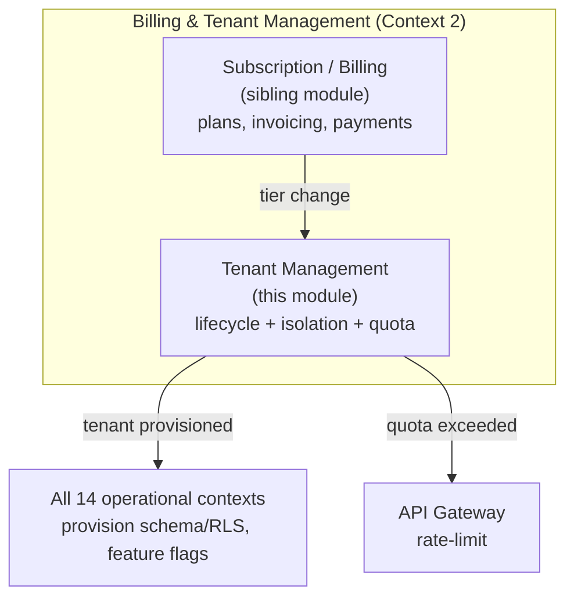

### 2.2 Aggregates Owned

Per `02_Domain_Model.md` §3.2, this module owns the `Tenant` and `UsageMeter` aggregates. (Invoice/Subscription/Payment aggregates belong to the sibling subscription/billing module.)

| Aggregate | ES? | Consistency Boundary |
|---|---|---|
| **Tenant** | No | One tenant's identity, tier, region, lifecycle, retention, config |
| **UsageMeter** | No | Atomic counters per (tenant, resource); quota enforcement |

### 2.3 Value Objects

| Value Object | Fields | Validation |
|---|---|---|
| `TenantId` | `value: UUID` | Non-null; immutable |
| `Tier` | enum `STANDARD, PROFESSIONAL, ENTERPRISE` | Drives isolation + quotas |
| `Region` | enum `US_EAST_1, EU_WEST_1, AP_SOUTHEAST_1, ...` | Region pin |
| `RetentionPolicy` | `telemetryDays`, `auditCategoryOverrides` | telemetry tier-driven; audit regulation-driven |
| `QuotaLimit` | `metric, softLimit, hardLimit, period` | soft < hard |
| `UsageCounter` | `metric, current, periodStart` | Atomic increments |
| `FeatureFlag` | `key, enabled, tierGate` | Tier-driven |
| `TenantConfig` | `Map<String,String>` | Branding, custom |

### 2.4 Domain Events

All CloudEvents-wrapped, Avro-encoded, on **`fleetvision.billing.tenant.events`** (ADR-016), partitioned by `tenant_id`.

| Event | Trigger | Consumers |
|---|---|---|
| `billing.tenant.provisioned.v1` | New tenant created | All 14 operational contexts (provision schema/RLS, seed defaults) |
| `billing.tenant.activated.v1` | Tenant goes live | Notification, Analytics |
| `billing.tenant.suspended.v1` | Quota breach / non-payment | API Gateway (block), all services (reject writes) |
| `billing.tenant.reactivated.v1` | Suspension lifted | API Gateway, all services |
| `billing.tenant.tier.changed.v1` | Upgrade/downgrade | All services (re-evaluate isolation/quotas/feature flags) |
| `billing.tenant.deprovisioned.v1` | End of contract | All services (purge per retention), Audit (preserve anonymized) |
| `billing.quota.exceeded.v1` | Hard limit crossed | API Gateway (rate-limit), Notification |
| `billing.quota.warning.v1` | Soft limit (80%) crossed | Notification |
| `billing.tenant.region.changed.v1` | Region migration (rare) | Data-plane migration orchestrator |
| `billing.tenant.legal.hold.v1` / `.released.v1` | Litigation hold | Audit, erasure-blocking |

### 2.5 Domain Services

| Service | Responsibility |
|---|---|
| `TenantProvisioningService` | Orchestrates provisioning across 20 services (saga) |
| `QuotaEnforcementService` | Real-time check + increment; emits warning/exceeded |
| `TenantLifecycleService` | State-machine transitions (suspend/reactivate/deprovision) |
| `ErasureService` | GDPR DSAR / right-to-erasure; crypto-shredding |
| `FeatureFlagService` | Tier-driven flag resolution |

### 2.6 Ubiquitous Language (Tenant-Specific)

| Term | Definition |
|---|---|
| Tenant | Independent organizational entity using the platform; isolated data, config, billing |
| Tier | Subscription level (Standard/Professional/Enterprise) determining isolation + quotas |
| Provisioning | Creating a tenant's footprint across all services (schema, RLS, defaults) |
| Isolation | Guarantee that one tenant cannot access/affect another's data (INV-I01) |
| Quota | Per-tenant resource limit (vehicles, GPS/s, API/min, storage) |
| Usage Meter | Atomic counter tracking consumption against quota |
| Soft limit | Threshold (80%) triggering a warning |
| Hard limit | Threshold (100%) triggering enforcement (block) |
| Crypto-shredding | Erasure by destroying the tenant's encryption key (data becomes unreadable) |
| Legal hold | Directive suspending erasure for litigation |
| Region pin | Data-residency constraint (tenant's data stays in its home region) |
| Feature flag | Tier-gated capability toggle |
| Noisy neighbor | A tenant whose load degrades others — prevented by quotas |

---

## 3. Database

Schema `billing` in PostgreSQL (primary); Redis for hot counters. RLS applies on `tenant_id` for Standard tier. **The `tenants` table is special** — it must be readable cross-tenant for routing/resolution (with strict column projection); RLS here is "tenant can see only its own row, but platform services see all."

### 3.1 Store Usage

| Store | Role |
|---|---|
| **PostgreSQL** (`billing`) | Tenant registry, configurations, quota definitions, provisioning state, usage snapshots |
| **Redis** | Real-time usage counters (atomic INCR), tenant-resolution cache, provisioning-state cache |
| **Vault** | Per-tenant KEK (key-encryption key) for crypto-shredding erasure |
| **S3** | Erasure backup manifests; tenant-scoped object prefixes |

### 3.2 PostgreSQL Tables

```sql
-- Tenant registry (special: cross-tenant readable by platform; RLS for tenant-self)
billing.tenants (
  tenant_id UUID PK,
  name TEXT NOT NULL,
  tier TEXT NOT NULL CHECK in ('STANDARD','PROFESSIONAL','ENTERPRISE'),
  region TEXT NOT NULL,                          -- region pin
  status TEXT NOT NULL,                          -- PROVISIONING, ACTIVE, SUSPENDED, DEPROVISIONING, DEPROVISIONED
  retention_telemetry_days INT NOT NULL,         -- tier-driven, configurable within bounds
  retention_audit_overrides JSONB,               -- per-category regulation minimums
  feature_flags JSONB NOT NULL DEFAULT '{}',
  branding JSONB,                                -- logo, color, subdomain (Enterprise)
  legal_hold BOOLEAN NOT NULL DEFAULT false,
  kek_ref TEXT NOT NULL,                         -- Vault KEK reference (crypto-shredding)
  root_org_id UUID,                              -- link to identity.organizations
  home_region TEXT NOT NULL,
  version BIGINT NOT NULL DEFAULT 1,
  created_at TIMESTAMPTZ NOT NULL DEFAULT now(),
  updated_at TIMESTAMPTZ NOT NULL DEFAULT now()
)

-- Quota definitions per tier (overridable per tenant at Enterprise)
billing.tenant_quotas (
  tenant_id UUID, metric TEXT,                   -- VEHICLES, GPS_EVENTS_PER_SEC, API_CALLS_PER_MIN, STORAGE_GB
  soft_limit BIGINT, hard_limit BIGINT, period TEXT,
  PRIMARY KEY (tenant_id, metric)
)

-- Real-time usage (snapshot; hot counters in Redis)
billing.tenant_usage (
  tenant_id UUID, metric TEXT, period TEXT,      -- e.g., MINUTE, HOUR, DAY, MONTH
  current BIGINT NOT NULL DEFAULT 0,
  period_start TIMESTAMPTZ NOT NULL,
  PRIMARY KEY (tenant_id, metric, period, period_start)
) PARTITION BY RANGE (period_start)

-- Provisioning saga state (per-service ack tracking)
billing.tenant_provisioning (
  provisioning_id UUID PK, tenant_id UUID,
  service TEXT NOT NULL,                         -- 'fleet-management-service', etc.
  state TEXT NOT NULL,                           -- PENDING, IN_PROGRESS, COMPLETED, FAILED
  detail JSONB, started_at, completed_at
)

-- Erasure records (for DSAR audit)
billing.tenant_erasure_records (
  erasure_id UUID PK, tenant_id UUID,
  requested_at TIMESTAMPTZ, completed_at TIMESTAMPTZ,
  method TEXT,                                   -- CRYPTO_SHREDDING
  verification_hash TEXT,                        -- proof of completion
  status TEXT
) PARTITION BY RANGE (requested_at)
```

**Partitioning** (`03_Database_Architecture.md` §8): `tenant_usage` and `tenant_erasure_records` range-partitioned by time. **Indexes:** `(tier)` on tenants (provisioning batch ops), `(tenant_id, metric)` on quotas/usage.

### 3.3 Redis Keyspace

| Key | Type | TTL | Purpose |
|---|---|---|---|
| `tenant:<id>` | Hash | 5 min | Cached tenant resolution (tier, region, status, retention) |
| `quota:<tenant>:<metric>:<period>` | Counter | period | Atomic usage counter |
| `tenant:status:<id>` | String | 5 min | ACTIVE / SUSPENDED fast-path check (gateway) |
| `tenant:provisioning:<id>` | Hash | 24h | Saga state cache |
| `featureflags:<tenant>` | Hash | 10 min | Tier-driven flags |

---

## 4. Entities

Aggregate designs (Kotlin-shaped, illustrative). The Tenant aggregate is the authoritative lifecycle state machine.

### 4.1 Tenant Aggregate

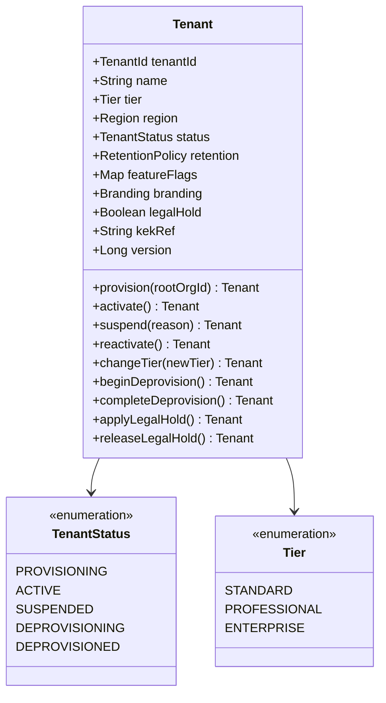

**Lifecycle state machine:**

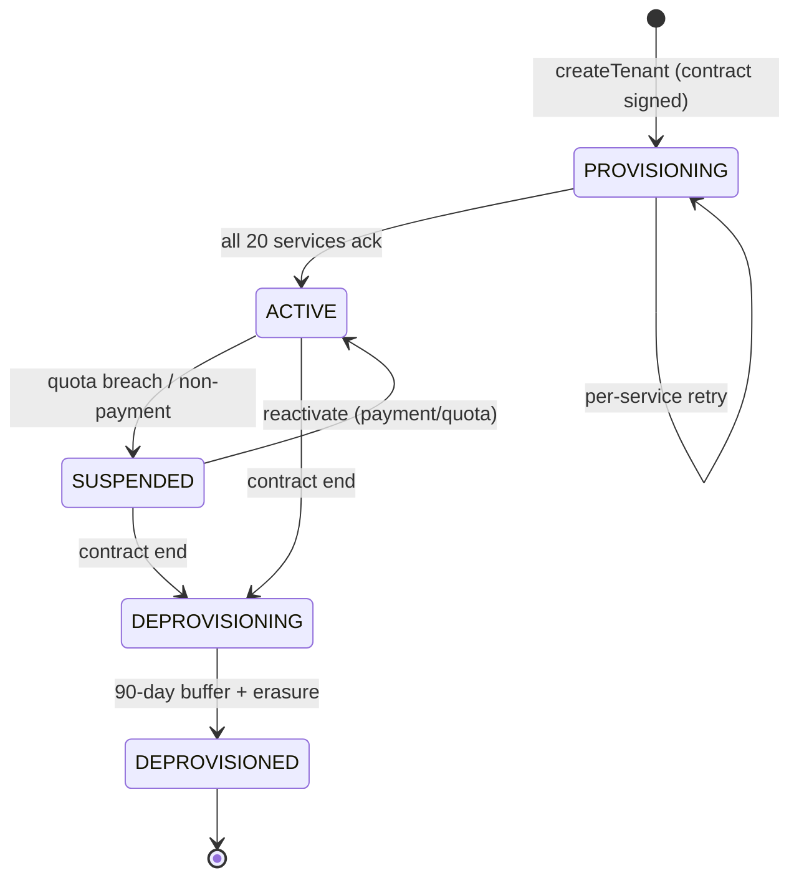

**Invariants:** (i) `tenant_id` immutable; (ii) tier transitions allowed (upgrade anytime; downgrade at cycle boundary); (iii) `legal_hold=true` blocks DEPROVISIONING erasure; (iv) region pin immutable after activation except via region-migration saga.

### 4.2 UsageMeter Aggregate

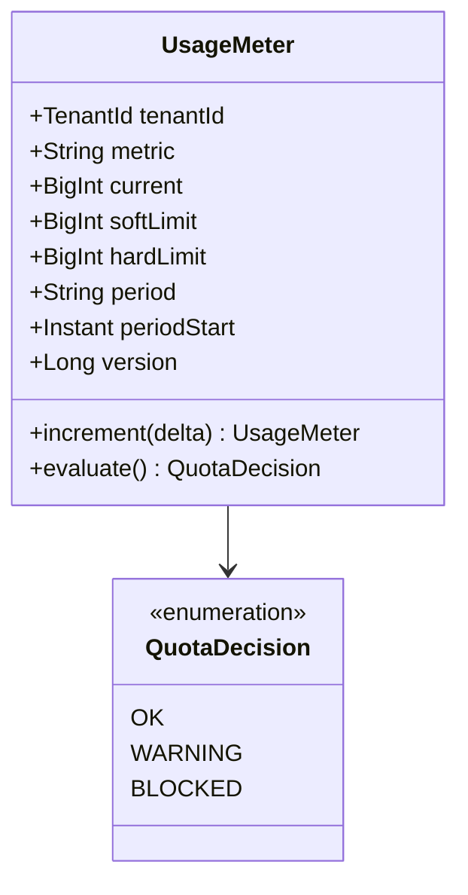

**Invariants:** (i) increments atomic (Redis INCR + PG snapshot); (ii) `current ≥ hardLimit → BLOCKED`; (iii) `current ≥ softLimit → WARNING` (emitted once per period).

### 4.3 Relationship to Other Aggregates

| Relationship | Cardinality | Notes |
|---|---|---|
| Tenant → Organization (root) | 1 → 1 | Root org owned by tenant (identity context) |
| Tenant → Vehicle / Driver / Trip | 1 → many | Tenant scoping on every operational entity |
| Tenant → QuotaLimit | 1 → many | One per metric |
| Tenant → UsageMeter | 1 → many | One per (metric, period) |

---

## 5. APIs

Tenant-management endpoints under `/api/v1/tenants` (admin) and `/api/v1/tenant` (self — the caller's own tenant). Most are platform-admin only (`billing.tenant.manage`); self-service is tier-scoped. REST contracts follow `API_Design.md`.

### 5.1 REST Endpoints

| Method | Endpoint | Description | Permission |
|---|---|---|---|
| `POST` | `/tenants` | Provision a new tenant (SaaS Ops) | `billing.tenant.manage` |
| `GET` | `/tenants` | List tenants (SaaS Ops, paginated) | `billing.tenant.manage` |
| `GET` | `/tenants/{id}` | Tenant detail | `billing.tenant.manage` (or self) |
| `PATCH` | `/tenants/{id}` | Update (name, branding, retention within bounds) | `billing.tenant.manage` |
| `POST` | `/tenants/{id}:suspend` | Suspend tenant | `billing.tenant.manage` |
| `POST` | `/tenants/{id}:reactivate` | Reactivate | `billing.tenant.manage` |
| `POST` | `/tenants/{id}:change-tier` | Change tier | `billing.tenant.manage` |
| `POST` | `/tenants/{id}:deprovision` | Begin deprovision | `billing.tenant.manage` |
| `POST` | `/tenants/{id}:legal-hold` | Apply legal hold | `billing.tenant.manage` |
| `DELETE` | `/tenants/{id}:legal-hold` | Release legal hold | `billing.tenant.manage` |
| `GET` | `/tenants/{id}/quotas` | Quota definitions | `billing.tenant.manage` (or self) |
| `PATCH` | `/tenants/{id}/quotas` | Override quotas (Enterprise) | `billing.tenant.manage` |
| `GET` | `/tenants/{id}/usage` | Current usage (real-time) | `billing.tenant.manage` (or self) |
| `GET` | `/tenants/{id}/provisioning` | Provisioning saga status | `billing.tenant.manage` |
| `GET` | `/tenants/{id}/feature-flags` | Effective feature flags | `billing.tenant.read` |
| `PATCH` | `/tenants/{id}/feature-flags` | Override flags (Enterprise) | `billing.tenant.manage` |
| `POST` | `/tenants/{id}/erasure` | Submit DSAR erasure request | `billing.tenant.manage` |
| `GET` | `/tenants/{id}/erasure/{erasureId}` | Erasure status + verification | `billing.tenant.manage` |
| `GET` | `/tenant` | Self: caller's own tenant | any authenticated |
| `GET` | `/tenant/usage` | Self: own usage | any authenticated |
| `GET` | `/tenant/quotas` | Self: own quotas | any authenticated |

### 5.2 Sample — Provision Tenant

```http
POST /api/v1/tenants
Authorization: Bearer <platform-admin JWT>
Idempotency-Key: 7f2c…
Content-Type: application/json

{
  "data": {
    "type": "tenant",
    "attributes": {
      "name": "Acme Logistics",
      "tier": "PROFESSIONAL",
      "region": "US_EAST_1",
      "retentionTelemetryDays": 730,
      "branding": { "subdomain": "acme" }
    }
  }
}

202 Accepted
Location: /api/v1/tenants/{tenantId}/provisioning

{
  "data": {
    "id": "...", "type":"tenant",
    "attributes": { "status": "PROVISIONING", "tier":"PROFESSIONAL", "region":"US_EAST_1" },
    "links": { "provisioning": "/tenants/.../provisioning" }
  }
}
```

### 5.3 Sample — Real-time Usage

```http
GET /api/v1/tenant/usage
200 OK
{
  "data": {
    "tenantId":"…","tier":"PROFESSIONAL",
    "usage": [
      { "metric":"VEHICLES", "current":743, "softLimit":800, "hardLimit":1000, "period":"TOTAL", "state":"OK" },
      { "metric":"GPS_EVENTS_PER_SEC", "current":410, "softLimit":400, "hardLimit":500, "period":"SEC", "state":"WARNING" }
    ]
  }
}
```

### 5.4 gRPC Service (Internal — consumed by API Gateway + all services)

```protobuf
service TenantService {
  rpc ResolveTenant    (ResolveTenantRequest)   returns (TenantInfo);
  rpc CheckQuota       (CheckQuotaRequest)      returns (QuotaDecision);
  rpc RecordUsage      (RecordUsageRequest)     returns (RecordUsageResponse);
  rpc GetFeatureFlags  (FlagsRequest)           returns (FeatureFlags);
}
message TenantInfo {
  string tenant_id = 1;
  string tier = 2;
  string region = 3;
  string status = 4;          // ACTIVE / SUSPENDED / ...
  int32  retention_telemetry_days = 5;
  bool   legal_hold = 6;
}
message QuotaDecision {
  enum State { OK = 0; WARNING = 1; BLOCKED = 2; }
  State state = 1;
  string metric = 2;
  int64 current = 3;
  int64 hard_limit = 4;
}
```

`ResolveTenant` and `CheckQuota` are hot-path (every request) → Redis-backed, < 10ms P99.

---

## 6. Security

### 6.1 Tenant Isolation (INV-I01)

Isolation is enforced at **four layers** (defense-in-depth):

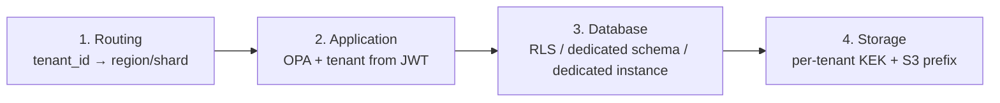

| Layer | Mechanism |
|---|---|
| Routing | API Gateway resolves `tenant_id → region` (EU never leaves eu-west-1) |
| Application | Tenant from JWT (INV-I02); OPA denies cross-tenant; service rejects gRPC `tenant_id ≠ JWT tenant_id` |
| Database | RLS (Standard) / dedicated schema (Professional) / dedicated instance (Enterprise) |
| Storage | Per-tenant KEK (Vault); S3 prefix `tenant=<id>/`; crypto-shredding on erasure |

### 6.2 Tenant ID Derivation (INV-I02)

**Tenant ID always derived from the authenticated principal (JWT), never from request body** — prevents cross-tenant manipulation. The `X-Tenant-Id` header is set by the gateway from JWT; services reject mismatches. Self-service endpoints (`/tenant/*`) implicitly target the caller's tenant.

### 6.3 Crypto-Shredding (Erasure)

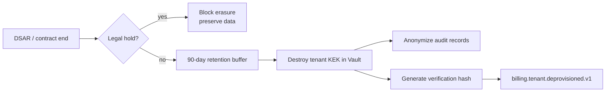

Destroying the KEK renders all tenant-encrypted PII unreadable instantly — no per-row scan needed. Audit records preserved (anonymized) per regulation.

### 6.4 Quota Enforcement (Noisy-Neighbor Prevention)

Quotas prevent one tenant's load from degrading others. Hard-limit breach → `billing.quota.exceeded.v1` → API Gateway rate-limits that tenant. Critical path (real-time tracking) is protected per `01_Master_Architecture.md` §12.3 (never shed for quota).

### 6.5 Sensitive-Action Protections

Suspend / deprovision / legal-hold require **step-up MFA** (per `Modules/Authentication.md` §5.1). Deprovision additionally requires a typed confirmation string and produces a dual-control audit record.

### 6.6 STRIDE (Tenant-Specific)

| Threat | Mitigation |
|---|---|
| Info disclosure (cross-tenant) | 4-layer isolation (above); pen-tested quarterly |
| Spoofing (tenant forgery) | Tenant from JWT; service-side mismatch rejection |
| Tampering (quota bypass) | Atomic Redis counters; PG audit snapshot |
| Repudiation (erasure dispute) | `tenant_erasure_records.verification_hash`; audit chain |
| DoS (noisy neighbor) | Per-tenant quotas + rate limits |
| EoP (admin self-escalate tier) | Tier change = signed contract event; platform-admin only |

---

## 7. Permissions

This module does **not** redefine the permission catalog — `02_Domain_Model.md` §6 is canonical. Tenant-management permissions used:

| Permission | Used For | Who |
|---|---|---|
| `billing.tenant.manage` | All SaaS-Ops tenant admin endpoints | Platform SaaS-Ops role only |
| `billing.tenant.read` | Self: read own tenant config/usage | Any authenticated user (own tenant) |
| `billing.subscription.manage` | Tier changes (sibling module boundary) | Tenant Admin |
| `billing.usage.read` | Self: usage dashboards | Any authenticated user |
| `audit.retention.manage` | Retention-policy overrides | Compliance Officer |

> **Note:** `billing.tenant.manage` is **never** granted to tenant users — it is a platform-internal role (SaaS Operations). Tenant Admins get `billing.tenant.read` + `billing.subscription.manage` (their own tenant only, enforced by INV-I02). This separation prevents tenant admins from suspending themselves or escaping their tier.

**Authorization pipeline:** every request → authenticated (`Modules/Authentication.md`) → OPA evaluates `{ subject, action, resource, context }`. Resource = the tenant in the path; OPA denies if `subject.tenant_id ≠ resource.tenant_id` (except platform-SaaS-Ops role).

---

## 8. Sequence Diagrams

### 8.1 Tenant Provisioning (Cross-Service Saga)

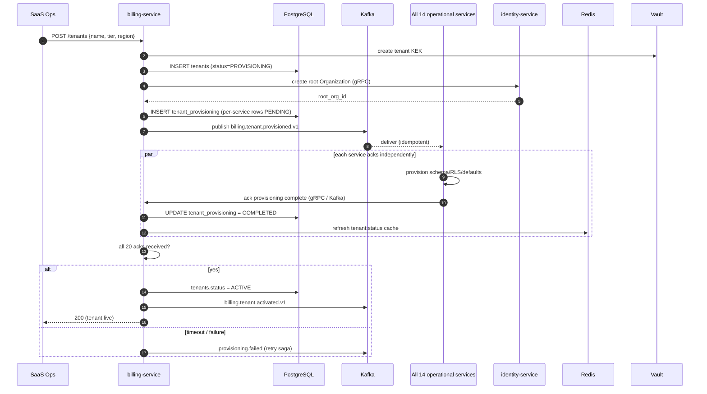

### 8.2 Real-Time Quota Check (per API request)

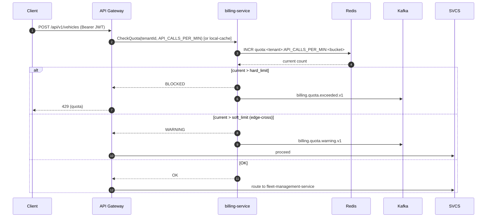

### 8.3 Tenant Suspension (e.g., non-payment)

```mermaid
sequenceDiagram
    autonumber
    participant Trigger as Trigger (payment failed / quota / Ops)
    participant BILL as billing-service
    participant DB as PostgreSQL
    participant R as Redis
    participant K as Kafka
    participant GW as API Gateway
    participant All as All Services

    Trigger->>BILL: suspend(tenantId, reason)
    BILL->>DB: tenants.status = SUSPENDED
    BILL->>R: SET tenant:status:<id> = SUSPENDED
    BILL->>K: billing.tenant.suspended.v1
    K-->>GW: consume
    GW->>GW: block all routes except /billing (for this tenant)
    K-->>All: consume
    All->>All: reject new writes; preserve data; keep sessions read-only
    Note over GW,All: Propagation < 60s global
```

### 8.4 GDPR Erasure (Crypto-Shredding)

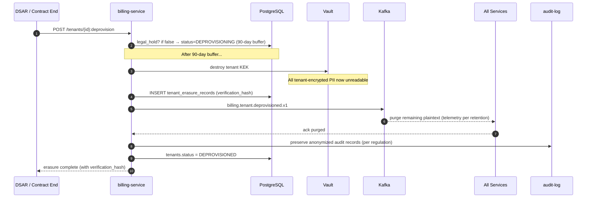

### 8.5 Tenant Resolution (per request, hot path)

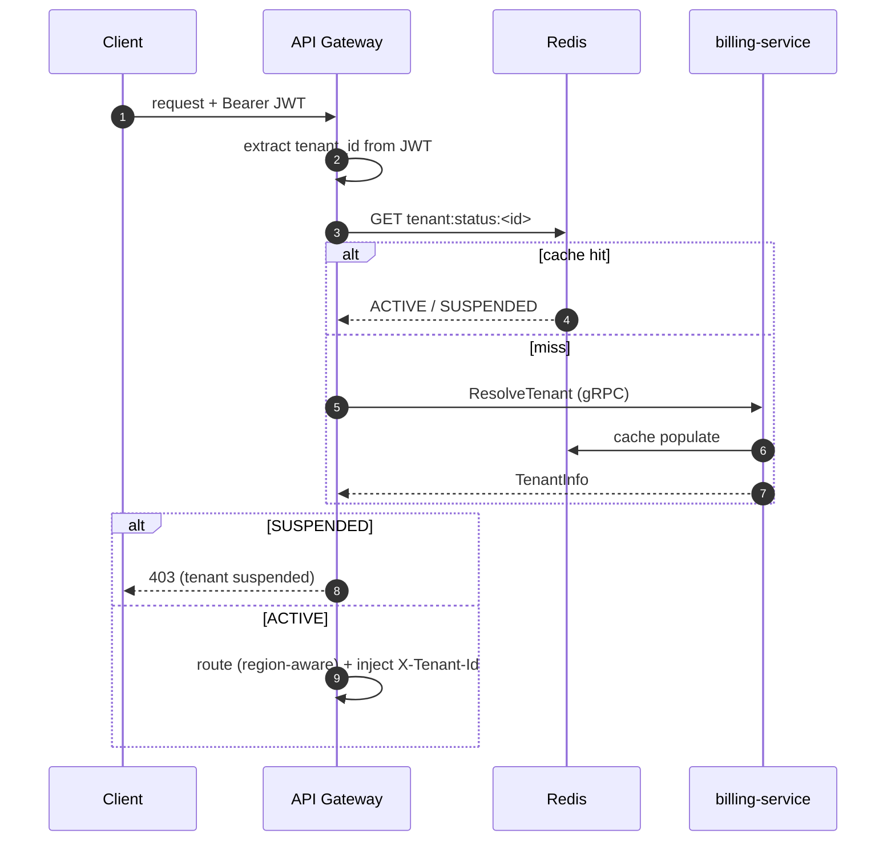

---

## 9. UI Flow

Tenant-management surfaces, aligned with `Modules/UI_UX_Design.md`.

### 9.1 Surface Map

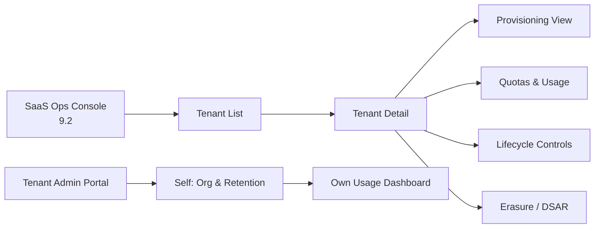

### 9.2 SaaS Ops Tenant Console (Internal Tool)

For SaaS Operations — not customer-facing. Lists all tenants with status, tier, region, health.

```
┌──────────────────────────────────────────────────────────────────────────┐
│ FleetVision SaaS Ops · Tenants           ⌕ Search…     [+ Provision]     │
├──────────────────────────────────────────────────────────────────────────┤
│ Name              Tier          Region    Status       Vehicles   Quota   │
│ ──────────────────────────────────────────────────────────────────────── │
│ Acme Logistics    PROFESSIONAL us-east-1 ● ACTIVE       743      ⚠ 80%   │
│ Globex Trucking   ENTERPRISE   eu-west-1 ● ACTIVE      2,184     ✓       │
│ Initech Freight   STANDARD     us-east-1 ◐ SUSPENDED      47     —       │
│ Umbrella Corp     ENTERPRISE   us-east-1 ◔ DEPROVISION   0      erasing  │
└──────────────────────────────────────────────────────────────────────────┘
```

Click a row → Tenant Detail drawer: provisioning saga status (per-service acks), quota/usage real-time, lifecycle controls (suspend/reactivate/deprovision with step-up MFA), feature flags, erasure records.

### 9.3 Tenant Admin Self-Service (Admin Portal)

Tenant Admins (customer-side) manage **their own** tenant only:

- **Organization**: name, branding (Enterprise), subdomain
- **Retention**: telemetry retention within tier bounds (regulation minimums enforced, locked)
- **Usage Dashboard**: real-time quota consumption vs limits (gauges + trend), per-metric
- **Feature Flags**: view effective flags (tier-driven; Enterprise overrides)
- **Users**: link to IAM user management (sibling module)

### 9.4 Erasure / DSAR Workflow (SaaS Ops)

A guided workflow: verify identity → check legal hold → 90-day buffer (with countdown) → crypto-shredding execution → verification hash → audit record. Each step requires step-up MFA + dual control for deprovision.

---

## 10. Scalability

### 10.1 Load Profile

| Path | Year-1 | Year-5 |
|---|---|---|
| Tenant resolutions/sec (hot path) | ~5,000 | ~200,000 |
| Quota checks/sec | ~5,000 | ~200,000 |
| Active tenants | 50 | 2,000 |
| Concurrent provisioning sagas | ~5 | ~50 |

### 10.2 Scaling Mechanisms

| Layer | Mechanism | Trigger |
|---|---|---|
| `billing-service` | HPA (CPU + RPS) | CPU > 70% |
| Tenant resolution | Redis-cached (5-min TTL) | Cache hit rate > 95% |
| Quota counters | Redis atomic INCR (cluster mode) | Memory > 80% |
| PostgreSQL | Read replicas + PgBouncer | Read QPS |
| Provisioning saga | Async Kafka fan-out (parallel per-service ack) | — |

### 10.3 Hot-Path Optimization

`ResolveTenant` and `CheckQuota` are on **every** request's critical path. They are:
- Redis-first (sub-ms); cache miss falls back to PG then populates cache.
- Gateway-local cache (5s TTL) for `tenant:status` to avoid even the Redis hop for the most common check.
- Never block on the write path: quota increments are fire-and-forget to Redis; PG snapshot is async.

### 10.4 Multi-Region

Each region has its own `billing-service` + Redis + PostgreSQL primary; tenants are region-pinned (INV region rule). Cross-region only for: (a) global tenant registry replication (eventual-consistent, for SaaS-Ops global view); (b) region migration (rare saga). Kafka MirrorMaker carries tenant events to DR.

### 10.5 Failure Modes

| Failure | Detection | Response |
|---|---|---|
| `billing-service` pod crash | Liveness | Restart (stateless) |
| Redis unreachable | circuit breaker | Gateway-local cache (5s); degrade to PG read; quota checks fail-soft (allow + alert) |
| PostgreSQL primary loss | Patroni | Auto leader election (< 30s) |
| Provisioning saga service timeout | Per-service ack tracking | Retry with backoff; saga compensation (rollback) on hard failure |
| Erasure (Vault KEK destroy) failure | Circuit breaker | Block deprovision; alert; never partial |

### 10.6 Capacity Headroom

2× headroom (vision guardrail); tenant-resolution path load-tested at 10× projected; provisioning saga tested at 50 concurrent tenants; chaos tests (Redis kill) quarterly.

---

## Appendix A: Event Catalog (Module-Owned)

| Event | Topic | Partition Key |
|---|---|---|
| `billing.tenant.provisioned.v1` | `fleetvision.billing.tenant.events` | `tenant_id` |
| `billing.tenant.activated.v1` | `fleetvision.billing.tenant.events` | `tenant_id` |
| `billing.tenant.suspended.v1` | `fleetvision.billing.tenant.events` | `tenant_id` |
| `billing.tenant.reactivated.v1` | `fleetvision.billing.tenant.events` | `tenant_id` |
| `billing.tenant.tier.changed.v1` | `fleetvision.billing.tenant.events` | `tenant_id` |
| `billing.tenant.deprovisioned.v1` | `fleetvision.billing.tenant.events` | `tenant_id` |
| `billing.quota.exceeded.v1` | `fleetvision.billing.tenant.events` | `tenant_id` |
| `billing.quota.warning.v1` | `fleetvision.billing.tenant.events` | `tenant_id` |
| `billing.tenant.legal.hold.v1` / `.released.v1` | `fleetvision.billing.tenant.events` | `tenant_id` |

## Appendix B: Traceability

| Foundation Element | This Module |
|---|---|
| `00` Scale pillar (multi-tenant economics) | §1.1, §10 |
| `00` Trust pillar (isolation, GDPR) | §1.1, §6 |
| `01` §8 Multi-Tenant Architecture (3 tiers) | §1.4, §3, §6.1 |
| `01` §8.2 Tenant context propagation | §6.2 |
| `01` §8.3 Resource quotas | §1.4, §4.2, §8.2 |
| `02` §1 Context 2 (Billing & Tenant Mgmt) | §2.1 |
| `02` §3.2 Tenant, UsageMeter aggregates | §2.2, §4 |
| `02` §6 Permission catalog | §7 |
| `02` §8 INV-I01, INV-I02 | §6.1, §6.2 |
| `03` §3 Multi-tenant isolation (RLS/schema/instance) | §3, §6.1 |
| `03` §12.3 Retention (telemetry vs compliance) | §1.7 TEN-BR-03 |
| ADR-002 (Kafka), ADR-003 (3-tier), ADR-006 (Kotlin), ADR-009 (OPA), ADR-016 (naming) | Throughout |

---

*This Tenant Management Module is maintained alongside `Modules/Billing-Tenant-Management.md` (sibling — invoicing/payments) and is consistent with the v2.0.0 foundation (`00–03`). It is reviewed by the Architecture Review Board. Tenant-management code lives in `billing-service` under the tenant sub-packages.*
