# Video Surveillance Platform Module
## Module-Level Design Document

**Version:** 2.0.0
**Status:** Approved — Foundation-Aligned
**Date:** 2026-08-02
**Bounded Context:** Media & Video (Context 8 — `02_Domain_Model.md` §1)
**Services:** `media-service` (Kotlin — orchestration/metadata) · `media-server` (Go — media router: ingest, transcode, record, stream) · `video-ai-engine` (Python — CV inference on GPU)
**Data Store:** PostgreSQL 16 (`media` schema) · S3 / MinIO (recordings, snapshots) · Redis (live signaling, presigned-URL cache) · ClickHouse (AI analytics facts)
**Streaming:** WebRTC (live, browser/mobile) · RTSP (ingest) · RTMP (ingest/publish) · HLS (VOD playback) · WebSocket (signaling + control)
**Codecs:** H.264 / H.265 (HEVC) · AAC / Opus audio
**Messaging:** Kafka (`fleetvision.media.*.events`) · MQTT bridge (camera commands)

> **Relationship to foundation.** This module owns the **Media & Video bounded context** (`02_Domain_Model.md` §1 Context 8; aggregates `VideoChannel`, `Recording`, `StreamSession`, `EventClip`, `AIAlert`). It supersedes the v1.0.0 `Modules/VideoPlatform.md` (which was fleet-dashcam-only). v2.0.0 broadens scope to a full **enterprise video surveillance platform** spanning fixed-site CCTV, NVR-class recording, and in-vehicle dashcams — unified on one media backbone. Conforms to ADR-002 (Kafka), ADR-006 (Kotlin + Go + Python split), ADR-007/008 (PostgreSQL + S3 polyglot), ADR-013 (Media & Video context), ADR-015 (Socket.IO canonical real-time), ADR-016 (single topic-naming convention). It consumes camera control from `Modules/DeviceGateway.md` §2 (JT1078) and feeds evidence clips to `Modules/Compliance-Safety.md` (incidents) and `Modules/Notification-Alerting.md`. Reuses the `media` PostgreSQL schema defined in `03_Database_Architecture.md` §6.

---

## Table of Contents

1. [Business Analysis](#1-business-analysis)
2. [Streaming Architecture](#2-streaming-architecture)
3. [Media Server](#3-media-server)
4. [Ingest Protocols](#4-ingest-protocols)
5. [Codec Strategy (H.264 / H.265)](#5-codec-strategy-h264--h265)
6. [Recording](#6-recording)
7. [Storage](#7-storage)
8. [Playback](#8-playback)
9. [Timeline](#9-timeline)
10. [Multi-Camera & Video Wall](#10-multi-camera--video-wall)
11. [Browser Playback](#11-browser-playback)
12. [Security & Evidence Integrity](#12-security--evidence-integrity)
13. [AI Analytics](#13-ai-analytics)
14. [Scaling Strategy](#14-scaling-strategy)

---

## 1. Business Analysis

### 1.1 Purpose

The Video Surveillance Platform is FleetVision's unified video subsystem — the *Intelligence* pillar's visual core (`00_Project_Vision.md` §2) and the "AI Dashcam leadership" competitive answer. It serves **two video domains on one backbone**:

| Domain | Sources | Primary Use |
|---|---|---|
| **Fixed-site surveillance (CCTV)** | IP cameras, NVRs, RTSP/RTMP streams at depots, yards, warehouses, fuel islands | Site security, perimeter, asset protection, slip-and-fall, theft |
| **In-vehicle dashcam** | JT1078 DVRs, RTSP dashcams, AI dashcams | Driver safety (FCW, distraction, drowsiness), collision evidence, coaching |

One platform for both means one operator console, one timeline, one evidence chain, one AI pipeline — and one cost model.

### 1.2 Goals & Non-Goals

| Goals | Non-Goals |
|---|---|
| Live video from any camera (fixed or vehicle) to browser/mobile < 1s glass-to-glass | Building our own IP cameras / NVR hardware |
| Multi-day continuous recording + event clips, per tenant retention | Becoming a general-purpose streaming CDN (YouTube-class) |
| Frame-accurate playback of any recorded second | Real-time video production / remixing |
| Multi-camera video wall for ops centers | Public live broadcasting |
| Browser playback with no plugins (WebRTC + HLS) | Face recognition / biometric identification (privacy + scope) |
| AI analytics: intrusion, loitering, PPE, FCW, distraction | Training CV models on customer video (privacy + scope) |
| Bandwidth-aware, cost-controlled at PB scale | Long-term archive of every camera 24/7 (tier-driven) |

### 1.3 Latency & Bandwidth Targets

| Path | Target | Notes |
|---|---|---|
| Glass-to-glass live (camera sensor → user eye) | < 1s P95 | WebRTC over UDP; dominant UX constraint |
| Signaling (WebSocket offer/answer) | < 200ms P99 | ICE/WebRTC setup |
| Playback start (HLS) | < 2s P95 | first segment fetch |
| AI inference (frame → alert) | < 500ms | on-edge preferred; cloud retroactive |
| Recording clip finalize (event) | < 30s after trigger | async; not on critical path |
| Continuous recording segment close | 60s segments | fMP4 |

Bandwidth is the dominant cost: a single 1080p H.264 stream is ~2–4 Mbps; 1,000 concurrent live views = 2–4 Gbps egress. The architecture is **pull-from-edge and demand-driven** to avoid untenable always-on cloud ingress.

### 1.4 Personas

| Persona | Use |
|---|---|
| **Security Operator** (fixed-site) | Live wall, perimeter tours, incident review |
| **Dispatcher / Fleet Manager** | Live dashcam, event review, driver coaching |
| **Safety Officer** | AI-event triage, evidence export |
| **Site Admin** | Camera registration, retention policy, recording schedule |
| **Auditor / Investigator** | Tamper-evident evidence, export with chain-of-custody |

### 1.5 Functional Requirements

| ID | Requirement | Priority |
|---|---|---|
| VID-FR-01 | Live view from any camera to browser/mobile | Must |
| VID-FR-02 | Continuous + event-triggered + scheduled recording | Must |
| VID-FR-03 | Frame-accurate playback with timeline linkage | Must |
| VID-FR-04 | Multi-camera tile view + fleet/operations video wall | Must |
| VID-FR-05 | Browser playback with no plugins (WebRTC live, HLS VOD) | Must |
| VID-FR-06 | RTSP, RTMP, JT1078 ingest | Must |
| VID-FR-07 | H.264 and H.265 support (passthrough + transcode) | Must |
| VID-FR-08 | AI analytics (fixed: intrusion/loitering/PPE; vehicle: FCW/distraction) | Should |
| VID-FR-09 | Tamper-evident evidence (hash-chain) | Must |
| VID-FR-10 | Export with watermark + chain-of-custody | Must |
| VID-FR-11 | Snapshot capture (on-demand + scheduled) | Must |
| VID-FR-12 | Per-tenant retention tiers + legal hold | Must |
| VID-FR-13 | Bandwidth-aware quality (simulcast, ABR) | Must |
| VID-FR-14 | PTZ control (PTZ cameras) | Should |

### 1.6 Non-Functional Requirements

| Attribute | Target |
|---|---|
| Live availability | 99.9% (Tier 1) |
| Recording durability | 99.999999999% (11 nines, S3) |
| Concurrent live viewers per stream | up to ~500 (SFU fan-out) |
| Concurrent recorders per media-server pod | ~2,000 channels |
| Recording integrity | 100% hash-chained, tamper-evident |
| Compliance | GDPR, SOC 2, evidentiary admissibility |

---

## 2. Streaming Architecture

### 2.1 End-to-End Pipeline

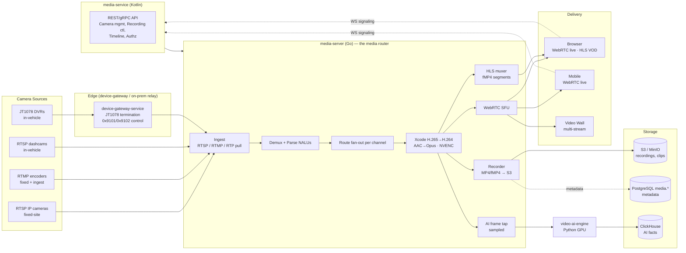

### 2.2 Why This Topology

| Principle | Implementation |
|---|---|
| **Pull-from-edge** | cameras stream on-demand (live view opened, recording active, AI active) — never always-on cloud ingest |
| **Transcode at the edge** | media-server (close to egress) handles codec conversion; media-service core is metadata-only |
| **SFU over mesh/MCU** | one publisher → many viewers; server forwards RTP, no decode when codec passthrough |
| **Metadata in PG, bytes in S3** | never blob video in a relational store (`03_Database_Architecture.md` §1.1) |
| **Tiered retention** | Hot (event clips) → Warm (rolling continuous) → Cold (Glacier) per tenant tier |
| **Evidence integrity** | hash-chained clips for admissibility |
| **Lazy activation** | no viewers + no recording + no AI = no bandwidth spent |

### 2.3 Lazy Activation (Critical Cost Control)

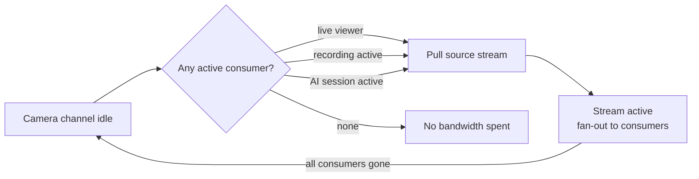

---

## 3. Media Server

The **media-server** (Go) is the media router — the heart of the platform. It is distinct from `media-service` (Kotlin, metadata/orchestration) to isolate the high-throughput media path from the transactional control plane.

### 3.1 Responsibilities

| Responsibility | Notes |
|---|---|
| **Ingest** | RTSP `DESCRIBE/SETUP/PLAY`; RTMP publish; RTP-over-TCP (JT1078 via device-gateway hand-off) |
| **Demux** | split audio/video, identify I-frames, time alignment |
| **Route** | fan to active consumers (SFU, HLS, recorder, AI tap) — only if subscribed/active |
| **Transform** | codec conversion (H.265→H.264 for WebRTC); simulcast generation |
| **Deliver live** | WebRTC SFU (RTP/RTCP to viewers) |
| **Deliver VOD** | HLS muxer (fMP4 segments + manifest) |
| **Persist** | recorder writes fMP4 to S3; metadata to PG |
| **Analyze** | sampled frames → video-ai-engine |

### 3.2 Component Topology

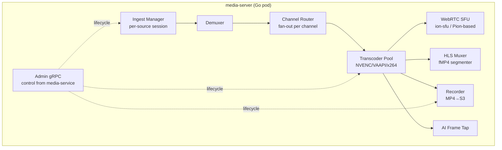

### 3.3 Hardware Transcoding

| Method | When | Hardware |
|---|---|---|
| **Passthrough** (no transcode) | camera codec is WebRTC-compatible (H.264 + Opus) | none — preferred, cheapest |
| **GPU transcode** | H.265 cameras; simulcast generation | NVIDIA NVENC (T4 / L4) on GPU node pool |
| **CPU transcode** | low-volume / non-GPU regions | x264 software (fallback) |

Codec support is advertised per camera channel so the scheduler places sessions on compatible pods. media-server pods are tainted/tolerated for GPU where needed.

### 3.4 Connection to media-service

media-service is the **control plane**; media-server is the **data plane**. media-service tells media-server *what to do* (open/close streams, start/stop recording, change quality) via internal gRPC; media-server does the heavy lifting and reports state changes back.

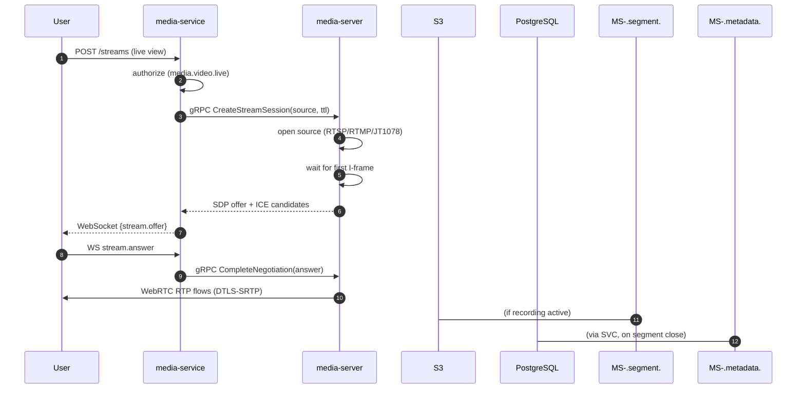

---

## 4. Ingest Protocols

### 4.1 Protocol Matrix

| Protocol | Direction | Source | Use |
|---|---|---|---|
| **RTSP** (RFC 7826) | pull (media-server → camera) | IP cameras, NVRs, dashcams | Universal ingest for fixed-site + RTSP dashcams |
| **RTMP** (publish) | push (encoder → media-server) | encoders, OBS, some NVRs, restream services | Ingest + occasional publish to social/restream |
| **JT1078** (RTP-over-TCP) | push (DVR → media-server) after JT808 0x9101 hand-off | Chinese in-vehicle DVRs | In-vehicle A/V, dominant in China market |
| **WebRTC** (ingest rare) | push (browser → media-server) | browser webcams (rare: driver-facing kiosk) | Remote inspection / two-way audio |

### 4.2 RTSP Ingest

```mermaid
sequenceDiagram
    participant MS as media-server
    participant CAM as RTSP camera
    MS->>CAM: OPTIONS
    MS->>CAM: DESCRIBE → SDP (codec info)
    MS->>CAM: SETUP (RTP transport: UDP or interleaved TCP)
    MS->>CAM: PLAY
    CAM-->>MS: RTP frames (H.264/H.265 + AAC/G.711)
    MS->>MS: demux → route → fan-out (SFU/HLS/REC/AI)
    Note over MS: On stop: TEARDOWN; session closed
```

- RTP transport: **interleaved TCP** when firewall traversal needed; **UDP** for latency.
- Keepalive (GET_PARAMETER / OPTIONS every 30s) detects camera drop; on drop → DEGRADED → retry backoff (1s, 2s, 5s, 10s) → notify.

### 4.3 RTMP Ingest

```
rtmp://media.fleetvision.example/live/{streamKey}
```

- media-server authenticates `streamKey` → resolves to a `video_channel`.
- Common for IP-camera encoders, OBS, and restream services; also used to publish a stream onward to a partner RTMP destination (rare, opt-in).

### 4.4 JT1078 (In-Vehicle A/V)

JT1078 is the **companion media plane** to JT808 (the control channel), terminated by `device-gateway-service` (`Modules/DeviceGateway.md` §2):

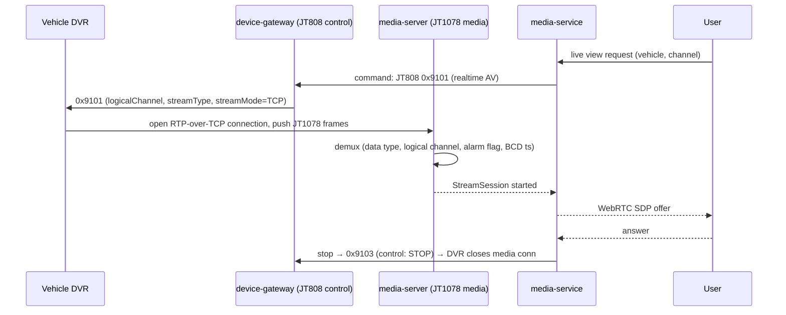

JT1078 RTP frame: start `0x30 0x31` + length + seq + BCD SIM + logical channel + alarm flag + sample count + BCD timestamp + last-frame flag + data type (0=video / 1=audio) + stream type (98=H.264 / 99=H.265 / 100=AAC) + body. The 8-byte BCD timestamp is Beijing time (UTC+8) → normalized to UTC.

### 4.5 Protocol Normalization

All ingest protocols normalize to the canonical internal frame representation (NALU + audio frame + timestamp + source metadata) before routing — downstream consumers (SFU, HLS, REC, AI) never see protocol specifics.

---

## 5. Codec Strategy (H.264 / H.265)

### 5.1 Codec Support

| Codec | Live (WebRTC) | VOD (HLS) | Recording | Transcode? |
|---|---|---|---|---|
| **H.264 (AVC)** | ✅ native | ✅ native | ✅ | passthrough (preferred) |
| **H.265 (HEVC)** | ❌ (browsers limited) | ✅ (Safari; HLS) | ✅ | **transcode → H.264** for WebRTC |
| **AAC** audio | ❌ (WebRTC needs Opus) | ✅ | ✅ | transcode → Opus for WebRTC |
| **Opus** audio | ✅ native | ✅ | ✅ | passthrough |
| **G.711 / G.726** | ❌ | partial | ✅ | transcode → Opus |

### 5.2 Why H.265 Anyway?

H.265 is ~40% smaller than H.264 at equal quality — significant for **recording storage** (PB scale) and **cellular ingest** from vehicles. The platform **ingests H.265** (recordings + HLS playback for Safari benefit) and **transcodes H.265 → H.264** only when a browser live view needs WebRTC (which has uneven H.265 browser support). Transcoding is on the live-view path only when needed — not for recording.

### 5.3 Transcode Decision Tree

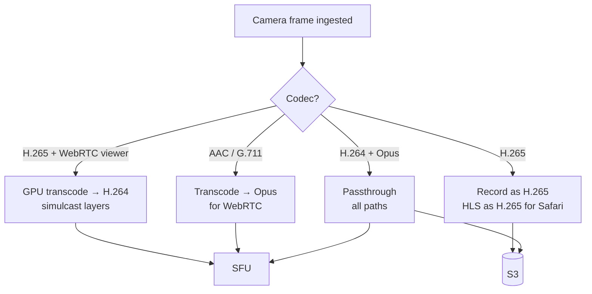

### 5.4 Simulcast (Adaptive Bitrate)

For live view, the camera/media-server publishes **multiple spatial layers** (1080p / 720p / 360p). Each viewer receives the layer matching their bandwidth/screen — mobile cellular gets 360p, ops-center wall gets 1080p — from the **same source pull**.

---

## 6. Recording

Recording captures video to storage, continuously or event-triggered. Recording policy is the **primary cost driver** and is therefore highly configurable.

### 6.1 Recording Modes

| Mode | Trigger | Duration | Storage Class |
|---|---|---|---|
| **Continuous (always-on)** | schedule (e.g., 24/7 or business hours) | full window | S3 Standard → IA → Glacier |
| **Event clip** | behavior/alarm event (harsh brake, FCW, intrusion, geofence, manual) | 8–30s (pre + post buffer) | S3 Standard |
| **On-demand** | user "record now" | until stopped | S3 Standard |
| **Snapshot** | user/schedule JPEG | instant | S3 Standard |

### 6.2 Event-Clip Pre-Buffer

Event clips include the moments *before* the trigger via a **rolling ring buffer** (~10s) maintained by media-server:

```
        trigger at T
             │
   ┌─────────▼─────────────┐
   │  ring buffer (10s)    │  + post-record (20s) = 30s clip
   └───────────────────────┘
```

### 6.3 Recorder Path

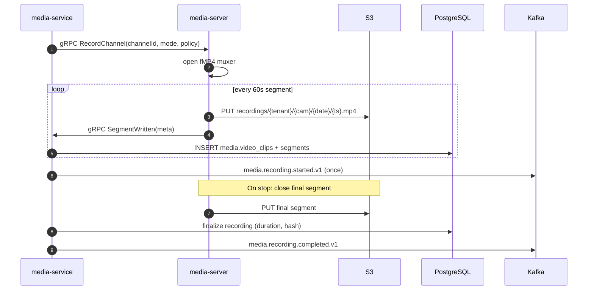

### 6.4 Recording Control

Triggered by events from across the platform:

| Source event | Trigger |
|---|---|
| `tracking.behavior.event.v1` (harsh brake, etc.) | 30s clip around event |
| `tracking.speed.exceeded.v1` | 30s clip |
| `tracking.geofence.entered.v1` (high-value POI) | per policy |
| `compliance.incident.reported.v1` | extended clip + linkage |
| `media.ai.alert.v1` (intrusion, FCW) | 30s clip + AI metadata |
| Manual (user click / driver press) | 60s clip |

Triggers flow via Kafka to media-service, which orchestrates: instruct media-server (or device for JT1078/0x9206 upload), create the `EventClip` record, link to the originating event (`trigger_event_id`), notify.

### 6.5 Recording Lifecycle Events

| Event | When |
|---|---|
| `media.recording.requested.v1` | recording requested |
| `media.recording.started.v1` | media-server begins writing |
| `media.recording.completed.v1` | clip finalized + uploaded (`clipId`, `s3Key`, `durationMs`, `hash`) |
| `media.recording.failed.v1` | upload/transcode failed (retry) |
| `media.snapshot.taken.v1` | snapshot captured |

---

## 7. Storage

Video storage is the platform's largest by volume. Strategy: **tier, compress, expire aggressively**.

### 7.1 Storage Topology

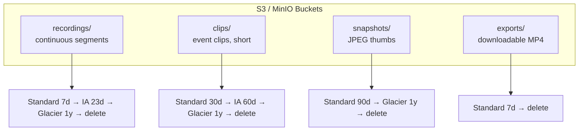

### 7.2 Object Key Layout

Prefix-partitioned by tenant + date for scan parallelism + lifecycle rule application:

```
s3://fv-recordings/tenant={tenantId}/site={siteId}/cam={channelId}/dt={yyyyMMdd}/{startTs}.mp4
s3://fv-clips/      tenant={tenantId}/trigger={type}/{clipId}.mp4
s3://fv-snapshots/  tenant={tenantId}/cam={channelId}/{yyyyMMddHHmm}.jpg
s3://fv-exports/    tenant={tenantId}/user={userId}/{exportId}.mp4
```

### 7.3 Lifecycle Policies

| Transition | When | Why |
|---|---|---|
| Standard → Standard-IA | after 30d (clips) / 7d (continuous) | less-frequent access |
| IA → Glacier | after 90d (clips) / 180d (continuous) | archive |
| Glacier → Deep Archive | after 1y | long-term compliance |
| Expiration | per tenant retention (default 30d Standard / 90d Pro) | cost + GDPR |

Retention is tier-driven and per-regulation: FMCSA-required evidence gets a `legal_hold` tag and skips expiration.

### 7.4 PostgreSQL Metadata (`media` schema)

Reuses the schema from `03_Database_Architecture.md` §6 + extends:

```sql
-- Camera channel registry (fixed + vehicle)
media.video_channels (channel_id, tenant_id, site_id, vehicle_id, device_id,
  label, logical_channel, rtsp_url, rtmp_stream_key, codec, resolution,
  status, capabilities JSONB, ptz BOOLEAN, ...)

-- A recording (continuous segment or event clip)
media.video_clips (clip_id, tenant_id, channel_id, trigger_type, trigger_event_id,
  start_at, end_at, duration_ms, location geog, s3_key, s3_thumbnail,
  codec, bytes_size, storage_class, hash_sha256, prev_hash, status,
  retention_days, ...) PARTITION BY RANGE (start_at)

-- Sub-segments (streaming/seek within a recording)
media.video_segments (segment_id, clip_id, tenant_id, sequence,
  start_offset_ms, duration_ms, s3_key, bytes_size)

-- Live/playback sessions (high-churn → daily partition)
media.stream_sessions (session_id, tenant_id, user_id, channel_id, mode,
  source, streamer_pod, quality, state, started_at, ended_at, bytes_in,
  bytes_out, viewer_count) PARTITION BY RANGE (started_at)

-- AI detection events (§13)
media.ai_alerts (alert_id, tenant_id, channel_id, clip_id, ai_type, severity,
  confidence, detected_at, bbox JSONB, inference_node, metadata)
  PARTITION BY RANGE (detected_at)
```

`site_id` is new in v2.0.0 (fixed-site surveillance): a camera belongs to either a `vehicle_id` (dashcam) or a `site_id` (CCTV), never both.

### 7.5 Cost Controls

| Lever | Mechanism |
|---|---|
| **Demand-driven ingest** | never stream unless viewed/recording (§2.3) |
| **H.265 ingest** | ~40% smaller recordings; transcode only on WebRTC live path |
| **Resolution caps** | default 720p continuous, 1080p event clips |
| **Tiered retention** | S3 lifecycle (above) |
| **Per-tenant quotas** | storage GB/month + concurrent streams |
| **Region-local egress** | media-server pod near camera network → egress stays in-region |
| **Event-only default** | most tiers use event clips only; continuous = Enterprise opt-in |

### 7.6 Capacity Model (Year 5)

| Stream type | Per-camera/day | Volume |
|---|---|---|
| Event clips (avg 5/day, 30s, 1080p H.265) | ~3 MB each → ~15 MB | ≤ 3 GB/cam hot (90d) |
| Continuous CCTV (24h, 720p H.265) | ~250 MB/h → ~6 GB | ~180 GB/cam (30d) |
| Continuous dashcam (8h/day) | ~1 GB/h → ~8 GB | ~240 GB/cam (30d) |
| Snapshots | ~50 KB × 24 → ~1 MB | ~30 MB/cam |

At scale (mixed fixed + vehicle cameras), total hot storage is multi-PB — only achievable with aggressive tiering + H.265 + event-default.

---

## 8. Playback

On-demand viewing of recorded video — continuous, event clips, or device-local (SD card). Transport is **HLS** for compatibility and CDN-friendliness (WebRTC's low latency is unnecessary for VOD).

### 8.1 Playback Sources

| Source | Where | Speed |
|---|---|---|
| Continuous recording | S3 (cloud) | instant |
| Event clip | S3 (cloud) | instant |
| Device-local recording (SD) | on the device | pulled via JT808 0x9102 (slower — device upload) |

### 8.2 HLS Packaging

Recordings stored as **fragmented MP4 (fMP4)** in S3. On playback:

1. media-service resolves `clipId` → S3 key + segment list.
2. media-server (HLS muxer) generates a manifest referencing fMP4 segments with byte-range URLs (signed, short TTL).
3. Browser `<video>` or hls.js loads manifest → segments; standard HLS seeks/plays/pauses.

For **byte-accurate seek**, segments are 2s fMP4 fragments; the manifest's `EXTINF` enables precise scrubbing.

### 8.3 Timeline-Linked Playback

The player is bound to the **Timeline** (§9): scrubbing the timeline seeks the player; clicking an event marker (e.g., harsh-brake) jumps to the clip with ±30s context.

### 8.4 Multi-Rate Playback

HLS supports 0.5×, 1×, 2×, 4×, 8× for fast review — a dispatcher triages an 8-hour shift in minutes.

### 8.5 Export / Download

Authorized users export a time range as downloadable MP4 (watermarked with tenant + user + timestamp for evidence). Exports are async (media-server renders to S3) and produce a `media.export.ready.v1` notification.

---

## 9. Timeline

The **Timeline** is the unified visual index of everything that happened at a camera/site/vehicle over a time range — video, events, AI alerts — synchronized on one scrubber. It is the entry point for incident review.

### 9.1 Timeline Layers

```
   Video availability  ████████████░░░░░░██████████████████░░░░░░██████
                        (recorded)  (gap)         (recorded)    (gap)
   Event clips            ▲          ▲    ▲                      ▲
                         brake    FCW  geofence                manual
   AI alerts              ●●      ●              ●●●●
                       intrusion            loitering burst
   Motion/activity     ▮▮▮▮▮▮▮▮▮▮▮▮▮▮▮▮▮▮▯▯▯▯▮▮▮▮▮▮▮▮▮▮▮▮▮▮▮▮▮▮▮▮
   Site schedule      [──open──][closed][────open────────][closed]
   Map position       ▣━━━━━━━━━━━━━━━━━━━━━━━━━━━━━━━━━━━━━━━━━━━━▣ (vehicle)

   ◄─────────────── scrubber (drag to seek playback) ───────────────►
```

### 9.2 Timeline API

```
GET /api/v1/media/channels/{channelId}/timeline?from=…&to=…
GET /api/v1/media/sites/{siteId}/timeline?from=…&to=…     (multi-camera)
GET /api/v1/media/vehicles/{vehicleId}/timeline?from=…&to=…
```

Returns a unified structure merging sources:

```json
{
  "channelId": "...", "from": "...", "to": "...",
  "tracks": [
    { "kind": "video",      "segments": [{ "start","end","clipId","thumbS3" }] },
    { "kind": "clips",      "events":   [{ "at","clipId","trigger","linkedEventId" }] },
    { "kind": "ai",         "events":   [{ "at","type","severity","confidence","clipId" }] },
    { "kind": "motion",     "segments": [{ "start","end","score" }] },
    { "kind": "siteSchedule","segments":[{ "start","end","state" }] }
  ],
  "summary": { "recordedMin": 1420, "gapMin": 20, "aiAlerts": 7, "clips": 3 }
}
```

### 9.3 Sources Merged

| Track | Source |
|---|---|
| Video availability | `media.video_clips` / segments |
| Event clips | `media.video_clips` (trigger clips) |
| AI alerts | `media.ai_alerts` |
| Motion/activity | media-server motion detection (per-segment activity score) |
| Site schedule | site admin schedule (open/closed → motion expected/unexpected) |
| Map / trip | from GPSEngine (vehicle only) |
| Geofence / speed | from GPSEngine |

### 9.4 Interaction

- **Scrub** = seek the playback player (loads the right clip + offset).
- **Click event** = jump to that clip ± pre-buffer.
- **Range-select** = export that range.
- **Zoom** = day → hour → minute.

### 9.5 Performance

Timeline queries hit PostgreSQL (metadata) + ClickHouse (events/motion) — never S3/video. Target < 500ms P99 for 24h timeline. Hot timelines cached in Redis (10-min TTL).

---

## 10. Multi-Camera & Video Wall

### 10.1 Multi-Camera View (Single Site / Single Vehicle)

A site or vehicle with N cameras shows all simultaneously in a tiled view:

```
   ┌────────────┬────────────┐
   │  Forward   │   Driver    │       (vehicle)        ┌─────────┬─────────┐
   │  (road)    │   (cabin)   │            OR         │ Gate 1  │ Yard N  │
   ├────────────┼────────────┤                       ├─────────┼─────────┤
   │   Rear     │   Cargo     │                       │ Dock A  │ Office  │
   └────────────┴────────────┘                       └─────────┴─────────┘
```

Each tile is an independent WebRTC `streamSession`; media-server multiplexes N source pulls into N SFU tracks. UI caps simultaneous tiles (4–9 default); bandwidth scales with active tiles.

### 10.2 Video Wall (Operations / Security Center)

A **Video Wall** is a multi-camera grid — a security dispatcher's overview of many cameras/sites at once, typically on large monitors in a control room.

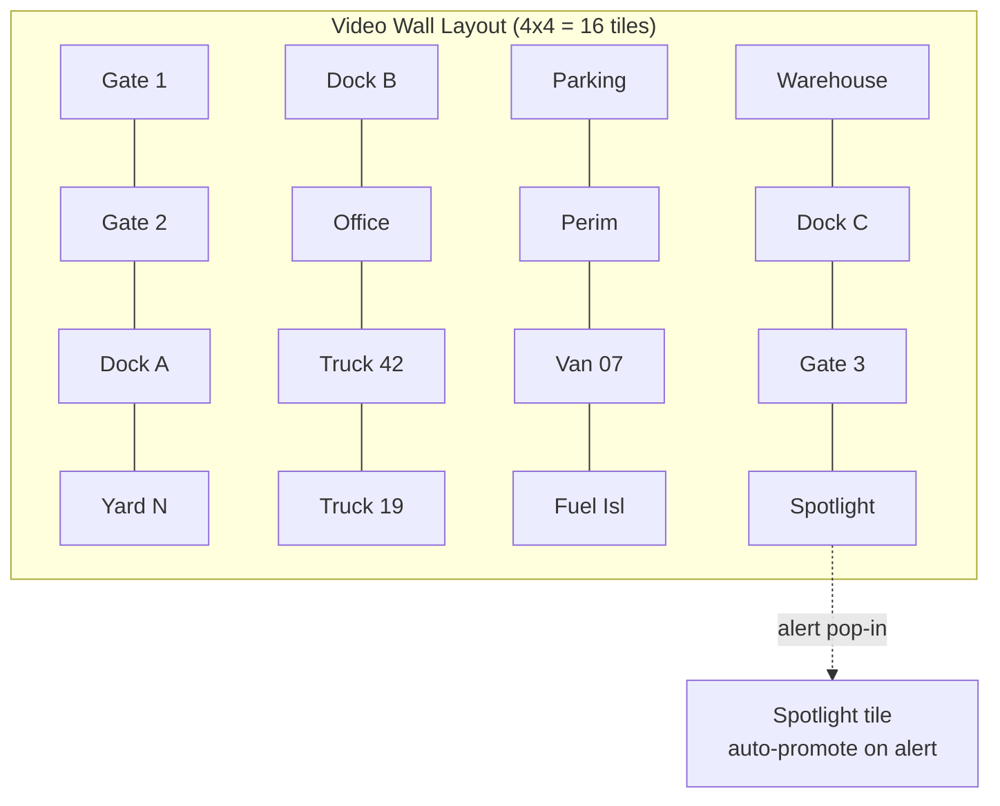

#### 10.2.1 Layout Service

```kotlin
data class VideoWallLayout(
    val id: UUID, val tenantId: UUID, val name: String,
    val tiles: List<Tile>, val refreshPolicy: RefreshPolicy
)
data class Tile(val position: Int, val sourceId: UUID, val sourceType: SourceType) // CHANNEL | VEHICLE | SITE
```

The wall subscribes to tiles' WebRTC streams; a scheduler rotates non-active tiles (round-robin 30s) to bound bandwidth. A tile can auto-promote to **spotlight** (large) when its source raises an AI/event alert.

#### 10.2.2 Bandwidth Management

A wall of 16 × 720p ≈ 24 Mbps — fine wired; impossible cellular. The wall:
- Detects connection type, caps tiles/quality accordingly.
- Uses **simulcast low-layer** (360p) for wall tiles; high-layer only when expanded.
- **Spotlight mode**: one big tile + thumbnails.

#### 10.2.3 Alert-Driven Pop-In

When an AI/event alert fires for a wall-monitored source, the tile:
- Highlights (red border) + audio chime.
- Optional auto-spotlight for X seconds.
- One-click jump to the event clip + timeline.

This makes the wall an **active monitoring** tool, not passive viewing.

---

## 11. Browser Playback

### 11.1 Plugin-Free by Design

No Flash, no native plugins. Two transports cover all cases:

| Use case | Transport | Browser API |
|---|---|---|
| **Live view** (< 1s latency) | **WebRTC** | `RTCPeerConnection` |
| **Playback (VOD)** | **HLS** | hls.js (Chrome/Firefox) · native Safari |

### 11.2 WebRTC Player Flow

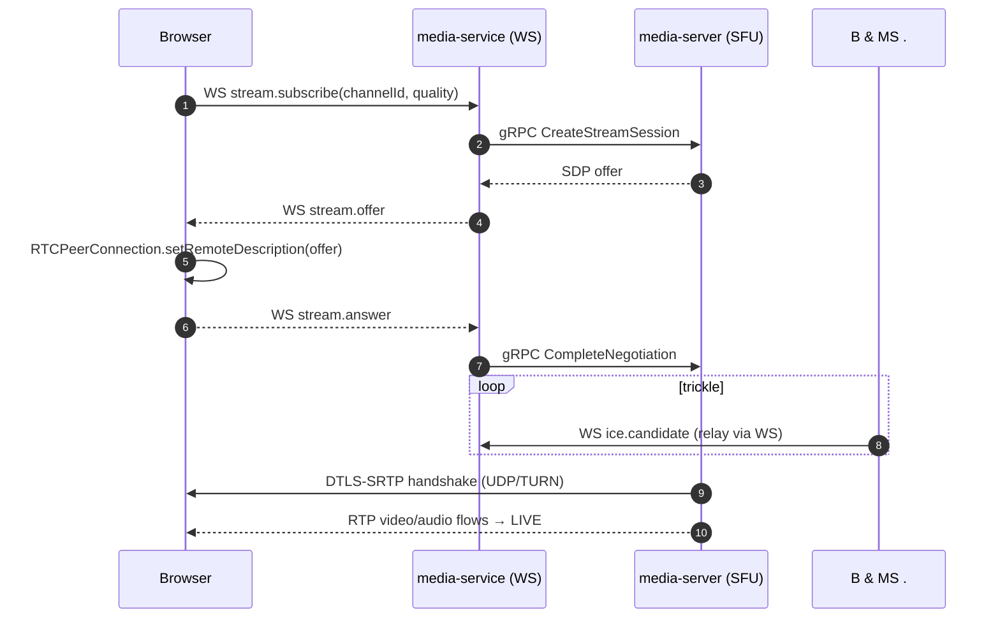

### 11.3 HLS Player Flow

```
GET /api/v1/media/recordings/{clipId}/playback  →  HLS manifest URL (signed, 15-min TTL)
browser hls.js  →  load manifest  →  fetch fMP4 segments (byte-range)  →  <video> plays
```

### 11.4 Quality Selection

| Quality | Resolution | Bitrate | Use |
|---|---|---|---|
| `auto` | adaptive (simulcast) | 0.5–3 Mbps | default |
| `high` | 1080p | 3–4 Mbps | investigation |
| `medium` | 720p | 1.5 Mbps | dispatcher desk |
| `low` | 360p | 0.5 Mbps | mobile cellular |
| `audio-only` | — | 32 kbps | low-bandwidth |

### 11.5 Live Indicators (UI Overlays)

- **Latency** (glass-to-glass, via RTCP timestamps).
- **Signal** green/amber/red from camera health + last-frame age.
- **REC** dot if recording active.
- **AI overlay** optional bounding boxes (intrusion zones, FCW objects).

### 11.6 Auto-Close & Quotas

Idle live views auto-close after **5 min** of no browser activity (visibility API + heartbeat). Per-tenant concurrent-live quota (e.g., 50 Pro / 500 Enterprise) enforces cost; over-quota → `409` with upgrade guidance.

---

## 12. Security & Evidence Integrity

### 12.1 Stream Security

- **DTLS-SRTP** encrypts every WebRTC RTP packet (camera→media-server: mTLS/TLS; media-server→viewer: DTLS-SRTP).
- **Signaling** (WebSocket) over WSS with platform JWT (per `Modules/Authentication.md`); media-server rejects any WebRTC negotiation whose `streamSessionId` wasn't issued by media-service.
- **Presigned media-token** (5-min TTL, Redis-cached) per viewer; revoked users dropped from SFU within seconds.

### 12.2 Evidence Integrity (INV-MED01)

Every recorded clip is **hash-chained** for evidentiary admissibility — mirrors the HOSLog hash chain (`02_Domain_Model.md` §9.2):

```
clip.sha256  = SHA256(clip.bytes)
clip.prevHash = previousClipForChannel.sha256     // chain
clip.signedBy = media-service key (Vault)          // tamper-evident
```

Stored in `media.video_clips.hash_sha256` + `prev_hash`. Any post-hoc modification breaks the chain → tamper-evident. Export watermarks (tenant + user + timestamp) provide chain-of-custody for legal proceedings.

### 12.3 Privacy (INV-MED02)

- Driver-facing AI is **safety-only** — gaze/pose, never face recognition / identity.
- Driver-facing frames not persisted unless an alert is raised (then only the event clip).
- Per-GDPR, driver-facing recordings are subject to DSAR; retention short (30d default) unless linked to a safety event.
- Tenants can disable driver-facing AI per driver-consent requirements (jurisdiction-aware, e.g., EU works-council rules).
- Fixed-site audio recording is off by default (jurisdiction-dependent one-party/two-party consent).

### 12.4 Tenant Isolation

Every stream/recording is tagged `tenant_id`; signaling authorized per user (`media.video.live`); storage prefix-partitioned `tenant=<id>/`; S3 bucket policies enforce tenant boundaries.

---

## 13. AI Analytics

### 13.1 Two-Tier Inference

| Tier | Where | Models | Latency |
|---|---|---|---|
| **On-edge / on-device** (preferred) | camera ISP/NVR NPU; dashcam NPU | intrusion, loitering, FCW, lane-departure, distraction | real-time, on-camera alert |
| **Cloud retroactive** | `video-ai-engine` (Python, GPU) | re-analysis, advanced models, evidence re-check | seconds-minutes |

### 13.2 Detection Catalog

| Domain | Alert type | Severity |
|---|---|---|
| **Fixed-site** | `INTRUSION` (perimeter zone breach) | CRITICAL |
| | `LOITERING` (dwell in zone) | MAJOR |
| | `PPE_VIOLATION` (no helmet/vest in zone) | MAJOR |
| | `UNATTENDED_OBJECT` (object left) | MAJOR |
| | `CROWD_FORMING` | MINOR |
| | `CAMERA_TAMPER` / `OBSTRUCTED_LENS` | MAJOR |
| **In-vehicle** | `FORWARD_COLLISION_WARNING` (FCW) | CRITICAL |
| | `LANE_DEPARTURE` (LDW) | MAJOR |
| | `DISTRACTED_DRIVER` | MAJOR |
| | `PHONE_USE` | MAJOR |
| | `SMOKING` | MINOR |
| | `DROWSINESS` | MAJOR |
| | `NO_SEATBELT` | MAJOR |

### 13.3 Cloud Inference Pipeline

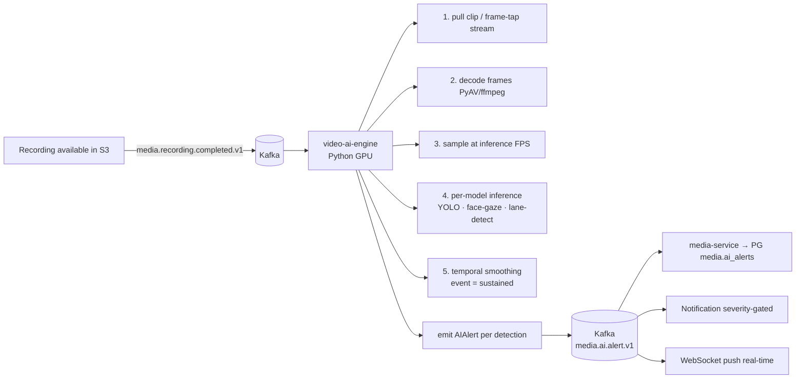

### 13.4 Models & Training

- Base models (YOLOv8 for objects; specialized gaze/drowsiness nets; lane-detect + distance for FCW/LDW) fine-tuned on FleetVision's annotated dataset.
- Pipeline: PyTorch + MLflow (`Modules/Analytics-Reporting.md`); TensorRT for NVIDIA; ONNX for portability.
- **Privacy:** driver-facing frames processed without identifying individuals beyond gaze/pose; no face embeddings stored.

### 13.5 Alert Lifecycle

```
DETECTED (raw inference hit) → sustained N frames → RAISED → ACKNOWLEDGED → RESOLVED
```

Drivers/operators can **contest** false positives → feeds model training (closed loop).

---

## 14. Scaling Strategy

### 14.1 Scaling Dimensions

```mermaid
flowchart TD
    A[Scaling Need] --> B{Dimension?}
    B -->|More cameras/sites| C[Horizontal: media-server pods<br/>KEDA on channel count + CPU]
    B -->|More concurrent viewers| D[SFU fan-out per pod<br/>+ pod count]
    B -->|More GPU transcode| E[GPU node pool autoscale<br/>NVENC capacity]
    B -->|More storage| F[S3 (elastic) + tiering]
    B -->|More recording throughput| G[Recorder pool<br/>batched S3 puts]
```

### 14.2 Sizing

| Workload | Per media-server pod | Cluster |
|---|---|---|
| Concurrent channels (live+recording) | ~2,000 | — |
| Concurrent WebRTC viewers | ~500/stream, ~5,000/pod | — |
| GPU transcode streams | ~30 (T4) / ~60 (L4) | — |
| Recording segments/sec | ~200 | — |
| Year-5 cameras (mixed fixed + vehicle) | — | ~1M+ channels |

### 14.3 Kubernetes Topology

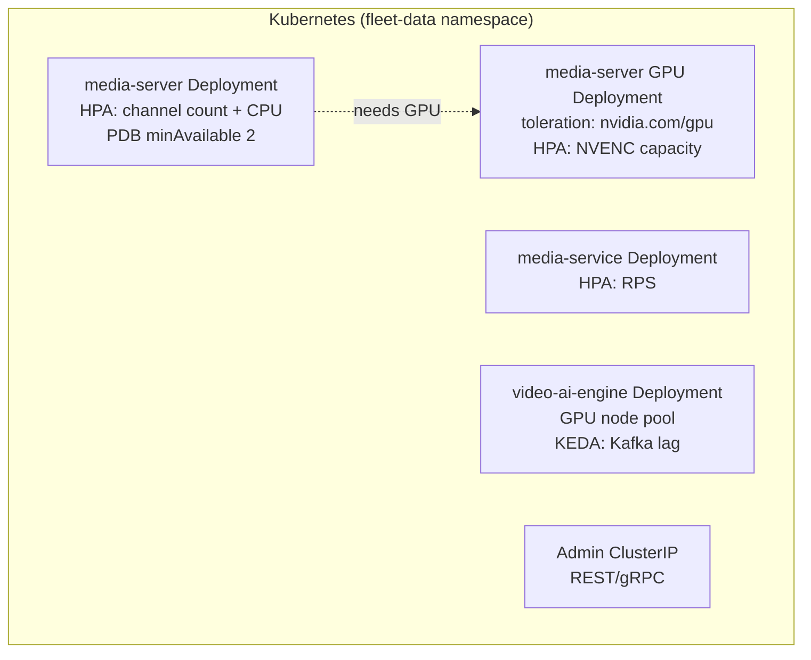

- **media-server** (CPU pool): ingest, demux, route, SFU (passthrough), HLS, recorder.
- **media-server-gpu** (GPU pool, tainted): H.265 transcode, simulcast generation. Sessions routed by codec need.
- **KEDA triggers:** `media_channels_active > 70%`, NVENC utilization > 70%, Kafka AI lag > 1K.
- **PDB** minAvailable 2 (stateful SFU sessions need graceful drain).

### 14.4 Geographic / Data-Residency

EU cameras + viewers terminate in `eu-west-1` (GDPR); media-server pods are region-local; recordings never cross region except via explicit export. China region uses Amap/Baidu for any map overlay but video stays on-platform.

### 14.5 Cost Levers (Top Concern)

| Lever | Savings |
|---|---|
| Demand-driven ingest | eliminates always-on cloud ingest |
| H.265 ingest + record | ~40% storage/egress |
| Event-only default tier | most cameras record only on event |
| S3 tiered lifecycle | up to 80% on object storage |
| Simulcast low-layer for wall/mobile | egress |
| On-device AI (vs cloud) | bandwidth + compute |
| Per-tenant quotas + budgets | noisy-tenant containment |

### 14.6 Failure Modes & Auto-Response

| Failure | Detection | Response |
|---|---|---|
| media-server pod crash | Liveness | Restart; SFU sessions reconnect; viewers auto-reconnect |
| Camera drop | RTSP keepalive / JT808 heartbeat | DEGRADED → retry backoff → notify |
| S3 write slow | producer backpressure | Recorder buffers to local disk; flush when able; never lose frames (evidentiary) |
| Kafka slow | publish-lag | back-pressure; defer AI rollups; live path never shed |
| GPU saturation | NVENC util | Sessions queue or fall back to CPU x264 (slower) |
| Redis (signaling) down | circuit breaker | degrade; viewers can't open new; existing continue |

### 14.7 Capacity Headroom

2× headroom (vision guardrail); live path load-tested at 10× projected; chaos tests (media-server kill, GPU pool drain) quarterly. Recording durability is 11-nines (S3) by construction.

---

## Appendix A: Event Catalog (all on `fleetvision.media.*.events`)

| Event | Producer | Consumers |
|---|---|---|
| `media.channel.registered.v1` | media-service | audit, analytics |
| `media.channel.faulted.v1` | media-service | notification, audit |
| `media.stream.started.v1` / `.ended.v1` | media-service | audit, billing (usage) |
| `media.recording.requested.v1` | media-service | media-server |
| `media.recording.started.v1` | media-server | media-service |
| `media.recording.completed.v1` | media-server | media-service, ai-engine, analytics |
| `media.recording.failed.v1` | media-server | media-service, notification |
| `media.snapshot.taken.v1` | media-server | media-service |
| `media.ai.alert.v1` | video-ai-engine / device | media-service, notification, compliance, analytics |
| `media.ai.alert.acknowledged.v1` | media-service | analytics |
| `media.export.ready.v1` | media-server | media-service, notification |

## Appendix B: API Reference

Base path: `/api/v1/media` (permissions from `02_Domain_Model.md` §6 catalog).

### B.1 REST

| Method | Endpoint | Description | Permission |
|---|---|---|---|
| `GET` | `/sites/{siteId}/channels` | List site cameras | `media.channel.read` |
| `GET` | `/vehicles/{vehicleId}/channels` | List vehicle cameras | `media.channel.read` |
| `POST` | `/channels` | Register camera (RTSP/RTMP/JT1078) | `media.channel.manage` |
| `PATCH` / `DELETE` | `/channels/{channelId}` | Update / decommission | `media.channel.manage` |
| `POST` | `/streams` | Open live stream → `streamSessionId` | `media.video.live` |
| `DELETE` | `/streams/{sessionId}` | Close stream | `media.video.live` |
| `GET` | `/recordings` | List (filter: channel, trigger, range) | `media.video.read` |
| `GET` | `/recordings/{clipId}` | Recording detail + playback manifest URL | `media.video.read` |
| `GET` | `/recordings/{clipId}/playback` | HLS manifest | `media.video.read` |
| `POST` | `/recordings/export` | Export range → async → S3 MP4 | `media.video.export` |
| `GET` | `/recordings/exports/{exportId}` | Export status / download URL | `media.video.export` |
| `GET` | `/channels/{channelId}/timeline` | Unified timeline | `media.video.read` |
| `GET` | `/sites/{siteId}/timeline` | Site multi-camera timeline | `media.video.read` |
| `GET` | `/vehicles/{vehicleId}/timeline` | Vehicle multi-camera timeline | `media.video.read` |
| `POST` | `/channels/{channelId}/snapshot` | Capture JPEG | `media.video.live` |
| `POST` | `/channels/{channelId}/ptz` | PTZ command (PTZ cameras) | `media.video.live` |
| `GET` | `/recording-policies` | List policies | `media.policy.read` |
| `POST` | `/recording-policies` | Create/update policy | `media.policy.manage` |
| `GET` | `/ai-alerts` | List AI alerts | `media.ai.read` |
| `POST` | `/ai-alerts/{alertId}/ack` | Acknowledge | `media.ai.read` |
| `POST` | `/ai-alerts/{alertId}/contest` | Contest (false-positive feedback) | `media.ai.read` |
| `GET` | `/video-walls` | List wall layouts | `media.wall.read` |
| `POST` | `/video-walls` | Save wall layout | `media.wall.manage` |
| `GET` | `/sites` | List sites (CCTV) | `media.channel.read` |

### B.2 gRPC

```protobuf
service MediaService {
  rpc OpenStream    (OpenStreamRequest)    returns (StreamSession);
  rpc CloseStream   (CloseStreamRequest)   returns (CloseResponse);
  rpc GetTimeline   (TimelineRequest)      returns (Timeline);
  rpc StartRecording(StartRecordingRequest) returns (RecordingResponse);
  rpc StopRecording (StopRecordingRequest)  returns (RecordingResponse);
  rpc RequestSnapshot(SnapshotRequest)      returns (SnapshotResponse);
  rpc ResolveChannel(ResolveChannelRequest) returns (Channel);
}
service MediaServerControl {  // media-service ↔ media-server (internal)
  rpc CreateStreamSession (CreateStreamSessionRequest) returns (CreateStreamSessionResponse);
  rpc CompleteNegotiation (CompleteNegotiationRequest) returns (CompleteNegotiationResponse);
  rpc SubscribeViewer     (SubscribeViewerRequest)     returns (SdpOffer);
  rpc EndStreamSession    (EndStreamSessionRequest)    returns (EndStreamSessionResponse);
  rpc RecordChannel       (RecordChannelRequest)       returns (RecordChannelResponse);
}
```

### B.3 Sample — Open Stream

```http
POST /api/v1/media/streams
Authorization: Bearer <jwt>
Content-Type: application/json
{ "data": { "attributes": { "channelId":"...", "quality":"auto" } } }

201 Created
{
  "data": {
    "id":"...", "type":"streamSession",
    "attributes": { "sessionId":"...", "signalingToken":"<5-min>", "websocketUrl":"wss://…/ws/media", "expiresIn":300 }
  }
}
```

Client then connects the WebSocket and completes WebRTC signaling (§11.2).

## Appendix C: Configuration Reference

```yaml
fleetvision:
  media:
    signaling:
      websocket-path: /ws/media
      max-connections-per-tenant: 200
      media-token-ttl-seconds: 300
    media-server:
      region: ${AWS_REGION}
      turn-servers: [turn:turn.us-east-1.fv:3478]
      stun-servers: [stun:stun.l.google.com:19302]
      max-viewers-per-stream: 500
      idle-stream-timeout-seconds: 300
      bitrate: { 1080p: 3500, 720p: 1500, 360p: 500 }
      h265-transcode: auto                # auto | always | never
      gpu-node-tolerated: true
    recording:
      default-pre-buffer-seconds: 10
      default-post-buffer-seconds: 20
      segment-seconds: 60
      container: fmp4
      hash-chain: true
    storage:
      buckets: { recordings: fv-recordings, clips: fv-clips, snapshots: fv-snapshots, exports: fv-exports }
      lifecycle: { clips-standard-ia-days: 30, clips-glacier-days: 90, recordings-ia-days: 7 }
    retention:
      standard-days: 30
      professional-days: 90
      enterprise-days: 365
    ai:
      cloud-inference-enabled: true
      inference-fps: 5
      models: { fixed: yolov8n-surveillance-v2, vehicle: gaze-drowsy-v2 }
      on-device-preferred: true
      alert-sustain-frames: 5
    wall:
      max-tiles-default: 16
      cellular-max-tiles: 4
      spotlight-on-alert-seconds: 30
    quotas:
      professional-concurrent-streams: 50
      enterprise-concurrent-streams: 500
  kafka:
    topics:
      recording-events: fleetvision.media.recording.events
      stream-events:    fleetvision.media.stream.events
      channel-events:   fleetvision.media.channel.events
      ai-events:        fleetvision.media.ai.events
```

## Appendix D: Traceability

| Foundation Element | This Module |
|---|---|
| `00` Intelligence pillar (AI Dashcam competitive) | §1.1, §13 |
| `00` Trust pillar (evidence, privacy) | §12 |
| `00` Scale pillar (PB-scale cost) | §7, §14 |
| `01` §3 Service Registry #10–12 (media-service, media-server, video-ai) | §1 header |
| `01` §6 Single topic convention (ADR-016) | Appendix A |
| `02` §1 Context 8 (Media & Video) | §1 |
| `02` §3.2 VideoChannel, Recording, StreamSession, EventClip, AIAlert | §6, §7 |
| `02` §6 Permission catalog (`media.*`) | Appendix B |
| `02` §8 INV-MED01 (hash-chain), INV-MED02 (privacy) | §12 |
| `03` §6 Media & video storage | §7 |
| `Modules/DeviceGateway.md` §2 (JT1078) | §4.4 |
| `Modules/Authentication.md` (JWT, real-time token) | §12.1 |
| `Modules/GPSEngine.md` §10 (behavior → trigger) | §6.4 |
| `Modules/Compliance-Safety.md` (incidents) | §6.4 (evidence linkage) |
| ADR-002, ADR-006, ADR-007/008, ADR-013, ADR-015, ADR-016 | Throughout |

---

*This Video Surveillance Platform module owns the Media & Video bounded context. Maintained alongside `Modules/DeviceGateway.md` (JT1078/JT808 control plane) and `03_Database_Architecture.md` §6 (`media` schema). Consistent with the v2.0.0 foundation. Service code: `media-service` (Kotlin), `media-server` (Go), `video-ai-engine` (Python).*
