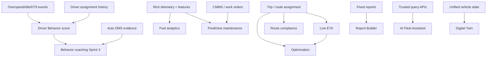

# Gap analysis

## User marking vs reality

User backlog showed all eleven items as ✅. Against the repo:

| ID | User label | Claimed | Actual | Gap summary |
|----|------------|---------|--------|-------------|
| F-01 | Driver Behavior | ✅ | PARTIAL | Need event pipeline, assignment-at-time, score, ranking UI |
| F-02 | Fleet Health Score | ✅ | PARTIAL | Need composite score model (DTC, maintenance, connectivity) |
| F-03 | Fuel Analytics | ✅ | MISSING | Entire Fuel bounded context |
| F-04 | Geofence Intelligence | ✅ | PARTIAL | Need route/corridor compliance + deeper intelligence |
| F-05 | Report Builder | ✅ | PARTIAL | Need builder + schedule + richer exports |
| F-06 | Predictive + CMMS | ✅ | MISSING | Need maintenance core before predictive ML |
| F-07 | AI Video Events | ✅ | PARTIAL | Need auto evidence policy + optional cloud AI |
| F-08 | Digital Twin | ✅ | MISSING | Unscoped product; needs unified twin model |
| F-09 | AI Fleet Assistant | ✅ | MISSING | Unscoped; depends on trusted data APIs |
| F-10 | ETA Prediction | ✅ | PARTIAL | Need trip assignment + live recompute |
| F-11 | Optimization Engine | ✅ | MISSING | Need dispatch domain + solver |

## Dependency gaps (blockers)

## Critical foundation gaps shared across features

1. **Driver ↔ vehicle assignment history** — scores, alarms-by-driver, coaching attribution are wrong without it (`known-limitations.md`, `driver-work-device-alarms` analysis).
2. **Trip / route product maturity** — ETA, optimization, geofence route compliance depend on assigned routes/trips.
3. **Maintenance context** — predictive maintenance cannot land on a stub page.
4. **Analytics / ML platform** — ClickHouse / feature pipeline / `analytics-engine` not implemented; required for true predictive + twin + assistant quality.
