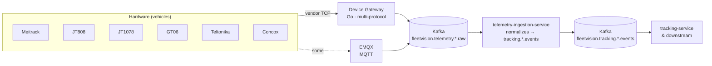
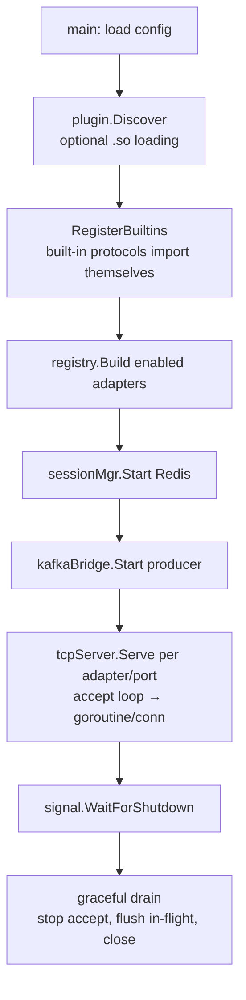
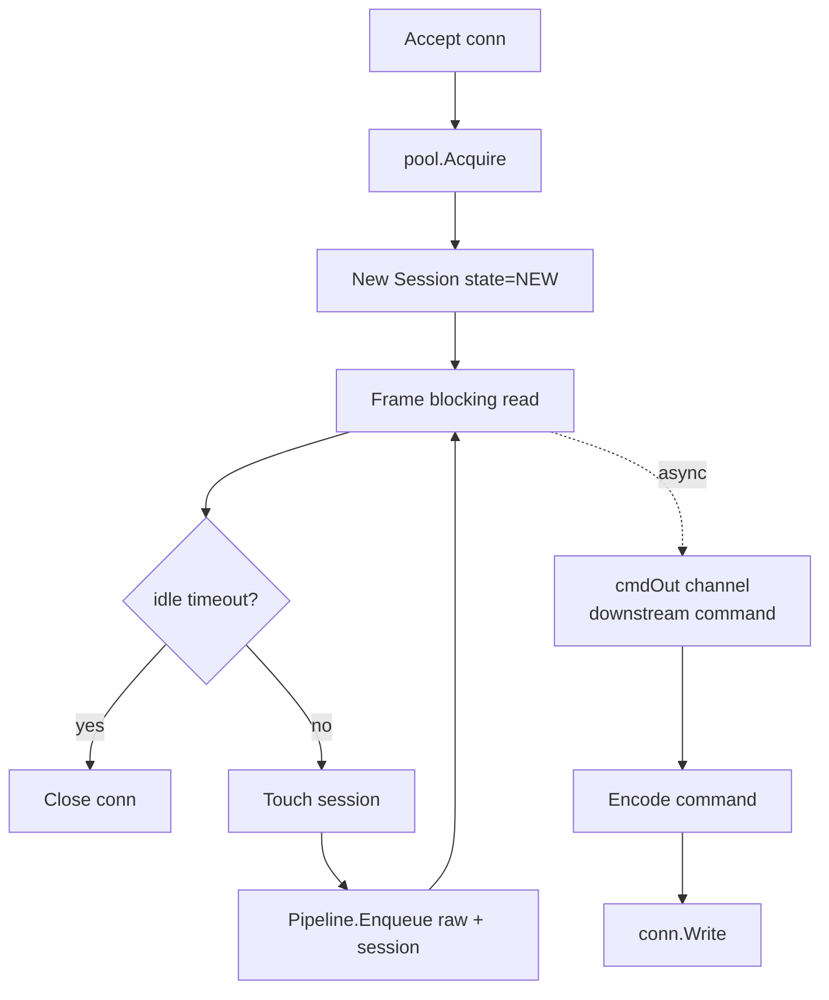
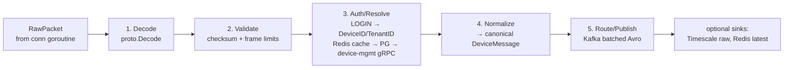
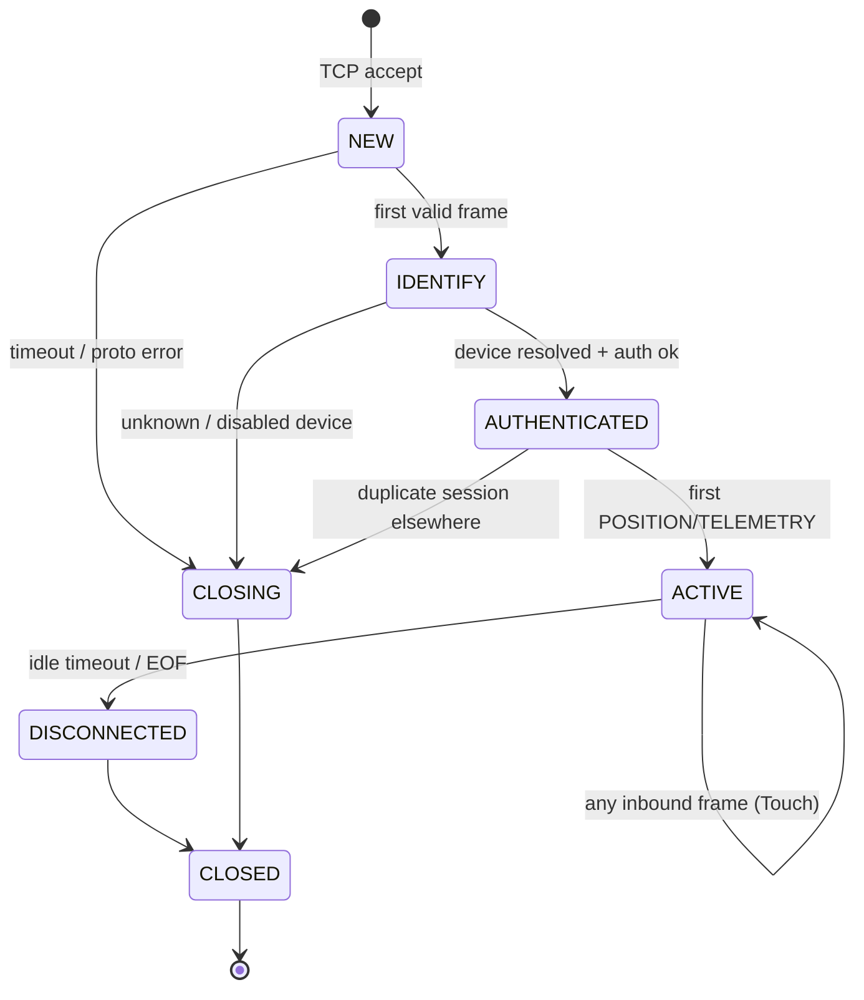
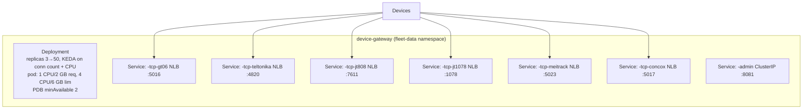

# Device Gateway Module
## Module-Level Design Document

> ⚠️ **SUPERSEDED — retained for audit history.**
> This v2.0.0 module was written for the **Go 1.22 runtime (ADR-006)**. ADR-021 retired Go from the platform; `device-gateway-service` is now **Node.js LTS + NestJS + TypeScript** per `01_Master_Architecture.md` §3 (#7) and ADR-014 (runtime updated).
>
> The **canonical** Device Gateway specification is now **`docs/specs/06_Device_Gateway.md` v1.0.0**. That document carries forward this module's domain, protocol catalog, and scaling content, and adds: first-class UDP transport, the Queclink protocol, explicit DDD framing, Node/NestJS adapter interfaces, and reconciliation to the lean-persistence foundation (ADR-022) and the `tenant:` Redis key namespace (`03` §18.3).
>
> This file is **not deleted** — it is preserved as the audit trail of the Go-era decision, per ADR-019 precedent (prior decisions are superseded, not rewritten). Do not implement from this document; implement from `06_Device_Gateway.md`.

---

**Version:** 2.0.0
**Status:** Superseded by `docs/specs/06_Device_Gateway.md` v1.0.0 (2026-08-02)
**Date:** 2026-08-02
**Bounded Context:** Telematics & Device Management (Ingestion Front-Tier)
**Service:** `device-gateway-service` (Go 1.22 — ADR-006 polyglot exception)
**Data Store:** Redis 7 (sessions, auth cache) · PostgreSQL 16 (`gateway` schema, audit)
**Messaging:** Kafka (`fleetvision.telemetry.device.raw`, `fleetvision.telemetry.position.raw`, `fleetvision.telemetry.alarm.raw`, `fleetvision.telemetry.command.*`)
**Downstream Consumer:** `telemetry-ingestion-service`

> **Relationship to foundation.** This module owns the **multi-protocol TCP front door** of the Telematics context (`02_Domain_Model.md` §1, Context 6). It is the entry point in `01_Master_Architecture.md` §2 (container topology, edge tier) and is registered as service #7 in the Service Registry. It conforms to ADR-002 (Kafka), ADR-006 (Go for high-concurrency ingestion), ADR-016 (single topic-naming convention). The sibling `docs/modules/Telemetry-Device-Management.md` owns device lifecycle, firmware, and the MQTT path; **this module owns vendor TCP protocol termination and translation** into the canonical `DeviceMessage`. v2.0.0 resolves ARR-2026-08-02-A findings MISS-2 (undocumented at arch tier), INT-4 (bare `telemetry.*` topic drift), DOC-3 (config typos).

---

## Table of Contents

1. [Module Overview](#1-module-overview)
2. [Supported Protocols](#2-supported-protocols)
3. [Protocol Abstraction Layer](#3-protocol-abstraction-layer)
4. [Plugin Architecture](#4-plugin-architecture)
5. [TCP Architecture](#5-tcp-architecture)
6. [Packet Pipeline](#6-packet-pipeline)
7. [Device Session Management](#7-device-session-management)
8. [Canonical Event Contracts](#8-canonical-event-contracts)
9. [Scaling to Millions of Devices](#9-scaling-to-millions-of-devices)
10. [Resilience & Operations](#10-resilience--operations)

---

## 1. Module Overview

### 1.1 Purpose

Most real-world telematics hardware does **not** speak MQTT. Commodity GPS trackers (GT06, Concox, Meitrack, Teltonika) and Chinese-standard in-vehicle hardware (JT808, JT1078) speak **vendor-specific binary TCP protocols**. The Device Gateway terminates these protocols, decodes the binary frames, authenticates the device, normalizes the payload to FleetVision's canonical `DeviceMessage`, and forwards the result into the Kafka-based internal pipeline that `telemetry-ingestion-service` consumes.

It is a **stateless-at-the-edge, stateful-per-connection** service: any gateway pod can serve any device, while per-connection state lives in memory + Redis.



### 1.2 Goals & Non-Goals

| Goals | Non-Goals |
|---|---|
| Terminate N vendor TCP protocols on one binary | Replace the MQTT path (EMQX) — gateway *bridges into* it |
| Add a new protocol via a single adapter plugin (no core changes) | Device lifecycle (provisioning, decommission) — device-mgmt owns |
| Sustain ≥ 100K concurrent connections per pod | Firmware OTA distribution — device-mgmt owns |
| Normalize all payloads to one canonical schema | Real-time WebSocket push to UI — tracking-service owns |
| Never drop data silently (back-pressure > loss) | Heavy business logic — push downstream |

### 1.3 Scale Targets

| Metric | Year 1 | Year 3 | Year 5 |
|---|---|---|---|
| Concurrent device connections | 50,000 | 500,000 | 2,000,000 |
| Messages/sec (platform peak) | 15,000 | 150,000 | 600,000 |
| Per-pod capacity | 100,000 connections / 20,000 msg/s | — | — |
| Gateway pods (cluster) | 3 | 15 | 30–50 |
| End-to-end device→Kafka latency | < 500ms P99 | — | — |

---

## 2. Supported Protocols

### 2.1 Protocol Catalog

| Protocol | Vendor / Standard | Transport | Framing | Auth Strategy | Port |
|---|---|---|---|---|---|
| **Meitrack** | Meitrack (Taiwan) — MVT380, MT90, P99B | TCP plaintext | Mixed text/binary; `$$<len>...<crc>*` | IMEI in first packet | 5023 |
| **JT808** | Chinese national JT/T 808-2019 (commercial vehicle) | TCP (+ SSL) | Length-prefixed; byte-stuffed; `0x7e` delimited | 0x0100 register → auth key → 0x0102 | 7611 |
| **JT1078** | JT/T 1076/1078 (in-vehicle A/V companion to JT808) | RTP-over-TCP | RTP-like header `0x30 0x31...` | Inherits JT808 session | 1078 |
| **GT06** | Concox / widely cloned (GT06, GT06N, TR06) | TCP plaintext | Start `0x78 0x78`, CRC-16, stop `0x0D 0x0A` | Login 0x01 → 8-byte IMEI (BCD) | 5016 |
| **Teltonika** | Teltonika (Lithuania) — FMC130, FMC640, FMB920 | TCP (+ TLS) | IMEI packet → AVL data; Codec8/8 Ext/16 | IMEI first; gateway acks 0x01 | 4820 |
| **Concox** | Concox family (CR/JT/X series, beyond GT06) | TCP plaintext | GT06-compatible; extra protocol nums | IMEI/serial login | 5017 |

### 2.2 Capability Matrix

| Capability | Meitrack | JT808 | JT1078 | GT06 | Teltonika | Concox |
|---|---|---|---|---|---|---|
| GPS position | ✅ | ✅ | — | ✅ | ✅ | ✅ |
| Ignition / IO | ✅ | ✅ | — | ✅ | ✅ | ✅ |
| Alarms | ✅ | ✅ | — | ✅ | ✅ | ✅ |
| Heartbeat | ✅ | ✅ | — | ✅ | ✅ | ✅ |
| Downstream commands | ✅ | ✅ | ✅ | partial | ✅ | partial |
| Diagnostics (DTC) | ✅ | ✅ | — | partial | ✅ | partial |
| Photo / video | partial | ✅ | ✅ | — | ✅ | ✅ |
| Checksum | CRC | byte-stuff + CS | RTP | CRC-16 | CRC-32 | CRC-16 |

### 2.3 Protocol Detection

For **dedicated listeners** (one port per protocol), detection is by port. For **multiplexed listeners** (one port, many protocols — used in elastic deployments), adapters expose a `Detect()` that peeks the first N bytes and returns a confidence score; the PAL picks the highest-confidence adapter above a threshold.

| Peek signal | Detected |
|---|---|
| Starts with `$$` / `\x24\x24` | Meitrack |
| Starts with `0x78 0x78` / `0x79 0x79` | GT06 / Concox |
| First frame = 2-byte length + 15-byte ASCII IMEI | Teltonika |
| JT/T 808 message-id in header + BCD phone | JT808 |
| RTP-over-TCP (`$\x00\x00…`) following JT808 setup | JT1078 |

---

## 3. Protocol Abstraction Layer

The PAL is the contract between the connection machinery and vendor-specific decoders. Every adapter implements the same interfaces, so the TCP server, session manager, and pipeline are fully protocol-agnostic.

### 3.1 Core Interfaces

```go
// Protocol identifies a vendor protocol and provides framing + codec factories.
type Protocol interface {
    ID() string                 // "meitrack" | "jt808" | "gt06" | ...
    Metadata() ProtocolMeta
    Detect(peek []byte) (confidence float32, consume bool)
    Frame(r *bufio.Reader) (RawPacket, error)
    Decode(raw RawPacket) (*DeviceMessage, error)
    Encode(cmd Command) ([]byte, error)
}

type ProtocolMeta struct {
    Name, DefaultPort, Transport string
    FramingType, AuthStrategy   string
    DeviceModels                 []string
}

type RawPacket struct {
    ProtocolID string
    Payload    []byte
    ReceivedAt time.Time
    Direction  Direction  // INBOUND | OUTBOUND
}
```

### 3.2 Canonical `DeviceMessage`

Every protocol's decoded payload normalizes to **one** canonical structure — downstream code never sees vendor formats. Aligned to the event payload of `telemetry.position.raw.v1` (§8).

```go
type DeviceMessage struct {
    MessageID    string         // UUIDv7 — idempotency key
    DeviceID     string         // resolved FleetVision device id (post-auth)
    SerialOrIMEI string         // raw identifier from wire (IMEI / serial / ICCID)
    TenantID     string         // resolved tenant
    ProtocolID   string
    Type         MessageType    // LOGIN | POSITION | ALARM | HEARTBEAT | ...
    Timestamp    time.Time      // device-reported time (UTC)
    IngestedAt   time.Time      // gateway receive time
    Position     *Position
    Alarms       []Alarm
    Telemetry    map[string]any // rpm, fuel, temp, di/ai, ...
    IO           map[string]any
    RawSize      int
    Checksum     string         // SHA-256 of payload (forensics)
}
```

### 3.3 Normalization Rules

| Vendor Concept | Canonical Field |
|---|---|
| IMEI / phone / serial in login | `SerialOrIMEI` → resolve → `DeviceID` |
| GPS fix (lat/lng/speed/heading/time) | `Position` |
| Digital/analog IO (Teltonika Codec8 DIO/AIO, GT06 IO) | `Telemetry` map |
| Alarm / SOS / geofence / power-cut | `Alarms[]` with `Source` = raw vendor code |
| Heartbeat / keepalive | `Type=HEARTBEAT` (no `Position`) |
| JT808 0x0200 location | `Type=POSITION` + alarms from 0x02 bitfield |
| JT1078 0x9101/0x9102 video trigger | `Type=PHOTO` → forwarded to media-service |
| Teltonika ignition bit | `Position.IgnitionOn`, `Telemetry` |

---

## 4. Plugin Architecture

New protocols are added **without touching gateway core code**. Each adapter is a self-contained Go plugin registered at startup via the Plugin Registry.

### 4.1 Plugin Contract

```go
// Adapter plugins implement this and self-register via init().
type ProtocolPlugin interface {
    NewProtocol(cfg AdapterConfig) (Protocol, error)
}

// Built-in registration (default — fastest, type-safe)
func init() { gateway.RegisterProtocol("gt06", &GT06Plugin{}) }
```

### 4.2 Discovery Modes

| Mode | Mechanism | Use |
|---|---|---|
| **Built-in (compiled)** | Adapter packages imported in `main`; `init()` registers | Default 6 protocols — fastest, type-safe |
| **Out-of-tree (Go `plugin`)** | `.so` files loaded from a directory at startup | Customer-specific / experimental protocols without recompile |

> Go's `plugin` package is Linux-only and requires a matching Go toolchain. Built-in registration is the default; `plugin` is opt-in per deployment.

### 4.3 Adapter Configuration

```yaml
gateway:
  adapters:
    - id: gt06
      enabled: true
      listener: tcp
      port: 5016
      options: { idle-timeout: 180s, keepalive: 30s, max-frame-bytes: 4096 }
    - id: teltonika
      enabled: true
      port: 4820
      options: { codec-8-extended: true }
    - id: jt808
      enabled: true
      port: 7611
      options: { bcd-phone-width: 12, auth-key-cache-ttl: 5m }
    - id: jt1078
      enabled: true
      port: 1078
    - id: meitrack
      enabled: true
      port: 5023
    - id: concox          # (fixed: ARR DOC-3 — was "coax"/"connaqx")
      enabled: true
      port: 5017
```

### 4.4 Lifecycle



### 4.5 Hot Reload

- **SIGHUP / admin API**: enable/disable adapters without restart; new listeners opened, retired ones drained.
- **Plugin reload**: out-of-tree `.so` adapters swappable via admin API; existing connections finish on old, new use new.

---

## 5. TCP Architecture

### 5.1 Per-Protocol Listeners

The gateway opens one `net.Listener` per enabled protocol; each runs an accept loop that spawns a goroutine per accepted connection.

```go
func (s *TCPServer) Serve(ctx context.Context, proto Protocol, port int) error {
    ln, _ := net.Listen("tcp", fmt.Sprintf(":%d", port))
    for {
        conn, err := ln.Accept()
        if err != nil {
            select { case <-ctx.Done(): return nil; default: continue }
        }
        if s.pool.Full() {
            conn.Close()                 // shed load (back-pressure, not silent drop)
            s.metrics.ConnectionsShed.Inc()
            continue
        }
        go s.handle(ctx, proto, conn)    // goroutine-per-connection
    }
}
```

### 5.2 Connection Handler



### 5.3 Buffering & Deadlines

| Setting | Value | Rationale |
|---|---|---|
| Read buffer | 16–64 KB | Most frames < 512 B; AVL/media bursts larger |
| `SetReadDeadline` | reset on every `Frame` | drives idle timeout without a separate timer |
| `SetKeepAlive` | OS off (app heartbeat) | consistent across platforms |
| `SetNoDelay` | true (Nagle off) | request/response protocols — latency > throughput |
| Max frame size | 64 KB (per adapter) | protects against malicious oversize |

### 5.4 TLS Termination

For protocols supporting TLS (Teltonika, JT808-SSL), the listener wraps `tls.NewListener` with certs from Vault (rotated by cert-manager). Legacy plaintext protocols sit behind a TLS-terminating sidecar only where regulation requires; otherwise mTLS at the device where supported.

---

## 6. Packet Pipeline

Once `Frame()` yields a `RawPacket`, it enters an **asynchronous, staged pipeline**. Decoupling decode/normalize/publish from the read loop keeps the hot path responsive — one slow Kafka produce must not stall reads.

### 6.1 Stages



| Stage | Responsibility | Failure Handling |
|---|---|---|
| Decode | `proto.Decode(raw)` → vendor intermediate | Drop + `decode.error` metric |
| Validate | checksum/CRC; size limits | Drop + `validation.error` |
| Auth/Resolve | LOGIN: `SerialOrIMEI` → DeviceID/TenantID (Redis → PG → gRPC) | Send auth-fail; close conn |
| Normalize | vendor intermediate → canonical `DeviceMessage` | Log + drop |
| Route/Publish | pick Kafka topic by `Type`; batched Avro | back-pressure via bounded channel |

### 6.2 Back-Pressure

Bounded channels between stages; when Kafka is slow:

```
conn → decodeCh (cap 10K) → validate → publishCh (cap 5K) → Kafka
                                            │ when full →
                                  blocks upstream → decodeCh fills →
                                  conn read blocks (TCP back-pressure)
```

The device's send buffer fills → it backs off (most protocols are polling/ack-based). **No data is silently dropped.**

### 6.3 Worker Model

| Stage | Workers (per CPU core) | Bound |
|---|---|---|
| Decode | 1.0× | CPU |
| Validate | 0.5× | CPU |
| Auth/Resolve | 0.5× | Redis/PG I/O |
| Normalize | 0.5× | CPU |
| Publish | 2.0× | Kafka I/O |

### 6.4 Idempotency & Ordering

- **Ordering per device** preserved by Kafka key = `device_id` → single partition → per-device consumer order.
- **Idempotency** by `MessageID` (UUIDv7); consumers dedupe on `(device_id, message_id)`.
- **Late/duplicate frames** detected via `(device_id, deviceTimestamp)` Redis cache (5-min window).

---

## 7. Device Session Management

A **session** is the live association between a device identity and its TCP connection. Sessions are the unit of command dispatch and liveness monitoring.

### 7.1 Session Lifecycle State Machine



**Invariants:** (i) a `DeviceMessage` is never published before AUTHENTICATED (cannot tag valid `tenant_id` otherwise) — fail-closed; (ii) a downstream command is never written to a socket in NEW/IDENTIFY/CLOSING; (iii) `SessionID` stable for the connection's life; reconnect yields a new `SessionID`.

### 7.2 Two-Tier Session Store

| Tier | Where | Purpose |
|---|---|---|
| **Local** (in-process) | sharded map keyed by `DeviceID` | O(1) command dispatch on the owning instance |
| **Global** (Redis) | `session:device:<deviceID>` → `{instanceID, sessionID, protocol, since}` | Cross-instance lookup: "which pod holds this device?" |

Downstream command flow: Kafka `fleetvision.telemetry.command.request` → gateway looks up `session:device:<id>` in Redis → owning instance → enqueue on local `cmdOut` channel → encode → write to socket. No session → NACK `DEVICE_OFFLINE`.

### 7.3 Reconnection & Affinity

Devices roam between pods (LB round-robin). New connection from a known `DeviceID` → replace session: prior instance detects EOF → DISCONNECTED → deletes local; new instance registers globally (last-write-wins on Redis with `EstablishedAt` comparison); older forcefully closed with `DUPLICATE_SESSION` where supported.

---

## 8. Canonical Event Contracts

Resolves ARR INT-4: gateway now uses the **single platform naming convention** (`fleetvision.<domain>.<...>`), not bare `telemetry.*`.

### 8.1 Topics Produced

| Topic | Key | Schema | Producer | Consumers |
|---|---|---|---|---|
| `fleetvision.telemetry.device.raw` | `device_id` | Avro `DeviceMessage` | gateway | telemetry-ingestion |
| `fleetvision.telemetry.position.raw` | `device_id` | Avro `Position` | gateway | telemetry-ingestion → tracking |
| `fleetvision.telemetry.alarm.raw` | `device_id` | Avro `Alarm` | gateway | telemetry-ingestion → notification |
| `fleetvision.telemetry.command.ack` | `command_id` | Avro `CommandAck` | gateway | originating service |

### 8.2 Topics Consumed

| Topic | Event | Handler Action |
|---|---|---|
| `fleetvision.telemetry.command.request` | downstream command | route to owning instance → encode → write to socket |

### 8.3 Sample Event — `telemetry.position.raw.v1` (CloudEvents)

```json
{
  "specversion": "1.0",
  "type": "telemetry.position.raw.v1",
  "source": "/device-gateway-service",
  "id": "evt_0191...-...",
  "time": "2026-08-02T14:30:00.000Z",
  "datacontenttype": "application/avro",
  "data": {
    "message_id": "0191...", "device_id": "...", "tenant_id": "...",
    "serial_or_imei": "490154203237518", "protocol_id": "teltonika",
    "type": "POSITION", "timestamp": "2026-08-02T14:29:55Z",
    "position": { "latitude": 40.7128, "longitude": -74.0060,
                  "speed_kmh": 65.5, "heading": 180.0, "ignition_on": true },
    "telemetry": { "di1": true, "ain1": 12.4 }
  },
  "fleetvision": { "tenant_id": "...", "correlation_id": "...", "aggregate_id": "..." }
}
```

---

## 9. Scaling to Millions of Devices

### 9.1 Stateless-at-the-Edge, Coordinated-by-Redis

Any pod serves any device — **no session affinity** at the LB. Plain TCP load balancing (AWS NLB / Kubernetes `Service`). On pod death: TCP connections drop → devices reconnect (reconnect-tolerant by design); Redis session entries TTL-expire (60s) or tombstoned by the new owner.

### 9.2 Kubernetes Topology



- **HPA/KEDA triggers:** `gw_connections_active > 70% per-pod cap`; CPU > 65%; publish lag > 5K.
- **Rolling updates** with `maxUnavailable: 0, maxSurge: 1`; each pod drains ~60s (stop accepting, finish in-flight, close with clean frames).
- **Surge capacity:** 2× headroom (vision guardrail).
- **NetworkPolicy:** deny-all default; ingress only from device IP ranges (TCP) + platform namespace (admin).

### 9.3 Throughput Sizing

| Scenario | Per-pod | Cluster (10 pods) |
|---|---|---|
| Concurrent connections | 100,000 | 1,000,000 |
| Inbound msgs/sec | 20,000 | 200,000 |
| Device→Kafka P99 latency | < 500ms | < 1s |

Year-5 (600K msg/s platform): ~30–50 pods.

### 9.4 Geographic / Data-Residency

EU devices terminate in `eu-west-1` (GDPR). DNS / device provisioning gives EU devices `eu.gateway.`, US devices `us.gateway.`. Every event tagged with resolved `tenant_id` → downstream RLS enforces isolation. No cross-region device traffic.

---

## 10. Resilience & Operations

### 10.1 Failure Modes & Auto-Response

| Failure | Detection | Response |
|---|---|---|
| Pod crash | Liveness probe | Restart; devices reconnect across pods |
| Redis unreachable | circuit breaker | Continue with local session cache (degraded: cross-instance dispatch paused); alert |
| Kafka slow/unreachable | publish-lag metric | Back-pressure to devices; buffer to capacity; alert at 80% |
| PG (auth cache) unreachable | circuit breaker | Serve from Redis cache; miss → fail auth-safe (close); alert |
| device-mgmt gRPC down | circuit breaker | Last-known-good Redis cache for auth |
| Reconnect storm | conn-rate alert | Interconnect jitter + scale up |

### 10.2 Connection Pool

Bounded capacity (default 100K/pod). When full → stop accepting (LB retries another pod or device retries). Eviction policy: NEW > 10s first; then no-data > 3× interval; never authenticated-with-data.

### 10.3 Heartbeat (Three Concepts)

| Concept | Definition | Default |
|---|---|---|
| App heartbeat (protocol) | Device-emitted keepalive (Teltonika `0x00 0x00`, GT06 `0x8A`, JT808 `0x0002`) | per protocol |
| Idle timeout | Max socket silence before close | 180s |
| Data liveness | Time since last useful payload (POSITION/TELEMETRY) — drives "stale device" | 3× reporting interval |

Idle timeout enforced via `SetReadDeadline` (O(1) per connection). A supervisor emits `DEVICE_DATA_STALE` alarms into `fleetvision.telemetry.alarm.raw` for stale authenticated sessions.

### 10.4 Admin API

Base `/api/v1/gateway` (platform-admin: `telemetry.gateway.manage`):

| Method | Endpoint | Purpose |
|---|---|---|
| `GET` | `/health` | Liveness/readiness |
| `GET` | `/metrics` | Prometheus |
| `GET` | `/listeners` | Active protocol listeners |
| `POST` / `DELETE` | `/listeners/{adapterId}` | Enable/disable adapter |
| `GET` | `/sessions` | Active sessions (filter tenant/protocol/device) |
| `DELETE` | `/sessions/{deviceId}` | Force-disconnect |
| `GET` | `/connections/events` | Connection audit (paginated) |
| `GET` | `/stats` | Per-protocol stats |

### 10.5 gRPC (Service-to-Service)

```protobuf
service DeviceGatewayService {
  rpc GetSession       (GetSessionRequest)       returns (SessionInfo);
  rpc DisconnectDevice (DisconnectRequest)       returns (DisconnectResponse);
  rpc SendCommand      (SendCommandRequest)      returns (SendCommandResponse);
  rpc ManageListener   (ManageListenerRequest)   returns (ManageListenerResponse);
}
```

---

## Appendix A: Traceability

| Foundation Element | This Module |
|---|---|
| `00` Scale pillar (2M devices) | §1.3, §9 |
| `01` §2 Container topology (edge tier) | §1.1 |
| `01` §3 Service Registry #7 | §1 header |
| `01` §6 Event-driven (single topic convention, ADR-016) | §8 |
| `02` §1 Context 6 (Telematics) | §1 |
| `02` §6 Permission catalog (`telemetry.gateway.*`) | §10.4 |
| ADR-002 (Kafka), ADR-006 (Go), ADR-016 (naming) | Throughout |
| ARR-2026-08-02-A MISS-2, INT-4, DOC-3 | Resolved in v2.0.0 |

---

*This Device Gateway module is the multi-protocol TCP ingestion front tier. Maintained alongside `docs/modules/Telemetry-Device-Management.md` (device lifecycle + MQTT path) and consistent with the v2.0.0 foundation. Adapter source: `device-gateway-service/pkg/protocols/<vendor>/`.*
