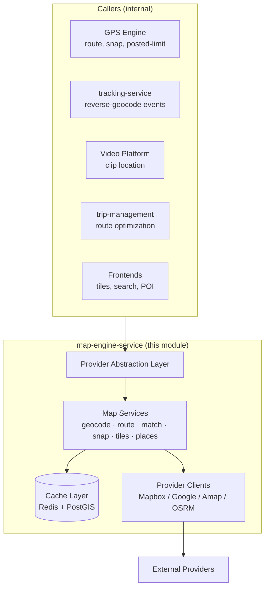
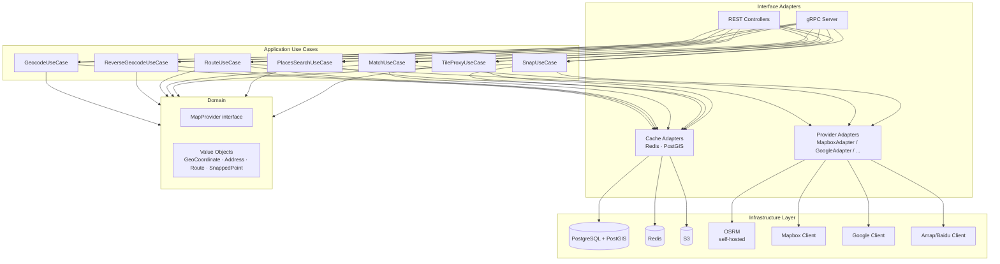
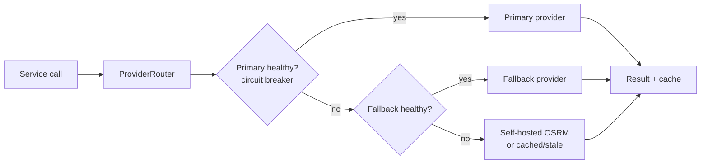

# Map Engine Module
## Module-Level Design Document

**Version:** 2.0.0
**Status:** Approved — Foundation-Aligned
**Date:** 2026-08-02
**Bounded Context:** Tracking & Monitoring (Geospatial Services Sub-Domain)
**Service:** `map-engine-service` (Kotlin / Spring Boot 3.3 + JVM 21) · OSRM (Go/C++, self-hosted) for high-volume map-matching
**Data Store:** PostgreSQL 16 + PostGIS (geofence/POI geometry, cache) · Redis (geocode/route/snap cache) · S3 (custom POI datasets, road snapshots)
**External:** Mapbox (primary) / Google Maps (fallback) / Amap-Baidu (China) / OSRM (self-hosted)
**Messaging:** Kafka (consumes `fleetvision.tracking.position.raw` opportunistically; emits nothing canonical — purely a query/service layer)

> **Relationship to foundation.** This module is the **geospatial services backbone** within the Tracking & Monitoring context (`02_Domain_Model.md` §1, Context 7). It centralizes **map provider abstraction, map-matching (snap-to-road), routing + ETA, geocoding, and tile serving** — concerns that the GPS Engine, Tracking service, Video Platform, and frontends all need but no single owner previously provided. It conforms to ADR-002 (Kafka), ADR-006 (Kotlin), ADR-008 (polyglot — PostGIS + Redis + S3). Adding it as a distinct deployable unit (Service Registry #21) avoids duplicating provider calls across 5+ consumers and creates one place to enforce caching, cost control, and provider failover.

---

## Table of Contents

1. [Module Overview](#1-module-overview)
2. [Architecture](#2-architecture)
3. [Map Services](#3-map-services)
4. [Protocol / Provider Abstraction](#4-protocol--provider-abstraction)
5. [Geospatial Database](#5-geospatial-database)
6. [Map Matching (Snap-to-Road)](#6-map-matching-snap-to-road)
7. [Routing & ETA](#7-routing--eta)
8. [Geocoding](#8-geocoding)
9. [Tiles & Frontend Rendering](#9-tiles--frontend-rendering)
10. [Scaling](#10-scaling)

---

## 1. Module Overview

### 1.1 Purpose

Maps are everywhere in FleetVision — the live fleet map, trip playback, route adherence, POI resolution, speed-limit lookup, incident geolocation, video-clip location. Each of these requires one or more of: **tile rendering**, **geocoding** (address ↔ coordinate), **routing** (path + ETA + traffic), **map-matching** (snap-to-road), and **spatial queries** (geofence, nearest).

Without a Map Engine, each consumer calls map providers directly — duplicating caching, blowing through provider quotas, paying 5× the egress, and producing inconsistent results (one service snaps to one road version, another to a different one). The Map Engine centralizes these as **internal platform services** with aggressive caching, provider abstraction, cost controls, and one authoritative geospatial data store (PostGIS).

### 1.2 Position in the Platform



### 1.3 Goals & Non-Goals

| Goals | Non-Goals |
|---|---|
| One place for map provider calls + caching | Replace the tracking-service geofence *evaluator* (stays in GPS Engine) |
| Provider abstraction (swap per region/tenant) | Own the VehicleTracker aggregate (stays in tracking-service) |
| Cost control (caching, quotas, budgets) | Build our own road graph / base maps |
| Authoritative PostGIS store for POIs / addresses | Compute mileage/trips (GPS Engine owns) |
| Snap-to-road (HMM map-matching) at scale | Render vector tiles ourselves (use Mapbox/MapLibre) |

### 1.4 Service Classification

Added to the Service Registry (`01_Master_Architecture.md` §3) as **#21 `map-engine-service`** — Kotlin/Spring Boot, Tier 1 SLO. Belongs to the Real-Time Data team (alongside tracking, telemetry-ingestion, device-gateway).

---

## 2. Architecture

### 2.1 Layered Design (Clean Architecture)



### 2.2 Why a Separate Service (not a library)

| Concern | Library | Service (chosen) |
|---|---|---|
| Caching | per-app instance (duplicated) | shared Redis cache (1 lookup serves all) |
| Provider quotas | each consumer burns quota | one consumer, one quota, one budget |
| Failover | each app implements | one place |
| Cost attribution | invisible | per-tenant tagging |
| Road-graph consistency | each snap may use a different provider version | one source of truth |
| Road snapshot (OSRM) | can't share a self-hosted OSRM from a library | OSRM is a service dependency |

The service boundary pays for itself in provider cost savings alone.

---

## 3. Map Services

The Map Engine exposes seven services. All are idempotent, cacheable, and provider-abstracted.

| Service | Purpose | Cache TTL | Cost Driver |
|---|---|---|---|
| **Forward Geocode** | address → coordinates | 30 days | per-call |
| **Reverse Geocode** | coordinates → address | 30 days | per-call |
| **Route** | waypoints → polyline + ETA (+ traffic) | 1h (with traffic) / 24h (static) | per-call |
| **Map-Match** | sequence of positions → snapped road path | forever (immutable per input) | per-call (expensive) |
| **Snap** | single point → nearest road + posted limit | 7 days | per-call |
| **Places Search** | text → POIs / addresses | 7 days | per-call |
| **Tile Proxy** | vector/raster tile proxy + CDN origin | CDN-managed | per-tile (high volume) |

### 3.1 Service-Level Agreement (Internal)

| Operation | P99 Latency | Notes |
|---|---|---|
| Geocode (cache hit) | < 5ms | 99%+ hit rate at stable addresses |
| Reverse-geocode (cache hit) | < 5ms | — |
| Route (cache hit) | < 20ms | — |
| Route (provider call) | < 800ms | provider-dependent |
| Snap (cache hit) | < 5ms | — |
| Map-Match (provider/batch) | < 2s | up to 100 points |
| Tile proxy | < 50ms | CDN-fronted |

---

## 4. Protocol / Provider Abstraction

### 4.1 The `MapProvider` Interface

```kotlin
interface MapProvider {
    fun reverseGeocode(point: GeoCoordinate): Address?
    fun geocode(address: String): List<GeoCoordinate>
    fun route(waypoints: List<GeoCoordinate>, opts: RouteOpts): Route
    fun match(positions: List<GeoCoordinate>): List<SnappedPoint>
    fun snap(point: GeoCoordinate): SnappedPoint         // includes posted limit
    fun tilesUrl(style: String): String
    fun trafficDelay(route: Route): Duration
}
```

### 4.2 Provider Strategy

| Concern | Provider | Why |
|---|---|---|
| Vector tiles (rendering) | **Mapbox GL** primary / Google fallback | rich styling, fleet-grade perf |
| Geocoding | Mapbox primary / Google fallback | accuracy, global coverage |
| Routing + traffic | Mapbox Directions / Google Routes | ETA, real-time traffic |
| Map-matching (snap) | Mapbox Map Matching API / **OSRM (self-hosted)** | OSRM for cost on high volume |
| China region | **Amap / Baidu** | regulatory + accuracy (foreign maps are offset/wrong in China) |
| Static map snapshots | Mapbox Static | report thumbnails |

### 4.3 Region / Tenant Routing

A `ProviderRouter` selects the provider per call based on:

1. **Tenant region** — China tenants → Amap/Baidu (mandatory for accuracy + legality).
2. **Tenant config** — Enterprise tenants may pin a provider (e.g., customer's existing Google enterprise contract).
3. **Health** — circuit breaker on provider errors → failover.
4. **Cost budget** — if Mapbox monthly budget at 80%, shift snap calls to self-hosted OSRM.

### 4.4 Failover



---

## 5. Geospatial Database

PostGIS is the authoritative store for **platform-owned** geospatial data (POIs, address cache, geofence geometry mirror). The GPS Engine owns *evaluation* of geofences against positions; this engine owns the **geometry store and address/POI catalog** that evaluation and other services consume.

### 5.1 PostgreSQL + PostGIS Schema (`geo` schema)

```sql
-- Reverse-geocode / address cache (long-lived; 30-day TTL enforced by app)
geo.addresses (
  id BIGINT PK,                          -- H3 index of rounded point
  geom geography(Point, 4326) NOT NULL,
  formatted_address TEXT NOT NULL,
  components JSONB NOT NULL,             -- street, city, state, postal, country
  provider TEXT NOT NULL,
  cached_at TIMESTAMPTZ NOT NULL DEFAULT now()
)
CREATE INDEX addresses_geom_gist ON geo.addresses USING GIST (geom);

-- POI catalog (platform-defined + tenant-defined)
geo.pois (
  poi_id UUID PK,
  tenant_id UUID,                        -- NULL = platform POI
  name TEXT NOT NULL,
  category TEXT NOT NULL,                -- DEPOT, CUSTOMER, FUEL, YARD, CHARGER, ...
  geom geography(Point, 4326) NOT NULL,
  geofence_id UUID,                      -- optional linked geofence
  metadata JSONB NOT NULL DEFAULT '{}',
  created_at, updated_at
)
CREATE INDEX pois_tenant_geom_gist ON geo.pois USING GIST (geom);

-- Posted speed-limit cache (road-segment → limit), populated by snap calls
geo.speed_limits (
  segment_id TEXT PK,                    -- provider road segment id
  geom geography(LineString, 4326) NOT NULL,
  speed_limit_kmh INT NOT NULL,
  road_class TEXT,
  provider TEXT, cached_at
)
CREATE INDEX speed_limits_geom_gist ON geo.speed_limits USING GIST (geom);

-- Pre-computed trip polylines (simplified, from GPS Engine)
geo.trip_polylines (
  trip_id UUID PK,
  tenant_id UUID NOT NULL,
  vehicle_id UUID NOT NULL,
  geom geography(LineString, 4326) NOT NULL,
  point_count INT, simplified BOOLEAN,
  created_at
)
```

### 5.2 Spatial Indexing

- **GiST** on every `geography` column — workhorse for `ST_DWithin`, `ST_Covers`, KNN.
- **H3 cell** column (resolution 9, ~174m edge) on `pois` and `addresses` for fast fleet-density/heatmap + bucketed lookup at extreme scale.
- PostGIS extension enabled (per `03_Database_Architecture.md` §10).

### 5.3 Redis Cache Topology

| Key | TTL | Purpose |
|---|---|---|
| `geo:rev:<lat>,<lng>` (rounded ~10m) | 30d | Reverse-geocode |
| `geo:fwd:<sha(address)>` | 30d | Forward geocode |
| `geo:route:<sha(waypoints+opts)>` | 1h | Route (traffic) |
| `geo:route:static:<sha>` | 24h | Route (no traffic) |
| `geo:snap:<veh>:<ts>` | forever (LRU) | Snap (immutable) |
| `geo:limit:<segmentId>` | 7d | Posted speed limit |
| `geo:match:<sha(positions)>` | forever (LRU) | Map-match result |

A reverse-geocode for a depot hits cache 99.9% of the time.

### 5.4 Cold / Bulk Datasets (S3)

- **Custom POI datasets** (tenant uploads of customer/depot lists) → S3 → ingested into `geo.pois`.
- **OSRM road snapshot** (`.osm.pbf`) → S3 → OSRM reload weekly.
- **Pre-computed fleet-density rasters** (H3 aggregates) for heatmap tiles.

---

## 6. Map Matching (Snap-to-Road)

The most computationally expensive geospatial operation and the highest-value for accuracy: turning noisy GPS into a clean road-network path.

### 6.1 When Used

| Engine | Use |
|---|---|
| GPS Engine (Route) | snap positions to assigned route for adherence |
| GPS Engine (Mileage) | road-network distance for trip mileage |
| GPS Engine (Replay) | visually clean playback (no off-road jitter) |
| GPS Engine (Speed) | posted-limit lookup requires a snapped road segment |

### 6.2 Algorithm — Hidden Markov Model

States = road segments; observations = GPS positions.

- **Transition probability** ∝ network distance between candidates vs great-circle distance (penalize implausible jumps).
- **Emission probability** ∝ Gaussian over perpendicular distance to road (σ ≈ accuracy).
- **Decoded** with the **Viterbi** algorithm → most likely road path.

### 6.3 Implementation Split

| Path | Engine | Why |
|---|---|---|
| Real-time single-point snap | Local lightweight HMM in `map-engine-service` | latency budget (< 100ms) |
| Batch trip map-match (≤100 pts) | **Mapbox Map Matching API** | accuracy, fresh road graph |
| High-volume batch (cost-sensitive) | **Self-hosted OSRM** | no per-call cost; weekly road snapshot |
| China | **Amap/Baidu** match API | correct road graph (foreign maps offset) |

The `match()` use case picks provider by config (cost-budget aware via `ProviderRouter`).

### 6.4 Output

`SnappedPoint { coordinate, roadSegmentId, roadName, postedLimitKmh, snappedAt, confidence }`. Results cached forever (immutable per input hash) → repeated replay of the same trip is free.

---

## 7. Routing & ETA

### 7.1 Route Model

```kotlin
data class Route(
    val polyline: List<GeoCoordinate>,          // snapped to roads
    val distanceKm: Double,
    val durationSec: Long,                       // current-traffic estimate
    val legs: List<RouteLeg>,                    // waypoint-to-waypoint
    val trafficDelaySec: Long,
    val provider: String
)
```

### 7.2 Service Modes

| Mode | Traffic | Cache TTL | Use |
|---|---|---|---|
| **Static** | none | 24h | planned route, distance calc |
| **Live** | real-time | 1h | dispatch ETA, en-route replanning |
| **Optimized** | visited-order optimization (TSP-ish) | 1h | multi-stop trip planning |

### 7.3 ETA Calculation

```
ETA = now + Σ( remaining_segment_distance / effective_speed )
effective_speed = min( speedLimit × driverFactor, realTimeTrafficSpeed )
```

- `speedLimit` from `geo.speed_limits` (populated by snap calls).
- `driverFactor` learned per driver (provided by analytics-engine via the driver profile).
- `realTimeTrafficSpeed` from the provider's live-traffic feed.

ETA shifts > 5 min → consumer (GPS Engine) emits `tracking.route.eta.updated.v1`.

### 7.4 Optimization (Multi-Stop)

For multi-stop trips, the engine uses the provider's optimized-routing endpoint (Mapbox Optimization API / OSRM `trip` plugin) — solves a small TSP given the stops + constraints (time windows, HOS). Result is advisory; the dispatcher confirms.

---

## 8. Geocoding

### 8.1 Forward (Address → Coordinates)

User/tenant enters an address (depot, customer) → `geocode(address)` → `List<GeoCoordinate>` (may be ambiguous). Used in: fleet-mgmt (vehicle registration address), trip-mgmt (stop address), admin (org address).

### 8.2 Reverse (Coordinates → Address)

Every event (stop, idle, geofence, behavior, incident) is enriched with a human-readable address via `reverseGeocode(point)` before display. The Stop Engine calls this to resolve POI; the result is cached and reused by every downstream view.

### 8.3 Batch Reverse-Geocode

For bulk report generation, the engine batches reverse-geocodes (rounded to ~10m to maximize cache hits): multiple events at the same depot = one lookup. This is the single biggest cost saver.

### 8.4 Address Normalization

Forward-geocoded addresses are **normalized** (USPS / provider canonical form) and stored in `geo.addresses` so the same address entered slightly differently resolves consistently.

---

## 9. Tiles & Frontend Rendering

### 9.1 Tile Proxy

The Map Engine proxies vector/raster tile requests to the provider (Mapbox), acting as a CDN origin. Benefits:
- Single provider account (volume pricing).
- Per-tenant tile-style customization (Enterprise branding overlays).
- Consistent API key handling (never expose provider keys to the browser).

### 9.2 Frontend Integration

| Capability | Implementation |
|---|---|
| Live fleet map | Mapbox GL JS; ~10K vehicle markers via clustering; live updates over WebSocket |
| Follow mode | camera tracks a vehicle; heading rotation |
| Trip playback | GPS Engine Replay output animated along the snapped LineString |
| Geofence editor | draw polygon/circle → POST geofence (tracking-service) |
| Layers | traffic, weather, satellite, custom POIs (from `geo.pois`) |
| Heatmaps | H3-aggregated density tiles from ClickHouse/S3 |

### 9.3 Marker Performance

Above ~2,000 visible vehicles the frontend switches to **server-side clustering**: `GET /map/clusters?bbox=…&zoom=…` returns aggregated markers. This keeps the browser responsive on a 10,000-vehicle fleet view.

### 9.4 Map Style per Tenant

Enterprise tenants can override the base style (brand colors, custom POI icons, hidden default POIs). Styles served from S3; the tile proxy injects the tenant's style URL on session.

---

## 10. Scaling

### 10.1 Load Profile

| Path | Year 1 | Year 5 |
|---|---|---|
| Reverse-geocode calls/sec | ~1,000 | ~50,000 (every event enriched) |
| Route calls/sec | ~50 | ~1,000 |
| Snap/match calls/sec | ~500 | ~20,000 |
| Tile requests/sec (peak, fleet ops) | ~2,000 | ~30,000 |

### 10.2 Scaling Mechanisms

| Layer | Mechanism | Trigger |
|---|---|---|
| `map-engine-service` | HPA (CPU + RPS) | CPU > 70% |
| Cache hit rate | Aggressive Redis + PostGIS | ≥ 99% geocode, ≥ 90% route |
| OSRM | Horizontal (stateless) + read replicas of road graph | CPU > 70% |
| PostGIS | Read replicas | read QPS |
| Tile delivery | CDN (Cloudflare) in front of tile proxy | — |

### 10.3 Cost Control (Primary Concern)

Map provider calls are a top-3 variable cost. Controls:

| Lever | Mechanism | Savings |
|---|---|---|
| **Aggressive caching** | geocode 30d, route 1h, snap forever | eliminates majority of repeat calls |
| **Snap-on-trip-only** | snap during trip segments, not every raw position | 90%+ reduction vs naive |
| **Batched reverse-geocode** | round to ~10m; coalesce same-location events | huge for report generation |
| **Self-hosted OSRM** | shift map-matching from provider to OSRM at scale | per-call cost → zero |
| **Per-tenant budgets + quotas** | track per tenant; alert at 80% | noisy-tenant containment |
| **Tiered delivery** | mobile gets 360p tiles; desktop 720p | egress reduction |
| **CDN for tiles** | Cloudflare caches tiles at edge | offloads origin |

### 10.4 Failure Modes

| Failure | Detection | Response |
|---|---|---|
| Provider outage (Mapbox) | circuit breaker | Failover to Google; if both down, serve cached/stale + alert |
| OSRM pod crash | Liveness | Restart (stateless); road graph on shared volume |
| Redis cache down | circuit breaker | Fall through to PostGIS / provider; degrade gracefully |
| PostGIS down | Patroni | Auto-failover (< 30s) |
| Tile provider rate-limited | 429 back-off | Throttle; CDN absorbs; alert |

### 10.5 Multi-Region

Each region runs its own `map-engine-service` + OSRM + PostGIS replica. China region uses Amap/Baidu exclusively (regulatory). Provider accounts are per-region for data-residency compliance. Cross-region calls never happen for live map operations.

### 10.6 Capacity Headroom

2× headroom (vision guardrail); reverse-geocode and snap paths load-tested at 10× projected; OSRM benchmarked at 5,000 matches/sec/node.

---

## Appendix A: API Reference

Base path: `/api/v1/map` (internal-service + frontend; permissions per caller). REST contracts follow `API_Design.md`.

### A.1 REST

| Method | Endpoint | Description | Permission |
|---|---|---|---|
| `GET` | `/geocode?address=…` | Forward geocode | any authenticated |
| `GET` | `/reverse?lat=…&lng=…` | Reverse geocode | any authenticated |
| `GET` | `/route?waypoints=…&mode=…` | Route (static/live/optimized) | any authenticated |
| `POST` | `/match` | Map-match a position sequence (batch) | `tracking.replay.read` |
| `GET` | `/snap?lat=…&lng=…` | Snap point → road + posted limit | internal |
| `GET` | `/places?q=…` | Places (POI) search | any authenticated |
| `GET` | `/clusters?bbox=…&zoom=…` | Server-side vehicle clustering | `tracking.position.live` |
| `GET` | `/tiles/style/{tenant}` | Tenant map style URL | any authenticated |
| `GET` | `/pois` / `POST` `/pois` | POI catalog (tenant-scoped) | `tracking.geofence.read` / `.create` |
| `GET` | `/health` · `/metrics` | Liveness / Prometheus | none / scraped |

### A.2 gRPC (Internal — high-volume)

```protobuf
service MapEngineService {
  rpc ReverseGeocode (Point)           returns (Address);
  rpc BatchReverse   (BatchPointsReq)  returns (BatchAddressResp);
  rpc GetRoute       (RouteRequest)    returns (Route);
  rpc MatchRoute     (MatchRequest)    returns (SnappedPath);
  rpc SnapPoint      (Point)           returns (SnappedPoint);   // includes posted_limit
  rpc ResolveClusters(ClusterReq)      returns (ClusterResp);
}
```

`SnapPoint` and `ReverseGeocode` are hot paths (called per position/event) — Redis-first, PostGIS-second, provider-last; < 5ms P99 on cache hit.

---

## Appendix B: Traceability

| Foundation Element | This Module |
|---|---|
| `00` Openness pillar (integrations incl. map providers) | §1.1, §4 |
| `00` Scale pillar (2M vehicles, cost-per-vehicle) | §10 (cost control) |
| `01` §3 Service Registry (new #21) | §1.4 |
| `01` §4 Tech stack (PostGIS — ADR-007/008) | §5 |
| `02` §1 Context 7 (Tracking) | §1 |
| `03` §10 Geospatial Data (PostGIS) | §5 |
| `docs/modules/GPSEngine.md` (snap/route/geocode consumer) | §6, §7, §8 |
| `docs/modules/VideoPlatform.md` (clip location) | §1.2 |
| ADR-002 (Kafka), ADR-006 (Kotlin), ADR-008 (polyglot) | Throughout |

---

*This Map Engine module is the geospatial services backbone. Maintained alongside `docs/modules/GPSEngine.md` (consumer — computation engines) and `docs/modules/Tracking-Monitoring.md` (parent — aggregate + geofence CRUD). Consistent with the v2.0.0 foundation.*
