# FleetVision — Master Architecture

**Version:** 2.2.0
**Status:** Approved — Foundation
**Date:** 2026-08-02
**Owner:** Chief Software Architect
**Classification:** Confidential — Architecture Reference

> **About this version.** This is the canonical technical companion to `00_Project_Vision.md` v2.1.0. It supersedes all prior master-architecture drafts. It defines *how* the platform is built to deliver the *what* and *why* of the vision. Every decision here exists to serve a vision pillar, and every non-functional requirement (NFR) traces back to the vision's scale targets. Where this document and a module disagree, this document wins until the ARB approves a change.
>
> **What changed in 2.2.0 — technology foundation pivot.** The ARB reversed two prior Accepted decisions. The runtime and persistence selections are replaced; the architecture (Clean Architecture, DDD, CQRS, Event-Driven), the service registry, and the bounded contexts are **unchanged**.
> - **Runtime (ADR-021, supersedes ADR-006):** **Node.js LTS + NestJS + TypeScript** is now the primary runtime for **18 of 20 services**. Python 3.12 is retained for exactly the two ML tiers (`video-ai-engine`, `analytics-engine`) to protect BG-4 (Intelligence pillar). Kotlin and Go are retired from the platform.
> - **Persistence (ADR-022, supersedes ADR-008):** the store set is consolidated to **PostgreSQL 16 (+ TimescaleDB, PostGIS, JSONB, FTS) + Redis + S3**, with **Kafka** as event backbone and **RabbitMQ** added for transient task queues. **MongoDB** (→ PostgreSQL JSONB), **ClickHouse** (→ Timescale continuous aggregates, deferred w/ trigger), and **Elasticsearch** (→ PostgreSQL FTS, deferred w/ trigger) are removed from the MVP–Phase-3 footprint and given explicit re-introduction triggers.
> - **Unchanged (preserved):** ADR-001 (CQRS + Event Sourcing), ADR-002 (Kafka backbone), ADR-003 (multi-tenant 3-tier), ADR-004 (gRPC + Kafka), ADR-005 (Istio mesh), ADR-007 (PostgreSQL primary — now expanded), ADR-009 (Keycloak + OPA), ADR-010 (GitOps), ADR-011 (OpenTelemetry), ADR-012 (URI versioning), ADR-015 (Socket.IO). The 20-service registry (§3) and 15 bounded contexts (§3.1) are unchanged; only the *Language* column and *store mapping* change.
> - Affected sections below: §2, §2.1, §3, §3.2 (polyglot note), §4.1, §4.2, §4.4, §4.5, §6 (task-queue note), §13. All externally referenced anchors preserved; no top-level section renumbered. Ripple items for downstream docs in Appendix B.
>
> **What changed in 2.1.0.** Additive, non-breaking changes made to bring the document in line with the requested foundation outline, without renumbering any externally referenced section:
> - **§3.1 Bounded Contexts** — the 15 contexts from Vision §6, with their strategic classification and team ownership, made explicit at the architecture tier (previously only implicit in the Service Registry).
> - **§3.2 Microservice Boundaries** — the rules for when a bounded context yields more than one service, the polyglot discipline, and team ownership.
> - **§4.5 Database & Storage Strategy (architecture summary)** — an architecture-level view that *defers all depth* to `03_Database_Architecture.md`; no content is duplicated, so the single-owner rule (ADR-019) is preserved.
> - **Correction:** the §2 container diagram's stale *"14 core services"* label is replaced with *"core services (registry §3)"* — resolving ADR-019 finding **R4**.
> - All externally referenced anchors (§2, §3, §6/§6.2/§6.3, §8/§8.1, §9/§9.2, §10, §12/§12.3, §13) are preserved. No top-level section was renumbered.

### Requested outline → section map

The vision is the single source of truth for design; this table makes every topic in the requested outline locatable. Topics that cross into another document's ownership are linked, not duplicated (single-owner rule, ADR-019).

| Requested topic | Where it lives |
|---|---|
| System Context Diagram | §1 (System Context — C4 L1) |
| Architecture Overview | §2 (Container Topology — C4 L2) |
| Bounded Contexts | **§3.1** (new) |
| Microservice Boundaries | **§3.2** (new); service list in §3 |
| Technology Stack | §4 |
| Communication Architecture | §5 |
| Event-Driven Architecture | §6 |
| Database Strategy | §4.5 (summary) → `03_Database_Architecture.md` (canonical) |
| Storage Strategy | §4.5 (summary) → `03_Database_Architecture.md` (canonical) |
| Security Architecture | §9 |
| Multi-Tenant Architecture | §8 |
| Deployment Architecture | §10 |
| Scaling Strategy | §12 |
| Monitoring Strategy | §11 (Observability) |
| Disaster Recovery | §12.3 |
| Architecture Decisions | §13 (ADR index); full text in `Decisions/` |

---

## Table of Contents

1. [System Context (C4 Level 1)](#1-system-context-c4-level-1)
2. [Container Topology (C4 Level 2)](#2-container-topology-c4-level-2)
3. [Service Registry](#3-service-registry)
   - 3.1 [Bounded Contexts](#31-bounded-contexts)
   - 3.2 [Microservice Boundaries](#32-microservice-boundaries)
4. [Technology Stack](#4-technology-stack)
   - 4.5 [Database & Storage Strategy (architecture summary)](#45-database--storage-strategy-architecture-summary)
5. [Communication Patterns](#5-communication-patterns)
6. [Event-Driven Architecture](#6-event-driven-architecture)
7. [CQRS & Event Sourcing](#7-cqrs--event-sourcing)
8. [Multi-Tenant Architecture](#8-multi-tenant-architecture)
9. [Security Architecture](#9-security-architecture)
10. [Deployment & Cloud Architecture](#10-deployment--cloud-architecture)
11. [Observability](#11-observability)
12. [Scaling & Resilience](#12-scaling--resilience)
13. [Architecture Decision Records](#13-architecture-decision-records)

---

## 1. System Context (C4 Level 1)

FleetVision as a single box, its external actors, and the trust boundaries that frame every security decision.

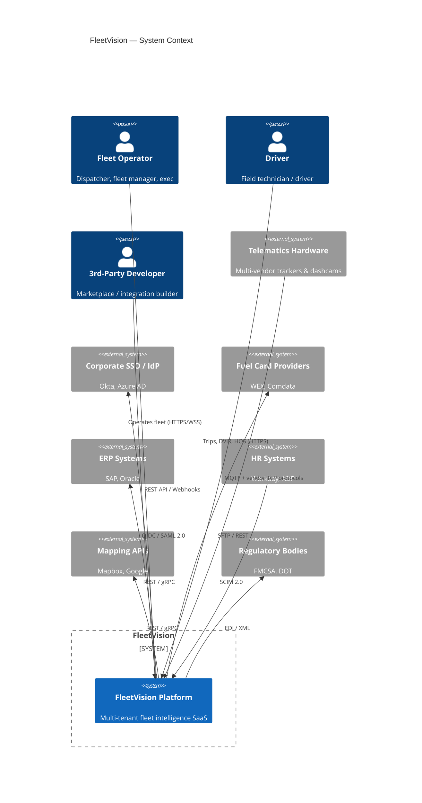

### 1.1 Trust Boundaries

| # | Boundary | Enforcement |
|---|---|---|
| 1 | Internet ↔ FleetVision | TLS 1.3 termination, WAF, DDoS protection, authentication at the API Gateway |
| 2 | FleetVision ↔ External Systems | Partner API keys, mTLS, signed webhooks, Anti-Corruption Layer adapters |
| 3 | FleetVision internal | Zero-trust service mesh: mTLS between every service, OPA authorization, no implicit trust |

---

## 2. Container Topology (C4 Level 2)

The major deployable units ("containers") and their interaction.

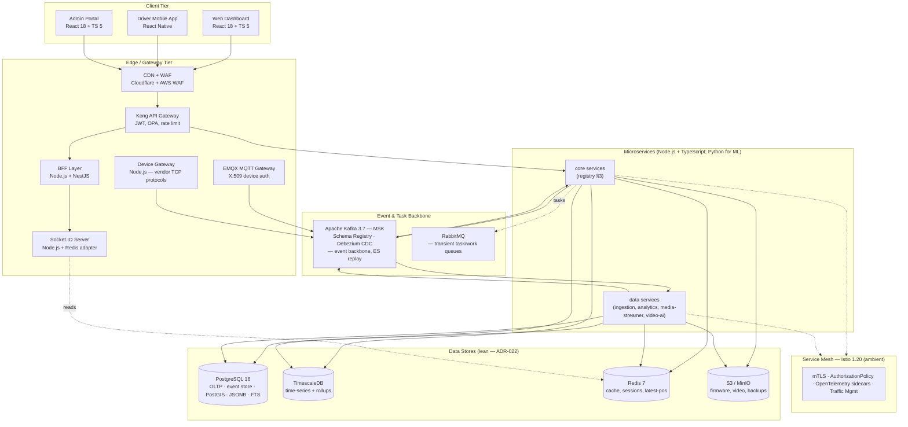

### 2.1 Container Inventory (summary)

| Container | Type | Technology | SLO Tier |
|---|---|---|---|
| Web Dashboard / Admin Portal | SPA | React 18 + TypeScript 5 | Tier 1 |
| Driver Mobile App | Mobile | React Native | Tier 1 |
| CDN + WAF | Edge | Cloudflare + AWS WAF | Tier 0 |
| Kong API Gateway | Gateway | Kong Enterprise 3.x | Tier 0 |
| BFF Layer | Gateway | Node.js + NestJS | Tier 0 |
| Socket.IO Server | Real-time | Node.js + Redis adapter (WebRTC signaling) | Tier 1 |
| EMQX MQTT Gateway | IoT gateway | EMQX 5.x | Tier 0 |
| Device Gateway | IoT gateway | Node.js + NestJS (vendor TCP protocols) | Tier 0 |
| Microservices | Services | Node.js / NestJS / TS (Python for ML) | Tier 1 / 2 |
| Kafka Cluster | Event backbone | Apache Kafka 3.7 (MSK) | Tier 0 |
| RabbitMQ | Task broker | RabbitMQ (transient work queues) | Tier 0 |
| Data stores (4) | Persistence | PostgreSQL 16, TimescaleDB, Redis 7, S3 | Tier 0 |

---

## 3. Service Registry

The authoritative list of deployable services. A **bounded context** (`02_Domain_Model.md`) is the ownership/language boundary; a **service** is the deployable unit. One context may yield several services when runtime characteristics demand.

| # | Service | Bounded Context | Language | Phase | Notes |
|---|---|---|---|---|---|
| 1 | `identity-service` | Identity & Access Mgmt | Node / TS | MVP | Auth, users, roles, org |
| 2 | `billing-service` | Billing & Tenant Mgmt | Node / TS | MVP | Tenant lifecycle, usage, invoicing |
| 3 | `audit-log-service` | Audit & Compliance Log | Node / TS | MVP | Append-only, hash-chained |
| 4 | `notification-service` | Notification & Alerting | Node / TS | MVP | Multi-channel delivery |
| 5 | `fleet-management-service` | Fleet Management | Node / TS | MVP | Vehicle, fleet, group registry |
| 6 | `device-management-service` | Telematics & Device Mgmt | Node / TS | MVP | Device lifecycle, firmware |
| 7 | `device-gateway-service` | Telematics (ingestion tier) | Node / TS | MVP | Terminates vendor TCP protocols |
| 8 | `telemetry-ingestion-service` | Telematics (ingestion tier) | Node / TS | MVP | Normalizes MQTT/TCP → Kafka |
| 9 | `tracking-service` | Tracking & Monitoring | Node / TS | MVP | Real-time position, geofence |
| 10 | `media-service` | Media & Video | Node / TS | P3 | Video metadata, recording control |
| 11 | `media-streamer` | Media & Video (edge) | Node / TS | P3 | WebRTC SFU, HLS, RTSP/JT1078 |
| 12 | `video-ai-engine` | Media & Video (AI tier) | **Python** | P3 | CV inference (FCW, distraction) |
| 13 | `driver-management-service` | Driver Management | Node / TS | P2 | Driver profiles, licenses, behavior |
| 14 | `trip-management-service` | Trip & Route Mgmt | Node / TS | P2 | Trip, route, dispatch, POD |
| 15 | `vehicle-maintenance-service` | Vehicle Maintenance | Node / TS | P2 | Work orders, plans, parts |
| 16 | `compliance-service` | Compliance & Safety | Node / TS | P3 | HOS, DVIR, incidents |
| 17 | `fuel-management-service` | Fuel Management | Node / TS | P3 | Cards, transactions, fraud |
| 18 | `asset-lifecycle-service` | Asset Lifecycle | Node / TS | P3 | Depreciation, TCO, disposal |
| 19 | `analytics-engine` | Analytics & Reporting | **Python** | P3→P4 | ML models, predictions |
| 20 | `report-generation-service` | Analytics & Reporting | Node / TS | P3 | Report orchestration, rendering |

> **Polyglot discipline (ADR-021, supersedes ADR-006).** **18 of 20 services run Node.js LTS + NestJS + TypeScript.** Python 3.12 is used only for the two ML/CV tiers (`video-ai-engine`, `analytics-engine`) — the documented polyglot exception that protects BG-4 (Intelligence pillar). Kotlin and Go are retired from the platform. Any new non-Node service requires an ARB-approved ADR.

### 3.1 Bounded Contexts

A **bounded context** is the ownership and ubiquitous-language boundary from Domain-Driven Design; a **service** (§3 table above) is the deployable unit. The two are distinct on purpose: collapsing them would force every context into one runtime, while ignoring contexts would let language drift poison the model. The platform decomposes the fleet domain into **15 bounded contexts**, defined canonically in `00_Project_Vision.md` §6 and detailed in `02_Domain_Model.md`. This section is the architecture-tier view: it states each context's **strategic classification** (which dictates how much investment it deserves), the **team that owns it**, and the **services that realize it**.

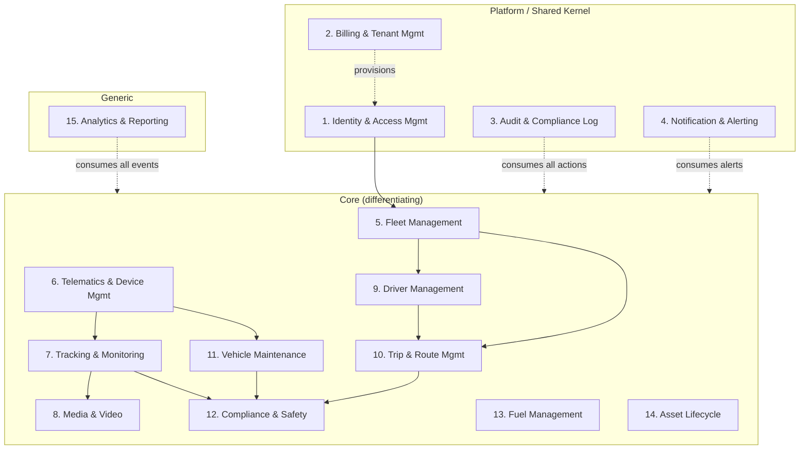

| # | Bounded Context | Strategic Classification | Owning Team | Realized by services (§3) |
|---|---|---|---|---|
| 1 | Identity & Access Management | Platform (shared kernel) | Security & IAM | `identity-service` |
| 2 | Billing & Tenant Management | Platform (revenue) | Billing / Product | `billing-service` |
| 3 | Audit & Compliance Log | Platform (trust) | Security / Compliance | `audit-log-service` |
| 4 | Notification & Alerting | Platform (engagement) | Platform Engineering | `notification-service` |
| 5 | Fleet Management | Core | Fleet Operations | `fleet-management-service` |
| 6 | Telematics & Device Management | Core (split tier) | IoT / Telematics | `device-management-service`, `device-gateway-service`, `telemetry-ingestion-service` |
| 7 | Tracking & Monitoring | Core (highest throughput) | Real-Time Data | `tracking-service` (+ `map-engine-service` per `docs/modules/MapEngine.md`) |
| 8 | Media & Video | Core (differentiator) | Computer Vision | `media-service`, `media-streamer`, `video-ai-engine` |
| 9 | Driver Management | Core | Driver Ops | `driver-management-service` |
| 10 | Trip & Route Management | Core | Dispatch / Logistics | `trip-management-service` |
| 11 | Vehicle Maintenance | Core | Maintenance | `vehicle-maintenance-service` (+ CMMS subdomain) |
| 12 | Compliance & Safety | Core (regulatory shield) | Compliance | `compliance-service` |
| 13 | Fuel Management | Core | Fuel Programs | `fuel-management-service` |
| 14 | Asset Lifecycle | Supporting (financial) | Asset / Finance | `asset-lifecycle-service` |
| 15 | Analytics & Reporting | Generic + Core (ML) | Data / BI | `analytics-engine`, `report-generation-service` |

> **Classification drives investment.** *Core* contexts receive the most design effort and the strongest teams — they are where the platform wins or loses (vision §2). *Supporting* contexts (Asset Lifecycle) need to be good enough, not great. *Generic* contexts (Analytics) buy or reuse before building bespoke. The *Platform* shared kernel is governed by the ARB and changed only through deprecation cycles, because every other context depends on it.

### 3.2 Microservice Boundaries

This section states *the rules for drawing a service boundary* — i.e., when a single bounded context is realized by more than one deployable service. The platform prefers **one service per context** as the default; it splits only when one of four runtime forces demands it. Any split not justified by these forces is a premature distributed-system cost (network hops, schema duplication, operational surface) and is rejected at ARB review.

**The four splitting forces** (a context yields multiple services when *at least one* applies):

| Force | Meaning | Example on this platform |
|---|---|---|
| **Polyglot runtime** | A sub-domain's optimal runtime differs from the context's primary language | Media is Node/TS for control + streaming, but **Python** for the CV/ML inference tier (`video-ai-engine`) — ADR-021 §2.2 |
| **Independent scaling** | A sub-domain has a sharply different load profile | Media splits the low-volume control plane (`media-service`) from the high-volume streaming edge (`media-streamer`) and the GPU-bound inference tier (`video-ai-engine`) |
| **Distinct lifecycle** | A sub-domain is released / certified on a different cadence | Compliance ELD certification decouples `compliance-service` release cadence from neighboring contexts |
| **Team ownership at scale** | A context is large enough that one team cannot own it | Telematics and Media are each split across ingestion / core / AI sub-teams |

**Boundary rules (load-bearing invariants):**

1. **Language autonomy inside, contracts at the edge.** Within a context, services may share a library. Across contexts, services communicate **only** through versioned Kafka events (§6) or gRPC contracts (§5) — never via shared database tables or shared internal libraries.
2. **One schema owner per aggregate.** Every aggregate has exactly one owning service that can write its event stream; all other services form read-model projections (CQRS, §7). This is enforced by Kafka ACLs.
3. **No synchronous dependency cycles.** Cross-context sync calls are allowed (gRPC, max depth 2) but must form a DAG; cycles must be broken with events. CI runs a dependency-graph lint.
4. **Database isolation by context.** Each context owns its database/schema; no cross-context joins. Read-model exceptions (e.g., a denormalized "vehicle last known" projection) are explicit and event-fed, not queried live.
5. **Failure isolation.** A downstream service outage must not block an upstream command path; the transactional outbox + event-driven design (§6.1) ensures the upstream commits and moves on, and downstream catches up on recovery.

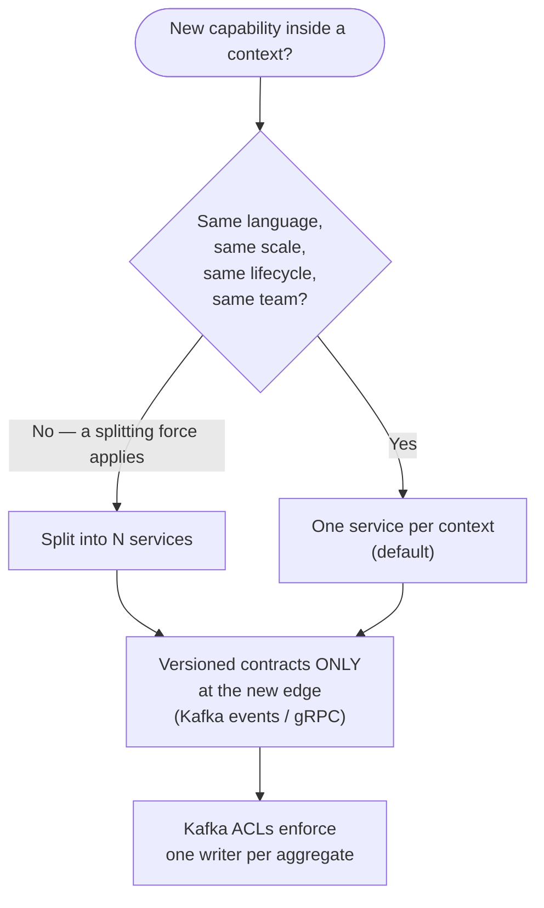

> **Why this matters for the vision.** Disciplined boundaries are what let the platform scale from 10 trucks to 2,000,000 vehicles (vision Scale pillar, BG-7) *without re-platforming*: each splitting force can be re-applied as load grows, and each service can be scaled, deployed, and recovered independently. They are also what protects the *Openness* pillar — partners integrate against stable published contracts, not internal schemas.

---

## 4. Technology Stack

### 4.1 Runtime & Languages

| Component | Technology | Rationale | ADR |
|---|---|---|---|
| Core microservices | **Node.js LTS + NestJS + TypeScript (strict)** | Single primary runtime; NestJS modules map to DDD bounded contexts; end-to-end TS types shared with the React/RN clients; Node's async I/O fits the platform's I/O-bound hot paths | ADR-021 |
| ML / AI tiers (2 services only) | **Python 3.12** (FastAPI; PyTorch, scikit-learn, MLflow) | Documented polyglot exception — protects BG-4 (Intelligence pillar); Python's CV/ML ecosystem has no Node equivalent | ADR-021 §2.2 |
| Inter-service RPC | gRPC via `@grpc/grpc-js` + `buf`-generated TS | Matches ADR-004 (gRPC sync); TS types generated from `.proto` | ADR-004 |
| Web frontends | React 18 + TypeScript 5 | Rich SPA, type safety; shared DTO/proto types with backend | — |
| Mobile apps | React Native + TypeScript | Single codebase iOS/Android; shared types with backend | — |

> **Retired runtimes (ADR-021).** Kotlin/Spring Boot and Go are no longer used. ADR-006 is **superseded by ADR-021**. The "weaker enterprise DDD/CQRS ecosystem" rejection of Node in earlier drafts is itself superseded — NestJS plus the in-repo CQRS/ES modules (ADR-001, language-agnostic) deliver the required structure.

### 4.2 Data Layer (Lean — ADR-022, supersedes ADR-008)

| Store | Version | Purpose | ADR |
|---|---|---|---|
| PostgreSQL | 16 (+ PostGIS, pg_partman, pgvector, `pg_trgm`, FTS) | Primary OLTP, event store, geospatial, **documents (JSONB)**, full-text search | ADR-007 (expanded), ADR-022 |
| TimescaleDB | (PG extension) | Time-series: GPS, telemetry; **continuous aggregates for rollups (replaces ClickHouse at MVP–Phase-3 scale)** | ADR-022 |
| Redis | 7 (cluster mode) | Cache, sessions, rate limiting, latest-position, pub/sub | ADR-022 |
| Apache Kafka | 3.7 (MSK) | Event streaming, event sourcing, CDC backbone (primary broker) | ADR-002 |
| RabbitMQ | 3.x | **Transient task/work queues** (report rendering, notification dispatch, batch jobs) — not an event store | ADR-022 |
| S3 / MinIO | — | Object storage: firmware, video, documents, backups | ADR-022 |

> **Deferred with explicit triggers (ADR-022 §2.3).** **ClickHouse** (OLAP) and **Elasticsearch** (FTS at scale) are **removed from the MVP–Phase-3 footprint** and re-introduced only when their measurable triggers fire (analytics query P99 > 2s; search QPS > 200 sustained; or Year-5 scale band). **MongoDB** is replaced permanently by PostgreSQL JSONB. Detail and thresholds in ADR-022.

### 4.3 Platform & Infrastructure

| Layer | Technology | ADR |
|---|---|---|
| Container orchestration | Kubernetes 1.29 (EKS) | — |
| Service mesh | Istio 1.20 (ambient mode) | ADR-005 |
| API Gateway | Kong Enterprise 3.x | — |
| IAM (user auth) | Keycloak 24 (OIDC + SAML 2.0) | ADR-009 |
| Authorization | Open Policy Agent (OPA) | ADR-009 |
| Secrets | HashiCorp Vault (+ External Secrets Operator) | — |
| CI | GitHub Actions | — |
| CD | ArgoCD + Argo Rollouts (GitOps) | ADR-010 |
| IaC | Terraform + Helm + Kustomize | — |
| Observability | OpenTelemetry → Prometheus, Grafana, Loki, Jaeger | ADR-011 |
| Schema management | Flyway (SQL) + Confluent Schema Registry (Avro) | — |

### 4.4 Rejected Alternatives

| Alternative | Rejected Because |
|---|---|
| Keep Kotlin/Spring Boot + Go (ADR-006) | ARB decision to consolidate to one primary runtime; JVM strengths not matched to the platform's I/O-bound hot paths; two runtimes for one workload (concurrency) was unjustified overhead |
| Microsoft SQL Server / Oracle | Licensing cost, lock-in, weaker fit (no PostGIS/TimescaleDB/RLS), contradicts cloud-agnostic strategy |
| RabbitMQ **as the event backbone** | No replay; per-queue ordering only — incompatible with CQRS + Event Sourcing. RabbitMQ is added only for transient task queues (ADR-022) |
| Postgres-only (no Timescale, no Redis) | Timescale is load-bearing for 600K ev/s time-series; Redis for sub-ms latest-position & rate limiting |
| MongoDB for documents | Aggregate-owned documents benefit from transactional co-location (JSONB); a separate store re-introduces a consistency boundary for no gain (ADR-022) |
| Adopting ClickHouse / Elasticsearch now (MVP–Phase-3) | Premature — Timescale continuous aggregates and Postgres FTS cover the documented workloads at this scale; explicit triggers re-introduce them (ADR-022 §2.3) |
| Heavy ORM (TypeORM in full-magic mode) | Prefer aggregate-aligned SQL via `knex` (query builder); explicit over implicit. JPA/Hibernate-equivalent "magic" rejected for the same reason as ADR-006 |

### 4.5 Database & Storage Strategy (architecture summary)

> **Single owner.** The canonical, implementation-ready persistence design — store-per-aggregate mapping, partitioning keys, sharding, retention, indexes, and migrations — lives in **`03_Database_Architecture.md`**. This section is the *architecture-level* view only: which stores exist, why, and how they relate to bounded contexts, scaling targets, and the multi-tenant model. Nothing here is duplicated from `03`; where depth is needed, follow the link.

**Lean by design (ADR-022, supersedes ADR-008).** The platform consolidates to **four stores + two brokers**: PostgreSQL, TimescaleDB, Redis, S3, plus Kafka (event backbone) and RabbitMQ (task queue). PostgreSQL absorbs the document and full-text-search workloads via JSONB and `pg_trgm`/FTS; Timescale continuous aggregates cover MVP–Phase-3 analytics. The Year-5 scale path is protected by **explicit, measurable re-introduction triggers** (ADR-022 §2.3) rather than by building specialty stores prematurely — consistent with the vision's reversibility guardrail (§9) and BG-7.

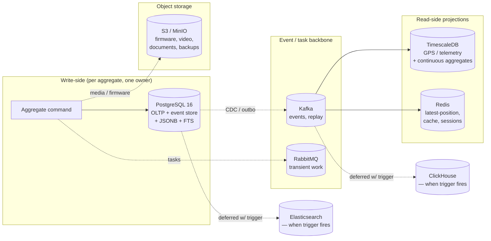

| Store | Architectural role | Owns data for contexts | Multi-tenant strategy (full detail: §8 + `03`) |
|---|---|---|---|
| **PostgreSQL 16** | System of record; primary OLTP; event store for ES aggregates; geospatial (PostGIS); **documents (JSONB)**; **full-text search** | All contexts' transactional + document state | 3-tier: dedicated instance / dedicated schema / shared+RLS (ADR-003, ADR-007) |
| **TimescaleDB** | Hypertable time-series: positions, telemetry, IO; **continuous aggregates for rollups** | Tracking (#7), Telematics (#6), Analytics (#15) rollups | Compressed hypertables, per-tenant partitioning |
| **Redis 7** | Hot path: latest vehicle position, sessions, rate limits, pub/sub | All (esp. Tracking #7, IAM #1, Notification #4) | Cluster mode, namespace per tenant |
| **Kafka (MSK)** | Event backbone, outbox relay, CDC, replay | All — every context publishes/consumes | Per-tenant partition key, ACL per topic |
| **RabbitMQ** | Transient task/work queues: report rendering, notification fan-out, batch jobs | Report (#15), Notification (#4), batch consumers | Per-tenant virtual host |
| **S3 / MinIO** | Objects: firmware artifacts, video segments, exports, backups | Telematics (#6), Media (#8), Audit (#3) | Bucket / prefix per tenant, SSE-KMS |
| ~~MongoDB~~ | *(removed — workloads moved to PostgreSQL JSONB; ADR-022 §2.2)* | — | — |
| ~~ClickHouse~~ | *(deferred — re-introduced when trigger fires; ADR-022 §2.3)* | — | — |
| ~~Elasticsearch~~ | *(deferred — re-introduced when trigger fires; ADR-022 §2.3; logs already in Loki)* | — | — |

**Architectural invariants (enforced; detail in `03`):**

1. **One writer per aggregate's event stream** — the same boundary rule as §3.2 invariant #2, applied to data. Kafka ACLs enforce it.
2. **No cross-context joins** — a service reads only its own store; cross-context data arrives as an event-fed projection.
3. **Tenant isolation is mandatory at every store** — not just PostgreSQL RLS. Each store above implements isolation in its native form (see column 4), because the vision's *Trust* pillar (BG-5) treats a tenant-isolation breach as SEV-1.
4. **Two brokers, two jobs** — Kafka owns state changes and replay (event backbone); RabbitMQ owns transient work items (task queue). A state change is **never** written to RabbitMQ, and a task is **never** enqueued on Kafka.
5. **Retention is explicit per store** — raw telemetry 3 days (Kafka) / compressed months (Timescale); RabbitMQ tasks transient (ack-on-complete, dead-letter on failure); audit permanent; see `03` for the retention matrix that realizes the vision's tiered data-retention quotas.
6. **Object storage is the cold tier** — anything large or rarely read (video, firmware, exports, backups) lives in S3, never in a database.

> **Why this is summary-only.** The full schema-per-store mapping, the Year-1→Year-5 sharding progression, the partition-key choices, the JSONB-vs-relational per-aggregate decisions, and the migration runbook are large enough to warrant their own implementation-ready document (`03_Database_Architecture.md` v3.0.0, now rebuilt on this lean foundation). Duplicating them here would reintroduce the single-source-of-truth drift that ADR-019 was written to eliminate.

---

## 5. Communication Patterns

### 5.1 Decision Matrix

```mermaid
flowchart TD
    Start([Service A needs to talk to Service B]) --> Q1{State change<br/>(write)?}
    Q1 -->|Yes| Q2{Multiple aggregates<br/>/ services involved?}
    Q1 -->|No| Q3{Latency-critical<br/>+ same-request?}
    Q2 -->|Yes| ASYNC["Async via Kafka<br/>(outbox + saga choreography)"]
    Q2 -->|No| ASYNC
    Q3 -->|Yes| GRPC["Sync gRPC<br/>(deadline + circuit breaker)"]
    Q3 -->|No| Q4{Client-facing?}
    Q4 -->|Yes| REST["REST via API Gateway<br/>(JSON:API)"]
    Q4 -->|No| PROJ["Read own CQRS projection"]
    ASYNC --> END([Done])
    GRPC --> END
    REST --> END
    PROJ --> END
```

### 5.2 Protocol Matrix

| Protocol | Encoding | Auth | Latency Target | Use |
|---|---|---|---|---|
| REST / JSON | JSON:API | JWT (RS256) + API key | < 200ms P99 | External client APIs, partner integrations |
| gRPC | Protobuf | mTLS + JWT propagation | < 30ms P99 | Internal service-to-service, latency-critical |
| WebSocket | JSON (Socket.IO) | JWT handshake | < 200ms P99 | Real-time push (positions, alerts, video signaling) |
| MQTT v5.0 | Binary/JSON | X.509 mTLS | < 100ms ingest | IoT device telemetry & commands |
| Vendor TCP | Binary | Device auth handshake | < 500ms e2e | GT06, Teltonika, JT808, Concox, Meitrack |
| Kafka | Avro | mTLS + ACL | < 50ms process | All cross-service events, event sourcing |

### 5.3 Synchronous Call Discipline

Synchronous calls create temporal coupling; they are restricted:

1. **Max depth 2** — a request traverses at most 2 synchronous hops. Deeper flows must be event-driven sagas.
2. **Always have a deadline** — every gRPC call sets a per-hop timeout (default 2s); propagated via context.
3. **Circuit breaker mandatory** — every outbound sync call wrapped by Resilience4j.
4. **Idempotent by contract** — retried calls are safe (`Idempotency-Key` header on writes).

### 5.4 Contract Management

| Concern | Standard |
|---|---|
| REST contracts | OpenAPI 3.1 in Git; `spectral` lint in CI; consumer-driven contract tests (Pact) |
| gRPC contracts | `.proto` in shared `fleetvision-proto` repo; `buf` lint + breaking-change detection |
| Event contracts | Avro in Confluent Schema Registry; `BACKWARD_TRANSITIVE` enforced |
| Versioning | URI major version REST (`/api/v1/`); package suffix gRPC (`v1`); event-type suffix (`.v1`) — ADR-012 |

---

## 6. Event-Driven Architecture

Event-driven architecture is the platform's backbone. Every state change becomes a domain event; cross-service coordination happens through events, not direct calls.

> **Two brokers, two jobs (ADR-022 §2.1).** **Kafka** is the **event backbone** — domain events, transactional-outbox relay, CDC, and Event Sourcing replay (ADR-001/002). **RabbitMQ** is the **task queue** — transient work items (report rendering, notification fan-out, batch jobs) that need per-task ack, delayed retry, and dead-lettering but **never** replay. The decision rule: *if a message represents a state change or must be replayable → Kafka; if it is a unit of work to be done once → RabbitMQ.* Mixing the two would either lose replay (RabbitMQ as backbone) or pollute the event store (Kafka for transient tasks). Kafka clients use `kafkajs` (Avro via Schema Registry); RabbitMQ clients use `amqplib`.

### 6.1 Event Topology & Transactional Outbox

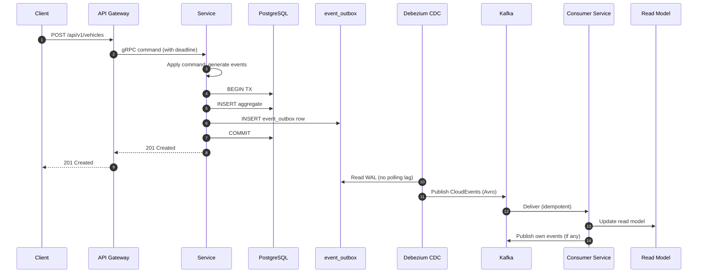

### 6.2 Event Naming & Envelope

**Naming convention (ADR-016 — single standard):**

```
{domain}.{aggregate}.{event-type}.{version}

Examples:
  fleet.vehicle.registered.v1
  tracking.position.received.v1
  compliance.hos.violation.detected.v1
```

**Envelope — CloudEvents v1.0 + FleetVision extensions:**

```json
{
  "specversion": "1.0",
  "type": "fleet.vehicle.registered.v1",
  "source": "/fleet-management-service",
  "id": "evt_550e8400-...",
  "time": "2026-08-02T14:30:00.000Z",
  "datacontenttype": "application/avro",
  "data": { /* aggregate-specific payload */ },
  "fleetvision": {
    "tenant_id": "uuid",
    "correlation_id": "uuid",
    "causation_id": "uuid",
    "aggregate_id": "uuid",
    "aggregate_type": "Vehicle",
    "aggregate_version": 1
  }
}
```

### 6.3 Topic Naming (Single Convention)

**All topics follow `fleetvision.<domain>.<aggregate>.events`** for domain events, and **`fleetvision.<domain>.<stream>.raw`** for high-volume raw streams. This resolves the three-way naming drift flagged in ARR-2026-08-02-A.

| Topic class | Pattern | Example | Retention |
|---|---|---|---|
| Domain events | `fleetvision.<domain>.<aggregate>.events` | `fleetvision.fleet.vehicle.events` | 7–30 days |
| Raw streams | `fleetvision.<domain>.<stream>.raw` | `fleetvision.telemetry.position.raw` | 3 days |
| Commands | `fleetvision.<domain>.<aggregate>.commands` | `fleetvision.telemetry.device.commands` | 7 days |

> The authoritative event/topic registry is `04_Event_Catalog.md` (planned). Every consumer subscription must resolve to a producer's declared event+topic, enforced by CI contract tests (ADR-018).

### 6.4 Partitioning & Ordering

- Topics partitioned by `aggregate_id` (domain events) or `vehicle_id` (telemetry streams) → per-entity ordering preserved.
- Provision partitions aggressively up-front (256+ on high-volume topics) sized for Year-5; expansion breaks key→partition mapping and is avoided.
- Replication factor **3, multi-AZ**.

### 6.5 Schema Evolution

| Change | Strategy |
|---|---|
| Add optional field | Forward compatible — new schema version |
| Add field with default | Full compatible — new schema version |
| Remove/rename field | Breaking — new event-type version (`.v2`) + upcaster |
| Change type | Breaking — new event-type version + migration |

Compatibility mode: **`BACKWARD_TRANSITIVE`** (new consumers read old data). Breaking changes require a parallel-publish migration.

---

## 7. CQRS & Event Sourcing

### 7.1 When Applied (ADR-001)

| Pattern | Applied to | Why |
|---|---|---|
| **CQRS** (separate read/write models) | Every event-sourced aggregate; high-read-volume queries | Read models optimized per query; writes through aggregate |
| **Event Sourcing** (state from event replay) | 10 audit-critical aggregates (below) | Full audit trail, temporal queries, replay for new rules |
| **Snapshotting** | Event-sourced aggregates | Snapshot every 100 events to bound replay cost |

**Event-sourced aggregates (10):** `VehicleTracker`, `Trip`, `Dispatch`, `ProofOfDelivery`, `MaintenanceWorkOrder`, `DeviceCommand`, `HOSLog`, `DVIRInspection`, `Incident`, `Invoice`, `Notification`. (See `02_Domain_Model.md` §2.2 for the authoritative list and the (ES) markers.)

### 7.2 Write Path / Read Path

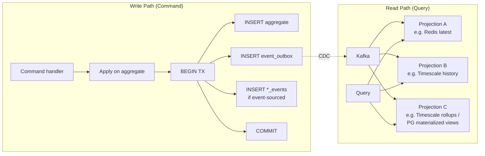

Read models are **eventually consistent** (lag target < 5s, < 30s at burst). Latency-critical reads that cannot tolerate lag (e.g., "is this driver HOS-eligible right now?") use synchronous gRPC.

---

## 8. Multi-Tenant Architecture

### 8.1 Three-Tier Isolation (ADR-003)

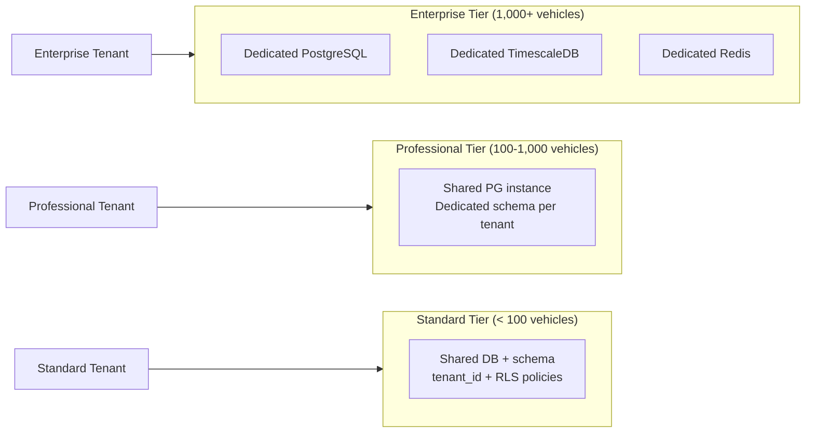

| Tier | Profile | Isolation | Database Strategy |
|---|---|---|---|
| **Enterprise** | 1,000+ vehicles; regulated | Dedicated instance | Dedicated PostgreSQL + TimescaleDB + Redis per tenant |
| **Professional** | 100–1,000 vehicles | Schema isolation | Shared PG instance; dedicated schema per tenant |
| **Standard** | < 100 vehicles | Row-Level Security | Shared DB + schema; `tenant_id` column + PG RLS policies |

### 8.2 Tenant Context Propagation

**Tenant ID is always derived from the authenticated principal (JWT), never from request body.**

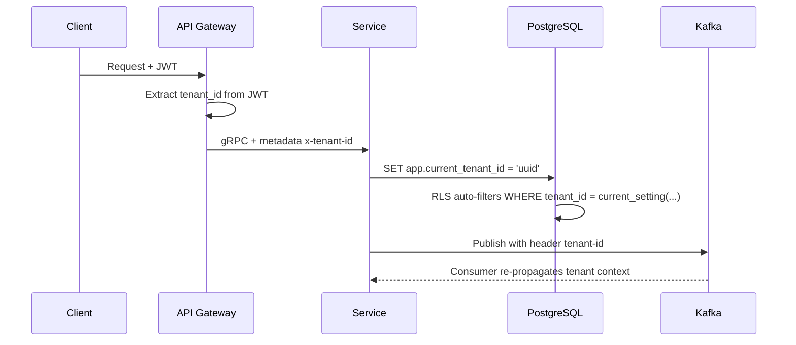

**Enforcement contract (ARR SEC-2):** `tenant_id` is forbidden in any client-facing request schema (OpenAPI/proto lint rule). Internal gRPC may pass it (mesh-trusted), but services **must reject requests where gRPC tenant_id ≠ JWT tenant_id**. An ArchUnit-style test guards this.

### 8.3 Resource Quotas

| Resource | Standard | Professional | Enterprise |
|---|---|---|---|
| Vehicles | 100 | 1,000 | Unlimited |
| GPS events/sec | 50 | 500 | Custom |
| API calls/min | 1,000 | 10,000 | Custom |
| Data retention (telemetry) | 6 months | 24 months | Custom |

Quotas enforced real-time by `billing-service` via Redis atomic counters; breaches emit `billing.quota.exceeded.v1` consumed by the API Gateway.

---

## 9. Security Architecture

Zero-trust, defense-in-depth. The vision's *Trust* pillar made concrete.

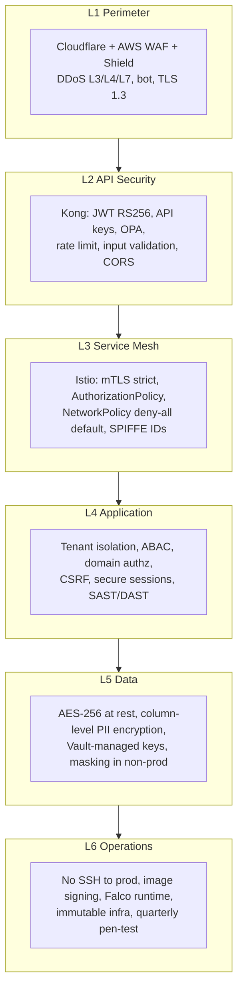

### 9.1 Authentication & Authorization

| Concern | Technology |
|---|---|
| User auth | Keycloak 24 (OIDC + SAML 2.0); realm-per-tenant (Enterprise); MFA enforced for admins |
| API auth | JWT (RS256, 15-min TTL) + rotating opaque refresh tokens |
| Service identity | SPIFFE / SPIRE (mTLS cert issuance) |
| Partner auth | API keys + IP allowlist; 90-day rotation default, 365-day max |
| Device auth | X.509 mTLS (EMQX / Device Gateway) |
| Fine-grained authz | Open Policy Agent (OPA) — Rego policies at gateway + service |
| Secrets | HashiCorp Vault (dynamic DB creds, 24h TTL) |

### 9.2 Single Canonical Permission Catalog

Permissions follow `<domain>.<resource>.<action>` (e.g., `fleet.vehicle.create`, `tracking.position.live`, `media.video.read`). The **authoritative catalog** is maintained in `02_Domain_Model.md` §6 and replicated into OPA policy bundles. CI enforces that every endpoint's declared permission exists in the catalog (ARR SEC-1) — drift breaks the build.

### 9.3 Encryption

| Data | At Rest | In Transit |
|---|---|---|
| All databases | AES-256 (KMS/Vault) | TLS 1.3 |
| PII (SSN, license #, VIN) | Column-level AES-256 (envelope) | TLS 1.3 |
| Kafka topics | AES-256 | TLS 1.3 + mTLS |
| S3 objects | SSE-KMS | TLS 1.3 |
| Service-to-service | — | mTLS (Istio) |

**Key rotation:** TLS certs 90 days (cert-manager); JWT keys 90 days (Keycloak); DB encryption 180 days (Vault); API keys 90 days default / 365 max.

### 9.4 Compliance Posture

| Standard | Year | Vision Link |
|---|---|---|
| SOC 2 Type II | Year 1 | Enterprise sales enabler |
| ISO 27001 | Year 2 | International credibility |
| GDPR | Year 1 (EU launch) | Right to erasure, data residency |
| CCPA | Year 1 | California customer requirement |
| FMCSA ELD | Year 1 (P3) | Compliance module certification |
| PCI DSS | Year 1 (scoped) | Fuel card payment data |

---

## 10. Deployment & Cloud Architecture

### 10.1 Kubernetes Topology

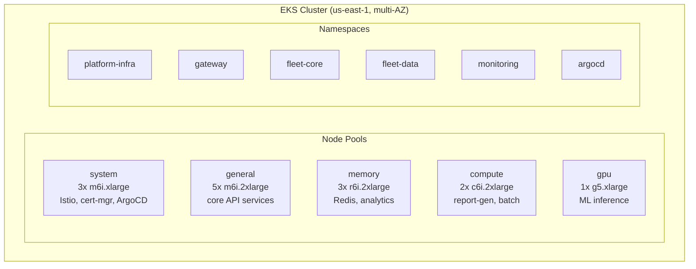

Every namespace: ResourceQuota, LimitRange, NetworkPolicy (deny-all default). Every service: HPA/KEDA, PDB (min 2), ServiceAccount, mTLS.

### 10.2 Deployment Strategy (GitOps)

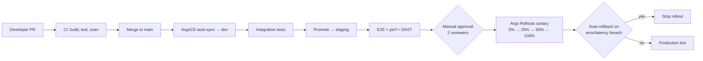

### 10.3 Cloud Provider Strategy

**Primary: AWS (Year 1–2).** Architecture is cloud-agnostic by design (Kubernetes-native, managed-service-abstracted) for Azure/GCP portability if a major customer requires it.

| Need | AWS Service |
|---|---|
| Kubernetes | EKS |
| Relational DB | RDS for PostgreSQL 16 (Multi-AZ, PITR) — OLTP + event store + JSONB + FTS |
| Kafka | MSK |
| Task broker | Amazon MQ for RabbitMQ (or self-hosted on EKS) |
| Cache | ElastiCache (Redis 7) |
| Object storage | S3 |
| Time-series / rollups | TimescaleDB on EKS (PG extension) |
| Search | PostgreSQL FTS (`pg_trgm` + `tsvector`) — Elasticsearch/OpenSearch **deferred per ADR-022 §2.3** |
| CDN/WAF | Cloudflare + AWS WAF |
| DNS | Route 53 (health-check failover) |
| Analytics OLAP | Timescale continuous aggregates + PG materialized views — **ClickHouse deferred per ADR-022 §2.3** |
| Secrets | Self-hosted Vault on EKS (cross-cloud portability) |

### 10.4 Multi-Region Strategy

| Phase | Regions | Strategy |
|---|---|---|
| Year 1 | `us-east-1` | Single region, multi-AZ |
| Year 3 | + `eu-west-1` | Active-active for EU tenants (data residency) |
| Year 5 | + `ap-southeast-1`, `us-west-2` (DR) | Global active-active + DR |

**Data residency:** EU tenant data never leaves `eu-west-1`. Routing is tenant-aware at the API Gateway via `tenant_id → region` lookup.

---

## 11. Observability

The three pillars of observability plus continuous profiling, all on OpenTelemetry (ADR-011).

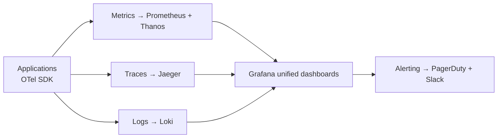

### 11.1 SLI / SLO Framework

Every Tier-0/1 service publishes SLIs with explicit SLOs and 30-day error budgets:

| Service | SLI | SLO | Error Budget |
|---|---|---|---|
| API Gateway | Availability (non-5xx) | 99.99% | 4.32 min / 30d |
| API Gateway | Latency (< 200ms) | 99.9% | 43.2 min / 30d |
| Tracking | Freshness (pos < 10s) | 99.9% | 43.2 min / 30d |
| Telemetry Ingestion | Throughput (processed/received) | 99.99% | 4.32 min / 30d |
| Kafka | Partition availability | 99.99% | 4.32 min / 30d |
| PostgreSQL | Query availability | 99.99% | 4.32 min / 30d |

**Error budget policy:** burn rate > 75% → feature development pauses; team works exclusively on reliability until the budget recovers.

### 11.2 Alerting Tiers

| Severity | Condition Example | Routing | Response |
|---|---|---|---|
| SEV-1 | Gateway down; DB primary down; tenant isolation breach | PagerDuty → SRE + Eng Lead | 15 min |
| SEV-2 | 5xx > 5%; consumer lag > 100K | PagerDuty → SRE on-call | 30 min |
| SEV-3 | Slow queries; disk > 80% | Slack #alerts | 4 hours |
| SEV-4 | Certificate < 30d expiry | Slack #low-priority | 24 hours |

### 11.3 Structured Logging Standard

JSON logs with mandatory correlation fields: `timestamp, level, service, trace_id, correlation_id, tenant_id, user_id, message, context`. **PII redaction enforced at the Fluentd pipeline:** SSN, license numbers, emails, phone numbers, VINs masked before persistence.

---

## 12. Scaling & Resilience

The platform must scale to 2M vehicles / 600K GPS events/sec while keeping cost-per-vehicle declining (vision: <$1/vehicle/month by Year 5).

### 12.1 Scaling Mechanisms

| Layer | Mechanism | Trigger | Target |
|---|---|---|---|
| Stateless services | HPA (CPU/RPS) | CPU > 70% | 2–20 pods |
| Telemetry ingestion / streaming | **KEDA** (Kafka lag) | Lag > 10K | 5–50 pods |
| PostgreSQL | Read replicas + PgBouncer | Read QPS | Add replicas |
| TimescaleDB | Hypertable compression + chunking + continuous aggregates | Storage growth / query latency | Auto-compress after 7d; add rollups |
| Redis | Cluster mode + sharding | Memory > 80% | Add shards |
| RabbitMQ | Quorum queues + pods | Queue depth | Scale consumers (KEDA on queue depth) |
| WebSocket | Horizontal + Redis adapter | Connections | 50K conns/node |

### 12.2 Capacity Headroom & Back-Pressure

- **2× headroom** above projected peak on every autoscaling target (vision guardrail).
- **10× load test** before each major milestone.
- **Back-pressure over data loss:** when ingestion exceeds capacity — (1) KEDA scales up; (2) Kafka buffers (7-day retention absorbs bursts); (3) if Kafka disk > 80%, shed non-critical processing (defer analytics rollups); (4) **real-time tracking is never shed** — highest-priority path.

### 12.3 Disaster Recovery Targets

| Component | SLA | RPO | RTO | Strategy |
|---|---|---|---|---|
| Platform (overall) | 99.95% → 99.99% | < 1 min | < 15 min | Multi-AZ + DR region |
| PostgreSQL | 99.99% | < 1 min | < 5 min | Streaming replication + Patroni |
| Kafka | 99.99% | < 1 min | < 3 min | Multi-AZ RF=3, MirrorMaker to DR |
| RabbitMQ | 99.9% | n/a (transient) | < 5 min | Quorum queues, multi-AZ; tasks are re-enqueued or dead-lettered |
| Redis | 99.95% | < 30 s | < 2 min | Cluster + AOF persistence |
| TimescaleDB | 99.95% | < 1 min | < 5 min | Streams with PostgreSQL; compressed hypertable backups to S3 |
| S3 | 99.99% | < 15 min | < 5 min | Cross-region replication |

---

## 13. Architecture Decision Records

Decisions of consequence are recorded as ADRs in `/Decisions/`. The current set. ADR-013 through ADR-018 were ratified to **Accepted** by **ADR-019** (Architecture Consistency Reconciliation, 2026-08-02); their standalone ADR documents are to be authored as a follow-up, with ADR-019 acting as the ratification of record until then.

| ADR | Decision | Status |
|---|---|---|
| ADR-001 | CQRS + Event Sourcing for audit-critical aggregates | Accepted |
| ADR-002 | Apache Kafka as event backbone | Accepted |
| ADR-003 | Hybrid multi-tenancy (3 tiers) | Accepted |
| ADR-004 | gRPC (sync) + Kafka (async) communication | Accepted |
| ADR-005 | Istio service mesh (ambient mode) | Accepted |
| ADR-006 | Spring Boot 3.3 + Kotlin (Go + Python exceptions) | **Superseded by ADR-021** |
| ADR-007 | PostgreSQL 16 as primary OLTP (role expanded — now also documents/FTS) | Accepted |
| ADR-008 | Polyglot persistence (8 stores) | **Superseded by ADR-022** |
| ADR-009 | Keycloak + OPA for IAM | Accepted |
| ADR-010 | GitOps with ArgoCD | Accepted |
| ADR-011 | OpenTelemetry for observability | Accepted |
| ADR-012 | URI-based API versioning | Accepted |
| ADR-013 | Media & Video bounded context (Kotlin/Go/Python split) | Accepted *(ratified by ADR-019; runtime now Node per ADR-021, Python for AI tier retained)* |
| ADR-014 | Device Gateway — multi-protocol TCP ingestion (now Node per ADR-021) | Accepted *(ratified by ADR-019; runtime updated)* |
| ADR-015 | Real-time transport strategy (Socket.IO canonical) | Accepted *(ratified by ADR-019)* |
| ADR-016 | Single Kafka topic-naming convention | Accepted *(ratified by ADR-019)* |
| ADR-017 | Driver behavior score — single owner & formula | Accepted *(ratified by ADR-019)* |
| ADR-018 | Event Catalog & CI contract testing | Accepted *(ratified by ADR-019)* |
| ADR-019 | Architecture consistency reconciliation & ratification of ADR-013…018 | Accepted |
| ADR-020 | Aggregate expansion review (Asset rename, Billing expansion) | Proposed *(deferred items from ADR-019)* |
| ADR-021 | Node.js LTS + NestJS + TypeScript as primary runtime (Python ML exception) | Accepted *(supersedes ADR-006)* |
| ADR-022 | Lean persistence — PG/Timescale/Redis/S3 + Kafka + RabbitMQ | Accepted *(supersedes ADR-008; expands ADR-007)* |

---

## Appendix A: Cross-Reference to Vision

| Vision Element | This Document |
|---|---|
| Scale (2M vehicles, 600K ev/s) | §3, §6, §12 |
| Intelligence pillar | §3 (analytics/video-ai), §7 (data flow) |
| Trust pillar | §8, §9, §12 |
| Simplicity pillar | §2, §10 |
| Openness pillar | §1, §5 |
| 15 bounded contexts | **§3.1** (classification + ownership), §3 (services) |
| Microservice boundary discipline (Scale enabler) | **§3.2** |
| Business Goals BG-5 (Trust), BG-7 (Scale) | §8, §9, §12 |
| Phased roadmap | §10 (environments + promotion) |
| Cost-per-vehicle | §12 (cost levers) |

## Appendix B: Known Cross-Document Follow-ups

These items were identified during the 2.1.0 and 2.2.0 enhancements and are recorded here so the ARB can schedule them. They are **not** fixed silently in this release, because each touches another document's owned content (single-owner rule, ADR-019).

### B.1 Pre-existing (2.1.0)

| ID | Finding | Affected docs | Recommended fix |
|---|---|---|---|
| **F-1** | `Deployment.md` and `Security.md` cite SLO/structured-logging content as `01 §14` and `§14.5`, but that content lives at **§11** (Observability) in this document. §13 is the ADR list; §14 does not exist. | `docs/specs/Deployment.md`, `docs/specs/Security.md` | Owners of those docs repoint the references to `01 §11` / `§11.2` / `§11.3`. |
| **F-2** | `docs/modules/MapEngine.md` declares `map-engine-service` as registry **#21**, but §3 lists 20 services. The map service is real and Tier-1. | `01` §3, `docs/modules/MapEngine.md` | Add `map-engine-service` as #21 to the §3 registry (Tracking context) — or, if the team prefers it inside an existing service, update `MapEngine.md`. Requires a one-line ADR-019-style reconciliation. |
| **F-3** | ADR-020 (aggregate expansion: `VehicleAsset → Asset`, Billing `Payment`/`TenantConfig`/`UsageRecord`) is referenced in ADR-019 as "Proposed for ADR-020" but not yet authored. | `Decisions/` | Author ADR-020 when the aggregate review is run. |
| **F-4** | The `Architecture Review Report.md` flags a Media & Video context-numbering ambiguity (Vision §6.1 = Context 8; some module text says "Context 15"). Vision §6.1 is authoritative. | `02_Domain_Model.md`, `docs/modules/VideoPlatform.md` | Align module text to Vision §6.1 (Media & Video = #8, Analytics = #15). |

### B.2 From the 2.2.0 technology pivot (ADR-021, ADR-022)

These items are the **ripple** of the Node/NestJS runtime and lean-persistence decisions into documents that currently state the superseded (Kotlin/Spring Boot + Go, 8-store polyglot) stack. They are enumerated here rather than fixed in place, because each belongs to another document's owner. The 24 module documents in `docs/modules/` are affected at the technology layer only; their **domain model, aggregates, events, and permissions are unchanged** — the pivot is a technology decision, not a domain decision.

| ID | Ripple from | Affected docs | What needs to change |
|---|---|---|---|
| **F-5** | ADR-022 | `docs/specs/03_Database_Architecture.md` | **CLOSED in `03` v3.0.0** — rebuilt on the lean-persistence foundation (PG + Timescale + Redis + S3 + Kafka + RabbitMQ). MongoDB→JSONB; ClickHouse→Timescale continuous aggregates (deferred w/ trigger); Elasticsearch→PG FTS (deferred w/ trigger); RabbitMQ task-queue section added. Two ADR-019 corrections also applied in this rebuild: **R1** (ES aggregate count 11→12, adds `TrackingSession`) and **R7** (`vehicle_positions.event_id` type `BIGINT`→`UUID`). |
| **F-6** | ADR-021 | `docs/specs/02_Domain_Model.md` | Service-language references (if any) from Kotlin/Go → Node/TS; Python retained for the two ML tiers. Aggregate/event/permission catalogs unchanged. |
| **F-7** | ADR-021, ADR-022 | `docs/modules/*.md` (24 files) | Per-module technology rows: replace Kotlin/Spring Boot and Go with Node.js/NestJS/TS; replace MongoDB/ClickHouse/Elasticsearch references with PostgreSQL JSONB / Timescale aggregates / PG FTS. Domain content (aggregates, events, permissions, invariants) is unchanged. The two Python modules (`video-ai-engine` in `VideoPlatform.md`, `analytics-engine` in `Analytics-Reporting.md`) keep Python. **DeviceGateway piece CLOSED**: canonical spec is now `docs/specs/06_Device_Gateway.md` v1.0.0; `docs/modules/DeviceGateway.md` marked superseded. |
| **F-8** | ADR-021, ADR-022 | `docs/specs/API_Design.md`, `docs/specs/SDK.md` | Auth/client examples referencing Spring/JVM specifics → Node/NestJS equivalents (e.g., gRPC client generation via `buf`; `kafkajs`). Public REST/Socket.IO contract is unchanged. |
| **F-9** | ADR-021, ADR-022 | `docs/specs/Deployment.md` | Container base images, build pipeline (JVM/Maven → Node/pnpm), polyglot section; preserve §11→§14 ref fix (F-1) in the same pass. |
| **F-10** | ADR-021, ADR-022 | `docs/specs/Security.md` | Runtime-specific controls (e.g., dependency scanning npm vs Maven); §14.5 → §11.3 ref fix (F-1) in the same pass. |
| **F-11** | ADR-021, ADR-022 | `docs/specs/UI_UX_Design.md` | Minor: technology-row references to backend runtime (already React/TS-aligned; minimal change). |
| **F-12** | n/a | `Architecture/`, `Database/`, `Security/`, `Domain/`, `API/`, `Diagrams/`, `docs/`, `README.md` | **No action.** These are v1.0.0 drafts, already declared superseded by `docs/specs/01` v2.x. Listed only to prevent confusion — they still mention Kotlin/Go but are not canonical. |

> **Why the modules aren't rewritten in this release.** Per the single-owner rule (ADR-019), each `docs/modules/` file is owned by its domain team and must be reconciled by that team against the ratified ADRs. The technology-layer changes (F-7) are mechanical and low-risk because the domain model is untouched — but doing them here, silently, across 24 files, would re-introduce exactly the uncontrolled drift that ADR-019 was created to stop. The ARB will schedule F-5…F-11 as a single coordinated reconciliation pass.

---

*This Master Architecture is the canonical technical reference for FleetVision. It is reviewed quarterly by the Architecture Review Board and updated through the ARB process. Detailed module designs live in `docs/modules/`; detailed decisions live in `Decisions/`.*
