# FleetVision — GPS Tracking Engine Architecture

**Version:** 1.0.0
**Status:** Approved — Architecture Reference
**Date:** 2026-08-02
**Owner:** Real-Time Data Architect / Chief Software Architect
**Classification:** Confidential — Architecture Reference

> **About this document.** This is the canonical architecture-tier specification for the FleetVision **GPS Tracking Engine** — the real-time computation tier of the Tracking & Monitoring bounded context (`02_Domain_Model.md` §1, Context 7). It defines *how* a raw coordinate stream is filtered, contextualized, and segmented into operational intelligence: validated positions, derived speed/heading/mileage, trips, stops, idle/parking, engine hours, ignition/ACC state, driver-behavior signals, geofence/route/POI evaluation, and live signal delivery.
>
> **Relationship to prior work.** `docs/modules/GPSEngine.md` v2.0.0 owns the *algorithms, finite-state machines, and derived-data pipelines* (the "how it is computed"). This document owns the *architecture* — the service topology, processing pipeline, data model, sequence contracts, DDD boundaries, storage tiers, and the realtime delivery surface — at the same depth and format as `06_Device_Gateway.md`. The two are complementary and never duplicate: where the module gives the FSM, this document gives the pipeline diagram, sequence diagram, data model, and ownership table that the module references.
>
> **Conforms to:** `00_Project_Vision.md` v2.1.0 (Scale pillar — 600K positions/sec, BG-7), `01_Master_Architecture.md` v2.2.0 (§3 #9 tracking-service Node/TS, §4.1 runtime, §6 events, §7 CQRS+ES), `02_Domain_Model.md` v2.0.0 (Context 7 Tracking aggregates #25 VehicleTracker / #26 Geofence / #27 TrackingSession; INV-T01/T02), `03_Database_Architecture.md` v3.0.0 (`tracking` schema, §11 GPS hypertable, §17 PostGIS geofences, §18 Redis), ADR-001 (CQRS+ES), ADR-002 (Kafka), ADR-015 (Socket.IO), ADR-021 (Node/NestJS/TS runtime), ADR-022 (lean persistence).

---

## Table of Contents

1. [GPS Architecture](#1-gps-architecture)
2. [Processing Pipeline](#2-processing-pipeline)
3. [Real-Time Position Processing](#3-real-time-position-processing)
4. [Location Processing — Speed, Direction, Mileage](#4-location-processing--speed-direction-mileage)
5. [Trip, Stop, Idle, Parking, Engine-Hours Detection](#5-trip-stop-idle-parking-engine-hours-detection)
6. [ACC, Ignition & Engine State](#6-acc-ignition--engine-state)
7. [Driver Behavior](#7-driver-behavior)
8. [Geospatial — Geofence, POI, Routes, Landmarks, Map Layers](#8-geospatial--geofence-poi-routes-landmarks-map-layers)
9. [Storage — GPS History, Time-Series, Compression, Retention](#9-storage--gps-history-time-series-compression-retention)
10. [Domain Model (DDD) — Entities, Aggregates, Events, Commands](#10-domain-model-ddd--entities-aggregates-events-commands)
11. [Realtime — WebSocket & Signal Updates](#11-realtime--websocket--signal-updates)
12. [Sequence Diagrams](#12-sequence-diagrams)
13. [Data Model](#13-data-model)
14. [Scaling & Failure Modes](#14-scaling--failure-modes)
15. [Conformance, Traceability & Open Items](#15-conformance-traceability--open-items)

---

## 1. GPS Architecture

### 1.1 Purpose

A raw GPS fix — `(lat, lng, speed, ign, t)` — is noise until it has been **validated, contextualized, and segmented**. The GPS Tracking Engine is the collection of stream-processing components inside `tracking-service` (real-time, Node/NestJS/TS) plus the offline scoring tier in `analytics-engine` (Python, the documented ML exception — ADR-021 §2.2) that performs this transformation at platform scale (**600K positions/sec at Year 5** — `00` §8.1).

It turns this — `(lat,lng,0,ign=on,t=14:00) (lat,lng,0,ign=on,t=14:01) (lat,lng,30,ign=on,t=14:05) …` — into this:

> TRIP #4421 started 14:00 @ Warehouse → 4 stops → arrived 16:42 @ Depot · 87.3 km · 2h41m active · 18m idle · avg 47km/h · 1 overspeed @14:31 · 3 harsh-brake events · geofence ENTER @14:05 (Customer A) · on-route (Route-77) 96% adherence · engine-on 2h58m.

### 1.2 Goals & Non-Goals

| Goals | Non-Goals |
|---|---|
| Validate, filter, and clean every position before it touches a derived metric | Terminate vendor TCP protocols — `device-gateway-service` owns (`06`) |
| Compute speed, heading, distance, odometer per position | Normalize MQTT/TCP payloads — `telemetry-ingestion-service` owns |
| Segment the stream into trips / stops / idle / parking with per-vehicle FSMs | Own the operational Trip aggregate — `trip-management-service` owns (this engine emits boundaries) |
| Evaluate geofences, routes, POIs, landmarks, map layers per position | Map provider calls, snap-to-road, routing — `map-engine-service` owns (`docs/modules/MapEngine.md`) |
| Emit behavior *event flags* in real time | Compute the canonical driver score — `analytics-engine` owns (single owner, ADR-017) |
| Push live signals to clients over WebSocket in < 200ms P99 | Push video / media streams — `media-streamer` owns |

### 1.3 Service Topology

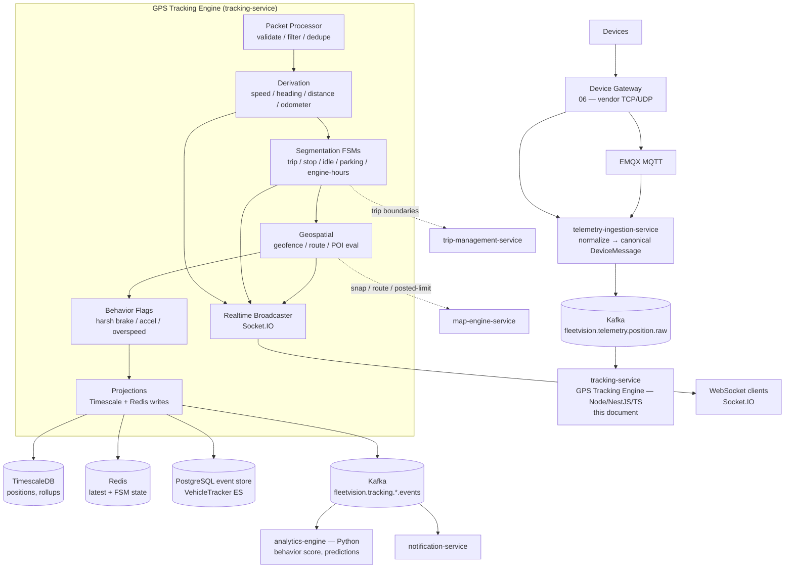

### 1.4 Engine Sub-Components

| # | Engine | Stage | Trigger | Output |
|---|---|---|---|---|
| 1 | **Packet Processor** | validate | every raw position | validated, deduped `Position` |
| 2 | **Derivation** | enrich | every valid position | speed, heading, distance, odometer |
| 3 | **Trip Detector** | segment | movement / ignition state | trip start/end boundaries |
| 4 | **Stop / Idle / Parking Detector** | segment | dwell / engine state | stop, idle, parking events |
| 5 | **Engine-Hours Meter** | segment | ignition/ACC edges | engine-on accumulated seconds |
| 6 | **Geofence / POI / Landmark Engine** | spatial | every position | enter/exit/dwell, POI resolution |
| 7 | **Route Engine** | spatial | positions + assigned Route | adherence, deviation, ETA |
| 8 | **Behavior Flags** | enrich | derivative breach | harsh-brake/accel/overspeed flags |
| 9 | **Projections** | persist | every valid position | Timescale + Redis + event store |
| 10 | **Realtime Broadcaster** | deliver | every signal | WebSocket push |

> **Algorithm depth** for each numbered engine lives in `docs/modules/GPSEngine.md` (FSMs, thresholds, formulas). This document owns the *pipeline, sequencing, data model, and contracts*.

### 1.5 Latency & Throughput Budgets

| Path | Budget | Mechanism |
|---|---|---|
| Ingest → Redis latest | < 50ms P99 | direct write on ingest |
| Ingest → WebSocket push | < 200ms P99 | Kafka → consumer → Socket.IO broadcaster |
| Geofence evaluation per position | < 20ms P99 (INV-T02) | in-memory R-tree + PostGIS fallback |
| Trip/stop/idle FSM transition | < 5ms P99 | in-memory FSM keyed by vehicle |
| Replay query (1 day, ~8K pts) | < 500ms P99 | continuous aggregate + simplification |
| Behavior score recompute | minutes (nightly) | analytics-engine batch |

### 1.6 Design Principles

1. **Stateless service, stateful per-vehicle FSM.** Pods keep per-vehicle state in memory + Redis — no global mutable state. Pod restart resumes mid-trip from Redis without spurious boundaries.
2. **Idempotent.** Every derived event carries `(vehicle_id, source_message_id)`; downstream dedupes on `(aggregate_id, event_id)` (`02` §5).
3. **Deterministic replay.** Same raw positions + same config → same derived events. Required for dispute resolution.
4. **Configurable per tenant/fleet.** Every threshold is fleet-policy-driven (Appendix B).
5. **Never block the hot path.** Expensive work (map-matching, scoring, polyline simplification) is offloaded to `map-engine-service`, RabbitMQ task queues, or `analytics-engine`.

---

## 2. Processing Pipeline

The pipeline is the contract between the 10 engines: each stage consumes the previous stage's output, adds one derived fact, and never reverts a downstream stage's decision. Stages are **synchronous within a position** (the hot path) except where explicitly deferred.

### 2.1 End-to-End Pipeline

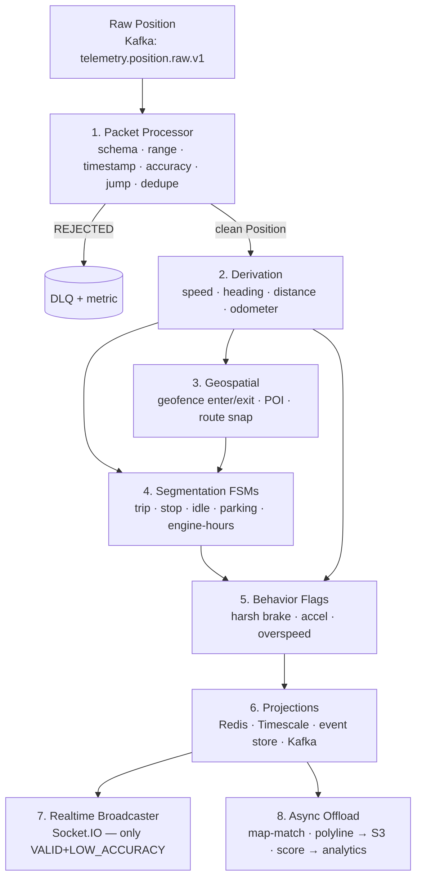

### 2.2 Stage Contract

| Stage | Input | Output | Sync? | Failure Handling |
|---|---|---|---|---|
| 1. Packet Processor | raw CloudEvents position | `Position {quality}` or drop | sync | DLQ + metric; never block |
| 2. Derivation | clean `Position` + previous `Position` | enriched `Position` (speed/heading/dist/odo) | sync | default to device-reported if derivation fails |
| 3. Geospatial | enriched `Position` + geofence/route/POI sets | spatial events (enter/exit/dwell, adherence) | sync (< 20ms) | R-tree hit; PostGIS fallback; skip on timeout (alert) |
| 4. Segmentation | enriched `Position` + FSM state | trip/stop/idle/parking/engine-hours events | sync (< 5ms) | FSM state from Redis; degrade on Redis loss (PG) |
| 5. Behavior Flags | enriched `Position` + derivative | behavior flag events | sync | derived fallback if no accelerometer |
| 6. Projections | enriched `Position` + all events | Redis SET, Timescale COPY, event-store append, Kafka produce | sync (batched) | buffer on store slow; alert at 80% cap |
| 7. Realtime | VALID / LOW_ACCURACY positions + events | WebSocket push | async (fan-out) | drop on slow client; never block ingest |
| 8. Async Offload | trip segments, behavior events | map-matched polyline (S3), score (ClickHouse-deferred → Timescale) | async | RabbitMQ retry + DLQ |

### 2.3 Stage Ordering Invariants

1. **Validation before derivation.** A rejected position never reaches a derived metric — protects mileage/score integrity.
2. **Derivation before segmentation.** FSMs consume *derived* speed/heading, not raw device speed, so the FSM is robust to devices that report speed poorly.
3. **Geospatial and segmentation are independent** but both consume the enriched position; their events are emitted in a deterministic order (geofence → trip → behavior) so downstream consumers see a stable sequence.
4. **Projections are the last synchronous step** before realtime/async fan-out — guarantees at-least-once delivery to stores before clients are notified.

---

## 3. Real-Time Position Processing

The Packet Processor (stage 1) is the gatekeeper: it consumes raw positions from Kafka, validates and filters them, and emits clean `Position` values downstream. Quality here determines the integrity of every downstream metric.

### 3.1 Input

`fleetvision.telemetry.position.raw` (produced by `telemetry-ingestion-service`, partitioned by `device_id`/`vehicle_id` → per-vehicle order preserved). Each record is a CloudEvents-wrapped canonical `DeviceMessage` (`06` §10).

### 3.2 Validation Gates

```mermaid
flowchart TD
    R[raw Position from Kafka] --> G1{1. Schema check}
    G1 -->|fail| DLQ[DLQ]
    G1 -->|ok| G2{2. Sanity range<br/>|lat| ≤ 90, |lng| ≤ 180, speed ∈ [0,400]}
    G2 -->|fail| DLQ
    G2 -->|ok| G3{3. Timestamp<br/>future-dated? stale > 5m?}
    G3 -->|stale| TAG[Tag STALE]
    G3 -->|future| DLQ
    G3 -->|ok| G4{4. Accuracy filter<br/>accuracy > max?}
    G4 -->|poor| DROP[Drop]
    G4 -->|ok| G5{5. Jump / teleport<br/>implied speed > max plausible}
    G5 -->|suspect| HOLD[Hold for re-eval]
    G5 -->|ok| G6{6. Dedupe<br/>same veh/ts/lat/lng within 5s}
    G6 -->|dup| DROP
    G6 -->|ok| G7{7. Out-of-order}
    G7 -->|reorder| BUF[Buffer + reorder ≤ 2s]
    G7 -->|ok| OUT[clean Position downstream]
    TAG --> OUT
    BUF --> OUT
```

### 3.3 Coordinate Validation Rules

| # | Rule | Failure Action | Rationale |
|---|---|---|---|
| CV-1 | Latitude ∈ [−90, 90], Longitude ∈ [−180, 180] | REJECT → DLQ | Garbage in, nothing out |
| CV-2 | Speed ∈ [0, 400] km/h, Heading ∈ [0, 360)° | REJECT → DLQ | Physics sanity |
| CV-3 | `captured_at` not future-dated > 60s | REJECT → DLQ | Clock-skew / replay protection |
| CV-4 | `captured_at` not stale > `max-age-seconds` (300) | tag `STALE`, persist, **do not push live** | Misleads the live map |
| CV-5 | `accuracy_m` ≤ `max-accuracy-meters` (50) | DROP if worse | Noisy fix pollutes mileage |
| CV-6 | Implied step speed ≤ `max-plausible-speed-kmh` (300) | HOLD for re-eval | Teleport / multipath |
| CV-7 | Duplicate `(vehicle, ts, lat, lng)` within 5s | DROP | Device resend storm |
| CV-8 | Antimeridian / pole wrap | REJECT → DLQ | Corrupt coordinate |

### 3.4 Quality Codes

| Code | Persisted? | Pushed live? | Used in derived metrics? |
|---|---|---|---|
| `VALID` | ✅ | ✅ | ✅ |
| `STALE` (> max-age) | ✅ (flagged) | ❌ | ❌ |
| `LOW_ACCURACY` (accepted, flagged) | ✅ | ✅ (with accuracy halo) | ✅ (down-weighted) |
| `SUSPECT_JUMP` (held) | ❌ | ❌ | ❌ |
| `REJECTED` | ❌ (→ DLQ + metric) | ❌ | ❌ |

### 3.5 Smoothing (optional, per device profile)

For noisy devices (urban canyons, high HDOP), a lightweight **Kalman filter** smooths the stream per vehicle (opt-in per device-profile). State in Redis `kf:<vehicle_id>`. Output replaces raw lat/lng for the engines, but **raw** is retained in storage for forensics. This is the only stage that may rewrite coordinates.

### 3.6 Concurrency Model

One Kafka consumer per partition; per-vehicle state guarded by **striped locks** (vehicle-hash → lock) so multiple vehicles in a partition process in parallel while per-vehicle order is preserved. A bounded in-flight buffer provides back-pressure to Kafka (pause partition on 80% fill).

---

## 4. Location Processing — Speed, Direction, Mileage

Stage 2 enriches each clean `Position` with derived kinematics. The engine prefers device-reported values when plausible (devices with wheel/IMU sensors are more accurate than GPS differentiation) and falls back to derivation otherwise.

### 4.1 Speed Calculation

| Source | When | Formula / Rule |
|---|---|---|
| Device-reported | device provides `speed_kmh` and it is monotonic-plausible | use directly |
| Derived (GPS) | device lacks speed, or reported is implausible | `Δdistance / Δt` over consecutive clean positions |
| Smoothed | noisy device profile | EMA over last N=3 derived samples |

```
derivedSpeed = haversine(prev, curr) / max(Δt, 1s)        // m/s → ×3.6 → km/h
```

### 4.2 Direction (Heading / Course) Calculation

| Source | When | Formula / Rule |
|---|---|---|
| Device-reported | device provides `heading_deg` | use directly (clamped 0–360) |
| Derived (GPS) | device lacks heading or speed < 5 km/h | bearing from `prev → curr` |
| Hold last | speed < 5 km/h (static noise) | keep previous heading (avoid spin) |

```
θ = atan2( sin(Δλ)·cos(φ2), cos(φ1)·sin(φ2) − sin(φ1)·cos(φ2)·cos(Δλ) )
heading = (θ·180/π + 360) mod 360
```

### 4.3 Distance & Mileage Calculation

Mileage is the most operationally/financially important derived metric — it drives maintenance schedules, fuel efficiency, billing, and depreciation. It must be **accurate, monotonic, and reconcilable**.

| Method | When | Notes |
|---|---|---|
| **Haversine** (consecutive) | default — every pair of clean positions | R = 6,371,000 m |
| **Vincenty** | high-accuracy short ranges (rare, opt-in) | ellipsoidal; ~0.5mm |
| **Map-matched** (snapped) | route adherence matters | calls `map-engine-service` async |
| **Odometer-reported** | device provides monotonic, plausible `odometer_km` | preferred when drift < 5% |

**Filters** applied to every step: dedupe-distance (< 1m ignored), max-step (ignore implying > plausible speed), stop-zeroing (0 contribution while STOP/IDLE), reverse-hop (ignore A→B→A jitter).

**Gap interpolation**: gap < `max-gap-in-trip` (600s) → distance estimated from assigned route or average speed 60s before/after (capped at limit). Gap ≥ threshold breaks the trip.

### 4.4 Monotonic Derived Odometer

```
odometerKm_n = odometerKm_{n−1} + max(0, filteredDistanceStep_n)
```

Stored in Redis (`odo:<vehicle_id>`), snapshotted hourly + on trip-end to Timescale + the `VehicleTracker` aggregate. Device-reported odometer divergence > 5% → `tracking.odometer.drift.v1` alert.

---

## 5. Trip, Stop, Idle, Parking, Engine-Hours Detection

Stage 4 segments the stream into operational periods via per-vehicle finite-state machines. **Each FSM is independent** (trip, idle, parking run concurrently) so a configuration change to one does not perturb the others. FSM algorithms and thresholds live in `docs/modules/GPSEngine.md` §4–§6; this section defines the boundaries and contracts.

### 5.1 Detection Glossary

| Concept | Movement | Ignition/ACC | Duration | At POI? |
|---|---|---|---|---|
| **Trip-internal pause** | stationary | on/off | < `min-stop-duration` | n/a |
| **Idle** | stationary (speed ≤ idle) | **ON** | ≥ `idle-threshold` | n/a |
| **Stop** | stationary | on/off | ≥ `stop-threshold` | resolved |
| **Parking** | stationary | **OFF** | ≥ `parking-threshold` | n/a (vehicle left) |
| **Trip** | moving | on | sustained ≥ `start-duration` | n/a |

### 5.2 Trip Detector — State Machine

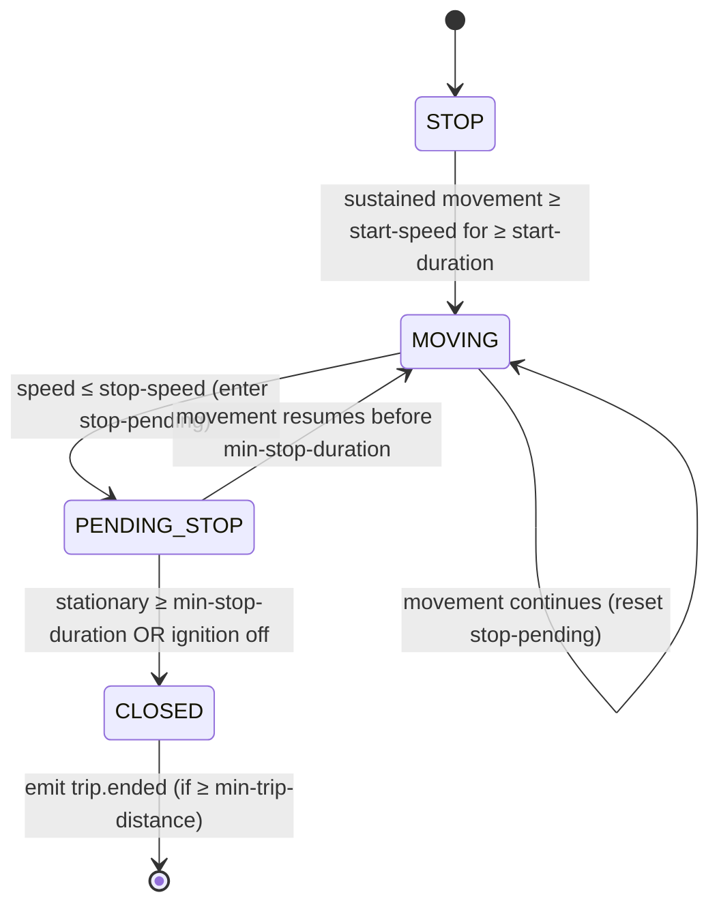

| Parameter | Default | Meaning |
|---|---|---|
| `start-speed-kmh` | 10 | Speed above which movement is "real" (filters GPS creep) |
| `start-duration-s` | 30 | Sustained movement to open a trip candidate |
| `min-trip-distance-m` | 250 | Discard micro-trips below this |
| `stop-speed-kmh` | 3 | Speed at/below which "stationary" |
| `min-stop-duration-s` | 300 | Stationary duration that closes a trip |
| `max-gap-in-trip-s` | 600 | GPS gap above this breaks a trip |
| `ignition-binds` | true | Ignition-OFF force-closes |

> **Ownership boundary.** This engine emits **motion-based** trip boundaries (`tracking.trip.started.v1` / `.ended.v1`). `trip-management-service` owns the operational **Trip** aggregate (`02` §3.2 #37) and enriches with driver / route / load / POD. The detector does not own Trip state.

### 5.3 Stop Detection

When the Trip FSM enters `PENDING_STOP` (stationary ≥ `min-stop-duration`), the Stop Engine **reverse-geocodes** the location (via `map-engine-service`) and matches it against known POIs / geofences:

- At known POI → `tracking.stop.detected.v1` with `purpose = CUSTOMER | DEPOT | FUEL | YARD`.
- Not at POI → `tracking.stop.detected.v1` with `purpose = UNSCHEDULED`, or classified as **Idle** if the engine is still running.

Dwell at a geofence with a DWELL trigger is linked to the Geofence Engine's `tracking.geofence.dwell.v1` to avoid double-alerting.

### 5.4 Idle Detection

Opens an idle window when `ignitionOn AND speed ≤ idleSpeedKmh` for ≥ `idle-threshold-s` (default 180s); alert at `idle-alert-threshold-s` (900s). **PTO engaged suppresses idle** (legitimate equipment use — pump, lift, refrigeration).

- State in Redis `idlefsm:<vehicle_id>`.
- Events: `tracking.idle.started.v1` / `.ended.v1` / `.alert.v1`.

### 5.5 Parking Detection

**Parking** is distinct from a Stop: the ignition is **OFF** and the vehicle has been left ≥ `parking-threshold-s` (default 1800s). Parking events drive the "vehicle left at location" status and the security alert ("vehicle moved while parked" — links to the Alarm Engine). 

- State in Redis `parkfsm:<vehicle_id>`.
- Events: `tracking.parking.started.v1` / `.ended.v1`, `tracking.parking.tamper.v1` (movement while parked + ignition off).

### 5.6 Engine Hours

Engine hours accumulate **engine-on time** for maintenance scheduling and billing (off-highway equipment, PTO-based assets). Driven by ignition/ACC edges (§6), not by movement.

```
on each IgnitionTurnedOn / ACC_ON  → open engine-hour window (engineHoursSince = 0)
on each position while engine ON    → engineHoursSince += Δt
on each IgnitionTurnedOff / ACC_OFF → emit tracking.engine.hours.accumulated.v1
                                     → snapshot to VehicleTracker + Timescale
```

| Parameter | Default | Meaning |
|---|---|---|
| `engine-hours-source` | `ignition` | `ignition` \| `acc` \| `pto` (which signal counts) |
| `idle-counts-as-engine-hours` | true | idle (engine on, stationary) still accrues |
| `pto-only-mode` | false | for off-highway equipment (PTO = engine load) |

---

## 6. ACC, Ignition & Engine State

Ignition and ACC (accessory) signals are the **temporal backbone** of segmentation: they bound trips, idle windows, parking, and engine hours. They are detected as **state transitions**, not per-position values — a single spurious `ignition_off` must not close a trip.

### 6.1 Signal Taxonomy

| Signal | Meaning | Source | Typical device field |
|---|---|---|---|
| **Ignition** | Engine crank / main power | digital input or `ignition_on` boolean | `ignition`, `ACC` (Teltonika DOUT), JT808 `0x01` |
| **ACC** | Accessory power (key in RUN, engine may be off) | digital input | `acc_on`, GT06 `0x09` |
| **Main power** | External power present (vs battery) | digital input | `power_cut` |
| **PTO** | Power take-off engaged (equipment in use) | digital input | `pto`, `din1..din4` |

### 6.2 Edge Detection & Debounce

Raw digital inputs are noisy. Each signal passes through a **debounce** filter before being treated as a state change:

```
on each raw digital input d for signal s:
  if d != pendingState[s]:
     pendingState[s] = d; pendingSince[s] = now
  if d == pendingState[s] and (now - pendingSince[s]) >= debounceMs[s]:
     if d != confirmedState[s]:
        confirmedState[s] = d
        emit signal edge event (IgnitionTurnedOn/Off, ACC_ON/OFF, PTO_ENGAGED, ...)
```

| Signal | `debounce-ms` default | Rationale |
|---|---|---|
| Ignition | 2000 | Cranking dip / glitch |
| ACC | 1000 | Key-bounce |
| PTO | 1500 | Engagement chatter |
| Main power | 5000 | Avoid brownout flapping |

### 6.3 Canonical Events

| Event | Trigger | Consumed by |
|---|---|---|
| `tracking.ignition.on.v1` | ignition rising edge confirmed | Trip (open candidate), TrackingSession start, Engine Hours |
| `tracking.ignition.off.v1` | ignition falling edge confirmed | Trip (force-close), TrackingSession end, Parking, Engine Hours |
| `tracking.acc.on.v1` / `.off.v1` | ACC edge | Engine Hours (`engine-hours-source=acc`) |
| `tracking.pto.engaged.v1` / `.disengaged.v1` | PTO edge | Idle suppression, Engine Hours (pto-only) |
| `tracking.power.cut.v1` | main power lost while ignition on | Alarm Engine (tamper / theft) |

> **Invariant.** `ignition_off` cannot occur without a prior `ignition_on` in the same session (`02` INV-02). The aggregate enforces; the engine's edge detector never emits a dangling edge.

---

## 7. Driver Behavior

### 7.1 Event Sources

| Event | Source | Trigger (default) |
|---|---|---|
| Harsh braking | accelerometer OR derived | decel < −6.0 m/s² |
| Rapid acceleration | accelerometer OR derived | accel > +4.0 m/s² |
| Harsh cornering | accelerometer OR derived | lateral g > threshold |
| Overspeed | Speed Analysis (§7.4) | speed > effective limit |
| Idle (excess) | Idle Detection (§5.4) | idle > alert-threshold |

**Derived fallback** (devices without accelerometer): compute acceleration between consecutive positions; tag `source=derived`. Thresholds are tighter for derived (acceleration noise is higher than IMU).

### 7.2 Real-Time Flag Pipeline (stage 5, tracking-service)

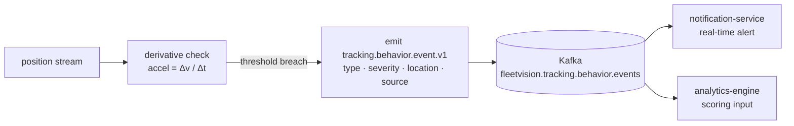

### 7.3 Scoring — Single Owner (ADR-017)

Resolves ARR DDD-1: **one formula, one owner**. `tracking-service` produces real-time behavior *event flags*; `analytics-engine` (Python) produces the canonical *score*. Per `02` §9.3, **30-day rolling window**, normalized per 1,000 km:

```
score = 100
      − 0.25 · normalize(harshBrakingCount)
      − 0.20 · normalize(rapidAccelCount)
      − 0.20 · normalize(harshCorneringCount)
      − 0.25 · normalize(overspeedDuration)
      − 0.10 · normalize(excessIdleTime)
clamped [0, 100]
```

Recomputed nightly + incrementally on-event. Published as `driver.behavior.score.changed.v1` (canonical name — resolves the `.changed` vs `.updated` drift).

### 7.4 Speed Analysis (Overspeed)

**Effective speed limit** = **minimum** of:
- posted road limit (Map Engine at snapped segment),
- geofence override (yard = 10 km/h),
- fleet policy absolute (`fleet-default-limit-kmh`, 120),
- vehicle-type limit (truck vs car).

**Debounced violation window** (≥ 10s sustained or ≥ 250m) before emitting `tracking.speed.exceeded.v1` — avoids single-GPS-spike false positives.

### 7.5 Route Deviation

Compares actual path vs assigned Route (from `trip-management-service` via `trip.route.assigned.v1`). Route rendered as a **corridor** (polyline buffered by `corridor-width-m`, default 100m).

```
on each position (while trip has route):
  1. snap to planned polyline (perpendicular distance)
  2. if perp distance > corridor-width → OFF_ROUTE → emit tracking.route.deviation.v1
  3. if OFF_ROUTE and snapped back ≥ rejoin-time → emit tracking.route.rejoined.v1
  4. advance progress (nearest waypoint + % polyline traversed)
  5. recompute ETA from remaining distance + traffic
```

> The canonical route-deviation event is `tracking.route.deviation.v1` (single event, sub-typed) — owned by this engine (resolves ARR INT-5).

---

## 8. Geospatial — Geofence, POI, Routes, Landmarks, Map Layers

The engine evaluates every position against the active geospatial context. The *algorithms* (R-tree, H3 bucketing) live in `docs/modules/GPSEngine.md` §9; this section defines the **geospatial object model** and the **ownership boundaries** with `map-engine-service` and `trip-management-service`.

### 8.1 Geospatial Object Model

| Object | Owner | Shape | Triggers | Lifecycle |
|---|---|---|---|---|
| **Geofence** | tracking-service (Tracking context #26) | Polygon / Circle / Corridor | enter / exit / dwell | CRUD via Tracking API |
| **POI** (Point of Interest) | map-engine-service | Point + radius + metadata | none (lookup target) | Map Engine canonical store (PostGIS) |
| **Landmark** | map-engine-service | Point + label | none (render hint) | subset of POI for map labels |
| **Route** | trip-management-service (Trip context #38) | Ordered waypoints + planned polyline | adherence / deviation / ETA | assigned to Trip |
| **Map Layer** | map-engine-service | Tile / vector layer spec | none (render) | tenant-visible toggle |

### 8.2 Geofence Engine (stage 3)

Evaluates every position against active geofences and emits enter/exit/dwell within **20ms (INV-T02)**. Two-tier evaluation:

```mermaid
flowchart LR
    P[position] --> T1[Tier 1: in-memory R-tree<br/>O(log N) candidate retrieval]
    T1 --> CAND[candidates ~0–3]
    CAND --> T2[Tier 2: precise PostGIS<br/>ST_Covers / ST_DWithin]
    T2 --> DEC{inside?}
    DEC -->|enter| EE[emit tracking.geofence.entered.v1]
    DEC -->|exit| EX[emit tracking.geofence.exited.v1]
    DEC -->|dwell ≥ threshold| DW[emit tracking.geofence.dwell.v1]
```

For tenants > 10K geofences, additionally bucketed by **H3 cell** (resolution 6); only geofences in the position's cell + neighbors are evaluated. Per-vehicle state (`currentGeofences`) tracked on the `VehicleTracker` aggregate and in Redis `tenant:<tid>:vehicle:<vid>:geofence_state`.

### 8.3 POI Resolution

When a Stop is detected (§5.3), the Stop Engine queries `map-engine-service` (gRPC `ResolvePOI(lat, lng, radius)`) for the nearest POI within radius. The POI's metadata (`type`, `name`, `customer_id`) drives the Stop's `purpose` and downstream actions (customer check-in/out for HOS, arrival notification). POIs are **read-only** from this engine's perspective — created/edited in the Map Engine or imported from fleet data.

### 8.4 Landmarks & Map Layers

**Landmarks** are a render-time subset of POIs (depot, fuel, customer sites) shown as labeled pins on the live map. The frontend requests visible landmarks in the current viewport via `map-engine-service`; the GPS Engine does not compute them. **Map Layers** (traffic, weather, satellite, custom fleet overlays) are tile/vector layers toggled per tenant — owned and served by `map-engine-service`. The GPS Engine emits the *position* stream that the frontend overlays on these layers.

### 8.5 Cache Invalidation

On geofence change (consumed via `tracking.geofence.changed.v1` from the Tracking CRUD path), every engine pod: updates its local R-tree; re-evaluates currently-inside vehicles against the new geometry. This keeps the hot-path R-tree consistent with the source-of-truth PostGIS table within seconds.

---

## 9. Storage — GPS History, Time-Series, Compression, Retention

Clean positions and derived events are written to **four stores** as the CQRS projection of the `VehicleTracker` event stream (ADR-001). Storage design is owned by `03_Database_Architecture.md` §11/§17/§18; this section is the engine's view of those tiers.

### 9.1 Storage Targets

| Store | Role | When | TTL / Retention |
|---|---|---|---|
| **PostgreSQL event store** (`tracking.vehicle_tracker_events`) | Source of truth (ES aggregate) | every valid position + every derived event | partitioned monthly; 24mo |
| **TimescaleDB hypertable** (`tracking.vehicle_positions`) | Range-query read model | every valid position (batched COPY 500/1s) | compressed after 7d; tiered to S3 at 180d |
| **Redis** | Latest position + FSM state | every valid position + FSM transition | TTL = 2× reporting interval |
| **S3** | Simplified per-trip polyline (cold) | on trip end | lifecycle → Glacier |

### 9.2 Write Path (stage 6)

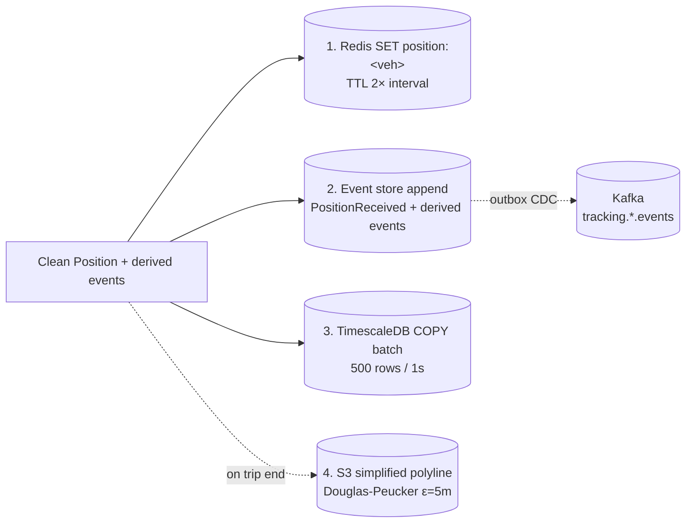

### 9.3 Position Compression (TimescaleDB)

The hypertable (`03` §11.1) compresses after 7 days: `compress_segmentby = vehicle_id`, `compress_orderby = captured_at DESC` → ~90% storage reduction, fast per-vehicle range scans. Compression is columnar — late-arriving positions within a compressed chunk are handled by Timescale's decompress-and-insert.

**Polyline compression** (replay / S3): Douglas-Peucker simplification (ε=5m at 1min resolution) reduces an 8K-point day to ~800 points for playback without visible fidelity loss. Pre-computed on trip-end so "show me this trip" is O(1).

### 9.4 Continuous Aggregates (rollups)

Raw positions are **never scanned** for analytics — pre-materialized rollups replace the deferred ClickHouse at MVP–Phase-3 scale (ADR-022 §2.3):

| Aggregate | Grain | Use | Replaces |
|---|---|---|---|
| `vehicle_position_5min` | 5-min summary per vehicle | map playback, replay | ClickHouse raw |
| `vehicle_distance_hourly` | hourly distance per vehicle | utilization, idle billing | ClickHouse rollup |
| `vehicle_speed_profile_hourly` | hourly speed avg / p50 / p95 / max | speed analysis | ClickHouse rollup |
| `vehicle_engine_hours_daily` | daily engine-on seconds | maintenance, billing | manual aggregation |

> **ClickHouse re-introduction trigger** (ADR-022 §2.3): if any dashboarding query P99 > 2s, or Timescale continuous-aggregate storage > 40% of cluster, or Year-5 scale band (≥ 1M vehicles) approaches — ClickHouse returns for the pure-OLAP load. The rollup *shape* above is preserved either way.

### 9.5 Retention Policy (tiered)

| Tier | Store | Age | Access |
|---|---|---|---|
| Hot | TimescaleDB (uncompressed) | 0–7 days | live map, recent replay |
| Warm | TimescaleDB (compressed) | 7–180 days | replay, range queries |
| Cold | S3 Parquet | 180 days – 7 years | `report-generation-service` async (DuckDB/Trino) |
| Audit | PostgreSQL event store | 24 months (then archived) | dispute resolution, ES replay |

Retention honors P5 (compress aggressively, tier to object storage, expire per policy — `03` §1.1) to drive cost-per-vehicle toward <$1/mo by Year 5 (BG-3).

---

## 10. Domain Model (DDD) — Entities, Aggregates, Events, Commands

The GPS Tracking Engine operates within the **Tracking & Monitoring** bounded context (`02` §1, Context 7). The aggregates below are owned by `tracking-service`; this engine is their *computation surface* — it applies commands to the aggregates and the aggregates emit the events. Aggregate *definitions* are owned by `docs/modules/Tracking-Monitoring.md` §3 and `02` §3.2; the engine references them by identity.

### 10.1 Bounded Context & Ubiquitous Language

| Term | Definition |
|---|---|
| **Position** | A validated `(lat, lng, t, speed, heading, …)` fix — the atomic unit of the stream |
| **VehicleTracker** | The event-sourced aggregate representing the live tracking state of a single vehicle |
| **TrackingSession** | A continuous tracking window (ignition-on → ignition-off) — event-sourced |
| **Geofence** | A virtual boundary triggering actions on enter/exit/dwell |
| **Trip Boundary** | A motion-derived (start, end) pair — *not* the operational Trip aggregate |
| **Derived Metric** | A computed fact (speed, distance, odometer, engine hours) — not stored raw |
| **Signal** | A real-time value pushed to clients (position, speed, ignition, alert) |

### 10.2 Aggregates (owned by tracking-service)

| # | Aggregate Root | Event-Sourced? | Key Invariant | Engine Role |
|---|---|---|---|---|
| 25 | **VehicleTracker** | **Yes (ES)** | Positions immutable once persisted (INV-T01) | applies `ProcessPosition`; reconstructs via replay |
| 26 | **Geofence** | No | Boundary valid; minimum area | read by Geofence Engine for evaluation |
| 27 | **TrackingSession** | **Yes (ES)** | One active per vehicle | opened/closed by ignition edges |

### 10.3 Entities & Value Objects (within VehicleTracker)

| Type | Kind | Notes |
|---|---|---|
| `Position` | Value Object | `Latitude ∈ [−90,90]`, `Longitude ∈ [−180,180]`, `altitude?`, `accuracy?`, `timestamp` |
| `DerivedKinematics` | Value Object | `speedKmh`, `headingDeg`, `distanceStepM`, `odometerKm` |
| `IgnitionState` | Value Object | `ignitionOn`, `accOn`, `ptoEngaged`, `mainPower` (debounced) |
| `TripBoundary` | Value Object | `startPosition`, `endPosition`, `distanceKm`, `durationSec` |
| `GeofenceMembership` | Entity (within aggregate) | `geofenceId`, `enteredAt`, `currentGeofences: Set<UUID>` |
| `EngineHourWindow` | Entity | `openedAt`, `closedAt?`, `accumulatedSeconds` |

### 10.4 Commands (handled by tracking-service command bus)

| Command | Handler | Produces |
|---|---|---|
| `ProcessPosition` | Packet Processor → VehicleTracker | `PositionReceived` (+ derived) |
| `OpenTripBoundary` | Trip Detector | `TripStarted` (boundary) |
| `CloseTripBoundary` | Trip Detector | `TripEnded` (boundary) |
| `RecordStop` | Stop Detector | `StopDetected` |
| `OpenIdleWindow` / `CloseIdleWindow` | Idle Detector | `IdleStarted` / `IdleEnded` |
| `OpenParkingWindow` / `CloseParkingWindow` | Parking Detector | `ParkingStarted` / `ParkingEnded` |
| `AccumulateEngineHours` | Engine-Hours Meter | `EngineHoursAccumulated` |
| `EnterGeofence` / `ExitGeofence` | Geofence Engine | `GeofenceEntered` / `GeofenceExited` |
| `FlagBehaviorEvent` | Behavior Flags | `BehaviorEventFlagged` |
| `StartTrackingSession` / `EndTrackingSession` | Ignition edges | `TrackingSessionStarted` / `Ended` |

### 10.5 Domain Events (engine-emitted subset)

> **Ownership note (resolves ARR ARCH-4).** The **parent `docs/modules/Tracking-Monitoring.md` owns the canonical `tracking.*` event catalog**. The events below are the subset this engine *emits* into that catalog; it does not redeclare ownership. All events are CloudEvents-wrapped, Avro-serialized, on `fleetvision.tracking.*.events` (single topic convention, ADR-016).

| Event | Engine | Topic partition key |
|---|---|---|
| `tracking.position.received.v1` | Packet Processor | `vehicleId` |
| `tracking.trip.started.v1` / `.ended.v1` | Trip | `vehicleId` |
| `tracking.stop.detected.v1` | Stop | `vehicleId` |
| `tracking.idle.started.v1` / `.ended.v1` / `.alert.v1` | Idle | `vehicleId` |
| `tracking.parking.started.v1` / `.ended.v1` / `.tamper.v1` | Parking | `vehicleId` |
| `tracking.engine.hours.accumulated.v1` | Engine Hours | `vehicleId` |
| `tracking.ignition.on.v1` / `.off.v1` | Ignition edge | `vehicleId` |
| `tracking.acc.on.v1` / `.off.v1` | ACC edge | `vehicleId` |
| `tracking.pto.engaged.v1` / `.disengaged.v1` | PTO edge | `vehicleId` |
| `tracking.geofence.entered.v1` / `.exited.v1` / `.dwell.v1` | Geofence | `vehicleId` |
| `tracking.route.deviation.v1` / `.rejoined.v1` / `.eta.updated.v1` | Route | `vehicleId` |
| `tracking.behavior.event.v1` | Behavior (flag) | `vehicleId` |
| `tracking.speed.exceeded.v1` | Speed | `vehicleId` |
| `tracking.odometer.drift.v1` | Mileage | `vehicleId` |
| `tracking.power.cut.v1` | Power | `vehicleId` |

### 10.6 Projected Read Models (CQRS read side)

| Projection | Source | Store | Queried by |
|---|---|---|---|
| Latest position per vehicle | `PositionReceived` | Redis `tenant:<tid>:vehicle:<vid>:pos` | live map, BFF |
| Position history | `PositionReceived` | TimescaleDB hypertable | replay, history API |
| Trip list / detail | `TripStarted/Ended` | PostgreSQL `tracking.trips_view` + Timescale | trip-management-service, reports |
| Idle / stop aggregates | idle/stop events | TimescaleDB continuous aggregate | utilization reports |
| Geofence membership | enter/exit events | Redis + PostgreSQL `tracking.vehicle_geofences` | geofence vehicle-list API |
| Speed profile | speed events | TimescaleDB `vehicle_speed_profile_hourly` | speed-analysis dashboards |

---

## 11. Realtime — WebSocket & Signal Updates

Stage 7 delivers live signals to connected clients. Built on **Socket.IO** (Node + Redis adapter — ADR-015), the broadcaster is the *only* component that talks to clients; engines publish to an internal signal bus and the broadcaster fans out.

### 11.1 Signal Taxonomy

| Signal | Trigger | Payload (subset) | Pushed? |
|---|---|---|---|
| `position.update` | every VALID / LOW_ACCURACY position | `vehicleId, lat, lng, heading, speed, ts, accuracy` | ✅ |
| `ignition.change` | ignition edge confirmed | `vehicleId, state, ts` | ✅ |
| `trip.boundary` | trip start/end | `vehicleId, type, position, ts` | ✅ |
| `geofence.event` | enter/exit/dwell | `vehicleId, geofenceId, type, ts` | ✅ |
| `behavior.alert` | harsh brake/accel/overspeed | `vehicleId, type, severity, position, ts` | ✅ |
| `speed.alert` | overspeed confirmed | `vehicleId, speed, limit, position, ts` | ✅ |
| `stale.position` | position marked STALE | — | ❌ (suppressed — misleads map) |

### 11.2 Subscription Model

Clients subscribe to **rooms** scoped by tenant + filter:

| Room | Members | Authorized by |
|---|---|---|
| `tenant:<tid>:fleet` | all vehicles in tenant | `tracking.position.read` |
| `tenant:<tid>:fleet:<fleetId>` | vehicles in a fleet | `tracking.position.read` + fleet membership |
| `tenant:<tid>:vehicle:<vid>` | single vehicle | `tracking.position.read` + vehicle membership |
| `tenant:<tid>:geofence:<gid>` | vehicles in a geofence | `tracking.geofence.read` |

Membership is enforced by OPA (ADR-009) on join; a tenant boundary violation is SEV-1 (BG-5). The Socket.IO adapter is backed by Redis pub/sub so any broadcaster pod can deliver to any client (multi-pod fan-out).

### 11.3 Broadcaster Architecture

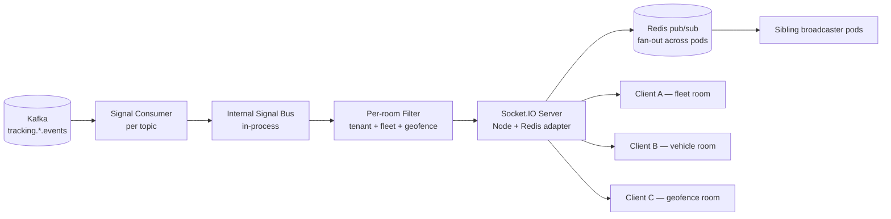

### 11.4 Delivery Semantics

- **At-least-once** over Kafka → consumer; **at-most-once** over WebSocket (no ack/retry — a dropped frame is acceptable; the next position refreshes the map within seconds).
- **Back-pressure**: a slow client's send-buffer fills → the connection is closed (Socket.IO `maxHttpBufferSize` / ping timeout) rather than blocking the broadcaster.
- **Coalescing**: if N positions for one vehicle arrive while a client is slow, only the latest is pushed (debounced 250ms) — the map shows current state, not the backlog.
- **No business logic in the broadcaster.** It is a pure projection of events to rooms; all decisions are made upstream in the engines.

---

## 12. Sequence Diagrams

### 12.1 Position Ingest → Realtime Push (end-to-end)

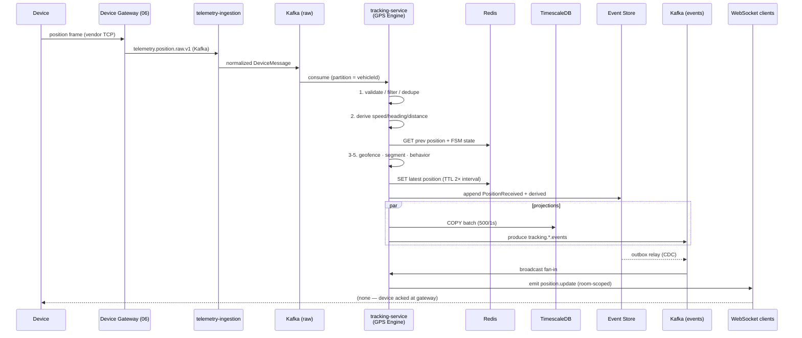

### 12.2 Trip Detection → Trip Aggregate Handoff

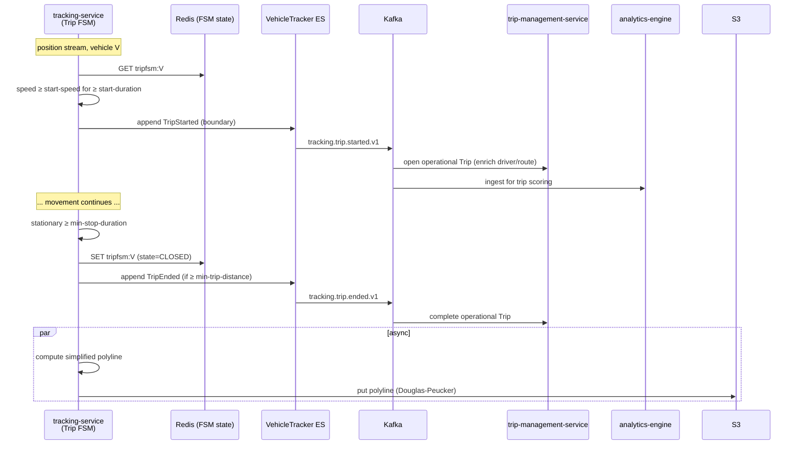

### 12.3 Geofence Evaluation (INV-T02 < 20ms)

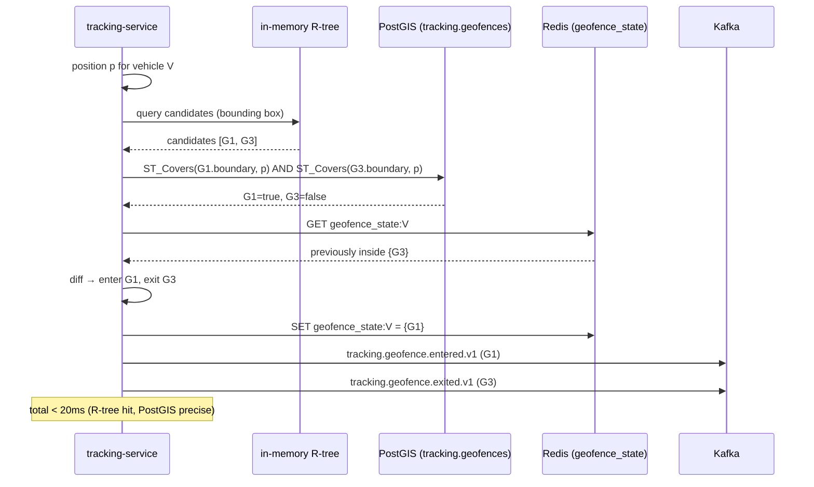

### 12.4 Behavior Flag → Score (single-owner handoff)

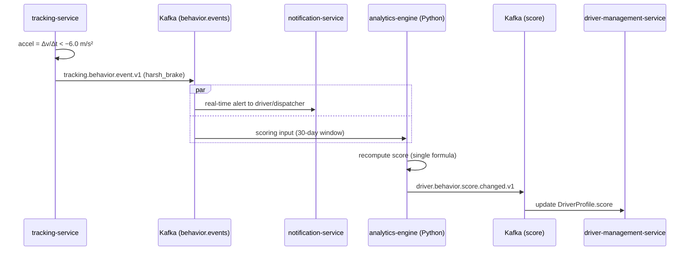

### 12.5 Replay Query (on-demand)

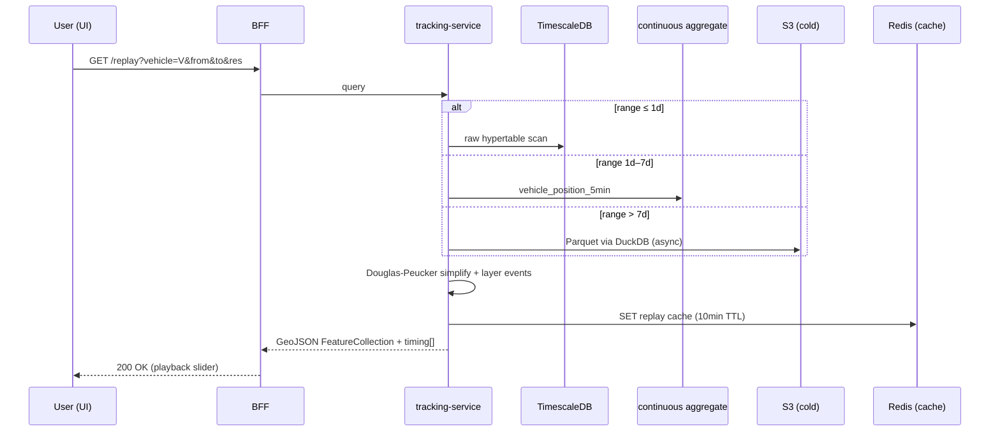

---

## 13. Data Model

The physical schema is owned by `03_Database_Architecture.md` (§11 hypertable, §17 geofences, §18 Redis). This section is the engine's *logical* data model — the entity shapes the engines read and write — cross-referenced to the canonical physical tables so there is one source of truth.

### 13.1 Logical Entity Model

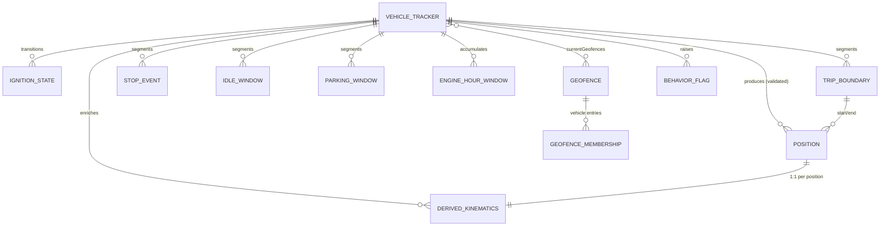

### 13.2 `Position` + derived (physical: `tracking.vehicle_positions` hypertable)

Owned by `03` §11.1. The engine appends via batched COPY.

| Field | Type | Engine role |
|---|---|---|
| `event_id` | UUID (UUIDv7) PK | dedup key (ARR DB-3) |
| `vehicle_id`, `tenant_id` | UUID | partition / RLS |
| `captured_at` | timestamptz | device time (hypertable key) |
| `ingested_at` | timestamptz | platform time |
| `geom` | geography(Point, 4326) | PostGIS queries |
| `latitude`, `longitude` | double | raw retained for forensics |
| `altitude_m`, `heading_deg`, `accuracy_m` | real | validation + smoothing |
| `speed_kmh` | real | derived or device-reported |
| `odometer_km` | double | monotonic derived |
| `ignition_on` | boolean | debounce output |
| `source_device` | UUID | disambiguates multi-device |
| `quality` | smallint | VALID / STALE / LOW_ACCURACY |
| `session_id` | UUID | TrackingSession |
| `metadata` | JSONB | acc, pto, main_power, raw extras |

### 13.3 Event store — `tracking.vehicle_tracker_events` (ES)

Owned by `03` §16. Append-only, partitioned monthly, hash-chained for audit. The engine appends `PositionReceived` + derived events in a single transaction (one aggregate = one transaction — `02` §3.1).

```sql
-- shape (see 03 §16 for canonical DDL)
CREATE TABLE tracking.vehicle_tracker_events (
    event_id        UUID         NOT NULL,          -- UUIDv7
    aggregate_id    UUID         NOT NULL,          -- = vehicleId
    aggregate_version BIGINT     NOT NULL,
    event_type      TEXT         NOT NULL,          -- 'tracking.position.received.v1' ...
    occurred_at     TIMESTAMPTZ  NOT NULL,
    payload         JSONB        NOT NULL,
    metadata        JSONB        NOT NULL DEFAULT '{}'::jsonb,
    PRIMARY KEY (aggregate_id, aggregate_version)
);
```

### 13.4 Geofence — `tracking.geofences` (PostGIS)

Owned by `03` §17.2. The engine reads for evaluation; the parent Tracking module writes via CRUD.

| Field | Type | Notes |
|---|---|---|
| `geofence_id` | UUID PK | |
| `tenant_id` | UUID | RLS |
| `name`, `geofence_type` | text | POLYGON / CIRCLE / CORRIDOR |
| `boundary` | geography(Geometry, 4326) | GiST index |
| `dwell_threshold_s` | int | for `tracking.geofence.dwell.v1` |
| `metadata` | JSONB | linked POI, alert recipients, speed override |

### 13.5 Redis keys (hot path + FSM state)

Owned by `03` §18. Namespaced `tenant:<tid>:…`.

| Key | Value | TTL |
|---|---|---|
| `tenant:<tid>:vehicle:<vid>:pos` | latest position JSON | 2× report interval |
| `tenant:<tid>:vehicle:<vid>:prevpos` | previous position (derivation) | 2× report interval |
| `tenant:<tid>:vehicle:<vid>:geofence_state` | `Set<geofenceId>` | 1h |
| `tenant:<tid>:vehicle:<vid>:tripfsm` | trip FSM state | 6h |
| `tenant:<tid>:vehicle:<vid>:idlefsm` | idle FSM state | 1h |
| `tenant:<tid>:vehicle:<vid>:parkfsm` | parking FSM state | 24h |
| `tenant:<tid>:vehicle:<vid>:odo` | monotonic odometer | 24h |
| `tenant:<tid>:vehicle:<vid>:enginehours` | engine-on seconds | 24h |
| `tenant:<tid>:vehicle:<vid>:kf` | Kalman filter state | 1h |
| `tenant:<tid>:vehicle:<vid>:replay:<hash>` | cached replay GeoJSON | 10 min |

### 13.6 Continuous aggregates (rollups)

Owned by `03` §10. The engine populates via TimescaleDB continuous aggregates (refresh policy per aggregate).

```sql
-- vehicle_distance_hourly (illustrative; canonical DDL in 03 §10)
CREATE MATERIALIZED VIEW tracking.vehicle_distance_hourly
WITH (timescaledb.continuous) AS
SELECT
    tenant_id, vehicle_id,
    time_bucket('1 hour', captured_at) AS hour,
    SUM(distance_step_m) / 1000.0 AS distance_km,
    COUNT(*) FILTER (WHERE ignition_on) AS engine_on_points
FROM tracking.vehicle_positions
GROUP BY tenant_id, vehicle_id, hour
WITH NO DATA;
```

---

## 14. Scaling & Failure Modes

### 14.1 Load Profile (`00` §8.1)

| Path | Year 1 | Year 5 |
|---|---|---|
| Positions/sec ingest | 15,000 | 600,000 |
| Active FSMs (vehicles) | 50,000 | 2,000,000 |
| Geofence evaluations/sec | 15,000 | 600,000 |
| WebSocket concurrent clients | 5,000 | 100,000 |

### 14.2 Scaling Mechanisms

| Component | Mechanism | Trigger |
|---|---|---|
| `tracking-service` pods | HPA on Kafka lag + CPU | lag > 10K |
| Per-vehicle FSMs | in-memory + Redis (durable) | — |
| Geofence R-tree | per-pod in-memory, rebuilt on change | geofence change event |
| TimescaleDB | hypertable chunking + compression | storage growth |
| WebSocket broadcaster | Socket.IO + Redis adapter (multi-pod) | client count |
| Kafka partitions | `vehicle_id` key, scale partition count | throughput |

### 14.3 Throughput Reconciliation (resolves ARR ARCH-6)

All modules quote the **single platform number**: **600K positions/sec at Year-5 peak**. The `tracking-service` hot path (decode → Redis → event store → Timescale COPY → Kafka) is sized to handle ~30K positions/sec/pod → ~20 pods at Year 5.

### 14.4 Failure Modes

| Failure | Response |
|---|---|
| Pod crash | K8s reschedule; FSM state from Redis (no spurious boundaries) |
| Redis unreachable | circuit breaker; degrade to PG for FSM; alert |
| Kafka slow | back-pressure via bounded channels; buffer to cap; alert at 80% |
| Postgres / event store down | buffer events in Redis; replay on recovery (outbox) |
| TimescaleDB slow | batch buffer holds; compress/retention jobs throttle |
| `map-engine-service` down | geocode/snap degrade (skip optional enrichment); geofence R-tree still serves |
| WebSocket client slow | close connection (no broadcaster block) |

---

## 15. Conformance, Traceability & Open Items

### 15.1 ADR Conformance

| ADR | Status | How this document conforms |
|---|---|---|
| ADR-001 (CQRS + Event Sourcing) | Accepted | §9, §10, §13 — `VehicleTracker` ES; projections to Timescale/Redis; outbox relay |
| ADR-002 (Kafka backbone) | Accepted | §1.3, §2 — Kafka is the sole event backbone; idempotent batched Avro producer |
| ADR-015 (Socket.IO) | Accepted | §11 — realtime over Socket.IO + Redis adapter |
| ADR-016 (single topic convention) | Accepted | §10.5 — all events on `fleetvision.tracking.*.events` |
| ADR-017 (single behavior-score owner) | Accepted | §7.3 — `analytics-engine` is the sole score owner |
| ADR-021 (Node runtime) | Accepted | §1 — `tracking-service` is Node/NestJS/TS; Python only for `analytics-engine` |
| ADR-022 (lean persistence) | Accepted | §9 — PostgreSQL + Timescale + Redis + S3; ClickHouse deferred w/ trigger |

### 15.2 Foundation Traceability

| Foundation Element | This Document |
|---|---|
| `00` Scale pillar (600K ev/s); BG-7 | §1.5, §14 |
| `00` Trust pillar (BG-5); INV-I01 tenant isolation | §11.2 (room auth), §13 (RLS/namespace) |
| `01` §3 Service Registry #9 (`tracking-service`, Node/TS) | §1 header, §1.3 |
| `01` §3 #19 (`analytics-engine`, Python) | §7.3, §12.4 |
| `01` §4.1 Runtime (Node/NestJS/TS) | §1.3 |
| `01` §6 Event-driven (single topic) | §10.5 |
| `01` §7 CQRS + Event Sourcing | §9.2, §10, §13.3 |
| `02` §1 Context 7 (Tracking) | §1, §10 |
| `02` §3.2 aggregates #25/#26/#27 | §10.2 |
| `02` §5 Tracking events | §10.5 |
| `02` §8 INV-T01 (positions immutable), INV-T02 (geofence < 20ms) | §3.4, §8.2 |
| `02` §9.3 Behavior score (single formula) | §7.3 |
| `03` §11 GPS hypertable; §17 PostGIS geofences; §18 Redis keys | §9, §13 |
| `06_Device_Gateway.md` (raw producer) | §1.3, §3.1 |
| `docs/modules/Tracking-Monitoring.md` (parent — aggregate + canonical catalog) | §10 (referenced, not duplicated) |
| `docs/modules/GPSEngine.md` (algorithms / FSMs) | §2.2, §5, §8.2 (referenced, not duplicated) |
| `docs/modules/MapEngine.md` (snap/route/geocode/POI/tiles) | §8 (ownership boundary) |

### 15.3 Open Items Raised by This Document

| ID | Item | Affected doc | Action |
|---|---|---|---|
| **GPS-1** | Parking + engine-hours events (`tracking.parking.*`, `tracking.engine.hours.accumulated.v1`, `tracking.acc.*`, `tracking.pto.*`, `tracking.power.cut.v1`) introduced as engine-emitted | `docs/modules/Tracking-Monitoring.md` event catalog | Add to the canonical `tracking.*` catalog in the next revision (engine emits; parent owns). |
| **GPS-2** | `vehicle_engine_hours_daily` continuous aggregate proposed | `03_Database_Architecture.md` §10 | Add the rollup to the continuous-aggregate inventory. |
| **GPS-3** | ACC / PTO / main-power signal taxonomy standardized | `02_Domain_Model.md` §3.2 (VehicleTracker) | Confirm the canonical device-field mapping for each protocol in `06` §10. |
| **GPS-4** | Map Layers / Landmarks ownership confirmed to `map-engine-service` | `docs/modules/MapEngine.md` | Add an explicit "Map Layers & Landmarks" section to `MapEngine.md` to document the render-time contract referenced in §8.4. |

### 15.4 Relationship to Companion Documents

- **`docs/modules/Tracking-Monitoring.md`** — owns the `VehicleTracker` / `TrackingSession` / `Geofence` aggregates, the REST + WebSocket + gRPC API surface, and the canonical `tracking.*` event catalog. This document is the *architecture* layer above it.
- **`docs/modules/GPSEngine.md`** — owns the *algorithms*: FSM definitions, threshold tables, Haversine/Vincenty/Kalman formulas, R-tree/H3 evaluation detail, Douglas-Peucker parameters. This document references them; it does not re-specify them.
- **`06_Device_Gateway.md`** — owns the upstream raw producer. This document consumes its output (`telemetry.position.raw.v1`).
- **`docs/modules/MapEngine.md`** — owns geospatial services (snap, route, geocode, POI, tiles, layers). This document is a *consumer* via gRPC.

---

*This GPS Tracking Engine Architecture is the canonical real-time computation reference for the Tracking & Monitoring context. It is reviewed by the Architecture Review Board alongside `docs/modules/Tracking-Monitoring.md` (parent), `docs/modules/GPSEngine.md` (algorithms), and `docs/modules/MapEngine.md` (geospatial services). Engine implementations live under `tracking-service/src/modules/gps-engine/`; the FSM thresholds, formulas, and event catalog are governed by the companion modules cited above.*
