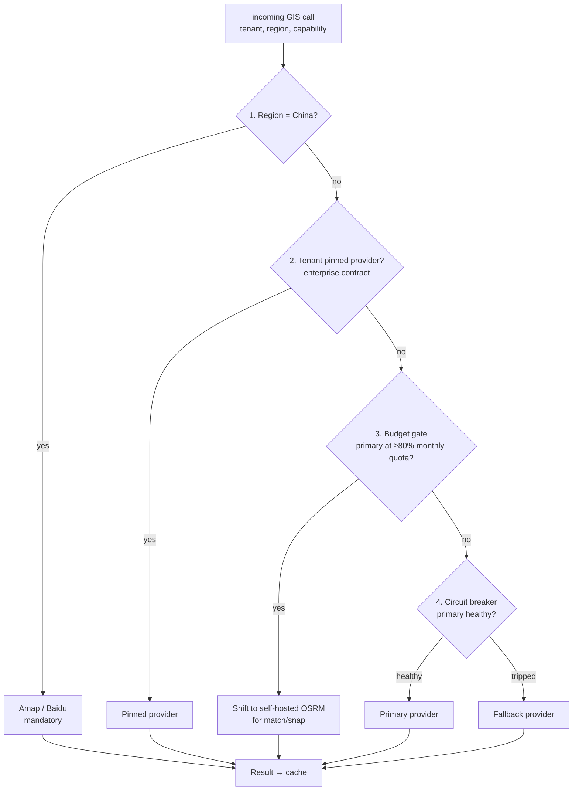
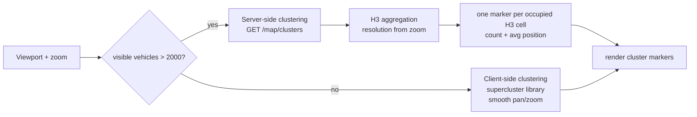
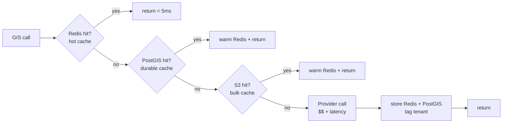
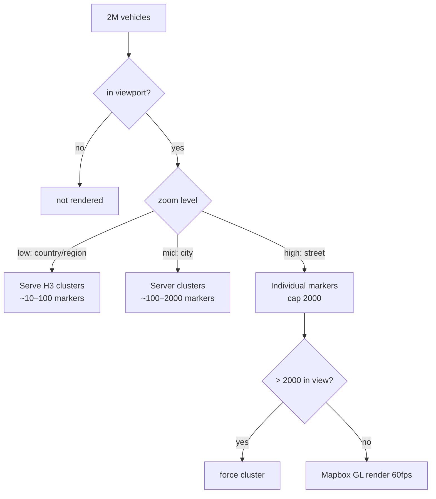
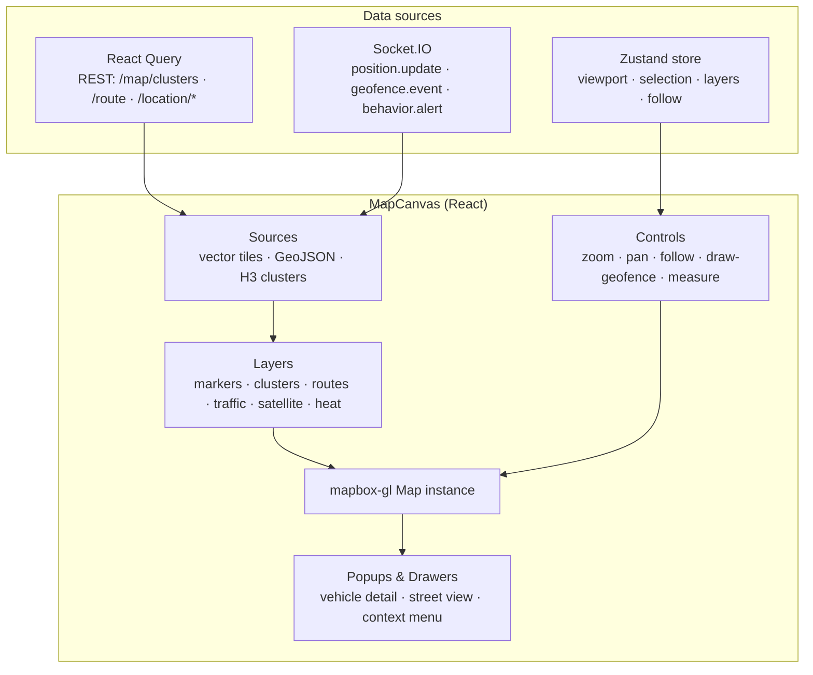
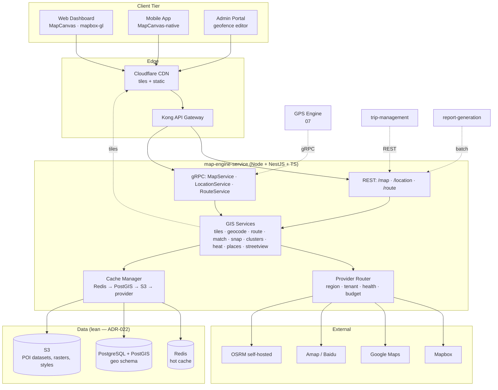
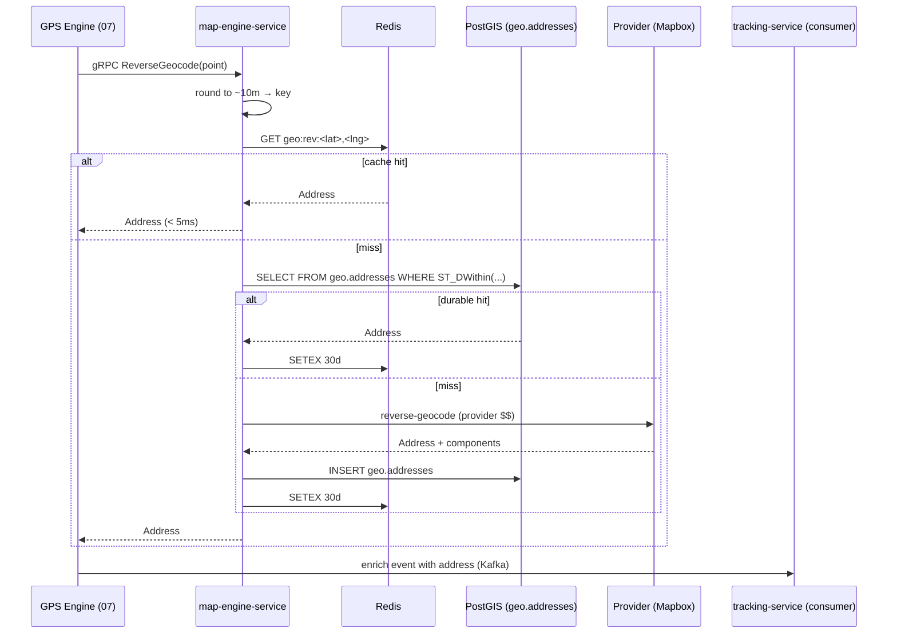
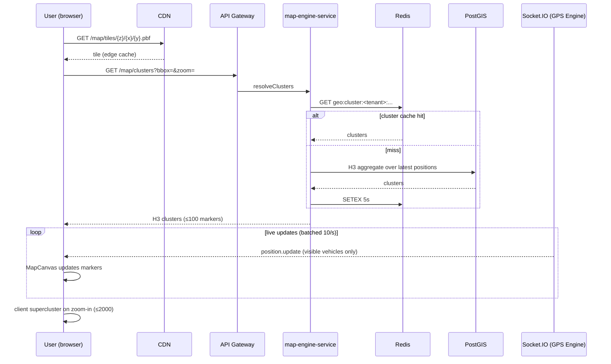
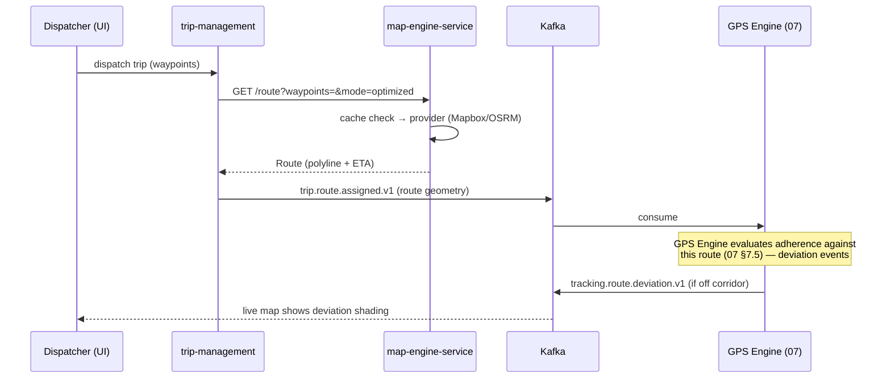

# FleetVision — Map Engine / Enterprise GIS Architecture

**Version:** 1.0.0
**Status:** Approved — Architecture Reference
**Date:** 2026-08-02
**Owner:** Real-Time Data Architect / Chief Software Architect
**Classification:** Confidential — Architecture Reference

> **About this document.** This is the canonical architecture-tier specification for the FleetVision **Map Engine** — the enterprise GIS platform within the Tracking & Monitoring bounded context (`02_Domain_Model.md` §1, Context 7). It defines *how* map providers are abstracted, *how* the live fleet map and its features (markers, clusters, heatmaps, routes, traffic, satellite, street view) are delivered, *how* PostGIS spatial queries serve the platform, and *how* the tile / cache / render pipeline sustains a 2-million-vehicle fleet without melting the browser or the provider bill.
>
> **Relationship to prior work.** `docs/modules/MapEngine.md` v2.0.0 owns the *service-level algorithms and contracts* — the `MapProvider` interface, the HMM map-matching algorithm, the ETA formula, the PostGIS `geo` schema, and the gRPC service definition. This document owns the *architecture* around them: the multi-provider strategy, the live-map feature surface, the spatial-query catalog, the public Map/Location/Route APIs, the tile + caching + large-fleet-rendering performance design, and the UI architecture — at the same depth and format as `06_Device_Gateway.md` and `07_GPS_Engine.md`. Where the module gives the algorithm, this document gives the system diagram, data flow, and ownership table.
>
> **Runtime & persistence note (resolves MAP-1).** `docs/modules/MapEngine.md` v2.0.0 was written for the retired Kotlin/Go runtime (ADR-006) and the superseded 8-store polyglot (ADR-008). This architecture is built on the **lean foundation**: `map-engine-service` is **Node.js LTS + NestJS + TypeScript** (ADR-021), with **PostgreSQL 16 + PostGIS + Redis + S3** (ADR-022). OSRM (the self-hosted map-matcher) is retained as an external stateless service dependency — it is road-graph software, not a platform runtime, so ADR-021's "Node primary runtime" rule is not violated (the same exception that allows PostgreSQL/Redis as external processes). The module's *domain and algorithm* content is sound and carried forward; only the *runtime layer* changes here.
>
> **Conforms to:** `00_Project_Vision.md` v2.1.0 (Openness pillar — provider integrations; Scale pillar — 2M vehicles, BG-7; cost-per-vehicle BG-3), `01_Master_Architecture.md` v2.2.0 (§3 #21 `map-engine-service` Node/TS, §4.1 runtime, §4.5 storage, §6 events), `02_Domain_Model.md` v2.0.0 (Context 7 Tracking; Geofence #26), `03_Database_Architecture.md` v3.0.0 (§10 PostGIS, §17 geofences, §18 Redis), `UI_UX_Design.md` (MapCanvas, Mapbox GL, Socket.IO), ADR-002 (Kafka), ADR-021 (Node/NestJS/TS), ADR-022 (lean persistence).

---

## Table of Contents

1. [GIS Architecture](#1-gis-architecture)
2. [Map Provider Architecture](#2-map-provider-architecture)
3. [Live Map Features](#3-live-map-features)
4. [Geospatial — PostGIS, Spatial Queries, Distance, Nearest, Route Matching](#4-geospatial--postgis-spatial-queries-distance-nearest-route-matching)
5. [APIs — Map, Location, Route](#5-apis--map-location-route)
6. [Performance — Caching, Tile Strategy, Large-Fleet Rendering](#6-performance--caching-tile-strategy-large-fleet-rendering)
7. [UI Architecture](#7-ui-architecture)
8. [Data Flow Diagrams](#8-data-flow-diagrams)
9. [Scaling, Cost Control & Failure Modes](#9-scaling-cost-control--failure-modes)
10. [Conformance, Traceability & Open Items](#10-conformance-traceability--open-items)

---

## 1. GIS Architecture

### 1.1 Purpose

Maps are the visual substrate of FleetVision — the live fleet map, trip playback, route adherence, POI resolution, speed-limit lookup, incident geolocation, video-clip location, dispatch, and the geofence editor. Each requires one or more GIS capabilities: **tile rendering**, **geocoding** (address ↔ coordinate), **routing** (path + ETA + traffic), **map-matching** (snap-to-road), **spatial queries** (geofence, nearest, distance), and **server-side clustering** for very large fleets.

Without a Map Engine, every consumer calls map providers directly — duplicating caches, blowing through provider quotas, paying 5× the egress, and producing inconsistent results (one service snaps to one road-graph version, another to a different one). The Map Engine centralizes these as **internal platform services** with aggressive caching, provider abstraction, cost controls, and one authoritative geospatial data store (PostGIS). It is the enterprise GIS platform inside the product.

### 1.2 Goals & Non-Goals

| Goals | Non-Goals |
|---|---|
| One place for all map provider calls, caching, and failover | Own the `VehicleTracker` aggregate — `tracking-service` owns |
| Provider abstraction (swap per region/tenant/health/budget) | Evaluate geofences against live positions — GPS Engine owns (§4 of `07`) |
| Authoritative PostGIS store for POIs, addresses, geometry | Compute mileage/trips — GPS Engine owns |
| Snap-to-road, routing, geocoding at platform scale | Build our own road graph / base maps (use OSM via OSRM) |
| Render a 2M-vehicle fleet responsively in the browser | Render vector tiles ourselves (proxy Mapbox/MapLibre) |
| Control the #1 variable cost (provider calls) | Own street-level imagery (use Google Street View / Mapbox) |

### 1.3 Position in the Platform

```mermaid
flowchart TB
    subgraph Callers["Callers"]
        FE[Frontends<br/>Web + Mobile + Admin]
        GPS[GPS Engine<br/>07 — snap / route / posted-limit / POI]
        TRK[tracking-service<br/>reverse-geocode events]
        VID[Video Platform<br/>clip location]
        TRP[trip-management<br/>route optimization]
        RPT[report-generation<br/>batch geocode]
    end
    subgraph ME["map-engine-service (Node.js + NestJS + TS)"]
        API[REST + gRPC API<br/>§5]
        SVC[GIS Services<br/>tiles · geocode · route · match · snap · clusters · places]
        ROUTER[Provider Router<br/>region · tenant · health · budget]
        CACHE[Cache Layer<br/>Redis (hot) + PostGIS (durable) + S3 (bulk)]
    end
    subgraph Geo["Geospatial Data"]
        PG[(PostgreSQL + PostGIS<br/>geo schema — POIs, addresses, limits, polylines)]
        R[(Redis<br/>geocode / route / snap / cluster cache)]
        S3[(S3<br/>POI datasets, density rasters, styles)]
    end
    subgraph Ext["External Providers"]
        MB[Mapbox]
        GG[Google Maps]
        AMP[Amap / Baidu<br/>China region]
        OSM[OSRM<br/>self-hosted]
    end
    Callers --> API --> SVC
    SVC --> ROUTER
    SVC --> CACHE
    CACHE --> PG & R & S3
    ROUTER --> MB & GG & AMP & OSM
    SVC -.tiles.-> CDN[CDN<br/>Cloudflare]
    CDN --> FE
```

### 1.4 Service Classification

`map-engine-service` is **Service Registry #21** (`01` §3) — **Node.js LTS + NestJS + TypeScript**, Tier 1 SLO, owned by the Real-Time Data team (alongside tracking, telemetry-ingestion, device-gateway). OSRM runs as a separate stateless deployment (road-graph software), consumed over HTTP — it is *not* counted as a platform runtime (MAP-1).

### 1.5 The Seven GIS Services

All services are idempotent, cacheable, and provider-abstracted. Algorithm detail and the `MapProvider` interface live in `docs/modules/MapEngine.md` §3–§4.

| Service | Purpose | Cache TTL | Cost Driver |
|---|---|---|---|
| **Forward Geocode** | address → coordinates | 30 days | per-call |
| **Reverse Geocode** | coordinates → address | 30 days | per-call |
| **Route** | waypoints → polyline + ETA (+ traffic) | 1h (traffic) / 24h (static) | per-call |
| **Map-Match** | position sequence → snapped road path | forever (immutable per input) | per-call (expensive) |
| **Snap** | single point → nearest road + posted limit | 7 days | per-call |
| **Places Search** | text → POIs / addresses | 7 days | per-call |
| **Tile Proxy + Clusters** | vector/raster tiles + server-side vehicle clusters | CDN-managed | per-tile (high volume) |

### 1.6 Internal SLAs

| Operation | P99 Latency | Mechanism |
|---|---|---|
| Geocode / Reverse-geocode (cache hit) | < 5ms | Redis-first |
| Reverse-geocode (provider call) | < 300ms | PostGIS durable cache, then provider |
| Route (cache hit) | < 20ms | Redis |
| Route (provider call) | < 800ms | provider-dependent |
| Snap (cache hit) | < 5ms | Redis (immutable) |
| Map-Match (≤100 pts) | < 2s | Mapbox / OSRM |
| Tile proxy | < 50ms | CDN-fronted |
| Server-side clusters | < 100ms | PostGIS + Redis H3 |

---

## 2. Map Provider Architecture

The provider layer is the heart of the GIS platform: one abstraction, many providers, selected per call by region/tenant/health/budget. This is what keeps the platform un-blocked by any single vendor and what controls the dominant variable cost.

### 2.1 Provider Catalog

| Provider | Capability strengths | Role on FleetVision | Region | Cost profile |
|---|---|---|---|---|
| **Mapbox** | Vector tiles, rich styling, map-matching, directions, geocoding, traffic | **Primary** for tiles, geocoding, routing, matching | Global (excl. China) | per-call / per-tile |
| **Google Maps** | Geocoding accuracy, Street View, Places, satellite, routing | **Fallback** for geocode/route; **primary** for Street View & high-accuracy Places | Global (excl. China) | per-call (premium) |
| **OpenStreetMap (OSM)** | Free base data; road graph | Source for **self-hosted OSRM** map-matching + fallback tiles | Global | self-hosted (compute only) |
| **Amap / Baidu (AutoNavi)** | Correct road graph + tiles inside China (foreign maps are offset/wrong by law) | **Mandatory primary** for China tenants | China (mainland) | per-call (RMB) |

> **China is non-negotiable.** Foreign map providers are legally and technically wrong inside mainland China (coordinate offset — GCJ-02 vs WGS-84). China-region tenants are routed to Amap/Baidu exclusively for *every* capability. This is a regulatory + accuracy requirement, not a preference (vision Openness pillar — regional compliance).

### 2.2 Capability → Provider Matrix

| Capability | Primary | Fallback | Self-hosted | China |
|---|---|---|---|---|
| Vector tiles (rendering) | Mapbox GL | Google | OSM raster | Amap/Baidu |
| Forward geocode | Mapbox | Google | (n/a) | Amap/Baidu |
| Reverse geocode | Mapbox | Google | (n/a) | Amap/Baidu |
| Routing + traffic | Mapbox Directions | Google Routes | OSRM `route` | Amap/Baidu |
| Map-matching (snap, batch) | Mapbox Matching | Google Roads API | **OSRM** (high volume) | Amap/Baidu |
| Single-point snap + posted limit | local HMM (this service) | OSRM nearest | OSRM | Amap/Baidu |
| Places / POI search | Google Places | Mapbox | `geo.pois` (own) | Amap/Baidu |
| Street View | **Google Street View** | Mapbox Static (pano-lite) | (n/a) | Amap street-view |
| Satellite imagery | Mapbox Satellite | Google Hybrid | (n/a) | Amap satellite |
| Static map snapshots | Mapbox Static | Google Static | (n/a) | Amap static |

### 2.3 The Provider Router

A `ProviderRouter` selects the provider per call. Selection is deterministic given inputs, so identical calls cache identically. The router evaluates four signals in priority order:



| Signal | Source | Effect |
|---|---|---|
| **Region** | tenant settings | China → Amap/Baidu (always) |
| **Tenant pin** | enterprise contract config | bypass default routing (e.g., customer's Google enterprise deal) |
| **Budget** | per-tenant quota counters in Redis | at 80% of monthly Mapbox quota → snap/match shift to OSRM |
| **Health** | circuit breaker per provider | 5 errors / 30s → trip → failover for 60s |

### 2.4 Provider Abstraction Interface

The `MapProvider` interface (defined in `docs/modules/MapEngine.md` §4.1) is the only seam between platform code and vendor SDKs. Each provider has one adapter; adding a provider = adding one adapter. In TS (NestJS):

```typescript
// domain/provider/map-provider.ts — the abstraction every adapter implements
export interface MapProvider {
  reverseGeocode(point: GeoCoordinate): Promise<Address | null>;
  geocode(address: string): Promise<GeoCoordinate[]>;
  route(waypoints: GeoCoordinate[], opts: RouteOpts): Promise<Route>;
  match(positions: GeoCoordinate[]): Promise<SnappedPoint[]>;
  snap(point: GeoCoordinate): Promise<SnappedPoint>;     // includes posted limit
  tilesUrl(style: string): string;
  trafficDelay(route: Route): Promise<number>;            // seconds
  streetView(point: GeoCoordinate, heading?: number): Promise<string | null>; // panorama URL
}
// adapters: MapboxAdapter, GoogleAdapter, AmapAdapter, OsmAdapter (registered in ProviderModule)
```

### 2.5 Failover & Degradation

| Failure | Response |
|---|---|
| Primary provider outage | circuit breaker → fallback provider |
| Both commercial providers down | serve **cached/stale** result + alert; for tiles, CDN continues serving cached tiles |
| OSRM pod crash | K8s restart (stateless); road graph on shared volume; match calls failover to Mapbox |
| Provider rate-limit (HTTP 429) | exponential backoff + CDN absorption + alert |
| China provider unreachable | no failover to foreign providers (legality) — degrade to cached + alert |

### 2.6 API-Key & Credential Handling

Provider keys are **never** exposed to the browser. All provider calls originate server-side; the tile proxy injects credentials and signs tile URLs. Secrets live in Vault (+ External Secrets Operator) per `01` §4.3; per-region provider accounts enforce data-residency compliance (`docs/modules/MapEngine.md` §10.5).

---

## 3. Live Map Features

The live fleet map is the highest-value UI surface and the heaviest GIS consumer. This section catalogues the features and where each is computed (frontend vs Map Engine vs GPS Engine).

### 3.1 Feature Catalog

| Feature | Computed by | Mechanism | Trigger |
|---|---|---|---|
| **Vehicle markers** | Frontend (MapCanvas) | Mapbox GL markers + WebSocket `position.update` | real-time |
| **Clusters** | Map Engine (server) + Frontend (client) | server H3 clusters above ~2K visible; client supercluster below | zoom / viewport |
| **Heat maps** | Map Engine | H3-aggregated density rasters from positions/events | toggle |
| **Routes (live + planned)** | Map Engine (polyline) + GPS Engine (adherence) | snapped LineString from match/route | trip assigned |
| **Traffic** | Mapbox traffic layer | vector tiles with congestion segments | toggle |
| **Satellite** | Mapbox Satellite / Google Hybrid | tile layer switch | toggle |
| **Street View** | Google Street View API | panorama embedded on marker click | on demand |
| **Geofences** | Frontend editor + GPS Engine eval | PostGIS geometry → GeoJSON overlay | admin / live |
| **POIs / Landmarks** | Map Engine (`geo.pois`) | vector source from Places/POI | viewport |
| **Follow mode** | Frontend | camera locks to vehicle, heading rotation | user action |
| **Trip playback** | GPS Engine Replay (`07` §8) | animated along snapped LineString | on demand |

### 3.2 Vehicle Markers — Live Updates

Markers are driven by the GPS Engine's realtime broadcaster (`07` §11) over Socket.IO. The Map Engine does **not** push positions — it provides the *tiles and geometry* the markers sit on. Updates are batched client-side (max 10 msgs/s) to avoid marker jitter, with a "pause live" toggle for inspection (`UI_UX_Design.md` §2.7).

| Marker state | Source | Visual |
|---|---|---|
| Moving (ignition on, speed > 0) | `position.update` | heading-rotated vehicle icon |
| Idle (ignition on, stationary) | `tracking.idle.*` | amber pulsing icon |
| Parked (ignition off, stationary) | `tracking.parking.*` | grey icon |
| Alert active | `tracking.behavior.*` / `.speed.*` | red icon + badge |
| Stale (no fix > 5m) | quality code `STALE` | dimmed + last-seen timestamp |

### 3.3 Clusters — Two-Tier

Above ~2,000 visible vehicles the browser cannot maintain 60fps with individual markers. The platform uses a **two-tier** clustering strategy:



| Tier | Threshold | Mechanism | Latency |
|---|---|---|---|
| Client | ≤ 2,000 visible | `supercluster` in MapCanvas | 0 (in-browser) |
| Server | > 2,000 visible | H3 aggregation in PostGIS + Redis | < 100ms P99 |

H3 resolution is chosen from zoom so each cluster cell maps to a sensible screen size (e.g., zoom 4 → res 3 ~12,000km²; zoom 12 → res 9 ~174m edge). Clusters are cached in Redis keyed `(tenant, fleet, bbox, zoom)` with a 5s TTL — long enough to absorb panning, short enough to stay fresh.

### 3.4 Heat Maps

Density visualization (vehicle concentration, idle concentration, incident density, harsh-event density). Built from **H3-aggregated counts** materialized as a vector source:

- Source data: position/event counts bucketed by H3 cell (resolution 6, ~36km²) — a continuous aggregate in TimescaleDB populated from the GPS Engine's event stream.
- Rendering: Mapbox GL `fill-extrusion` or a heatmap layer over the H3 source; intensity scaled by count.
- Cold rasters pre-computed to S3 for long-range (30-day) density views (`docs/modules/MapEngine.md` §5.4).

> **ClickHouse deferral note.** `docs/modules/MapEngine.md` v2.0.0 referenced "ClickHouse/S3" for heatmaps. Under ADR-022, the heatmap source is **TimescaleDB continuous aggregates** at MVP–Phase-3 scale; ClickHouse re-enters only if the analytics-query trigger fires (`03` §24.3). MAP-2 tracks this reconciliation.

### 3.5 Routes (Live + Planned)

- **Planned route**: `Route` polyline from Map Engine `route()` (snapped to roads) — shown as a thin line when a trip is dispatched.
- **Actual path**: GPS Engine Replay output (`07` §8) — animated or shown as a thicker line; deviations shaded.
- **Adherence corridor**: planned polyline buffered by `corridor-width-m` (100m) — rendered as a translucent band (`07` §7.5).

### 3.6 Traffic, Satellite, Street View

| Feature | Provider | Integration |
|---|---|---|
| Traffic | Mapbox traffic tiles | MapCanvas layer toggle; refresh every 5 min |
| Satellite | Mapbox Satellite / Google Hybrid | style switch; same tile proxy |
| Street View | Google Street View API | embedded panorama on marker click; lazy-loaded modal (not a tile layer) |

Street View is **on-demand only** (per-call cost) and uses the Google adapter regardless of region pin — except China, where Amap street-view is used.

---

## 4. Geospatial — PostGIS, Spatial Queries, Distance, Nearest, Route Matching

PostGIS is the authoritative store for **platform-owned** geospatial data (POIs, address cache, posted limits, geofence geometry mirror, trip polylines). The GPS Engine owns *evaluation* of geofences against positions (`07` §8.2); this engine owns the **geometry store and the spatial-query catalog**. Physical schema is owned by `03` §10/§17; the `geo` schema DDL lives in `docs/modules/MapEngine.md` §5.1.

### 4.1 PostGIS Schema Overview (`geo` schema)

| Table | Purpose | Geometry | Index |
|---|---|---|---|
| `geo.addresses` | reverse-geocode cache (30d) | Point | GiST + H3 |
| `geo.pois` | POI catalog (platform + tenant) | Point | GiST + H3 + tenant |
| `geo.speed_limits` | posted limit per road segment | LineString | GiST |
| `geo.trip_polylines` | simplified trip paths (from GPS Engine) | LineString | GiST + tenant |
| `tracking.geofences` | geofence boundaries (owned by Tracking, mirrored for eval) | Polygon/Circle/Corridor | GiST (`03` §17.2) |

### 4.2 Spatial Query Catalog

The canonical spatial-query patterns the platform runs, with the PostGIS function and index strategy for each.

| Query | PostGIS expression | Index | Used by |
|---|---|---|---|
| **Point in geofence** | `ST_Covers(boundary, geom)` after `boundary && geom` | GiST (bounding-box prefilter) | GPS Engine geofence eval (Tier-2) |
| **Distance between two points** | `ST_Distance(a::geography, b::geography)` | (none — direct) | mileage, nearest |
| **Within radius** | `ST_DWithin(geom, point, radius_m)` | GiST | nearest device, POI lookup |
| **Nearest-K** (KNN) | `ORDER BY geom <-> point LIMIT k` | GiST (KNN) | nearest vehicle, nearest POI |
| **Polygon/polyline intersect** | `ST_Intersects(poly, line)` | GiST | route crosses geofence? |
| **Buffer / corridor** | `ST_Buffer(line, width)` → polygon | GiST on result | route adherence corridor |
| **Length of a path** | `ST_Length(geom::geography)` | (direct) | route distance validation |
| **Snap point to line** | `ST_ClosestPoint(line, point)` + `ST_LineLocatePoint` | GiST | route progress, deviation |
| **Containment of route** | `ST_Contains(poly, route_line)` | GiST | trip inside service area |

### 4.3 Distance Calculation

| Method | Use | Formula / Notes |
|---|---|---|
| **Haversine** (geodesic) | default point-to-point | `ST_Distance(a::geography, b::geography)` — PostGIS uses Vincenty/Karney on the ellipsoid for `geography` |
| **Great-circle** (fast, in-memory) | GPS Engine hot path (R-tree tier-1) | `R·c`, R=6,371,000m (`07` §4.3) |
| **Network distance** | mileage, route adherence | OSRM/Mapbox routed distance (map-matched) |

> Always cast to `geography` for distance — `ST_Distance` on `geometry` returns plane degrees (wrong). The `geo` schema stores `geography(Point,4326)` to prevent this class of bug (`docs/modules/MapEngine.md` §5.1).

### 4.4 Nearest Device / Vehicle

"Find the closest vehicle to a point" — dispatch, roadside assist, nearest-tech. Served by PostGIS KNN over `tracking.vehicle_positions` latest or the Redis latest-position set:

```sql
-- nearest 5 vehicles to a point, within 50km (illustrative)
SELECT vehicle_id, geom,
       ST_Distance(geom, $1::geography) AS distance_m
FROM tracking.latest_vehicle_positions       -- projection fed by Redis
WHERE tenant_id = $2
  AND ST_DWithin(geom, $1::geography, 50000)
ORDER BY geom <-> $1::geography
LIMIT 5;
-- uses GiST KNN (index-backed, no full scan)
```

For sub-ms hot-path lookups, a Redis GEO set (`GEOADD` / `GEORADIUS BYMEMBER`) mirrors latest positions per tenant; PostGIS is the source of truth, Redis is the latency tier.

### 4.5 Route Matching (Map-Matching)

The most computationally expensive geospatial operation and the highest-value for accuracy: turning noisy GPS into a clean road-network path. Algorithm (HMM + Viterbi) and implementation split live in `docs/modules/MapEngine.md` §6.

| Path | Engine | Why |
|---|---|---|
| Real-time single-point snap | local lightweight HMM in `map-engine-service` | latency budget (< 100ms) |
| Batch trip map-match (≤100 pts) | Mapbox Map Matching API | accuracy, fresh road graph |
| High-volume batch (cost-sensitive) | self-hosted OSRM | no per-call cost |
| China | Amap/Baidu match API | correct road graph |

Output: `SnappedPoint { coordinate, roadSegmentId, roadName, postedLimitKmh, snappedAt, confidence }`. Results cached forever (immutable per input hash) → repeated replay of the same trip is free.

### 4.6 Spatial Indexing Strategy

| Index | Columns | Purpose |
|---|---|---|
| **GiST** | every `geography` column | workhorse — `ST_DWithin`, `ST_Covers`, KNN, `&&` bbox prefilter |
| **H3 cell** (resolution 9, ~174m) | `pois`, `addresses` | bucketed lookup + fleet-density/heatmap at extreme scale |
| **B-tree** | `(tenant_id, ...)` | tenant scoping before spatial filter |
| **compound** | `(tenant_id, geom)` via GiST | tenant-isolated spatial queries (RLS also enforces) |

---

## 5. APIs — Map, Location, Route

Three public API surfaces, each with a distinct consumer and SLO. All follow `API_Design.md` (URI versioning, REST) + gRPC for internal high-volume paths (ADR-004). Base path `/api/v1`.

### 5.1 Map API — tiles, styles, clusters, layers

The rendering surface for frontends. High-volume, CDN-fronted, cache-friendly.

| Method | Endpoint | Description | Permission |
|---|---|---|---|
| `GET` | `/map/tiles/{z}/{x}/{y}.pbf` | Vector tile proxy (CDN origin) | any authenticated |
| `GET` | `/map/style/{tenant}` | Tenant map style JSON (Mapbox GL style spec) | any authenticated |
| `GET` | `/map/clusters?bbox=&zoom=&fleet=` | Server-side vehicle clusters (H3) | `tracking.position.live` |
| `GET` | `/map/heat?metric=&bbox=&zoom=` | Heatmap H3 vector source | `tracking.position.read` |
| `GET` | `/map/layers` | Available layers (traffic, satellite, weather, POIs) | any authenticated |
| `GET` | `/map/streetview?lat=&lng=&heading=` | Google Street View panorama URL | `tracking.position.read` |
| `GET` | `/map/static?lat=&lng=&zoom=&size=` | Static map snapshot (report thumbnails) | any authenticated |

**gRPC (internal):**

```protobuf
service MapService {
  rpc ResolveClusters (ClusterReq)  returns (ClusterResp);
  rpc GetHeatmap      (HeatReq)     returns (H3Source);
  rpc GetTenantStyle  (TenantReq)   returns (StyleSpec);
}
```

### 5.2 Location API — geocoding, places, nearest

The address/coordinate/POI surface. Heavily cached (≥99% hit rate at stable addresses).

| Method | Endpoint | Description | Permission |
|---|---|---|---|
| `GET` | `/location/geocode?address=` | Forward geocode (address → coords) | any authenticated |
| `GET` | `/location/reverse?lat=&lng=` | Reverse geocode (coords → address) | any authenticated |
| `POST` | `/location/reverse/batch` | Batch reverse-geocode (report gen) | internal / `report.run` |
| `GET` | `/location/places?q=&lat=&lng=` | Places / POI search (text) | any authenticated |
| `GET` | `/location/pois?bbox=&category=` | POI catalog (tenant-scoped) | `tracking.geofence.read` |
| `POST` | `/location/pois` | Create tenant POI | `tracking.geofence.create` |
| `GET` | `/location/nearest?lat=&lng=&radius=&k=` | Nearest-K vehicles / POIs | `tracking.position.read` |
| `GET` | `/location/snap?lat=&lng=` | Snap point → road + posted limit | internal |

**gRPC (internal hot paths — called per position/event):**

```protobuf
service LocationService {
  rpc ReverseGeocode (Point)          returns (Address);
  rpc BatchReverse   (BatchPointsReq) returns (BatchAddressResp);
  rpc SnapPoint      (Point)          returns (SnappedPoint);   // includes posted_limit
  rpc ResolvePOI     (PoiReq)         returns (Poi);
  rpc NearestVehicles(NearestReq)     returns (NearestResp);
}
```

`SnapPoint` and `ReverseGeocode` are hot paths — Redis-first, PostGIS-second, provider-last; < 5ms P99 on cache hit.

### 5.3 Route API — routing, ETA, map-matching

The navigation/planning surface. Called by trip-management (planning) and GPS Engine (adherence/ETA).

| Method | Endpoint | Description | Permission |
|---|---|---|---|
| `GET` | `/route?waypoints=&mode=&traffic=` | Route (static / live / optimized) | any authenticated |
| `POST` | `/route/optimize` | Multi-stop optimization (TSP-ish) | `trip.dispatch` |
| `POST` | `/route/match` | Map-match a position sequence (batch) | `tracking.replay.read` |
| `GET` | `/route/eta?routeId=` | Recompute ETA with live traffic | `trip.read` |
| `GET` | `/route/speedlimit?lat=&lng=` | Posted speed limit at point | internal |

**gRPC (internal):**

```protobuf
service RouteService {
  rpc GetRoute   (RouteRequest) returns (Route);
  rpc MatchRoute (MatchRequest) returns (SnappedPath);
  rpc GetEta     (EtaRequest)   returns (Eta);
}
```

### 5.4 API Conventions

- **URI versioning** (`/api/v1/...`) per ADR-012.
- **Idempotency**: GETs are naturally idempotent; batch POSTs accept an `Idempotency-Key` header.
- **Per-tenant attribution**: every provider call is tagged with `tenant_id` for cost attribution and quota enforcement (§9.3).
- **Errors**: RFC 7807 problem+json; provider failures mapped to `502 Bad Gateway` with a `provider` field.
- **Rate limiting**: per-tenant at the API Gateway (Kong); tile proxy separately rate-limited and CDN-absorbed.

---

## 6. Performance — Caching, Tile Strategy, Large-Fleet Rendering

Map provider calls are a **top-3 variable cost** and the live map is the **highest-QPS UI path**. Performance engineering here is dominated by three concerns: cache hit rate, tile delivery, and rendering 2M vehicles without freezing the browser.

### 6.1 Caching Strategy (Three Tiers)



| Tier | Store | TTL | Use |
|---|---|---|---|
| **Hot** | Redis | geocode 30d, route 1h, snap forever, cluster 5s | sub-ms repeated lookups |
| **Durable** | PostGIS (`geo.*`) | addresses 30d, pois indefinite, limits 7d | survives Redis eviction; source of truth |
| **Bulk** | S3 | POI datasets, density rasters, styles | cold/large geometries |

Redis cache topology (keys per `03` §18 / `docs/modules/MapEngine.md` §5.3):

| Key | TTL | Purpose |
|---|---|---|
| `geo:rev:<lat>,<lng>` (rounded ~10m) | 30d | Reverse-geocode |
| `geo:fwd:<sha(address)>` | 30d | Forward geocode |
| `geo:route:<sha(waypoints+opts)>` | 1h | Route (with traffic) |
| `geo:route:static:<sha>` | 24h | Route (no traffic) |
| `geo:snap:<veh>:<ts>` | forever (LRU) | Snap (immutable) |
| `geo:limit:<segmentId>` | 7d | Posted speed limit |
| `geo:match:<sha(positions)>` | forever (LRU) | Map-match result |
| `geo:cluster:<tenant>:<fleet>:<bbox>:<zoom>` | 5s | Server-side clusters |

> A reverse-geocode for a depot hits cache **99.9%** of the time. Rounding coordinates to ~10m before lookup is the single biggest cache-hit lever — multiple events at the same depot coalesce to one lookup.

### 6.2 Tile Strategy

Vector tiles (Mapbox GL `.pbf`) are the rendering primitive. The platform proxies them rather than exposing provider keys to the browser.

| Aspect | Decision | Rationale |
|---|---|---|
| Format | **Vector tiles (`.pbf`)** | resolution-independent, styleable, small |
| Delivery | **CDN-fronted proxy** (Cloudflare) | edge caching → offloads origin; per-tenant style without per-tenant origin |
| Auth | server signs tile URLs; CDN validates signed URL | provider key never in browser |
| Raster fallback | OSM raster tiles | if vector provider down, degrade to raster |
| Per-tenant style | Mapbox GL style JSON in S3; proxy injects style URL on session | enterprise branding, custom POI icons |
| Tiered delivery | mobile → lower-DPI tiles; desktop → standard | egress reduction |

**Tile cache longevity**: tiles are effectively immutable per style-version → CDN caches aggressively (days). Cache invalidation = style-version bump → new URL path → CDN serves fresh.

### 6.3 Large-Fleet Rendering

The 2M-vehicle target (vision Scale pillar) cannot render as individual markers. The strategy is **never send all vehicles to the browser** — send only what the current viewport + zoom needs, aggregated.



| Layer | Technique | Threshold | Why |
|---|---|---|---|
| **Viewport filtering** | bbox query on latest-position projection | always | never send off-screen vehicles |
| **Server clustering** | H3 aggregation in PostGIS + Redis | > 2,000 visible | browser can't maintain 60fps above this |
| **Client clustering** | `supercluster` library | ≤ 2,000 visible | smooth pan/zoom without round-trips |
| **Marker cap** | hard cap 2,000 individual markers | always | force cluster beyond this |
| **Update batching** | max 10 position msgs/s per client | always | avoid marker jitter (`UI_UX_Design.md` §2.7) |
| **Live pause** | "pause live" toggle freezes updates | user action | inspection / screenshot |

### 6.4 Map-Match Cost Control

Snap/match is the most expensive capability. Controls (from `docs/modules/MapEngine.md` §10.3):

| Lever | Mechanism | Savings |
|---|---|---|
| **Snap-on-trip-only** | snap during trip segments, not every raw position | 90%+ reduction vs naive |
| **Self-hosted OSRM** | shift map-matching from Mapbox to OSRM at scale | per-call cost → zero |
| **Immutable cache** | snap/match results cached forever (LRU) | repeated replay of same trip is free |
| **Budget gate** | at 80% monthly Mapbox quota → snap/match shifts to OSRM | noisy-tenant containment |

### 6.5 Performance Budgets

| Path | Budget | Mechanism |
|---|---|---|
| Tile first byte (CDN hit) | < 50ms | Cloudflare edge |
| Reverse-geocode (cache hit) | < 5ms | Redis |
| Cluster query | < 100ms P99 | PostGIS H3 + Redis |
| Map load to first paint | < 1s P99 | CDN tiles + style cache |
| 60fps with 2,000 markers | sustained | client clustering + update batching |

---

## 7. UI Architecture

The frontend map stack — owned by `UI_UX_Design.md` (MapCanvas, Appendix C) and realized by the Web Dashboard (React 18 + TS 5) and React Native mobile app. This section is the Map Engine's contract with the UI: what it provides and how the UI consumes it.

### 7.1 Frontend Stack (per `UI_UX_Design.md` Appendix C)

| Concern | Technology |
|---|---|
| Map renderer | `mapbox-gl` (Mapbox GL JS) wrapped in custom `MapCanvas` component |
| Components | `@fleetvision/ui` (React 18 + TS 5), Storybook 8 |
| State (server) | React Query |
| State (UI) | Zustand (viewport, selected vehicle, layers, follow-mode) |
| Real-time | `socket.io-client` (web), reconnecting ws (mobile) |
| Clustering (client) | `supercluster` |
| Forms (geofence editor) | `react-hook-form` + `zod` |

### 7.2 MapCanvas Component Architecture



### 7.3 Data Binding Patterns

| Pattern | Source | Update | Purpose |
|---|---|---|---|
| Tiles | `/map/tiles/*` (CDN) | pan/zoom | base map |
| Vehicle markers | Socket.IO `position.update` | real-time (batched 10/s) | live fleet |
| Clusters | `/map/clusters` (React Query) | viewport/zoom change | large-fleet rendering |
| Route | `/route` (React Query) | trip assignment | planned path |
| Geofences | `/geofences` GeoJSON (React Query) | admin edit / load | boundaries |
| POIs / Landmarks | `/location/pois` (React Query) | viewport | depots, customers |
| Heatmap | `/map/heat` H3 source | toggle / viewport | density |
| Street View | `/map/streetview` (lazy modal) | marker click | imagery |

### 7.4 Mobile Parity

The React Native app mirrors the web MapCanvas via `@fleetvision/ui-native`. Differences:
- Tiles served at lower DPI (egress reduction, §6.2).
- WebSocket uses reconnecting-ws (not socket.io-client).
- Offline tile cache for low-connectivity field use (driver app).
- Smaller default viewport cluster thresholds (mobile CPU).

### 7.5 URL / Deep-Link State

All map state is URL-encoded for shareability (`UI_UX_Design.md` §2.6): `bbox`, `selected vehicle`, `layers`, `filters`, `follow`. A deep link opens the map in the exact state — critical for incident handoff (dispatch → driver → review).

---

## 8. Data Flow Diagrams

### 8.1 GIS Architecture Diagram (consolidated)



### 8.2 Data Flow — Reverse Geocode (hot path, every event)



### 8.3 Data Flow — Live Map Render (large fleet)



### 8.4 Data Flow — Route + Adherence Handoff



---

## 9. Scaling, Cost Control & Failure Modes

### 9.1 Load Profile (`docs/modules/MapEngine.md` §10.1)

| Path | Year 1 | Year 5 |
|---|---|---|
| Reverse-geocode calls/sec | ~1,000 | ~50,000 |
| Route calls/sec | ~50 | ~1,000 |
| Snap/match calls/sec | ~500 | ~20,000 |
| Tile requests/sec (peak) | ~2,000 | ~30,000 |
| Cluster queries/sec | ~500 | ~5,000 |

### 9.2 Scaling Mechanisms

| Layer | Mechanism | Trigger |
|---|---|---|
| `map-engine-service` | HPA (CPU + RPS) | CPU > 70% |
| Cache hit rate | aggressive Redis + PostGIS | ≥99% geocode, ≥90% route |
| OSRM | horizontal (stateless) + road-graph read replicas | CPU > 70% |
| PostGIS | read replicas | read QPS |
| Tile delivery | CDN (Cloudflare) in front of tile proxy | always |
| Redis | cluster mode, per-tenant namespace | memory / QPS |

### 9.3 Cost Control (Primary Concern)

Map provider calls are a **top-3 variable cost** and the direct driver of cost-per-vehicle (BG-3). Controls:

| Lever | Mechanism | Savings |
|---|---|---|
| **Aggressive caching** | geocode 30d, route 1h, snap forever | eliminates majority of repeat calls |
| **Snap-on-trip-only** | snap during trip segments, not every raw position | 90%+ reduction vs naive |
| **Batched reverse-geocode** | round to ~10m; coalesce same-location events | huge for report generation |
| **Self-hosted OSRM** | shift map-matching to OSRM at scale | per-call cost → zero |
| **Per-tenant budgets + quotas** | track per tenant; alert at 80% | noisy-tenant containment |
| **Tiered tile delivery** | mobile lower-DPI; desktop standard | egress reduction |
| **CDN for tiles** | Cloudflare caches at edge | offloads origin |
| **Immutable result cache** | snap/match cached forever (LRU) | repeated replay is free |

### 9.4 Failure Modes

| Failure | Detection | Response |
|---|---|---|
| Provider outage (Mapbox) | circuit breaker | failover to Google; if both down, serve cached/stale + alert |
| OSRM pod crash | liveness | restart (stateless); road graph on shared volume |
| Redis cache down | circuit breaker | fall through to PostGIS / provider; degrade gracefully |
| PostGIS down | Patroni | auto-failover (< 30s) |
| Tile provider rate-limited (429) | HTTP 429 backoff | throttle; CDN absorbs; alert |
| China provider unreachable | health check | no foreign failover (legality); cached + alert |
| CDN origin unreachable | origin health | serve stale tiles; alert |

### 9.5 Multi-Region

Each region runs its own `map-engine-service` + OSRM + PostGIS replica. China region uses Amap/Baidu exclusively (regulatory). Provider accounts are per-region for data-residency compliance. Cross-region calls never happen for live map operations (`docs/modules/MapEngine.md` §10.5).

### 9.6 Capacity Headroom

2× headroom (vision guardrail); reverse-geocode and snap paths load-tested at 10× projected; OSRM benchmarked at 5,000 matches/sec/node.

---

## 10. Conformance, Traceability & Open Items

### 10.1 ADR Conformance

| ADR | Status | How this document conforms |
|---|---|---|
| ADR-002 (Kafka backbone) | Accepted | §1.3 — Map Engine is a query/service layer; consumes events opportunistically, emits none canonical |
| ADR-004 (gRPC sync + Kafka async) | Accepted | §5 — gRPC for internal hot paths (ReverseGeocode, SnapPoint, ResolveClusters) |
| ADR-007 (PostgreSQL primary, expanded) | Accepted | §4 — PostGIS authoritative geospatial store |
| ADR-012 (URI versioning) | Accepted | §5.4 — `/api/v1/...` |
| ADR-021 (Node runtime) | Accepted | §1 header — `map-engine-service` is Node/NestJS/TS; OSRM is an external dependency (MAP-1) |
| ADR-022 (lean persistence) | Accepted | §1.3, §6 — PostgreSQL + PostGIS + Redis + S3; no MongoDB/ClickHouse in MVP–P3 footprint |

### 10.2 Foundation Traceability

| Foundation Element | This Document |
|---|---|
| `00` Openness pillar (provider integrations, regional compliance) | §2 (China mandatory) |
| `00` Scale pillar (2M vehicles); BG-7 | §6.3 (large-fleet rendering) |
| `00` cost-per-vehicle BG-3 | §9.3 (cost control — primary concern) |
| `01` §3 Service Registry #21 (`map-engine-service`) | §1.4 |
| `01` §4.1 Runtime (Node/NestJS/TS) | §1.4 |
| `01` §4.5 Storage (PostGIS, Redis, S3) | §4, §6.1 |
| `02` §1 Context 7 (Tracking) | §1 |
| `03` §10 Geospatial (PostGIS) | §4 |
| `03` §17 Geofences (GiST) | §4.1, §4.2 |
| `03` §18 Redis keys | §6.1 |
| `UI_UX_Design.md` (MapCanvas, Mapbox GL, Socket.IO) | §7 |
| `07_GPS_Engine.md` (consumer — snap/route/geocode/POI) | §1.3, §8.4 |
| `docs/modules/MapEngine.md` (algorithms, schema, gRPC) | §2.4, §4.1, §4.5 (referenced, not duplicated) |

### 10.3 Open Items Raised by This Document

| ID | Item | Affected doc | Action |
|---|---|---|---|
| **MAP-1** | `map-engine-service` runtime is **Node/NestJS/TS** (ADR-021), not Kotlin (ADR-006) | `docs/modules/MapEngine.md` v2.0.0 header + §2 | Update module header to Node/TS in next revision; algorithm content unchanged. OSRM remains an external stateless dependency (not a platform runtime). |
| **MAP-2** | Heatmap source is **TimescaleDB continuous aggregates** (ADR-022), not ClickHouse/S3 | `docs/modules/MapEngine.md` §5.4, §9.2 | Update module to Timescale aggregates; ClickHouse re-enters only on the `03` §24.3 trigger. |
| **MAP-3** | Public Map / Location / Route API surface formalized (§5) | `API_Design.md` | Add the three API groups to `API_Design.md`'s endpoint inventory. |
| **MAP-4** | Map Layers & Landmarks render-time contract formalized (referenced by `07` §8.4 GPS-4) | `docs/modules/MapEngine.md` | Add explicit "Map Layers & Landmarks" section documenting the layer-toggle + viewport POI contract. |
| **MAP-5** | `tracking.latest_vehicle_positions` projection referenced for nearest-K (§4.4) | `03_Database_Architecture.md` §5/§12 | Confirm/add the latest-position projection table (event-fed from `PositionReceived`). |

### 10.4 Relationship to Companion Documents

- **`docs/modules/MapEngine.md`** — owns the *algorithms and contracts*: `MapProvider` interface, HMM map-matching, ETA formula, `geo` schema DDL, gRPC service definition, internal SLAs. This document is the *architecture* layer above it (provider strategy, feature surface, spatial-query catalog, APIs, performance, UI).
- **`07_GPS_Engine.md`** — owns real-time position computation; is the **primary consumer** of snap/route/geocode/POI. This document defines the contracts that handoff obeys.
- **`docs/modules/Tracking-Monitoring.md`** — owns the `Geofence` aggregate + CRUD; this engine stores/mirrors geometry for evaluation.
- **`UI_UX_Design.md`** — owns the `MapCanvas` component and frontend stack; this document defines the Map Engine's contract with it.

---

*This Map Engine / Enterprise GIS Architecture is the canonical geospatial-platform reference. It is reviewed by the Architecture Review Board alongside `docs/modules/MapEngine.md` (algorithms), `07_GPS_Engine.md` (consumer), and `UI_UX_Design.md` (MapCanvas). Service implementation lives under `map-engine-service/src/modules/`; provider adapters under `src/modules/provider/adapters/`; the abstraction interface, `geo` schema, and gRPC contracts are governed by `docs/modules/MapEngine.md`.*
