# FleetVision — Video Gateway Architecture

**Version:** 1.0.0
**Status:** Approved — Architecture Reference
**Date:** 2026-08-02
**Owner:** Real-Time Data Architect / Chief Software Architect
**Classification:** Confidential — Architecture Reference

> **About this document.** This is the canonical architecture-tier specification for the FleetVision **Video Gateway** — the media-ingest and media-router tier of the Media & Video bounded context (`02_Domain_Model.md` §1, Context 8). It defines *how* multi-protocol camera streams (JT1078, RTSP, RTMP, WebRTC, WebSocket) are terminated, normalized into one canonical media frame, routed through a media pipeline (demux → transcode → record → deliver), and sustained across **thousands of concurrent streams** with sub-second live latency.
>
> **Relationship to prior work.** `docs/modules/VideoPlatform.md` v2.0.0 owns the **Media & Video bounded context** — the *what*: business requirements, codec strategy, recording modes, playback, timeline, AI analytics, evidence integrity, and the full REST/gRPC API. This document owns the *architecture of the gateway/router plane* — the protocol adapters, the media pipeline, the channel/stream/session lifecycle, the transcoding strategy, the load-balancing topology, and the media-server scaling design — at the same depth and format as `06_Device_Gateway.md`, `07_GPS_Engine.md`, and `08_Map_Engine.md`. The module gives the policy; this document gives the pipeline, sequence contracts, and the data-flow diagrams.
>
> **Runtime & persistence note (resolves VID-1).** `docs/modules/VideoPlatform.md` v2.0.0 was written for the retired Kotlin/Go runtime (ADR-006) — it names `media-service` (Kotlin), `media-server` (Go), `video-ai-engine` (Python). Under ADR-021, **`media-service` is Node.js LTS + NestJS + TypeScript** (Service Registry #10). The **media-router / SFU** remains a specialized real-time media component (Pion-based Go, or MediaMTX/Pion in Go, or mediasoup in Node/C++): ADR-021 §5 explicitly permits offloading CPU-bound workloads, and a software media router is infrastructure-class software (like PostgreSQL or Redis), **not** a platform business-logic runtime — so its language is not constrained by the "single primary runtime" rule. This document treats the media-router as an **infrastructure component** and the orchestrator (`media-service`) as the Node platform service. `video-ai-engine` stays Python (the documented ML exception — ADR-021 §2.2, protects BG-4). Storage is the lean set: PostgreSQL + Redis + S3 (ADR-022).
>
> **Conforms to:** `00_Project_Vision.md` v2.1.0 (Intelligence pillar — AI dashcam leadership, BG-4; Scale pillar — PB-scale, BG-7; cost-per-vehicle, BG-3), `01_Master_Architecture.md` v2.2.0 (§3 #10 `media-service` Node/TS, #11 `media-streamer`, #12 `video-ai-engine` Python; §4.1 runtime; §4.5 storage; §6 events), `02_Domain_Model.md` v2.0.0 (Context 8; aggregates VideoChannel/Recording/StreamSession/EventClip/AIAlert; INV-MED01/MED02), `03_Database_Architecture.md` v3.0.0 (`media` schema §6/§13/§14; Redis §18), ADR-002 (Kafka), ADR-013 (Media context), ADR-015 (Socket.IO), ADR-021 (Node runtime), ADR-022 (lean persistence).

---

## Table of Contents

1. [Video Architecture](#1-video-architecture)
2. [Video Stream Architecture](#2-video-stream-architecture)
3. [Device Connection & Protocol Adapters](#3-device-connection--protocol-adapters)
4. [Media Pipeline](#4-media-pipeline)
5. [Channel & Stream Management](#5-channel--stream-management)
6. [Codec & Transcoding Strategy](#6-codec--transcoding-strategy)
7. [Recording & Storage Strategy](#7-recording--storage-strategy)
8. [Features — Live, Snapshot, Audio, Multi-Camera](#8-features--live-snapshot-audio-multi-camera)
9. [Performance — Thousands of Streams, Load Balancing, Media Server Architecture](#9-performance--thousands-of-streams-load-balancing-media-server-architecture)
10. [Sequence Diagrams](#10-sequence-diagrams)
11. [Data Flow Diagrams](#11-data-flow-diagrams)
12. [Scaling & Failure Modes](#12-scaling--failure-modes)
13. [Conformance, Traceability & Open Items](#13-conformance-traceability--open-items)

---

## 1. Video Architecture

### 1.1 Purpose

A camera stream is useless until it is **terminated, normalized, routed, and delivered**. The Video Gateway is the collection of components that turn vendor-specific camera protocols (JT1078 from vehicle DVRs, RTSP from IP cameras, RTMP from encoders, WebRTC from browsers) into one canonical media flow that the platform can transcode, record, analyze, and stream to operators — at sub-second glass-to-glass latency and across **thousands of concurrent streams per cluster**.

It turns this — `JT1078 frame from DVR-4421, RTSP H.265 from cam-12, RTMP from encoder-3, ...` — into this:

> 16-tile live wall · 1,200 active channels · 8 of them transcoded H.265→H.264 for WebRTC · 340 continuous recordings landing in S3 · 7 event clips cut this minute · 2 FCW alerts pushed to the safety officer — all under 1s glass-to-glass, demand-driven so idle cameras spend zero bandwidth.

### 1.2 Goals & Non-Goals

| Goals | Non-Goals |
|---|---|
| Terminate JT1078, RTSP, RTMP, WebRTC on one gateway/router | Own the operational metadata API — `media-service` owns (`docs/modules/VideoPlatform.md` Appendix B) |
| Normalize every payload to one canonical media frame | Run CV inference — `video-ai-engine` (Python) owns |
| Sustain thousands of concurrent streams per cluster | Become a general streaming CDN (YouTube-class) |
| Sub-second live delivery (WebRTC SFU) to browser/mobile | Public live broadcasting / social restream as a product |
| Demand-driven ingest (no viewer/no record/no AI = no bandwidth) | Build our own IP cameras / NVR hardware |
| Codec-agnostic ingest (H.264/H.265) with selective transcode | Face recognition / biometric ID (privacy + scope — INV-MED02) |

### 1.3 Component Topology

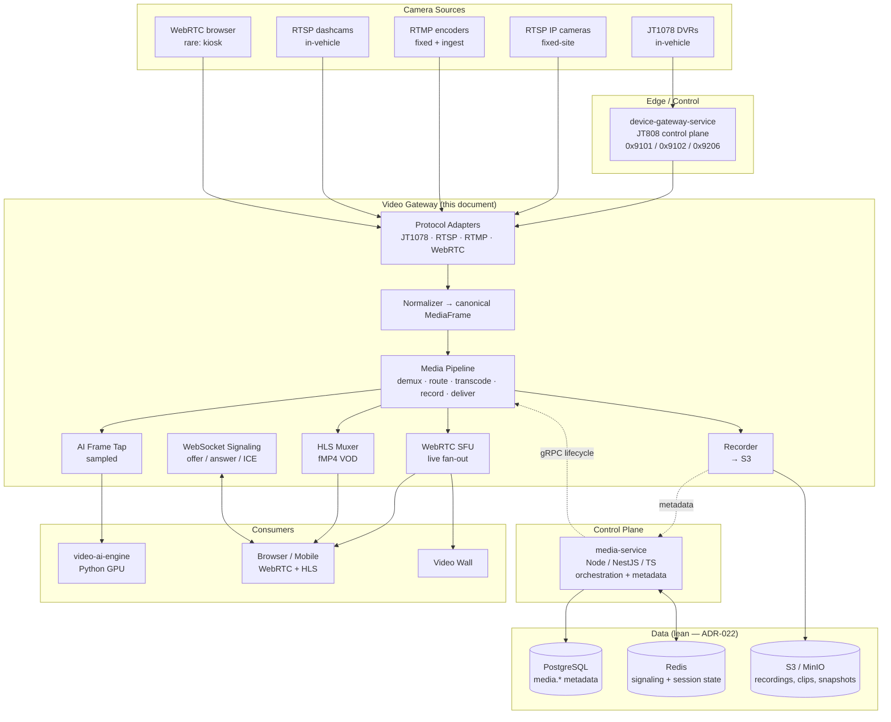

### 1.4 Service Inventory (Media & Video context)

| # | Service | Runtime | Role | ADR |
|---|---|---|---|---|
| 10 | `media-service` | **Node.js LTS + NestJS + TS** | Control plane: orchestration, metadata, REST/gRPC API, signaling relay, recording policy | ADR-021 |
| 11 | `media-streamer` (the Video Gateway / media-router) | specialized media component (Pion/MediaMTX in Go, or mediasoup) | Data plane: ingest, demux, transcode, SFU, record, HLS — the subject of this document | ADR-021 §5 (infra-class) |
| 12 | `video-ai-engine` | **Python 3.12** (GPU) | CV inference (FCW, distraction, intrusion) — the ML exception | ADR-021 §2.2 |

> **Why three services, not one (splitting forces — `01` §3.2).** (1) **Polyglot**: the AI tier is Python for CV/ML (BG-4); the media-router is real-time media software (infra-class); the orchestrator is Node platform code. (2) **Independent scaling**: ingest/SFU scales with channel count; transcode scales with GPU; AI scales with Kafka lag; the orchestrator scales with API RPS. (3) **Distinct lifecycle**: media-router and AI release on model/codec cadences decoupled from platform cadence.

### 1.5 Latency & Throughput Budgets (`docs/modules/VideoPlatform.md` §1.3)

| Path | Budget | Mechanism |
|---|---|---|
| Glass-to-glass live (sensor → eye) | < 1s P95 | WebRTC over UDP; SFU forwarding |
| Signaling (WebSocket offer/answer) | < 200ms P99 | media-service WS relay |
| Playback start (HLS) | < 2s P95 | fMP4 + signed byte-range |
| AI inference (frame → alert) | < 500ms | on-edge preferred; cloud retroactive |
| Recording clip finalize (event) | < 30s after trigger | async; off critical path |
| Continuous segment close | 60s | fMP4 segments |
| Camera drop detection | < 60s | RTSP keepalive / JT808 heartbeat |

### 1.6 Design Principles

1. **Pull-from-edge, demand-driven.** A camera streams only when a viewer/recorder/AI is active — never always-on cloud ingest (the dominant cost control, `docs/modules/VideoPlatform.md` §2.3).
2. **Normalize at the edge, route one frame format.** Protocol specifics die at the adapter; downstream consumers see one canonical `MediaFrame`.
3. **SFU over mesh/MCU.** One publisher → many viewers; the router forwards RTP, no decode when codec passthrough.
4. **Transcode only when forced.** Passthrough is the default; H.265→H.264 only for WebRTC live; never transcode for recording.
5. **Metadata in PostgreSQL, bytes in S3.** Never blob video in a relational store (`03` §1.1).
6. **Evidence integrity by construction.** Every clip hash-chained (INV-MED01); recorder never drops frames (buffers to local disk on S3 back-pressure).
7. **Stateless service, stateful per-stream sessions.** Pod restart reconnects streams; session state in Redis + on the router.

---

## 2. Video Stream Architecture

The stream architecture defines the **shapes a stream can take** from camera to consumer, and which transport carries each leg. One camera channel can simultaneously feed multiple shapes (a live WebRTC viewer + a continuous recording + an AI tap) from a **single source pull**.

### 2.1 The Five Transports

| Transport | Leg | Direction | Latency | Use |
|---|---|---|---|---|
| **JT1078** (RTP-over-TCP) | camera → gateway | push (after JT808 0x9101) | low | Chinese in-vehicle DVR media plane |
| **RTSP / RTP** | camera → gateway | pull (gateway → camera) | low | universal fixed-site + RTSP dashcam ingest |
| **RTMP** | encoder → gateway | push | low | encoders, OBS, restream ingest |
| **WebRTC** (SRTP/DTLS over UDP) | gateway → viewer | push (SFU fan-out) | **< 1s** | browser/mobile live view |
| **WebSocket** (WSS) | viewer ↔ media-service | bidirectional | < 200ms | **signaling only** (offer/answer/ICE) + control |

> **WebSocket is signaling, not media.** A common confusion: WebSocket does **not** carry video. It carries the WebRTC offer/answer/ICE-candidate exchange and control commands (subscribe, quality-change, PTZ). The actual video/audio RTP flow travels over WebRTC (UDP/SRTP). HLS VOD travels over HTTPS. This separation keeps the signaling path cheap and the media path low-latency (`docs/modules/VideoPlatform.md` §11).

### 2.2 Stream Shapes

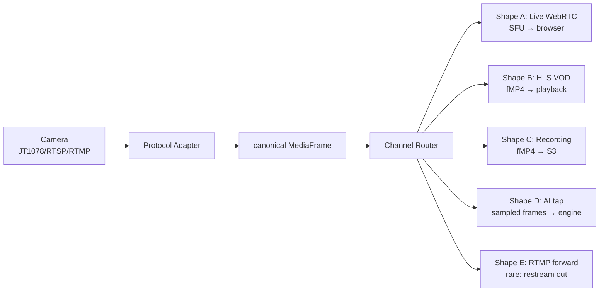

| Shape | Built by | Delivered via | When active |
|---|---|---|---|
| **A — Live WebRTC** | SFU | WebRTC (UDP/SRTP) | a viewer is subscribed |
| **B — HLS VOD** | HLS muxer | HLS (HTTPS byte-range) | playback requested |
| **C — Recording** | Recorder | S3 fMP4 | recording policy active |
| **D — AI tap** | AI frame tap | Kafka / shared frame buffer | AI session active |
| **E — RTMP forward** | RTMP publisher | RTMP push out | explicit restream config (rare) |

### 2.3 Lazy Activation (cost control)

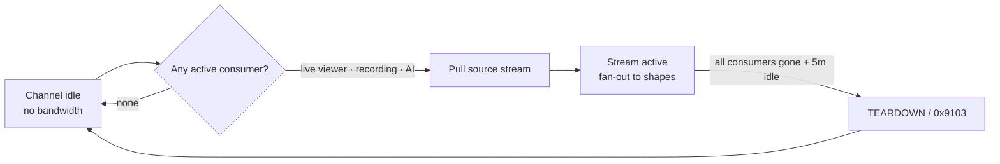

A channel with no viewers, no recording, and no AI session spends **zero** bandwidth. This is the single most important cost lever at PB scale (`docs/modules/VideoPlatform.md` §2.3).

### 2.4 The Canonical MediaFrame

All protocols normalize to one internal representation before routing. Downstream consumers never see JT1078/RTSP/RTMP specifics.

```typescript
// canonical internal frame (TS shape; media-router consumes)
interface MediaFrame {
  channelId:    string;            // resolves to VideoChannel
  streamType:   'H264' | 'H265' | 'AAC' | 'OPUS' | 'G711' | 'G726';
  kind:         'video' | 'audio';
  payload:      Buffer;            // NALU (video) or audio frame
  isKeyframe:   boolean;
  timestamp:    number;            // RTP timestamp (normalized to UTC)
  wallClock:    Date;              // capture time (from BCD/device clock)
  sourceMeta:   { protocol: 'JT1078'|'RTSP'|'RTMP'|'WebRTC'; logicalChannel?: number; alarmFlag?: boolean };
  seq:          number;
}
```

JT1078's 8-byte BCD timestamp (Beijing time, UTC+8) is normalized to UTC at the adapter — downstream never deals with timezone artifacts.

---

## 3. Device Connection & Protocol Adapters

The protocol adapter layer is the only place that knows vendor formats — the same Clean Architecture seam as the Device Gateway's adapters (`06` §9). Each adapter implements one `ProtocolAdapter` interface; the router/pipeline operates purely on `MediaFrame`.

### 3.1 Protocol Matrix

| Protocol | Direction | Source | Transport | Auth | Use |
|---|---|---|---|---|---|
| **JT1078** | push (after hand-off) | Chinese in-vehicle DVRs | RTP-over-TCP | inherits JT808 session | in-vehicle A/V (dominant China) |
| **RTSP** (RFC 7826) | pull | IP cameras, NVRs, dashcams | RTP/UDP or interleaved TCP | digest/basic creds | universal fixed-site ingest |
| **RTMP** | push | encoders, OBS, restream | TCP | stream-key → channel | ingest + rare restream-out |
| **WebRTC** (ingest) | push | browser webcam (rare) | SRTP/UDP | signaling-issued token | remote inspection / two-way audio |
| **WebSocket** | bidirectional | browser/media-service | WSS | platform JWT | **signaling + control** (no media) |

### 3.2 The ProtocolAdapter Interface

```typescript
// domain/adapter/protocol-adapter.ts — every adapter implements this
export interface ProtocolAdapter {
  readonly protocol: 'JT1078' | 'RTSP' | 'RTMP' | 'WebRTC';
  open(channel: VideoChannel, mode: StreamMode): Promise<MediaSource>;
  close(source: MediaSource): Promise<void>;
  health(source: MediaSource): SourceHealth;
}
// adapters: Jt1078Adapter, RtspAdapter, RtmpAdapter, WebRtcIngestAdapter
// (registered in a ProtocolRegistry; selected by channel.protocol)
```

### 3.3 RTSP Adapter

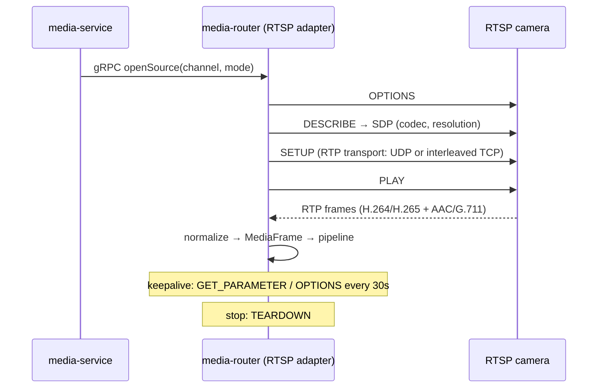

- **RTP transport**: interleaved TCP when firewall traversal is needed; UDP for latency.
- **Keepalive** (every 30s) detects camera drop → state `DEGRADED` → retry backoff (1s, 2s, 5s, 10s) → notify after 3 fails.

### 3.4 RTMP Adapter

```
rtmp://media.fleetvision.example/live/{streamKey}
```

- `media-router` authenticates `streamKey` → resolves to a `VideoChannel`.
- Common for IP-camera encoders, OBS, and restream services; also used to publish onward to a partner RTMP destination (rare, opt-in — Shape E).
- On publish, the adapter demuxes FLV → NALUs/AAC → `MediaFrame`.

### 3.5 JT1078 Adapter (In-Vehicle A/V)

JT1078 is the **companion media plane** to JT808 (the control channel), terminated by `device-gateway-service` (`06` §2). The Video Gateway's JT1078 adapter receives the RTP-over-TCP media flow that the device-gateway's JT808 `0x9101` command instructed the DVR to open.

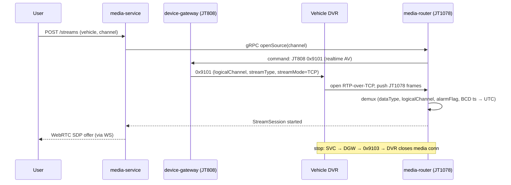

**JT1078 frame anatomy**: start `0x30 0x31` + length + seq + BCD SIM + logical channel + alarm flag + sample count + **8-byte BCD timestamp (Beijing time → normalized to UTC)** + last-frame flag + data type (0=video/1=audio) + stream type (98=H.264 / 99=H.265 / 100=AAC) + body.

### 3.6 WebRTC Ingest Adapter (rare)

For the uncommon case of a browser-side camera (driver kiosk, remote inspection, two-way audio): the browser publishes via WebRTC; the gateway acts as SFU subscriber. The signaling (`offer`/`answer`/ICE) flows over the WebSocket signaling path (§3.7). This is opt-in and rare.

### 3.7 WebSocket Signaling Channel

| Concern | Decision |
|---|---|
| Endpoint | `wss://…/ws/media` (Socket.IO per ADR-015) |
| Auth | platform JWT + per-stream `signalingToken` (5-min TTL, Redis-cached) |
| Messages | `stream.subscribe`, `stream.offer`, `stream.answer`, `ice.candidate`, `stream.quality`, `stream.unsubscribe`, `ptz.command` |
| Carries media? | **No.** Signaling + control only. Media flows over WebRTC (UDP/SRTP). |
| Multi-pod | Socket.IO Redis adapter (any pod serves any client) |

The media-router rejects any WebRTC negotiation whose `streamSessionId` was not issued by `media-service` — signaling tokens are unforgeable proof of authorization (`docs/modules/VideoPlatform.md` §12.1).

### 3.8 Connection Lifecycle

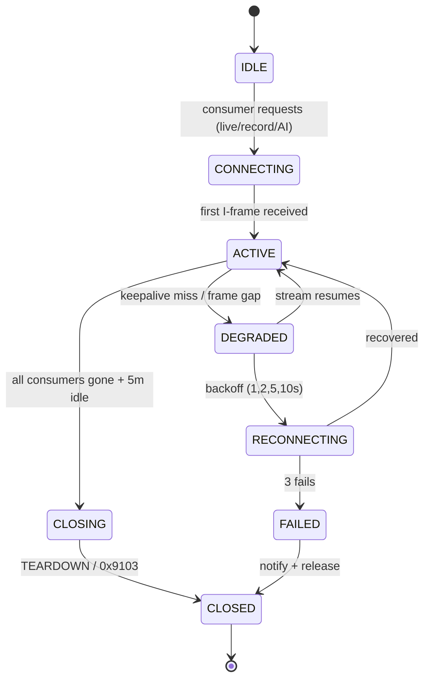

---

## 4. Media Pipeline

The pipeline is the contract between the adapter layer and the delivery/storage/AI layers. Each stage consumes `MediaFrame`s, decides what to do, and never blocks the hot path on slow consumers.

### 4.1 Pipeline Stages

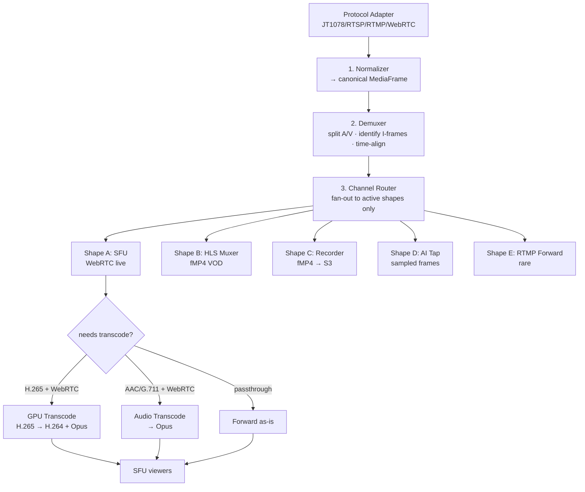

### 4.2 Stage Contract

| Stage | Input | Output | Sync? | Failure Handling |
|---|---|---|---|---|
| 1. Normalizer | protocol-specific frame | `MediaFrame` | sync | drop + metric on malformed |
| 2. Demuxer | `MediaFrame` stream | separated A/V, aligned PTS | sync | drop frame (keep stream) |
| 3. Channel Router | aligned frames | per-shape subscription fan-out | sync | skip inactive shapes |
| 4. SFU | video+audio (post-transcode) | RTP to viewers | sync | drop slow viewer |
| 5. HLS muxer | video+audio | fMP4 segments + manifest | async | back-pressure buffer |
| 6. Recorder | video+audio (raw, pre-transcode) | fMP4 → S3 + metadata | async | **buffer to local disk**; never drop (evidentiary) |
| 7. AI tap | sampled frames | frame buffer / Kafka | async | drop (best-effort) |

### 4.3 Pipeline Invariants

1. **One source pull, many shapes.** The router opens the camera once and fans out — never one pull per viewer.
2. **Recording gets raw, pre-transcode frames.** Transcoding is a delivery concern; recordings stay in the camera's native codec (H.265 if captured H.265) to preserve quality and save compute.
3. **The recorder never drops frames.** On S3 back-pressure it buffers to local disk and flushes when able — evidence integrity (INV-MED01) outranks latency.
4. **Slow consumers are shed, not the source.** A viewer whose RTCP reports can't keep up is dropped; the stream and other viewers are unaffected.
5. **Transcode is opt-in per shape.** Passthrough is the default; only the SFU shape may transcode (H.265→H.264 / AAC→Opus), and only when a browser viewer needs it.

---

## 5. Channel & Stream Management

Two distinct lifecycles: **Channel** (the camera — long-lived, registered) and **Stream/StreamSession** (a single consumer's view — short-lived, opened/closed). Confusing them is the most common建模错误 in video platforms.

### 5.1 Channel (the camera) — `VideoChannel` aggregate

Owned by `media-service` (`02` §3.2 VideoChannel). A channel is a **registered camera** — its endpoint, codec, capabilities, and ownership (site or vehicle). Long-lived; created at provisioning, decommissioned at removal.

| Attribute | Example | Notes |
|---|---|---|
| `channelId` | UUID | aggregate id |
| `tenantId` | UUID | RLS / S3 prefix |
| `siteId` / `vehicleId` | UUID | exactly one (a camera is fixed-site OR in-vehicle, never both) |
| `label` | "Forward (road)" | UI |
| `logicalChannel` | 1 | JT1078 logical channel |
| `protocol` | JT1078 / RTSP / RTMP | selects adapter |
| `endpoint` | rtsp://… / stream-key | connection target |
| `codec` | H.264 / H.265 | ingest codec |
| `capabilities` | JSONB | PTZ, audio, resolution, IR, on-device AI |
| `status` | ONLINE / DEGRADED / OFFLINE | live health |

### 5.2 StreamSession (a consumer's view) — `StreamSession` aggregate

Owned by `media-service` (`02` §3.2 StreamSession, event-sourced). A **transient session** representing one consumer's (or one recording's) use of a channel. Short-lived; opened on demand, closed on idle/leave.

| Attribute | Example | Notes |
|---|---|---|
| `sessionId` | UUID | aggregate id |
| `channelId` | UUID | the source channel |
| `mode` | LIVE / PLAYBACK / RECORD / AI | the active shape |
| `quality` | auto / 1080p / 720p / 360p | simulcast layer |
| `state` | CONNECTING / ACTIVE / DEGRADED / CLOSED | lifecycle |
| `streamerPod` | pod name | for affinity / drain |
| `viewerCount` | int | SFU fan-out |
| `started_at` / `ended_at` | ts | billing / audit |

### 5.3 Lifecycle Separation

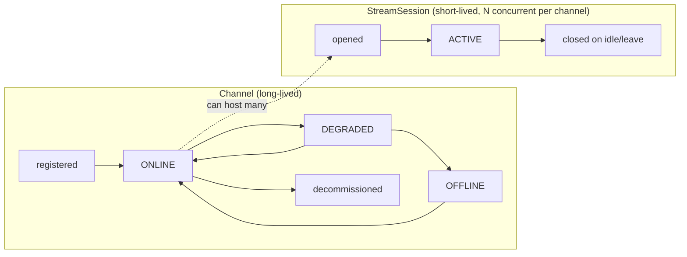

A channel in `ONLINE` state can host **zero to many** concurrent StreamSessions (a live viewer + a recording + an AI tap simultaneously). When all sessions close, the channel stays registered but stops pulling bandwidth (lazy activation, §2.3).

### 5.4 Session Orchestration (media-service ↔ media-router)

`media-service` is the control plane; `media-router` is the data plane. The orchestrator tells the router *what to do*; the router does the heavy lifting and reports state back.

| Control call (gRPC) | Direction | Purpose |
|---|---|---|
| `CreateStreamSession` | SVC → router | open source, return SDP offer |
| `CompleteNegotiation` | SVC → router | viewer's SDP answer + ICE |
| `SubscribeViewer` | SVC → router | add a viewer to an active SFU track |
| `EndStreamSession` | SVC → router | close source + release |
| `RecordChannel` | SVC → router | start/stop recorder |
| `ChangeQuality` | SVC → router | switch simulcast layer |
| `PtzCommand` | SVC → router | PTZ (translate to camera protocol) |
| `SegmentWritten` | router → SVC | recorder closed a segment (metadata) |
| `SourceHealth` | router → SVC | periodic health (or on change) |

---

## 6. Codec & Transcoding Strategy

Codec policy is owned by `docs/modules/VideoPlatform.md` §5 (the *what*). This section is the gateway's *execution* of that policy: where transcoding happens, when, on what hardware, and how it is avoided when possible.

### 6.1 Codec Support Matrix

| Codec | Live (WebRTC) | VOD (HLS) | Recording | Action |
|---|---|---|---|---|
| **H.264 (AVC)** | ✅ native | ✅ native | ✅ | passthrough (preferred) |
| **H.265 (HEVC)** | ❌ (browsers uneven) | ✅ (Safari; HLS) | ✅ | **transcode → H.264** for WebRTC only |
| **AAC** audio | ❌ (WebRTC needs Opus) | ✅ | ✅ | transcode → Opus for WebRTC |
| **Opus** audio | ✅ native | ✅ | ✅ | passthrough |
| **G.711 / G.726** | ❌ | partial | ✅ | transcode → Opus |

### 6.2 Why H.265 Anyway?

H.265 is ~40% smaller than H.264 at equal quality — significant for **recording storage** (PB scale) and **cellular ingest** from vehicles. The gateway **ingests H.265** (recordings + HLS for Safari benefit) and **transcodes H.265 → H.264 only** when a browser live view needs WebRTC. Transcoding is a live-view-path concern, **never** a recording concern.

### 6.3 Transcode Decision Tree

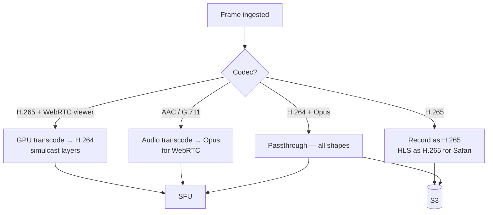

### 6.4 Transcoding Hardware

| Method | When | Hardware | Capacity |
|---|---|---|---|
| **Passthrough** (no transcode) | camera codec is WebRTC-compatible | none | unlimited |
| **GPU transcode** | H.265 cameras; simulcast generation | NVIDIA NVENC (T4 / L4) | ~30 streams/T4, ~60/L4 |
| **CPU transcode** | low-volume / non-GPU regions | x264 software | low (fallback) |

Codec need is advertised per channel so the scheduler places transcode sessions on GPU-tolerated pods. CPU `media-router` pods handle ingest/routing/SFU/record; GPU pods handle transcode (tainted/tolerated).

### 6.5 Simulcast (Adaptive Bitrate)

For live view, the gateway publishes **multiple spatial layers** (1080p / 720p / 360p) from one transcode. Each viewer receives the layer matching their bandwidth/screen — mobile cellular gets 360p, ops-center wall gets 1080p — from the **same source pull**. The SFU switches layers per-viewer without re-pulling the camera.

| Quality | Resolution | Bitrate | Use |
|---|---|---|---|
| `auto` | adaptive (simulcast) | 0.5–3 Mbps | default |
| `high` | 1080p | 3–4 Mbps | investigation |
| `medium` | 720p | 1.5 Mbps | dispatcher desk |
| `low` | 360p | 0.5 Mbps | mobile cellular / wall thumbnails |
| `audio-only` | — | 32 kbps | low-bandwidth |

---

## 7. Recording & Storage Strategy

### 7.1 Recording Modes (policy from `docs/modules/VideoPlatform.md` §6)

| Mode | Trigger | Duration | Storage Class |
|---|---|---|---|
| **Continuous** | schedule (24/7 or business hours) | full window | S3 Standard → IA → Glacier |
| **Event clip** | behavior/alarm event | 8–30s (pre+post buffer) | S3 Standard |
| **On-demand** | user "record now" | until stopped | S3 Standard |
| **Snapshot** | user/schedule JPEG | instant | S3 Standard |

### 7.2 Recording Strategy (gateway execution)

The recorder is a pipeline shape (§4.2 stage 6) that consumes **raw, pre-transcode** frames. Event clips use a **rolling ring buffer** (~10s) so the moments *before* a trigger are captured.

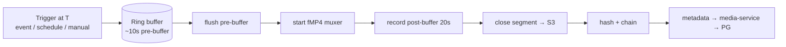

| Trigger source | Event | Action |
|---|---|---|
| GPS Engine | `tracking.behavior.event.v1`, `tracking.speed.exceeded.v1` | 30s clip around event |
| GPS Engine | `tracking.geofence.entered.v1` (high-value POI) | per policy |
| Compliance | `compliance.incident.reported.v1` | extended clip + linkage |
| AI engine | `media.ai.alert.v1` | 30s clip + AI metadata |
| Manual | user click / driver press | 60s clip |

### 7.3 Storage Strategy (lean — ADR-022)

**Metadata in PostgreSQL, bytes in S3** — the strict split. Video is the platform's largest-by-volume data class; the strategy is **tier, compress, expire aggressively** (`docs/modules/VideoPlatform.md` §7).

```mermaid
flowchart LR
    REC[Recorder] -->|fMP4 segments| S3[(S3 / MinIO)]
    REC -.metadata on segment close.-> MSVC[media-service]
    MSVC --> PG[(PostgreSQL media.*)<br/>video_channels · video_clips<br/>video_segments · stream_sessions]
    MSVC --> R[(Redis<br/>session state, signed URLs)]
    MSVC --> K[(Kafka<br/>media.recording.* events)]
    K --> VAI[video-ai-engine]
    K --> NT[notification-service]
```

#### S3 buckets & lifecycle

| Bucket | Contents | Lifecycle |
|---|---|---|
| `fv-recordings` | continuous segments | Standard 7d → IA 23d → Glacier 1y → expire |
| `fv-clips` | event clips | Standard 30d → IA 60d → Glacier 1y → expire |
| `fv-snapshots` | JPEG thumbnails | Standard 90d → Glacier 1y → expire |
| `fv-exports` | downloadable MP4 (watermarked) | Standard 7d → expire |

Object keys are prefix-partitioned by tenant + date for scan parallelism + lifecycle rule application:

```
s3://fv-recordings/tenant={tenantId}/site={siteId}/cam={channelId}/dt={yyyyMMdd}/{startTs}.mp4
s3://fv-clips/      tenant={tenantId}/trigger={type}/{clipId}.mp4
s3://fv-snapshots/  tenant={tenantId}/cam={channelId}/{yyyyMMddHHmm}.jpg
s3://fv-exports/    tenant={tenantId}/user={userId}/{exportId}.mp4
```

#### PostgreSQL metadata (`media` schema — `03` §6 / `docs/modules/VideoPlatform.md` §7.4)

| Table | Role |
|---|---|
| `media.video_channels` | camera registry (fixed + vehicle) |
| `media.video_clips` | recording/clip metadata (hash-chained) |
| `media.video_segments` | sub-segments for streaming/seek |
| `media.stream_sessions` | live/playback sessions (daily partition — high churn) |
| `media.ai_alerts` | AI detection events |

### 7.4 Evidence Integrity (INV-MED01)

Every recorded clip is **hash-chained** for evidentiary admissibility — mirrors the HOSLog hash chain (`02` §9.2):

```
clip.sha256  = SHA256(clip.bytes)
clip.prevHash = previousClipForChannel.sha256     // chain
clip.signedBy = media-service key (Vault)          // tamper-evident
```

Stored in `media.video_clips.hash_sha256` + `prev_hash`. Any post-hoc modification breaks the chain → tamper-evident. The recorder **never drops frames** — on S3 back-pressure it buffers to local disk and flushes when able.

### 7.5 Cost Controls

| Lever | Mechanism |
|---|---|
| Demand-driven ingest | never stream unless viewed/recording (§2.3) |
| H.265 ingest | ~40% smaller recordings; transcode only on WebRTC live path |
| Resolution caps | default 720p continuous, 1080p event clips |
| Tiered retention | S3 lifecycle (above) |
| Per-tenant quotas | storage GB/month + concurrent streams |
| Region-local egress | media-router pod near camera network → egress stays in-region |
| Event-only default | most tiers record only on event; continuous = Enterprise opt-in |

---

## 8. Features — Live, Snapshot, Audio, Multi-Camera

### 8.1 Live Streaming

The headline feature. Browser/mobile opens a live view → WebRTC SFU delivers RTP with < 1s glass-to-glass latency. Detailed in §10.1 and `docs/modules/VideoPlatform.md` §11.

| Aspect | Decision |
|---|---|
| Transport | WebRTC (UDP/SRTP) via SFU |
| Fan-out | one publisher → many viewers (up to ~500/stream) |
| Latency | < 1s P95 glass-to-glass |
| Idle close | auto-close after 5 min no browser activity |
| Quota | per-tenant concurrent-live (50 Pro / 500 Enterprise) |

### 8.2 Snapshot

On-demand or scheduled JPEG capture from a channel — used for thumbnails, alerts, and the timeline. The gateway decodes a single I-frame and encodes JPEG.

| Trigger | Source |
|---|---|
| User "snapshot" button | REST `POST /channels/{id}/snapshot` |
| Schedule | cron (e.g., every 5 min during business hours) |
| Event | AI alert / behavior event (clip thumbnail) |

Output: JPEG → S3 (`fv-snapshots`), metadata → `media.video_clips` (trigger=snapshot) or linked to the originating event. Event: `media.snapshot.taken.v1`.

### 8.3 Audio

| Path | Codec | Notes |
|---|---|---|
| Camera → gateway | AAC / G.711 / G.726 (camera-native) | ingested as-is |
| Gateway → WebRTC viewer | Opus (transcoded if needed) | WebRTC requires Opus |
| Gateway → recording | camera-native (AAC/G.711) | preserved with video |
| Two-way audio (rare) | Opus both directions | WebRTC ingest adapter (§3.6) |

**Privacy**: fixed-site audio recording is **off by default** (jurisdiction-dependent one-party/two-party consent — INV-MED02). Driver-facing audio is safety-only and not persisted unless an alert is raised.

### 8.4 Multi-Camera

A site or vehicle with N cameras shown simultaneously in a tiled view, or a **video wall** of many cameras/sites in a control room (`docs/modules/VideoPlatform.md` §10).

| Surface | Tiles | Bandwidth strategy |
|---|---|---|
| Multi-camera (single site/vehicle) | 4–9 default | independent WebRTC sessions per tile |
| Video wall (ops center) | up to 16 (4×4) | simulcast low-layer (360p) for tiles; high-layer on spotlight |
| Cellular wall | capped at 4 | detect connection; cap tiles/quality |

**Alert-driven pop-in**: when an AI/event alert fires for a wall-monitored source, the tile highlights (red border) + audio chime + optional auto-spotlight. This makes the wall an **active monitoring** tool, not passive viewing.

| Wall mechanism | Implementation |
|---|---|
| Layout service | `VideoWallLayout` (saved per tenant) — tiles + refresh policy |
| Rotation | non-active tiles round-robin 30s to bound bandwidth |
| Spotlight | one big tile + thumbnails; auto-promote on alert for X seconds |
| Bandwidth | 16 × 720p ≈ 24 Mbps (wired fine); cellular uses 360p + 4-tile cap |

---

## 9. Performance — Thousands of Streams, Load Balancing, Media Server Architecture

### 9.1 The Performance Problem

A single 1080p H.264 stream is ~2–4 Mbps; 1,000 concurrent live views = 2–4 Gbps egress. The platform must sustain **thousands of concurrent channels** (ingest + record + SFU) on a cluster, with sub-second latency, **demand-driven** so idle cameras cost nothing. Three concerns dominate: **per-pod capacity**, **load balancing**, and **media-server topology**.

### 9.2 Media Server Architecture (per-pod)

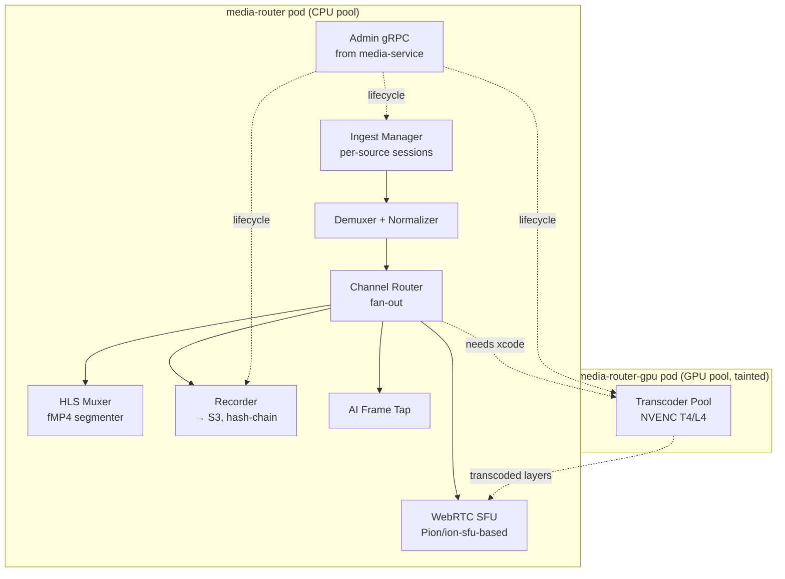

| Component | Per-pod capacity | Notes |
|---|---|---|
| Ingest / channel router | ~2,000 concurrent channels | CPU-bound on demux/route |
| WebRTC SFU (passthrough) | ~500 viewers/stream, ~5,000/pod | RTP forwarding, no decode |
| Recorder | ~200 segments/sec | batched S3 puts |
| GPU transcode | ~30 streams (T4) / ~60 (L4) | NVENC; queue or fall back to x264 on saturation |

### 9.3 Load Balancing Streams

Stream routing is **stateful** — once a channel's source pull and SFU track live on a pod, that channel's viewers must land on the same pod (or a pod that can subscribe to the SFU track). The platform uses **consistent hashing by `channelId`** plus a **session-affinity registry** in Redis.

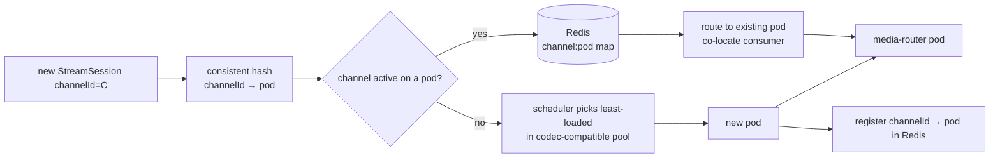

| Concern | Strategy |
|---|---|
| Channel → pod affinity | consistent hash on `channelId`; Redis registry `media:channel:<id>:pod` |
| Codec placement | transcode-needed channels → GPU-tolerated pods |
| Viewer fan-out | subsequent viewers on the same pod (or cross-pod SFU subscribe) |
| Pod drain (upgrade) | PDB minAvailable 2; graceful session migration (re-pull on cooperating pod) |
| Overload | HPA on `media_channels_active` + CPU; KEDA on Kafka AI lag |

### 9.4 Scaling to Thousands of Streams

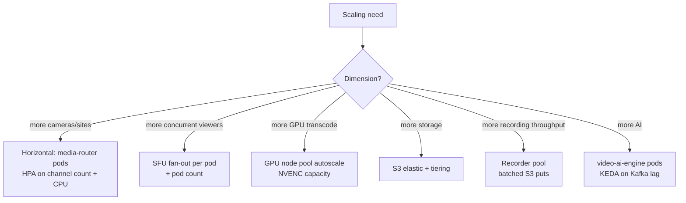

| Workload | Per pod | Year-5 cluster |
|---|---|---|
| Concurrent channels (live+record) | ~2,000 | ~1M+ channels (mixed) |
| Concurrent WebRTC viewers | ~5,000 | — |
| GPU transcode streams | ~30 (T4) / ~60 (L4) | GPU node pool autoscale |
| Recording segments/sec | ~200 | — |

### 9.5 Performance Budgets

| Path | Budget | Mechanism |
|---|---|---|
| Glass-to-glass live | < 1s P95 | WebRTC SFU forwarding |
| Signaling round-trip | < 200ms P99 | WS relay via media-service |
| New stream setup | < 500ms | SDP offer on first I-frame |
| Recorder segment close | 60s | fMP4 segment |
| 2× headroom | always | vision guardrail; chaos tests quarterly |

### 9.6 Bandwidth Management (the dominant cost)

| Lever | Savings |
|---|---|
| Demand-driven ingest | eliminates always-on cloud ingress |
| Simulcast low-layer for wall/mobile | egress |
| Region-local media-router pods | egress stays in-region |
| H.265 ingest + record | ~40% storage/egress |
| Event-only default tier | most cameras record only on event |
| Idle auto-close (5 min) | releases bandwidth when no one watches |
| Per-tenant concurrent-stream quotas | noisy-tenant containment |

---

## 10. Sequence Diagrams

### 10.1 Live View — WebRTC (full handshake)

```mermaid
sequenceDiagram
    autonumber
    participant U as Browser
    participant SVC as media-service (WS)
    participant R as Redis
    participant MR as media-router (SFU)
    participant CAM as Camera
    U->>SVC: POST /streams (channelId, quality)
    SVC->>SVC: authorize (media.video.live)
    SVC->>R: check channelId → pod (affinity)
    SVC->>MR: gRPC CreateStreamSession(channel, ttl)
    alt source not active
        MR->>CAM: open source (RTSP/RTMP/JT1078 via 0x9101)
        CAM-->>MR: RTP frames (first I-frame)
        MR->>MR: demux → route → (transcode if H.265)
    end
    MR-->>SVC: SDP offer + ICE candidates
    SVC->>R: SETEX signalingToken (5m)
    SVC-->>U: WS stream.offer + signalingToken
    U->>U: RTCPeerConnection.setRemoteDescription(offer)
    U-->>SVC: WS stream.answer
    SVC->>MR: gRPC CompleteNegotiation(answer)
    loop trickle ICE
        U & MR->>SVC: WS ice.candidate (relay)
    end
    MR->>U: DTLS-SRTP handshake (UDP/TURN)
    MR-->>U: RTP video/audio flows → LIVE (< 1s)
    Note over U: idle 5m → auto-close; quota enforced
```

### 10.2 JT1078 Ingest (in-vehicle)

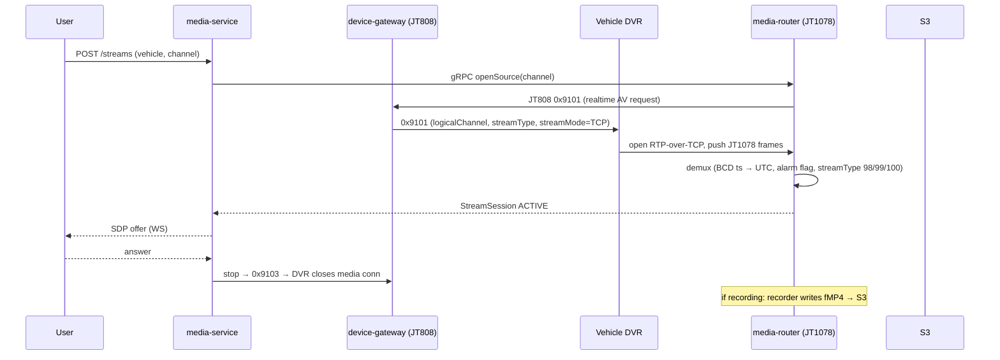

### 10.3 Event-Triggered Recording

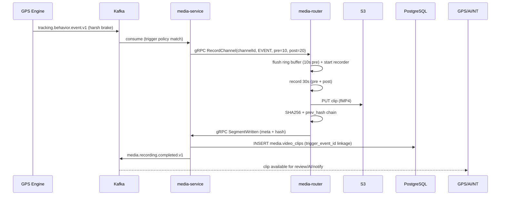

### 10.4 HLS Playback (VOD)

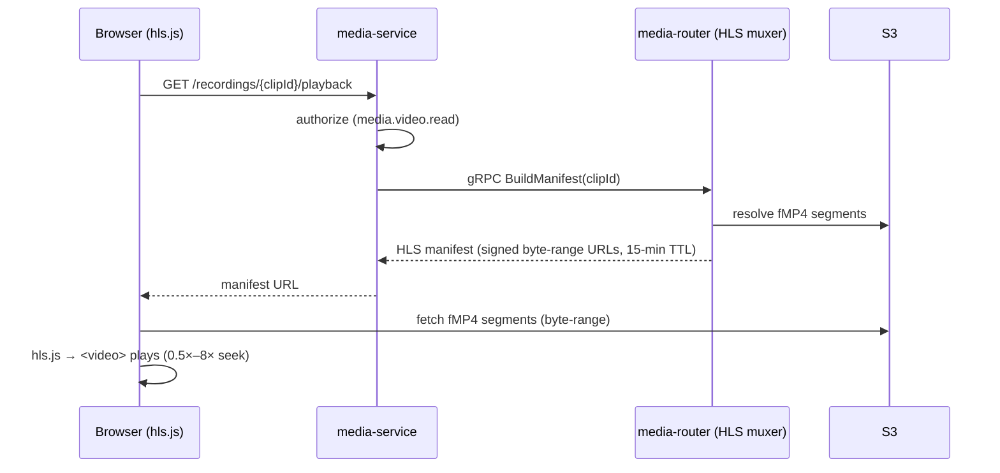

---

## 11. Data Flow Diagrams

### 11.1 Video Architecture Diagram (consolidated)

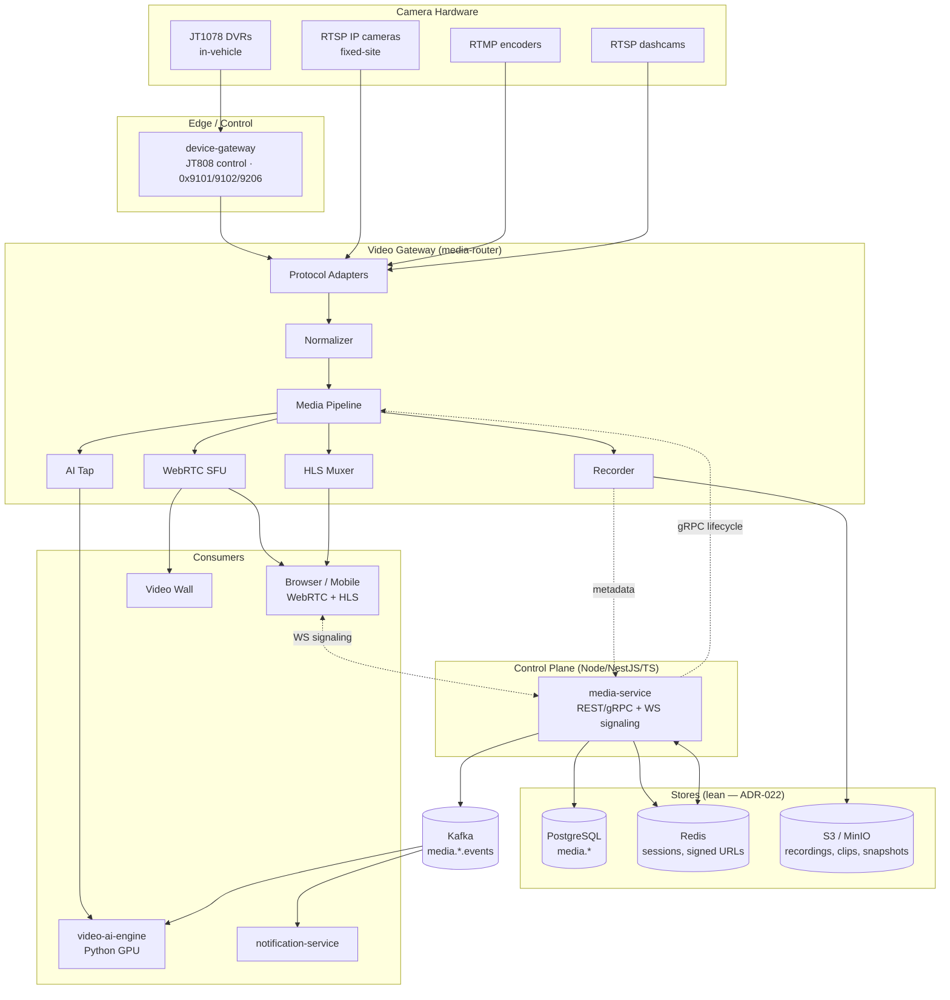

### 11.2 Data Flow — Ingest → Multi-Shape Delivery

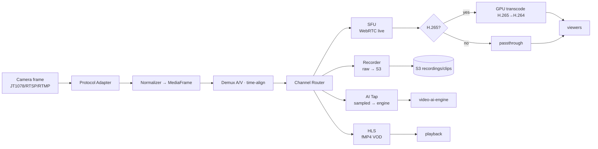

### 11.3 Data Flow — Recording → Evidence + AI

```mermaid
flowchart LR
    REC[Recorder segment close] --> S3[(S3 fMP4)]
    REC --> HASH[hash + chain]
    HASH --> SVC[media-service]
    SVC --> PG[(PG media.video_clips<br/>hash_sha256, prev_hash)]
    SVC --> K[(Kafka<br/>media.recording.completed.v1)]
    K --> VAI[video-ai-engine<br/>pull clip → infer]
    VAI --> K2[(Kafka<br/>media.ai.alert.v1)]
    K2 --> SVC2[media-service → media.ai_alerts]
    K2 --> NT[notification-service]
    K2 --> UI[WebSocket push real-time]
    K --> NT2[notification<br/>clip available]
```

### 11.4 Data Flow — Control Plane ↔ Data Plane

```mermaid
flowchart LR
    UI[Browser/Mobile] -->|REST /streams| MSVC[media-service<br/>Node/NestJS/TS]
    UI <-.WSS signaling.-> MSVC
    MSVC -->|gRPC CreateStreamSession| MR[media-router]
    MR -->|gRPC SourceHealth / SegmentWritten| MSVC
    MSVC --> R[(Redis<br/>channel:pod, signalingToken)]
    MSVC --> PG[(PostgreSQL<br/>stream_sessions, video_clips)]
    MR --> S3[(S3)]
    MSVC --> K[(Kafka<br/>media.*.events)]
```

---

## 12. Scaling & Failure Modes

### 12.1 Kubernetes Topology

```mermaid
graph TB
    subgraph K8S["Kubernetes (media namespace)"]
        MR[media-router Deployment<br/>CPU pool<br/>HPA: channel count + CPU<br/>PDB minAvailable 2]
        MRG[media-router-gpu Deployment<br/>tainted: nvidia.com/gpu<br/>HPA: NVENC capacity]
        SVC[media-service Deployment<br/>Node/NestJS/TS<br/>HPA: RPS]
        VAI[video-ai-engine Deployment<br/>GPU node pool<br/>KEDA: Kafka lag]
        WSSVC[Socket.IO WS<br/>Node + Redis adapter]
    end
    MR -.needs GPU.-> MRG
    SVC -.gRPC.-> MR
    WSSVC -.reads.-> R[(Redis)]
```

- **media-router** (CPU): ingest, demux, route, SFU (passthrough), HLS, recorder.
- **media-router-gpu** (GPU, tainted): H.265 transcode, simulcast. Sessions routed by codec need.
- **KEDA triggers**: `media_channels_active > 70%`, NVENC > 70%, Kafka AI lag > 1K.
- **PDB** minAvailable 2 — stateful SFU sessions need graceful drain.

### 12.2 Failure Modes & Auto-Response

| Failure | Detection | Response |
|---|---|---|
| media-router pod crash | liveness | restart; SFU sessions reconnect; viewers auto-reconnect |
| Camera drop | RTSP keepalive / JT808 heartbeat | DEGRADED → retry backoff (1,2,5,10s) → notify |
| S3 write slow | producer back-pressure | recorder buffers to local disk; flush when able; **never drop frames** (evidentiary) |
| Kafka slow | publish-lag | back-pressure; defer AI rollups; live path never shed |
| GPU saturation | NVENC util | sessions queue or fall back to CPU x264 (slower) |
| Redis (signaling) down | circuit breaker | degrade; new streams can't open; existing continue |
| Signaling token forgery | router rejects unknown sessionId | drop negotiation; alert security |
| TURN server unreachable | health check | fall back to host candidates (best-effort); alert |

### 12.3 Geographic / Data-Residency

EU cameras + viewers terminate in `eu-west-1` (GDPR); media-router pods are region-local; recordings never cross region except via explicit export. China region uses Amap/Baidu for map overlays; video stays on-platform (`docs/modules/VideoPlatform.md` §14.4).

### 12.4 Capacity Headroom

2× headroom (vision guardrail); live path load-tested at 10× projected; chaos tests (media-router kill, GPU pool drain) quarterly. Recording durability is 11-nines (S3) by construction.

---

## 13. Conformance, Traceability & Open Items

### 13.1 ADR Conformance

| ADR | Status | How this document conforms |
|---|---|---|
| ADR-002 (Kafka backbone) | Accepted | §7.3, §11 — recording/AI events on `fleetvision.media.*.events` |
| ADR-013 (Media & Video context) | Accepted | §1 — the gateway is the data plane of Context 8 |
| ADR-015 (Socket.IO canonical real-time) | Accepted | §3.7 — WebSocket signaling via Socket.IO + Redis adapter |
| ADR-021 (Node runtime) | Accepted | §1.4 — `media-service` is Node/NestJS/TS; media-router is infra-class; `video-ai-engine` is Python (ML exception) — VID-1 |
| ADR-022 (lean persistence) | Accepted | §7.3 — PostgreSQL + Redis + S3; no MongoDB/ClickHouse in the gateway path |

### 13.2 Foundation Traceability

| Foundation Element | This Document |
|---|---|
| `00` Intelligence pillar (AI Dashcam, BG-4) | §1, §11.3 (feeds video-ai-engine) |
| `00` Scale pillar (PB-scale, BG-7); cost BG-3 | §9 (thousands of streams), §7.5 (cost controls) |
| `00` Trust pillar (evidence, privacy) | §7.4 (hash-chain INV-MED01), §8.3 (audio privacy INV-MED02) |
| `01` §3 Service Registry #10/#11/#12 | §1.4 |
| `01` §4.1 Runtime (Node/NestJS/TS) | §1.4 |
| `01` §4.5 Storage (PostgreSQL, Redis, S3) | §7.3 |
| `01` §6 Event-driven (single topic) | §7.3, §11.3 |
| `02` §1 Context 8 (Media & Video) | §1 |
| `02` §3.2 VideoChannel / StreamSession / Recording / EventClip / AIAlert | §5, §7 |
| `02` §8 INV-MED01 (hash-chain), INV-MED02 (privacy) | §7.4, §8.3 |
| `03` §6/§13/§14 Media storage + Redis | §7.3 |
| `06_Device_Gateway.md` (JT808/JT1078 control plane) | §3.5 |
| `docs/modules/VideoPlatform.md` (policy, codec, recording modes, API) | §6, §7, §8 (referenced, not duplicated) |
| `docs/modules/Authentication.md` (JWT, signaling token) | §3.7, §12.2 |

### 13.3 Open Items Raised by This Document

| ID | Item | Affected doc | Action |
|---|---|---|---|
| **VID-1** | `media-service` runtime is **Node/NestJS/TS** (ADR-021), not Kotlin; the media-router is an infra-class component (Pion/MediaMTX/mediasoup), not a platform business-logic runtime; `video-ai-engine` stays Python | `docs/modules/VideoPlatform.md` v2.0.0 header + §3 | Update module header to the ADR-021 runtime split in next revision; policy/codec/recording content unchanged. |
| **VID-2** | `MediaFrame` canonical contract + `ProtocolAdapter` interface formalized (§2.4, §3.2) | `docs/modules/VideoPlatform.md` §4 | Add the adapter-interface + frame contract to the module's ingest section. |
| **VID-3** | Channel/stream-session affinity registry (`media:channel:<id>:pod` in Redis) introduced (§9.3) | `03_Database_Architecture.md` §18 (Redis keys) | Add the channel→pod affinity key to the Redis key inventory. |
| **VID-4** | Stream-shape taxonomy (Live/HLS/Record/AI/RTMP-forward) formalized (§2.2) | `docs/modules/VideoPlatform.md` §2 | Reference the five shapes from the module's streaming-architecture section. |

### 13.4 Relationship to Companion Documents

- **`docs/modules/VideoPlatform.md`** — owns the **Media & Video bounded context**: business requirements, codec policy, recording modes, playback, timeline, AI catalog, evidence integrity, the full REST/gRPC API. This document is the *gateway/router architecture* layer — it executes that policy.
- **`06_Device_Gateway.md`** — owns the JT808 control plane (`0x9101`/`0x9102`/`0x9206`); this gateway's JT1078 adapter consumes the media flow the device-gateway instructs the DVR to open.
- **`07_GPS_Engine.md`** — produces the behavior/speed/geofence events that trigger event clips (§7.2).
- **`03_Database_Architecture.md`** — owns the `media` schema and Redis key inventory referenced throughout.

---

*This Video Gateway Architecture is the canonical media-ingest/router reference for the Media & Video context. It is reviewed by the Architecture Review Board alongside `docs/modules/VideoPlatform.md` (policy/codec/API), `06_Device_Gateway.md` (JT808 control plane), and `03_Database_Architecture.md` (`media` schema). Gateway/router implementation lives under `media-router/` (infra-class component) and `media-service/src/modules/` (Node orchestrator); protocol adapters under `media-router/adapters/<protocol>/`; the signaling, codec, and recording policies are governed by `docs/modules/VideoPlatform.md`.*
