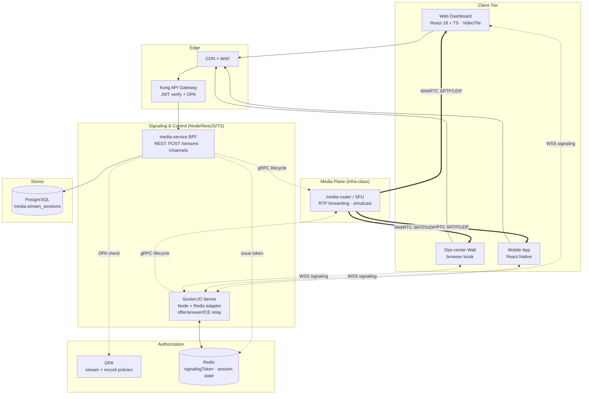
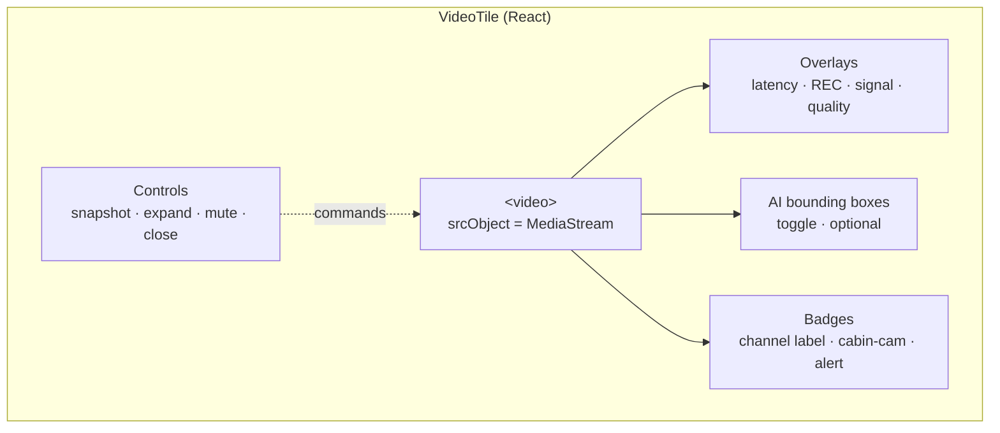
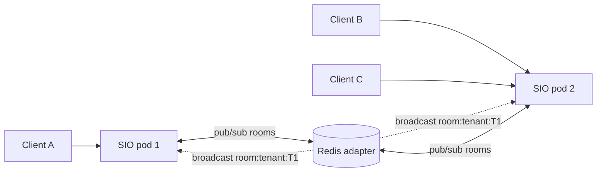
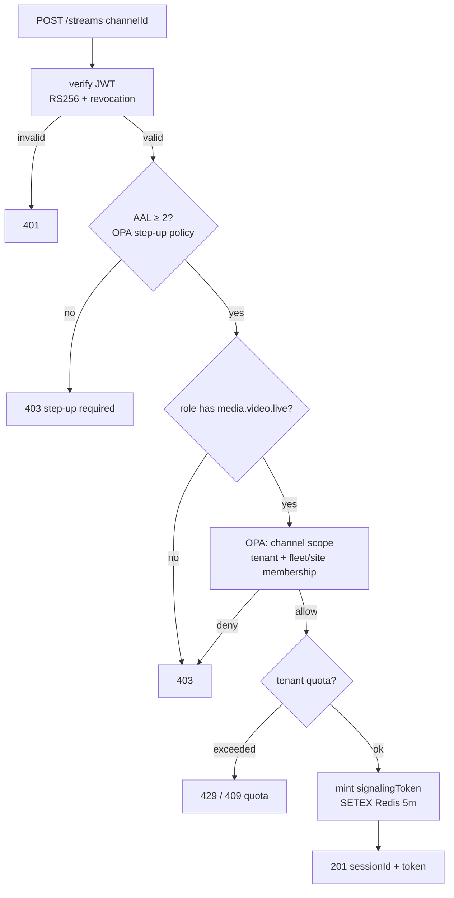
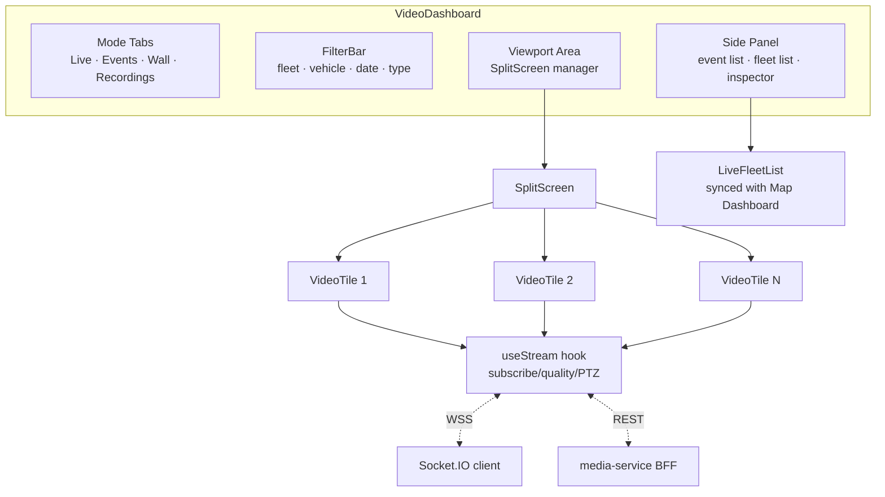
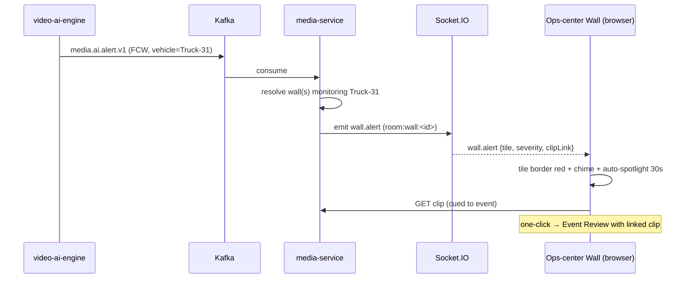
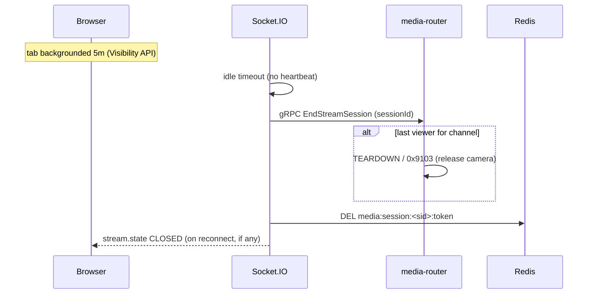
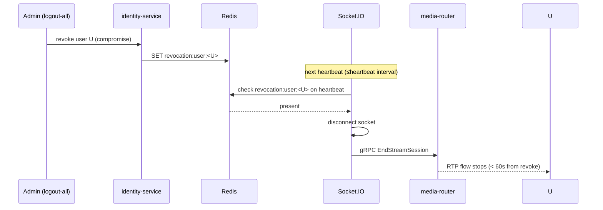

# FleetVision — Live Video Monitoring Architecture

**Version:** 1.0.0
**Status:** Approved — Architecture Reference
**Date:** 2026-08-02
**Owner:** Real-Time Data Architect / Chief Software Architect
**Classification:** Confidential — Architecture Reference

> **About this document.** This is the canonical architecture-tier specification for the FleetVision **Live Video Monitoring System** — the consumption plane of the Media & Video bounded context (`02_Domain_Model.md` §1, Context 8). It defines *how* an operator opens a live camera view, *how* the browser negotiates and renders it (WebRTC flow + WebSocket signaling flow), *how* the multi-camera / video-wall / split-screen / camera-group features are delivered, and *how* stream and recording authorization is enforced at sub-second latency.
>
> **Relationship to prior work.** Three companion documents surround this one; it complements, never duplicates:
> - **`09_Video_Gateway.md`** owns the *ingest/router plane* — protocol adapters, media pipeline, SFU, transcoding, thousands-of-streams load balancing. **This document is its consumer.**
> - **`docs/modules/VideoPlatform.md`** owns the *bounded context policy* — codec/recording modes, evidence integrity, the full REST/gRPC API, personas.
> - **`UI_UX_Design.md` §3 (Video Dashboard)** owns the *visual design* — wireframes, the `VideoTile` component, interaction patterns, accessibility.
>
> This document owns the **live-view architecture between them**: the browser↔server flows, the player component model, the feature delivery, the security model for streams, and the sequence/component diagrams that make the system implementable. It is the same depth/format as `06`–`09`.
>
> **Runtime & persistence.** Built on the lean foundation: the consumption-side services (`media-service` orchestrator, Socket.IO signaling) are **Node.js LTS + NestJS + TypeScript** (ADR-021); the media-router/SFU is an infrastructure-class component (ADR-021 §5). Storage is PostgreSQL + Redis + S3 (ADR-022). Signaling uses Socket.IO (ADR-015); authorization is OPA + RS256 JWTs (ADR-009, `docs/modules/Authentication.md`).
>
> **Conforms to:** `00_Project_Vision.md` v2.1.0 (Intelligence pillar — AI dashcam, BG-4; Trust pillar — privacy/consent, BG-5; consumer-grade UX), `01_Master_Architecture.md` v2.2.0 (§3 #10/#11/#12; §4.1 runtime; §9 security; §2 Socket.IO container), `02_Domain_Model.md` v2.0.0 (Context 8; permission catalog §6 `media.*`; INV-MED01/MED02), `03_Database_Architecture.md` v3.0.0 (`media` schema, Redis §18), `UI_UX_Design.md` (Video Dashboard §3, VideoTile §0.5), `docs/modules/Authentication.md` (JWT §6, OPA), ADR-009 (Keycloak+OPA), ADR-015 (Socket.IO), ADR-021 (Node runtime), ADR-022 (lean persistence).

---

## Table of Contents

1. [Live View Architecture](#1-live-view-architecture)
2. [Browser Playback](#2-browser-playback)
3. [WebRTC Flow](#3-webrtc-flow)
4. [WebSocket Flow](#4-websocket-flow)
5. [Authentication & Authorization](#5-authentication--authorization)
6. [Features — Single, Multi, Wall, Split, Groups](#6-features--single-multi-wall-split-groups)
7. [UI — Video Dashboard & Fleet Video Monitoring](#7-ui--video-dashboard--fleet-video-monitoring)
8. [Security — Stream & Recording Permission](#8-security--stream--recording-permission)
9. [Sequence Diagrams](#9-sequence-diagrams)
10. [Component Diagram](#10-component-diagram)
11. [Scaling & Failure Modes](#11-scaling--failure-modes)
12. [Conformance, Traceability & Open Items](#12-conformance-traceability--open-items)

---

## 1. Live View Architecture

### 1.1 Purpose

A live camera view is the highest-value, most latency-sensitive UI surface in FleetVision — *show me the cab cam of truck 42 right now; put my 16 highest-risk vehicles on the wall.* The Live Video Monitoring System is the set of components that turn a viewer's click into a sub-second, glass-to-glass, secure, browser-rendered video stream — and sustain thousands of concurrent viewers across the fleet without melting the browser or the bandwidth budget.

It is the **consumption plane**: where `09_Video_Gateway.md` terminates camera protocols and routes media, this document covers the **viewer side** — signaling, negotiation, rendering, the player components, the feature composition, and the authorization that gates every frame.

### 1.2 Goals & Non-Goals

| Goals | Non-Goals |
|---|---|
| Glass-to-glass live < 1s P95 to browser/mobile | Terminate camera protocols — Video Gateway owns (`09`) |
| Plugin-free browser playback (WebRTC + HLS) | Run CV inference — `video-ai-engine` owns |
| Multi-camera, video wall, split-screen, camera groups | Own the recording *policy* — VideoPlatform module owns |
| Per-frame stream authorization (no token = no frame) | Become a general streaming CDN |
| Cellular-aware quality (simulcast, tile caps) | Face recognition / biometric ID (privacy, INV-MED02) |
| Auto-close idle views (cost control) | Public broadcasting / social restream |

### 1.3 Live-View Topology



> **Two planes, two transports.** The **signaling plane** (control — open/close/quality/PTZ) travels over **WebSocket (WSS)**. The **media plane** (the actual video/audio) travels over **WebRTC (UDP/SRTP)**. They share nothing but a signed `streamSessionId` that ties a media flow to an authorized signaling session (§5). This separation keeps signaling cheap and media low-latency (`09` §2.1).

### 1.4 The Three Live-View Paths

| Path | Transport | Latency | Use |
|---|---|---|---|
| **Live (browser/mobile → SFU)** | WebRTC (UDP/SRTP) | < 1s P95 | the headline live view |
| **Live (low-bandwidth fallback)** | WebRTC + simulcast 360p / audio-only | < 1s | cellular, weak links |
| **Live (TURN relay)** | WebRTC via TURN (UDP/TCP) | < 2s | symmetric NAT / restrictive firewall |

HLS is **not** used for live (its 2–10s latency is unacceptable for live monitoring); HLS is reserved for **VOD playback** of recordings (`docs/modules/VideoPlatform.md` §8). The two paths are deliberately distinct so the player knows which transport it is on.

### 1.5 Latency Budget

| Leg | Budget | Mechanism |
|---|---|---|
| Camera → media-router (ingest) | < 300ms | `09` §1.5 |
| Signaling (WS offer/answer) | < 200ms P99 | Socket.IO relay |
| ICE/DTLS setup (first frame) | < 500ms | STUN/TURN |
| media-router → viewer (SFU) | < 200ms | RTP forwarding |
| **Glass-to-glass** | **< 1s P95** | the dominant UX constraint |

### 1.6 Design Principles

1. **No media over WebSocket.** WS carries signaling + control only; video flows over WebRTC. Mixing them destroys latency and complicates back-pressure.
2. **One source pull, many viewers (SFU).** The router opens the camera once and fans RTP to N viewers — never one pull per viewer (`09` §4.3).
3. **Demand-driven + auto-close.** A stream closes when its last viewer leaves (or after 5 min idle) — idle cameras cost zero bandwidth (`09` §2.3).
4. **Every frame authorized.** The SFU forwards RTP only for sessions whose `streamSessionId` was issued against a valid OPA decision (§5, §8).
5. **Plugin-free by design.** No Flash, no native plugins — WebRTC + HLS cover all cases (`docs/modules/VideoPlatform.md` §11.1).
6. **Privacy is a first-class signal.** Driver-consent state and jurisdiction gate whether a cabin-cam tile is even available (INV-MED02).

---

## 2. Browser Playback

### 2.1 Two Transports, One Player

| Use case | Transport | Browser API | Latency |
|---|---|---|---|
| **Live view** | WebRTC | `RTCPeerConnection` + `<video>` | < 1s |
| **Playback (VOD)** | HLS | `hls.js` (Chrome/FF) · native Safari `<video>` | 2s start |

The `VideoTile` component (`UI_UX_Design.md` §0.5) abstracts both behind one React API: `<VideoTile sessionId=… />` for live, `<VideoTile clipId=… />` for playback. The transport choice is internal.

### 2.2 The `VideoTile` Component

The atomic unit of the Video Dashboard. Each tile is an independent `<video>` element with overlays; N tiles compose into a multi-camera view or wall.



| Overlay | Source | Purpose |
|---|---|---|
| Latency badge | RTCP timestamps → glass-to-glass | "is this actually live?" |
| REC dot | recording policy active on channel | evidence awareness |
| Signal (green/amber/red) | camera health + last-frame age | drop visibility |
| Quality selector | simulcast layer switch | bandwidth control |
| AI boxes | `media.ai.alert.v1` (real-time) | safety context (FCW objects, intrusion zones) |
| Cabin-cam badge | channel metadata + consent state | privacy notice (INV-MED02) |
| Alert border | wall pop-in / event link | active monitoring |

### 2.3 Quality Selection (Simulcast)

The SFU publishes multiple spatial layers from one source pull (`09` §6.5). Each viewer receives the layer matching their bandwidth/screen — switched live without re-pulling the camera:

| Quality | Resolution | Bitrate | Use |
|---|---|---|---|
| `auto` | adaptive | 0.5–3 Mbps | default |
| `high` | 1080p | 3–4 Mbps | investigation |
| `medium` | 720p | 1.5 Mbps | dispatcher desk |
| `low` | 360p | 0.5 Mbps | mobile cellular / wall thumbnails |
| `audio-only` | — | 32 kbps | extreme low-bandwidth |

### 2.4 Live Indicators & Freshness

- **Latency** displayed (glass-to-glass via RTCP) — operators must trust they see *now*.
- **Signal** green/amber/red from camera health + last-frame age; a frozen frame is worse than no frame, so the tile shows "frozen (3s)" rather than pretending.
- **REC** dot if recording active on the channel.
- **Visibility API** — a backgrounded tab stops rendering (and counts as idle for auto-close).

### 2.5 Auto-Close & Quotas

Idle live views auto-close after **5 min** of no browser activity (visibility API + heartbeat). Per-tenant concurrent-live quota enforces cost:

| Tier | Concurrent live streams |
|---|---|
| Pro | 50 |
| Enterprise | 500 |
| over-quota | `409` with upgrade guidance |

---

## 3. WebRTC Flow

The full WebRTC negotiation for a live view — from the viewer's REST call through SDP offer/answer to the RTP flow. This is the canonical flow the SFU and player implement; the WebSocket messages that carry it are defined in §4.

### 3.1 Negotiation (full handshake)

```mermaid
sequenceDiagram
    autonumber
    participant U as Browser (VideoTile)
    participant API as media-service REST
    participant OPA as OPA
    participant SIO as Socket.IO (signaling)
    participant R as Redis
    participant MR as media-router (SFU)
    participant CAM as Camera

    U->>API: POST /streams {channelId, quality}
    API->>OPA: allow? (media.video.live + channel scope)
    OPA-->>API: allow (decision cached)
    API->>R: SETEX signalingToken (5m) + session state
    API->>MR: gRPC CreateStreamSession(channel, ttl)
    alt source not already active
        MR->>CAM: open source (RTSP/RTMP/JT1078)
        CAM-->>MR: RTP frames (first I-frame)
        MR->>MR: demux → route → transcode if H.265
    end
    MR-->>API: SDP offer + ICE candidates
    API-->>U: 201 {sessionId, signalingToken, wsUrl}
    U->>SIO: connect WSS (JWT + signalingToken)
    SIO->>R: verify token + session
    SIO-->>U: stream.offer (SDP)
    U->>U: RTCPeerConnection.setRemoteDescription(offer)
    U->>SIO: stream.answer (SDP)
    SIO->>MR: gRPC CompleteNegotiation(answer)
    loop trickle ICE
        U-->>SIO: ice.candidate
        SIO-->>MR: ice.candidate
        MR-->>SIO: ice.candidate
        SIO-->>U: ice.candidate
    end
    MR->>U: DTLS-SRTP handshake (UDP/TURN)
    MR-->>U: RTP video/audio flows → LIVE (< 1s)
    Note over U: idle 5m → auto-close; quota enforced
```

### 3.2 SDP / Codec Negotiation

The SFU's SDP offer advertises the codecs available for that channel after any transcoding:

| Camera codec | SDP offers | Browser picks |
|---|---|---|
| H.264 + Opus | `video/H264`, `audio/opus` | H.264 + Opus (passthrough) |
| H.265 | `video/H264` (transcoded), `video/H265` (HLS only) | H.264 (transcoded layer for WebRTC) |
| AAC / G.711 | `audio/opus` (transcoded) | Opus |

The browser's `RTCRtpReceiver` only ever receives browser-compatible codecs; the SFU absorbs the mismatch via transcoding (`09` §6). This is why a viewer never sees "codec unsupported."

### 3.3 ICE / NAT Traversal

| Candidate type | When | Latency |
|---|---|---|
| **host** | viewer + SFU same network (rare) | best |
| **srflx** (STUN) | typical NAT | good |
| **relay** (TURN) | symmetric NAT / restrictive firewall | < 2s |

TURN servers are regional (`turn:turn.<region>.fv:3478`); the SFU prefers host/srflx and falls back to TURN. ICE candidates are trickled over the WebSocket signaling channel (§4) for fast connection.

### 3.4 DTLS-SRTP (Media Encryption)

Every RTP packet between SFU and viewer is encrypted with **DTLS-SRTP** — the WebRTC-standard key exchange over the DTLS handshake. The media is end-to-end encrypted between the SFU and the browser; the signaling channel (WSS) is separately TLS-encrypted. A network observer sees only encrypted UDP/TCP (`docs/modules/VideoPlatform.md` §12.1).

### 3.5 Reconnection & Resilience

| Event | Response |
|---|---|
| Brief network blip | ICE restart; viewer's `RTCPeerConnection` reconnects; < 2s gap |
| media-router pod migration | new SDP offer via WS; player re-negotiates; < 3s gap |
| Camera drop | SFU signals `stream.degraded`; tile shows "signal lost, retrying"; auto-retry backoff |
| Browser backgrounded | Visibility API pauses; counts toward 5-min auto-close |

---

## 4. WebSocket Flow

The WebSocket (Socket.IO per ADR-015) is the **signaling and control channel** — it carries everything *except* the media. One persistent WSS connection per client multiplexes all the client's live tiles; messages are routed by `sessionId`.

### 4.1 Connection Lifecycle

```mermaid
sequenceDiagram
    participant U as Browser
    participant SIO as Socket.IO (Node)
    participant R as Redis
    participant MR as media-router
    U->>SIO: io(websocketUrl) + auth: {JWT, signalingToken}
    SIO->>R: GET signalingToken + session state
    alt valid
        SIO-->>U: connect ACK (room joined: tenant:<tid>)
    else invalid/expired
        SIO-->>U: connect_error (401)
    end
    loop signaling & control
        U<->>SIO: stream.offer / answer / ice.candidate
        SIO<->>MR: gRPC relay
        U->>SIO: stream.subscribe / .quality / .unsubscribe
        U->>SIO: ptz.command
        SIO-->>U: stream.state (ACTIVE/DEGRADED/CLOSED)
        SIO-->>U: stream.event (alert link, snapshot ready)
    end
    U->>SIO: disconnect (or idle 5m)
    SIO->>MR: gRPC EndStreamSession (if last viewer)
```

### 4.2 Message Catalog

| Direction | Message | Purpose |
|---|---|---|
| C→S | `stream.subscribe` | add a viewer to an active SFU track |
| S→C | `stream.offer` | SDP offer from SFU |
| C→S | `stream.answer` | SDP answer from browser |
| C↔S | `ice.candidate` | trickle ICE (both directions) |
| C→S | `stream.quality` | switch simulcast layer |
| C→S | `stream.unsubscribe` | leave a track (close tile) |
| C→S | `ptz.command` | PTZ (translated to camera protocol) |
| C→S | `snapshot.request` | capture JPEG from current frame |
| S→C | `stream.state` | ACTIVE / DEGRADED / CLOSED |
| S→C | `stream.event` | alert link, snapshot ready, recording state |
| S→C | `wall.alert` | wall pop-in (highlight + chime) |

### 4.3 Multi-Pod Fan-Out (Socket.IO Redis Adapter)

Signaling is multi-pod via the **Socket.IO Redis adapter** — any pod can serve any client, and any pod can broadcast to a room. This is what lets a 500-viewer fan-out survive a pod loss and lets wall-control broadcast to all wall tiles regardless of which pod holds the socket.



### 4.4 Rooms & Scoping

Clients join rooms scoped by tenant + context; OPA membership is checked on `join`:

| Room | Members | Authorization |
|---|---|---|
| `tenant:<tid>` | all of tenant's connections | JWT tenant claim |
| `session:<sid>` | viewers of one stream | `media.video.live` + session token |
| `wall:<wallId>` | a saved video wall | `media.wall.read` |
| `vehicle:<vid>` | a vehicle's camera set | fleet/vehicle membership |

A tenant-boundary violation is SEV-1 (BG-5). Cross-tenant message delivery is impossible by construction (room keys are tenant-scoped + RLS on the metadata).

### 4.5 Back-Pressure & Quotas

- A client flooding `stream.subscribe` is rate-limited at the Socket.IO layer.
- Concurrent-live quota (§2.5) enforced at subscribe time; over-quota → `stream.quota_exceeded` event (UI shows upgrade guidance).
- A client whose send-buffer fills (slow) is disconnected rather than blocking the pod.

---

## 5. Authentication & Authorization

Live video is the most sensitive surface to authorize: every frame must be authorized, latency must stay sub-second, and the authorization must survive token expiry mid-stream. The system uses **two layers** — platform authn (JWT) for the session, and a **per-stream signaling token** for the media flow.

### 5.1 Authentication (who are you?)

Built on the platform IAM stack (`docs/modules/Authentication.md`):

| Concern | Mechanism |
|---|---|
| Identity provider | Keycloak 24 (OIDC + SAML 2.0) — ADR-009 |
| Access token | **RS256 JWT**, 15-min TTL, claims incl. `tenant_id`, `roles`, `scope`, `aal` |
| Validation | fail-closed: signature + `exp` + `iss` + `aud` + Redis revocation (`docs/modules/Authentication.md` §6.3) |
| Revocation | < 60s global via `revocation:user:<sub>` (AUTH-BR-11) |
| WebSocket auth | JWT in the Socket.IO `auth` handshake; verified on connect |
| MFA | AAL2 required for live video (sensitive resource) — `aal ≥ 2` claim |

> **AAL gate.** Because live video (especially cabin-cam) is sensitive, the live-view endpoints require **AAL2** (MFA). A viewer with only an AAL1 session is prompted to step up before the stream opens. This is a per-resource policy in OPA (§5.3), not a hardcoded check.

### 5.2 Authorization (what can you do?)

Two-tier, mirroring the platform model (`01` §9, ADR-009):

| Tier | Engine | Scope | Latency |
|---|---|---|---|
| **Coarse (RBAC)** | role → permission | "does this role have `media.video.live`?" | < 1ms (cached) |
| **Fine (ABAC)** | OPA policy | "does this user own/access *this* channel/vehicle/site?" | < 5ms (cached) |

Permissions are catalogued once, canonically, in `02_Domain_Model.md` §6 (`media.*` row). OPA policies and OpenAPI annotations must match exactly — CI enforces drift breaks the build (resolves ARR SEC-1).

### 5.3 The `media.*` Permission Catalog (canonical — `02` §6)

| Permission | Grants | Live-view use |
|---|---|---|
| `media.channel.read` | list/view camera channels | channel picker |
| `media.channel.manage` | register/update/decommission cameras | admin only |
| `media.video.live` | open a **live** stream | the live view itself |
| `media.video.read` | browse/play **recordings** | playback (VOD) |
| `media.video.export` | export a clip/range as MP4 | evidence download |
| `media.video.manage` | manage recordings (delete, legal-hold) | admin |
| `media.policy.read` / `.manage` | read/set recording + retention policy | site admin |
| `media.ai.read` | view AI alerts + bounding boxes | safety officer |
| `media.wall.read` / `.manage` | view/save video-wall layouts | ops center |

> **`live` vs `read` is deliberate.** `media.video.live` (open a live stream) and `media.video.read` (play a recording) are separate permissions because the use cases and risk profiles differ — a dispatcher may watch live but not browse historical footage; an auditor may do the opposite.

### 5.4 Per-Stream Signaling Token

The access JWT (15-min TTL) is too coarse and too short-lived to gate a media flow that may run for hours. So `POST /streams` mints a **per-stream signaling token** that ties a media flow to a specific authorized session:

| Property | Value |
|---|---|
| Type | opaque, random (256-bit), not a JWT |
| TTL | 5 minutes, sliding (renewed on heartbeat) |
| Stored | Redis `media:session:<sid>:token` |
| Binds | `{sessionId, channelId, tenantId, userId, quality, expiresAt}` |
| Verified | by Socket.IO on connect + by SFU before forwarding RTP |

The SFU **rejects any WebRTC negotiation whose `sessionId` has no valid token** — so even if an attacker learned the SFU's address and a `sessionId`, they cannot receive media without the unforgeable token issued against an OPA decision (`docs/modules/VideoPlatform.md` §12.1). Revoked users (token deleted from Redis) are dropped from the SFU within seconds.

### 5.5 Decision Flow



---

## 6. Features — Single, Multi, Wall, Split, Groups

### 6.1 Single Camera

The base case: one `VideoTile` showing one channel. The full WebRTC flow (§3) opens on click and closes on leave/idle. Used for quick inspection ("show me truck 42 forward cam").

### 6.2 Multi Camera (single site / single vehicle)

A site or vehicle with N cameras shown simultaneously in a tiled grid. Each tile is an **independent** WebRTC `streamSession`; the SFU multiplexes N source pulls into N tracks from the same router pod (channel affinity — `09` §9.3).

```
   Vehicle (2×2)                    Site (2×2)
   ┌──────────┬──────────┐         ┌──────────┬──────────┐
   │ Forward  │ Driver   │         │  Gate 1  │  Yard N  │
   ├──────────┼──────────┤         ├──────────┼──────────┤
   │  Rear    │  Cargo   │         │  Dock A  │  Office  │
   └──────────┴──────────┘         └──────────┴──────────┘
```

- Default cap: 4 tiles (forward/driver/rear/cargo for a vehicle).
- **Sync-scrub**: in playback mode, scrubbing the timeline moves all tiles together (same timestamp across cameras) — critical for incident reconstruction.
- Bandwidth scales with active tiles; closing a tile releases its session.

### 6.3 Video Wall

A **Video Wall** is a multi-camera grid for ops/security centers — a dispatcher's overview of many cameras/sites/vehicles at once on large monitors (`docs/modules/VideoPlatform.md` §10.2). This is the most demanding feature: 16 tiles × live WebRTC, sustained for hours, bandwidth-aware.

```
   ┌─────────┬─────────┬─────────┬─────────┐
   │ Gate 1  │ Gate 2  │ Dock A  │ Yard N  │
   ├─────────┼─────────┼─────────┼─────────┤
   │ Dock B  │ Office  │ Truck42 │ Truck19 │
   ├─────────┼─────────┼─────────┼─────────┤
   │ Parking │ Perim   │ Van 07  │ FuelIsl │
   ├─────────┼─────────┼─────────┼─────────┤
   │Warehouse│ Dock C  │ Gate 3  │SPOTLIGHT│
   └─────────┴─────────┴─────────┴─────────┘
```

| Mechanism | Implementation |
|---|---|
| Layout service | `VideoWallLayout` saved per tenant — tiles + refresh policy (`docs/modules/VideoPlatform.md` §10.2.1) |
| Tile sources | `CHANNEL` / `VEHICLE` / `SITE` — each resolves to one or more WebRTC sessions |
| Rotation | non-active tiles round-robin 30s to bound bandwidth |
| **Spotlight** | one big tile + thumbnails; auto-promote on alert for X seconds |
| **Alert pop-in** | tile highlights (red border) + audio chime when its source raises an AI/event alert |
| Bandwidth cap | cellular → 4 tiles @ 360p; wired NOC → 16 @ 720p |

> **Active monitoring.** Alert pop-in is what makes a wall useful — a wall of 16 static feeds is passive; a wall that surfaces the one feed that needs attention is an operator force-multiplier.

### 6.4 Split Screen

Split-screen is the **layout primitive** underneath multi-camera and wall: the viewport divides into N regions, each hosting a `VideoTile`. The split-screen manager handles:

| Concern | Behavior |
|---|---|
| Layout presets | 1×1, 2×2, 3×3, 4×4, 1+5 (spotlight + thumbs) |
| Drag-drop | drag a channel from the picker into a region |
| Resize | drag region dividers (the tiles re-scale, not re-pull) |
| Fullscreen | pop a tile to full viewport; Esc returns |
| Persist | layout saved per user/dashboard |

Split-screen is purely a **client-side layout concern** — it does not change the signaling or media flow; each region is still one independent `streamSession`.

### 6.5 Camera Groups

A **Camera Group** is a named, saved set of cameras a user opens together — "Yard Cameras", "Truck-42 all cams", "High-risk vehicles". Selecting a group opens all its cameras in a split-screen layout in one action.

| Attribute | Example |
|---|---|
| `groupId` | UUID |
| `name` | "Yard Cameras" |
| `members` | `[{type: CHANNEL, id}, {type: VEHICLE, id}, {type: SITE, id}]` |
| `defaultLayout` | 3×3 |
| `owner` | user / tenant-shared |

Groups are authored via REST (`POST /camera-groups`) and authorized per member: opening a group opens only the cameras the user can access (OPA filters silently; a count badge shows "12 of 15 available"). Camera groups power the **Fleet Video Monitoring** view (§7.2) — "show me all my moving vehicles' forward cams."

---

## 7. UI — Video Dashboard & Fleet Video Monitoring

The UI surface is owned by `UI_UX_Design.md` §3 (Video Dashboard) — wireframes, components, accessibility. This section is the architecture's contract with that UI: the dashboard modes, the component composition, and the Fleet Video Monitoring view specifically.

### 7.1 Video Dashboard Modes (per `UI_UX_Design.md` §3.3)

| Mode | Use | Live? |
|---|---|---|
| **Live** | open a live stream from any camera (§3.4) | ✅ WebRTC |
| **Event Review** | triage AI/behavior events with linked clips | VOD (HLS) |
| **Video Wall** | multi-vehicle/multi-camera grid (§3.5) | ✅ WebRTC |
| **Recordings** | browse/search continuous + clip library | VOD (HLS) |

### 7.2 Fleet Video Monitoring

A specialized live view: **monitor many vehicles' cameras at once, filtered by fleet state**. Unlike a fixed wall (saved layout), the Fleet Video Monitoring view is **dynamic** — its tiles are selected by a live query.

```
┌──────────────────────────────────────────────────────────────────────┐
│ Video ▸ Fleet Monitoring     Fleet: All ▾  Filter: Moving ▾   [▦ ▦] │
├──────────────────────────────────────────────────────────────────────┤
│ ┌──────────┬──────────┬──────────┬──────────┐  ┌──────────────────┐ │
│ │Truck-42 ▶│Truck-55 ▶│ Van-07 ▶ │Truck-19 ▶│  │ Live fleet list   │ │
│ │ forward  │ forward  │ forward  │ forward  │  │ ───────────────── │ │
│ │ 72km/h ● │ 54km/h ● │ 0km/h ⏸ │ 88km/h ● │  │ ● Truck-42  72 ⏶ │ │
│ ├──────────┼──────────┼──────────┼──────────┤  │ ● Truck-55  54   │ │
│ │ Bus-12 ▶ │ Truck-08 │ Van-22 ▶ │Truck-31 ▶│  │ ⏸ Van-07   idle │ │
│ │ forward  │ forward  │ forward  │ forward  │  │ ● Truck-19  88 ⏶ │ │
│ │ 40km/h ● │ 60km/h ● │ 30km/h ● │ 0km/h ⏸ │  │ ⚠ Truck-31 FCW!  │ │
│ └──────────┴──────────┴──────────┴──────────┘  │   [load more]     │ │
│                                                  └──────────────────┘ │
│ Spotlight: Truck-31 (FCW alert) · auto-promote 30s                   │
└──────────────────────────────────────────────────────────────────────┘
```

| Aspect | Implementation |
|---|---|
| Tile selection | live query over vehicles matching filter (moving, idle, in-geofence, on-route, high-risk) |
| Tile source | each vehicle's forward cam (configurable) via independent WebRTC session |
| Refresh | paginated; "load more" opens the next batch (bandwidth-bounded) |
| Alert pop-in | a vehicle raising `media.ai.alert.v1` / `tracking.behavior.event.v1` auto-spotlights |
| Cap | cellular → 4 tiles; wired → up to 16; over-cap → spotlight + thumbnails |

The list on the right is the same live fleet list from the Map Dashboard (`UI_UX_Design.md` §1), synchronized — clicking a vehicle there opens its tile here, and vice versa.

### 7.3 Component Composition



| Component | Responsibility | Source |
|---|---|---|
| `VideoDashboard` | shell, mode switching, URL state | this doc |
| `SplitScreen` | layout regions, drag-drop, presets | this doc |
| `VideoTile` | one `<video>` + overlays + controls | `UI_UX_Design.md` §0.5 |
| `useStream` hook | subscribe/quality/PTZ/snapshot via WS+REST | this doc |
| `CameraGroupPicker` | open a saved group into split-screen | this doc |
| `LiveFleetList` | dynamic tile selection by fleet filter | this doc |
| `Timeline` | multi-track scrubber (Event Review mode) | `UI_UX_Design.md` §0.5 |

### 7.4 State Management

| State | Store | Why |
|---|---|---|
| Server state (channels, recordings, walls, groups) | **React Query** | caching, invalidation, background refresh (`UI_UX_Design.md` Appendix C) |
| UI state (active mode, layout, selected tile, filters) | **Zustand** | fast, no provider nesting |
| Real-time state (stream sessions, alerts) | **Socket.IO → Zustand** | WS events update the store; React re-renders tiles |
| URL state | **sync** to query params | shareable deep links (mode, layout, selection) |

### 7.5 Accessibility & Privacy (per `UI_UX_Design.md` §0.8, §3.8)

- All tile controls keyboard-accessible; `?` shows shortcuts.
- ARIA live regions announce: stream state changes, alert pop-in, recording status.
- **Cabin-cam badge** + consent banner in jurisdictions requiring it; channel disabled if driver has not consented (INV-MED02).
- AI overlays show only gaze/pose boxes (no face recognition) + a one-line privacy reminder.
- `prefers-reduced-motion` disables alert pulsing/chime (visual indicator only).

---

## 8. Security — Stream & Recording Permission

Live video concentrates three security risks: **unauthorized viewing** (privacy), **unauthorized recording/export** (evidence tampering), and **token theft** (lateral movement). The model below addresses each.

### 8.1 Stream Permission (viewing)

| Layer | Control | Enforced by |
|---|---|---|
| Authn | RS256 JWT + revocation (`docs/modules/Authentication.md` §6) | Kong API Gateway, Socket.IO |
| AAL | AAL2 (MFA) required for live | OPA step-up policy |
| RBAC | `media.video.live` permission | OPA coarse check |
| ABAC | tenant + fleet/site/vehicle membership of *this* channel | OPA fine check |
| Per-stream | signaling token (opaque, 5m sliding, Redis) | Socket.IO + SFU |
| Per-frame | SFU forwards RTP only for sessions with a valid token | media-router |
| Tenant isolation | room keys tenant-scoped; RLS on metadata; S3 prefix | all layers |

**Invariants:**
- INV-LV1: no media flows without a valid signaling token minted against an OPA allow.
- INV-LV2: a revoked user (Redis `revocation:user:<sub>`) is dropped from the SFU within 60s (token deleted on next heartbeat).
- INV-LV3: cross-tenant stream delivery is impossible (room + RLS + S3 prefix isolation; SEV-1 if breached — BG-5).

### 8.2 Recording Permission

Recording is gated separately from viewing — a viewer may watch live but not trigger a recording, and vice versa.

| Action | Permission | Notes |
|---|---|---|
| Watch live | `media.video.live` | does NOT imply record |
| Trigger event/on-demand recording | `media.video.live` + recording-policy scope | policy decides if user-initiated record is allowed |
| Browse/play recordings | `media.video.read` | separate from live |
| Export clip as MP4 | `media.video.export` | watermarked (tenant + user + ts) |
| Delete recording | `media.video.manage` | admin; legal-hold blocks |
| Set recording/retention policy | `media.policy.manage` | site admin |
| Place legal hold | `media.video.manage` + compliance role | skips expiration (FMCSA evidence) |

### 8.3 Evidence Integrity (INV-MED01)

Every recorded clip is **hash-chained** for evidentiary admissibility (`docs/modules/VideoPlatform.md` §12.2, `09` §7.4):

```
clip.sha256  = SHA256(clip.bytes)
clip.prevHash = previousClipForChannel.sha256
clip.signedBy = media-service key (Vault)
```

Exports are watermarked (tenant + user + timestamp) for chain-of-custody. Any post-hoc modification breaks the chain → tamper-evident.

### 8.4 Privacy (INV-MED02)

| Concern | Control |
|---|---|
| Driver-facing AI | safety-only (gaze/pose); **no face recognition / identity** |
| Driver-facing frames | not persisted unless an alert is raised (then only the event clip) |
| Driver consent | jurisdiction-aware; cabin-cam channel disabled if no consent; banner in UI |
| DSAR (GDPR) | driver-facing recordings subject to access/erasure; retention short (30d default) unless linked to a safety event |
| Fixed-site audio | off by default (one-party/two-party consent varies by jurisdiction) |
| Works-council jurisdictions (EU) | tenants can disable driver-facing AI per local rules |

### 8.5 Threat Model (live surface)

| Threat | Mitigation |
|---|---|
| Stolen JWT used to open streams | AAL2 step-up; 15-min TTL; revocation < 60s |
| Forged sessionId sent to SFU | SFU requires valid signaling token (Redis-backed); rejects unknown sessions |
| Token replay after logout | token deleted from Redis on disconnect/revocation |
| Lateral movement (viewer → other tenant) | room + RLS + S3 prefix; OPA ABAC per channel |
| Recording tampering | hash-chain (INV-MED01); Vault-signed |
| Excessive streams (DoS / cost) | per-tenant concurrent-live quota; idle auto-close |
| Eavesdrop on media | DTLS-SRTP end-to-end (SFU ↔ browser) |

---

## 9. Sequence Diagrams

### 9.1 Open Live Stream (full end-to-end)

See §3.1 — the canonical WebRTC negotiation from REST call through RTP flow.

### 9.2 Multi-Camera Open (N tiles)

```mermaid
sequenceDiagram
    participant U as Browser (SplitScreen)
    participant API as media-service REST
    participant SIO as Socket.IO
    participant MR as media-router (SFU)
    U->>API: POST /streams/batch {channelIds:[c1,c2,c3,c4]}
    API->>API: OPA allow per channel (ABAC filter)
    API->>MR: gRPC CreateStreamSession × N (co-located pod)
    par each tile
        MR-->>API: SDP offer (per channel)
    end
    API-->>U: 201 {sessions:[…], tokens}
    U->>SIO: connect + join session:<sid> × N
    par negotiate each tile
        U<->>SIO: offer/answer/ICE per session
    end
    MR-->>U: RTP flows × N → 4 live tiles
    Note over U: closing a tile → unsubscribe → if last viewer, MR releases source
```

### 9.3 Alert Pop-In (video wall)



### 9.4 Auto-Close (idle / quota)



### 9.5 Revocation (mid-stream)



---

## 10. Component Diagram

### 10.1 Component Architecture (live-view system)

```mermaid
graph TB
    subgraph Client["Client Tier"]
        WEB[Web Dashboard<br/>React 18 + TS 5<br/>VideoDashboard · VideoTile · SplitScreen]
        MOB[Mobile App<br/>React Native]
        WALLK[Wall Kiosk<br/>browser fullscreen]
    end
    subgraph Edge["Edge"]
        CDN[CDN + WAF]
        KONG[Kong API Gateway<br/>JWT verify + rate limit]
    end
    subgraph AppSvc["media-service (Node/NestJS/TS)"]
        BFF[REST BFF<br/>POST /streams · /channels · /camera-groups · /video-walls]
        SIG[Socket.IO Signaling<br/>Node + Redis adapter]
        SESS[Session Manager<br/>token mint + quota]
    end
    subgraph AuthzSvc["Authz"]
        OPA[OPA<br/>stream + record + AAL policies]
        KC[Keycloak<br/>OIDC RS256 JWT]
    end
    subgraph MediaSvc["Media Plane (infra-class)"]
        MR[media-router / SFU<br/>RTP forwarding · simulcast]
    end
    subgraph Stores["Stores (lean)"]
        R[(Redis<br/>tokens · sessions · rooms)]
        PG[(PostgreSQL<br/>media.stream_sessions<br/>video_channels · video_walls)]
        S3[(S3<br/>snapshots · exports)]
    end
    subgraph Upstream["Event sources"]
        K[(Kafka<br/>media.* · tracking.* events)]
        VAI[video-ai-engine]
    end

    WEB & MOB & WALLK --> CDN --> KONG --> BFF
    WEB & MOB & WALLK <-.WSS signaling.-> SIG
    BFF --> SESS --> R
    BFF -.decision.-> OPA
    OPA -.roles.-> KC
    BFF & SIG -.gRPC lifecycle.-> MR
    MR == WebRTC SRTP ==> WEB & MOB & WALLK
    SIG <--> R
    BFF --> PG
    SIG -.snapshot/export.-> S3
    K --> VAI
    VAI --> K
    K -.alerts/wall.pop-in.-> SIG
```

### 10.2 Component Responsibilities

| Component | Layer | Owns | Tech |
|---|---|---|---|
| `VideoDashboard` / `VideoTile` / `SplitScreen` | Client | rendering, layout, overlays | React 18 + TS |
| Kong API Gateway | Edge | JWT verify, rate limit, routing | Kong |
| `media-service` REST BFF | Application | open/close stream, channel/group/wall CRUD | Node/NestJS |
| Socket.IO Signaling | Application | offer/answer/ICE relay, rooms, control | Node + Redis adapter |
| Session Manager | Application | token mint, quota, idle timeout | Node |
| OPA | Authz | stream/record/AAL policies | OPA |
| Keycloak | Authn | OIDC, RS256 JWT, MFA | Keycloak |
| media-router / SFU | Media | RTP forwarding, simulcast, TURN | infra-class |
| Redis | Stores | tokens, sessions, rooms, pub/sub | Redis 7 |
| PostgreSQL | Stores | stream_sessions, channels, walls, groups | PG 16 |

### 10.3 Boundary Rules (load-bearing invariants — `01` §3.2)

1. **Signaling never carries media.** WSS = control; WebRTC = media. Mixing them is a defect.
2. **One writer per stream session.** `media-service` owns the `StreamSession` aggregate; the SFU executes (`09` §5.4).
3. **No media without a valid token.** The SFU is the last-line enforcer (INV-LV1).
4. **Tenant isolation at every layer.** Room keys, RLS, S3 prefixes — SEV-1 if breached.
5. **Failure isolation.** A media-router outage must not block a viewer's command path; the BFF commits and the SFU catches up on recovery.

---

## 11. Scaling & Failure Modes

### 11.1 Scaling Dimensions

| Dimension | Mechanism | Trigger |
|---|---|---|
| Concurrent viewers | SFU fan-out per pod + pod count (`09` §9.4) | viewer count |
| Signaling connections | Socket.IO + Redis adapter (multi-pod) | connection count |
| REST BFF RPS | HPA on RPS | API load |
| OPA decisions | decision cache (Redis) — < 1ms P99 | cache hit ≥ 99% |
| Wall fan-out | room broadcast (one produce → many consume) | wall count |

### 11.2 Capacity (per `docs/modules/VideoPlatform.md` §14.2 + `09` §9.2)

| Workload | Per pod | Notes |
|---|---|---|
| Concurrent WebRTC viewers | ~500/stream, ~5,000/pod | SFU fan-out |
| Socket.IO connections | ~20,000/pod | Redis adapter |
| OPA decisions | unlimited (cached) | < 1ms cached |
| Wall broadcast | one room → thousands | pub/sub |

### 11.3 Failure Modes

| Failure | Detection | Response |
|---|---|---|
| SFU pod crash | liveness | viewers auto-reconnect; ICE restart (< 2s gap) |
| Socket.IO pod loss | Redis adapter | clients reconnect to sibling pod; sessions in Redis survive |
| Signaling token expired mid-stream | heartbeat renewal | auto-renew on heartbeat; if missed, re-`POST /streams` |
| Redis (signaling) down | circuit breaker | new streams can't open; existing continue until token TTL |
| OPA unavailable | decision cache | serve cached decisions; fail-closed on miss for new streams |
| Keycloak down | JWKS cache (15 min) | serve cached keys; fail-closed after cache expiry |
| Viewer network blip | ICE restart | reconnect; < 2s gap |
| Camera drop | `stream.degraded` | tile shows "signal lost, retrying"; auto-retry backoff |

### 11.4 Performance Budgets

| Path | Budget |
|---|---|
| Glass-to-glass live | < 1s P95 |
| Signaling round-trip | < 200ms P99 |
| New stream setup | < 500ms |
| OPA decision (cached) | < 1ms P99 |
| Wall alert pop-in latency | < 500ms (event → highlight) |
| 2× headroom | always (vision guardrail) |

---

## 12. Conformance, Traceability & Open Items

### 12.1 ADR Conformance

| ADR | Status | How this document conforms |
|---|---|---|
| ADR-009 (Keycloak + OPA) | Accepted | §5 — RS256 JWT + OPA RBAC/ABAC; AAL2 for live |
| ADR-015 (Socket.IO canonical real-time) | Accepted | §4 — WebSocket signaling via Socket.IO + Redis adapter |
| ADR-021 (Node runtime) | Accepted | §1.3 — `media-service` + Socket.IO are Node/NestJS/TS; SFU is infra-class |
| ADR-022 (lean persistence) | Accepted | §10 — PostgreSQL + Redis + S3 |
| ADR-002 (Kafka) | Accepted | §9.3 — consumes `media.*` / `tracking.*` for alert pop-in |

### 12.2 Foundation Traceability

| Foundation Element | This Document |
|---|---|
| `00` Intelligence pillar (AI dashcam, BG-4) | §6.3 (alert pop-in), §9.3 |
| `00` Trust pillar (privacy/consent, BG-5) | §5, §8 (stream/record permission, INV-MED02) |
| `00` consumer-grade UX pillar | §2, §7 (VideoTile, dashboard) |
| `01` §3 Service Registry #10/#11/#12 | §1.3, §10 |
| `01` §4.1 Runtime (Node/NestJS/TS) | §1.3 |
| `01` §9 Security (Keycloak + OPA) | §5, §8 |
| `02` §1 Context 8 (Media & Video) | §1 |
| `02` §6 Permission catalog (`media.*`) | §5.3, §8.1/§8.2 |
| `02` §8 INV-MED01 (hash-chain), INV-MED02 (privacy) | §8.3, §8.4 |
| `03` §6/§18 Media + Redis | §10 |
| `docs/modules/Authentication.md` (JWT, OPA, AAL) | §5 |
| `09_Video_Gateway.md` (ingest/router — producer) | §1 (consumer), §3, §10 |
| `docs/modules/VideoPlatform.md` (policy, codec, API, wall) | §2, §6, §8 (referenced) |
| `UI_UX_Design.md` §3 (Video Dashboard), §0.5 (VideoTile) | §2.2, §7 |

### 12.3 Open Items Raised by This Document

| ID | Item | Affected doc | Action |
|---|---|---|---|
| **LV-1** | `POST /streams/batch` (multi-camera open) + `camera-groups` REST surface introduced (§6.5, §9.2) | `docs/modules/VideoPlatform.md` Appendix B | Add the batch-open + camera-group endpoints to the API reference. |
| **LV-2** | AAL2 (MFA) requirement for `media.video.live` formalized as an OPA step-up policy (§5.1) | `docs/modules/Authentication.md` §6 / `02` §6 | Confirm the AAL2 policy for live video in the permission catalog. |
| **LV-3** | Per-stream signaling-token contract (`media:session:<sid>:token`) formalized (§5.4) | `03_Database_Architecture.md` §18 (Redis keys) | Add the signaling-token key to the Redis inventory. |
| **LV-4** | Fleet Video Monitoring view + Camera Groups feature surface formalized (§6.5, §7.2) | `UI_UX_Design.md` §3 | Reference the Fleet Monitoring view + groups from the Video Dashboard section. |

### 12.4 Relationship to Companion Documents

- **`09_Video_Gateway.md`** — owns the **ingest/router plane**; this document is its **consumer**. The gateway produces RTP; this document's player renders it.
- **`docs/modules/VideoPlatform.md`** — owns the **policy**: codec/recording modes, evidence, the full REST/gRPC API, personas. This document executes the live-view subset of that API.
- **`UI_UX_Design.md` §3** — owns the **visual design**: wireframes, the `VideoTile` component, accessibility. This document is the architecture's contract with it.
- **`docs/modules/Authentication.md`** — owns **authn mechanics** (JWT, MFA, revocation); this document applies them to the live-video surface with per-stream tokens and OPA step-up.

---

*This Live Video Monitoring Architecture is the canonical consumption-plane reference for the Media & Video context. It is reviewed by the Architecture Review Board alongside `09_Video_Gateway.md` (ingest/router), `docs/modules/VideoPlatform.md` (policy), and `UI_UX_Design.md` (Video Dashboard). Frontend implementation lives under `web-app/src/features/video/` (`VideoDashboard`, `VideoTile`, `SplitScreen`, `useStream`); the signaling/session/token contracts are governed by `media-service` (`docs/modules/VideoPlatform.md`) and `docs/modules/Authentication.md`.*
