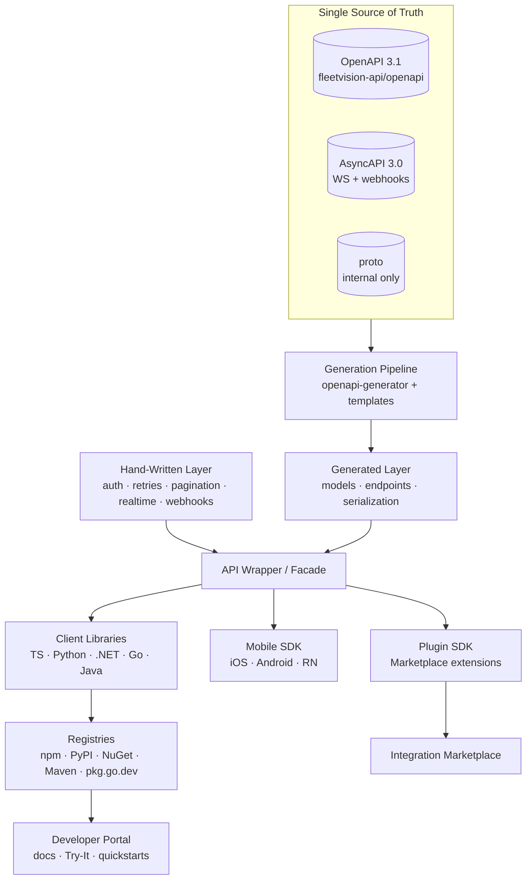
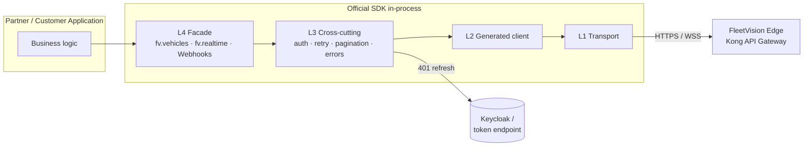
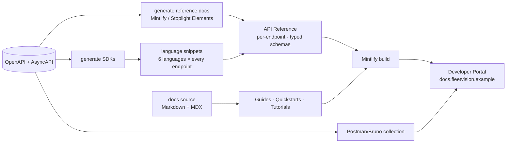
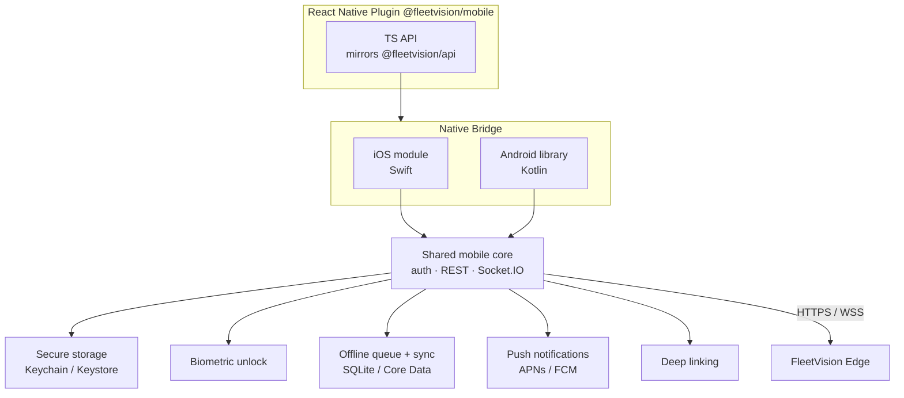
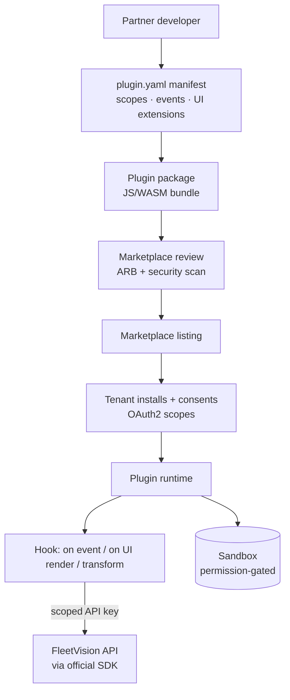
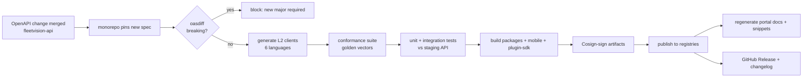

# FleetVision — Developer SDK Platform

**Version:** 1.0.0
**Status:** Approved — Foundation-Aligned
**Date:** 2026-08-02
**Owner:** Developer Experience Lead / API Platform Lead
**Classification:** Confidential — Platform Design

> **About this document.** This is the **Developer SDK Platform** design — the platform- and architecture-level view of the official client libraries. It defines *how the SDKs are built, generated, distributed, documented, and extended*: the SDK architecture, the client-library matrix, the auth-provider and API-wrapper layers, the documentation system, the Mobile SDK, and the Plugin SDK that powers the integration Marketplace (the *Openness* pillar's ecosystem lever, per `00_Project_Vision.md`).
>
> **Scope boundary — where to look instead.**
> - **Canonical SDK contract, cross-language feature parity, per-language code samples, retry/error spec** → `docs/specs/SDK.md` v2.0.0 (the SDK contract reference).
> - **Public API contract, auth schemes, endpoint structure** → `docs/specs/16_Public-API-Platform.md` and `docs/specs/API_Design.md`.
> - **OAuth2/OIDC/JWT internals, token lifecycle, PKCE** → `docs/modules/Authentication.md`.
>
> This document owns the **platform concerns** that sit above those references: how the SDK program is engineered as a system, how code flows from OpenAPI spec to published package to portal docs, how the Mobile SDK is structured as a driver-app platform, and how third parties build plugins for the Marketplace.

---

## Table of Contents

1. [SDK Architecture](#1-sdk-architecture)
2. [Client Libraries](#2-client-libraries)
3. [Authentication](#3-authentication)
4. [API Wrapper](#4-api-wrapper)
5. [Documentation System](#5-documentation-system)
6. [Mobile SDK](#6-mobile-sdk)
7. [Plugin SDK](#7-plugin-sdk)
8. [Build, Generation & Release Pipeline](#8-build-generation--release-pipeline)
9. [Distribution & Registry Strategy](#9-distribution--registry-strategy)
10. [Versioning, Compatibility & Deprecation](#10-versioning-compatibility--deprecation)
11. [Testing & Quality Gates](#11-testing--quality-gates)
12. [Traceability](#12-traceability)

---

## 1. SDK Architecture

### 1.1 What the SDK Platform Is

The SDK Platform is the **delivery mechanism for the Openness pillar**. FleetVision's public API is large (14 bounded contexts, hundreds of endpoints), authenticated (OAuth2 + API key), rate-limited, paginated, and real-time (WebSocket). Without SDKs, every partner reimplements OAuth2 refresh, backoff, cursor pagination, webhook HMAC verification, and Socket.IO rooms — producing brittle integrations and security bugs.

The SDK Platform solves this **once, as a system**: a single OpenAPI source of truth → a generation pipeline → idiomatic client libraries per ecosystem → a documentation system → a mobile platform → an extensibility layer (Plugin SDK). The output is a partner who installs a package and makes an authenticated call in five minutes.



### 1.2 Layered SDK Model

Every official SDK is built from the **same five layers**, in the same order. This is the contract that makes behavior uniform across languages while keeping each one idiomatic.

| Layer | Source | Responsibility | Editable? |
|---|---|---|---|
| **L1 — Transport** | hand-written | HTTP client (axios/httpx/HttpClient/net-http), WebSocket client (Socket.IO), config: base URL, timeouts, proxies | yes |
| **L2 — Generated client** | OpenAPI → `openapi-generator` | typed models, endpoint methods, request/response serialization | **never** (regenerated) |
| **L3 — Cross-cutting** | hand-written | auth provider, retry/backoff, idempotency, pagination iterators, typed errors, logging/tracing | yes |
| **L4 — API wrapper / facade** | hand-written | idiomatic grouped surface (`fv.vehicles.list()`, `fv.realtime.tracking…`, `Webhooks`) | yes |
| **L5 — Platform bindings** | hand-written | Mobile (secure storage, biometric, offline), Plugin SDK manifest/hooks | yes (per platform) |

> **The golden rule:** *generated code is never edited; hand-written code wraps it.* Editing generated code breaks the next regeneration and drifts the SDK from the contract. L2 is a build artifact, not source.

### 1.3 Design Principles

| Principle | Practice |
|---|---|
| **API-first / spec-driven** | OpenAPI is the source of truth; SDKs are generated, not hand-coded against the API. |
| **Idiomatic per language** | TypeScript feels like TypeScript; Python like Python. No generic "API client" feel; language conventions win. |
| **Thin over magic** | SDKs mirror the API — no hidden caching, no state machines, no "smart" behavior that diverges from the documented contract. |
| **Typed & fail-loud** | First-class types from OpenAPI (no `any`/`Object`); errors are typed exceptions, never silent. |
| **Configurable** | Timeouts, retries, logging, base URL, transport — all overridable; sensible defaults. |
| **Observable** | Every call carries `X-Request-Id`; pluggable logger; W3C `traceparent` propagated. |
| **Semantic parity** | The same behavior across all languages, validated by a shared conformance suite (§11). |
| **Secure by default** | Never log tokens; redact `Authorization`; safe token storage per platform. |

### 1.4 Repository Layout (monorepo)

All SDKs live in a single monorepo (`fleetvision-sdks`) so the generation pipeline, templates, and conformance tests are shared and cross-language drift is caught in one CI run.

```
fleetvision-sdks/
├── openapi/                     # pinned copy of the API spec (subtree/submodule)
├── packages/
│   ├── typescript/              # @fleetvision/api
│   ├── python/                  # fleetvision
│   ├── dotnet/                  # FleetVision.Client
│   ├── go/                      # fleetvision/go
│   ├── java/                    # com.fleetvision:client
│   ├── mobile/                  # iOS · Android · React Native (driver-app platform)
│   └── plugin-sdk/              # @fleetvision/plugin-sdk (Marketplace)
├── shared/
│   ├── templates/               # openapi-generator templates (Mustache) per language
│   ├── conformance/             # cross-language conformance test suite + golden vectors
│   └── docs/                    # docs-system generators (see §5)
└── .github/workflows/           # generate → test → publish (see §8)
```

### 1.5 Component View



---

## 2. Client Libraries

### 2.1 Official Library Matrix

One idiomatic SDK per major ecosystem. Languages beyond this matrix are served by community wrappers (FleetVision does not commit to maintaining every language).

| Language | Package | Registry | Surfaces | Tier | Backing repo |
|---|---|---|---|---|---|
| **TypeScript / JavaScript** | `@fleetvision/api` | npm | REST + Socket.IO + Webhooks | GA | `packages/typescript` |
| **Python** | `fleetvision` | PyPI | REST + Webhooks | GA | `packages/python` |
| **.NET (C#)** | `FleetVision.Client` | NuGet | REST + Socket.IO + Webhooks | GA | `packages/dotnet` |
| **Go** | `fleetvision/go` | pkg.go.dev | REST + Webhooks | Beta | `packages/go` |
| **Java / Kotlin** | `com.fleetvision:client` | Maven Central | REST | Beta | `packages/java` |
| **Mobile (RN plugin + native)** | `@fleetvision/mobile` (+ iOS/Android modules) | npm + CocoaPods + Maven | REST + Socket.IO + device platform | GA (driver-app) | `packages/mobile` (§6) |

> **.NET real-time (resolves ARR ARCH-3).** The .NET SDK ships a **Socket.IO client wrapper**, not SignalR — consistent with ADR-015 (Socket.IO canonical). .NET partners get native real-time without FleetVision running any ASP.NET Core / SignalR runtime. The polyglot discipline (ADR-006: Kotlin + Go + Python on the server) is preserved.

### 2.2 Language-Specific Architecture Decisions

| Language | HTTP engine | WebSocket | Models | Async model |
|---|---|---|---|---|
| TypeScript | `axios` (browser + Node) | `socket.io-client` | interfaces + Zod (runtime validation, opt-in) | `async`/`await`, async iterators for pagination |
| Python | `httpx` (sync + async) | — (webhooks for push) | `@dataclass` / Pydantic v2 | `async def`, async generators |
| .NET | `HttpClient` | `Socket.IoClientPoint` (wrapper) | POCOs + `System.Text.Json` | `Task<T>`, `IAsyncEnumerable<T>` |
| Go | `net/http` | — (webhooks for push) | structs | context + channels |
| Java/Kotlin | `WebClient` (reactive) / OkHttp | — | POJOs / data classes | `CompletableFuture` / coroutines |

### 2.3 Per-Language Public Surface (uniform shape, idiomatic syntax)

The L4 facade exposes the **same grouped surface** in every language — domain groups aligned to the bounded contexts (`vehicles`, `fleets`, `tracking`, `trips`, `maintenance`, `media`, `webhooks`, …). Only the syntax differs:

```ts
// TypeScript
const fv = new FleetVision({ baseUrl, auth: { type: "clientCredentials", clientId, clientSecret } });
for await (const v of fv.vehicles.list({ filter: "status==active" })) { console.log(v.vin); }
const sub = fv.realtime.tracking.subscribeToFleet(fleetId, { onPositionUpdate });
```
```python
# Python
fv = FleetVision(base_url=..., api_key="fv_live_...")
for v in fv.vehicles.list(filter="status==active"):
    print(v.vin)
```
```csharp
// .NET
var fv = new FleetVisionClient(new Uri(baseUrl), apiKey);
await foreach (var v in fv.Vehicles.ListAsync(filter: "status==active"))
    Console.WriteLine(v.Vin);
```

The full per-language samples are in `docs/specs/SDK.md` Appendix B; this document defines the *structure* that produces them.

---

## 3. Authentication

The auth layer (L3) is the highest-value, highest-risk part of every SDK. It is hand-written once per language, identical in behavior, and audited. Contract detail in `docs/specs/SDK.md` §5; OAuth2 internals in `docs/modules/Authentication.md`.

### 3.1 Auth Provider Abstraction

All auth flows through one interface, so the rest of the SDK never knows or cares how the token was obtained:

```ts
interface AuthProvider {
  getAccessToken(): Promise<string>;   // returns a valid token; refreshes if stale
  invalidate?(token: string): void;    // called on 401; triggers refresh
}
```

### 3.2 Built-In Providers

| Provider | Use case | Grant |
|---|---|---|
| `ClientCredentialsAuthProvider` | server-to-server (the most common partner case) | `client_credentials` |
| `AuthorizationCodeAuthProvider` | user-facing apps; PKCE handled internally | `authorization_code` + PKCE (S256) |
| `ApiKeyAuthProvider` | simple partner access (opaque key) | none (header) |
| `MobileAuthProvider` | driver app — secure-storage token + biometric unlock (§6.3) | auth-code + PKCE, device-bound |
| `StaticTokenAuthProvider` | tests / already-have-a-token | none |

> Disabled by policy (OAuth 2.0 Security BCP): `password` and `implicit` grants. The SDKs do not expose them.

### 3.3 Auto-Refresh on 401 (the hard part, solved once)

```
request → 401 (token expired)
  → invoke provider.invalidate(token) → provider.getAccessToken() (refresh ONCE)
  → concurrent requests during refresh coalesce (single refresh, many waiters)
  → retry original request with new token
  → if refresh fails → surface AuthenticationError (typed)
```

- Refresh is **single-flight**: N concurrent 401s trigger exactly one refresh.
- Refresh tokens are **rotating + reuse-detected** (`docs/modules/Authentication.md` §6.2); reuse of a consumed token revokes the family — the SDK surfaces this as a hard `AuthenticationError` requiring re-login.

### 3.4 Token Storage by Platform

| Platform | Storage | Notes |
|---|---|---|
| Node.js / server | in-memory + optional callback (Redis for distributed fleets) | refresh-token reuse detection across instances via callback |
| Browser | refresh token in **HttpOnly cookie** (set by `/auth/refresh`); access token in memory only | never `localStorage` (XSS exfiltration) |
| iOS | **Keychain** (kSecAttrAccessibleWhenUnlockedThisDeviceOnly) | biometric-gated (§6.3) |
| Android | **Keystore** + EncryptedSharedPreferences | biometric-gated (§6.3) |
| Tests | in-memory | — |

The SDK **never logs tokens** and redacts `Authorization` from request/error logs.

### 3.5 Security Posture

- TLS 1.3 enforced by the edge; SDK refuses plain HTTP for the configured base URL in production builds.
- PKCE mandatory for all public clients (SPA, mobile, marketplace).
- `state` parameter mandatory on auth-code flows; redirect-URI strict allowlist.
- Tokens never appear in URLs; access tokens never persisted to disk on browser.

---

## 4. API Wrapper

The **API Wrapper** is L4 — the idiomatic facade consumers actually call. It transforms the raw generated client (L2: `vehiclesGet`, `vehiclesPost`) into a developer-friendly surface (`fv.vehicles.list()`, `fv.trips.create()`), and layers in the cross-cutting behavior (L3).

### 4.1 What the Wrapper Adds Over the Generated Client

| Concern | Generated (L2) | Wrapper (L4) |
|---|---|---|
| Naming | `vehiclesGet` | `fv.vehicles.list()` |
| Pagination | returns a page object | `for await … of` async iterator over all pages |
| Auth | manual header | automatic via `AuthProvider` |
| Retries | none | exponential backoff + jitter on 429/5xx; honors `Retry-After` |
| Idempotency | manual key | auto `Idempotency-Key` on writes (unless caller supplies) |
| Errors | HTTP error | typed exception (`RateLimitError`, `ValidationError`, …) carrying `requestId` |
| Concurrency | raw request | optional bulk helpers (`listAll()`, `batchCreate()`) |
| Real-time | (none) | `fv.realtime.*` typed subscription API |
| Webhooks | (none) | `Webhooks` verifier class |

### 4.2 Grouped Resource API

Resources are grouped by bounded context, mirroring the API's domain structure (`docs/specs/16_Public-API-Platform.md` §2.2). Each group is a property on the client:

```
fv.vehicles        fv.fleets         fv.tracking        fv.devices
fv.drivers         fv.trips          fv.maintenance     fv.fuel
fv.compliance      fv.media          fv.analytics       fv.reports
fv.assets          fv.billing        fv.webhooks        fv.realtime
```

Each group exposes the uniform verb set (§2.3 of `docs/specs/16_Public-API-Platform.md`): `list`, `get`, `create`, `update`, `patch`, `delete`, plus `:action` methods where the API defines them.

### 4.3 Cross-Cutting Behavior (codified, identical across languages)

| Feature | Behavior |
|---|---|
| **Retries** | exponential backoff (base 200ms × 2ⁿ) + full jitter; default 3; respects `Retry-After`; never retries 4xx except 429 |
| **Idempotency** | auto `Idempotency-Key` (UUIDv4) on `POST`/`PUT`/`PATCH`; caller-supplied key respected; body-hash mismatch surfaced as `ConflictError` |
| **Pagination** | async iterator over cursor pages; transparent `page[cursor]` handling; configurable max page size |
| **Timeouts** | default 30s (connect 10s); per-call override |
| **Observability** | `X-Request-Id` propagated; pluggable `Logger`; W3C `traceparent` injected |
| **User-agent** | `fleetvision-{lang}/{sdkVer} ({runtime}; {platform})` — attribution + support routing |
| **Typed errors** | `AuthenticationError`, `PermissionDeniedError`, `NotFoundError`, `ValidationError`, `ConflictError`, `RateLimitError(.retryAfter)`, `QuotaExceededError`, `ApiError` |

### 4.4 Error Mapping

API errors (`docs/specs/API_Design.md` §8) map to typed SDK exceptions carrying the `code`, `detail`, `requestId`, and (for 429) `retryAfter`. Consumers catch by type, not by string-matching:

```python
try:
    fv.vehicles.create(payload)
except errors.RateLimitError as e:
    sleep(e.retry_after)
except errors.ValidationError as e:
    log(e.field_pointers)   # source.pointer list
```

---

## 5. Documentation System

The **Documentation System** is itself a generated artifact: the docs are produced from the same OpenAPI/AsyncAPI source as the SDKs, so they can never drift from the code. It is the public face of the Openness pillar and the primary driver of the 5-minute-quickstart goal.

### 5.1 Pipeline (docs as code)



- **Reference docs** (paths, params, schemas, responses, errors) are generated from OpenAPI — never hand-written.
- **Runnable snippets** in 6 languages are generated for *every* endpoint from the SDKs themselves, so a copy-pasted snippet always matches the installed package version.
- **Guides** (quickstarts, auth flows, webhook receiver, real-time map, migration) are hand-written Markdown/MDX — the only hand-authored content.

### 5.2 Documentation Layers

| Layer | Audience | Source | Example |
|---|---|---|---|
| **Quickstart** | new dev, 5-min goal | hand-written | "Install → auth → first call → first webhook" |
| **Conceptual guides** | integrator | hand-written | "OAuth2 + PKCE for browser apps"; "Receiving webhooks" |
| **API Reference** | any caller | generated from OpenAPI | `POST /vehicles` params + response + errors |
| **SDK Reference** | SDK user | generated from SDK types (TypeDoc / Sphinx / DocFX / godoc / Javadoc) | `fv.vehicles.list()` signature + types |
| **Webhook catalog** | integrator | generated from AsyncAPI + Avro | event types, payloads, signature |
| **Recipes / Examples** | advanced | hand-written repo `fleetvision-examples` | live map, data export, partner sync |
| **Changelog / Migration** | upgraders | generated per release + hand-written migration notes | v1 → v2 migration guide |

### 5.3 The Developer Portal

Hosted at `docs.fleetvision.example` (Mintlify-based). Combines all layers above plus:

- **Interactive Try-It** — run real calls against a sandbox tenant with a real (sandbox) API key; no local install required.
- **Version switcher** — GA / Beta / Experimental surfaces; deprecation banners mirror the API's.
- **SDK version selector** — docs pinned to the installed SDK version (via the portal's package-aware routing).
- **Webhook simulator** — send test events to a registered endpoint; inspect delivery + signature.
- **Status / uptime** — platform status widget linked to the public status page.

### 5.4 In-Package Docs

Beyond the portal, every package ships docs in-band: typed docstrings (Python), JSDoc/TSDoc (TS), XML doc comments (.NET), godoc (Go), Javadoc (Java/Kotlin). IDE hover/go-to-definition works offline. This is generated from the same OpenAPI descriptions.

### 5.5 Examples & Exploratory Tooling

- **`fleetvision-examples` repo** — runnable reference apps per language (server-to-server, browser+PKCE, live map, webhook receiver, batch import).
- **Postman / Bruno collection** — auto-generated from OpenAPI, published alongside SDKs, for exploratory/ad-hoc testing without writing code.

---

## 6. Mobile SDK

The Mobile SDK is more than a REST client — it is the **driver-app platform**: a bundle that wraps REST + Socket.IO **plus** mobile-specific platform bindings (secure storage, biometric unlock, offline tolerance, push notifications, deep-linking). It is the canonical mobile integration path (`00_Project_Vision.md` — Driver persona: frictionless, offline-tolerant HOS).

### 6.1 Distribution (three native entry points, one platform)

| Distribution | Target | Package |
|---|---|---|
| **React Native plugin** | cross-platform driver app (canonical) | `@fleetvision/mobile` (npm) |
| **iOS module** | native Swift / Objective-C apps | `FleetVisionMobile` (Swift Package Manager + CocoaPods) |
| **Android library** | native Kotlin / Java apps | `com.fleetvision:mobile` (Maven) |

The RN plugin consumes the native iOS/Android modules under the hood, so all three share one underlying implementation of auth, networking, and real-time.

### 6.2 Architecture



### 6.3 Mobile-Specific Bindings (L5)

| Binding | iOS | Android | Purpose |
|---|---|---|---|
| **Token storage** | Keychain (`WhenUnlockedThisDeviceOnly`) | Keystore + EncryptedSharedPreferences | device-bound credentials; never persisted in plaintext |
| **Biometric unlock** | LocalAuthentication (Face ID / Touch ID) | BiometricPrompt | unlocks the stored token; satisfies AUTH-FR-10 quick-login |
| **Session policy** | idle 8h (trusted device) | idle 8h (trusted device) | sliding window; re-auth via biometric, not full login (`docs/modules/Authentication.md` AUTH-BR-05) |
| **Offline queue** | SQLite / Core Data | Room | HOS logs, positions, inspections queue while offline and sync on connectivity |
| **Push** | APNs | FCM | alert push even when app backgrounded |
| **Deep linking** | Universal Links | App Links | return-to-app from auth/consent flows |

### 6.4 Offline-Tolerant Sync (critical for drivers)

Drivers operate where connectivity is unreliable. The Mobile SDK does not just call REST — it **buffers mutations locally and reconciles**:

```
write (e.g. HOS log, inspection) → persist to local SQLite (offline-first)
                                → enqueue in sync queue
                                → on connectivity: replay with Idempotency-Key (dedup)
                                → on conflict: surface to app via callback (last-write-wins or app-defined)
```

This is the same idempotency contract the server enforces (`docs/specs/16_Public-API-Platform.md` §3.3) — the SDK leverages it so offline replay never double-writes.

### 6.5 Mobile vs Server SDKs — What's Different

| Aspect | Server SDK (TS/Python/…) | Mobile SDK |
|---|---|---|
| Token storage | in-memory / Redis callback | OS secure storage + biometric |
| Offline | not handled | first-class queue + sync |
| Real-time | Socket.IO (where shipped) | Socket.IO + push as fallback |
| Lifecycle | request-scoped | app-lifecycle, background sync |
| Footprint | unlimited | size/battery-sensitive (lazy module load) |

---

## 7. Plugin SDK

The **Plugin SDK** is the extensibility layer that powers the **Integration Marketplace** (`00_Project_Vision.md` BG-6: "partner & integration ecosystem"; Phase 5 deliverable). It lets a third party build a packaged integration — a connector to an external system, a custom dashboard widget, a workflow automation — that runs against the FleetVision API with a stable, governed contract.

> **What a Plugin is.** A Plugin is a small, sandboxed package that: (a) declares a manifest of which FleetVision surfaces it touches (scopes/events), (b) implements hooks (event handlers, UI extensions, data transformers), and (c) is distributed through the Marketplace and installed per-tenant with user consent.

### 7.1 Plugin Architecture



### 7.2 Plugin Capabilities (what a plugin can do)

| Capability | Trigger | Example |
|---|---|---|
| **Event handler** | webhook event arrives | "on `tracking.geofence.entered.v1`, write to an external TMS" |
| **Scheduled job** | cron (per tenant) | "hourly sync of fuel entries to ERP" |
| **UI extension** | dashboard slot | custom widget rendered in the FleetVision UI |
| **Data transformer** | bidirectional | map external HR system driver IDs ↔ FleetVision driver IDs |
| **Custom action** | user-invoked | "dispatch this vehicle to TMS" button |

### 7.3 Manifest (the contract)

```yaml
# plugin.yaml
name: acme-tms-bridge
version: 1.4.0
fleetvision_api: v1            # API major the plugin targets
runtime: js-wasm               # execution runtime
scopes:                        # requested OAuth2 scopes (consented at install)
  - tracking:read
  - fleet:read
  - trips:write
events:                        # webhook subscriptions
  - tracking.geofence.entered.v1
  - tracking.speed.exceeded.v1
ui_extensions:
  - slot: vehicle.detail.action
    label: "Send to Acme TMS"
schedules:
  - cron: "0 * * * *"          # hourly
    handler: syncFuel
secrets: [ ACME_TMS_API_KEY ]  # partner secrets, stored in Vault per-tenant
```

The manifest is **validated against the API's permission catalog** (`02_Domain_Model.md` §6) — a plugin requesting an unknown scope fails Marketplace review, the same drift gate that protects the rest of the platform.

### 7.4 Runtime & Sandboxing

- Plugins run in a **per-tenant sandboxed worker** (V8 isolates / WASM) — no shared address space with FleetVision services.
- A scoped API key (rotated, tenant-bound) is injected at runtime; the plugin calls FleetVision through the **official SDK**, never raw credentials.
- CPU/memory/egress are capped; outbound calls limited to declared egress domains in the manifest.
- Secrets (e.g. `ACME_TMS_API_KEY`) are pulled from **Vault** at runtime, never logged, never exposed to the plugin as anything but an in-process value.

### 7.5 Plugin SDK Package

| Package | Language | Purpose |
|---|---|---|
| `@fleetvision/plugin-sdk` | TypeScript | types, manifest validator, local dev harness, test framework |
| `@fleetvision/plugin-cli` | TypeScript | `fv plugin init / dev / build / publish` |

Partner developer loop:

```
fv plugin init        # scaffold from template (manifest + handler + tests)
fv plugin dev         # run locally against sandbox tenant; hot reload
fv plugin test        # run against conformance vectors (events, UI slots)
fv plugin build       # produce signed WASM/JS bundle
fv plugin publish     # submit to Marketplace (ARB + security review)
```

### 7.6 Marketplace Integration

- Plugins are **listed** in the Marketplace with scopes/permissions transparent to the installer.
- Install is an **OAuth2-style consent flow**: tenant admin sees requested scopes → approves → FleetVision provisions a scoped service account + API key.
- Per-tenant enable/disable + per-event pause; telemetry (invocations, errors, latency) visible to both partner and tenant admin.
- Uninstall revokes the scoped credential immediately; remaining queued events drained or discarded per policy.

### 7.7 Governance (security-first)

Plugins touch customer data, so they are governed like any public surface:

- **Static scan** (SAST + dependency CVEs + secret scan) before listing.
- **ARB review** for scope minimization, egress allowlist, and data-handling correctness.
- **Signed bundles** (Sigstore/Cosign) — runtime refuses unsigned/tampered plugins.
- **Auditability**: every plugin invocation emits an audit event (`docs/modules/Audit-Compliance-Log.md`).

---

## 8. Build, Generation & Release Pipeline

The pipeline turns an OpenAPI change into published packages and portal docs with **no manual code edit**, gated by the same breaking-change checks that protect the API.

### 8.1 Pipeline (CI/CD)



### 8.2 Generation Tooling

| Stage | Tool |
|---|---|
| Client generation | `openapi-generator` with custom Mustache templates per language (`shared/templates/`) |
| Real-time / event types | AsyncAPI → typed event schemas (TS types, dataclasses, POCOs) |
| Snippet generation | SDK self-introspection → runnable examples per endpoint |
| Docs build | Mintlify (portal) + TypeDoc / Sphinx / DocFX / godoc / Javadoc (in-package) |
| Artifact signing | Cosign (Keyless, OIDC) — registry artifacts + mobile binaries |

### 8.3 Release Cadence

| Release type | Trigger | Cadence |
|---|---|---|
| **Minor** | additive API change merged | weekly+ (follows API) |
| **Patch** | SDK bug / docs | as needed |
| **Major** | API major bump (e.g. v1 → v2) | rare; parallel deprecation window |

Every release produces a generated changelog + a hand-written migration note for minor/major.

---

## 9. Distribution & Registry Strategy

| Package | Channel | Auth |
|---|---|---|
| `@fleetvision/api` | npm (public) | none to install |
| `fleetvision` | PyPI (public) | none to install |
| `FleetVision.Client` | NuGet (public) | none to install |
| `fleetvision/go` | pkg.go.dev (public module) | none to install |
| `com.fleetvision:client` | Maven Central (public) | none to install |
| `@fleetvision/mobile` | npm + CocoaPods + Maven | none to install |
| `@fleetvision/plugin-sdk`, `-cli` | npm (public) | partner account to publish |
| Mobile binaries | App Store / Play Store (driver app) | signed |

**Provenance:** every published artifact is **Cosign-signed** with OIDC keyless signing and includes a SLSA build provenance attestation — consumers can verify a package was built by FleetVision's CI from a specific commit. (Mirrors the container-signing discipline in `README.md` tech stack.)

---

## 10. Versioning, Compatibility & Deprecation

### 10.1 SDK ↔ API Alignment

| API major | SDK major | Example |
|---|---|---|
| `/api/v1/` | `@fleetvision/api@1.x` | v1 SDK ↔ v1 API |
| `/api/v2/` (future) | `@fleetvision/api@2.x` | v2 SDK ↔ v2 API |

Within a major: SDK minor releases track additive API changes; SemVer. The SDK targets the **latest API major** by default; older SDK majors stay supported through the API's deprecation window.

### 10.2 Compatibility (within a major)

- Generated methods are **additive only** — a new endpoint/field is a minor bump; a removed/renamed one is a major bump (blocked by `oasdiff` unless a new major is declared).
- Hand-written layers evolve compatibly; deprecations marked `@deprecated` with a migration path before removal in the next major.

### 10.3 Deprecation & Sunset (mirrors API)

When API v1 sunsets (`docs/specs/API_Design.md` §5.3 / ADR-012):

1. SDK v1 marked deprecated (registry deprecation notice; compiler/lint warning).
2. Migration guide published.
3. SDK v1 unsupported after API v1 sunset (≥ 12 months parallel support).

### 10.4 Stability Tiers (mirror the API)

| SDK surface | Tier |
|---|---|
| REST methods for GA endpoints | GA |
| REST methods for Beta endpoints | Beta (marked in docs + types) |
| Real-time wrappers | GA (TS / .NET / Mobile) |
| Plugin SDK | Beta → GA at Marketplace GA (Phase 5) |
| Experimental methods (`x-experimental`) | Experimental (opt-in flag) |

---

## 11. Testing & Quality Gates

Quality is enforced by gates that make a wrong SDK un-shippable.

| Gate | What it checks | Failure = |
|---|---|---|
| `oasdiff` | no breaking API change within a major | block merge |
| **Conformance suite** (`shared/conformance/`) | every SDK produces identical behavior on golden vectors (auth refresh, retry on 429, pagination iteration, idempotency replay, webhook signature) | block publish |
| **Contract tests (Pact-style)** | SDK ↔ staging API contracts hold | block publish |
| **Type checks** | no `any`/`Object` leaks; strict mode (TS `strict`, Python `mypy --strict`, .NET `<Nullable>enable</Nullable>`) | block publish |
| **Lint** | language linters (ESLint, Ruff, EditorConfig/analyzer, golangci-lint, detekt) | block publish |
| **Security scan** | SAST + dependency CVE scan + secret scan | block publish |
| **Size/battery (mobile)** | binary size budget; cold-start + battery telemetry vs baseline | block mobile release |
| **Docs build** | portal + in-package docs generate without broken refs | block publish |

### 11.1 The Conformance Suite (why behavior is uniform)

A single suite of **golden vectors** (input → expected HTTP calls, retries, final result) is run against every SDK in CI. If the Python SDK retries on a 429 with a different backoff than the TypeScript SDK, the suite fails. This is the mechanism that makes "thin over magic" and "semantic parity" real rather than aspirational.

---

## 12. Traceability

| Foundation element | This document |
|---|---|
| `00` *Openness* pillar (API, marketplace, SDK adoption) | §1, §5, §7 |
| `00` *Simplicity* pillar (developer adoption, 5-min quickstart) | §1.1, §5.3 |
| `00` BG-6 (partner & integration ecosystem; Marketplace) | §7 |
| `01` §5 communication (REST + Socket.IO + webhooks) | §2, §4, §6 |
| `01` §6 event-driven (CloudEvents, ADR-016) | §7 |
| `02` §6 permission catalog (canonical, drift-gated) | §7.3, §7.7 |
| ADR-006 (polyglot: Kotlin + Go + Python — no SignalR runtime) | §2.1 (.NET note) |
| ADR-012 (URI versioning + sunset) | §10 |
| ADR-015 (Socket.IO canonical; no SignalR) | §2.1, §6.1 |
| ARR ARCH-3 (.NET real-time via Socket.IO wrapper) | §2.1 |
| `docs/modules/Authentication.md` (OAuth2, PKCE, biometric AUTH-FR-10, AUTH-BR-05) | §3, §6.3 |
| Companion docs | `docs/specs/SDK.md` (contract) · `docs/specs/16_Public-API-Platform.md` (public API platform) · `docs/specs/API_Design.md` (API contract) |

---

*This document defines the **Developer SDK Platform** — how FleetVision's official client libraries, mobile platform, and Plugin SDK are architected, generated, distributed, documented, and extended as a single spec-driven system. The canonical SDK contract and per-language code samples live in `docs/specs/SDK.md`; the OpenAPI/AsyncAPI specs remain the source of truth. Reviewed by the ARB; SDK majors track API majors, and the Plugin SDK opens the Marketplace ecosystem (Phase 5).*
