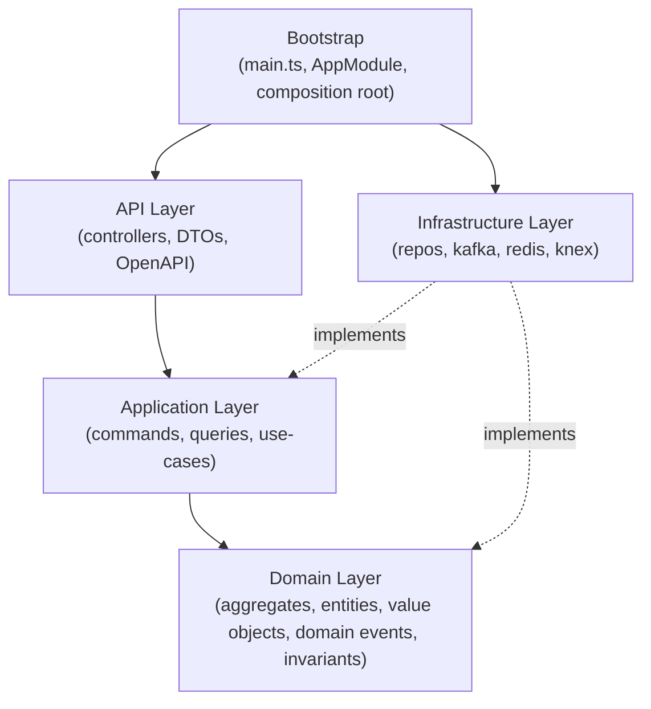

# FleetVision — Codebase Architecture

**Version:** 1.0.0
**Status:** Approved — Foundation-Aligned
**Date:** 2026-08-02
**Owner:** Chief Software Architect / Platform Engineering Lead
**Classification:** Confidential — Engineering Reference

> **About this document.** This is the **source-code structure** for FleetVision: how the repository is organized, how a single NestJS service is layered internally, how the cross-cutting Shared Kernel is factored, and where every kind of code lives — domain model, application use-cases, infrastructure adapters, API surface, tests, and configuration. It is the engineering blueprint that turns the architecture in `01_Master_Architecture.md` and the decisions in `21_Technology_Decision_Record.md` (ADR-021: Node.js LTS + NestJS + TypeScript) into a concrete, navigable codebase.
>
> **Scope.** The 18 Node.js + NestJS + TypeScript services (`01` §3, services #1–11, #13–20 minus the two Python ML tiers). The two Python services (`video-ai-engine`, `analytics-engine`) follow the same Clean Architecture layering in their own convention and live in a sibling workspace; they are noted but not the focus here.
>
> **What it is not.** This is *structure*, not implementation. Per-aggregate domain logic, schemas, and endpoints live in `docs/modules/*.md` and the bounded-context detail; this document owns the **shape** every service shares.

---

## Table of Contents

1. [Codebase Principles](#1-codebase-principles)
2. [Monorepo Structure](#2-monorepo-structure)
3. [Workspace & Tooling](#3-workspace--tooling)
4. [Service Internal Layering](#4-service-internal-layering)
5. [Domain Layer](#5-domain-layer)
6. [Application Layer](#6-application-layer)
7. [Infrastructure Layer](#7-infrastructure-layer)
8. [API Layer](#8-api-layer)
9. [Shared Kernel](#9-shared-kernel)
10. [Libraries (Cross-Cutting Packages)](#10-libraries-cross-cutting-packages)
11. [Modules (Bounded Contexts → Services)](#11-modules-bounded-contexts--services)
12. [Testing Structure](#12-testing-structure)
13. [Configuration Management](#13-configuration-management)
14. [Project Folder Tree](#14-project-folder-tree)
15. [Conventions & Guardrails](#15-conventions--guardrails)
16. [Traceability](#16-traceability)

---

## 1. Codebase Principles

| Principle | What it means in code |
|---|---|
| **Monorepo, one version of the truth** | All 20 services + shared packages live in one pnpm workspace. Shared Kernel and contracts are versioned in lockstep; no "which version of the DTO are you on?" drift. |
| **Clean Architecture layering** | Each service has four inward-dependency layers: **API → Application → Domain**, with **Infrastructure** implementing interfaces defined by the inner layers. Dependencies point inward; the Domain depends on nothing framework-specific. |
| **DDD inside the Domain layer** | Aggregates, entities, value objects, domain events, and invariants from `02_Domain_Model.md` are first-class TypeScript. One NestJS module per aggregate. |
| **NestJS modules = bounded contexts** | Each service is a NestJS app whose top-level modules map 1:1 to the aggregates of its bounded context. The framework enforces the context boundary at compile time. |
| **Contracts at the edge** | Cross-service communication is **only** via generated gRPC clients (`buf`) or Kafka Avro events. No service imports another service's internals. Shared types come from published workspace packages, never from a sibling `src/`. |
| **Explicit over implicit** | `knex` query builder (not a magic ORM); explicit repository implementations; hand-written mappers. The boilerplate *is* the boundary (ADR-021 §2.1). |
| **Config via environment, not code** | Twelve-factor; runtime config from env vars populated by ConfigMaps/Secrets. Same image runs everywhere; only config differs. |
| **Testable by construction** | Layering + dependency inversion make units testable without NestJS runtime; integration tests use Testcontainers. |
| **Strict TypeScript end-to-end** | `strict`, `strictNullChecks`, `noImplicitAny`. Shared DTO/proto types flow from `fleetvision-proto` to every service and the React/RN clients (BG-8). |

---

## 2. Monorepo Structure

A single Git repository (`fleetvision`) holds the 18 Node services, the 2 Python ML tiers, the Shared Kernel packages, the generated contracts, and the deployment manifests. pnpm workspaces manage cross-package dependencies and local linking.

```
fleetvision/
├── apps/                       # Deployable services (one per Service Registry row)
│   ├── identity-service/       # NestJS app (its own package.json + tsconfig)
│   ├── billing-service/
│   ├── audit-log-service/
│   ├── notification-service/
│   ├── fleet-management-service/
│   ├── device-management-service/
│   ├── device-gateway-service/
│   ├── telemetry-ingestion-service/
│   ├── tracking-service/
│   ├── media-service/
│   ├── media-streamer/         # media-router (infra-class; may use Pion/mediasoup bindings)
│   ├── driver-management-service/
│   ├── trip-management-service/
│   ├── vehicle-maintenance-service/
│   ├── compliance-service/
│   ├── fuel-management-service/
│   ├── asset-lifecycle-service/
│   ├── report-generation-service/
│   ├── video-ai-engine/        # Python (FastAPI) — sibling workspace
│   └── analytics-engine/       # Python (FastAPI) — sibling workspace
├── packages/                   # Shared Kernel + cross-cutting libraries (consumed by apps)
│   ├── shared-kernel/          # DDD primitives, base classes, types (§9)
│   ├── cqrs/                   # In-repo CQRS + Event Sourcing framework (ADR-001)
│   ├── event-sourcing/         # Event store, snapshot, hash-chain (audit-critical aggregates)
│   ├── bus-kafka/              # Kafka producer/consumer (kafkajs) + Avro
│   ├── bus-grpc/               # gRPC client/server (@grpc/grpc-js + buf)
│   ├── bus-rabbitmq/           # Task/work queue client (amqplib)
│   ├── persistence-knex/       # knex setup, repositories base, migrations runner
│   ├── persistence-timescale/  # Hypertable + continuous-aggregate helpers
│   ├── cache-redis/            # Redis client, latest-position store, rate-limiter
│   ├── observability/          # OpenTelemetry init, logger (pino), error envelope
│   ├── auth/                   # Auth providers, JWT/key validation, OPA client
│   ├── tenancy/                # Tenant context, derivation guard (INV-I02), middleware
│   ├── web/                    # REST primitives: JSON:API envelope, pagination, idempotency
│   ├── realtime/               # Socket.IO server wrapper + typed rooms/events (ADR-015)
│   ├── testing/                # Shared test fixtures, builders, Testcontainers harness
│   └── config/                 # Typed config loader (zod-validated env) (§13)
├── contracts/                  # Source of truth for cross-service contracts
│   ├── proto/                  # .proto definitions (buf-managed)
│   ├── asyncapi/               # AsyncAPI specs (WebSocket frames, webhook events)
│   └── avro/                   # Avro event schemas (Confluent Schema Registry)
├── generated/                  # Build output (never edited, gitignored except on release)
│   ├── ts-proto/               # buf-generated TS gRPC stubs + DTOs
│   └── ts-avro/                # @avro/types generated TS event types
├── infra/                      # Infrastructure as Code + deployment
│   ├── terraform/              # AWS resources (VPC, EKS, MSK, RDS, ElastiCache, S3)
│   ├── helm/                   # Service Helm charts (one chart per app)
│   ├── kustomize/              # Environment overlays (dev/staging/prod-*/dr)
│   └── argocd/                 # ArgoCD Application CRs + Rollout specs
├── gitops/                     # Desired-state repo content (deployed by ArgoCD)
├── tools/                      # Repo tooling (generators, linters, scripts)
│   ├── generators/             # plop/hygen scaffolds (new service, new aggregate)
│   └── ci-checks/              # custom gates: contract-drift, permission-catalog, dep-graph
├── docs/                       # In-repo engineering docs (arch diagrams, ADRs mirror)
├── .github/workflows/          # CI pipelines (build, test, scan, publish)
├── pnpm-workspace.yaml         # workspace declaration
├── package.json                # root scripts (build/test/lint/build-contracts)
├── tsconfig.base.json          # shared TS config (strict) inherited by all packages
├── buf.yaml / buf.gen.yaml     # protobuf lint + generation config
├── biome.json / .eslintrc      # linter config (see §3)
└── README.md
```

**Workspace declaration** (`pnpm-workspace.yaml`):

```yaml
packages:
  - 'apps/*'
  - 'packages/*'
  - 'generated/*'
```

Every `app` depends on the `packages/*` it needs via `workspace:*` ranges; changes to a package are picked up by consumers on the next build, with a deterministic install graph (pnpm lockfile).

---

## 3. Workspace & Tooling

| Concern | Tool | Notes |
|---|---|---|
| Package manager | **pnpm** (workspaces, content-addressable store) | Fast, strict, hardlinks; one lockfile for the whole monorepo |
| TypeScript | **TS 5.x**, `strict`, project references (`tsc --build`) | Per-package `tsconfig.json` extends `tsconfig.base.json` |
| NestJS | **NestJS** (modular, DI-first) | One app per `apps/*`; NestJS modules enforce context boundaries |
| Linting | **Biome** (primary: fast, single binary) + **ESLint** for NestJS/TypeORM-specific rules | `biome check` in pre-commit + CI |
| Formatting | **Prettier** (Biome for format where adopted) | Enforced in CI; no style debates |
| Commit hooks | **husky** + **lint-staged** | Lint + typecheck staged files |
| Contract generation | **buf** (`buf generate`) → `generated/ts-proto/` | Driven by `contracts/proto/`; CI re-generates and fails on drift |
| Event schema | **Avro** + Confluent Schema Registry | `BACKWARD_TRANSITIVE` enforced in CI (ADR-018) |
| Testing | **Jest** + **Supertest** + **Testcontainers** + **Pact** | Unit / integration / contract layers (§12) |
| Builds | **tsup** / **tsc** for packages; NestJS CLI for apps | Per-package build scripts |
| Containers | **Docker** (multi-stage; distroless final image) | One Dockerfile per app, parametrized |
| CI | **GitHub Actions** (matrix across apps/packages) | Build → test → scan → publish (per `21_TDR` §10) |
| Observability SDK | `@opentelemetry/api` + auto-instrumentations | Wrapped in `packages/observability` |

> **Why pnpm + workspaces over npm/yarn.** Strict dependency graph (no phantom deps), fast installs via the content store, and `workspace:*` ranges that resolve to local packages during dev and to published versions in CI artifacts. This is what makes "one version of the DTO" actually enforceable.

---

## 4. Service Internal Layering

Each `apps/<service>` follows the **same internal Clean Architecture** — five layers with a strict dependency rule. The rule is enforced by an ESLint boundary rule + an ArchUnit-style test (§15).



**Dependency rule:** `API → Application → Domain`. `Infrastructure` implements interfaces (ports) declared by Application/Domain and is wired at the composition root (`main.ts`). **The Domain layer imports nothing from NestJS, knex, kafka, or any framework** — it is plain TypeScript. This is what makes domain logic unit-testable without a container and portable across runtimes.

A service's `src/` mirrors these layers:

```
apps/<service>/
├── src/
│   ├── main.ts                 # bootstrap: NestFactory, OTel, config, graceful shutdown
│   ├── app.module.ts           # composition root — imports feature modules + infra modules
│   ├── api/                    # API Layer (§8)
│   ├── application/            # Application Layer (§6)
│   ├── domain/                 # Domain Layer (§5) — the heart of the service
│   ├── infrastructure/         # Infrastructure Layer (§7)
│   └── config/                 # service-specific config schema (extends packages/config)
├── test/                       # integration + e2e (unit tests live beside source)
├── Dockerfile
├── nest-cli.json
├── tsconfig.json               # extends ../../tsconfig.base.json
├── package.json                # depends on packages/* via workspace:*
└── README.md
```

---

## 5. Domain Layer

The Domain Layer encodes `02_Domain_Model.md` in TypeScript. It is **pure** — no NestJS decorators, no ORM annotations, no I/O. It owns the invariants and the ubiquitous language. One folder per aggregate; the aggregate root is the only entry point.

```
apps/<service>/src/domain/
├── <aggregate>/
│   ├── <Aggregate>.ts          # aggregate root (entity); enforces invariants
│   ├── <Entity>.ts             # internal entities (accessed only via root)
│   ├── <ValueObject>.ts        # value objects (VIN, GeoPoint, Money, Email)
│   ├── events/                 # domain events emitted by this aggregate (e.g. VehicleAdded)
│   ├── errors/                 # domain-specific errors (VehicleAlreadyAssignedError)
│   ├── repository.ts           # Repository PORT (interface) — implemented in Infrastructure
│   └── __tests__/              # unit tests (pure; no containers)
├── shared/                     # value objects + types shared across this service's aggregates
└── index.ts                    # public surface of the domain layer
```

**Example (`fleet-management-service`, `Vehicle` aggregate):**

```ts
// domain/vehicle/Vehicle.ts
import { Vin, LicensePlate, VehicleStatus } from './shared';
import { VehicleAdded, VehicleAssigned } from './events';
import { VehicleError } from './errors';

export class Vehicle {                       // aggregate root
  private constructor(                       // force creation via factory
    readonly id: VehicleId,
    private vin: Vin,
    private status: VehicleStatus,
    private fleetId: FleetId | null,
    private readonly events: DomainEvent[] = [],
  ) {}

  static add(cmd: { id: VehicleId; vin: Vin }): Vehicle {
    // INV-01 (02_Domain_Model §8): VIN globally unique — enforced by repo lookup at app layer
    const v = new Vehicle(cmd.id, cmd.vin, VehicleStatus.ACTIVE, null);
    v.raise(new VehicleAdded(v.id, v.vin));
    return v;
  }

  assignToFleet(fleetId: FleetId): void {
    if (this.fleetId !== null) throw VehicleError.alreadyAssigned(this.id);
    this.fleetId = fleetId;
    this.raise(new VehicleAssigned(this.id, fleetId));
  }
  // ... snapshot/replay for event-sourced aggregates (§event-sourcing package)
}
```

**Key rules for the Domain layer:**
- **No framework imports.** A domain file may import only other domain files or `@fleetvision/shared-kernel`. (Enforced by ESLint `no-restricted-imports`.)
- **Invariants live here.** INV-* from `02_Domain_Model.md` §8 are coded as guards in the aggregate root (e.g., VIN uniqueness precondition, HOS 11h/14h rule, behavior-score clamp).
- **Value objects, not primitives.** `Vin`, `GeoPoint`, `Money`, `Email` — typed, validated at construction, never constructed invalid.
- **One transaction = one aggregate.** A use-case loads one aggregate, mutates it, persists it, publishes its events. Cross-aggregate consistency is eventual, via events.

---

## 6. Application Layer

The Application Layer orchestrates use-cases: **commands** (write-side, CQRS) and **queries** (read-side, CQRS). It is the only layer allowed to load and persist an aggregate (via the repository port) and to publish domain events (via the event bus). It depends on the Domain Layer; it does **not** know about knex, Kafka, or Redis — those are behind ports implemented by Infrastructure.

```
apps/<service>/src/application/
├── commands/                   # write-side use-cases (one file per command)
│   ├── AssignVehicle/
│   │   ├── AssignVehicleCommand.ts
│   │   ├── AssignVehicleHandler.ts
│   │   └── AssignVehicleHandler.spec.ts
│   └── ...
├── queries/                    # read-side use-cases (return DTOs, never aggregates)
│   ├── GetVehicleById/
│   └── ListVehicles/
├── dto/                        # application DTOs (input/output shapes, independent of API DTOs)
├── ports/                      # secondary ports (interfaces) the app needs beyond the aggregate repo
│   ├── EventPublisher.ts       # implemented by bus-kafka
│   ├── Clock.ts                # testable time
│   └── OpaClient.ts            # authorization decision port
├── sagas/                      # process managers / sagas (multi-step, event-driven)
└── index.ts
```

**Example command handler:**

```ts
// application/commands/AssignVehicle/AssignVehicleHandler.ts
@Injectable()
export class AssignVehicleHandler implements ICommandHandler<AssignVehicleCommand> {
  constructor(
    private readonly vehicles: VehicleRepository,   // port from domain
    private readonly events: EventPublisher,         // port
  ) {}

  async execute(cmd: AssignVehicleCommand): Promise<void> {
    const vehicle = await this.vehicles.byId(cmd.vehicleId);   // load aggregate
    if (!vehicle) throw new NotFoundError('vehicle', cmd.vehicleId);
    vehicle.assignToFleet(cmd.fleetId);                          // domain logic + invariant
    await this.vehicles.save(vehicle);                           // transactional outbox (§7)
    await this.events.publishAll(vehicle.pullEvents());          // → Kafka via outbox relay
  }
}
```

**CQRS + Event Sourcing** (ADR-001): for event-sourced aggregates (HOS, Trip, Invoice, …), `VehicleRepository` is backed by the event store (`packages/event-sourcing`); for non-ES aggregates it is backed by knex. The application layer is identical in shape either way — the persistence strategy is an infrastructure detail.

---

## 7. Infrastructure Layer

The Infrastructure Layer implements the ports declared by Domain and Application: repositories (knex / event store), the Kafka producer (transactional outbox), Redis, gRPC clients, OPA, Vault. It is the only layer that talks to the outside world. It is composed in `main.ts` (the composition root) and injected into the application layer — never imported upward.

```
apps/<service>/src/infrastructure/
├── persistence/
│   ├── knex/                   # knex-based repositories (non-ES aggregates)
│   │   ├── KnexVehicleRepository.ts   # implements domain/vehicle/repository.ts
│   │   └── mappers/             # domain ↔ row mappers (explicit, no ORM magic)
│   ├── event-store/            # event-sourced repositories (ES aggregates, ADR-001)
│   │   └── PgEventStoreVehicleRepository.ts
│   └── read-models/            # CQRS projections (local to this service)
├── messaging/
│   ├── kafka/
│   │   ├── KafkaEventPublisher.ts       # implements ports/EventPublisher (outbox relay)
│   │   ├── KafkaConsumersModule.ts
│   │   └── handlers/                    # @KafkaHandler per consumed event
│   └── rabbitmq/
│       └── RabbitMqTaskDispatcher.ts    # transient task queue (reports, batch)
├── cache/
│   └── RedisLatestPositionStore.ts
├── clients/                    # gRPC clients to other services (buf-generated stubs)
│   └── IdentityGrpcClient.ts
├── authz/
│   └── OpaClientImpl.ts        # implements ports/OpaClient
├── secrets/
│   └── VaultSecretResolver.ts
├── observability/
│   └── PinoLogger.ts           # implements the app's Logger port
└── database/
    ├── migrations/             # Flyway-style SQL migrations (one service owns its schema)
    └── seeds/                  # dev/test seed data
```

**The transactional outbox** (ADR-002, `01` §6.1): a command's `save(aggregate)` writes the aggregate's state **and** its events to an outbox table in the **same database transaction**. A Debezium/CDC relay (or a polling publisher) ships the outbox rows to Kafka. This gives exactly-once-ish, at-least-once event publishing without distributed transactions — a command never commits its state without its events, and vice versa.

---

## 8. API Layer

The API Layer is the **inbound** surface: REST controllers (JSON:API), gRPC service implementations, Kafka consumer wiring (inbound events), and Socket.IO handlers (inbound real-time). It is thin — it translates transport into a command/query, hands it to the Application Layer, and translates the result back. **No business logic lives here.**

```
apps/<service>/src/api/
├── rest/
│   ├── controllers/            # @Controller per resource
│   │   └── VehiclesController.ts
│   ├── dto/                    # API DTOs (request/response) — separate from app DTOs
│   │   ├── VehicleResource.ts  # JSON:API resource shape
│   │   └── CreateVehicleDto.ts # zod/class-validator-validated input
│   ├── filters/                # exception → JSON:API error envelope
│   ├── interceptors/           # idempotency, ETag, pagination, request-id
│   └── middleware/             # tenant-context, auth, rate-limit
├── grpc/
│   ├── FleetGrpcService.ts     # implements generated service stubs (buf)
│   └── mappers/                # proto ↔ app DTO
├── events/                     # inbound Kafka event wiring (consumer → handler)
│   └── VehicleAddedConsumer.ts
└── realtime/                   # (services that emit) Socket.IO gateway
    └── TrackingGateway.ts
```

**API-layer guarantees (enforced by interceptors, not per-controller code):**
- **`X-Request-Id`** generated if absent, echoed on response; **W3C `traceparent`** propagated.
- **`Idempotency-Key`** required on writes → 400 if missing (ADR / `API_Design.md` §2.7).
- **ETag / `If-Match`** optimistic concurrency; **cursor pagination** on collections.
- **Tenant context** derived from the JWT (never the request body) by middleware (INV-I02).
- **Error envelope** — one exception filter maps every error to the JSON:API `errors[]` shape (`API_Design.md` §8).

---

## 9. Shared Kernel

The **Shared Kernel** (`packages/shared-kernel`) is the small, governed set of code every service depends on: DDD primitives, base types, cross-cutting value objects, and the ubiquitous-language primitives. It is **versioned in lockstep** with the services (monorepo) and changed only through an ARB deprecation cycle — because every context depends on it, a breaking change is expensive.

```
packages/shared-kernel/src/
├── domain/
│   ├── AggregateRoot.ts        # base: event collection, version, snapshot hooks
│   ├── Entity.ts
│   ├── ValueObject.ts
│   ├── DomainEvent.ts          # base event shape (CloudEvents-aligned)
│   ├── Identifier.ts           # branded id types: VehicleId, TenantId, ...
│   └── Result.ts               # never throw for expected domain outcomes
├── value-objects/
│   ├── Vin.ts                  # INV-01: validated ISO 3779
│   ├── GeoPoint.ts             # lat/lng, used by Tracking + Fleet + Media
│   ├── Money.ts                # amount + ISO 4217 currency
│   ├── TimeRange.ts
│   └── Email.ts
├── tenancy/
│   ├── TenantId.ts
│   ├── TenantContext.ts        # request-scoped tenant (derived from JWT)
│   └── TenantGuard.ts          # INV-I02 enforcement helper
├── errors/
│   ├── DomainError.ts
│   ├── ApiError.ts             # maps to JSON:API error codes
│   └── codes.ts                # canonical error-code catalog (matches API_Design §8.3)
├── types/
│   ├── pagination.ts           # Cursor, Page<T>
│   └── ids.ts
└── index.ts                    # public barrel
```

**Governance rule:** the Shared Kernel contains only concepts that are **genuinely shared** (used by 2+ contexts) and **stable** (part of the ubiquitous language). A concept that is used by one context belongs in that context's domain layer, not here. Adding to the Shared Kernel requires ARB review (per `01` §3.1 — Platform shared-kernel governance).

---

## 10. Libraries (Cross-Cutting Packages)

The other `packages/*` are cross-cutting **infrastructure and framework libraries** — concrete adapters reused by every service. Unlike the Shared Kernel (domain concepts), these are technical: each wraps a technology choice from `21_TDR` behind a stable interface.

| Package | Responsibility | Wraps | TDR ref |
|---|---|---|---|
| `@fleetvision/cqrs` | Command/query buses, decorators (`@CommandHandler`), dispatcher | NestJS CQRS pattern, in-repo | §1 (ADR-001) |
| `@fleetvision/event-sourcing` | Event store on PG, snapshot store, SHA-256 hash-chain (audit) | `knex` + PG | §2 (ADR-001) |
| `@fleetvision/bus-kafka` | Producer (transactional outbox), consumer, Avro ser/deser, dead-letter | `kafkajs` + `@avro/types` | §4 (ADR-002) |
| `@fleetvision/bus-grpc` | gRPC client/server, interceptors (auth, timeout, circuit-breaker) | `@grpc/grpc-js` + `buf` stubs | §1 (ADR-004) |
| `@fleetvision/bus-rabbitmq` | Task dispatcher, consumer, retry/DLX | `amqplib` | §4 (ADR-022) |
| `@fleetvision/persistence-knex` | knex setup, `BaseRepository`, migrations runner, PgBouncer-aware pool | `knex` + Flyway-style | §3 (ADR-021) |
| `@fleetvision/persistence-timescale` | Hypertable create, continuous-aggregate helpers, compression policy | TimescaleDB | §2 (ADR-022) |
| `@fleetvision/cache-redis` | Redis client, `LatestPositionStore`, token-revocation store, rate-limiter | `ioredis` | §5 (ADR-022) |
| `@fleetvision/observability` | OTel init, `pino` logger, error-envelope, metrics helpers | OpenTelemetry + pino | §11/§12 (ADR-011) |
| `@fleetvision/auth` | Auth providers, JWT (RS256) + API-key validation, refresh, WebAuthn | (custom + jose) | `docs/modules/Authentication` |
| `@fleetvision/tenancy` | Tenant-context middleware, derivation guard, RLS session binding | (custom) | INV-I02 |
| `@fleetvision/web` | JSON:API envelope, cursor pagination, idempotency, ETag interceptors | NestJS | `API_Design` |
| `@fleetvision/realtime` | Socket.IO server wrapper, typed rooms/events, Redis adapter | `socket.io` + adapter | §7 (ADR-015) |
| `@fleetvision/testing` | Test fixtures, object builders, Testcontainers harness, Pact setup | Jest + Testcontainers | §12 |
| `@fleetvision/config` | Typed, zod-validated env config loader | zod | §13 |

Each package exposes a NestJS **DynamicModule** so services compose them in `app.module.ts`:

```ts
// apps/tracking-service/src/app.module.ts
@Module({
  imports: [
    ConfigModule.forRoot({ load: [trackingConfig] }),     // packages/config
    LoggerModule.forRoot({ service: 'tracking-service' }), // packages/observability
    TenancyModule,                                          // packages/tenancy
    KafkaBusModule.register({ schemaRegistry: cfg.schema }),// packages/bus-kafka
    PersistenceModule.forRoot({ url: cfg.dbUrl }),          // packages/persistence-knex
    RedisModule.forRoot({ url: cfg.redisUrl }),             // packages/cache-redis
    // feature modules (domain + app + api for each aggregate)
    VehicleTrackerModule, GeofenceModule, TrackingSessionModule,
  ],
})
export class AppModule {}
```

---

## 11. Modules (Bounded Contexts → Services)

Within a service, a NestJS **feature module** packages one aggregate's domain + application + API into one cohesive unit. This is the one-to-one mapping from `02_Domain_Model.md`'s aggregates to code.

```
apps/tracking-service/src/
├── app.module.ts                         # composes feature modules + infra
├── domain/
│   ├── vehicle-tracker/                  # aggregate: VehicleTracker (ES)
│   ├── geofence/                         # aggregate: Geofence
│   ├── tracking-session/                 # aggregate: TrackingSession (ES)
│   └── shared/                           # GeoPoint, SpeedKmh, ...
├── application/
│   ├── commands/  (UpdatePosition, EnterGeofence, ...)
│   ├── queries/   (GetLatestPosition, ListPositions, ...)
│   └── ports/     (LatestPositionStore, EventPublisher, ...)
├── infrastructure/
│   ├── persistence/  (knex repos, event-store repos, read-models)
│   ├── messaging/    (kafka producers/consumers, rabbitmq tasks)
│   └── cache/        (RedisLatestPositionStore)
├── api/
│   ├── rest/   (TrackingController, geofence controllers)
│   ├── grpc/   (TrackingGrpcService)
│   ├── events/ (inbound event consumers)
│   └── realtime/ (TrackingGateway — Socket.IO)
└── config/
    └── tracking.config.ts
```

**Module composition** — each aggregate is one NestJS module exporting its public application surface:

```
domain/vehicle-tracker/
├── vehicle-tracker.module.ts        # @Module({ providers, exports })
├── application/  (commands, queries, handlers — @Injectable)
├── api/          (controllers — thin)
└── infrastructureBindings.ts        # binds ports → adapters (e.g. VehicleTrackerRepo → KnexVehicleTrackerRepository)
```

This is the **hexagonal** shape: the module declares its ports (interfaces); the infrastructure bindings (registered in `app.module.ts`) choose the adapters. Swapping knex → event-store for a given aggregate is a one-line binding change.

---

## 12. Testing Structure

Testing mirrors the architecture: **unit** tests beside source (pure, fast), **integration** tests in `test/` (with containers), **contract** tests (Pact) at the edges. The testing pyramid favors many fast unit tests over few slow e2e tests.

```
apps/<service>/
├── src/
│   └── domain/vehicle/__tests__/          # UNIT (pure domain logic; no NestJS, no DB)
│       ├── Vehicle.spec.ts
│       └── Vin.spec.ts
│   └── application/commands/.../*.spec.ts # UNIT (handlers; ports mocked)
├── test/
│   ├── integration/                       # INTEGRATION (Testcontainers: PG + Kafka + Redis)
│   │   ├── assign-vehicle.e2e-spec.ts     # full Nest app, real PG, outbox relay
│   │   └── tracking-pipeline.e2e-spec.ts
│   ├── contract/                          # CONTRACT (Pact — consumer-driven)
│   │   ├── identity-grpc.pact.spec.ts     # this service ↔ identity-service
│   │   └── kafka-events.pact.spec.ts
│   ├── api/                               # API (Supertest; JSON:API shape, errors, idempotency)
│   └── fixtures/                          # shared fixtures + builders (@fleetvision/testing)
```

| Layer | What it proves | Tools | Speed |
|---|---|---|---|
| **Unit (domain)** | Invariants hold; aggregate transitions correct | Jest (no Nest runtime) | ms |
| **Unit (application)** | Command handlers orchestrate correctly (ports mocked) | Jest | ms |
| **Integration** | The Nest app + real PG + outbox + Kafka behaves end-to-end | Testcontainers + Supertest | s |
| **Contract** | This service's gRPC/Kafka calls match the consumer's expectation | Pact | s |
| **API** | REST shape: envelope, pagination, errors, idempotency, ETag | Supertest | ms–s |

**Coverage target:** > 80% (vision §8.3). The strict layering is what makes this achievable — the Domain layer is pure and trivially unit-testable; only integration tests need containers.

---

## 13. Configuration Management

**Twelve-factor:** config lives in the environment, not in code. The same Docker image runs in dev, staging, and prod; only the env (ConfigMap/Secret) differs. Config is loaded by `@fleetvision/config` and **validated at boot by zod** — an invalid config crashes fast rather than failing mysteriously at runtime.

```
apps/<service>/src/config/
└── tracking.config.ts     # zod schema + defaults + load()
```

**Config layers** (lowest → highest precedence):

| Layer | Source | Examples |
|---|---|---|
| Image defaults | baked into code | service name, sane defaults |
| ConfigMap | Kubernetes (GitOps repo) | feature flags, topic names, timeouts, log level |
| Secret | Vault → Kubernetes Secret (External Secrets Operator) | DB url, API keys, JWT JWKS, signing keys |
| Environment overlay | GitOps overlay (`dev`/`staging`/`prod-*`) | per-env endpoints, retention, rate limits |

**Example config schema:**

```ts
// apps/tracking-service/src/config/tracking.config.ts
import { z } from 'zod';

export const trackingConfig = z.object({
  port: z.coerce.number().default(3000),
  dbUrl: z.string().url(),
  redisUrl: z.string().url(),
  schemaRegistry: z.string().url(),
  kafkaBrokers: z.array(z.string()).nonempty(),
  jwt: z.object({
    jwksUri: z.string().url(),
    issuer: z.string(),
    audience: z.string(),
  }),
  opa: z.object({ url: z.string().url() }),
  retentionDays: z.coerce.number().default(90),
  logLevel: z.enum(['trace','debug','info','warn','error']).default('info'),
});
export type TrackingConfig = z.infer<typeof trackingConfig>;
```

**Secrets** are never committed to Git. At runtime they are injected by **External Secrets Operator** (Vault → Kubernetes Secret → env var); DB credentials are **dynamic** (Vault, 24h TTL, auto-rotated) so services never see a static DB password.

**Feature flags** (tier-driven, per `docs/modules/Tenant-Management.md`) are stored in tenant config + ConfigMaps and evaluated at request time — enabling dark-launch and tier-gated rollouts independent of deploy.

---

## 14. Project Folder Tree

The complete tree (apps abbreviated; every Node service shares the same internal shape):

```
fleetvision/
├── apps/
│   ├── identity-service/            # NestJS — see §4–§8 internal structure
│   ├── billing-service/
│   ├── audit-log-service/
│   ├── notification-service/
│   ├── fleet-management-service/
│   ├── device-management-service/
│   ├── device-gateway-service/      # TCP protocol adapters (vendor binary)
│   ├── telemetry-ingestion-service/ # MQTT/TCP → Kafka normalization
│   ├── tracking-service/            # example: see §11
│   ├── media-service/
│   ├── media-streamer/              # media-router (infra-class)
│   ├── video-ai-engine/             # Python (FastAPI) — sibling workspace
│   ├── analytics-engine/            # Python (FastAPI) — sibling workspace
│   ├── driver-management-service/
│   ├── trip-management-service/
│   ├── vehicle-maintenance-service/
│   ├── compliance-service/
│   ├── fuel-management-service/
│   ├── asset-lifecycle-service/
│   └── report-generation-service/
│
├── packages/                        # Shared Kernel + cross-cutting libraries (§9, §10)
│   ├── shared-kernel/
│   ├── cqrs/
│   ├── event-sourcing/
│   ├── bus-kafka/
│   ├── bus-grpc/
│   ├── bus-rabbitmq/
│   ├── persistence-knex/
│   ├── persistence-timescale/
│   ├── cache-redis/
│   ├── observability/
│   ├── auth/
│   ├── tenancy/
│   ├── web/
│   ├── realtime/
│   ├── testing/
│   └── config/
│
├── contracts/                       # source of truth for cross-service contracts
│   ├── proto/                       #   .proto (buf-managed)
│   ├── asyncapi/                    #   WS frames, webhook events
│   └── avro/                        #   event schemas (Schema Registry)
│
├── generated/                       # buf/avro output — never hand-edited
│   ├── ts-proto/
│   └── ts-avro/
│
├── infra/
│   ├── terraform/                   # AWS (VPC, EKS, MSK, RDS, ElastiCache, S3, Route53)
│   ├── helm/                        # one chart per app
│   ├── kustomize/
│   │   ├── base/
│   │   └── overlays/{dev,staging,production-us-east-1,production-eu-west-1,dr}/
│   └── argocd/                      # Application CRs + Rollouts
│
├── gitops/                          # ArgoCD-reconciled desired state
│
├── tools/
│   ├── generators/                  # scaffolds: new-service, new-aggregate
│   └── ci-checks/                   # contract-drift, permission-catalog, dep-graph lint
│
├── docs/                            # engineering docs (architecture diagrams, runbooks)
│
├── .github/workflows/               # CI: build / test / scan / publish / deploy
│
├── pnpm-workspace.yaml
├── package.json                     # root scripts
├── tsconfig.base.json               # strict TS, inherited by all packages/apps
├── buf.yaml / buf.gen.yaml
├── biome.json
└── README.md
```

**Per-service tree (the internal shape every `apps/<service>` shares):**

```
apps/<service>/
├── src/
│   ├── main.ts                      # bootstrap (NestFactory, OTel, config, shutdown)
│   ├── app.module.ts                # composition root
│   ├── api/                         # API Layer (§8)
│   │   ├── rest/{controllers,dto,filters,interceptors,middleware}/
│   │   ├── grpc/
│   │   ├── events/                  # inbound Kafka
│   │   └── realtime/                # Socket.IO (where emitted)
│   ├── application/                 # Application Layer (§6)
│   │   ├── commands/                # write-side (CQRS)
│   │   ├── queries/                 # read-side (CQRS)
│   │   ├── dto/
│   │   ├── ports/                   # interfaces (EventPublisher, OpaClient, ...)
│   │   └── sagas/
│   ├── domain/                      # Domain Layer (§5) — pure, framework-free
│   │   └── <aggregate>/             # one folder per aggregate
│   │       ├── <Aggregate>.ts
│   │       ├── <Entity>.ts
│   │       ├── <ValueObject>.ts
│   │       ├── events/
│   │       ├── errors/
│   │       ├── repository.ts        # PORT (interface)
│   │       └── __tests__/
│   ├── infrastructure/              # Infrastructure Layer (§7) — port implementations
│   │   ├── persistence/{knex,event-store,read-models}/
│   │   ├── messaging/{kafka,rabbitmq}/
│   │   ├── cache/
│   │   ├── clients/                 # gRPC clients (buf stubs)
│   │   ├── authz/                   # OPA
│   │   ├── secrets/                 # Vault
│   │   ├── observability/
│   │   └── database/{migrations,seeds}/
│   └── config/
│       └── <service>.config.ts      # zod-validated env config (§13)
├── test/
│   ├── integration/
│   ├── contract/
│   ├── api/
│   └── fixtures/
├── Dockerfile
├── nest-cli.json
├── tsconfig.json
├── package.json                     # workspace:* deps on packages/*
└── README.md
```

---

## 15. Conventions & Guardrails

The structure above is enforced by automated guardrails, not just convention:

| Guardrail | Mechanism | Prevents |
|---|---|---|
| **Layer dependency direction** | ESLint boundary rule + ArchUnit test | API/Infra importing upward; Domain importing framework |
| **Domain purity** | `no-restricted-imports` on `src/domain/**` | Domain depending on NestJS/knex/kafka |
| **Cross-service imports forbidden** | ESLint rule (apps may not import another app's `src/`) | Hidden coupling; contract bypass |
| **Shared Kernel additions** | CODEOWNERS + ARB review on `packages/shared-kernel/**` | Uncontrolled growth of the shared core |
| **Contract drift** | `buf breaking` + `oasdiff` + Schema Registry in CI | Breaking gRPC/REST/event changes shipping |
| **Permission-catalog drift** | CI check: OpenAPI annotations ↔ `02_Domain_Model.md` §6 | Endpoint permissions diverging from IAM catalog (ARR SEC-1) |
| **Dependency-graph acyclic** | CI lint on cross-context sync calls (ADR per `01` §3.2 #3) | Sync-call cycles |
| **Config validated at boot** | zod schema in `@fleetvision/config` | Invalid config failing late |
| **No secrets in Git** | gitleaks pre-commit + CI + External Secrets Operator at runtime | Credential leakage |
| **Strict TS** | `tsconfig.base.json` (`strict`, `strictNullChecks`, `noImplicitAny`) | Silent null/any bugs |

---

## 16. Traceability

| Foundation element | This document |
|---|---|
| `21_TDR` §1 (ADR-021: Node + NestJS + TS) | §1–§4 (runtime, framework, language, layering) |
| `21_TDR` §3 (`knex`, no ORM magic) | §5, §7 (explicit repositories + mappers) |
| `21_TDR` §4 (Kafka backbone + RabbitMQ tasks) | §7 (transactional outbox + task dispatcher) |
| `21_TDR` §11/§12 (OTel + Loki) | §10 (`observability` package), §7 (logger impl) |
| `01` §3 Service Registry (20 services) | §2, §11, §14 (apps + modules) |
| `01` §3.1 (15 bounded contexts) | §11 (modules map to aggregates) |
| `01` §3.2 (boundary rules) | §1, §15 (contracts at edge; cross-service import forbidden) |
| `01` §6.1 (transactional outbox) | §7 (outbox in persistence layer) |
| `01` §7 (CQRS + Event Sourcing, ADR-001) | §6 (commands/queries), §7 (event-store repos) |
| `01` §9.2 (canonical permission catalog) | §15 (permission-catalog drift CI gate) |
| `02` (aggregates, invariants, ubiquitous language) | §5 (domain layer), §9 (shared-kernel value objects) |
| `02` §8 (INV-I02 tenant derivation) | §9 (`tenancy`), §8 (middleware), §15 |
| `API_Design` (JSON:API, idempotency, error envelope) | §8 (`web` package + interceptors/filters) |
| ADR-015 (Socket.IO canonical) | §8 (realtime), §10 (`realtime` package) |
| `00` §8.3 (> 80% coverage) | §12 (testing structure) |

---

*This Codebase Architecture defines how the FleetVision source is organized: a pnpm monorepo of 18 NestJS + TypeScript services (+ 2 Python ML tiers), each internally layered Clean-Architecture (Domain → Application → Infrastructure + API), sharing a governed Kernel and cross-cutting libraries, with contracts at every service edge and automated guardrails enforcing the structure. It implements the decisions in `21_Technology_Decision_Record.md`; the Domain Layer is the home of the `02_Domain_Model.md` aggregates and invariants in TypeScript. Reviewed by the ARB; structural changes (new layer, new shared-kernel concept, new cross-cutting package) require ARB review.*
