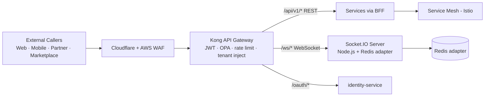
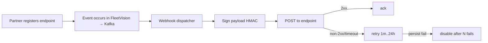

# FleetVision — API Design

**Version:** 2.0.0
**Status:** Approved — Foundation-Aligned
**Date:** 2026-08-02
**Owner:** API Platform Lead / Chief Software Architect
**Classification:** Confidential — API Reference

> **About this version.** This is the canonical **external-facing API contract reference**. It supersedes v1.0.0 and is consistent with the v2.0.0 foundation. It defines *how* every external caller — web dashboard, mobile app, partner system, marketplace integration — talks to the platform across all transports: REST, real-time (WebSocket), and event-driven (webhooks). Internal inter-service gRPC contracts and Kafka event schemas live in `01_Master_Architecture.md` §5–§6 and `02_Domain_Model.md` §5; this document owns the **public edge** behind the Kong API Gateway. v2.0.0 resolves: ARR API-1 (auth path `/api/v1/auth` separated from `/api/v1/iam`), ARR ARCH-3 (Socket.IO canonical per ADR-015 — SignalR dropped as a primary surface), ARR SEC-1 (permission catalog drift — endpoints reference the canonical `02_Domain_Model.md` §6 catalog).

---

## Table of Contents

1. [API Architecture](#1-api-architecture)
2. [REST API](#2-rest-api)
3. [WebSocket API (Socket.IO — canonical)](#3-websocket-api-socketio--canonical)
4. [Authentication](#4-authentication)
5. [Versioning](#5-versioning)
6. [Rate Limiting](#6-rate-limiting)
7. [Webhooks](#7-webhooks)
8. [Errors & Status Codes](#8-errors--status-codes)

---

## 1. API Architecture

### 1.1 Edge Topology

All external API traffic enters through one edge — **Kong Enterprise 3.x** (`01_Master_Architecture.md` §2, §9). Kong terminates TLS, validates JWTs, enforces rate limits and OPA policies, injects tenant context, and routes to the appropriate BFF or service.



### 1.2 Transport Inventory

| Transport | Path prefix | Encoding | Use |
|---|---|---|---|
| **REST / JSON** | `/api/v1/*` | JSON:API | CRUD, commands, queries |
| **WebSocket (Socket.IO)** | `/ws/*` | JSON frames | real-time push (positions, alerts, video signaling) |
| **Webhooks** | (outbound) | JSON (CloudEvents) | event delivery to partner endpoints |
| **gRPC** | (mesh-internal) | Protobuf | service-to-service — *not* public |
| **MQTT v5 / vendor TCP** | (device-only) | binary | IoT device telemetry — *not* public (`docs/modules/DeviceGateway.md`) |

### 1.3 Design Principles

| Principle | Practice |
|---|---|
| **API-first** | OpenAPI specs are the source of truth; code is contract-tested against them. No endpoint ships without a spec. |
| **Resource-oriented REST** | Nouns not verbs; standard HTTP methods; predictable plurals. |
| **Stateless** | Every request carries everything needed (JWT, tenant, idempotency). |
| **Consistent errors** | One error envelope, one set of error codes. |
| **Idempotent writes** | All mutations accept `Idempotency-Key`. |
| **Versioned & backward-compatible** | Additive changes only within a major version. |
| **Fail closed** | Auth ambiguity → deny; quota ambiguity → deny. |
| **Observable** | Every request gets `X-Request-Id`; propagated end-to-end. |

### 1.4 Spec Registry

| Spec | Format | Repo | CI gate |
|---|---|---|---|
| Public REST | OpenAPI 3.1 | `fleetvision-api/openapi/` | `spectral` lint + `oasdiff` breaking-change |
| gRPC | protobuf | `fleetvision-proto` | `buf` lint + `buf breaking` |
| Events (webhook + Kafka) | AsyncAPI 3.0 + Avro | `fleetvision-events/` | Schema Registry `BACKWARD_TRANSITIVE` |
| Permissions | CSV (from OpenAPI annotations) | derived | must match `02_Domain_Model.md` §6 catalog (drift = build fail) |

The **Developer Portal** (Swagger/Stoplight) publishes the OpenAPI spec, an interactive Try-It playground, and webhook/event docs — the public face of the *Openness* pillar.

---

## 2. REST API

### 2.1 Conventions

| Concern | Standard |
|---|---|
| **Base URL** | `https://api.fleetvision.example` (region-pinned: `eu.api.`, `ap.api.`) |
| **Path style** | `/api/v1/<plural-resource>[/<id>][/<sub-resource>]` |
| **Casing** | `kebab-case` paths; `camelCase` JSON bodies |
| **Methods** | `GET` (read), `POST` (create/action), `PUT` (replace), `PATCH` (partial), `DELETE` |
| **Content type** | `application/json` (JSON:API media type `application/vnd.api+json`) |
| **Date/time** | RFC 3339 UTC (`2026-08-02T14:30:00Z`) |
| **IDs** | UUID v7 (string); opaque to clients |
| **Money** | `{ "amount": "12.50", "currency": "USD" }` (string amount, ISO 4217) |
| **Coordinates** | `{ "latitude": 40.71, "longitude": -74.00 }` |
| **Pagination** | Cursor-based (`page[next]` token) |
| **Filtering** | Query params; RSQL for complex (`?filter=status==active,fleetId=in=(a,b)`) |
| **Sorting** | `?sort=-createdAt,vin` (leading `-` = desc) |
| **Field selection** | `?fields=vin,status,driver` |
| **Expansion** | `?include=driver,fleet` |

### 2.2 Standard Headers

**Request:**

| Header | Required | Purpose |
|---|---|---|
| `Authorization: Bearer <jwt>` | yes (or API key) | Access token (§4) |
| `X-Tenant-Id` | auto (from JWT) | **Derived from token; clients MUST NOT set** (INV-I02 anti-forgery) |
| `X-Request-Id` | optional | Tracing (server generates if absent) |
| `Idempotency-Key` | on writes | Safe retries (§2.7) |
| `If-Match: "<etag>"` | on conditional writes | Optimistic concurrency |
| `Accept-Language` | optional | i18n |

**Response:**

| Header | Purpose |
|---|---|
| `X-Request-Id` | Echoed for tracing |
| `X-RateLimit-Limit` / `-Remaining` / `-Reset` | Quota (§6) |
| `ETag` | Resource version |
| `Retry-After` | On 429/503 |
| `Deprecation` / `Sunset` / `Link` | Versioning (§5) |

### 2.3 Request / Response Envelope (JSON:API)

**Success — single resource:**
```json
{
  "data": {
    "id": "550e8400-...", "type": "vehicle",
    "attributes": { "vin": "1HGCM8…", "status": "ACTIVE" },
    "relationships": {
      "fleet": { "data": { "type": "fleet", "id": "660e…" } }
    }
  },
  "meta": { "requestId": "req-…", "version": "1.0" }
}
```

**Error** (see §8): one `errors[]` array.

### 2.4 Resource Patterns

- **Collection** `GET /vehicles` (paginated); **Item** `GET /vehicles/{id}`.
- **Create** `POST /vehicles` → `201` + `Location`.
- **Update** `PATCH /vehicles/{id}` (partial) / `PUT` (full).
- **Delete** `DELETE /vehicles/{id}` → `204` (soft-delete where applicable).
- **Action** `POST /vehicles/{id}:dispatch` (Google AIP `:verb` for custom methods — used sparingly).
- **Async op** → `202 Accepted` + `Location` of a job (`/jobs/{id}`); poll or webhook.

### 2.5 Pagination

**Cursor-based** (stable under insertion, cheap at scale):

```
GET /vehicles?sort=-createdAt&page[size]=25

200 OK
Link: <…?page[size]=25&page[cursor]=eyJ0…>; rel="next"
{ "data":[ … ], "meta": { "page": { "size":25, "cursor":"eyJ0…", "hasMore":true } } }
```

Cursors opaque, base64-encoded. Max page size 100 (default 25). Bulk export uses async jobs, not large pages.

### 2.6 Conditional Requests

- **ETag** on every GET; `If-None-Match` → `304 Not Modified` when unchanged.
- **Optimistic concurrency**: `If-Match: "<etag>"` on writes → `412 Precondition Failed` on mismatch (backed by aggregate `version`).

### 2.7 Idempotency

All writes accept `Idempotency-Key` (client UUID). Gateway/services cache `(key, tenantId, requestHash) → response` for 24h. Retry with same key returns original response. Body-hash mismatch on same key → `409` (surfaces client bugs).

### 2.8 Long-Running Operations (Async)

```http
POST /api/v1/reports/generate  → 202 Accepted, Location: /api/v1/reports/jobs/{jobId}
GET  /api/v1/reports/jobs/{jobId}
→ 200 { "data": { "id":"…", "status":"RUNNING", "progress":0.42 } }
GET  /api/v1/reports/jobs/{jobId}
→ 200 { "data": { "id":"…", "status":"SUCCEEDED", "resultUrl":"https://…signed…" } }
```

Job statuses: `PENDING | RUNNING | SUCCEEDED | FAILED | CANCELLED`.

### 2.9 CORS

Allowed origins are tenant-configured (Enterprise tenants register app origins). Preflight (`OPTIONS`) at Kong. Credentials allowed; `Authorization` gated.

### 2.10 OpenAPI Snippet

```yaml
openapi: 3.1.0
info: { title: FleetVision API, version: 1.0.0 }
servers:
  - url: https://api.fleetvision.example
components:
  securitySchemes:
    bearerAuth: { type: http, scheme: bearer, bearerFormat: JWT }
    apiKey:     { type: apiKey, in: header, name: X-Api-Key }
paths:
  /vehicles:
    get:
      parameters:
        - { in: query, name: filter, schema: { type: string } }
        - { in: query, name: page[size], schema: { type: integer, maximum: 100 } }
      responses: { '200': { … }, '401': { … } }
      security: [ { bearerAuth: [], apiKey: [] } ]
```

---

## 3. WebSocket API (Socket.IO — canonical)

**Socket.IO** (Node.js, Redis adapter for multi-pod fan-out) is the platform's **canonical real-time transport** for browser and mobile clients (`01_Master_Architecture.md` §2, §5; ADR-015). It carries live positions, alerts, video signaling, and command acknowledgements.

> **Note on SignalR (resolves ARR ARCH-3).** v1.0.0 presented SignalR as a peer surface. Per ADR-015, **Socket.IO is the sole primary real-time transport**. .NET partner integrations consume real-time via **webhooks** + REST + the official **.NET SDK** (which wraps the Socket.IO client) — no ASP.NET Core / SignalR runtime is introduced. This restores polyglot discipline (ADR-006: Kotlin + Go + Python only).

### 3.1 Endpoint

```
wss://api.fleetvision.example/ws/<namespace>
  namespaces: /tracking  /media  /notifications  /fleet
```

### 3.2 Connection & Authentication

```
1. Client: io("wss://…/tracking", { auth: { token: "<jwt>" }, transports: ["websocket"] })
2. Server middleware: verify JWT (RS256; exp/iss/aud), extract tenantId/userId/roles.
3. On connect: socket.join(`tenant:<tenantId>`).
```

Access tokens expire (15-min TTL). On expiry → server emits `error: { code: "TOKEN_EXPIRED" }`; client refreshes (`docs/modules/Authentication.md` §6.2) and reconnects. 5s grace prevents disconnect flapping.

### 3.3 Message Envelope

```json
{ "type": "position.update", "id": "evt-uuid", "data": { … }, "reply_to": "msg-uuid" }
```

### 3.4 Namespaces & Rooms

| Namespace | Room granularity | Example events |
|---|---|---|
| `/tracking` | `tenant:<t>`, `fleet:<f>`, `vehicle:<v>` | `position.update`, `geofence.alert`, `session.state` |
| `/media` | `tenant:<t>`, `vehicle:<v>`, `stream:<s>` | `stream.offer`, `ice.candidate`, `recording.status`, `ai.alert` |
| `/notifications` | `user:<u>`, `tenant:<t>` | `alert.raised`, `alert.acknowledged` |
| `/fleet` | `tenant:<t>`, `fleet:<f>` | `vehicle.state`, `quota.warning` |

### 3.5 Client → Server Events

| Event | Payload | Ack | Authz |
|---|---|---|---|
| `subscribe` | `{ room: "fleet:<id>" }` | yes | OPA checks RBAC for the room scope |
| `unsubscribe` | `{ room }` | yes | |
| `stream.subscribe` | `{ vehicleId, channelId, quality }` (`/media`) | yes → opens live view | `media.video.live` |
| `playback.open` | `{ recordingId }` | yes → returns manifest | `media.video.read` |
| `acknowledge` | `{ alertId }` | yes | per-alert scope |

### 3.6 Server → Client Events

| Event | When |
|---|---|
| `position.update` | new position (batched ≤ 10/s per client) |
| `geofence.alert` | enter/exit/dwell |
| `alert.raised` | any domain alert (from Alarm Engine) |
| `stream.offer` / `ice.candidate` | WebRTC signaling |
| `recording.status` | recording lifecycle |
| `ai.alert` | video AI detection |
| `quota.warning` | usage approaching limit |
| `error` | transport/subscription error |

### 3.7 Freshness, Back-Pressure & Batching

- Subscribed to a large fleet, a client would be flooded; server **batches** position updates (≤ 10/s/client) and **server-side clusters** markers > 2,000 visible.
- Slow consumers: adapter drops oldest after watermark → client sees `state: degraded`, never a stall.
- Heartbeat: Socket.IO ping/pong (25s); missed → reconnect.

### 3.8 Reconnection

Automatic reconnection with exponential backoff + jitter (1s → … → 30s cap). On reconnect, server replays room subscriptions (tracked per session, 30s grace) — brief network blip doesn't drop the fleet view.

### 3.9 Sample — Subscribe to Fleet Live Positions

```js
const sock = io("wss://api.fleetvision.example/tracking", {
  auth: { token: accessToken }, transports: ["websocket"]
});
sock.emit("subscribe", { room: `fleet:${fleetId}` }, (ack) => { if (ack.ok) … });
sock.on("position.update", (m) => updateMarker(m.data.vehicleId, m.data.lat, m.data.lng));
```

---

## 4. Authentication

API authentication follows `docs/modules/Authentication.md` (the authoritative auth module). What an **API caller** needs to know:

### 4.1 Auth Schemes by Caller

| Caller | Scheme |
|---|---|
| End-user (web/mobile) | OAuth2 Authorization Code + PKCE → JWT access + refresh |
| Partner / 3rd-party server | OAuth2 Client Credentials → JWT, OR API Key |
| Marketplace app (on behalf of user) | OAuth2 Authorization Code (user-consented scopes) |
| Internal service | mTLS (SPIFFE) + service JWT (not public) |
| IoT device | X.509 mTLS (MQTT/TCP — `docs/modules/DeviceGateway.md`) |

### 4.2 OAuth2 + OIDC

FleetVision is an OAuth2 Authorization Server and OIDC Provider (Keycloak 24). Grants:

| Grant | Use |
|---|---|
| `authorization_code` + **PKCE** (S256) | SPA, mobile, marketplace — PKCE mandatory for public clients |
| `client_credentials` | machine-to-machine partners |
| `refresh_token` | obtain new access token (rotated, reuse-detected) |
| `password` / `implicit` | **Disabled** (OAuth 2.0 Security BCP) |

Discovery: `GET /.well-known/openid-configuration`. JWKS: `GET /.well-known/jwks.json`.

### 4.3 API Keys (Simple Partner Access)

```
GET /api/v1/vehicles
X-Api-Key: fv_live_a1b2c3d4…
```

Tenant-scoped, role-bound, rotatable, rate-limited. Argon2id-hashed; plaintext shown once. **90-day rotation default, 365-day absolute max** (resolves ARR SEC-7).

### 4.4 JWT — Claims

Access token (RS256, 15-min TTL): `iss`, `sub`, `aud`, `exp`, `iat`, `nbf`, `jti`, `tenant_id`, `tenant_tier`, `scope`, `roles`, `aal`, `session_id`, `auth_time`, `amr`.

**Resource-server validation (per `docs/modules/Authentication.md` §6.3):** signature (RS256, JWKS), `exp`/`nbf`/`iat`, `iss`, `aud`, then Redis revocation (`revocation:<jti>`, `revocation:user:<sub>`). Any failure → `401` generic (no oracle).

### 4.5 Refresh Token

Opaque, rotating, reuse-detected (7-day TTL). On every refresh, new token issued + old revoked; reuse of consumed → entire family revoked.

### 4.6 Scopes vs Permissions

OAuth2 **scopes** (coarse, consented) vs RBAC **permissions** (fine-grained, per-request via OPA). A request satisfies **both**: scope limits the surface; RBAC limits the action.

### 4.7 Authorization (Per-Request)

After authN, Kong + services call **OPA** (`docs/modules/Authentication.md` §7) with `{ subject, action, resource, context }`. Default-deny. Permissions from the canonical catalog (`02_Domain_Model.md` §6).

### 4.8 Security Practices

TLS 1.3 everywhere; HSTS; no plain HTTP. `Idempotency-Key` required on writes. `state` + PKCE mandatory. Strict redirect-URI allowlist. Tokens never in URLs; refresh tokens in HttpOnly cookies (web) / secure storage (mobile). `Cache-Control: no-store` on token responses.

---

## 5. Versioning

### 5.1 Strategy

| Surface | Strategy | Mechanism |
|---|---|---|
| REST | **URI major version** (`/api/v1/`) + additive minor | path segment; `Accept` for media-type variant |
| gRPC | package suffix (`.v1`) | `buf breaking` enforces |
| Events / Webhooks | event-type suffix (`.v1`) + Avro `BACKWARD_TRANSITIVE` | Schema Registry |
| WebSocket | namespace suffix where needed (e.g., `/tracking/v2`) | rare |

### 5.2 Compatibility Rules (within a major version)

| Change | Allowed? |
|---|---|
| Add optional field / endpoint / enum value / optional request param | ✅ |
| Change field semantics / remove / rename / narrow acceptance / change type / change error status | ❌ breaking |

Breaking → new major version → **ship both in parallel** during a 12-month deprecation window.

### 5.3 Deprecation & Sunset

```
HTTP/1.1 200 OK
Deprecation: true
Sunset: Sun, 31 May 2027 00:00:00 GMT
Link: </api/v2/vehicles>; rel="successor-version"
```

- `Deprecation` marks the old version deprecated; `Sunset` announces removal (≥ 12 months out).
- Both versions run in parallel until sunset.
- Removal announced via email + Developer Portal banner + webhooks (`api.version.deprecated.v1`).

### 5.4 Stability Tiers

| Tier | Meaning |
|---|---|
| **GA (stable)** | backward-compatible within major; production-ready |
| **Beta** | stable surface, may evolve; small breaking changes with notice |
| **Experimental** | `X-FleetVision-Experimental: true` header; can break anytime |

---

## 6. Rate Limiting

Implemented at Kong (token bucket per consumer) + per-service Redis counters for fine-grained limits. Protects the platform and enforces **fair use**.

### 6.1 Dimensions

| Dimension | Example |
|---|---|
| Per consumer (API key / user) | "1000 req/min for this key" |
| Per tenant | aggregate tenant ceiling |
| Per IP (anonymous / login) | brute-force protection |
| Per route | expensive endpoints (replay, export) tighter |
| Per surface | REST vs real-time vs webhook-delivery |

### 6.2 Default Limits by Tier

| Surface | Standard | Professional | Enterprise |
|---|---|---|---|
| REST API (req/min) | 1,000 | 10,000 | custom |
| Real-time subscriptions (concurrent rooms) | 20 | 100 | custom |
| WebSocket connections (concurrent) | 5 | 25 | custom |
| Live video streams (concurrent) | 5 | 50 | 500 |
| Webhook delivery throughput (events/sec) | 50 | 500 | custom |
| Async jobs (concurrent) | 2 | 10 | custom |

### 6.3 Expensive-Endpoint Limits

| Endpoint | Limit (Professional) | Why |
|---|---|---|
| `GET /tracking/.../history` (long range) | 60/min | Timescale scan |
| `POST /reports/generate` | 10/min | heavy job |
| `GET /media/.../timeline` (7-day) | 30/min | multi-source merge |
| `POST /tracking/replay` | 30/min | replay builder |

### 6.4 Auth-Surface Limits (Anti-Abuse)

| Surface | Limit | Algorithm |
|---|---|---|
| `POST /auth/login` per IP | 10/min | sliding window |
| `POST /auth/login` per user | 5/min | sliding window |
| `POST /oauth/token` per client | 30/min | token bucket |
| `POST /auth/forgot-password` per email | 3/hour | fixed window |
| `POST /auth/refresh` per user | 30/min | sliding window |

### 6.5 Headers

```
X-RateLimit-Limit:     1000
X-RateLimit-Remaining: 942
X-RateLimit-Reset:     1690972800     (unix epoch)
```

On exhaustion:

```
HTTP/1.1 429 Too Many Requests
Retry-After: 28

{ "errors": [{ "status":"429","code":"RATE_LIMITED", "detail":"Limit 1000/min. Retry in 28s.",
  "meta": { "limit":1000, "window":"60s", "retryAfter":28 } }] }
```

### 6.6 Strategy & Back-Pressure

- **Token bucket** for REST (allows bursts up to 2× sustained).
- **Sliding window** for auth (precise abuse protection).
- Quotas (daily/monthly) tracked in Redis atomic counters by `billing-service`.
- Quota breach → `402 Payment Required` or `403` with upgrade guidance.
- Gateway soft back-pressure: degraded downstream → `503` + `Retry-After` (SDKs back off).

---

## 7. Webhooks

Webhooks deliver **domain events** to partner endpoints over HTTP POST — the *outbound* event surface. Event names/payloads align with `02_Domain_Model.md` §5 and the Event Catalog (`04_Event_Catalog.md`, planned).

### 7.1 Lifecycle



### 7.2 Subscription Model

- Subscribe by **event type** or wildcard: `fleet.vehicle.created`, `tracking.geofence.*`, `*.incident.*`.
- Per-endpoint secret (HMAC signing).
- Per-endpoint optional custom headers (partner auth).

### 7.3 Payload (CloudEvents v1.0)

```http
POST https://partner.example/fv HTTP/1.1
Content-Type: application/json
Ce-Specversion: 1.0
Ce-Type: tracking.geofence.entered.v1
Ce-Source: /tracking-service
Ce-Id: evt-550e8400-…
Ce-Time: 2026-08-02T14:30:00Z
Ce-Tenant: 770e8400-…
X-FleetVision-Signature: t=1690972200,v1=8c4f…
X-FleetVision-Delivery: dlvr-9b3f…

{
  "specversion": "1.0",
  "type": "tracking.geofence.entered.v1",
  "source": "/tracking-service",
  "id": "evt-550e8400-…",
  "time": "2026-08-02T14:30:00Z",
  "data": { "vehicle_id":"550e…","tenant_id":"770e…","geofence_id":"880e…",
            "geofence_name":"Depot-North","position":{ "latitude":40.71,"longitude":-74.00 } }
}
```

### 7.4 Signature Verification

HMAC-SHA256 over raw body with timestamp (replay protection). Partners verify:

```
header: X-FleetVision-Signature: t=<unix_ts>,v1=<hex_hmac>
expected = HMAC_SHA256(secret, "<t>.<raw_body>")
valid    = constant_time_equal(expected, v1)
fresh    = abs(now - t) < 5min
```

### 7.5 Dual-Secret Rotation (resolves ARR SEC-4)

Each endpoint supports **two concurrent secrets** (primary + secondary) with a configurable overlap. Partners rotate by adding new → verifying → removing old. Zero-downtime rotation; no verification gap.

### 7.6 Delivery Semantics

| Property | Guarantee |
|---|---|
| Ordering | **at-least-once**; best-effort per-event-type + `entity_id` partition key |
| Dedup | partners dedup by `Ce-Id` (event id) |
| Retries | `1m, 5m, 15m, 1h, 6h, 24h` (6 attempts); then dead-letter + disable |
| Timeout | 10s connect, 30s read |
| Expected response | any `2xx` |

### 7.7 Health & Replay

- `GET /webhooks/endpoints/{id}/health` → last delivery, success rate, last error.
- `POST /webhooks/endpoints/{id}/replay` → re-deliver events in a range (partner self-service, gated).
- Dead-letter queue viewable in Admin Panel; manual redelivery per event.

### 7.8 Management API

| Method | Endpoint | Purpose |
|---|---|---|
| `GET` / `POST` | `/webhooks/endpoints` | List / register |
| `PATCH` / `DELETE` | `/webhooks/endpoints/{id}` | Update / remove |
| `POST` | `/webhooks/endpoints/{id}/test` | Send test event |
| `GET` | `/webhooks/endpoints/{id}/deliveries` | Delivery history |
| `POST` | `/webhooks/endpoints/{id}/replay` | Replay a range |
| `GET` | `/webhooks/event-types` | Catalog of subscribable events |

---

## 8. Errors & Status Codes

### 8.1 HTTP Status Codes Used

| Code | Meaning | When |
|---|---|---|
| `200 OK` | success (read, update) | |
| `201 Created` | resource created | `POST` collection |
| `202 Accepted` | async op started | long-running jobs |
| `204 No Content` | success, no body | delete, action |
| `304 Not Modified` | cached/ETag match | conditional GET |
| `400 Bad Request` | malformed (decode/schema) | |
| `401 Unauthorized` | no/invalid token | |
| `403 Forbidden` | token valid, no permission (OPA deny) | |
| `404 Not Found` | resource unknown / out-of-scope | |
| `409 Conflict` | state conflict / duplicate / version | |
| `412 Precondition Failed` | `If-Match` ETag mismatch | optimistic concurrency |
| `422 Unprocessable Entity` | semantic validation failure | |
| `429 Too Many Requests` | rate limit | |
| `451 Unavailable for Legal Reasons` | compliance block (legal hold) | |
| `5xx` | server error | never disclose internals |

> **404 vs 403:** a resource the caller isn't authorized to see returns `404`, not `403` — to avoid leaking existence (resource enumeration protection).

### 8.2 Error Envelope

```json
{
  "errors": [
    {
      "id": "err-uuid",
      "status": "422",
      "code": "VALIDATION_FAILED",
      "title": "Validation failed",
      "detail": "vin must be 17 characters",
      "source": { "pointer": "/data/attributes/vin" },
      "meta": { "requestId": "req-…", "timestamp": "2026-08-02T14:30:00Z" }
    }
  ]
}
```

### 8.3 Common Error Codes

| `code` | HTTP | Meaning |
|---|---|---|
| `UNAUTHENTICATED` | 401 | Missing/invalid token |
| `PERMISSION_DENIED` | 403 | OPA deny |
| `NOT_FOUND` | 404 | Resource unknown / out-of-scope |
| `VALIDATION_FAILED` | 422 | Schema/semantic validation |
| `CONFLICT` | 409 | State/version conflict |
| `PRECONDITION_FAILED` | 412 | ETag/If-Match mismatch |
| `RATE_LIMITED` | 429 | Rate limit |
| `QUOTA_EXCEEDED` | 402/403 | Tenant quota |
| `IDEMPOTENCY_REPLAY` | 409 | Same key, different body hash |
| `INTERNAL` | 500 | Unexpected (requestId in body) |
| `SERVICE_UNAVAILABLE` | 503 | Degraded / back-pressure |

---

## Appendix A: Cross-Surface Event Name Matrix

The same domain events surface across Kafka (internal), WebSocket (real-time clients), and Webhooks (partner callbacks). Names aligned (per `02_Domain_Model.md` §5, ADR-016):

| Event (Avro type) | WebSocket (`type`) | Webhook (`Ce-Type`) |
|---|---|---|
| `tracking.position.received.v1` | `position.update` | `tracking.position.received.v1` |
| `tracking.geofence.entered.v1` | `geofence.alert` | `tracking.geofence.entered.v1` |
| `tracking.speed.exceeded.v1` | `alert.raised` | `tracking.speed.exceeded.v1` |
| `tracking.behavior.event.v1` | `alert.raised` | `tracking.behavior.event.v1` |
| `media.ai.alert.v1` | `ai.alert` | `media.ai.alert.v1` |
| `media.recording.completed.v1` | `recording.status` | `media.recording.completed.v1` |
| `compliance.hos.violation.detected.v1` | `alert.raised` | `compliance.hos.violation.detected.v1` |
| `billing.quota.exceeded.v1` | `quota.warning` | `billing.quota.exceeded.v1` |
| `notification.alert.raised.v1` | `alert.raised` | `notification.alert.raised.v1` |

## Appendix B: Header Glossary

| Header | Direction | Purpose |
|---|---|---|
| `Authorization` | req | `Bearer <jwt>` |
| `X-Api-Key` | req | API-key auth (partner) |
| `X-Request-Id` | both | tracing |
| `Idempotency-Key` | req | safe retries (writes) |
| `If-Match` / `If-None-Match` | req | optimistic concurrency / cache |
| `ETag` | resp | resource version |
| `X-RateLimit-*` | resp | quota |
| `Retry-After` | resp | back-off hint (429/503) |
| `Deprecation` / `Sunset` / `Link` | resp | versioning |
| `Ce-*` | both | CloudEvents (webhooks) |
| `X-FleetVision-Signature` | outbound | webhook HMAC |
| `traceparent` | both | W3C trace context |
| `Accept-Language` | req | i18n |

## Appendix C: Traceability

| Foundation Element | This Document |
|---|---|
| `00` Openness pillar (integrations, API) | §1, §7 |
| `00` Trust pillar (auth, rate limit) | §4, §6 |
| `01` §2 Kong + Socket.IO | §1.1, §3 |
| `01` §5 Communication patterns | §2, §3 |
| `01` §6 Event architecture (CloudEvents, ADR-016) | §7, Appendix A |
| `01` §9 Security (TLS, JWT, OPA) | §4 |
| `02` §5 Domain events | §7, Appendix A |
| `02` §6 Permission catalog (canonical) | §4.7 |
| `docs/modules/Authentication.md` (OAuth2, OIDC, JWT, refresh) | §4 |
| ARR API-1, ARCH-3, SEC-1, SEC-4, SEC-7 | Resolved in v2.0.0 |
| ADR-004 (gRPC+Kafka), ADR-009 (Keycloak+OPA), ADR-012 (URI versioning), ADR-015 (Socket.IO canonical), ADR-016 (naming) | Throughout |

---

*This API Design document is the canonical contract reference for FleetVision's public API surface. Paired with the OpenAPI/AsyncAPI/proto specs (source of truth for code) and the Developer Portal. Reviewed by the ARB; breaking changes require a new major version + 12-month deprecation window.*
