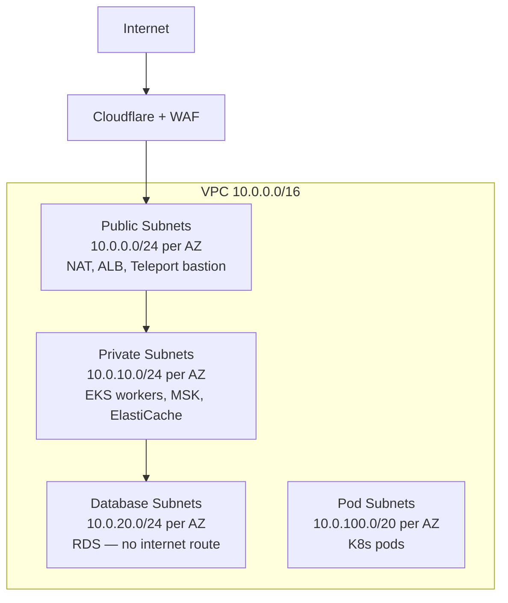
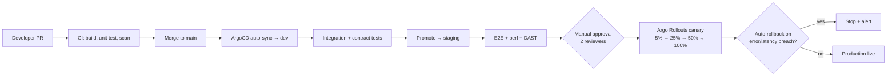
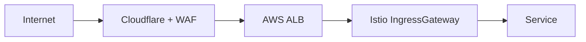
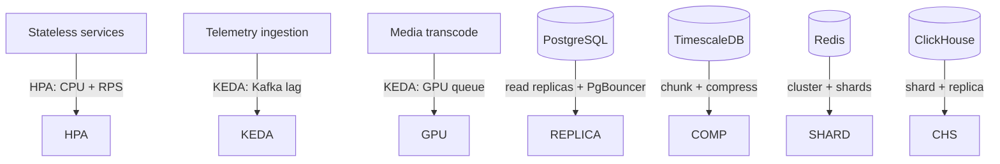
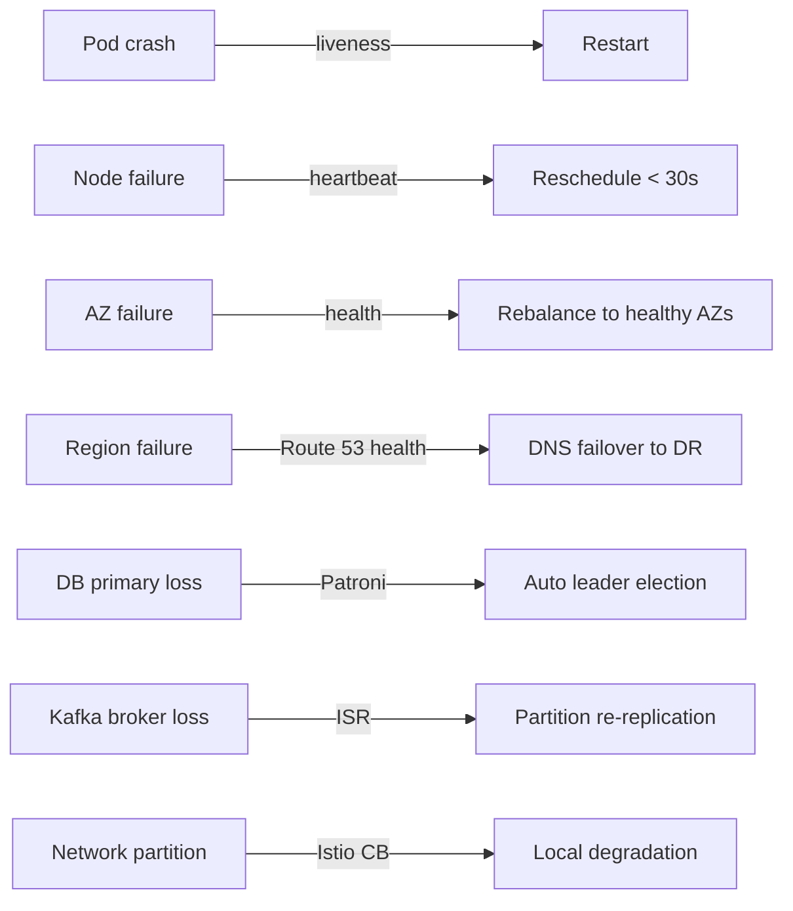

# FleetVision — Deployment & Runtime Architecture

**Version:** 2.0.0
**Status:** Approved — Foundation-Aligned
**Date:** 2026-08-02
**Owner:** SRE Lead / Platform Engineering Lead
**Classification:** Confidential — Infrastructure Reference

> **About this document.** This is the canonical **deployment, runtime, and environment strategy** for FleetVision. It defines how the platform is built, deployed, promoted across environments, scaled, recovered, and operated — the foundation beneath the 20+ microservices described in `docs/modules/`. It elaborates `01_Master_Architecture.md` §10 (Deployment) and §12 (Scaling) into a single operational reference and conforms to ADR-005 (Istio), ADR-010 (GitOps/ArgoCD), ADR-011 (OpenTelemetry observability).

---

## Table of Contents

1. [Deployment Philosophy](#1-deployment-philosophy)
2. [Cloud & Cluster Topology](#2-cloud--cluster-topology)
3. [Environments](#3-environments)
4. [GitOps Delivery Pipeline](#4-gitops-delivery-pipeline)
5. [Container & Image Strategy](#5-container--image-strategy)
6. [Configuration & Secrets](#6-configuration--secrets)
7. [Networking & Service Mesh](#7-networking--service-mesh)
8. [Autoscaling](#8-autoscaling)
9. [Disaster Recovery](#9-disaster-recovery)
10. [Release Management](#10-release-management)

---

## 1. Deployment Philosophy

| Principle | Practice |
|---|---|
| **GitOps** | The desired state of every environment lives in Git; ArgoCD reconciles continuously. No `kubectl apply` to prod. |
| **Progressive delivery** | Every production change ships via canary (Argo Rollouts); auto-rollback on SLO breach. |
| **Immutable infrastructure** | Containers are immutable; config via env/configmaps; no SSH to prod. |
| **Reversible by default** | Every deploy must be rollback-able within 5 minutes. |
| **Zero-downtime** | Rolling updates + PDBs + readiness gates; no maintenance windows for application deploys. |
| **Policy as code** | Admission controllers (OPA Gatekeeper, Kyverno) enforce standards before apply. |
| **Capacity headroom** | 2× above projected peak; load-tested at 10× before milestones (`00_Project_Vision.md` §9). |

---

## 2. Cloud & Cluster Topology

### 2.1 Cloud Provider

**Primary: AWS (Year 1–2).** Architecture is cloud-agnostic by design (Kubernetes-native, managed-service-abstracted) for Azure/GCP portability if a major customer requires it.

### 2.2 Multi-Region Strategy

| Phase | Regions | Strategy |
|---|---|---|
| Year 1 | `us-east-1` | Single region, multi-AZ |
| Year 3 | + `eu-west-1` | Active-active for EU tenants (data residency) |
| Year 5 | + `ap-southeast-1`, `us-west-2` (DR) | Global active-active + DR |

**Data residency:** EU tenant data never leaves `eu-west-1`. Routing is tenant-aware at the API Gateway via `tenant_id → region` lookup.

### 2.3 Network Topology (per region)



Security groups: `sg-alb` (443 from 0.0.0.0/0); `sg-app` (from sg-alb + mTLS); `sg-db` (5432 from sg-app only); `sg-kafka` (9092 from sg-app, 9093 inter-broker).

### 2.4 Managed Services Used

| Need | AWS Service | Rationale |
|---|---|---|
| Kubernetes | EKS | Managed control plane; multi-AZ |
| Relational DB | RDS for PostgreSQL 16 | Multi-AZ, automated backups, PITR |
| Kafka | MSK | Managed brokers; Schema Registry compatible |
| Cache | ElastiCache (Redis 7) | Managed cluster mode |
| Object storage | S3 | Durable, cheap, lifecycle |
| Search | OpenSearch Service | Managed ES-compatible |
| Secrets | self-hosted Vault on EKS | Cross-cloud portability |
| CDN/WAF | Cloudflare + AWS WAF | Best-of-breed edge |
| DNS | Route 53 | Health-check failover |
| Analytics OLAP | self-hosted ClickHouse on EKS | Better cost/perf than Redshift at our workload |

---

## 3. Environments

### 3.1 Environment Catalog

| Env | Cluster | Purpose | Data | Promotion |
|---|---|---|---|---|
| `local` | Kind / Minikube | Dev | in-memory / stubbed | — |
| `ci` | Ephemeral K3s | Integration tests | ephemeral | auto-destroy |
| `dev` | Shared EKS | Feature dev | synthetic | auto on merge |
| `staging` | Dedicated EKS | Pre-prod | anonymized prod subset | auto on main |
| `production` | EKS Multi-AZ | Live traffic | real | manual + canary |
| `dr` | EKS (passive, paired region) | Disaster recovery | replicated | mirror prod |

### 3.2 Environment Parity

`staging` ≈ `production` in topology, services, config shape, observability, and scale-class (smaller capacity but same architecture). Data is an anonymized prod subset (refreshed nightly). This parity catches integration issues that low-fidelity `dev` cannot.

### 3.3 Tenant Isolation in Environments

- `dev` / `staging`: shared clusters, namespace isolation per environment + per test-tenant.
- `production`: shared cluster (Standard/Professional tenants via RLS/schema); Enterprise tenants get dedicated namespaces (`tenant-<id>`) or, for the largest, dedicated node pools.
- `dr`: mirrors prod topology; tenant data replicated per backup policy (`09_Disaster_Recovery`).

---

## 4. GitOps Delivery Pipeline

### 4.1 Pipeline (PR → Prod)



### 4.2 GitOps Repo Layout

```
fleetvision-gitops/
├── base/                      # Kustomize base (common)
│   ├── identity-service/
│   ├── tracking-service/
│   └── ...
├── overlays/
│   ├── dev/                   # dev-specific patches
│   ├── staging/
│   ├── production-us-east-1/
│   ├── production-eu-west-1/
│   └── dr/
└── argocd-apps/               # ArgoCD Application CRs
```

ArgoCD watches this repo; `production-us-east-1/` is the source of truth for that environment. Drift detection alerts if cluster state diverges.

### 4.3 Promotion Model

- **dev ← main:** every merge auto-syncs to dev (fast feedback).
- **staging ← main:** auto-promoted when main is green; staging always tracks latest main.
- **production ← explicit:** a PR to `overlays/production-*/` (updating image tag) is the deploy act; 2-reviewer approval; ArgoCD syncs; Argo Rollouts runs the canary.

### 4.4 Rollback

- **Application rollback:** Argo Rollouts `abort` + `promote` to previous ReplicaSet; < 5 min.
- **Git rollback:** revert the image-tag PR; ArgoCD syncs the previous state.
- **Data rollback:** forward-only migrations (`03_Database_Architecture.md` §11); emergency PITR via WAL-G (30-day) as last resort.

---

## 5. Container & Image Strategy

### 5.1 Base Images

| Runtime | Base image | Notes |
|---|---|---|
| Kotlin / JVM 21 | `eclipse-temurin:21-jre-alpine` | JRE only; distroless where possible |
| Go | `gcr.io/distroless/static` | static binary; tiny |
| Python | `python:3.12-slim` | multi-stage build |
| Node.js (BFF/Socket.IO) | `node:20-alpine` | |

### 5.2 Image Build

- Multi-stage builds; final image contains binary + CA certs only (no shell, no package manager where feasible).
- **Signed images** (cosign / Sigstore); admission policy rejects unsigned images.
- **Scanned** (Trivy / Snyk) in CI; CVEs above threshold block promotion.
- **Image registry:** ECR per region; cross-region replication for DR.

### 5.3 Image Naming & Tagging

```
{registry}/fleetvision/{service}:{semver}-{git-sha}
e.g., 702937292887.dkr.ecr.us-east-1.amazonaws.com/fleetvision/tracking-service:2.3.1-a1b2c3d
```

Semantic version + git SHA → traceable from running pod → commit. `:latest` forbidden.

---

## 6. Configuration & Secrets

### 6.1 Twelve-Factor Config

All runtime config via environment variables (populated from ConfigMaps / Secrets), never baked into images. Same image runs across all environments; only config differs.

### 6.2 Config Layers

| Layer | Source | Examples |
|---|---|---|
| Image defaults | baked | service name, defaults |
| ConfigMap | GitOps repo | feature flags, topic names, timeouts |
| Secret | Vault via External Secrets Operator | DB passwords, API keys, signing keys |
| Environment overlay | GitOps overlay | per-env endpoints, log levels |

### 6.3 Secrets Management

- **HashiCorp Vault** (self-hosted on EKS) is the system of record.
- **External Secrets Operator** syncs Vault → Kubernetes Secrets (never committed to Git).
- **Dynamic DB credentials** (24h TTL, auto-rotated) — services never see static DB passwords.
- **Signing keys** (JWT, webhook HMAC) in Vault Transit (keys never leave).
- **Access:** services auth to Vault via Kubernetes service account JWT (OIDC auth).

### 6.4 Feature Flags

Tier-driven feature flags (per `docs/modules/Tenant-Management.md`) stored in tenant config + ConfigMaps; evaluated at request time. Allows dark-launching and tier-gated rollouts independent of deploy.

---

## 7. Networking & Service Mesh

### 7.1 Istio Service Mesh (ADR-005)

- **Ambient mode** (sidecar-less L4; L7 where needed) — lower resource overhead.
- **mTLS strict** between every service; no plaintext in-cluster.
- **AuthorizationPolicy** per service (default-deny; explicit allow).
- **NetworkPolicy** deny-all default at namespace level.
- **SPIFFE/SPIRE** workload identity for mTLS cert issuance.

### 7.2 Ingress



Cloudflare terminates edge TLS + WAF; ALB → Istio IngressGateway → service. Internal mTLS from gateway onward.

### 7.3 Namespace Topology

| Namespace | Contents |
|---|---|
| `platform-infra` | Istio, Vault, cert-manager, ArgoCD |
| `gateway` | Kong, EMQX, Socket.IO, device-gateway |
| `fleet-core` | 14 core business services |
| `fleet-data` | ingestion, analytics, report-gen, media-server |
| `monitoring` | OTel collector, Loki, Jaeger, AlertMgr |
| `argocd` | GitOps controllers |
| `tenant-<id>` | (optional) Enterprise tenant isolation |

Each namespace: ResourceQuota, LimitRange, NetworkPolicy. Each service: HPA/KEDA, PDB (min 2), ServiceAccount, mTLS.

---

## 8. Autoscaling

### 8.1 Scaling Mechanisms by Layer



| Layer | Mechanism | Trigger | Target |
|---|---|---|---|
| Stateless services | HPA (CPU/RPS) | CPU > 70% | 2–20 pods |
| Telemetry ingestion / streaming | **KEDA** (Kafka lag) | lag > 10K | 5–50 pods |
| Media GPU transcode | KEDA (NVENC util) | NVENC > 70% | GPU pool |
| API Gateway | HPA | RPS per pod | 3–15 pods |
| Kafka | Partition count (static, sized up-front) | throughput/partition > 70% | add partitions (rare; ordering caveat) |
| PostgreSQL | Read replicas + PgBouncer | Read QPS | add replicas |
| TimescaleDB | Hypertable compression + chunking | Storage growth | auto-compress after 7d |
| Redis | Cluster mode + sharding | Memory > 80% | add shards |
| ClickHouse | Sharded + replicated | Query latency | add shards/replicas |
| WebSocket | Horizontal + Redis adapter | Connections | 50K conns/node |

### 8.2 Cluster Autoscaler

- **Karpenter** (preferred) for fast node provisioning; bin-packs pods; handles GPU/special node pools.
- Node pools: system (m6i.xlarge), general (m6i.2xlarge), memory (r6i.2xlarge), compute (c6i.2xlarge), gpu (g5.xlarge).
- **Spot Instances** for interruption-tolerant workloads (ingestion, analytics, batch) — 60–70% savings; stateful services on On-Demand/Reserved.

### 8.3 Pod Disruption Budgets

Stateful: `minAvailable: 2`. Stateless: `maxUnavailable: 1`. Goal: zero-downtime during node drains / cluster upgrades.

### 8.4 Back-Pressure (When Capacity Exhausted)

Per `01_Master_Architecture.md` §12.3:
1. Consumer lag rises → KEDA scales up.
2. Still saturated → Kafka buffers (7-day retention).
3. Kafka disk > 80% → shed non-critical (defer analytics rollups).
4. **Real-time tracking never shed** — highest priority.

---

## 9. Disaster Recovery

### 9.1 DR Targets (from `01_Master_Architecture.md` §12.3)

| Component | SLA | RPO | RTO | Strategy |
|---|---|---|---|---|
| Platform (overall) | 99.95% → 99.99% | < 1 min | < 15 min | Multi-AZ + DR region |
| API services | 99.99% | 0 (stateless) | < 5 min | K8s rescheduling |
| Real-time tracking | 99.99% | < 30 s | < 5 min | Active replicas + Redis failover |
| PostgreSQL | 99.99% | < 1 min | < 5 min | Streaming replication + Patroni |
| Kafka | 99.99% | < 1 min | < 3 min | Multi-AZ RF=3, MirrorMaker to DR |
| Redis | 99.95% | < 30 s | < 2 min | Cluster + AOF persistence |
| ClickHouse | 99.9% | < 5 min | < 10 min | Replicated tables across AZs |
| S3 | 99.99% | < 15 min | < 5 min | Cross-region replication |

### 9.2 Backup Strategy

| Store | Method | Frequency | Retention |
|---|---|---|---|
| PostgreSQL | WAL-G (continuous WAL + daily base) | Continuous | 30 days + PITR |
| TimescaleDB | WAL-G | Daily | 30 days |
| MongoDB | mongodump | Daily | 30 days |
| Redis | RDB snapshots | Every 15 min | 7 days |
| ClickHouse | Backup to S3 | Daily | 30 days |
| Kafka | RF=3 + S3 sink | Continuous | 90 days |
| S3 | Cross-region replication | Continuous | per policy |

### 9.3 Failure Modes & Automated Response



### 9.4 DR Testing

| Test | Frequency | Scope |
|---|---|---|
| Component failover | Monthly | RDS, Redis, single Kafka broker |
| AZ simulation | Quarterly | Terminate all nodes in one AZ |
| Full region failover | Semi-annually | Complete failover to DR + failback |
| Chaos engineering | Weekly | Random pod kills, latency injection (Litmus) |

---

## 10. Release Management

### 10.1 Canary Strategy (Argo Rollouts)

Every production deploy is a canary:

```
5% (5 min, monitor error/latency) → 25% (5 min) → 50% (5 min) → 100%
```

Auto-rollback if:
- Error rate > 2× baseline
- P99 latency > SLO
- Specific health-check failures

### 10.2 SLO-Based Rollback Guard

The rollout controller watches Prometheus SLOs (`01_Master_Architecture.md` §14). Burn-rate spikes during canary → automatic abort. This makes canaries objective, not opinion-based.

### 10.3 Release Cadence

| Service class | Cadence |
|---|---|
| Core services (fleet, tracking, IAM, etc.) | weekly+ (on demand) |
| Data services (ingestion, analytics) | weekly |
| Hotfix (critical bug/security) | anytime; expedited canary (5% → 100% faster) |
| Infra (mesh, DB versions) | monthly; longer canary |

Target: **20+ deploys/week** across the platform (vision metric, `00_Project_Vision.md` §8.3); **< 5% change failure rate**.

### 10.4 Blue/Green for Risky Changes

Database version upgrades, mesh upgrades, and major runtime upgrades use **blue/green**: stand up the new stack alongside; cut over via routing; keep old as fallback for 24h; decommission.

### 10.5 Change Management

- Every prod change is a Git PR (auditable).
- Production-deploy PRs require 2 reviewers + CI green.
- Sev incidents trigger automated postmortem within 48h; action items tracked to closure.

---

## Appendix A: Node Pool Sizing (Year 1 baseline)

| Pool | Instance | Count | Workload |
|---|---|---|---|
| system | m6i.xlarge | 3 | Istio, cert-manager, ArgoCD |
| general | m6i.2xlarge | 5 | core API services |
| memory | r6i.2xlarge | 3 | Redis, analytics, ingestion |
| compute | c6i.2xlarge | 2 | report-gen, batch |
| gpu | g5.xlarge | 1 | ML inference, video transcode |

Scales with platform growth; 2× headroom maintained; rebalanced quarterly against actuals.

## Appendix B: Operational KPIs

| KPI | Target |
|---|---|
| Deployment frequency | 20+ / week |
| Change failure rate | < 5% |
| MTTR (deploy-related) | < 60 min |
| Lead time (PR → prod) | < 24h (median) |
| Prod rollback rate | < 5% of deploys |
| Canary auto-rollback catch rate | 100% of SLO-breaching canaries |

## Appendix C: Traceability

| Foundation Element | This Document |
|---|---|
| `00` §8 Scale/Quality targets (availability, deploy freq, MTTR) | §8, §10, Appendix B |
| `00` §9 Guardrails (2× headroom, 10× load test) | §1, §8 |
| `01` §10 Deployment architecture | throughout |
| `01` §11 Cloud architecture | §2 |
| `01` §12 Scaling | §8 |
| `01` §13 DR | §9 |
| `01` §14 Observability | §10 (rollback guard) |
| ADR-005 (Istio), ADR-010 (GitOps/ArgoCD), ADR-011 (OTel) | throughout |

---

*This Deployment document is the canonical runtime & delivery reference. It is reviewed quarterly by the ARB and SRE. Detailed runbooks live in the SRE wiki; this document owns the architecture.*
