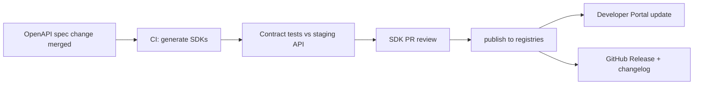

# FleetVision — SDK Platform

**Version:** 2.0.0
**Status:** Approved — Foundation-Aligned
**Date:** 2026-08-02
**Owner:** Developer Experience Lead / API Platform Lead
**Classification:** Confidential — Developer Reference

> **About this document.** This is the canonical **SDK strategy and contract reference** for FleetVision's official client libraries. It defines which SDKs exist, what they encode (auth, retries, pagination, types, webhooks), how they are generated from the OpenAPI/proto specs, and how they version. The SDKs are the *Simplicity* pillar's developer-adoption lever: a partner who installs `@fleetvision/api` and is making authenticated calls in 5 minutes is a partner who ships an integration.

---

## Table of Contents

1. [SDK Strategy](#1-sdk-strategy)
2. [Official SDK Matrix](#2-official-sdk-matrix)
3. [Generation vs Hand-Written](#3-generation-vs-hand-written)
4. [Cross-Cutting Features](#4-cross-cutting-features)
5. [Authentication in SDKs](#5-authentication-in-sdks)
6. [Real-Time (Socket.IO) in SDKs](#6-real-time-socketio-in-sdks)
7. [Webhook Verification in SDKs](#7-webhook-verification-in-sdks)
8. [Versioning & Release](#8-versioning--release)
9. [Developer Portal](#9-developer-portal)

---

## 1. SDK Strategy

### 1.1 Why Official SDKs

FleetVision's API is large (15 bounded contexts, hundreds of endpoints), authenticated (OAuth2 + API key), rate-limited, paginated, and real-time (WebSocket). Without official SDKs, every partner reimplements:
- OAuth2 token refresh logic (subtle, error-prone)
- Exponential backoff on 429/5xx
- Cursor pagination iteration
- Webhook HMAC verification
- WebSocket room subscription

The result is brittle integrations, security bugs (token handling), and slow time-to-integrate. Official SDKs encode best practices once, in each language, and let partners focus on business logic.

### 1.2 Goals & Non-Goals

| Goals | Non-Goals |
|---|---|
| One SDK per major ecosystem, idiomatic | Supporting every language (community can wrap) |
| Generated from OpenAPI (single source of truth) | Hiding the REST surface (SDKs mirror the API) |
| Encode auth, retries, pagination, types | Becoming an ORM or full framework |
| Webhook verifier in every SDK | Hosting partner apps |
| Real-time client (Socket.IO) where idiomatic | Mobile UI widgets (frontend owns) |

### 1.3 Design Principles

| Principle | Practice |
|---|---|
| **Idiomatic** | TypeScript feels like TypeScript; Python like Python. No generic "API client" feel. |
| **Typed** | First-class types from OpenAPI; no `any` / `Object`. |
| **Thin over magic** | SDKs mirror the API; no hidden caching, state machines, or "smart" behavior. |
| **Configurable** | Timeouts, retries, logging, base URL, transport — all overridable. |
| **Observable** | Every call carries `X-Request-Id`; pluggable logger; W3C `traceparent`. |
| **Fail loud** | Errors are typed exceptions; never silent. |

---

## 2. Official SDK Matrix

| Language | Package | Surfaces | Status | Repo |
|---|---|---|---|---|
| **TypeScript** | `@fleetvision/api` | REST + Socket.IO + Webhooks verifier | GA | `fleetvision-sdks/typescript` |
| **Python** | `fleetvision` | REST + Webhooks verifier | GA | `fleetvision-sdks/python` |
| **.NET** | `FleetVision.Client` | REST + Socket.IO client + Webhooks verifier | GA | `fleetvision-sdks/dotnet` |
| **Go** | `fleetvision/go` | REST + Webhooks verifier | Beta | `fleetvision-sdks/go` |
| **Java / Kotlin** | `com.fleetvision:client` | REST | Beta | `fleetvision-sdks/java` |
| **Mobile (RN plugin)** | `@fleetvision/mobile` | REST + Socket.IO (driver-app bundle) | GA | bundled in driver-app SDK |

> **Note (resolves ARR ARCH-3).** The .NET SDK ships a **Socket.IO client wrapper** (not SignalR) — consistent with ADR-015 (Socket.IO canonical). .NET partners get native real-time without FleetVision running ASP.NET Core.

### 2.1 Distribution

| Language | Registry |
|---|---|
| TypeScript | npm |
| Python | PyPI |
| .NET | NuGet |
| Go | pkg.go.dev (module) |
| Java/Kotlin | Maven Central |

---

## 3. Generation vs Hand-Written

| Layer | Source | Mechanism |
|---|---|---|
| **REST clients** | OpenAPI 3.1 | `openapi-generator` per language (TS: `axios`+`query`; Python: `httpx`; .NET: `HttpClient`; Go: net/http; Java: `RestTemplate`/`WebClient`) |
| **Models / types** | OpenAPI schemas | Generated (Zod in TS; dataclasses in Python; POCOs in .NET; structs in Go) |
| **gRPC clients** (internal) | `.proto` | `buf` generated stubs (internal only; not in public SDKs) |
| **Auth / retries / pagination / webhooks / Socket.IO** | hand-written | convenience layer atop generated client |

The split: **generated = boilerplate (models, endpoints, serialization)**; **hand-written = best-practice (auth, resilience, iteration)**. Generated code is never edited; hand-written code wraps it.

---

## 4. Cross-Cutting Features

Every SDK implements these identically (semantic parity is tested):

| Feature | Behavior |
|---|---|
| **Base URL / region** | configurable; auto-region routing |
| **Auth** | OAuth2 client-credentials + authorization-code+PKCE helpers; auto-refresh on 401; API-key option (§5) |
| **Retries** | exponential backoff + full jitter on `429`/`5xx` (default 3, configurable); respects `Retry-After` |
| **Idempotency** | auto-`Idempotency-Key` on writes unless caller provides one |
| **Pagination** | async iterators / generators over cursor pages (`for await ... of`) |
| **Errors** | typed exceptions per `code`; surfaces `requestId` |
| **Timeouts** | configurable (default 30s) |
| **Logging / tracing** | pluggable logger; propagates `X-Request-Id`, W3C `traceparent` |
| **Typed responses** | first-class types; no `any` |
| **User-agent** | `fleetvision-{lang}/{sdkVersion} ({runtime})` — for attribution + support |

### 4.1 Retry Policy (Codified)

```
on 429 / 5xx (transient):
  retry up to maxRetries (default 3)
  backoff: exponential (base 200ms, factor 2) + full jitter
  respect Retry-After header if present
  do NOT retry on 4xx (except 429) — caller bug
on network error:
  retry up to maxRetries with same backoff
```

### 4.2 Error Types

Every SDK exposes typed errors mapping the API `code` catalog (`API_Design.md` §8.3): `AuthenticationError`, `PermissionDeniedError`, `NotFoundError`, `ValidationError`, `ConflictError`, `RateLimitError` (with `.retryAfter`), `QuotaExceededError`, `ApiError` (generic 5xx).

---

## 5. Authentication in SDKs

### 5.1 Auth Provider Abstraction

```ts
interface AuthProvider {
  getAccessToken(): Promise<string>;   // returns valid token; refreshes if needed
}
```

Built-in providers:

| Provider | Use |
|---|---|
| `ClientCredentialsAuthProvider` | machine-to-machine (server SDK) |
| `AuthorizationCodeAuthProvider` | user-facing apps (PKCE handled) |
| `ApiKeyAuthProvider` | simple partner access |
| `StaticTokenAuthProvider` | testing / already-have-a-token |

### 5.2 Auto-Refresh

The SDK intercepts `401` responses, invokes the auth provider's refresh once, retries the original request. If refresh fails, surfaces `AuthenticationError`. Concurrent requests during refresh coalesce (one refresh, many waiting).

### 5.3 Token Storage

| Platform | Storage |
|---|---|
| Node.js / server | in-memory + optional callback (e.g., Redis for distributed) |
| Browser | refresh token in HttpOnly cookie (set by `/auth/refresh`); access in memory |
| Mobile | OS keychain / keystore |
| Tests | in-memory |

The SDK never logs tokens; redacts `Authorization` from request logs.

---

## 6. Real-Time (Socket.IO) in SDKs

TypeScript, .NET, and the mobile plugin ship a Socket.IO client wrapper exposing the platform's real-time surface (`API_Design.md` §3) with typed events.

### 6.1 Typed Event Subscription

```ts
const rt = fv.realtime;   // Socket.IO wrapper

// Typed subscription
const unsub = rt.tracking.subscribeToFleet(fleetId, {
  onPositionUpdate: (m: PositionUpdate) => updateMarker(m),
  onGeofenceAlert:  (m: GeofenceAlert)  => onGeofence(m),
});
unsub();   // clean teardown
```

### 6.2 Auto-Reconnect

The wrapper configures Socket.IO's auto-reconnect (exponential backoff + jitter), re-subscribes to rooms after reconnect (the platform replays subscriptions within 30s grace), and exposes connection state via an observable/callback.

### 6.3 Languages Without Socket.IO SDK

Python, Go, Java SDKs are **REST + Webhooks only** — partners in those ecosystems wanting real-time use webhooks (push) or poll. (Rationale: Socket.IO's ecosystem is JS/TS-first; non-JS Socket.IO clients are less mature; webhooks cover the push use case idiomatically.)

---

## 7. Webhook Verification in SDKs

Every SDK ships a `Webhooks` verifier implementing the canonical HMAC-SHA256 + timestamp scheme (`API_Design.md` §7.4). Implementations are identical across languages (tested against the same vectors):

```ts
import { Webhooks } from "@fleetvision/api";
const wh = new Webhooks(secret);
const event = wh.verify(rawBody, headers);   // throws on bad signature / replay
// event.type, event.data, …
```

```python
from fleetvision import Webhooks
wh = Webhooks(secret)
event = wh.verify(raw_body, headers)   # raises on failure
```

The verifier also supports **dual-secret rotation** (`API_Design.md` §7.5): pass both secrets; either validates.

---

## 8. Versioning & Release

### 8.1 SDK ↔ API Version Alignment

| API major | SDK major | Example |
|---|---|---|
| `/api/v1/` | `@fleetvision/api@1.x` | v1 SDK ↔ v1 API |
| `/api/v2/` (future) | `@fleetvision/api@2.x` | v2 SDK ↔ v2 API |

Within a major: SDK minor releases follow additive API changes; SemVer. The SDK targets the **latest API major** by default; older SDK majors remain supported during the API's deprecation window.

### 8.2 Release Process



- **Contract tests (Pact-style):** every SDK verified against the API's OpenAPI before publish; breaking-API-change detection (`oasdiff`) blocks.
- **Changelog:** generated per release; migration guide per minor/major.
- **Cadence:** minor releases follow API additive changes (weekly+); patch for SDK bugs.

### 8.3 Deprecation

When API v1 sunsets (`API_Design.md` §5.3):
1. SDK v1 marked deprecated (npm deprecation notice; compiler warning).
2. Migration guide published.
3. SDK v1 unsupported after API v1 sunset (≥ 12 months).

### 8.4 Stability Tiers (Mirror API)

| SDK surface | Tier |
|---|---|
| REST methods for GA endpoints | GA |
| REST methods for Beta endpoints | Beta (marked in docs + types) |
| Real-time wrappers | GA (TS/.NET) |
| Experimental methods (`x-experimental`) | Experimental (opt-in flag) |

---

## 9. Developer Portal

The **Developer Portal** ties SDK + API together: OpenAPI browser, interactive Try-It, auth-flow walkthrough, webhook simulator, SDK quickstarts, status/uptime. It is the public face of the *Openness* pillar.

### 9.1 Quickstart (5-Minute Goal)

Each SDK has a 5-minute quickstart: install → authenticate → first call → first webhook. The bar is "a developer with no prior FleetVision knowledge makes their first authenticated API call within 5 minutes."

### 9.2 Examples Catalog

- **TypeScript:** server-to-server (client-credentials); browser app (auth-code + PKCE); live map (Socket.IO); webhook receiver.
- **Python:** data export script; webhook receiver (Flask).
- **.NET:** partner integration (client-credentials); real-time dashboard (Socket.IO).
- **Go:** batch import; webhook receiver.

### 9.3 Postman / Bruno Collection

Auto-generated from OpenAPI; published alongside the SDKs for exploratory testing.

---

## Appendix A: Cross-Language Feature Parity Matrix

| Feature | TS | Python | .NET | Go | Java |
|---|---|---|---|---|---|
| REST client (generated) | ✅ | ✅ | ✅ | ✅ | ✅ |
| Typed models | ✅ | ✅ | ✅ | ✅ | ✅ |
| OAuth2 client-credentials | ✅ | ✅ | ✅ | ✅ | ✅ |
| OAuth2 auth-code + PKCE | ✅ | ✅ | ✅ | ✅ | ✅ |
| API key auth | ✅ | ✅ | ✅ | ✅ | ✅ |
| Auto-refresh on 401 | ✅ | ✅ | ✅ | ✅ | ✅ |
| Retries w/ backoff | ✅ | ✅ | ✅ | ✅ | ✅ |
| Cursor pagination iterator | ✅ | ✅ | ✅ | ✅ | ✅ |
| Auto-Idempotency-Key | ✅ | ✅ | ✅ | ✅ | ✅ |
| Typed errors | ✅ | ✅ | ✅ | ✅ | ✅ |
| Webhook verifier | ✅ | ✅ | ✅ | ✅ | ✅ |
| Socket.IO real-time | ✅ | — | ✅ | — | — |
| Pluggable logger | ✅ | ✅ | ✅ | ✅ | ✅ |

## Appendix B: Code Samples

### TypeScript

```ts
import { FleetVision } from "@fleetvision/api";

const fv = new FleetVision({
  baseUrl: "https://api.fleetvision.example",
  auth: { type: "clientCredentials", clientId: "…", clientSecret: "…" },
});

// REST — typed, paginated
for await (const v of fv.vehicles.list({ filter: "status==active" })) {
  console.log(v.vin);
}

// Create — idempotent by default
const trip = await fv.trips.create({ vehicleId: "…", driverId: "…" });

// Real-time
const sub = await fv.realtime.tracking.subscribeToFleet(fleetId);
sub.on("position.update", (m) => updateMarker(m));

// Webhook verification
import { Webhooks } from "@fleetvision/api";
const wh = new Webhooks(secret);
const event = wh.verify(rawBody, headers);
```

### Python

```python
from fleetvision import FleetVision, errors

fv = FleetVision(base_url="…", api_key="fv_live_…")
try:
    for v in fv.vehicles.list(filter="status==active"):
        print(v.vin)
except errors.RateLimitError as e:
    wait = e.retry_after
```

### .NET

```csharp
var fv = new FleetVisionClient(new Uri("https://api.fleetvision.example"), apiKey);
var vehicles = await fv.Vehicles.ListAsync(filter: "status==active");

// Real-time (Socket.IO wrapper)
var conn = fv.RealTime.Connect(accessToken);
conn.On<PositionUpdate>("position.update", m => Dispatcher.Invoke(() => UpdateMarker(m)));
await conn.StartAsync();
await conn.InvokeAsync("SubscribeAsync", $"fleet:{fleetId}");
```

## Appendix C: Traceability

| Foundation Element | This Document |
|---|---|
| `00` Openness pillar (integrations, marketplace) | §1, §9 |
| `00` Simplicity pillar (developer adoption) | §1.1, §9.1 |
| `01` §5 Communication (REST + Socket.IO + webhooks) | §2, §6, §7 |
| `01` §6 Event-driven (CloudEvents, ADR-016) | §7 |
| `docs/modules/API_Design.md` (canonical API contract) | throughout |
| `docs/modules/Authentication.md` (OAuth2, JWT, refresh) | §5 |
| ARR ARCH-3 (.NET real-time via Socket.IO wrapper, not SignalR) | §2 note, §6 |

---

*This SDK Platform document defines the official client libraries. The OpenAPI/AsyncAPI/proto specs are the source of truth; SDKs are generated from them and published to language registries. Reviewed by the ARB; SDK majors track API majors.*
